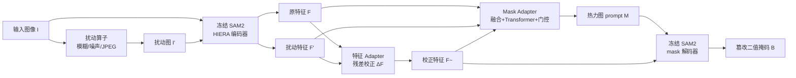

# Detective SAM: Adaptive AI-Image Forgery Localization

**会议**: ICLR 2026  
**OpenReview**: [https://openreview.net/forum?id=GKJHPHNFIx](https://openreview.net/forum?id=GKJHPHNFIx)  
**代码**: 已开源（GitHub，含预训练权重 + AutoEditForge + 评测脚本）  
**领域**: 图像伪造定位 / AIGC 篡改检测 / 分割  
**关键词**: Image Forgery Localization, SAM2, Diffusion Edit, Adapter, 持续微调, 数据生成  

## 一句话总结
在 SAM2 之上挂一组轻量 adapter，把"扰动后特征分布漂移"这个取证线索自动转成热力图 prompt 去分割扩散编辑的篡改区域，再配一条 AutoEditForge 自动造数据流水线，让定位器能持续追上不断更新的图像编辑模型。

## 研究背景与动机
**领域现状**：图像伪造定位（IFL）要做的不是判断图像真假，而是像素级地圈出"哪里被改过"。传统方法靠相机/JPEG 压缩等取证痕迹去抓拼接（splicing）和复制粘贴（copy-move），在老式 PS 篡改上很好用。

**现有痛点**：扩散模型时代的局部编辑（替换/删除/添加物体）是用生成过程"重画"出来的，本身语义连贯、逼真自然，根本没有相机或压缩留下的传统痕迹，legacy 方法直接失效。新的扩散数据集上定位精度大幅下降；更糟的是生成模型几个月更新一代（DALL-E → FLUX → QWEN → NanoBanana），是个不断移动的靶子。

**核心矛盾**：作者把现有 IFL 系统的三个顽疾说得很清楚——① 现有方法不太用能刻画现代编辑的取证线索，浪费了基础模型里的先验；② 架构层面缺乏一种能"快速吸收新编辑数据、又不灾难性遗忘"的高效适配机制；③ 系统在新发布的强编辑器上会塌方，需要持续刷新训练/评测数据。

**本文目标**：做一个既能用上扩散特有取证线索、又能轻量持续微调、还自带数据补给的实用 IFL 框架。

**核心 idea**：**取证信号自动 prompt 化** —— 基础模型（SAM2 的 HIERA 编码器）对输入做高斯模糊/噪声/JPEG 等扰动后，扩散编辑区域的 embedding 会发生可观测的分布漂移；把这种漂移当作"被改在哪里"的定位先验，转成一张热力图自动喂给 SAM2 的解码器，再用轻量 adapter 把 SAM2 从"分物体"改造成"分篡改区"，全程冻结骨干。**数据自动补给** —— 配套 AutoEditForge 自动生成最新编辑器的真伪图像对，让框架可以周期性微调持续追新。

## 方法详解

### 整体框架
Detective SAM 在冻结的 SAM2 骨干（HIERA 编码器 + prompt 编码器 + mask 解码器）上只训练三类轻量模块：**特征 adapter** 把"原图特征"用"扰动图特征"做残差校正、让解码器聚焦伪造定位；**mask adapter** 把所有特征融合成一张热力图 prompt 自动驱动解码器；外加 AutoEditForge 这条离线数据流水线持续供给新编辑器的训练样本。整套模型只有约 100 万参数（feature adapter 81k + mask adapter 887k），单张 H100 两小时可训完。

### 关键设计

**1. 扰动驱动的取证特征流：把"分布漂移"变成定位线索。** 给定输入图像 $I$，用一组简单图像空间算子（高斯模糊、高斯噪声、JPEG 压缩）造出 $N$ 张扰动图 $I'_i = \text{Perturb}_i(I;\theta)$，把 $I$ 和 $I'_i$ 一起送进冻结的 HIERA 编码器，得到三个尺度 $S=\{32,64,128\}$ 上的特征 $\{F^I_s, F^{I'_i}_s\}$。其依据是 RIGID/BLUR 等工作发现的现象：扩散生成的区域在扰动下 embedding 会漂移得更明显，于是"原特征 vs 扰动特征"的差异天然携带了篡改位置信息——这一步把取证文献里的训练-free 检测信号嫁接进了一个可分割的框架里。

**2. 特征 adapter 的残差 ΔF 校正：把 SAM2 从分物体改造成分篡改。** 解码器原本是为通用物体分割训练的，直接拿来定位伪造并不对路。作者用三个单层 $1\times1$ 卷积 adapter $A_s$（对应三个 HIERA 尺度），输入拼接的原特征与扰动特征，产出残差修正并注入解码器：

$$\tilde{F}_s = F^I_s + \Delta F_s,\quad \Delta F_s = A_s\big(\{F^I_s,\, F^{I'_1}_s\}\big)$$

只用残差量去微调而非重训解码器，既保留了 SAM2 的强图像先验，又把它"扭"向伪造定位任务，参数开销极小。消融显示这一步贡献了最大的增益。

**3. mask adapter 自动出 prompt：用热力图替代人工点击。** SAM2 本是 promptable 的（点/框/热力图），作者选热力图因为它能反映取证信号的空间结构（点和框会丢掉这些信息）。mask adapter 把所有特征 $\{F^I_s, F^{I'_1}_s, \tilde{F}_s\}$ 双线性上采样到统一细网格后做跨尺度跨流卷积融合得 $F_{\text{fuse}}$；再用一个低分辨率轻量 Transformer 做全局自注意力，聚合上下文、压掉空间上不一致的伪造估计，输出粗 logits $L_{\text{coarse}}$ 和不确定度图 $U$；同时用 2 层卷积从 $F_{\text{fuse}}$ 得精细 logits $L_{\text{refine}}$，最后用空间门控 $g$ 线性融合：

$$M = g\, L_{\text{refine}} + (1-g)\, L_{\text{coarse}}$$

门控 $g$ 是以 $[L_{\text{coarse}}, U]$ 为输入的 $1\times1$ 卷积 + sigmoid，在粗掩码已经自信（或过度不确定）的地方下调 refine 权重，避免在未编辑区过度锐化、只在需要的地方做细节修正。生成的热力图 $M$ 与校正特征 $\tilde{F}_s$ 一起上采样到 $256\times256$ 喂给冻结解码器，得 logits 后 sigmoid 取阈 0.5 出二值掩码 $B$。训练沿用 SAM2 的组合目标 $L = L_{\text{Dice}} + \lambda_{\text{focal}} L_{\text{focal}}^{\alpha,\gamma} + \lambda_{\text{IoU}} L_{\text{IoU}}$（focal 治类别不平衡，Dice 最大化重叠，IoU loss 训练 IoU 预测头）。

**4. AutoEditForge 数据流水线：让定位器持续追新。** 这是和模型共生的离线造数据系统，两趟架构把"轻量分析"和"重型编辑"分离。第一趟用 Florence-2 做密集描述 + 物体检测出框，再用 LLM（Gemma 3 12B）依场景上下文为每张图选编辑策略，覆盖四种编辑类型——Replace（同语义替换，金毛换拉布拉多）、Remove（删物体并按上下文补全）、Add（按空间语义合理处加物体）、Change Partially（改材质/纹理/风格但保物体身份）。第二趟用 SAM2 据 Florence-2 的框出像素级掩码，再用指令式扩散编辑模型真正改图，并配套孔洞填充、连通域分析、尺寸过滤、形态学精修等后处理保证掩码质量。它能用最新 SOTA 编辑器（FLUX、QWEN、NanoBanana）造出像素精确标注的真伪对，supply 给 Detective SAM 做周期性微调，形成"评测新编辑→暴露错误→adapter 微调→重新部署"的终身学习闭环。

## 实验关键数据

### 主实验表格（六基准 OOD 评测，IoU↑ / F1↑）
训练集为 SIDA(10k) + MagicBrush(8807)；CoCoGLIDE、AutoSplice、NanoBanana 对所有模型均为完全 OOD。

| 模型 | CoCoGLIDE | UltraEdit | AutoSplice | NanoBanana | **Avg OOD** |
|---|---|---|---|---|---|
| SAFIRE [2024] | 42.22/46.38 | 18.41/24.00 | 18.71/24.53 | 11.39/15.25 | 22.68/27.54 |
| Mesorch [2024] | 36.45/44.50 | 5.45/7.51 | 27.53/38.72 | 10.22/13.85 | 19.91/26.15 |
| TruFor [2023] | 37.76/45.82 | 16.15/22.35 | 43.34/58.87 | 2.59/3.19 | 24.96/32.55 |
| SIDA-7B [2025] | 13.24/15.53 | 3.29/4.45 | 39.31/48.28 | 0.09/0.02 | 13.98/17.07 |
| FakeShield-23B [2025] | 13.72/14.99 | 12.98/18.32 | 23.75/29.53 | 9.57/10.75 | 15.01/18.40 |
| PSCC-Net [2022] | 31.55/37.60 | 10.06/15.43 | 36.68/42.43 | 12.73/13.26 | 22.76/27.18 |
| **Detective SAM** | **44.74/51.50** | **27.74/35.54** | **46.90/60.30** | **19.34/20.77** | **34.68/42.03** |

平均 OOD IoU 比最强基线（TruFor 24.96）相对提升 **38.94%**；且 Detective SAM 的 ID 与 OOD 分数接近（MagicBrush 46.48、SIDA 54.55），泛化最稳，而基线分数在不同数据集间剧烈波动。

### 消融实验表格

| 消融维度 | 关键发现 |
|---|---|
| 扰动类型 | 高斯模糊单独已不错；模糊+噪声更好；再加 JPEG 进一步提升，证明显式扰动信号的实用强度（本文最终用模糊+噪声以对齐先验工作） |
| mask adapter 设计 | 完整设计（降采样 Transformer + 不确定度 + 空间门控）优于直接卷积网络；**特征 adapter 贡献最大增益** |
| 去掉 mask 解码器 | 直接用热力图定位、不过 SAM2 解码器，性能显著下降，证明复用 SAM2 解码器图像先验的关键价值 |

### 关键发现
- **SOTA 编辑器让所有定位器塌方**：在 FLUX-Bench / QWEN-Bench / NanoBanana 上，包括强基线在内的所有方法全面跳水（NanoBanana 上 TruFor 仅 2.59 IoU、SIDA 近乎 0），说明在旧基准上的领先并不能迁移到最新扩散编辑。
- **轻量微调快速恢复**：仅用 500 样本（FLUX+QWEN 共 1000，AutoEditForge 生成）微调出 Detective SAM$_{\text{SOTA}}$，FLUX-Bench/QWEN-Bench 的 IoU 恢复到 43.08/41.44，平均 OOD 提升到 35.57/45.62（得益于对 NanoBanana 的连带提升）。
- **编辑类型差异大**：Remove 远比 Replace 难测（QWEN-Bench 上 10.58 vs 22.95，差 116.92%），提示 SOTA 数据集必须超越单纯 inpainting、覆盖多样编辑操作。
- **效率优势**：相比 SIDA(7B)、FakeShield(23B)、SAFIRE(每样本 256 次 SAM 推理)，本文仅约百万参数，两小时可训完。

## 亮点与洞察
- **把"训练-free 取证检测信号"嫁接进"可分割框架"**：RIGID/BLUR 那类扰动漂移信号原本只用来做真伪二分类，本文用 mask adapter 把它升级成空间热力图 prompt，直接驱动 SAM2 出像素级掩码，是一次漂亮的信号复用。
- **冻结骨干 + 轻量 adapter 天然契合"持续追新"**：架构选择直接服务于"生成模型不断更新"这个现实约束——只训百万级 adapter、配 replay 微调，既快又抗遗忘，是面向部署的实用主义设计。
- **模型与数据共生**：AutoEditForge 不是附属物，而是让框架"永不过时"的补给线，并诚实揭示了"旧基准刷榜 ≠ 真泛化"的行业问题。

## 局限与展望
- **本质仍是被动追赶**：框架要在新编辑器发布后造数据、再微调才能恢复，对"零样本面对全新生成范式"没有根本解法；编辑模型迭代越快，运维微调频率越高。
- **Remove 等编辑类型仍弱**：删除类编辑（无新增物体、纯上下文补全）检测显著落后，是当前盲区。
- **依赖扰动信号假设**：方法建立在"扩散区域扰动漂移更大"之上，若未来生成模型刻意压制这种漂移（对抗鲁棒编辑），取证线索可能失效。
- **JPEG 鲁棒性一般**：对 JPEG 压缩的鲁棒性只与基线持平，强压缩场景下可能退化。

## 相关工作与启发
- **SAM 用于 IFL**：SAFIRE（256 次并行 SAM 推理 + 16×16 固定点网格）、IMDPrompter（可学习热力图/框 prompt 但重训解码器）。本文区别在于用了显式扰动信号 + Chen et al. 的轻量 adapter 路线，不重训解码器。
- **扩散取证信号**：RIGID、BLUR、MINDER 用 DINOv2 等基础模型 embedding 的扰动漂移做训练-free 检测，本文把这条线索从检测拓展到定位。
- **MLLM 定位器**：SIDA、FakeShield 用 text-to-image 性质做定位 + 解释，但参数巨大（7B/23B）且在扩散编辑上表现不稳。
- **启发**："用基础模型的扰动响应当取证先验 + 用轻量 adapter 把通用分割器特化成专用定位器 + 配自动数据流水线持续追新"这套组合，对任何"目标分布快速漂移"的检测/分割任务都有借鉴意义。

## 评分
- **新颖性**: ⭐⭐⭐⭐ 把扰动漂移取证信号自动 prompt 化驱动 SAM2，并用数据流水线解决"追新"问题，组合新颖且切中扩散时代 IFL 的真痛点；单个组件多来自已有工作的巧妙嫁接。
- **实验充分度**: ⭐⭐⭐⭐ 八数据集七基线、ID/OOD/微调三规制、扰动类型/adapter 设计/解码器/编辑类型多维消融，并诚实展示所有方法在 SOTA 编辑器上的塌方。
- **写作质量**: ⭐⭐⭐⭐ 三大痛点→三个对应设计的逻辑清晰，图表与方法叙述对应明确。
- **价值**: ⭐⭐⭐⭐ 提供了开源权重 + AutoEditForge + 评测脚本，且揭示"旧基准刷榜≠真泛化、必须周期性适配"这一对实际部署很有意义的结论。

<!-- RELATED:START -->

## 相关论文

- [\[ICLR 2026\] SAM-Veteran: An MLLM-based Human-like SAM Agent for Reasoning Segmentation](sam-veteran_an_mllm-based_human-like_sam_agent_for_reasoning_segmentation.md)
- [\[ICLR 2026\] Enhancing Image-Conditional Coverage in Segmentation: Adaptive Thresholding via Differentiable Miscoverage Loss](enhancing_image-conditional_coverage_in_segmentation_adaptive_thresholding_via_d.md)
- [\[ICLR 2026\] SAM 3: Segment Anything with Concepts](sam_3_segment_anything_with_concepts.md)
- [\[AAAI 2026\] SAM-DAQ: Segment Anything Model with Depth-guided Adaptive Queries for RGB-D Video Salient Object Detection](../../AAAI2026/segmentation/sam-daq_segment_anything_model_with_depth-guided_adaptive_queries_for_rgb-d_vide.md)
- [\[CVPR 2026\] Detecting AI-Generated Forgeries via Iterative Manifold Deviation Amplification](../../CVPR2026/segmentation/detecting_ai-generated_forgeries_via_iterative_manifold_deviation_amplification.md)

<!-- RELATED:END -->
