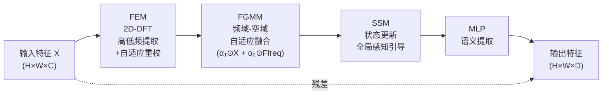

# Enabling True Global Perception in State Space Models for Visual Tasks

**会议**: ICLR 2026  
**代码**: [Xinmu-Tantai/GMamba-GSSM](https://github.com/Xinmu-Tantai/GMamba-GSSM)  
**领域**: 语义分割 / 目标检测  
**关键词**: State Space Model, Mamba, 全局感知, 频域调制, 离散傅里叶变换

## 一句话总结

首次用梯度下界公理化定义"图像全局建模"，并基于 2D-DFT 频域调制设计 GSSM 模块，在理论上证明并实验上验证 SSM 可实现真全局感知，同时保持线性对数复杂度。

## 研究背景与动机

**领域现状**：全局上下文建模是视觉任务的核心需求，现有方案分两路——Transformer 的自注意力和 Mamba 的状态空间模型（SSM）。**现有痛点**：Transformer 全局但二次复杂度；Mamba 线性复杂度但本质上是递归式逐步状态更新，远距离影响系数以指数速度 $|K_d| \le |C||\bar{A}|^d|\bar{B}|$ 衰减，像素间又无因果顺序，与 SSM 建模假设存在结构性矛盾。更根本的问题是：学界从未对"全局建模"给出可证明、可验证的数学定义，只能依赖消融实验或特征可视化来做事后判断。**核心矛盾**：SSM 的递归机制使其无法同时满足"对所有像素输出梯度下界 > 0"与"无序列顺序约束"两个条件，导致理论上不可能实现真全局感知。**本文目标**：构建图像全局建模的公理化定义，在此基础上设计满足定义的高效模块。**核心 idea**：DFT 的每个频率分量天然依赖所有空间位置且贡献幅度均匀（$|\partial\hat{X}/\partial x_n| = 1$），用 2D-DFT 对 SSM 输入做前端频域调制，就能把全局语义注入到 SSM 的状态更新过程中，从而绕开 SSM 递归瓶颈、实现理论可证的真全局感知。

## 方法详解

### 整体框架

输入图像先被切分为 patch 序列，送入 **GMamba Block**；Block 内先由 **GSSM 模块**完成全局上下文建模，再经 MLP 提取语义，最后还原为空间特征图。GMamba 是即插即用模块，可以残差方式插入 CNN 任意阶段，无需改动骨干网络结构。

### 关键设计

**1. 图像全局建模的公理化定义：将经验属性升格为可证明的架构属性**

论文首次给出严格数学定义：对可微函数 $f:\mathbb{R}^{H\times W\times C}\to\mathbb{R}^{H\times W\times C}$，若存在全局影响函数 $I(i,j,c)>0$ 使得对所有像素 $(i,j,c)$ 成立 $\|\partial f(X)/\partial X_{i,j,c}\|_F \ge I(i,j,c)$，且 $\inf I \ge \tau > 0$，则 $f$ 具备"全局梯度依赖"；同时 $f$ 不能对输入施加顺序约束（非因果约束）。这个定义把"全局性"从依赖消融实验的经验属性，变成可在架构设计阶段严格分析和保证的理论属性。对照此定义：自注意力仅在学到的权重碰巧满足 $\tau>0$ 时才算全局（架构不强制）；纯 SSM 因因果假设根本无法同时满足两个条件。

**2. 频域调制赋予 SSM 真全局感知：GSSM 的理论基础与实现**

SSM 本质上是对输入做动态卷积滤波（$y_t = \sum_k K_k u_{t-k}$），其频域转移函数 $H(\omega)=C(e^{j\omega}I-\bar{A})^{-1}\bar{B}$ 与卷积核 $K_k$ 构成 Fourier 变换对，这保证了频域操作的信息保真性和可逆性。2D-DFT 满足全局属性（$\partial\hat{X}/\partial X_{i,j,c} = e^{-j(\omega_1 i+\omega_2 j)}\ne 0$，幅度处处为 1），进而可以证明：若用 2D-DFT 调制 SSM 输入，则 GSSM 输出对任意输入像素的梯度满足 $\|\partial Y_{p,q}/\partial X_{i,j,c}\|_F \ge \min(\alpha_1,\alpha_2)\cdot\tau > 0$，与位置无关，严格满足定义。具体实现分两步：FEM（频率编码模块）对输入做 2D-DFT、分离高低频、用可学习权重自适应重校后 IDFT，输出富含全局语义的 $F_\text{freq}$；FGMM（频域引导调制模块）用 $F_\text{global}=\text{Concat}[X, F_\text{freq}]$ 推导自适应权重 $\alpha_1,\alpha_2\in(0,1)$，然后将调制后特征 $X_\text{modulated} = \alpha_1\odot X + \alpha_2\odot F_\text{freq}$ 送入 SSM。

**3. 单向扫描已足够，复杂扫描策略反而有害**

消融实验（Table 6）显示，在 GSSM 框架下引入双向或四向扫描，不但没有提升反而增加参数和 FLOPs（四向扫描 78.50M/91.00G FLOPs vs 单向 71.06M/85.66G），mIoU 反而微降（85.98% vs 86.00%）。这从实验侧印证了理论：频域前调制已提供全局感知，SSM 的递归机制只需负责序列建模，不必依赖多方向扫描来补偿局部性。这也区别于 Vim、VMamba 等一系列"通过改扫描策略增强全局性"的工作——方向不对，根本问题没解决。

## 实验关键数据

### 主实验

**遥感语义分割（Vaihingen 数据集，UNet 基线）**

| Backbone | 模块 | Params(M) | mIoU(%) | mF1(%) | OA(%) |
|----------|------|-----------|---------|--------|-------|
| ResNet34 | Baseline | 25.33 | 81.65 | 89.24 | 91.86 |
| ResNet34 | +Swin×7 | 35.81 | 83.24 | 90.63 | 93.08 |
| ResNet34 | +VMamba×7 | 32.45 | 83.24 | 90.62 | 93.04 |
| ResNet34 | +GMamba×7 | **30.96** | **84.74** | **91.56** | **93.72** |
| ConvNeXt(S) | Baseline | 58.42 | 83.11 | 90.19 | 92.30 |
| ConvNeXt(S) | +GMamba×7 | 71.06 | **86.00** | **92.31** | **93.99** |

**MS-COCO 目标检测（Faster R-CNN, ResNet50）**

| 模块 | AP | AP50 | AP75 | Params(M) |
|------|----|------|------|-----------|
| Baseline | 37.2 | 57.8 | 40.4 | 43.80 |
| +VMamba×3 | 37.6 | 58.8 | 40.8 | 65.00 |
| +GMamba×3 | **38.5** | **59.6** | **42.2** | 61.40 |

**MS-COCO 实例分割（Mask R-CNN, Swin-T）**

| 模块 | AP | AP50 | AP75 | APL |
|------|----|------|------|-----|
| Baseline | 38.7 | 61.3 | 41.5 | 56.7 |
| +SwinV2×3 | 39.1 | 61.9 | 42.0 | 57.4 |
| +FreqMamba×3 | 39.2 | 61.4 | 42.2 | 57.2 |
| +GMamba×3 | **39.8** | **62.7** | **42.8** | **58.0** |

### 消融实验

| 配置 | Params(M) | mIoU(%) | 说明 |
|------|-----------|---------|------|
| Baseline（ConvNeXt-S+UNet） | 58.42 | 83.11 | 无全局模块 |
| +SSM only | 68.31 | 84.01 | 无频域调制 |
| +FEM+SSM | 70.80 | 85.30 | 频域编码有效 |
| +DFT+FGMM+SSM（无自适应FEM） | 68.62 | 84.79 | 自适应重校不可缺 |
| +GSSM（完整） | **71.06** | **86.00** | FEM+FGMM协同最优 |

### 关键发现

- GMamba 在 9 种对比全局建模模块中全面领先，且参数量与 TinyViM 持平，远低于 Swin/VMamba
- 四个遥感分割数据集（Vaihingen/Potsdam/LoveDA/UAVid）、三种骨干（ResNet/Swin/ConvNeXt）上一致提升，无一退化
- 单向扫描 + 频域调制优于多向扫描，证明"方向多样性"不是全局建模的关键

## 亮点与洞察

- **理论先行**：把"全局感知"从事后可视化验证提升为可证明的架构属性，属于基础性工作，而非又一个调参 trick
- **频域-空域的正交融合**：FEM 提供全局低频语义，SSM 保留局部动态卷积能力，二者互补而非替代，这也解释了为何 GSSM 显著优于"仅 SSM"
- **即插即用**：GMamba 可以残差方式插入 CNN 任意阶段（论文验证了 7 个位置），无需重新预训练骨干，工程友好

## 局限与展望

- 实验集中在遥感分割与 MS-COCO，尚未在 ImageNet 分类或视频理解等任务上验证泛化性
- 复杂度为 $O(n\log n)$（DFT 的代价），略高于纯 SSM 的 $O(n)$，在极长序列场景下优势可能缩小
- FEM 对频率分量的划分（高/低频）仍较粗粒度，自适应频带分割可能进一步提升

## 相关工作与启发

- **vs Mamba/SSM（ViM、VMamba、TinyViM）**：这类工作通过改变扫描方向（双向、四向、zigzag）来缓解局部性，本文证明这条路治标不治本；GSSM 用频域前调制从根源解决问题，且参数量更少、效果更好
- **vs FreqMamba**：同为频域×SSM 的结合，但 FreqMamba 缺乏公理化定义支撑，未严格证明全局性；GSSM 的自适应调制（FEM+FGMM）也优于 FreqMamba 的简单频域注入
- **vs 非局部操作（Non-local Networks）**：论文指出 DFT 与非局部操作有形式类比性（输出 = 所有位置的加权和），但 DFT 的全局性有解析保证，且复杂度低得多

## 评分

- 新颖性: ⭐⭐⭐⭐ 公理化定义"全局建模"并从频域视角解决 SSM 局部性，思路清晰且有理论支撑
- 实验充分度: ⭐⭐⭐⭐ 多数据集、多任务、多骨干、多消融，对比模块覆盖全面
- 写作质量: ⭐⭐⭐⭐ 理论推导完整，从定义到证明到实现逻辑一致，可读性好
- 价值: ⭐⭐⭐⭐ 即插即用、理论可解释，对 SSM 视觉社区有参考价值

<!-- RELATED:START -->

## 相关论文

- [\[CVPR 2025\] GroupMamba: Efficient Group-Based Visual State Space Model](../../CVPR2025/segmentation/groupmamba_efficient_group-based_visual_state_space_model.md)
- [\[CVPR 2025\] DefMamba: Deformable Visual State Space Model](../../CVPR2025/segmentation/defmamba_deformable_visual_state_space_model.md)
- [\[CVPR 2026\] MARSS: Radar Semantic Segmentation via Modular Attention and State Space Models](../../CVPR2026/segmentation/marss_radar_semantic_segmentation_via_modular_attention_and_state_space_models.md)
- [\[CVPR 2026\] RS-SSM: Refining Forgotten Specifics in State Space Model for Video Semantic Segmentation](../../CVPR2026/segmentation/rs-ssm_refining_forgotten_specifics_in_state_space_model_for_video_semantic_segm.md)
- [\[CVPR 2025\] Exploiting Temporal State Space Sharing for Video Semantic Segmentation](../../CVPR2025/segmentation/exploiting_temporal_state_space_sharing_for_video_semantic_segmentation.md)

<!-- RELATED:END -->
