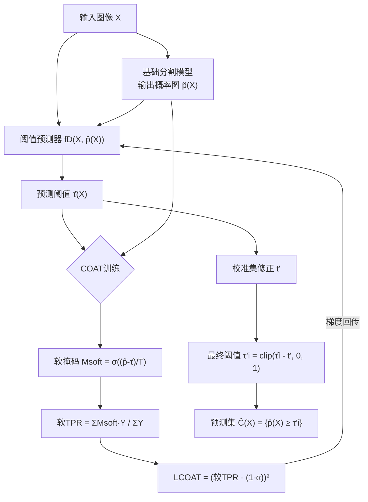

# Enhancing Image-Conditional Coverage in Segmentation: Adaptive Thresholding via Differentiable Miscoverage Loss

**会议**: ICLR 2026  
**代码**: [bjbbbb/Conditional-Optimization-for-Adaptive-Thresholding](https://github.com/bjbbbb/Conditional-Optimization-for-Adaptive-Thresholding)  
**领域**: segmentation  
**关键词**: conformal prediction, image-conditional coverage, adaptive thresholding, differentiable miscoverage loss, uncertainty quantification

## 一句话总结

提出 COAT 框架，通过可微的 sigmoid soft TPR 近似作为损失函数，端到端训练图像自适应阈值预测器，在图像分割的 Conformal Risk Control 中大幅缩小逐图像覆盖率偏差（Coverage Gap）。

## 研究背景与动机

**领域现状**：Conformal Risk Control（CRC）为图像分割提供了边际统计保证，通过在校准集上搜索单一阈值 $\tau'$ 来控制假阴性率（FNR）。**现有痛点**：单一全局阈值对不同图像一刀切——"容易"图像过度覆盖而"困难"图像严重欠覆盖，导致 Coverage Gap（逐图像 TPR 与目标覆盖率 $1-\alpha$ 之差的均值）居高不下；且阈值与覆盖率之间的关系并非单调连续（图 2 所示），无法对覆盖率直接求梯度。**核心矛盾**：边际保证（平均 FNR ≤ α）≠ 条件保证（每张图的 FNR ≤ α），前者已被 CRC 解决，后者在高风险场景（医疗、自动驾驶）中才是真正需求。**本文目标**：为每张图像学习一个图像自适应阈值 $\hat{\tau}(X)$，使其逐图覆盖率尽量贴近目标 $1-\alpha$。**核心 idea**：用 sigmoid 函数将硬阈值二值化替换为软掩码，将 TPR 变成关于 $\hat{\tau}$ 的可微量，从而定义可端到端优化的 miscoverage loss，绕开预计算最优阈值的繁琐流程。

## 方法详解

### 整体框架

论文提出两个递进方案：**AT**（有监督回归基线）和 **COAT**（端到端可微优化）。两者共享同一阈值预测器 $f_D$，输入为图像 $X$ 与基础分割模型的概率图 $\hat{p}(X)$；区别在于训练目标——AT 用预计算的最优硬阈值监督，COAT 用软 TPR 直接优化条件覆盖。训练结束后，两者都在校准集上求一个全局修正量 $t'$ 来维持边际保证。

### 关键设计

**1. AT：有监督阈值回归——奠定自适应框架基础**

AT 将阈值预测视为监督回归：对训练集中每张图像 $(X_i, Y_i)$，用二分搜索预计算"理想阈值" $\tau^*(X, Y)$ 使 TPR 恰好等于 $1-\alpha$，再以 MSE 监督训练 $f_D$：

$$\mathcal{L}_\text{AT} = \mathbb{E}_{(X,Y)\sim D_\text{train}}\left[(\hat{\tau}(X) - \tau^*(X,Y))^2\right]$$

AT 直接回归阈值标量，简洁有效，但依赖预计算，且阈值与覆盖率关系非单调时误差较大。

**2. COAT：可微 miscoverage loss——直接优化条件覆盖**

COAT 的核心洞察：硬阈值二值化 $\mathbf{1}[\hat{p}_j \geq \hat{\tau}]$ 不可微，用 sigmoid 替换得软掩码：

$$M_\text{soft}(X) = \sigma\!\left(\frac{\hat{p}(X) - \hat{\tau}(X)}{T}\right)$$

其中温度参数 $T > 0$ 控制 sigmoid 的陡峭程度（$T \to 0$ 趋近硬阈值）。软 TPR 为：

$$\widetilde{\text{TPR}}(X, Y, \hat{\tau}) = \frac{\sum_j M_\text{soft}(X)[j] \cdot Y[j]}{\sum_j Y[j] + \epsilon}$$

损失函数直接惩罚软 TPR 与目标覆盖率之差：

$$\mathcal{L}_\text{COAT} = \mathbb{E}\left[\left(\widetilde{\text{TPR}}(X, Y, \hat{\tau}(X)) - (1-\alpha)\right)^2\right]$$

梯度可从 $\mathcal{L}_\text{COAT}$ 流经 $M_\text{soft}$ 回传至 $f_D$ 参数，无需任何中间监督标签。

**3. 后验校准修正——在自适应阈值上叠加边际保证**

COAT 训练仅优化条件覆盖，边际保证由校准集补足：在 $D_\text{cal}$ 上计算全局修正量

$$t' = \inf\!\left\{t \;\middle|\; R(t) \geq \frac{|D_\text{cal}|+1}{|D_\text{cal}|}(1-\alpha)\right\}$$

其中 $R(t)$ 为将所有校准图像阈值平移 $-t$ 后的经验覆盖率。最终测试阈值 $\tau'_i = \text{clip}(\hat{\tau}_i - t', 0, 1)$。该步骤赋予 AT/COAT 有限样本边际保证（定理 1，继承自 CRC 理论）。

**4. 阈值预测器架构**

$f_D$ 以图像 $X$ 与概率图 $\hat{p}(X)$ 通道拼接后的张量为输入，输出单标量 $\hat{\tau}(X) \in [0,1]$。架构与基础分割模型无关，可灵活替换（实验中与 DeepLab v3+、UNet、PSPNet、SINet 均兼容）。

## 实验关键数据

### 主实验

以下列出 Polyp 数据集、PSPNet 基础模型、$\alpha=0.1$ 条件下各方法对比（20 次随机划分均值±标准差）：

| 方法 | Marginal Coverage | Coverage Gap ↓ |
|------|-------------------|----------------|
| CRC | 0.906 (0.019) | 0.150 (0.015) |
| AA-CRC | 0.908 (0.018) | 0.119 (0.016) |
| AT | 0.899 (0.018) | 0.119 (0.014) |
| **COAT** | **0.894 (0.016)** | **0.110 (0.015)** |

Polyp+SINet，$\alpha=0.1$：COAT Coverage Gap 0.102 vs CRC 0.149（降低 31%）。Skin+DeepLab v3+，$\alpha=0.2$：COAT 0.073 vs CRC 0.107（降低 32%）。COAT 在 3 个数据集（Polyp/Fire/Skin）× 4 个模型（Deeplab/UNet/PSPNet/SINet）× 2 个 $\alpha$ 值共 24 组实验中**一致排名最优 Coverage Gap**。

### 消融实验

| 配置 | Coverage Gap（Polyp, PSPNet, α=0.1） | 说明 |
|------|--------------------------------------|------|
| CRC（无自适应） | 0.150 | 全局单阈值基线 |
| AT（有监督回归） | 0.119 | 自适应但依赖硬阈值预计算 |
| COAT（可微损失） | 0.110 | 端到端直接优化条件覆盖 |

温度 $T$ 的消融（附录 A.5）：$T$ 过小趋近硬阈值梯度消失，$T$ 过大软化过度偏离目标；中等温度最优。

### 关键发现

- COAT 在全部实验组合中 Coverage Gap 最优，且边际覆盖率依然满足（≈目标 $1-\alpha$），两者不冲突。
- COAT 训练损失快速稳定收敛至接近 0，对 4 种不同基础分割模型均如此（图 5）。
- 定性可视化（图 3/4）：CRC 在困难图像上 FNR 高达 0.613，COAT 能把几乎所有图像控制在目标 FNR 附近。
- Fire 数据集上提升相对较小（因该数据集图像间难度差异较小），体现方法在高异质数据集上优势更突出。

## 亮点与洞察

- **可微化思路干净**：将不可微的指示函数替换为 sigmoid 软掩码这一操作简洁，却赋予整个 TPR 的可微性，让"直接优化覆盖率"从理论可行变为工程可实现。
- **理论保证完整**：COAT 不放弃边际保证——用后验校准修正 $t'$ 恢复 CRC 有限样本理论，实现"条件覆盖优化 + 边际保证叠加"。
- **模型无关性**：$f_D$ 以任意分割模型的概率图为输入，不需要改动基础模型，可作为即插即用后处理模块。
- **Coverage Gap 指标引入**：用逐图像覆盖率与目标覆盖率之差衡量条件覆盖质量，比边际覆盖率更细粒度，值得借鉴。

## 局限与展望

- $f_D$ 的训练需要独立的 $D_2$（与基础分割模型训练的 $D_1$ 分离），增加了数据划分复杂度和对数据量的要求。
- 温度 $T$ 是超参数，需要额外调节；$T$ 的最优值依赖数据集和模型特性，缺乏自适应确定方案。
- 当前仅针对二值分割（前景/背景），多类别语义分割的条件覆盖扩展有待探索。
- 条件有效性的理论证明（附录 A.1）依赖强分布假设，实际保证强度弱于边际保证。

## 相关工作与启发

- **vs CRC（Angelopoulos et al., 2024）**：CRC 是本文的基础，提供边际保证；COAT 在其之上增加图像级自适应，弥补 CRC 在条件覆盖上的缺口。
- **vs AA-CRC（Blot et al., 2025）**：AA-CRC 也尝试自适应阈值，但未使用可微优化；COAT 通过端到端训练进一步降低 Coverage Gap。
- **vs SACP（Bereska et al., 2025）**：SACP 在空间维度（像素邻域）上自适应，而 COAT 在图像维度（整图阈值）上自适应，两者互补。
- **对分割不确定性估计的启发**：软阈值化思路可推广到其他需要可微覆盖控制的任务，如目标检测框的条件覆盖控制。

## 评分

- 新颖性: ⭐⭐⭐⭐ 可微 miscoverage loss 的构造思路新颖，将覆盖率优化从"校准后处理"推进到"训练目标"
- 实验充分度: ⭐⭐⭐⭐ 3 数据集 × 4 模型 × 2 α 共 24 组全面覆盖，定性可视化直观
- 写作质量: ⭐⭐⭐⭐ 问题建模清晰，AT 与 COAT 的递进关系逻辑流畅，算法伪代码完整
- 价值: ⭐⭐⭐⭐ 对医疗/自驾等高风险场景的分割不确定性量化有直接实用价值

<!-- RELATED:START -->

## 相关论文

- [\[ICLR 2026\] Detective SAM: Adaptive AI-Image Forgery Localization](detective_sam_adaptive_ai-image_forgery_localization.md)
- [\[CVPR 2025\] Task-driven Image Fusion with Learnable Fusion Loss](../../CVPR2025/segmentation/task-driven_image_fusion_with_learnable_fusion_loss.md)
- [\[CVPR 2026\] Differentiable Laplacian Matrix Guided Superpixel Segmentation](../../CVPR2026/segmentation/differentiable_laplacian_matrix_guided_superpixel_segmentation.md)
- [\[CVPR 2026\] Boundary-Responsive Differentiable Gating for Superpixel-Based Segmentation](../../CVPR2026/segmentation/boundary-responsive_differentiable_gating_for_superpixel-based_segmentation.md)
- [\[CVPR 2026\] SegGBC: Justifiable Coarse-to-Fine Granular-Ball Computing for Enhancing Clustering Image Segmentation](../../CVPR2026/segmentation/seggbc_justifiable_coarse-to-fine_granular-ball_computing_for_enhancing_clusteri.md)

<!-- RELATED:END -->
