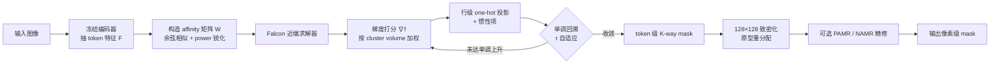

# Falcon: Fast Proximal Linearization of Normalized Cuts for Unsupervised Image Segmentation

**会议**: ICLR 2026  
**OpenReview**: [https://openreview.net/forum?id=PvWHzAf9qp](https://openreview.net/forum?id=PvWHzAf9qp)  
**代码**: [https://github.com/ZhangXLaurence/Falcon-Seg](https://github.com/ZhangXLaurence/Falcon-Seg)  
**领域**: 无监督图像分割 / 训练-free 零样本分割 / 图割  
**关键词**: Normalized Cut, 近端梯度, 离散优化, KL 收敛, 视觉基础模型, 零样本分割  

## 一句话总结
Falcon 把零样本无监督分割里经典的 Normalized Cut（NCut）从"谱松弛 + 递归二分 + 取整"的老套路，改写成一个**直接在离散 K-way one-hot 标签上做近端梯度（proximal linearization）的求解器**，既保证 KL 框架下的线性收敛，又把推理速度提了近一个数量级，在六个分割基准上刷新 SOTA。

## 研究背景与动机
- **领域现状**：训练-free 零样本分割的主流做法，是拿冻结的视觉基础模型（DINO、扩散模型等）抽 token 特征，再用经典图割原理把 token 聚成语义区域。TokenCut、MaskCut、DiffCut 都属于这一路，靠"强特征 + NCut"就能产生有竞争力的无监督 mask。
- **现有痛点**：当前所有 NCut-based 流水线都卡在同样三处。① **慢**——递归二分，每切一刀都要重新做一次特征分解，token 图一大开销就爆炸；② **不准**——优化的是谱松弛后的连续问题，再把解 round 回离散标签，层层近似让最终分割可能偏离真正的离散 NCut 目标；③ **不稳**——递归二分对"能否产生稳定的 K-way 分割"没有任何原则性保证，配套启发式也没有收敛性。
- **核心矛盾**：NCut 本身是一个优雅的组合优化目标，但实际工程里用的却是"松弛—取整—递归"的拼凑流程，**目标与求解过程之间存在系统性裂缝**，三个痛点都源于此。
- **本文目标**：不再绕道谱松弛，而是**直接优化离散 K-way NCut 目标**，并给出收敛保证，同时显著提速。
- **核心 idea**：**把 NCut 写成"光滑项 + one-hot 指示函数"的复合目标，用前向-后向近端梯度迭代求解**——每步用目标的精确梯度算出 token→cluster 的打分，再把每一行投影回合法 one-hot 标签，靠惯性项和单调回溯保证目标单调上升、在 KL 框架下收敛。

## 方法详解

### 整体框架
Falcon 的流水线分三段：① **特征抽取**——冻结编码器（SSD-1B 扩散模型 / DINOv3）抽 token，构造 token 间的稠密 affinity 矩阵 $W$；② **NCut 快速近端线性化**——核心求解器，把离散 K-way 分配 $X$ 迭代更新到收敛；③ **可选的 mask 致密化与精修**——把 token 级粗 mask 上采样到中间分辨率再配一个轻量像素级 refiner（PAMR / NAMR）。其中第二段是全文贡献所在，第三段是为对齐评测协议而加的可插拔后处理。

### 关键设计

**1. 复合目标建模：把离散可行性塞进非光滑项。** Falcon 不松弛 one-hot 约束，而是把整个问题写成 $\min_{X\in\mathbb{R}^{N\times K}}\Phi(X)=h(X)+g(X)$，其中光滑项 $h(X)=-f(X)$ 来自归一化关联（normalized association）$f(X)=\sum_{k=1}^{K}\frac{x_k^\top W x_k}{x_k^\top D x_k}$（最小化 NCut 等价于最大化 $f$，因为 $\mathrm{Ncut}(X)=K-f(X)$），而非光滑项 $g(X)=\iota_{\mathcal V}(X)$ 是行级 one-hot 可行集 $\mathcal V=\{X\in\{0,1\}^{N\times K}:X\mathbf 1=\mathbf 1\}$ 的指示函数。这样离散性被精确编码进 $g$，在 $v_k=x_k^\top D x_k>0$ 的邻域上 $h$ 是 $C^1$ 光滑的——于是"前向走光滑梯度、后向投影回离散"的近端框架天然适用，**根本不需要任何启发式取整**。

**2. 闭式梯度打分 + 行级 one-hot 近端投影。** 每步迭代缓存三个量 $G=WX$、$q_k=x_k^\top W x_k$（cluster 内关联）、$v_k=x_k^\top D x_k$（cluster 体积），由商法则得到精确梯度 $\nabla f(X)=2\big(G v^{-T}-(DX)\rho^\top\big)$，其中 $\rho_k=q_k/v_k^2$。在当前点 $X^{(t)}$ 用二次下界近似 $f$ 后，对离散集合 $\mathcal V$ 的最大化是**逐行可分**的：因为每行是 one-hot，$\|y_i\|_2^2$ 恒为常数，只剩交叉项，于是更新有闭式解
$$x_i^{(t+1)}=e_{\arg\max_{k}\;\mu_{ik}^{(t)}+\tau_t X_{ik}^{(t)}},\quad \mu^{(t)}=\nabla f(X^{(t)}).$$
这里 $\mu_{ik}$ 是把 token $i$ 分给 cluster $k$ 的一阶增益，而 $\tau_t X_{ik}^{(t)}$ 是**惯性奖励**：它偏好保留当前标签，除非另一个分配明显更优，从而避免无谓的标签翻转。整个更新全程离散可行、完全向量化，这正是它比递归特征分解快一个数量级的根源。

**3. 单调回溯保证目标非降。** Lipschitz 常数 $L_t$ 未知且会变化，Falcon 用 Armijo 型回溯：从 $\tau_t=\tau_0$ 起，若接受条件 $f(X^{(t+1)})\ge f(X^{(t)})+\delta\frac{\tau_t}{2}\|X^{(t+1)}-X^{(t)}\|_F^2$ 成立就接受，否则令 $\tau_t\leftarrow\gamma\tau_t$（$\gamma>1$）重算。这条"充分上升"规则**既保证 $f$ 单调上升、回溯有限步终止**，又恰好等价于 $\Phi$ 的充分下降，是后续收敛分析的入口。

**4. KL 框架下的收敛保证。** Falcon 是一个带单调回溯的前向-后向格式：更新式 (11) 是 $g=\iota_{\mathcal V}$ 的近端步（行级投影），由 $h=-f$ 的线性化驱动。由于离散 NCut 目标是 affinity 矩阵的多项式加 one-hot 约束，属于**半代数函数**，自动满足 Kurdyka–Łojasiewicz（KL）性质。在有界次水平集、$\nabla f$ 局部 Lipschitz 等标准条件下，可证：迭代序列有限长、整体收敛到临界点；当 KL 指数 $\theta\le\frac12$ 时，局部收敛率至少线性。注意这里的"收敛"指收敛到驻点，而非 NP-hard NCut 目标的全局最优。

**5. 致密化与可插拔精修（PAMR / NAMR）。** 求解器只给出 token 网格上的粗标签 $\ell$，Falcon 先在 $128\times128$ 中间网格上用最近邻上采样标签 + 双线性上采样特征，按每簇**原型**（平均嵌入）做一次重分配 $\ell^*_{u,v}=\arg\max_k z_{u,v}^\top p_k$，减少 tokenization 伪影。随后可选地接 PAMR（线性、单温度的边缘感知扩散精修）或论文新提的 NAMR（非线性差异 + 多温度平均，小温度保边、大温度平滑）。作者强调精修模块**独立于求解器**，可接 PAMR / DenseCRF / 无精修，用以证明 Falcon 的增益来自求解器本身而非某个后处理。

## 实验关键数据

### 主实验表格
六个基准上的无监督分割 mIoU（编码器 SSD-1B + PAMR；†为作者复现的强基线）：

| 方法 | VOC | Context | COCO-Object | COCO-Stuff-27 | Cityscapes | ADE20K |
|------|-----|---------|-------------|---------------|------------|--------|
| MaskCut | 53.80 | 43.40 | 30.10 | 41.70 | 18.70 | 35.70 |
| DiffSeg | 49.80 | 48.80 | 23.20 | 44.20 | 16.80 | 37.70 |
| DiffCut（官方） | 65.20 | 56.50 | 34.10 | 49.10 | 30.60 | 44.30 |
| AutoSC† | 77.57 | 57.27 | 61.56 | 49.39 | 25.72 | 40.10 |
| DiffCut† | 71.68 | 58.17 | 61.65 | 49.18 | 30.77 | 44.40 |
| **Falcon** | **78.40** | 57.15 | **61.80** | **50.37** | **33.69** | **45.17** |

相对最强官方基线 DiffCut，Falcon 在 VOC +13.2、COCO-Object +27.7、Cityscapes +3.1、COCO-Stuff-27 +1.3、ADE20K +0.9，Pascal Context 持平。在 18 个 benchmark–encoder 组合里拿下 17 个最优。

### 消融实验表格
跨编码器 / 跨精修的稳健性（mIoU，节选）：

| 基准 | 方法 | 无精修 | PAMR | NAMR |
|------|------|--------|------|------|
| VOC (SSD-1B) | DiffCut† | 68.40 | 71.68 | 71.94 |
| VOC (SSD-1B) | **Falcon** | **79.15** | 78.40 | 78.83 |
| Cityscapes (SSD-1B) | DiffCut† | 28.35 | 30.77 | 30.95 |
| Cityscapes (SSD-1B) | **Falcon** | 30.56 | **33.69** | 33.50 |
| COCO-Object (DINOv3-B) | DiffCut† | 52.71 | 59.11 | 60.55 |
| COCO-Object (DINOv3-B) | **Falcon** | **62.19** | 59.69 | 60.78 |

运行时（端到端，单张 RTX 4090，DINOv3-B / Cityscapes）：Falcon 把总时间从 DiffCut 的 784.04s 降到 **87.47s**，Mask Generation 从 747.97s 降到 **52.49s**。

### 关键发现
- **求解器即增益来源**：Falcon 在所有编码器、所有精修选择下都稳定超过 DiffCut，证明提升来自直接优化离散目标的求解器，而非某个 backbone 或后处理。
- **对象中心场景无需精修**：VOC 上裸 Falcon 已达 79.15，精修反而略降，说明离散解本身边界已很干净。
- **token 越多提速越猛**：高分辨率 / 高 token 数下递归 NCut 开销爆炸，而 Falcon 全向量化、通常很少几轮外迭代就收敛，速度优势随分辨率拉大。
- **超参不敏感**：power 参数 $\alpha$ 和谱阈值 $\kappa$（用于估计 $K$）在合理范围内对 mIoU 影响温和。

## 亮点与洞察
- **把工程拼凑还原成原则性优化**：长期以来 NCut 流水线是"松弛—取整—递归"的经验组合，Falcon 第一次给出一个直接在离散 one-hot 上迭代、且带收敛证明的求解器，弥合了"优雅组合目标"与"实际过程"之间的裂缝。
- **离散可行性全程保持**：每一步迭代都是合法 one-hot 分配，避免了 relax-and-round 的失配，这是精度提升（尤其裸分割已很强）的根本。
- **速度与理论同源**：KL 线性收敛在实践中体现为"极少外迭代即收敛"，理论保证直接翻译成工程上的快。
- **refiner-agnostic 的诚实设计**：作者刻意把精修拆成可插拔模块并做对照，避免把后处理红利算到求解器头上，结论更可信。

## 局限与展望
- **affinity 仍是 $O(N^2)$**：稠密 token affinity 的二次复杂度没有被消除，Falcon 只是在内存扩展性上更友好，超大 token 网格仍受限。
- **$K$ 依赖谱启发式估计**：分段数 $K$ 通过对归一化 affinity 做一次特征分解 + 负阈值 $\kappa$ 计数得到，且 $\kappa$ 是 per-dataset 而非 per-image，对标注粒度差异大的场景可能不够自适应。
- **收敛是到驻点而非全局最优**：NCut 本身 NP-hard，理论只保证收敛到临界点，初始化与局部最优问题依然存在。
- **依赖强基础模型特征**：方法是 training-free 求解器，质量上限由冻结编码器（SSD-1B / DINOv3）的特征决定。

## 相关工作与启发
- **图割分割谱系**：从 Shi & Malik 的 Normalized Cut，到 TokenCut / MaskCut / AutoSC / DiffCut 用自监督 Transformer 特征做 token 相似度——但都受困于递归二分与硬分割约束，Falcon 正是针对这条主线的求解器升级。
- **近端梯度与 KL 理论**：FISTA 的 $O(1/k^2)$、单调变体、以及 Attouch–Bolte 在 KL 框架下对非凸 prox-linear 收敛的刻画，是 Falcon 收敛分析的数学根基；惯性扩展（Ochs 等）则对应其惯性项设计。
- **视觉基础模型**：DINO / DINOv3、扩散模型（SSD-1B、SD2.1）提供的强特征，是 training-free 分割得以成立的前提，Falcon 把"强特征 + 原则性 NCut 求解器"配对，刷新了无监督与有监督分割之间的差距。
- **启发**：把"经典组合目标 + 现代基础模型特征"用一个带收敛保证的离散优化器直接连起来，这一思路可推广到其它图结构感知任务（聚类、社区发现、点云分割）。

## 评分
- **新颖性**: ⭐⭐⭐⭐⭐ 把 NCut 从谱松弛范式整体改写为直接离散近端求解，并配 KL 收敛证明，是方法论层面的实质创新而非增量调参。
- **实验充分度**: ⭐⭐⭐⭐ 六基准 × 三编码器 × 三精修 + 运行时 + 超参敏感性，对照充分（含自复现强基线），18 组拿 17 个最优；唯 Context 仅持平。
- **写作质量**: ⭐⭐⭐⭐ 三痛点—对策结构清晰，方法推导与收敛分析严谨；公式较密，对非优化背景读者门槛偏高。
- **价值**: ⭐⭐⭐⭐⭐ 同时拿下精度与速度（近一个数量级提速），training-free、即插即用，对无监督/零样本分割社区有直接落地价值。

<!-- RELATED:START -->

## 相关论文

- [\[NeurIPS 2025\] Towards Unsupervised Domain Bridging via Image Degradation in Semantic Segmentation](../../NeurIPS2025/segmentation/towards_unsupervised_domain_bridging_via_image_degradation_in_semantic_segmentat.md)
- [\[ICLR 2026\] AMLRIS: Alignment-aware Masked Learning for Referring Image Segmentation](amlris_alignment-aware_masked_learning_for_referring_image_segmentation.md)
- [\[ICML 2026\] Geometry-Preserving Unsupervised Alignment for Heterogeneous Foundation Models](../../ICML2026/segmentation/geometry-preserving_unsupervised_alignment_for_heterogeneous_foundation_models.md)
- [\[ICLR 2026\] Enhancing Image-Conditional Coverage in Segmentation: Adaptive Thresholding via Differentiable Miscoverage Loss](enhancing_image-conditional_coverage_in_segmentation_adaptive_thresholding_via_d.md)
- [\[ICLR 2026\] VINCIE: Unlocking In-context Image Editing from Video](vincie_unlocking_in-context_image_editing_from_video.md)

<!-- RELATED:END -->
