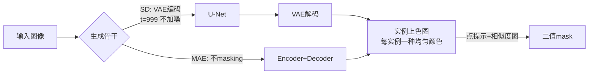

# gen2seg: Generative Models Enable Generalizable Instance Segmentation

**会议**: ICLR 2026  
**OpenReview**: [https://openreview.net/forum?id=cSpjHOf04S](https://openreview.net/forum?id=cSpjHOf04S)  
**代码**: [reachomk.github.io/gen2seg](https://reachomk.github.io/gen2seg)  
**领域**: 实例分割 / 生成模型迁移  
**关键词**: 实例分割, 生成先验, Stable Diffusion, MAE, 零样本泛化, 类别无关分割  

## 一句话总结
把 Stable Diffusion / MAE 当作"实例上色器"微调，仅用室内家具和车两类窄域合成 mask 监督，就能零样本泛化到人、动物、艺术画、X 光等从未见过 mask 的物体类型与风格，性能逼近甚至在细结构上超过用 10 亿 mask 监督的 SAM。

## 研究背景与动机
- **领域现状**：类别无关实例分割的标杆是 SAM——用 256 张 A100 在 SA-1B（1100 万图、11 亿 mask）上训练，靠"大数据覆盖一切"实现零样本可提示分割。主流分割架构（DETR/Mask2Former 系）都把图像编码成低分辨率特征再从头学一个 mask predictor 上采样。
- **现有痛点**：这种"广覆盖监督"路线代价极高，而且 mask predictor 是从零学的——一旦遇到训练时没见过 mask 的物体类型，判别式模型（SimpleClick、DINO）会直接崩溃，无法把像素分组成新物体。
- **核心矛盾**：人类幼儿只摸过杯子椅子，第一次进动物园却能把斑马长颈鹿当成独立物体认出来——说明视觉系统学到的是**可迁移的"分组机制"**而非"类别字典"。现有判别式 pipeline 学的恰恰是后者。
- **本文目标**：在更严格的零样本设定下提问——模型能否只从极窄的视觉切片（两类物体）学习，却泛化到完全没见过 mask 的类型和风格？
- **核心 idea**：**生成先验即分组先验**。生成模型为了从文本/损坏输入合成连贯图像，必须隐式理解物体边界、部件与场景构成；把这套先验"重定向"到分割上，泛化能力来自预训练而非监督的广度。

## 方法详解

### 整体框架
gen2seg 把实例分割彻底重写成 **image-to-image translation**：输入一张图，输出一张 RGB 图，其中每个物体实例被涂成一种独特而内部均匀的颜色、背景为黑。这样就无需任何任务专用 head，直接复用生成模型 $R^{W\times H\times 3}\to R^{W\times H\times 3}$ 的天然接口。对 Stable Diffusion，把图编码进 latent 但**不加噪**、固定到最噪时间步 $t=999$，让 U-Net+VAE 一步确定性地解出上色图；对 MAE，则不做 masking 直接过 encoder+decoder。推理是单步、确定性的。

### 关键设计
**1. 实例上色损失（Instance Coloring Loss）：用"软约束"替代固定配色。** 难点在于把 mask 编码成颜色时，同一张图存在无数种合法配色（哪个实例涂红哪个涂蓝都对），不能直接回归固定颜色。作者只锚定 RGB 分割图的两条本质性质——同一 mask 内颜色方差要低、某 mask 的颜色不应出现在 mask 外——从而绕开"指定颜色"。设第 $i$ 个实例像素集为 $S_i$、其代表色为均值 $\mu_{i,c}=\frac{1}{|S_i|}\sum_{j\in S_i}p_{j,c}$，背景强制为黑 $\mu_{0,c}=0$。损失由三项构成：**类内方差损失** $L_{var}=\sum_i\frac{1}{|S_i|}\sum_{j\in S_i}\sum_c L_s(p_{j,c},\mu_{i,c})$ 用 smooth $\ell_1$（比 $\ell_2$ 收敛更好，不过分惩罚离群点）把每个像素拉向实例均值；**类间分离损失** $L_{sep}=\sum_i\frac{1}{\sqrt{|S_i|}|T_i|}\sum_{j\in T_i}\frac{1}{1+\sum_c(p_{j,c}-\mu_{i,c})^2}$ 把 mask 外像素 $T_i=\Omega\setminus S_i$ 的颜色推离该实例均值，分母里的 $\sqrt{|S_i|}$ 专门放大小物体的权重，且该项随距离饱和、避免远处像素主导；**均值级分离损失** $L_{mean}=\frac{1}{n(n+1)}\sum_{i<j}\frac{1}{1+\sum_c(\mu_{i,c}-\mu_{j,c})^2}$ 进一步把不同实例的质心颜色拉开。总损失 $L_{IC}=L_{var}+\lambda_{sep}L_{sep}+\lambda_{mean}L_{mean}$。这套设计简单、直觉、且与架构无关，本质上是把监督式特征聚类的思路搬到像素颜色空间。

**2. 把生成模型"逼"成像素级任务的最优选手。** 之所以选生成骨干而非判别骨干，是因为 SAM 这类模型的编码器丢弃了低层细节，必须靠 FPN 从低分辨率逐级上采样恢复；而 SD/MAE 的输出特征本就和原图同分辨率，且为了合成细边缘、纤细结构、部件-整体关系，预训练时就被迫建模了这些组分。作者验证 VAE 和 MAE decoder 都能近乎无损地解码这种彩色 mask 图，于是分割质量直接吃到生成先验的红利——表现为边界比 SAM 更锐、能分出 SAM 漏掉的电线等细结构，甚至在无部件监督下涌现出物体-部件组合性（给相关部件涂相近色调）。

**3. 无 mask decoder 的点提示分割。** 为证明输出特征本身就编码了实例形状，作者刻意不训练独立 mask decoder。给定提示点 $p$，先用高斯加权（标准差 $0.01(W,H)$）平均其邻域颜色得到查询向量 $q_p$，再算查询-特征相似度图 $S_p(x,y)=\min(1,\frac{1}{\|F(x,y)-q_p\|_2})$，归一化后用联合双边滤波（以 $F$ 为引导）平滑，多个提示点取逐像素最大再阈值化即得二值 mask。这种"近邻式"探针类似表示学习里用最近邻分类来验证特征质量，证明形状信息确实驻留在颜色特征里。

## 实验关键数据
训练只用合成数据：Hypersim（室内场景，6.6 万图）+ Virtual Kitti 2（驾驶场景仅标车，2 万图），共约 8.6 万图、多样性极低（Hypersim 仅采自 457 个场景，VK2 仅 5 段约 15 秒视频）。最强模型在 4 张 RTX6000 Ada 上训练 29 小时——对比 SAM 用 256 张 A100 训 68 小时。评测选 5 个域差异极大的数据集：COCO（排除已见类别）、DRAM（艺术）、EgoHOS（第一视角）、iShape（细复杂结构）、PIDRay（行李 X 光）。

### 主实验表格（单点提示零样本 mIoU）

| 模型 | COCO-L | COCO-M | DRAM | EgoHOS | iShape | PIDRay |
|------|--------|--------|------|--------|--------|--------|
| SAM（10亿mask监督） | 57.0 | 59.5 | 50.2 | 56.4 | 16.8 | 44.2 |
| SimpleClick | 1.4 | 0.6 | 2.4 | 1.6 | 1.6 | 1.5 |
| DINO-B | 35.0 | 11.0 | 29.4 | 14.8 | 27.4 | 14.9 |
| gen2seg (MAE-B) | 44.6 | 17.8 | 34.3 | 28.9 | 31.1 | 21.6 |
| gen2seg (MAE-H) | 50.0 | 23.2 | 40.3 | 31.9 | 34.9 | 24.1 |
| **gen2seg (SD)** | **57.6** | 38.8 | 48.2 | 40.0 | **51.4** | 30.9 |

SD 版在大物体上达到/超过 SAM，在 iShape（细结构）上以 51.4 vs 16.8 **碾压 SAM 3 倍**；判别式基线 SimpleClick 几乎全线归零，印证泛化是生成模型独有。

### 消融实验表格（不同微调数据域，MAE-H/SD）

| 训练数据 | DRAM | iShape | PIDRay |
|----------|------|--------|--------|
| 原始(Hypersim+VK2) | 40.3/48.2 | 34.9/51.4 | 24.1/30.9 |
| COCO | 48.1/51.2 | 33.4/41.2 | 25.7/31.9 |
| ClevrTex | 23.5/28.0 | 27.6/32.1 | 22.2/23.7 |
| 仅10类 | 40.1/45.1 | 33.0/53.6 | 17.6/22.8 |
| 仅5类 | 34.2/38.2 | 28.5/48.5 | 15.2/19.4 |

### 关键发现
- **多样性不是必需**：从 33+ 类砍到 10 类，性能几乎不变，说明泛化来自生成先验而非数据多样性；但砍到 5 类或换成过于简单的 ClevrTex 会掉点，说明仍需**最低限度的复杂度**。
- **边界更锐源于先验而非数据**：在 BSDS500 上 SD 的 Edge AP 达 93.4，远超 SAM 79.0，即便用 COCO 的多边形噪声边训练，模型也不学这种锯齿、反而预测更平滑感知对齐的边界。
- **连 MAE 都行**：MAE 仅在无标签 ImageNet-1K 上预训练（无互联网级数据、无文本监督），也展现强泛化，说明生成式"分组机制"不依赖大规模预训练。

## 亮点与洞察
- **范式重述**：把"预测 N 个二值 mask"重写成"给每个实例上色"的图到图翻译，让生成模型零改造接入，思路极简且优雅。
- **强证据链**：用 DINO+VAE（判别特征+生成解码器）作对照，证明泛化来自**生成式特征**而非 VAE 解码器；用 SimpleClick 同骨干同数据对照，证明瓶颈在判别式架构。
- **涌现的部件组合性**：无任何部件监督，模型却给相关部件涂相近色调（Vader 的斗篷与身体）、给无关部件涂不同色，暗示生成模型学到了层级化场景表示。

## 局限与展望
- **小/中物体仍弱**：COCO-M/S 上明显落后 SAM，对小目标的实例级表示还不够强。
- **点提示是"探针"非产品**：作者刻意不训 mask decoder 以证明特征质量，但这也意味着提示分割精度受限；作者明确把"在特征上训高分辨率可提示 mask decoder"留作未来工作。
- **依赖合成训练数据**：当前只验证了合成+真实窄域的迁移，与基于伪标签的自监督路线（NCut 系）尚未融合——作者提出二者结合（噪声鲁棒+零样本）是有前景的方向。

## 相关工作与启发
- **生成即感知**（可追溯到 Hinton 2007）：早期 GAN/inpainting/colorization 作为 pretext 任务曾被判别式预训练超越，本文在实例分割上重新论证了这一思想的生命力。
- **扩散模型迁感知**：已被用于深度、法线、光流、对应、语义/amodal 分割等；既往把扩散用于实例分割的工作（Fan 2024、Zhao 2025）追求"大数据下的竞争力"，本文独辟蹊径——用**泛化**这一视角切入。
- **启发**：对机器人、医学影像、自动驾驶等"细致场景理解"关键领域，这指出一条低成本路线——与其堆海量标注，不如复用现成生成模型的内在分组先验。

## 评分
- **新颖性**: ⭐⭐⭐⭐⭐ —— "生成先验=分组先验"的命题用实例上色损失给出了简洁可操作的验证，且对照实验（DINO-B、SimpleClick）设计严谨，结论有冲击力。
- **实验充分度**: ⭐⭐⭐⭐ —— 5 个跨域数据集 + 数据域/类别数量消融 + 边界 AP，证据链完整；小物体短板和缺乏与 SAM 同量级训练的对照略有遗憾。
- **写作质量**: ⭐⭐⭐⭐⭐ —— 动机（幼儿进动物园）生动，方法推导清晰，图示（部件组合性、SAM 失败案例）极具说服力。
- **价值**: ⭐⭐⭐⭐⭐ —— 用 1/数十的算力逼近 SAM 并在细结构上反超，为"低成本通用感知"提供了有力范式，对资源受限场景意义重大。

<!-- RELATED:START -->

## 相关论文

- [\[CVPR 2026\] GKD: Generalizable Knowledge Distillation from Vision Foundation Models for Semantic Segmentation](../../CVPR2026/segmentation/gkd_generalizable_knowledge_distillation_vfm.md)
- [\[ICCV 2025\] Can Generative Geospatial Diffusion Models Excel as Discriminative Geospatial Foundation Models?](../../ICCV2025/segmentation/can_generative_geospatial_diffusion_models_excel_as_discriminative_geospatial_fo.md)
- [\[ICLR 2026\] S3OD: Towards Generalizable Salient Object Detection with Synthetic Data](s3od_towards_generalizable_salient_object_detection_with_synthetic_data.md)
- [\[CVPR 2025\] Foveated Instance Segmentation](../../CVPR2025/segmentation/foveated_instance_segmentation.md)
- [\[ICLR 2026\] TRACE: Your Diffusion Model is Secretly an Instance Edge Detector](trace_your_diffusion_model_is_secretly_an_instance_edge_detector.md)

<!-- RELATED:END -->
