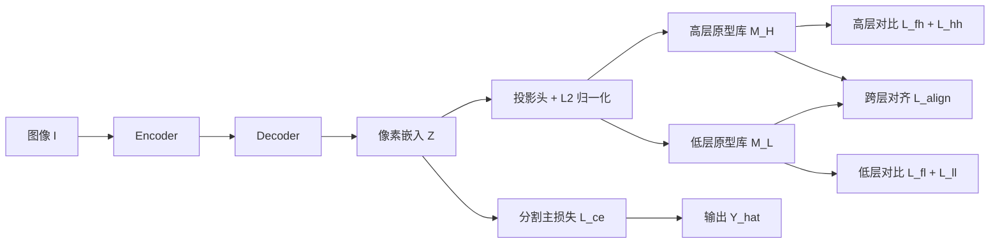

# Hierarchical Prototype Learning for Semantic Segmentation

**会议**: ICLR 2026  
**OpenReview**: [https://openreview.net/forum?id=wHMuQ9HgUo](https://openreview.net/forum?id=wHMuQ9HgUo)  
**代码**: 待确认  
**领域**: 语义分割 / 层级语义 / 原型对比学习  
**关键词**: 层级原型, 对比学习, 粗到细, 训练期增强, 零推理开销  

## 一句话总结
HiPoSeg 在分割模型输出端挂一套「高层 + 低层」类别原型记忆库，用层级对比学习与跨层 margin 对齐把表示空间按「先认整体再分部件」的人类视觉方式组织起来，纯训练期插件、推理零开销，四个基准平均涨 +3.07%p mIoU。

## 研究背景与动机
**领域现状**：语义分割要给每个像素分一个类别标签，主流方法（DeepLabV3+、OCRNet、ProtoSeg 等）把它当成**扁平分类**问题——每个像素直接映射到预定义类别，类与类之间互相独立。

**现有痛点**：扁平假设忽略了类别之间天然的层级结构。当视觉上相似的部件分属不同物体（如「马腿」vs「牛腿」）时，模型缺乏「这是马，所以它的部件都该是马相关」这种自上而下的约束，于是在细粒度部件、罕见类、边界混淆区频繁误判。已有的层级分割方法（HSSN、LogicSeg）虽然引入了层级推理，但主要在 **概率/logit 层面** 融合信号，或把层级当成固定的辅助损失项，**没有去结构化表示空间本身**。

**核心矛盾**：层级先验明明能缩小候选空间、用全局上下文正则化细粒度决策，但现有做法只在输出概率上打补丁，表示空间仍是扁平的，跨层一致性得不到保证。

**本文目标**：把层级从「损失附加项」提升为「表示空间的设计原则」，让同一物体的各部件在嵌入空间里既共享全局上下文又能稳定区分，并且不增加任何推理成本。

**核心 idea**：**[层级原型 + 对齐约束]** 维护高/低两层类别原型记忆库，用层级对比学习把像素特征拉向正确层级的原型、推开错误原型，再加一个跨层 margin 对齐——强制低层原型贴近其父高层原型、同时保证不同高层之间分得开，从而在嵌入空间里复刻「粗到细」的识别课程。

## 方法详解

### 整体框架
HiPoSeg（Hierarchical Prototype Segmentation）挂在任意编码器-解码器分割模型的输出端：解码器产出像素嵌入后，按低层标签及其高层映射分组，构建并动量更新两个原型缓冲区 $M_H$（高层）和 $M_L$（低层）；训练时用一组层级对比损失 + 跨层对齐损失塑造嵌入空间，按「先表示→再高层→再低层→最后对齐」的分阶段课程逐步开启；推理时整套结构全部移除，只剩原始分割模型，零额外参数/计算/延迟。

### 关键设计

**1. 层级原型空间构建：把标签树搬进嵌入空间。** 假设标签有两层（高层 coarse、低层 fine），通过固定映射 $\pi: Y_L \to Y_H$ 把每个低层标签 $y$ 归到其高层父类 $y' = \pi(y)$。像素嵌入经投影头 $g_\phi$ 与 $\ell_2$ 归一化后得到 $\tilde{z}$，再按标签求均值得到原型：高层原型 $h_i$ 是所有高层标签为 $i$ 的归一化特征的均值，低层原型 $l^i_j$ 是低层标签为 $j$ 的特征均值，二者都再做 $\ell_2$ 归一化落到单位球面。记忆库不是每个 batch 重置，而是动量滑动更新 $h_i \leftarrow m\,h_i + (1-m)\,\hat{h}_i$（论文取 $m=0.9$），让原型在小 batch 下也保持稳定，避免噪声特征把类别中心带偏。

**2. 层级对比学习：高低两层各自「拉正推负」。** 所有相似度都来自欧氏距离的负平方 $s(a,b) = -\|a-b\|_2^2$。高层上，特征-原型损失 $L_{fh}$ 用 softmax 把像素拉向正确高层原型、推开其它高层原型，再配一个原型间排斥项 $L_{hh}$ 防止高层原型坍缩到一起：

$$L_{fh} = -\frac{1}{|N^*|}\sum_{k,n}\log\frac{\exp(s(\tilde{z}^n_k, h_{y'^*})/\tau)}{\sum_{y'\in Y_H}\exp(s(\tilde{z}^n_k, h_{y'})/\tau)}$$

低层上同样有 $L_{fl}$（拉向正确低层原型）和 $L_{ll}$（低层原型互斥）。这样高层先把候选类别缩到「马」这个大类，低层再在「马」内部细分腿/头/尾，天然形成粗到细的判别。

**3. 跨层 margin 对齐：用双门限锁住层级拓扑。** 光有高低两层各自的对比，容易让高低语义互相干扰、原型漂移。HiPoSeg 加一个对齐约束：对内（align-in）强制每个低层原型 $l^i_j$ 到其父高层原型 $h_i$ 的距离不超过小 margin $\sigma_1$，即 $\max(0, \delta(l^i_j, h_i) - \sigma_1)$；对外（align-out）强制不同高层原型之间距离不小于大 margin $\sigma_2$，即 $\max(0, \sigma_2 - \delta(h_i, h_k))$。论文取 $\sigma_1=0.25 < \sigma_2=1$，于是「同一父类的部件抱团、不同父类拉开」这个拓扑被硬约束住，既抑制了概率泄漏，又防止多个对比损失天真相加时的梯度互相打架。

**4. 分阶段课程调度：先稳粗语义再练细粒度。** 总损失是 $L = \lambda_1 L_{ce} + \lambda_2 L_{fh} + \lambda_3 L_{hh} + \lambda_4 L_{fl} + \lambda_5 L_{ll} + \lambda_6 L_{align}$，但不是一开始全开。训练按 top-down 课程逐步激活：前 7.5% 迭代只学特征表示（不碰原型）；7.5% 后开启高层原型学习；22.5% 后再加入低层原型学习；37.5% 后才激活跨层对齐损失。这种「先把高层语义夯实，再细分低层，最后对齐」的顺序，复刻了人类「先认是马、再认是马腿」的识别流程，也让训练更稳。

## 实验关键数据

### 主实验表格
在 Cityscapes / ADE20K / Mapillary Vistas 2.0 / PASCAL-Part-108 四个层级标注基准上，以 DeepLabV3+（ResNet-101）为基线。

| 数据集 | DeepLabV3+ 基线 | HSSN | LogicSeg | HiPoSeg |
|---|---|---|---|---|
| Cityscapes | 73.55 | 83.02 | 83.20 | **84.04 (+10.49)** |
| ADE20K | 44.48 | 47.69 | 48.46 | **48.99 (+4.51)** |
| Mapillary Vistas 2.0 | 31.65 | 40.16 | 40.72 | **41.42 (+9.77)** |
| PASCAL-Part-108 | 46.90 | 48.32 | 48.46 | **49.33 (+2.43)** |

四个基准全部刷新 SOTA，相对竞品平均涨 +3.07%p mIoU；值得注意的是 HiPoSeg 只用 ResNet-101 就超过了不少用 HRNet-W48 更强骨干的方法（如 ProtoSeg、Contextrast）。

### 消融实验表格
损失组件消融（Cityscapes val，Table 5）：

| 配置 | mIoU (%) |
|---|---|
| 仅 $L_{ce}$（基线） | 73.55 |
| + 高层对比 $L_{fh}+L_{hh}$ | 80.96 |
| + 低层对比 $L_{fl}+L_{ll}$ | 81.04 |
| 高层+低层（无对齐） | 79.16 |
| 全部（含 $L_{align}$） | **84.04** |

层级原型消融（Table 6）显示，只加高层原型或只加低层原型各自能涨 5~7 个点，但**两者同开**才在四个数据集上同时拉满（Cityscapes 84.04 / ADE20K 48.99 / Mapillary 41.42 / PASCAL 49.33）。

### 关键发现
- **对齐损失是「胶水」而非可选项**：高低层对比天真相加（无对齐）反而掉到 79.16，比单层还低，说明多层对比会梯度互相干扰；加上跨层 margin 对齐后才跃升到 84.04，证明对齐约束在防止原型漂移上起决定性作用。
- **高低层互补**：单独高层或单独低层都只是中等增益，二者协同才触发质变，印证了「粗到细」结构的必要性。
- **零推理开销下的强增益**：所有提升都来自训练期，测试时整套原型机制移除，不增加任何参数/计算/延迟。

## 亮点与洞察
- **把层级从损失项升格为表示空间的设计原则**：相比 HSSN/LogicSeg 在 logit 层打补丁，HiPoSeg 直接在嵌入空间用原型 + margin 重塑几何结构，更本质。
- **双门限 margin（$\sigma_1 < \sigma_2$）的设计很巧**：一个门限管「部件抱团」，一个门限管「父类分开」，用两个简单的 hinge 就把标签树的拓扑硬编码进了距离空间。
- **plug-and-play + 零开销**是落地友好的关键卖点，可以无痛挂到现有任意 backbone/decoder 上。
- **分阶段课程**把「先粗后细」的认知直觉转成了可操作的训练调度，避免了多损失同时上手的训练不稳定。

## 局限与展望
- **依赖预定义标签层级**：方法要求数据集本身提供 $\pi$ 映射（高层概念），对没有现成层级标注的数据集需要额外构造层级树。
- **统一为两层**：实验把 ADE20K、Mapillary 的三层结构压成两层处理，更深层级（>2 层）的递归扩展尚未验证。
- **单一骨干/解码器验证**：主要在 DeepLabV3+/ResNet-101 上验证，与 Transformer 类分割器（Mask2Former 等）的兼容性还需进一步实验。
- **超参较多**：六项损失权重 $\lambda$、两个 margin、温度 $\tau/\kappa$、动量 $m$ 及四段调度比例都需调，跨数据集迁移成本待评估。

## 相关工作与启发
- **层级语义分割**：OCRNet（object-region 表示）、HSSN、LogicSeg 在 logit/概率层做层级推理；本文把层级下沉到表示空间。
- **原型分割**：ProtoSeg、Snell et al. 的 prototypical network 用类中心锚定特征；本文扩展为高低双层原型记忆库。
- **分割对比学习**：ContrastSeg、RegionSeg、Contextrast 构造像素/区域正负对扩大决策 margin，但都假设扁平标签空间；本文用层级原型库 + 层级感知 margin 对齐补上这一缺口。
- **启发**：「先认整体再分部件」的认知先验可以泛化到任何有层级标签的密集预测任务（如全景分割、医学多器官分割），且「训练期塑造表示、推理期丢弃」的范式对追求零开销部署的场景很有吸引力。

## 评分
- **新颖性**: ⭐⭐⭐⭐ 把层级先验从 logit 层下沉到表示空间，双门限 margin 对齐 + 高低原型库的组合较新颖，虽然原型/对比/层级各组件都不算首创，但整合方式有想法。
- **实验充分度**: ⭐⭐⭐⭐ 四个层级基准全面验证 + 损失/原型双消融充分，清晰证明了对齐损失的关键作用；但骨干较单一（仅 DeepLabV3+/ResNet-101），缺与 Transformer 分割器的对比。
- **写作质量**: ⭐⭐⭐⭐ 动机（人类视觉粗到细）讲得清楚，方法公式完整、图示到位，消融逻辑自洽。
- **价值**: ⭐⭐⭐⭐ 训练期插件、零推理开销、即插即用，对已有分割系统几乎无痛涨点，落地价值高。

<!-- RELATED:START -->

## 相关论文

- [\[AAAI 2026\] Bridging Granularity Gaps: Hierarchical Semantic Learning for Cross-Domain Few-Shot Segmentation](../../AAAI2026/segmentation/bridging_granularity_gaps_hierarchical_semantic_learning_for_cross-domain_few-sh.md)
- [\[CVPR 2026\] Hyperbolic Prototype Learning with Uncertainty-Aware Consistency for Continual Test-Time Segmentation](../../CVPR2026/segmentation/hyperbolic_prototype_learning_with_uncertainty-aware_consistency_for_continual_t.md)
- [\[CVPR 2026\] Bootstrap Your Own AV-Proxies: Adaptive Contrastive and Prototype Learning for Audio-Visual Segmentation](../../CVPR2026/segmentation/bootstrap_your_own_av-proxies_adaptive_contrastive_and_prototype_learning_for_au.md)
- [\[CVPR 2026\] Towards Robust Multi-Modal Semantic Segmentation with Teacher-Student Framework and Hybrid Prototype Distillation](../../CVPR2026/segmentation/towards_robust_multi-modal_semantic_segmentation_with_teacher-student_framework_.md)
- [\[CVPR 2026\] GeoGuide: Hierarchical Geometric Guidance for Open-Vocabulary 3D Semantic Segmentation](../../CVPR2026/segmentation/geoguide_hierarchical_geometric_guidance_for_open-vocabulary_3d_semantic_segment.md)

<!-- RELATED:END -->
