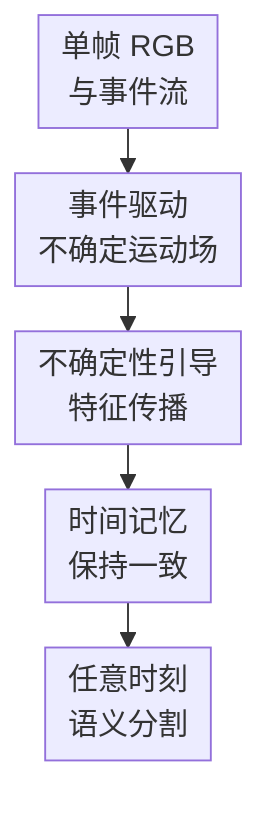

# LiFR-Seg: Anytime High-Frame-Rate Segmentation via Event-Guided Propagation

**会议**: ICLR2026  
**OpenReview**: [https://openreview.net/forum?id=9oS7DHIg7f](https://openreview.net/forum?id=9oS7DHIg7f)  
**代码**: 待确认  
**领域**: 语义分割  
**关键词**: 事件相机, 任意时刻分割, 高帧率感知, 特征传播, 不确定性建模

## 一句话总结
LiFR-Seg 把低帧率 RGB 图像中的语义特征，借助事件流估计出的高频运动场传播到任意中间时刻，并用不确定性加权与时间记忆缓解事件稀疏和长间隔退化，从而让低帧率硬件接近甚至在夜间超过高帧率 RGB 分割上界。

## 研究背景与动机
**领域现状**：自动驾驶、无人机和机器人都需要连续、密集的场景理解，语义分割通常依赖普通 RGB 相机逐帧输出结果。主流视频语义分割会利用相邻帧之间的时间一致性，或者用光流把关键帧特征传播到后续帧，但这些方法大多默认输入本身就是较高帧率的视频流。

**现有痛点**：普通相机的帧率有限，例如 20Hz 的相机每 50ms 才给出一帧。高速场景里，一个行人、车辆或机器人本体的快速运动可能刚好发生在两帧之间，系统在这段“盲区时间”内没有新的 RGB 图像可用，只能拿旧分割结果硬撑。高帧率 RGB 相机可以缓解这个问题，但成本、功耗、带宽都明显更高，论文附录给出的例子里，高速 RGB 相机价格和功耗都远高于事件相机。

**核心矛盾**：事件相机能以微秒级时间分辨率记录亮度变化，特别擅长捕捉运动，但事件数据本身空间稀疏、纹理和语义很弱；RGB 图像有丰富语义，却在时间上稀疏。真正难点不是简单把 RGB 和事件拼在一起，而是如何用事件提供的运动信息，把 RGB 中已经抽出的密集语义可靠地搬到任意目标时刻。

**本文目标**：作者提出 Anytime Interframe Semantic Segmentation：给定过去的单帧 RGB 图像 $I_t$ 和从过去到目标时刻的事件流 $E_{t-\Delta t\to t+\delta t}$，在不使用未来 RGB 帧的前提下，预测任意 $t+\delta t$ 的语义分割图。这里既要求因果性，也要求任意时刻可预测，而不是只在固定帧时间输出。

**切入角度**：论文的观察是，事件流虽然语义弱，但能提供高频运动线索；如果先从 RGB 帧提取深层语义特征，再用事件估计的运动场去传播这些特征，就能把“语义来自 RGB、时间来自事件”这两件事拆开处理。这样比像素级插帧更少受重建模糊影响，也比直接多模态融合更有明确的几何归纳偏置。

**核心 idea**：用事件驱动的运动场和显式置信度来传播深层语义特征，再用时间记忆补偿长间隔和遮挡，解决低帧率相机在两帧之间的语义感知空窗。

## 方法详解
LiFR-Seg 的方法主线很清楚：先从低帧率 RGB 帧抽语义特征，再从事件流估计目标时刻的运动场和置信度，然后把多尺度语义特征按运动场 splat 到目标时刻，最后用记忆注意力补上长期上下文。它不是生成目标 RGB 图像后再分割，也不是把事件特征和图像特征直接融合，而是把事件当成“如何搬运语义”的运动依据。

### 整体框架
输入是一帧 RGB 图像 $I_t$、历史到目标时刻的事件流 $E_{t-\Delta t\to t+\delta t}$，输出是目标时刻 $t+\delta t$ 的 dense semantic map。框架先用图像编码器得到多尺度语义特征 $F_t$，再把事件流体素化并送入事件光流网络，得到从 $t$ 到 $t+\delta t$ 的运动场 $\hat{M}_{t\to t+\delta t}$；ScoreNet 同时预测每个位置的 log-precision 置信度 $S$，Softmax Splatting 用 $\exp(S)$ 给传播贡献加权，最后由 RefineNet、时间记忆注意力和分割解码器生成目标分割。

这张图里真正的贡献节点是中间三步：事件驱动不确定运动场、不确定性引导特征传播、时间记忆保持一致。首尾输入输出只是任务接口，不单列为关键设计。

### 关键设计
**1. 事件驱动不确定运动场：不只估计往哪动，还估计这次运动估计靠不靠谱**

事件流首先被离散成事件体素。对像素 $u=(x,y)$ 和时间 bin $b$，体素值由该窗口内事件极性加权累积，核心形式是 $E(u,b)=\sum_j p_j [u_j=u]\max(0,1-|t_j^*-b|)$。这样做把异步事件整理成可被卷积网络处理的 $B\times H\times W$ 表示，同时保留事件在时间窗口内的相对位置。

在运动估计上，LiFR-Seg 采用类似 RAFT 的事件光流网络：两个事件体素经过特征编码后构建相关体，从初始零流开始迭代更新，得到 $\hat{M}_{t\to t+\delta t}$。关键不是“有了光流就结束”，因为事件稀疏区域、低纹理区域和噪声区域里的光流天然不稳定。作者额外引入 ScoreNet，把事件体素特征和运动场特征拼接后回归单通道 log-precision map $S$。$S$ 越高，表示该位置的运动估计越可信；$S$ 越低，表示后续传播时应该少相信这个 flow vector。

这个设计对应论文最核心的风险控制：如果直接用事件流估计运动场去 warp，错误运动会把语义特征搬到错误位置，尤其在稀疏事件或复杂动态场景中会积累伪影。显式置信度让模型可以在“事件支持强、运动边界清晰”的地方大胆传播，在“事件少、流场和事件边缘不一致”的地方降低贡献。

**2. 不确定性引导特征传播：传播深层语义，而不是传播图像或最终标签**

LiFR-Seg 选择传播 RGB 分割骨干网络中的多尺度深层特征 $F_t$。这点很重要：如果传播原始图像，就会把目标变成图像重建或插帧，容易追求视觉平滑而模糊语义边界；如果传播最终 segmentation map，又太早离散化，边界错误很难恢复。深层特征处在两者之间，既保留语义，又仍有足够空间结构供后续解码器修正。

传播算子使用 Softmax Splatting，并把 ScoreNet 输出的置信度作为 log-space importance weight：

$$
F_{t+\delta t}=\frac{\overrightarrow{\Sigma}(\exp(S_{t\to t+\delta t})\cdot F_t,\hat{M}_{t\to t+\delta t})}{\overrightarrow{\Sigma}(\exp(S_{t\to t+\delta t}),\hat{M}_{t\to t+\delta t})}.
$$

可以把它理解为一次“带投票权重的前向搬运”：同一个目标位置可能收到多个源位置 splat 过来的特征，可信流场搬来的特征权重更大，不可信流场搬来的特征被压低。传播后再接一个轻量 RefineNet，用两层卷积修补局部空间不一致，减少 splatting 造成的孔洞或边界毛刺。

**3. 时间记忆保持一致：用历史语义上下文抵抗长间隔和遮挡退化**

单次从 $t$ 传播到 $t+\delta t$ 本质上是 Markov 式操作，只看当前起点和当前事件。如果时间间隔变长，或者物体被遮挡后又出现，单次传播得到的特征会逐渐退化。LiFR-Seg 因此加入 memory bank，存储历史关键时刻的深层语义特征。

具体做法是：当前传播得到的 deepest feature 作为 query，对 memory bank 中的历史特征做 cross-attention，得到融合了长期上下文的增强特征，然后再写回 memory bank 供未来使用。作者只在最深的语义层上做记忆注意力，而不是所有尺度都做，这样既能抓住类别和结构级别的长期信息，又控制计算成本。消融也显示，短间隔时 memory 增益不大，但当间隔拉到 400ms、800ms 时，它对缓解特征衰减非常关键。

### 一个完整示例
假设车载系统在时刻 $t$ 只有一张 RGB 图像，分割结果里道路前方暂时没有行人；接下来 50ms 内，一个行人从路边快速进入车道。普通低帧率系统要等到 $t+\Delta t$ 的下一张 RGB 图像才会重新分割，此时可能已经错过早期预警窗口。

LiFR-Seg 的处理方式是：在 $t+10$ms、$t+20$ms 或任意 $t+\delta t$，系统取到从 $t$ 到目标时刻的事件片段。事件光流网络根据这些亮度变化估计行人边缘和背景的相对运动，ScoreNet 在事件密集且边缘一致的区域给出较高置信度，在事件稀疏或运动不确定处给出较低置信度。Softmax Splatting 随后把 $t$ 时刻的道路、车辆、行人相关语义特征按运动场搬到目标时刻。如果行人边界附近有多个来源特征竞争，高置信度事件支持的传播会获得更大权重。最后 memory attention 用前序时刻积累的深层语义上下文修正局部遮挡和边界不稳定，解码器输出 $t+\delta t$ 的分割图。

这个例子说明本文和“插出一帧 RGB 再分割”的差别：LiFR-Seg 不需要把中间 RGB 画面重建得好看，它只关心对分割有用的语义特征是否被正确对齐到目标时刻。因此在快速运动和低光场景下，特征级传播比像素级插帧更贴近下游任务。

### 损失函数 / 训练策略
训练使用 SegFormer-B2 作为统一分割骨干，所有方法在对应数据集上训练到收敛。LiFR-Seg 端到端使用 OhemCrossEntropy loss，以缓解语义分割中的类别不均衡问题。

一个训练细节是，真实标注只在低帧率 RGB 帧时间 $t+\Delta t$ 可用，因此模型会先把 $F_t$ 传播到中间时刻 $t+\delta t$，再通过第二次 warp 把特征推进到 $t+\Delta t$，最后和 $Seg_{t+\Delta t}$ 监督对齐。测试时则不受固定标注时刻限制，只要给定任意目标时间的事件片段，就可以即时估计运动场并输出对应分割。

实现上，论文使用 AdamW，学习率 $1\times10^{-4}$，weight decay 为 $5\times10^{-3}$，多项式学习率衰减，前 10 个 epoch warm-up，总训练 200 epoch，batch size 为 4，并在两张 RTX 4090 上训练。

## 实验关键数据

### 主实验
主实验比较五类范式：理想高帧率 RGB 上界、低帧率 RGB baseline、插帧后分割、RGB-事件直接融合，以及本文的事件引导特征传播。LiFR-Seg 是表中唯一同时满足因果性和任意时刻预测的强方法。

| 数据集 | 指标 | 本文 LiFR-Seg | 之前最强可比方法 | 提升 / 差距 |
|--------|------|---------------|------------------|-------------|
| DSEC | mIoU | 73.82 | HFR Ideal 73.91 | 距离理想上界仅 0.09 |
| DSEC | mIoU | 73.82 | CMNeXt 70.13 | +3.69 |
| SHF-DSEC | mIoU | 64.80 | HFR Ideal 65.40 | 距离理想上界 0.60 |
| M3ED-Drone | mIoU | 64.28 | CMNeXt 59.56 | +4.72 |
| M3ED-Quadruped | mIoU | 68.89 | CMNeXt 65.52 | +3.37 |
| DSEC-Night | mIoU | 41.86 | HFR Ideal 41.83 | +0.03 |

这个表最有冲击力的地方有两点。第一，在 DSEC 上，LiFR-Seg 没有看到目标时刻 RGB，却几乎追平能看到目标帧的 HFR ideal。第二，在 DSEC-Night 零样本夜间测试中，事件引导传播反而略高于 RGB 高帧率上界，说明当传统图像质量变差时，事件流的高动态范围优势会直接转化为分割鲁棒性。

### 消融实验
论文做了多组消融，最关键的是 ScoreNet、不同时域传播对象，以及长间隔记忆模块。

| 配置 | 数据集 / 间隔 | 关键指标 | 说明 |
|------|---------------|----------|------|
| w/o Score | DSEC | 72.74 mIoU | 不用置信度会让错误流场直接参与传播 |
| Ours | DSEC | 73.82 mIoU | ScoreNet 带来 +1.08 |
| Image Warping | DSEC 50ms | 72.37 mIoU | 传播图像优于插帧，但不如特征传播 |
| Segmentation Warping | DSEC 50ms | 71.63 mIoU | 传播最终标签过早离散化，错误难修正 |
| Feature Warping | DSEC 50ms | 73.82 mIoU | 证明深层特征是更合适的传播对象 |
| Ours w/o Mem | DSEC 800ms | 57.33 mIoU | 长间隔下语义特征明显衰减 |
| Ours w/ Mem | DSEC 800ms | 59.55 mIoU | memory 在长间隔带来 +2.22 |

### 关键发现
- ScoreNet 不是锦上添花，而是事件稀疏场景里的风险过滤器；在 DSEC、SHF-DSEC、DSEC-Night 上都稳定提升。
- 特征传播明显优于图像传播和标签传播，说明本文的核心选择不是“用事件估运动”这么简单，而是找到了更适合语义任务的传播域。
- 时间记忆在 50ms 时只提升 0.33，但到 800ms 时提升 2.22，说明它主要解决长时间间隔的语义衰减，而不是短时局部对齐。
- LiFR-Seg-Lite 在计算效率分析中以 40.43 GFLOPs 达到 65.6 FPS，接近实时需求，同时保持 73.49 mIoU，说明完整方法并不只是离线高成本模型。
- SHF-DSEC 的 anytime 曲线显示，低帧率 baseline 会随 $\delta t$ 从 10ms 到 100ms 明显下降，而本文曲线更稳定，直接验证了“任意时刻”能力。

## 亮点与洞察
- **把任务定义得很准**：Anytime Interframe Semantic Segmentation 同时强调因果性和任意时刻预测，避免了很多看似相关但实际不满足约束的方案混进来比较，例如依赖未来帧的插帧方法。
- **传播特征而不是重建图像**：这让目标从“生成好看的中间帧”转成“把对语义分割有用的信息对齐到目标时刻”，更贴合下游任务，也解释了 PSNR 提升但 mIoU 下降的插帧悖论。
- **显式不确定性很实用**：事件光流在稀疏区域出错是常态，ScoreNet 让模型可以学习“哪里不该相信光流”，这个思路可迁移到深度估计、实例分割、占据预测等事件引导的传播任务。
- **夜间结果很有启发**：DSEC-Night 中本文超过 RGB 高帧率上界，说明事件相机不只是低成本替代品，在低光和高动态范围场景中可能提供更好的感知信号。
- **数据集贡献补上评测缺口**：真实 DSEC 只有 20Hz 标注，难以细测任意时刻性能；SHF-DSEC 用 100Hz 合成标注支持 10ms 级评测，使任务定义能被更细粒度验证。

## 局限与展望
- 当前高速度物体动态的真实数据仍有限。论文承认虽然 M3ED 覆盖高速 ego-motion，但极端局部运动、复杂非线性形变、严重源帧运动模糊等场景还没有充分覆盖。
- 方法依赖事件流到运动场的估计质量。ScoreNet 能降低错误流场影响，但如果事件流本身过于稀疏、同步不准或标定误差较大，传播仍可能出现系统性偏移。
- 训练监督仍主要对齐到离散 RGB 标注时刻，中间时刻的真实 dense label 在真实数据中很难获得。SHF-DSEC 用合成数据补足这一点，但真实世界中间时刻标注仍是难题。
- Memory bank 能改善长间隔一致性，但也带来状态维护和在线部署复杂度。未来如果做真正 streaming 系统，需要处理 memory 更新频率、错误记忆污染、场景切换等问题。
- 很自然的扩展方向是把事件引导特征传播用于深度、光流、动态占据栅格、全景分割等 dense prediction 任务，尤其适合传感器功耗受限但时间分辨率要求高的边缘设备。

## 相关工作与启发
- **vs 视频语义分割 / Deep Feature Flow**: 传统视频语义分割常用光流在已有视频帧之间传播特征，目标多是提高连续视频处理效率；LiFR-Seg 解决的是只有过去单帧 RGB、没有未来目标 RGB 的盲区预测，任务约束更强。
- **vs 图像插帧 + 分割**: 插帧方法需要未来帧，通常不满足因果性；即使能重建中间图像，也可能为了视觉平滑牺牲语义边界。本文绕开像素重建，直接在语义特征空间传播。
- **vs CMNeXt / EISNet 等 RGB-事件融合**: 直接融合把稀疏事件特征和密集 RGB 语义交给网络隐式对齐，缺少明确运动几何约束；LiFR-Seg 用事件光流显式决定语义怎么移动，因此在高动态场景优势更明显。
- **vs 事件-only 分割**: 事件-only 方法有高时间分辨率，但语义纹理不足，难以稳定输出 dense semantic map；本文保留 RGB 的语义优势，只让事件负责高频运动和时间对齐。

## 评分
- 新颖性: ⭐⭐⭐⭐⭐ 提出因果且任意时刻的中间帧语义分割任务，并把事件引导特征传播做成完整框架，问题定义和方法都比较清楚。
- 实验充分度: ⭐⭐⭐⭐⭐ 覆盖 DSEC、SHF-DSEC、M3ED、DSEC-Night，并包含范式对比、任意时间间隔曲线、flow、ScoreNet、warping domain、memory 等多组消融。
- 写作质量: ⭐⭐⭐⭐ 论文结构清晰，任务约束讲得好；少数地方如插帧表述和部分实现细节需要读附录才能完全串起来。
- 价值: ⭐⭐⭐⭐⭐ 对低成本高频感知很有启发，尤其适合自动驾驶、无人机和低光场景中的 dense prediction 系统设计。

<!-- RELATED:START -->

## 相关论文

- [\[ICLR 2026\] WOW-Seg: A Word-Free Open World Segmentation Model](wow-seg_a_word-free_open_world_segmentation_model.md)
- [\[CVPR 2025\] Generative Video Propagation](../../CVPR2025/segmentation/generative_video_propagation.md)
- [\[ICCV 2025\] Temporal Rate Reduction Clustering for Human Motion Segmentation](../../ICCV2025/segmentation/temporal_rate_reduction_clustering_for_human_motion_segmentation.md)
- [\[CVPR 2026\] PCA-Seg: Revisiting Cost Aggregation for Open-Vocabulary Semantic and Part Segmentation](../../CVPR2026/segmentation/pca-seg_revisiting_cost_aggregation_for_openvocabulary_semantic_and_part_segmentat.md)
- [\[ECCV 2024\] Un-EVIMO: Unsupervised Event-based Independent Motion Segmentation](../../ECCV2024/segmentation/un-evimo_unsupervised_event-based_independent_motion_segmentation.md)

<!-- RELATED:END -->
