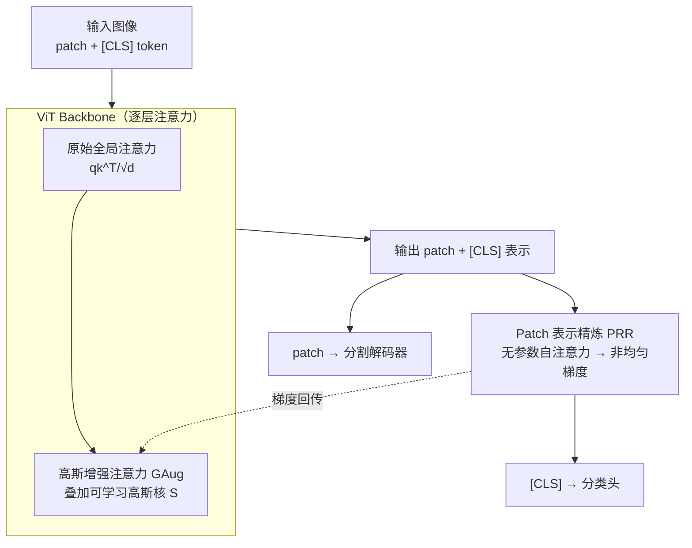

# Locality-Attending Vision Transformer

**会议**: ICLR 2026  
**arXiv**: [2603.04892](https://arxiv.org/abs/2603.04892)  
**代码**: [GitHub](https://github.com/sinahmr/LocAtViT/)  
**领域**: 分割  
**关键词**: Vision Transformer, 局部注意力, 高斯核, Patch 表示精炼, 密集预测, 分割改进  

## 一句话总结

提出 LocAt 模块化插件（GAug + PRR），通过可学习高斯核偏置注意力向局部邻域聚焦并精炼 patch 表示，在不修改训练目标的前提下使 ViT 在 ADE20K 分割上提升超 6%，同时分类精度不降反升。

## 背景与动机

1. **ViT 的全局注意力利于分类但不利于分割**：ViT 的全局自注意力机制擅长捕获长程依赖，在分类任务上表现优异，但对需要精确定位和细粒度空间细节的密集预测任务（如语义分割）表现不佳。全局注意力会稀释局部线索。

2. **分类训练忽视 patch 级表示质量**：标准 ViT 分类仅使用 [CLS] token 的输出计算损失，patch 位置的输出不受直接监督，导致最后一层的空间 token 表示质量退化——patch token 逐渐与 [CLS] token 对齐，失去独特的局部结构信息。

3. **现有改进方案破坏 ViT 原始架构**：层级化 ViT（如 Swin）引入窗口注意力和多阶段设计、卷积混合方案添加额外卷积模块。这些方法虽改善密集预测但改变了 ViT 架构，降低与基础模型（如 CLIP）的兼容性。

4. **GAP 作为分类头的局限**：全局平均池化（GAP）对所有 patch 施加均匀梯度，迫使背景区域的表示也向分类目标对齐，对分割反而有害（Base 模型上降低分割性能）。

## 方法详解

### 整体框架

LocAt 不替换 ViT，而是给标准 ViT 挂上两个互补的轻量插件，整条数据流仍是「输入图像 → ViT backbone → 分类头 / 分割解码器」，只在两处下钩子。第一处在 backbone 内部：每层自注意力计算 logits 时，GAug（高斯增强注意力）叠加一个可学习的高斯核，把每个 token 的注意力从全局软性拉回局部邻域，改善空间特征交互。第二处在输出端：分类头前插入 PRR（patch 表示精炼），一层无参数自注意力让本来不受监督的 patch 位置也能拿到梯度。关键是这两处并非各管各的——PRR 这条梯度通路会一路回传到最后一层的 GAug 参数，没有它 GAug 在输出层附近几乎学不动，二者合在一起局部性偏置才真正学得起来。

### 关键设计

**1. 高斯增强注意力 GAug：用数据自适应的高斯核把注意力软性聚焦到局部**

它要解决的是整体框架里 backbone 内部的那个矛盾：ViT 的全局注意力会稀释局部线索，但硬性的窗口注意力又破坏了架构通用性。GAug 的做法是在原始注意力 logits 上加一个补充矩阵 $\mathbf{S}$，即 $\mathbf{Z} = \text{softmax}\left(\frac{\mathbf{q}\mathbf{k}^\top}{\sqrt{d}} + \mathbf{S}\right)\mathbf{v}$，而 $\mathbf{S}$ 完全由高斯核生成。关键在于这个核的"宽窄"是网络自己预测的：从空间 query 出发预测每个 patch 的各向异性 2D 方差 $\mathbf{\Sigma} = f(\mathbf{q}_{sp}\mathbf{W}^\sigma) \in \mathbb{R}_+^{hw \times 2}$，方差小则核锐利、注意力强烈聚焦在邻域，方差大则核趋于平坦、退回近似全局注意。据此算出高斯权重 $\mathbf{G}_{pt} = \exp\left(-\frac{1}{2}\sum_{m=1}^{2}\frac{\mathbf{D}_{ptm}}{\mathbf{\Sigma}_{pm}}\right)$，其中 $\mathbf{D}$ 是 patch 间的逐坐标平方距离；再用 $\bm{\alpha} = \text{softplus}(\mathbf{q}_{sp}\mathbf{W}^\alpha)$ 为每个 query 预测一个缩放系数，平衡原始 logits 与高斯偏置的相对强弱。因为宽窄和强度都由 query 决定，网络可以逐 patch、逐层地选择"该局部还是该全局"，比固定窗口灵活得多。[CLS] token 没有空间坐标，不参与高斯偏置，对应的行列直接填零。

**2. Patch 表示精炼 PRR：用无参数自注意力把分类梯度不均匀地洒到每个 patch**

这一步对应框架里输出端的钩子，解决的是监督缺失：标准 ViT 只拿 [CLS] 输出算损失，patch 位置得不到直接监督，训练后期 patch token 逐渐向 [CLS] 对齐、丢掉各自的局部结构，分割自然受损；而常见的 GAP 替代又对所有 patch 施加完全均匀的梯度，连背景也被硬拉向分类目标，反而更差。PRR 在分类头前加一层无参数自注意力 $\mathbf{x}_i^+ = \text{softmax}\left(\frac{\mathbf{x}_i \mathbf{x}_i^\top}{\sqrt{d}}\right)\mathbf{x}_i$，再取精炼后的 [CLS] 位置 $\mathbf{x}_0^+$ 送进分类头。这样 [CLS] 对不同 patch 形成了**内容相关、非均匀**的注意力权重，于是分类梯度也按内容不均匀地回流到各 patch，鼓励每个 patch 保持独特且有区分力的表示。更关键的是，这条梯度通路同时把信号送到了最后一个 block 的 GAug 参数上——没有 PRR，GAug 在输出层附近几乎学不动，这也是消融里两者必须合用的原因。

两个插件叠加的开销极小：每层只多 $\mathbf{W}^\sigma \in \mathbb{R}^{d \times 2}$ 和 $\mathbf{W}^\alpha \in \mathbb{R}^{d \times 1}$ 两个小矩阵，PRR 完全无参数。以 Base 模型为例新增参数仅 2,340 个（0.003%），FLOPs 几乎不变（17.58G → 17.64G）。

## 实验

### 实验设置

- **预训练**：ImageNet-1K 分类训练 300 epochs，AdamW 优化器，batch size 1024
- **分割评估**：冻结 backbone 仅训练 1 层 MLP 解码器（20K iterations），评估 ADE20K、PASCAL Context、COCO Stuff
- **Backbone 尺寸**：Tiny（6M 参数）、Small、Base（86M 参数）
- **基线**：ViT、Swin、RegViT（ViT+registers）、RoPEViT、Jumbo

### 主实验：分割与分类性能

| 方法 | ADE mIoU | P-Context mIoU | C-Stuff mIoU | ImageNet Top-1 | 参数(M) |
|---|---|---|---|---|---|
| ViT-Tiny | 17.30 | 33.71 | 20.29 | 72.39 | 6 |
| **LocAtViT-Tiny** | **23.47 (+6.17)** | **38.57 (+4.86)** | **26.15 (+5.86)** | **73.94 (+1.55)** | 6 |
| Swin-Tiny | 25.58 | 36.78 | 28.34 | 81.18 | 28 |
| + LocAt | 26.52 (+0.94) | 37.65 (+0.87) | 29.09 (+0.75) | 81.43 (+0.25) | 28 |
| RegViT-Tiny | 15.98 | 33.45 | 19.58 | 72.90 | 6 |
| + LocAt | 24.39 (+8.41) | 39.90 (+6.45) | 27.38 (+7.80) | 74.08 (+1.18) | 6 |
| ViT-Base | 28.40 | 43.10 | 30.43 | 80.99 | 86 |
| **LocAtViT-Base** | **32.64 (+4.24)** | **45.35 (+2.25)** | **33.62 (+3.19)** | **82.31 (+1.32)** | 86 |
| RegViT-Base | 27.93 | 41.81 | 28.99 | 80.71 | 86 |
| + LocAt | 32.71 (+4.78) | 46.14 (+4.33) | 34.12 (+5.13) | 82.19 (+1.18) | 86 |

### 消融实验：组件贡献分析

| 配置 | ADE (Tiny) | ADE (Base) | ImageNet (Tiny) | ImageNet (Base) |
|---|---|---|---|---|
| ViT 基线 | 17.30 | 28.40 | 72.39 | 80.99 |
| + GAug | 18.98 (+1.68) | 30.26 (+1.87) | 73.16 (+0.77) | 82.00 (+1.01) |
| + PRR | 21.60 (+4.30) | 29.89 (+1.49) | 73.71 (+1.32) | 82.19 (+1.20) |
| + GAug + PRR (LocAt) | **23.47 (+6.17)** | **32.64 (+4.24)** | **73.94 (+1.55)** | **82.31 (+1.32)** |
| ViT + GAP | 19.65 | 27.99 | 72.50 | 81.84 |
| ViT - 位置编码 | 15.13 | 24.59 | 69.36 | 79.39 |
| LocAtViT - 位置编码 | 22.69 | 29.73 | 73.10 | 82.17 |

### 关键发现

1. **分割提升显著且普适**：LocAt 在所有 5 种 baseline（ViT、Swin、RegViT、RoPEViT、Jumbo）和 3 种尺寸上均带来分割提升，最大增幅 +8.41%（RegViT-Tiny on ADE）。
2. **分类性能不降反升**：所有 LocAt 增强模型的 ImageNet Top-1 均持平或提升（最高 +1.55%），证明局部性偏置不与全局建模冲突。
3. **GAug 和 PRR 互补且协同**：单独使用各自有效（GAug +1.68、PRR +4.30），组合后进一步提升至 +6.17，说明梯度路由（PRR）对 GAug 参数学习至关重要。
4. **LocAt 编码了位置信息及以上**：去除位置编码后 LocAtViT 仍超过有位置编码的 ViT（ADE 22.69 vs 17.30），说明高斯核不仅捕获位置信息还学到更丰富的空间结构。
5. **自监督场景同样有效**：在 DINO 框架中替换 ViT-S 为 LocAtViT-S，线性分类提升 +2.13%，k-NN 提升 +2.27%。

## 亮点

- 设计极简但效果显著：每层仅增加 3 个参数量极小的权重矩阵（$\mathbf{W}^\sigma$、$\mathbf{W}^\alpha$），PRR 完全无参数，FLOPs 几乎不增加。
- 模块化即插即用：可直接加到任何 ViT 及其变体上，不改变训练目标或数据增强策略。
- 从梯度流角度揭示 ViT 分割性能差的根因：patch 输出缺乏监督导致表示退化，这一分析具有启发性。
- 高斯核的方差由 query 预测，实现数据自适应的局部/全局平衡，比固定窗口注意力更灵活。

## 局限

- 分割评估仅使用冻结 backbone + 1 层 MLP 解码器，未测试与完整分割 head（如 UPerNet）配合的效果。
- 仅在自然图像上验证，医学影像、遥感等领域的适用性未探讨。
- 未在大规模基础模型（如 CLIP）上验证，计算资源限制了这一重要方向的探索。
- 各向异性 2D 高斯核仅沿行列轴独立，未考虑旋转等更灵活的空间结构。

## 评分

| 维度 | 评分 |
|---|---|
| 新颖性 | ⭐⭐⭐⭐ |
| 有效性 | ⭐⭐⭐⭐⭐ |
| 可复现性 | ⭐⭐⭐⭐⭐ |
| 实用性 | ⭐⭐⭐⭐ |

<!-- RELATED:START -->

## 相关论文

- [\[ECCV 2024\] Rotary Position Embedding for Vision Transformer](../../ECCV2024/segmentation/rotary_position_embedding_for_vision_transformer.md)
- [\[ICLR 2026\] Revisiting \[CLS\] and Patch Token Interaction in Vision Transformers](revisiting_cls_and_patch_token_interaction_in_vision_transformers.md)
- [\[CVPR 2025\] MambaVision: A Hybrid Mamba-Transformer Vision Backbone](../../CVPR2025/segmentation/mambavision_a_hybrid_mamba-transformer_vision_backbone.md)
- [\[CVPR 2025\] Revisiting Audio-Visual Segmentation with Vision-Centric Transformer](../../CVPR2025/segmentation/revisiting_audio-visual_segmentation_with_vision-centric_transformer.md)
- [\[ECCV 2024\] GiT: Towards Generalist Vision Transformer through Universal Language Interface](../../ECCV2024/segmentation/git_towards_generalist_vision_transformer_through_universal_language_interface.md)

<!-- RELATED:END -->
