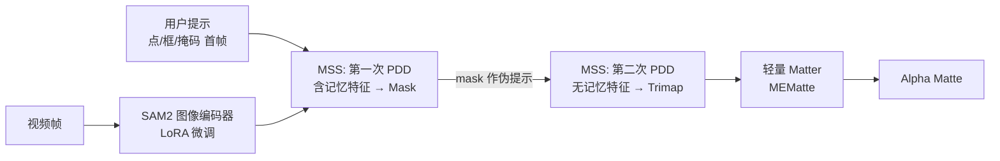

# Matting Anything 2: Towards Video Matting for Anything

**会议**: ICLR 2026  
**OpenReview**: [https://openreview.net/forum?id=6K08FPo2cf](https://openreview.net/forum?id=6K08FPo2cf)  
**代码**: Matting-Anything-2（论文声明开源）  
**领域**: 视频抠图 / 分割（Video Matting）  
**关键词**: Video Matting, SAM2, Trimap, Promptable Decoder, Temporal Consistency, Transparent Objects  

## 一句话总结
基于 SAM2 构建一个可由点/框/掩码提示驱动的通用视频抠图模型 MAM2，通过"双模态解码器同时出 mask 与 trimap"以及"记忆分离孪生机制"解决透明物体跨帧崩溃问题，把抠图能力从人像扩展到火焰、气泡、水流等任意自然物体。

## 研究背景与动机
**领域现状**：视频抠图（从视频序列中逐帧抽取前景 alpha matte）是影视合成、虚拟背景、AR 融合的关键技术。近年主流方法要么走自动抠图路线（无需交互但无法指定目标），要么沿用半监督 VOS 范式（首帧给 mask 来选定目标）。

**现有痛点**：① **领域狭窄**——绝大多数视频抠图模型是人像中心（human-centric），对火焰、烟雾、水流等自然物体几乎不可用，且业界缺少评估跨域泛化能力的基准；② **依赖首帧 mask**——VOS 范式要求用户在首帧提供高质量掩码，但对透明物体（烟、火、气泡）而言，大量高透明区域连人眼都难以分辨，根本无法画出像素级 mask，而 box/point 这种粗交互显然更省力。

**核心矛盾**：trimap 引导的方法在自然图像抠图里早已证明能处理人像之外的复杂物体，但提供 trimap 的交互成本极高；而 SAM2 这类可提示模型交互友好、泛化强，却只会出二值 mask，不会出 trimap。**如何让一个交互友好的可提示模型自动产出高质量 trimap，并在视频里保持时序稳定**，是打通"任意物体视频抠图"的关键。

**本文目标**：构建一个继承 SAM2 交互能力（点/框/掩码）、仅需首帧交互、能处理任意物体（尤其透明物体）的通用视频抠图模型。

**核心 idea**：**以 SAM2 为骨架 + LoRA 微调**，让解码器**同时**预测 mask 和 trimap（用 mask 的稳定语义去引导 trimap），再用一个轻量 trimap-based matter 出最终 alpha；并针对透明物体的跨帧崩溃，提出**记忆分离的孪生二次解码**，把 trimap 解码从干扰性的 mask 记忆中隔离出来。

## 方法详解

### 整体框架
MAM2 是一个渐进式解码流水线，全视频仅需首帧交互。LoRA 微调的 SAM2 图像编码器先提取帧特征；随后**记忆分离孪生机制（MSS）**用两次串行的**可提示双模态解码器（PDD）**先后得到 mask 与 trimap；最后一个轻量的 trimap-based matter（采用 MEMatte）依据 trimap 预测最终 alpha matte。训练上配合一个**选择性监督方案**，把异构的图像抠图/视频抠图/VOS 数据按需分配到不同损失上。

### 关键设计

**1. 可提示双模态解码器 PDD：让 mask 给 trimap 当老师。** SAM2 原始解码器只会出语义一致的二值 mask，而 trimap（前景/背景/未知三分）是一种本质不同的语义表达，直接加一个独立并行分支去预测会得到边界锯齿、噪声严重的 trimap。PDD 的关键在于**把 SAM2 稳定的 mask 预测作为强引导注入 trimap 分支**：预测出的 mask 先经 sigmoid 归一化、再过一层卷积得到 mask augment feature，与原始分割特征、trimap 特征拼接后，由一个轻量融合模块做 mask 引导的增强，最后用融合特征与 trimap output token 做点积得到 trimap。形式上解码过程为 $(M^t, T^t) = f_{\text{PDD}}(F^t, P)$，首帧 $P$ 为用户提示、后续帧 $P=\varnothing$ 而特征带记忆。仅此一处设计就在自然物体/人像基准上分别带来 24%/29% 的提升。

**2. 记忆分离孪生机制 MSS：把 trimap 解码从 mask 记忆里救出来。** 当 PDD 处理透明物体时出现诡异的"时序崩溃"——首帧 trimap 准确，但从第二帧起未知区域被大面积误判为前景，trimap 退化成接近二值 mask。根因在于 SAM2 对非首帧靠的是**把上一帧 mask 记忆嵌入图像特征**来替代缺失的用户提示，而这个嵌入操作让特征空间发生显著偏移，严重干扰 trimap 解码（mask 与 trimap 所需的理想特征空间本就不一致）。MSS 的解法是一次**孪生二次解码**：后续帧先用带记忆特征 $F^t_{\text{mem}}$ 解出 mask，$M^t = \pi_1\big(f_{\text{PDD}}(F^t_{\text{mem}}, \varnothing)\big)$；再把这个 mask 当作**伪提示**，在**预先保存的、未经记忆嵌入的无记忆特征** $F^t_{\text{non-mem}}$ 上做第二次解码得到 trimap，$T^t = \pi_2\big(f_{\text{PDD}}(F^t_{\text{non-mem}}, M^t)\big)$。这样 trimap 解码重新对齐到"无记忆特征 + 提示"的理想配置，规避了特征偏移干扰；而时序一致性则借由那个从记忆特征解出的 mask 隐式传递下来。由于两次 PDD 共享权重，这是一个孪生结构，**不增加任何参数**，且第二次解码计算开销可忽略。

**3. 选择性监督方案：让异构数据各司其职。** 视频抠图数据极度稀缺，必须借图像抠图（IM）和 VOS 数据补充，但它们的标注语义和精度参差不齐。该方案借助 MAM2 能同时产出 mask/trimap/alpha 的能力把训练拆成两阶段：第一阶段优化主干参数 $\theta_{\text{main}}$，按数据来源用指示函数选择激活损失，$L_{\text{main}} = \mathbb{I}_{\text{VOS}} \cdot L_{\text{mask}} + (\mathbb{I}_{\text{VM}} + \mathbb{I}_{\text{IM}}) \cdot L_{\text{trimap}}$，让模型稳健产出粗 mask 或 trimap；第二阶段只优化轻量 matter 参数 $\theta_{\text{matter}}$，$L_{\text{matter}} = \mathbb{I}_{\text{IM}} \cdot L_{\alpha}$，**只用图像抠图数据**监督——因为细粒度细节感知需要高保真标注，而图像抠图的标注质量显著优于视频抠图。

## 实验关键数据

### 主实验：交互模式视频抠图（首帧提示）

| 方法 | 提示 | NOVM MAD↓ | NOVM MSE↓ | NOVM GRAD↓ | YoutubeMatte MAD↓ | MSE↓ |
|------|------|-----------|-----------|------------|-------------------|------|
| FTP-VM | Trimap | 37.98 | 19.90 | 78.06 | 2.26 | 1.10 |
| MaGGIe | Mask | 50.04 | 35.23 | 108.01 | 2.37 | 0.98 |
| MatAnyone | Mask | 39.44 | 25.63 | 89.60 | 2.05 | 0.76 |
| **MAM2** | Mask | **15.19** | **4.27** | **26.45** | **1.16** | **0.24** |
| **MAM2** | Box & Point | **14.72** | **3.70** | **23.54** | **1.16** | **0.24** |

在自然物体基准 NOVM 上把 MAD 从 SOTA 的 39.44 降到 14.72（降幅约 63%），人像 YoutubeMatte 上从 2.05 降到 1.16，说明它**不是只为透明物体优化、反而在人像上也全面更强**。即便不给 mask、仅用点/框驱动，性能依然最佳。

### 消融实验（Table 5）

| 配置 | NOVM MAD↓ | NOVM MSE↓ | Youtube MAD↓ |
|------|-----------|-----------|--------------|
| Parallel（简单并行分支） | 26.19 | 13.21 | 1.54 |
| PDD | 18.55 | 6.77 | 1.16 |
| PDD + MCS（记忆一致孪生） | 20.23 | 8.59 | 1.18 |
| PDD + MSS | **14.72** | **3.70** | 1.16 |

### 关键发现
- **PDD 替换朴素并行分支**：NOVM MAD 26.19→18.55，验证 mask 引导对 trimap 质量的决定性作用。
- **MSS 的核心是"无记忆特征"而非"多一次解码"**：对照组 MCS 仅在带记忆特征上多解一次，MAD 反而从 18.55 退到 20.23 无收益；换成无记忆特征的 MSS 才降到 14.72，直接坐实了"mask 记忆嵌入干扰 trimap 解码"这一根因诊断。
- **一套参数双任务通吃**：同一模型在图像抠图 AIM-500 上 Box 提示 MSE 4.24/SAD 18.07，优于 SDMatte 等专用图像抠图方法；视频与图像任务参数完全相同。
- 全模型可训练参数仅 44.7M（SAM2 编码器 LoRA rank=16 + DINO 初始化的 ViT-Small matter）。

## 亮点与洞察
- **把"任意分割"升级成"任意抠图"**：站在 SAM2 肩上，用 mask 的稳定性反哺 trimap 的不稳定性，是一个很巧的"以强带弱"思路。
- **对失败现象的根因诊断扎实**：作者没有简单堆模块，而是定位到"记忆嵌入造成特征空间偏移→trimap 退化为 mask"的具体机理，并用 MCS vs MSS 对照实验精准证伪了"多解一次就有用"的朴素假设。
- **孪生结构零额外参数**：二次解码复用同一 PDD 权重，工程上几乎免费换来透明物体的时序鲁棒性。
- **填补基准空白**：NOVM 是首个覆盖动物、气泡、云、火、水、霜、植物等多域的视频抠图基准，对推动"非人像视频抠图"研究有基础设施价值。

## 局限与展望
- 仍是**首帧交互**范式，对极快运动或目标完全消失再出现的长视频，记忆传递的鲁棒性未充分验证。
- 依赖轻量 matter（MEMatte）出最终 alpha，整体精度受其上限约束；trimap 一旦预测错误会被 matter 灾难性放大（作者也指出透明物体的前景误判是致命的）。
- NOVM 由 After Effects 素材合成到动态背景上构建，与真实拍摄的复杂光照/运动模糊分布可能存在差距。
- 透明物体外，对半透明叠加、相互遮挡的多目标场景未做系统评估。

## 相关工作与启发
- **VOS 谱系**：半监督 VOS（掩码传播 / 记忆匹配）与交互式 VOS（SAM2 引发的点击式分割）是 MAM2 交互能力的根基。
- **视频抠图谱系**：自动抠图（MODNet/RVM，无法指定目标）、VOS 范式抠图（MatAnyone，需首帧 mask）、trimap 引导抠图（FTP-VM，交互成本高）、背景引导抠图（需干净背景，难落地）——MAM2 本质是把 trimap 引导的高精度与 SAM2 提示的低交互成本合二为一。
- **SAM-based 图像抠图**：Matting Anything、SEMatte、ZIM、SDMatte 是其图像抠图侧的直接对比对象；PDD 的"mask 引导 trimap"正是对 SEMatte 朴素并行分支的改进。
- **启发**：当一个强基座模型（SAM2）的内部机制（记忆嵌入）与新任务（trimap 解码）所需特征空间冲突时，"隔离 + 孪生复用"是一种低成本、可迁移的解耦范式，可推广到其他"在分割基座上挂接异构语义头"的任务。

## 评分
- **新颖性**: ⭐⭐⭐⭐ — PDD 的 mask 引导 trimap 与 MSS 的记忆分离孪生都是针对具体失败机理的原创设计，且把视频抠图从人像扩展到任意物体，思路新颖且诊断深入。
- **实验充分度**: ⭐⭐⭐⭐ — 覆盖交互/自动视频抠图、图像抠图多基准，消融用 MCS vs MSS 精准证伪关键假设；但真实拍摄视频与长视频鲁棒性验证略显不足。
- **写作质量**: ⭐⭐⭐⭐ — 动机—诊断—解法逻辑清晰，公式与图示配合到位，失败现象的归因叙述尤其有说服力。
- **价值**: ⭐⭐⭐⭐ — 一套参数通吃图像/视频抠图、仅需粗提示、附带新基准 NOVM，实用价值与社区基础设施价值兼具。

<!-- RELATED:START -->

## 相关论文

- [\[ICCV 2025\] ZIM: Zero-Shot Image Matting for Anything](../../ICCV2025/segmentation/zim_zero-shot_image_matting_for_anything.md)
- [\[CVPR 2026\] MatAnyone 2: Scaling Video Matting via a Learned Quality Evaluator](../../CVPR2026/segmentation/matanyone_2_scaling_video_matting_via_a_learned_quality_evaluator.md)
- [\[ICLR 2026\] SAM 3: Segment Anything with Concepts](sam_3_segment_anything_with_concepts.md)
- [\[AAAI 2026\] Segment Anything Across Shots: A Method and Benchmark](../../AAAI2026/segmentation/segment_anything_across_shots_a_method_and_benchmark.md)
- [\[ICML 2026\] Segment Anything with Robust Uncertainty-Accuracy Correlation](../../ICML2026/segmentation/segment_anything_with_robust_uncertainty-accuracy_correlation.md)

<!-- RELATED:END -->
