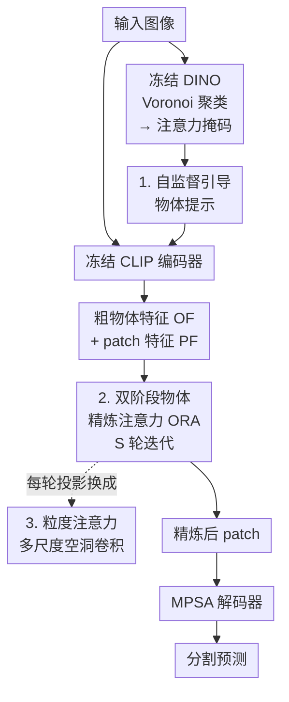

# Object-Centric Refinement for Enhanced Zero-Shot Segmentation

**会议**: ICLR 2026  
**OpenReview**: [https://openreview.net/forum?id=oeWqDrTb38](https://openreview.net/forum?id=oeWqDrTb38)  
**代码**: https://github.com/confupload/OC-ZSS  
**领域**: 语义分割 / 零样本分割 / 视觉语言模型  
**关键词**: 零样本分割, CLIP, 物体中心表示, 自监督提示, 跨注意力精炼

## 一句话总结
针对 CLIP patch 特征"缺乏物体结构、难以聚成连贯语义区域"的痛点，OC-ZSS 在冻结的 CLIP 编码器里注入由 DINO 聚类引导的"物体提示"，再用双阶段物体精炼注意力（ORA）配合多尺度粒度注意力，把 patch 特征反复打磨成物体中心表示，在归纳 / 直推 / 跨域三种零样本分割设定下都刷到 SOTA。

## 研究背景与动机
**领域现状**：零样本语义分割（ZSS）要在没有掩码标注的情况下把未见类别也逐像素分割出来，主流做法是把 CLIP 当冻结骨干，在文本嵌入和视觉特征之间做对齐，然后在解码器侧做文章——比如 ZegCLIP 加提示、Cascade-CLIP 做级联解码器、OTSeg 用 Sinkhorn 注意力替换标准注意力。

**现有痛点**：这些方法全都盯着"解码器怎么改"，却忽略了一个更底层的问题——CLIP 的 patch 特征本身就是"物体无关"的。CLIP 只在全局图文嵌入层面做了对齐，它的 patch token 并不会自然地聚成语义连贯的物体区域。视觉接地（visual grounding）一弱，细粒度定位就差，未见类别上尤其明显。

**核心矛盾**：要让分割好，patch 特征需要有物体中心结构；但要拿到物体结构，传统思路要么重训编码器（破坏 CLIP 的图文对齐、也贵），要么像 Slot Attention 那样生成 group token（ZSS 要的是 patch 和文本类别对齐，不是 group token，路子不对）。如何在**不动编码器**的前提下把物体信息注入 patch，是关键。

**本文目标**：在冻结 CLIP 上（1）无监督地找到物体位置、（2）抽出物体级特征、（3）用这些特征反过来把 patch 精炼成物体中心表示，且对不同尺度的物体都鲁棒。

**切入角度**：作者注意到 DINO 这类自监督模型的特征天然具备良好的局部分组性。但他们**不去模仿或蒸馏 DINO 特征**（区别于 CLIP-DINOiser、ProxyCLIP），而只用 DINO 来"指路"——告诉物体提示该往哪些 patch 上看。

**核心 idea**：用 DINO 聚类生成的注意力掩码引导一组"物体提示"在冻结 CLIP 里抓取粗物体特征，再用一个双阶段跨注意力模块让物体特征和 patch 特征互相迭代精炼，把 CLIP 的 patch 改造成物体中心的表示。

## 方法详解

### 整体框架
OC-ZSS 的输入是一张图，输出是逐像素的分割图，整条管线在**冻结的 CLIP ViT-B/16** 上跑。它要解决的核心是"把物体无关的 patch 变成物体中心的 patch"，整体分三步转：

先用一个冻结的 DINO 编码器对图做 Voronoi 聚类，得到 $n_o$ 个粗物体区域，据此构造一张注意力掩码；这张掩码被塞进 CLIP 编码器，引导 $n_o$ 个**冻结的物体提示** $O$ 各自只去看自己负责的那块区域，从而在编码器末层产出粗物体特征 $OF = O^L$，同时 CLIP 照常输出 patch 特征 $PF = H^L$。接着 $OF$ 和 $PF$ 进入**物体精炼注意力（ORA）**模块，做 $S$ 轮迭代：每轮先用 patch 精炼物体、再用物体精炼 patch，且两个方向的投影都换成**多尺度粒度注意力**。最后精炼好的 patch 特征 $PF$ 作为 K/V 喂给 MPSA 解码器（沿用 OTSeg 的多提示 Sinkhorn 解码 + Dice/focal 损失），输出分割预测。

### 关键设计

**1. 自监督引导的物体提示：无标注地把"物体在哪"告诉冻结的 CLIP**

痛点很直接：要做物体中心精炼，得先知道物体在图里的位置，但 ZSS 没有掩码标注，且不允许重训编码器。CLIP-RC 用固定方格区域提示来定位，但方格框不住非刚性、形状不规则的真实物体。作者的做法是在 CLIP 每个 Transformer 层都追加 $n_o$ 个**冻结**的物体提示 $O^l = \{O^l_1, \dots, O^l_{n_o}\}$，并用一张定制注意力掩码 $\text{Attn\_mask} \in \mathbb{R}^{(1+n_p+n_o+M)\times(1+n_p+n_o+M)}$ 控制每个提示只能看一小撮 patch。

掩码怎么来？先把图 patch 化喂给冻结 DINO 得到特征 $X_s$，再做 Voronoi 聚类把 patch 分成 $n_o$ 组 $C = \{c_1, \dots, c_{n_o}\} = \text{voronoi\_clustering}(X_s)$。掩码初始化为 0，物体提示对应的行列先设为 $-\infty$ 屏蔽自注意力，再把每个提示 $j$ 与它负责的 patch 子集 $c_j$ 之间的条目放回 0：$\text{Attn\_mask}[1+n_p+M+j,\, 1+n_p+i] = 0,\ \forall i \in c_j$（反向同理）。这套掩码在全部 $L$ 层都生效，于是每个物体提示逐层只聚合自己那块区域的信息，末层的 $OF = O^L$ 就成了粗物体特征。关键区别在于：DINO 只负责"指路"（生成掩码），最终抓特征、做对齐的还是 CLIP 自己，因此不会破坏 CLIP 的图文对齐，也比固定方格更贴合真实物体形状。

**2. 双阶段物体精炼注意力 ORA：让物体特征和 patch 互相打磨**

DINO 聚类是无监督的，所以物体提示给出的 $OF$ 只是粗的，而且它并不会直接改善真正用于分割的 patch 特征。ORA 就是来补这一刀的：它在 $S$ 轮迭代里交替做两件事。**物体精炼阶段**让物体特征去 attend patch 特征：$OF\_Ref = \text{Cross\_Attention\_OR}(OF, PF)$，再用 GRU 把新旧物体特征聚合 $OF = \text{GRU}(OF\_Prev, OF\_Ref)$；**patch 精炼阶段**反转方向，让 patch 去 attend 更新后的物体特征 $PF\_Ref = \text{Cross\_Attention\_PR}(PF, OF)$，同样过 GRU $PF = \text{GRU}(PF\_Prev, PF\_Ref)$。

这里有两个关键点。其一，$OF$ 的初始化来自物体提示而非随机——Slot Attention 类方法已证明随机初始化会让迭代精炼退化，物体提示恰好提供了语义有意义的初值，让精炼稳定。其二，GRU 的循环更新维持了物体表示跨迭代的连续性，避免来回震荡。与 Slot Attention 只挖 group token 不同，ORA 是**双向互精炼**：既更新物体特征、又用它去丰富 patch 语义，促成更紧的物体级分组和更好的图文对齐。最终的 $PF$ 取代原始 $H$ 作为解码器的 K/V。

**3. 粒度注意力：让精炼对物体尺度变化鲁棒**

ORA 里跨注意力的 K/V/Q 原本由 patch 特征经线性投影得到，但线性投影只能在单一空间分辨率上聚合上下文，碰到大小差异大的物体就力不从心。作者把这些线性投影换成一个轻量的**多尺度特征提取器**（借鉴 DeepLab 的空洞卷积，但用在精炼阶段而非解码器）：用四个不同膨胀率 $d_1, d_2, d_3, d_4$ 的深度可分离空洞卷积加一条全局平均池化分支并行抽特征，沿通道拼接后过 $1\times1$ 卷积把通道从 $5D$ 压回 $D$：

$$X_{in} = \text{Concat}\big(\text{DW\_Conv}(3{\times}3, r{=}d_1), \dots, \text{DW\_Conv}(3{\times}3, r{=}d_4),\ \text{GAP}\big)$$
$$X_{gran} = \text{Conv}(1{\times}1,\ 5D \to D)(X_{in})$$

由此得到粒度化的 $\text{Gran\_K}_{or}, \text{Gran\_V}_{or}$（物体精炼用）和 $\text{Gran\_Q}_{pr}$（patch 精炼用）。把这些尺度感知的表示替换进 ORA 的两个跨注意力，模块就能在迭代中显式建模物体的尺度与结构差异，patch 和物体特征都被打磨得更有判别力。

### 损失函数 / 训练策略
解码器与训练完全沿用 OTSeg：3 层多提示 Sinkhorn 注意力（MPSA）解码器，关系描述子 $\hat{T} = \text{concat}(T \odot g, T)$ 作 query；除了主预测 $Y$，还从 $\hat{T}$ 和 $H$ 直接生成辅助预测 $\tilde{Y} = \text{Upsample}(\text{Sigmoid}(\text{MPS}(\hat{T}H^T)))$，推理时取 $Y$ 与 $\tilde{Y}$ 平均。总损失 $L_{tot} = L_{seg}(Y, Y_{gt}) + L_{seg}(\tilde{Y}, Y_{gt})$，其中 $L_{seg}$ 是 Dice + focal。骨干用 CLIP ViT-B/16（配 VPT 视觉提示微调），DINO-B/16 与文本编码器全程冻结；VOC/COCO 用 6 个物体提示、Context 用 8 个，默认 4 轮 ORA 迭代；AdamW，学习率 2.5e-5，batch 16。

## 实验关键数据

### 主实验
三个标准基准：PASCAL VOC 2012、PASCAL Context、COCO-Stuff 164K；指标为未见类 mIoU(U)、已见类 mIoU(S) 及二者调和平均 hIoU。

归纳设定（inductive，训练只用已见类标注、不接触未见类名）：

| 数据集 | 指标 | OC-ZSS | OTSeg | CLIP-RC |
|--------|------|--------|-------|---------|
| VOC 2012 | hIoU | **89.2** | 87.1 | 85.8 |
| VOC 2012 | mIoU(U) | **85.3** | 81.6 | 80.7 |
| PASCAL Context | hIoU | **58.7** | 57.7 | 51.9 |
| COCO-Stuff 164K | hIoU | **42.5** | 41.5 | 41.2 |

直推设定（transductive，训练可用未见类名、但无未见类分割标注）：

| 数据集 | 指标 | OC-ZSS | OTSeg | SPT-SEG |
|--------|------|--------|-------|---------|
| VOC 2012 | hIoU | **95.2** | 94.4 | 93.4 |
| PASCAL Context | hIoU | **61.9** | 59.8 | 59.9 |
| COCO-Stuff 164K | hIoU | **51.5** | 49.8 | 49.7 |

跨域（COCO 训练 → 评测其它库，Table 3）：归纳设定下 Context 49.6 / VOC 94.2，直推设定 54.0 / 94.5，均超过 OTSeg。效率上（Table 4）OC-ZSS 仅 27.2M 参数、64.0 GFLOPs、3.35G 显存，与最轻的 OTSeg（13.8M / 61.9 GFLOPs）相近，远低于 CLIP-RC（36.9M）与 ZSSeg（61.1M、1916 GFLOPs）。

### 消融实验
VOC 2012 / PASCAL Context，归纳设定，逐组件叠加（Table 6，mIoU(U)）：

| 配置 | VOC U | Context U | 说明 |
|------|-------|-----------|------|
| Baseline | 80.6 | 59.4 | 无 ORA / 提示 / 粒度注意力 |
| + ORA（物体随机初始化） | 82.0 (+1.4) | 61.4 (+2.0) | 仅加双阶段精炼 |
| + DINO 引导物体提示 | 84.0 | 61.7 | 补上语义初始化 |
| + 粒度注意力（Full） | **85.3** | **62.1** | 完整模型 |

掩码生成策略对比（Table 7，hIoU）：DINO-B/16 **89.2** > DINOv2-B/14 89.1 > DINO-B/8 88.4 > CLIP 特征 87.6 > 固定 Region 提示 87.2 > No Mask 87.1。

### 关键发现
- **三组件缺一不可，且都正向**：ORA 单独就带来 +1.4/+2.0（未见类）的提升，DINO 提示提供好的初始化进一步涨点，粒度注意力封顶——印证了"好初始化 + 双向精炼 + 多尺度"三者协同。
- **自监督掩码 > 固定方格 > 无掩码**：用 DINO/DINOv2 聚类掩码明显优于 CLIP 自身特征、CLIP-RC 的固定 Region 提示和随机初始化，说明"无监督但物体感知"的指路方式确实关键；DINO-B/16 甚至略胜 DINOv2，且不必用更细粒度的 B/8。
- **低标注更见功力**：VOC 只用 25% 类作已见类时，OC-ZSS 未见类 49.8，远超 CLIP-RC（28.8）和 OTSeg（17.7，几乎崩）；50% 时 59.1 仍领先。物体中心精炼在监督稀缺时优势被放大。
- **定性上**（Fig 5）有无 ORA 的 patch 聚类对比鲜明：无 ORA 聚类散乱无结构，有 ORA 后聚类围绕真实物体更连贯局部化。

## 亮点与洞察
- **"借 DINO 指路、不抄 DINO 特征"是最巧的一笔**：以往 open-vocab 方法（CLIP-DINOiser、ProxyCLIP）都让 CLIP 去模仿 DINO 的局部特征，本文只用 DINO 生成注意力掩码来引导物体提示，最终特征仍是 CLIP 自己产的——既拿到了物体分组先验，又不破坏 CLIP 的图文对齐，思路上更干净。
- **物体提示当"初始化器"而非"输出"**：把 Slot Attention 里饱受 slot collapse / 坏初始化困扰的问题，转化为"用编码器内提示提供语义初值"，这个视角迁移很值得复用——任何迭代精炼模块都可以借一个外部先验来稳住初始状态。
- **把多尺度从解码器搬进精炼过程**：传统语义分割把空洞卷积放解码器，本文放进物体/patch 互精炼的跨注意力投影里，让尺度感知直接作用于表示打磨阶段，这是一个可迁移到其它"迭代精炼 + 尺度敏感"任务的小设计。
- **几乎零额外成本拿大幅提升**：相比 OTSeg 只多十几 M 参数和约 2 GFLOPs，却在所有设定全面领先，说明瓶颈确实在"patch 缺物体结构"而非模型容量。

## 局限与展望
- **依赖外部 SSL 骨干**：物体线索来自 DINO，引入额外计算，且当掩码与真实物体严重错配时会传播偏差；Voronoi 聚类 + ORA 能缓解部分过/欠覆盖，但高度重叠或极度模糊的物体仍困难，近饱和类别上提升有限。
- **超参固定、不自适应**：物体提示数量和 ORA 迭代轮数都是全局固定值，没有按图自适应，也没有在精炼中动态重估 / 拆分掩码。作者提出可探索基于熵的自适应轮数与在线重切分掩码。
- **自己的观察**：消融只到逐组件叠加，缺少对"物体提示数量 / 迭代轮数"的定量敏感性曲线；且 DINO-B/16 略胜 DINOv2 的现象未深究原因，可能与 patch 粒度和聚类匹配度有关，值得进一步分析。
- **改进思路**：探索 SSL-free 的物体提示引导（如直接从 CLIP 注意力图无监督找物体），以摆脱对 DINO 的依赖；或让掩码在 ORA 迭代中随精炼结果更新，形成"定位—精炼"闭环。

## 相关工作与启发
- **vs OTSeg**：OTSeg 用 Sinkhorn 注意力改解码器、保持参数高效，但 patch 特征仍物体无关；OC-ZSS 复用了 OTSeg 的解码器与损失，把创新点前移到"在编码器侧把 patch 变物体中心"，因此能在几乎同等开销下全面超越它。
- **vs CLIP-RC**：CLIP-RC 用固定方格 Region 提示，只做简单特征融合、不鼓励物体分组；OC-ZSS 用 DINO 聚类的动态非刚性区域引导提示，且通过 ORA 真正改写 patch 表示，消融里掩码策略对比直接验证了动态 > 固定。
- **vs OVSegmentor / Slot Attention**：它们在可训练编码器里用 Slot Attention 生成 group token、需端到端训练；OC-ZSS 全程冻结 CLIP，不产 group token 而是直接精炼 patch-文本对齐，且把多尺度精炼引入 slot 类框架（前人未做）。
- **vs CLIP-DINOiser / ProxyCLIP**：这两者让 CLIP 去模仿 / 蒸馏 DINO 的局部特征；OC-ZSS 只用 DINO 引导提示注意力、不模仿其特征，定位更轻、也不绑死在某个 SSL 骨干上。

## 评分
- 新颖性: ⭐⭐⭐⭐ "借 DINO 指路而非抄特征 + 双向 ORA 互精炼 + 把多尺度搬进精炼"组合新颖，单个组件多有渊源
- 实验充分度: ⭐⭐⭐⭐⭐ 三库 × 归纳/直推/跨域 + 低标注 + 效率 + 逐组件消融 + 掩码策略对比，覆盖很全
- 写作质量: ⭐⭐⭐⭐ 动机清晰、与相关工作区分讲得透，公式记号偶有繁琐
- 价值: ⭐⭐⭐⭐ 指出"ZSS 真正瓶颈在 patch 缺物体结构"并低成本解决，对后续 ZSS 工作有方向性启发

<!-- RELATED:START -->

## 相关论文

- [\[CVPR 2026\] DSS: Discover, Segment, and Select for Zero-shot Camouflaged Object Segmentation](../../CVPR2026/segmentation/discover_segment_and_select_a_progressive_mechanism_for_zero-shot_camouflaged_ob.md)
- [\[ECCV 2024\] Efficient and Versatile Robust Fine-Tuning of Zero-shot Models](../../ECCV2024/segmentation/efficient_and_versatile_robust_fine-tuning_of_zero-shot_models.md)
- [\[ICCV 2025\] ZIM: Zero-Shot Image Matting for Anything](../../ICCV2025/segmentation/zim_zero-shot_image_matting_for_anything.md)
- [\[AAAI 2026\] Otter: Mitigating Background Distractions of Wide-Angle Few-Shot Action Recognition with Enhanced RWKV](../../AAAI2026/segmentation/otter_mitigating_background_distractions_of_wide-angle_few-shot_action_recogniti.md)
- [\[AAAI 2026\] Guideline-Consistent Segmentation via Multi-Agent Refinement](../../AAAI2026/segmentation/guideline-consistent_segmentation_via_multi-agent_refinement.md)

<!-- RELATED:END -->
