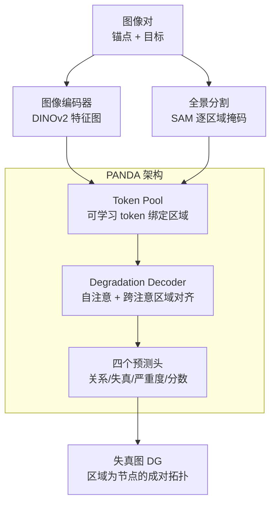

# Panoptic Pairwise Distortion Graph

**会议**: ICLR 2026  
**OpenReview**: [https://openreview.net/forum?id=VDfF7NqJJl](https://openreview.net/forum?id=VDfF7NqJJl)  
**项目页**: [aismartperception.github.io/distortion-graph](https://aismartperception.github.io/distortion-graph/)  
**代码**: 待确认  
**领域**: 全景分割 / 图像质量评估 / 多模态VLM  
**关键词**: 失真图、区域级评估、成对比较、全景分割、MLLM

## 一句话总结
本文把场景图从"单图内"推广到"图像对之间"，提出**失真图（Distortion Graph, DG）**这一以区域为原子节点的结构化表示，并配套了 50 万对图像的区域级失真数据集 PANDASET、三档难度的基准 PANDABENCH 和一个 DETR 风格的轻量架构 PANDA；实验表明前沿 MLLM 在区域级失真比较上几乎等于随机猜，而 PANDA 在各档难度上全面领先，且把预测出的 DG 喂给 MLLM 当思维链能再激发约 15% 的涌现提升。

## 研究背景与动机
**领域现状**：图像质量评估（IQA）和失真理解近年大量转向多模态大模型（MLLM）路线——Q-Instruct、Co-Instruct、DepictQA 这类工作通过指令微调，让模型对一张（或多张）图给出失真类型、严重度、质量打分甚至自然语言描述。这些方法的共同范式是**自顶向下的整图分析**：把整幅图当作一个全局对象来判断好坏。

**现有痛点**：整图视角天然不支持细粒度理解。当用户真正关心"这张图里哪个区域被压缩坏了、哪个区域比另一张更清晰"时，现有 MLLM 即便被显式喂进区域信息（名称、描述、bounding box）也答不好——它们要么漏掉区域、要么输出模板化套话（"画质中等、有一些模糊"），更被上下文长度卡住，区域一多就无法稳定处理。作者在图 2 里展示：Co-Instruct 这类被失真指令微调过的模型，面对区域级新指令几乎丧失指令跟随能力。

**核心矛盾**：根本原因是**缺少一个以区域为基础、且面向图像对的结构化表示**。失真信息本质上是局部的、可比较的，但现有方法既不是 region-first，也不是 comparative-by-design，只能把区域理解"隐式"压进整图判断里。

**本文目标**：把"成对图像的密集失真信息"显式建模为一个紧凑、可解释、可被机器学习的图结构，使得（i）每个区域单独承载失真类型/严重度/质量分，（ii）跨图同名区域之间有明确的比较边，（iii）这些区域级判断能自然聚合到整图结论。

**切入角度**：作者借鉴场景图（scene graph）把单图内的物体-关系建成图的思路，但把它从 intra-image 扩展到 inter-image——节点是区域，边是跨图的"谁更好"比较谓词。作者论证这个方向有希望：区域级信息能聚合成整图判断，反过来却不成立，所以 region-first 是更根本的表示。

**核心 idea**：用"图像对的失真图（DG）"代替"整图打分"，让区域成为评估的原子单位，并提供数据集、基准与高效架构把这一任务真正学出来。

## 方法详解

### 整体框架
方法分三层：先**定义任务**（DG 是什么、满足什么性质），再**造数据**（PANDASET/PANDABENCH 怎么生成区域级标签和比较关系），最后**给架构**（PANDA 如何从一对图像预测出 DG）。

PANDA 的推理 pipeline 很直接：输入锚点图 $I_A$ 与目标图 $I_T$，分两路——一路用预训练编码器（如 DINOv2）抽特征图 $F_j$，另一路用全景分割（如 SAM）把每张图切成对齐的 $N_R$ 个区域掩码；二者在 **Token Pool** 里把"可学习 token + 区域掩码 + 图像特征"绑定成区域特征；这些区域特征进入 **Degradation Decoder**，靠自注意力消化整图上下文、靠跨注意力让一图中的区域去对齐另一图中的同名区域；最后四个 MLP 预测头分别输出比较关系、失真类型、严重度、质量分，组装成失真图 DG。下面的框架图给出这条主链：

### 关键设计

**1. 失真图（DG）：把场景图从单图推广到图像对的失真拓扑**

针对"缺少 region-first 且 comparative 的结构化表示"这一根因，作者把 DG 形式化为一个四元组 $G=(O_{I_A}, O_{I_T}, E_D, E_S)$：$O_{I_A}, O_{I_T}$ 是锚点图与目标图的区域（物体）节点集，$E_D$ 是跨图的**失真比较边**，$E_S$ 是可选的场景关系边。每个节点 $o_i^j=(c_i^j, m_i^j, I_j, A_{D,i}, A_{S,i})$ 携带类别、二值掩码、所属图像、失真属性（类型/严重度/分数）等信息，掩码由映射 $\gamma: O\to M$ 把区域接地到像素。DG 还被约束满足三条性质让它"自洽"：**有效性**（失真边只能连同一索引的锚点-目标配对区域 $(o_i^A, r, o_i^T)$，不存在图内三元组）、**有序性**（比较关系一律按"锚点相对目标"方向书写，$(o_i^T, r, o_i^A)\notin E_D$）、**功能比较性**（每对匹配区域恰好被一条比较关系 $r$ 标注，$|\{r: (o_i^A,r,o_i^T)\in E_D\}|=1$）。这套定义的价值在于：它把"哪个区域、是什么失真、有多严重、比另一张谁好"压成一个紧凑可解释的图，既能被模型直接学，也能聚合出整图判断——而场景图只是它在"无失真、关系正交"时的特例。

**2. PANDASET 与基于 TOPIQ 的比较关系标注：让"区域级成对失真"有监督可学**

文献里没有同时满足"区域优先 + 成对比较 + 密集多样失真标注"的数据集（见基准对比表），所以作者基于 PSG（Visual Genome∩COCO，提供区域全景分割+场景信息）和 Seagull-100w（含真实 ISP 失真+区域分割）构建 PANDASET：采样 2200 张高质量图（2000 训练/50 验证/150 测试），每图区域数可变（最多 112、均值 18）。失真在 DepictQA 的 11 类基础上加入雨/雪/雾三类天气失真，共 14 大类、32 子类，每个区域以 80% 概率被随机挑一种失真退化、20% 保持干净，并赋予 minor/moderate/severe/none 四档严重度。质量分用**全参考 TOPIQ** 在退化区域与干净区域之间算一个 $[0,1]$ 的分数。比较关系（谓词）的标注巧妙地复用了 TOPIQ：对每对同名区域，看锚点与目标分数之差——差 $<|0.1|$ 标为 *same*，落在 $\pm[0.1,0.3)$ 标为 *slightly better/worse*，$>0.3$ 标为 *significantly better/worse*。通过在同一场景下取两张不同失真的图配对，$_{16}P_2=240$ 种排列共生成约 528K 对（训练 480K、验证 12K、测试 36K）。这样每条边、每个节点都有可监督的离散/连续标签，DG 学习被坐实为一个可训练的多任务问题。

**3. PANDA 架构：Token Pool 绑定区域 + Degradation Decoder 跨注意对齐**

要让"可变数量的区域"以最小代价从图像里借到信息，作者设计了 Token Pool 与 Degradation Decoder。**Token Pool** 为每张图维护一组与掩码同空间形状的可学习 token，从池中无放回均匀采样 $N_R$ 个与区域一一匹配，做 Hadamard 乘 $h_i^j=m_i^j\odot t_i^j$ 后用卷积投影并与图像特征融合 $\hat{H}^j=\mathrm{Conv}(H^j)\odot F^j$；同时让预训练特征经 $1\times1$ 卷积可学习。**Degradation Decoder** 是 DETR 风格的 $L$ 层 Transformer：先对图像特征 $\hat{F}_k$ 做自注意 $y^{SA}=[\mathrm{MHA}(Q,K,V)+\hat{F}_k]$，再让区域特征 $\hat{H}_j$ 作 query、对另一张图特征做**跨注意** $y^{CA}_{j\to k}=[\mathrm{MHA}(Q_{\hat H_j}, K_{y^{SA}}, V_{y^{SA}})+\hat{H}_j]$，从而让 $j$ 图里每个区域去"找到"$k$ 图里的对应区域并比较；经 MLP 与全局平均池化后，喂给四个 3 层 MLP 预测头分别输出比较关系、失真类型、严重度（分类）和质量分（回归）。整网用 AdamW 训 30 epoch，总损失 $L=\lambda_1 L^{rel}_{CE}+\lambda_2 L^{dist}_{CE}+\lambda_3 L^{sev}_{CE}+\lambda_4 L^{score}_{1}$（前三项类别交叉熵、分数用 L1）。相比 7B 级 MLLM，PANDA 不受上下文长度限制，能稳定处理可变区域数，这正是它在密集失真下不漏区域、不幻觉的关键。

**4. DG 作为思维链上下文：把结构化预测反哺 MLLM 激发涌现能力**

DG 不只是终点，还能当 MLLM 的"结构化提示"。作者把 PANDA 预测出的 DG 以思维链（CoT）形式塞进 GPT-5 Mini 的 prompt，并显式指示模型"把 DG 当作线索、当像素证据与之冲突时以像素为准"。结果在 PANDABENCH 上区域级失真理解平均涨约 15%。更重要的是，作者验证模型并非照抄 DG：在 DG 把锚点区域误判为 clean 时，GPT-5 Mini 能靠对比像素纠正为 darken/oversharpen；而当像素无明显矛盾信号时则倾向信任 DG。这说明 DG 是一种可被 MLLM "采纳或推翻"的额外结构线索，给"结构化表示 + 大模型"的协同提供了一个干净的接口。

### 损失函数 / 训练策略
总损失为四头加权 $L=\lambda_1 L^{rel}_{CE}+\lambda_2 L^{dist}_{CE}+\lambda_3 L^{sev}_{CE}+\lambda_4 L^{score}_{1}$；比较关系、失真类型、严重度三个分类头用类别交叉熵，质量分回归头用 L1。优化器 AdamW，学习率 $1\times10^{-4}$、权重衰减 0.01，训练 30 epoch，学习率与各 $\lambda$ 通过搜索确定，每个预测头是简单的 3 层 MLP（LayerNorm + GELU）。

## 实验关键数据

### 主实验
PANDABENCH 分 Easy / Medium / Hard 三档（Easy：整图单一失真、仅严重度不同；Medium：一图为混合失真；Hard：两图均为混合失真，逐区域不同），每档随机采 300 对。指标：比较/失真/严重度用 Accuracy、Precision、Recall、F1，质量分用 SRCC（SR）/PLCC（PL），越高越好。

| 设置 | 方法 | 比较 F1 | 失真 F1 | 严重度 F1 | 质量分 SRCC/PLCC |
|------|------|--------|--------|----------|------------------|
| Easy | DepictQA†（7B，PANDASET 微调） | 0.42 | 0.76 | 0.48 | 0.78 / 0.77 |
| Easy | GPT-5 Mini（闭源前沿） | 0.26 | 0.44 | 0.29 | 0.52 / 0.54 |
| Easy | Random | 0.19 | 0.06 | 0.25 | 0.00 / 0.00 |
| Easy | **PANDA** | **0.56** | **0.79** | **0.59** | **0.79 / 0.83** |
| Hard | DepictQA† | 0.19 | 0.09 | 0.22 | 0.18 / 0.17 |
| Hard | GPT-5 Mini | 0.15 | 0.09 | 0.20 | 0.09 / 0.13 |
| Hard | **PANDA** | **0.24** | **0.19** | **0.33** | **0.36 / 0.38** |

PANDA 在三档全部四项任务上都拿到最佳。即便 DepictQA 参数量大得多（7B、Vicuna-v1.5 骨干），因缺少 region-first 设计、受上下文限制频繁幻觉或漏区域，仍明显落后；闭源前沿 MLLM（GPT-4o、Gemini 2.5 Pro、GPT-5 系列）虽指令跟随强，但在区域级比较与打分上仅略好于随机。

### 消融 / 难度衰减分析

| 维度 | 关键发现 | 说明 |
|------|---------|------|
| Easy→Hard 整体趋势 | 所有方法一致掉点 | 细粒度失真在复杂退化下极难，验证基准区分度 |
| PANDA 的 Hard 鲁棒性 | 掉幅最小 | 区域优先 + 不受上下文限制，复杂退化下仍稳 |
| 严重度分类（Hard） | 多个强模型 < 随机基线 | 含闭源前沿模型，暴露严重度理解的系统性缺陷 |
| DG-CoT（Easy，GPT-5 Mini） | 比较准确率 0.31→0.52、质量分 0.52→0.78 | 喂入预测 DG 显著激发涌现能力 |
| DG-CoT（Hard，GPT-5 Mini） | 比较 0.18→0.37、质量分 0.09→0.36 | 难档同样有效，平均约 +15% |

### 关键发现
- **模型大≠会做区域级比较**：27B 的 Gemma-3 与多款前沿闭源 MLLM 在区域比较/打分上接近随机，说明缺的是 region-first 的结构表示而非参数量。
- **结构信息可被采纳也可被推翻**：DG 当 CoT 提示时，GPT-5 Mini 会在像素证据冲突时纠正 DG、在无矛盾时信任 DG，正是作者期望的"结构线索 + 像素裁决"协同模式。
- **越难越拉开差距**：从 Easy 到 Hard 各方法普遍崩塌，而 PANDA 掉幅最小，凸显专用区域级架构在密集混合失真下的价值。

## 亮点与洞察
- **把"评估"建模成"图"**：用场景图的范式重构成对 IQA，让区域成为可比较的原子节点——这个表示迁移（intra→inter image）干净又有解释性，是最让人"啊哈"的地方。
- **用 TOPIQ 双重复用造标签**：既用全参考 TOPIQ 给区域打质量分，又用其分数差阈值自动生成"显著/略微 更好/更差/相同"的比较谓词，省掉了昂贵的人工成对标注，思路可直接迁到其他需要成对偏好标签的任务。
- **Token Pool 解决"可变区域数"**：用可学习 token 与掩码做 Hadamard 绑定区域、再与图像特征融合，让任意数量区域以极小算力借到上下文，绕开了 MLLM 被上下文长度卡死的老问题。
- **DG 作为可插拔的 MLLM 线索**：把专用小模型的结构化预测当大模型思维链，是"小模型补结构、大模型补语言"的一个实用范式。

## 局限与展望
- **数据偏合成**：PANDASET 的失真大多由参数化退化/叠加生成（仅 Seagull 部分为真实 ISP 失真），真实世界复合退化与分布差异下的泛化未充分验证。
- **比较关系绑定 TOPIQ**：谓词标签的"真值"完全取决于 TOPIQ 分数与人工阈值（0.1/0.3），TOPIQ 本身的偏差会直接传导为标注噪声；作者也承认可换更复杂的偏好。
- **依赖外部分割与对齐**：PANDA 假设两图区域已一一对齐（$N_R^A=N_R^T$）且全景分割可靠，分割错误或跨图区域不可对齐时如何处理未深入讨论。
- **场景边被略去**：DG 形式上含场景关系 $E_S$，但实现中省略了场景预测头，结构信息的完整潜力尚未释放。
- **绝对精度仍低**：Hard 档上 PANDA 的 F1 也只有 0.19~0.33，说明区域级密集失真理解整体仍是开放难题。

## 相关工作与启发
- **vs Q-Instruct / Co-Instruct / Q-Bench**：它们把低层视觉理解搬进 MLLM，但都是**单图或整图**分析，且指令微调后易输出模板化套话、被上下文长度限制；本文是 region-first 且 comparative，并用专用架构而非指令微调。
- **vs DepictQA / M-BAPPS / MICBench**：这些做到了成对/无参考比较，但不是区域优先、也不提供密集的区域级失真标注；DepictQA 即便在 PANDASET 上微调（DepictQA†）仍因缺区域设计而落后于轻量的 PANDA。
- **vs Seagull / Q-Ground / Grounding-IQA**：它们是 region-level 的失真/质量 grounding，但都局限于**单图**设定（把质量描述映射到掩码或框）；本文的核心增量是把 grounding 扩展到**图像对之间的比较**，并给出 14 类多样失真+严重度+质量分的密集标注。
- **vs Set-of-Mark / Omni-RGPT 等区域提示**：这些提供通用区域级 token/标记机制，本文的 Token Pool 在精神上类似，但专门服务于成对失真比较，并配合 DETR 式跨注意做跨图区域对齐。

## 评分
- 新颖性: ⭐⭐⭐⭐⭐ 把场景图推广到图像对、提出失真图这一全新任务与表示，方向上有开创性
- 实验充分度: ⭐⭐⭐⭐ 覆盖开源/闭源 MLLM、三档难度与基线，并验证 DG-CoT；但绝对精度偏低、消融主要放在附录
- 写作质量: ⭐⭐⭐⭐ 任务定义形式化清晰（三条性质）、动机图示直观，架构记号略密
- 价值: ⭐⭐⭐⭐⭐ 数据集+基准+架构+应用一体，给细粒度成对 IQA 立了一个可被社区接着做的新坑

<!-- RELATED:START -->

## 相关论文

- [\[CVPR 2026\] DSFlash: Comprehensive Panoptic Scene Graph Generation in Realtime](../../CVPR2026/segmentation/dsflash_panoptic_scene_graph_realtime.md)
- [\[CVPR 2025\] Learning 4D Panoptic Scene Graph Generation from Rich 2D Visual Scene](../../CVPR2025/segmentation/learning_4d_panoptic_scene_graph_generation_from_rich_2d_visual_scene.md)
- [\[ECCV 2024\] OpenPSG: Open-set Panoptic Scene Graph Generation via Large Multimodal Models](../../ECCV2024/segmentation/openpsg_open-set_panoptic_scene_graph_generation_via_large_multimodal_models.md)
- [\[ICML 2026\] Functional Attention: From Pairwise Affinities to Functional Correspondences](../../ICML2026/segmentation/functional_attention_from_pairwise_affinities_to_functional_correspondences.md)
- [\[ICCV 2025\] SPADE: Spatial-Aware Denoising Network for Open-vocabulary Panoptic Scene Graph Generation](../../ICCV2025/segmentation/spade_spatial-aware_denoising_network_for_open-vocabulary_panoptic_scene_graph_g.md)

<!-- RELATED:END -->
