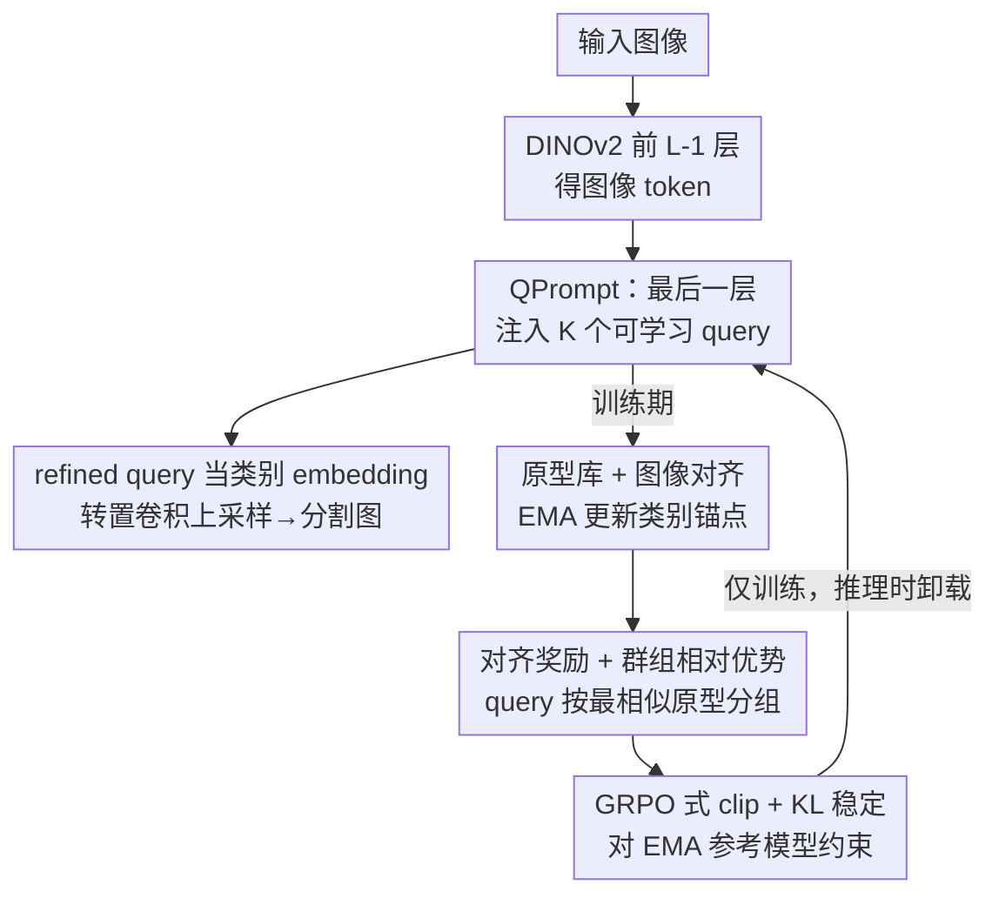

# QPrompt-R1: Real-Time Reasoning for Domain-Generalized Semantic Segmentation via Group-Relative Query Alignment

**会议**: ICLR 2026  
**OpenReview**: [https://openreview.net/forum?id=Vttn6pCwut](https://openreview.net/forum?id=Vttn6pCwut)  
**代码**: https://github.com/（论文标注 "QPrompt-R1"，具体地址以官方为准 ⚠️）  
**领域**: 语义分割 / 域泛化 / 实时推理  
**关键词**: 域泛化分割, 实时分割, 视觉基础模型, Query Prompt, 群组相对优化

## 一句话总结
针对"既要实时、又要跨域鲁棒"的语义分割难题，本文发现 DGSS 慢的瓶颈不在 VFM 骨干而在笨重的分割头，于是把可学习 query 只注入 VFM 最后一层（QPrompt）实现近似 query-decoding 的轻量架构，再用仅训练期生效的 GRQA（群组相对 query 对齐）解锁泛化能力，最终在 54 FPS 下逼近重型 DGSS 方法。

## 研究背景与动机
**领域现状**：自动驾驶、机器人导航这类安全攸关场景对语义分割同时提出两个硬要求——实时推理（避障、导航要低延迟）和域泛化鲁棒（要扛得住天气、光照、地形变化）。但学界长期把这两件事当成两条独立赛道：域泛化分割（DGSS）靠视觉基础模型（VFM，如 DINOv2）+ 参数高效微调（REIN、SoMA、FADA）拼鲁棒性；实时分割（RTSS）靠轻量 CNN（PIDNet、BiSeNet）或高效 Transformer（RTFormer、SeaFormer）拼速度。

**现有痛点**：DGSS 方法普遍跑不动——它们沿用 Mask2Former 式 query-based 头，挂着 pixel encoder + 多层 transformer decoder，FPS 只有个位数到十几（M2F 11、MFuser 3）；而 RTSS 方法虽快，却用固定的类别 embedding，既吃不到 VFM 的泛化红利，也缺乏"看上下文自适应"的能力，一遇域偏移就崩（GCNet 在 GTAV→Real 仅 24.5 mIoU）。

**核心矛盾**：作者做了关键诊断——DGSS 慢的瓶颈不在 VFM 骨干，而在那个复杂的分割头。把 query-based 头换成简单 MLP 头，FPS 立刻暴涨，但泛化性能也随之掉，因为 MLP 头丢掉了 query 与图像 token 交互、按上下文自适应的能力。于是问题变成：能不能保留 query-based 的自适应优势，又不背 decoder 这口大锅？

**本文目标**：正式提出 RT-DGSS（实时域泛化语义分割）这一独立研究设定，并造一个既快又鲁棒的架构。

**切入角度**：query 之所以有用，是因为它能和图像 token 融合做 in-context 学习；那能不能只用单层交互逼近多层 decoder 的效果？单层够省，但单层交互监督不足、鲁棒性弱，需要额外的训练信号补强。

**核心 idea**：用"最后一层注入 query"（QPrompt）代替整套重型 decoder 拿实时速度，再借 GRPO 的群组相对优化思想设计一个只在训练期生效的 GRQA 损失，把 VFM 的泛化潜力压榨出来——推理期零额外开销。

## 方法详解

### 整体框架
QPrompt-R1 由两部分组成：推理期真正跑的轻量架构 **QPrompt**，和只在训练期挂载、推理时整体卸载的 **GRQA** 优化目标。输入一张图，先过 DINOv2 的前 $L-1$ 个 Transformer block 得到图像 token；在最后一个 block 前，把 $K$ 个可学习 query 拼到 token 序列里一起过最后一层，让 query 与图像 token 做一次交互；refined query 充当自适应类别 embedding，回头与图像 token 算相似度、经轻量转置卷积上采样头输出分割图。训练时额外维护一个 EMA 更新的原型库（Prototype Bank），用 query–原型相似度构造奖励、做群组相对优势估计，再套 GRPO 式 clip + KL 稳定更新——这条支路只为给 query 提供更密的监督，测试时全部关闭。

### 关键设计

**1. QPrompt：把 query 只注入 VFM 最后一层，用单层交互逼近 query-decoding**

这一设计直击"DGSS 慢在分割头"的痛点。传统 query-based 头（Mask2Former）要先过 pixel encoder，再叠 $M$ 层 transformer decoder，复杂度 $O(M(N+K)^2 d)$，$N$ 是图像 token 数、$K$ 是 query 数、$M$ 是 decoder 层数。QPrompt 把这一整摞砍成"最后一层多塞 $K$ 个 token"：取前 $L-1$ 层输出 $x_{L-1}$，与可学习 query $Q\in\mathbb{R}^{K\times d}$ 拼接成 $\tilde{x}_{L-1}=[Q, x_{L-1}]$，一起送进最后一个 block $B_L$，得到 $[Q_L, x_L]=B_L(\tilde{x}_{L-1})$。refined query $Q_L$ 直接预测类别 logits 并通过回看图像 token 生成逐像素结果，再用两层转置卷积（各 ×2、合计 ×4 上采样）补回 patch 化丢掉的边界细节。复杂度降到 $O((N+K)^2 d)$，FPS 从 M2F 的 11 提升到 54。它保留了 query 与图像 token 融合的自适应特性，又比 EoMT 那套带 mask attention + annealing 的方案简单——后者训练-测试流程不一致会损害泛化，QPrompt 训练测试一致，更稳。

**2. 原型库与图像对齐：给 query 提供稳定的类别锚点**

QPrompt 把交互压到单层后，监督信号变稀，需要稳定的参照物来牵引 query 学习。作者维护一个动量更新的原型库 $P=\{P_c\}_{c=1}^{C}$，$P_c\in\mathbb{R}^d$ 是第 $c$ 类的原型。对每张训练图，在该类 GT 区域内对 $\ell_2$ 归一化的像素 embedding 做平均池化得到逐图原型 $f_c$，再用 EMA 更新全局原型：$P_c \leftarrow \mathrm{norm}(\alpha P_c + (1-\alpha) f_c)$，$\alpha$ 控制更新速率。为压低类内方差，额外加一项图像对齐正则 $L_{img}=\frac{1}{|C_b|}\sum_{c\in C_b}\|f_c - P_c\|_2^2$（$C_b$ 是当前 batch 出现的类别集）。这让逐图原型贴近全局锚点，稳定训练、增强特征一致性，为后面的 query–原型奖励提供可靠参照。

**3. 对齐奖励 + 群组相对优势：让所有 query 都被监督，而非只留一个**

这是 GRQA 的核心，针对"匈牙利匹配只给每类分配一个 query、其余 query 被丢给背景从不被训练"的痛点——单一 query 一旦遇到域偏移失手就没有备胎。作者借 GRPO 的群组相对思想让同类多个 query 一起学。先把 refined query 归一化为 $Q=\mathrm{norm}(Q_L)$，与原型库算相似度矩阵 $S=QP^\top$，$S_{i,j}=\langle Q_i, P_j\rangle$；对每个 query $i$ 取最相似类 $c_i=\arg\max_j S_{i,j}$，该相似度 $r_i=S_{i,c_i}$ 即对齐奖励。再把 $K$ 个 query 按"最相似原型相同"划成 $G$ 组，对每组算均值 $\mu_g$ 与标准差 $\sigma_g$ 作 baseline，得群组相对优势

$$A_i = \frac{r_i - \mu_g}{\sigma_g + \varepsilon}.$$

$A_i>0$ 说明该 query 在组内表现优于平均、成功融合了最相关原型，值得奖励；$A_i<0$ 则被惩罚督促改进。与匈牙利匹配"一类一 query"相反，群组相对优势让同类 query 互相监督、联合优化，多个 query 都具备分割能力，从而扛住域偏移。实验显示 GRQA 使激活 query 数（不被分到背景的 query）在三个测试集上分别涨 45%/48%/52%。

**4. GRPO 式 clip + KL 稳定：让群组更新保守不发散**

群组相对优势虽给了密集监督，但方差大、偶尔会引发过大更新。作者套用 GRPO/PPO 式裁剪目标 + 对 EMA 参考模型的 KL 正则。维护参考模型 $\theta_{ref}$（当前参数的 EMA），把 $S_\theta=QP^\top$ 与 $S_{ref}=Q_{ref}P^\top$ 经 softmax 转成每 query 的类别分布 $\pi_\theta(i,j)$、$\pi_{ref}(i,j)$，定义重要性比 $\rho_i=\pi_\theta(i,c_i)/\pi_{ref}(i,c_i)$，则裁剪目标为

$$L_{GR} = -\frac{1}{K}\sum_{g=1}^{G}\sum_{i\in G_g}\min\!\big(\rho_i A_i,\ \mathrm{clip}(\rho_i, 1-\epsilon, 1+\epsilon)\,A_i\big),$$

clip 把 $\rho_i$ 限制在 1 附近防止剧烈更新。再加前向 KL $D_{KL}[\pi_\theta\|\pi_{ref}]$ 防止行为突变。最终 $L_{GRQA}=L_{GR}+\beta D_{KL}[\pi_\theta\|\pi_{ref}]$。整套机制保证 query 对齐平稳渐进地改善。

### 损失函数 / 训练策略
总训练目标把标准分割损失、图像对齐损失、GRQA 对齐损失三者相加：

$$L_{total} = L_{seg} + \lambda_{img} L_{img} + \lambda_{grqa} L_{GRQA}.$$

训练分两阶段：前 2/3 epoch 只用 $L_{seg}$ 训出一个 base 模型，后 1/3 epoch 才开 GRQA 训练并用 EMA 更新参考模型。骨干用 DINOv2-L，上采样头为两层转置卷积，图像被滑窗裁成 $512\times512$ patch；推理在 RTX 4090、batch=1、$512\times1024$ 分辨率下报速度。所有 GRQA 辅助组件测试时禁用，推理零额外开销。

## 实验关键数据

### 主实验
跨三大基准对比 DGSS（重型）与 RTSS（轻量）两类方法，mIoU(%) / FPS：

| 设置 | 本文 (Ours) | 最佳实时基线 (EoMT) | 强 DGSS 参考 | FPS |
|------|------|------|------|------|
| GTAV→Real (Avg) | 64.1 | 61.0 (+3.1) | REIN 64.3 / SoMA 68.2 | 54 |
| Real→Real (Avg) | 67.8 | 66.1 (+1.7) | M2F 67.1 | 54 |
| Real→ACDC (Avg) | 69.4 | 66.4 (+3.0) | FADA 71.5 | 54 |
| Cityscapes-C L5 (Avg) | 69.8 | REIN 60.0 (+9.8) | — | 54 |

QPrompt-R1 在保持 54 FPS（比 REIN 快 ×5）的同时，精度逼近重型 DGSS，并在腐蚀基准上大幅领先（Noise/Blur 提升尤其明显，如 Gauss noise 60.4 vs REIN 6.2）。

### 消融实验
组件逐项剥离（GTAV→Citས）与各模块贡献：

| 配置 | mIoU | FPS | 说明 |
|------|------|-----|------|
| Mask2Former | 63.7 | 11 | 重型 query 头基线 |
| → w/o Pixel Dec | 62.9 | 25 | 去 pixel decoder，速度涨 |
| → w/o Transformer Dec | 61.3 | 55 | 换 MLP 头，速度暴涨但掉点 |
| → QPrompt | 63.6 | 54 | 单层 query 注入，恢复精度 |
| → QPrompt-R1 | 66.1 | 54 | 加 GRQA，再涨 +2.5 |

| GRQA 拆解 | Avg | Δ |
|------|------|------|
| MLP-Head | 59.9 | - |
| + QPrompt | 62.3 | +2.4 |
| + 图像对齐 | 62.6 | +0.3 |
| + Reward (优势) | 63.7 | +1.1 |
| + KL | 64.1 | +0.4 |

### 关键发现
- **瓶颈确实在头不在骨干**：换掉 transformer decoder 后 FPS 从 11 跳到 55，证实重型 decoder 是速度瓶颈；QPrompt 在 54 FPS 下把精度从 MLP 头的 61.3 拉回 63.6。
- **奖励（群组相对优势）是 GRQA 主力**：单加图像对齐仅 +0.3，加 reward +1.1，KL 再补 +0.4——监督信号比稳定性贡献更大。
- **GRQA 即插即用**：作为训练策略嫁接到 SOTA DGSS，REIN +1.2、SoMA +0.6，且不增加推理开销；换骨干（CLIP-L +1.5、SAM-H +1.7）也都涨，说明方法通用。
- **奖励设计对比**：w/o reward 62.3、DINO-R1 式 62.9、GRQA 64.1，群组相对对齐优于其他奖励形式。

## 亮点与洞察
- **"瓶颈诊断"先于"造架构"**：先用对照实验定位 DGSS 慢在分割头而非 VFM，再针对性地只留单层 query 交互——这种"先找病灶再开药"的思路比盲目堆模块更有说服力。
- **把 RL 的群组相对优化搬进密集预测**：GRPO 原本是 LLM 后训练工具，这里巧妙地把"同类多 query 互相比较"映射成群组相对优势，解决了匈牙利匹配"一类只训一个 query"的结构性缺陷。
- **训练期增强、推理期零成本**：GRQA 全部辅助组件测试时卸载，保证 RT 不受影响——这种"训练贵、推理省"的设计模式可迁移到任何需要实时部署的任务。
- **即插即用可复用**：GRQA 能直接加到 REIN/SoMA 上涨点，本身就是对 query-based DGSS 通用的训练 trick。

## 局限与展望
- **精度仍逊于最强 DGSS**：GTAV→Real 上 64.1 落后 SoMA 68.2、MFuser 68.2，本文卖点是"速度逼近精度"而非"刷 SOTA 精度"，重型方法在不计延迟时仍更准。
- **依赖强 VFM 骨干**：方法建立在 DINOv2 这类强预训练 VFM 上，骨干换成较弱模型（CLIP-L 仅 53.2）时绝对精度明显下降，泛化红利很大程度来自骨干本身。
- **GRQA 引入额外超参与训练阶段**：$\epsilon$、$\beta$、$\lambda_{img}$、$\lambda_{grqa}$、原型 EMA 率 $\alpha$ 都需调，且采用两阶段（先 SFT 后 GRQA）训练，流程比纯 SFT 复杂。
- **query 数 $K$ 与分组的敏感性**：群组相对优势依赖 query 按最相似原型分组，组的划分会随训练动态变化，论文对 $K$ 的取值与稳定性讨论可更充分。

## 相关工作与启发
- **vs REIN / SoMA / FADA（重型 DGSS）**：它们靠参数高效微调 VFM 拼鲁棒，但沿用重型 query 头，FPS 仅个位数；本文砍掉 decoder 换单层 QPrompt 拿实时速度，且把 GRQA 反向嫁接到它们身上还能再涨点。
- **vs EoMT（也做高效 query 分割）**：EoMT 用 mask attention + annealing，训练测试流程不一致损害泛化；QPrompt 架构更简单、训练测试一致，GTAV→Real 上 64.1 vs 61.0。
- **vs GRPO / DINO-R1（群组相对优化）**：GRPO 用于 LLM 数学推理、DINO-R1 用于检测 query 监督；本文首次把群组相对优势用于语义分割的 query–图像对齐，并配 EMA 原型库做稳定锚点，填补密集预测上的空白。

## 评分
- 新颖性: ⭐⭐⭐⭐ 把 RL 群组相对优化引入分割 query 对齐 + 单层 query 注入，组合新颖且诊断清晰
- 实验充分度: ⭐⭐⭐⭐ 四类设置、多骨干、即插即用、逐组件消融都覆盖，但 query 数敏感性可更全
- 写作质量: ⭐⭐⭐⭐ 动机递进清楚，公式与图示完整
- 价值: ⭐⭐⭐⭐ RT-DGSS 这一实用设定 + 即插即用的 GRQA，对实时部署有直接价值

<!-- RELATED:START -->

## 相关论文

- [\[AAAI 2026\] Causal-Tune: Mining Causal Factors from Vision Foundation Models for Domain Generalized Semantic Segmentation](../../AAAI2026/segmentation/causal-tune_mining_causal_factors_from_vision_foundation_mod.md)
- [\[CVPR 2025\] Golden Cudgel Network for Real-Time Semantic Segmentation](../../CVPR2025/segmentation/golden_cudgel_network_for_real-time_semantic_segmentation.md)
- [\[ICLR 2026\] Urban Socio-Semantic Segmentation with Vision-Language Reasoning](urban_socio-semantic_segmentation_with_vision-language_reasoning.md)
- [\[AAAI 2026\] Do We Need Perfect Data? Leveraging Noise for Domain Generalized Segmentation](../../AAAI2026/segmentation/do_we_need_perfect_data_leveraging_noise_for_domain_generalized_segmentation.md)
- [\[ICLR 2026\] AMLRIS: Alignment-aware Masked Learning for Referring Image Segmentation](amlris_alignment-aware_masked_learning_for_referring_image_segmentation.md)

<!-- RELATED:END -->
