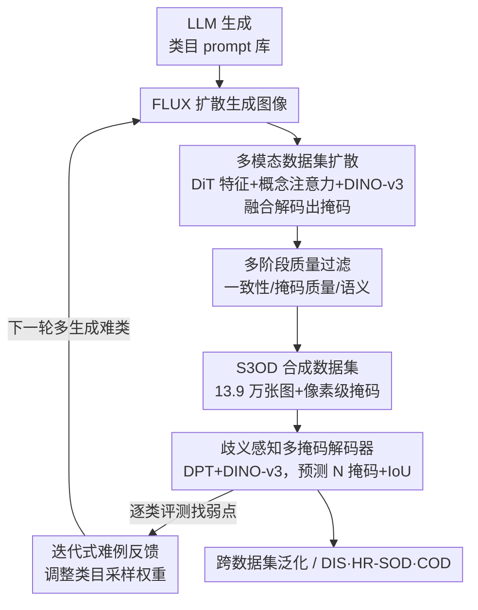

# S3OD: Towards Generalizable Salient Object Detection with Synthetic Data

**会议**: ICLR 2026  
**OpenReview**: [https://openreview.net/forum?id=QdCp9VTOlO](https://openreview.net/forum?id=QdCp9VTOlO)  
**论文**: [项目主页](https://s3odproject.github.io)  
**代码**: https://s3odproject.github.io (项目页)  
**领域**: 显著目标检测 / 合成数据 / 扩散模型 / 语义分割  
**关键词**: 显著目标检测, 多模态扩散标注, 迭代式数据生成, 多掩码歧义建模, 跨数据集泛化

## 一句话总结
针对显著目标检测（SOD）标注昂贵、数据稀缺、子任务（DIS / HR-SOD）各练各的痛点，本文用多模态扩散管线一次性生成图像+像素级掩码、配合难例反馈的迭代生成，造出 13.9 万张高分辨率合成数据集 S3OD，再用一个歧义感知的多掩码解码器统一建模，仅用合成数据训练就让跨数据集误差降低 20–50%，微调后在 DIS 与 HR-SOD 上刷到 SOTA。

## 研究背景与动机

**领域现状**：显著目标检测要把图像里"最该被注意"的物体抠成像素级 mask，是 AR/VR、3D 重建、图像编辑的基础环节。近年分裂出两个高要求子任务：DIS（二分图像分割，追求极精细的边界）和 HR-SOD（2K–8K 高分辨率显著检测）。主流做法是为每个子任务/每个 benchmark 单独训一个带复杂结构的模型（多视图融合、迭代精修、双边参考等）。

**现有痛点**：SOD 是典型的"数据受限"任务——一张高分辨率样本的像素级精标注最多要 10 小时，导致公开数据集都很小（DIS-5K 仅 5K 张、HRSOD 仅 2K 张）。小数据 + 域差距让模型只能对子任务过拟合，而非学到可泛化的分割原理；现有的结构创新只带来增量提升，没解决跨域泛化。更麻烦的是，"什么算显著"本身因人而异，同一张图不同标注者会给出不同 mask，确定性单输出模型被迫去"平均"这些可能解，产生低置信度的模糊区域。

**核心矛盾**：瓶颈不在模型复杂度，而在数据规模与数据的内在歧义。但靠合成数据补量又有老问题——传统伪标注被教师模型能力封顶（且常和学生共用视觉编码器，天花板被锁死）；让扩散模型直接出 mask 的方法受噪声扩散特征拖累、一致性差；mask 条件生成（如 MaskFactory）又只能在训练集附近小幅变化，多样性不足。

**本文目标**：把 DIS 和 HR-SOD 统一成一个"高保真显著分割"任务，同时解决①数据稀缺②内在歧义两个问题。

**切入角度**：作者观察到大型扩散 Transformer（FLUX，12B）在生成过程中已经编码了丰富的空间与语义信息——与其丢掉这些潜在表征去外挂教师模型，不如直接从生成过程内部"读出"监督信号；同时用多分支预测显式地接住歧义，而不是强行平均。

**核心 idea**：从扩散生成过程内部抽取多模态特征解码出像素级掩码（绕开教师瓶颈）+ 难例反馈迭代扩库 + 多掩码歧义建模，用"造数据"而非"堆结构"来换泛化。

## 方法详解

### 整体框架

S3OD 由"造数据"和"练模型"两条线咬合而成。造数据这条线：先用 LLM 为 ImageNet 类目体系生成多样化 prompt 库，驱动 FLUX 扩散模型生成图像；生成的同时从扩散过程里抽取三类互补模态（DiT 特征图、概念注意力图、解码图像的 DINO-v3 特征），融合后解码出与图像严格对齐的高质量掩码；再经多阶段过滤剔除坏样本，沉淀成数据集。练模型这条线：用一个基于 DPT、以 DINO-v3 为骨干的网络，把最后的预测头改成同时输出 N 个候选掩码和各自的 IoU 预测分，用"多选一学习"接住歧义。两条线通过**迭代反馈**闭环——训练好的 SOD 模型对各类目逐类评测，表现差的类目在下一轮被加权多生成，让数据集持续朝模型的弱点演化。

### 关键设计

**1. 多模态数据集扩散：从生成过程内部读出像素级监督，绕开教师瓶颈**

这一设计针对"合成标注被外挂教师封顶、且扩散直出 mask 噪声大"的痛点。作者不把 FLUX 当黑盒，而是在生成同一张图时并行抽出三类互补信号：① **DiT 特征图**——从 FLUX 的 4 个单流 Transformer 块（第 {4,16,27,36} 层）取图像 token 特征 $\mathbb{R}^{B\times L_I\times 3072}$，再投影到 768 维，编码生成时的多尺度空间布局；② **概念注意力图**——不像旧方法对所有文本 token 取平均（语义含糊），而是用固定概念集，对每个样本只算"主物体类名"和"background" 两个概念 token 与图像 patch 的注意力 $A_{concept}(x)=\mathrm{softmax}(o_x\cdot o_c^{\top})$，得到一致且可解释的 $\{A_{object},A_{background}\}$；③ **DINO-v3 视觉特征**——对解码后图像抽 ViT-L 语义特征，提供细粒度物体级表征。三路各经卷积分支投到 256 维公共空间，FLUX 特征与概念图双线性上采样对齐 DINO-v3 分辨率后通道拼接，过两级卷积（$3\times3$ 接 $1\times1$）再残差加回 DINO-v3 特征，喂给 DPT 解码器、用 DIS-5K/HR-SOD/UHRSOD/DUTS 监督它学会把多源信号解码成精细 mask。生成式特征（懂"我正在画什么、画在哪")与判别式特征（DINO-v3 的鲁棒语义）互补，既保证图—掩码强对齐，又彻底去掉了教师模型的性能天花板。消融显示：去掉 DINO-v3 整个崩盘（DIS 上 $F_m$ 从 0.917 跌到 0.710），扩散与概念特征则在困难歧义样本上提供关键的补充增益。

**2. 多阶段质量过滤：用消费级判别器+VLM 把合成噪声样本筛掉**

合成数据天生会混入坏样本，直接训会污染监督。作者串了三道闸：① **一致性过滤**——用一个不含 FLUX 特征、独立训练的大模型预测，比较原图与水平翻转图预测的 IoU，低于 $\tau=0.8$ 的样本剔除（连鲁棒模型都给不出一致预测，说明图—掩码对本身有问题）；② **掩码质量评估**——用 Gemma-3 VLM 识别碎片化、噪声等严重伪影，只保留白色连通区域内聚（主成分 ≤5 个）的掩码；③ **语义验证**——VLM 第二遍看"原图+掩码叠加"，确认确实存在清晰显著物体且掩码覆盖主物体 >70%。整套流程仅剔除 6.8% 样本，就在保住规模优势的同时把数据质量拉到接近人工标注。

**3. 迭代式难例反馈生成：让数据集朝模型弱点持续演化**

静态一次性生成会浪费预算在模型已经会的简单类上。作者把生成做成闭环：在第 $r$ 轮数据 $D^{(r)}$ 上训完模型后，对每个类目 $c_i$ 在留出集上评测——对每张图算 $\kappa(I_j)$（各种增广如翻转下预测的平均 IoU，越高说明越稳），再对类内取均值 $\bar\kappa_i$。下一轮类目权重按表现的反比非线性放大：$w_i^{(r+1)}=w_{min}+w_{new}e^{-\alpha(\bar\kappa_i-\beta)}$（$\alpha=8,\beta=0.5$，$w_{min}=1/|C|$ 保底、$w_{new}=4/|C|$ 为最大超采样）。表现低于阈值的类目被加权多生成，表现好的维持保底权重。实测共生成三轮（首轮每类 100 张，二三轮各加 2.5 万张优先难类），三轮迭代在 DIS 上带来 3.6% 的 $F_m$ 提升、DUT-OMRON 上 5.3%，验证了"哪里弱补哪里"比静态采样更有效。

**4. 歧义感知多掩码解码器：用多选一学习显式接住"显著的多义性"**

针对"单输出模型被迫平均多个合理解、产生模糊区"的痛点，作者把基于 DPT（DINO-v3 初始化骨干）的预测头改成同时输出 $N$ 个软掩码 $m_i\in(0,1)^{H\times W}$ 和各自的 IoU 预测分 $s_i$。训练借鉴多选一学习（multiple-choice learning）：每张图只有一个 GT $y$，主损失只回传给与 GT 最匹配（IoU 最高）的那个分支 $i^*$；为防止其余分支退化，用衰减权重的松弛分配让所有分支都受监督：$L=L_{i^*}+\lambda e^{-\gamma t}\sum_i^N L_i$（$t$ 为当前 epoch）。⚠️ 原文将最优分支写作 $i^*=\arg\min_i \mathrm{IoU}(m_i,y)$，但语义上"最佳预测"应取 IoU 最高，疑为笔误，以原文为准。推理时模型用预测的 IoU 分 $s_i$（训练时由真实 IoU 做 MSE 监督）自动选出得分最高的掩码。单掩码消融用三个分支（$N=3$）效果最好（$F_m$ 0.914 vs $N=1$ 的 0.909）；若用 GT 在三个掩码里取最佳匹配的 oracle 评测（$\mathrm{S3OD}^\star$）还能再涨一大截，直接证明数据标注/任务本身就含有可被多掩码接住的内在歧义。

### 损失函数 / 训练策略

掩码损失结合 Focal Loss（处理前景—背景不平衡，$\tau=2$）与 IoU Loss（区域级精度）：$L_{mask}(m_i)=\lambda_{mask}L_{focal}(m_i)+L_{IoU}(m_i,y)$，$\lambda_{mask}=10$。总目标为"最佳分支的掩码损失 + 所有分支的 IoU 分数损失 + 跨所有掩码的衰减正则"：
$$L_{mask}(m_{i^*})+\sum_{i=1}^{N}\lambda_{score}L_{score}(s_i)+\lambda_{reg}e^{-\gamma t}L_{mask}(m_i)$$
其中 $\lambda_{score}=0.05,\lambda_{reg}=0.1,\gamma=0.2$。学生模型用 ViT-B 骨干，FLUX 25 步推理生成图像、随机采样常见分辨率长宽比扩多样性，S3OD 上训练耗时 8×H200 GPU 约 2 天。

## 实验关键数据

### 主实验

**跨数据集泛化（核心卖点，Table 2）**：在 DIS-5K 上训、在 SOD benchmark 上评（反之亦然）。仅用合成数据 S3OD 训练的 S3ODNet，相比在 DIS-5K 上训的版本，在五个数据集上 MAE 分别降低 50.0% / 46.7% / 20.7% / 42.9% / 34.4%——不碰任何真实训练数据就拿到最强泛化。

| 训练数据 | DIS Overall $F_m$↑ | DIS Overall MAE↓ | DUTS-TE $F_m$↑ | DUT-OMRON $F_m$↑ |
|---------|------|------|------|------|
| InSpyreNet (DUTS) | .811 | .065 | — | — |
| BiRefNet (SOD) | .825 | .058 | — | — |
| S3ODNet (SOD) | .863 | .049 | — | — |
| **S3ODNet (S3OD 合成)** | **.881** | **.039** | .937 | .860 |

**SOTA 对比（微调后，Table 4）**：把 S3OD 预训练模型在 DIS-5K / SOD 组合上微调。DIS-5K 四档误差率分别降低 14.0% / 7.3% / 20.6% / 17.1%，刷新 SOTA。最能说明泛化的是 **DUT-OMRON**（所有模型都没在它上训过）：相比 BiRefNet 误差率降低 24.8% / 13.6% / 26.9% / 15.8%。

**跨任务到伪装目标检测（COD，Table 6）**：只在 S3OD 合成数据上训的模型零样本迁移到 COD10K/CAMO/NC4K 就超过在 SOD/DIS/MaskFactory 上训的模型；再在 COD 上微调后 COD10K $F_m$=0.911（BiRefNet 0.888）、NC4K $F_m$=0.923（0.909），证明学到的是可迁移的分割原理。

### 消融实验

| 配置 | 关键指标 | 说明 |
|------|---------|------|
| 三模态全开 (DINO-v3 + DiT + Concept) | DIS $F_m$ .917 | 完整，最优 |
| w/o DINO-v3 | DIS $F_m$ .710 | 直接崩盘（–0.207），骨干语义不可替代 |
| w/o DiT 特征图 | DIS $F_m$ .913 | 小幅掉点，困难歧义样本受损 |
| w/o 概念注意力图 | DIS $F_m$ .914 | 小幅掉点 |
| 骨干 Swin-B ($N{=}1$) | DIS $F_m$ .884 | 换成 DINO-v3 ($N{=}1$) 升到 .909 |
| 多掩码 $N{=}3$ | DIS $F_m$ .914 | 三分支最优（vs $N{=}1$ 的 .909） |
| 迭代单轮 → 三轮 | DIS $F_m$ +3.6% | DUT-OMRON +5.3% |
| Prompt: 类名 → GPT | IS 67.8 → 98.1 | Inception Score +44.7%，CLIP .399→.434 |

### 关键发现
- **DINO-v3 是地基，扩散特征是补刀**：去掉 DINO-v3 模型几乎不可用（$F_m$ 0.710），但单靠 DINO-v3 又会在生成图上吃训练—测试分布差；DiT 与概念特征虽各自只带小幅增益，却在困难、歧义样本上提供关键互补信息，三者合一才最优。
- **数据规模 > 结构复杂度**：在 DIS-5K（仅 3000 张）上训的各方法结果接近，说明子任务过拟合的根因是数据量；把 BiRefNet/MVANet 也搬到 S3OD 上训，所有模型泛化都涨，印证"造数据"这条路对全行业通用。
- **benchmark 已饱和**：UHRSD、DAVIS-S（仅 92 张）这类小集上各大 Transformer 模型成绩趋同，反过来支持作者主张的"跨任务泛化评测"才是正确的衡量方式。
- **歧义真实存在**：oracle 版 $\mathrm{S3OD}^\star$（GT 在三掩码里取最佳）显著高于单选版，量化证明任务/标注的内在多义性值得用多掩码建模。

## 亮点与洞察
- **把扩散模型的"中间产物"当免费标注源**：生成过程里的 DiT 激活、概念注意力本是被丢弃的副产品，作者把它们 + 判别式 DINO-v3 融合解码成 mask，既绕开教师天花板又保证图—标对齐——这种"生成即标注"的思路可直接迁移到其他密集预测任务（深度、法向、分割）。
- **数据生成做成强化学习式闭环**：用下游模型表现反推采样分布，让数据集"自我进化"补弱点，比静态一次性生成预算利用率高得多，是合成数据领域可复用的范式。
- **用多选一学习把任务歧义显式化**：与其让单输出模型去平均矛盾标注，不如让多分支各自给一个合理解、再用预测 IoU 自动选——既简化了结构（比多视图/迭代精修轻），又把"显著本就多义"这件事变成模型能力而非误差。

## 局限与展望
- **依赖超大扩散与多个外部大模型**：管线绑定 FLUX-12B 生成、DINO-v3、Gemma-3 VLM、GPT 出 prompt，复现/算力门槛高（造数据本身就要可观资源），且质量受这些上游模型能力牵制。
- **合成—真实仍有分布差**：DINO-v3 在生成图上会遇到 train-test gap（消融已暴露），合成数据虽强但要拿绝对 SOTA 仍需在真实数据上微调，纯合成尚不能完全替代真实标注。
- **评测口径转换的代价**：作者主张跨任务泛化评测、并指出现有 benchmark 饱和，但这也意味着传统单 benchmark 数字不完全可比；$\mathrm{S3OD}^\star$ 的 oracle 提升用到 GT，不能与他法直接比较。
- **改进方向**：类目体系目前取自 ImageNet taxonomy，可探索更开放/长尾的 prompt 来源；多掩码数 $N$、迭代轮数与预算的权衡也值得进一步系统化。

## 相关工作与启发
- **vs DatasetDM / 扩散直出 mask**：它们靠注意力均值抽掩码，得到噪声、边界不准、多物体场景失效的标注；本文用静态概念注意力 + 多模态融合，监督更干净、对齐更强。
- **vs MaskFactory（mask 条件生成）**：它在 DIS-5K mask 上做刚性/非刚性变换再条件生成，只能产出训练集的轻微变体、多样性受限；本文从 prompt 端自由生成复杂场景，跨 benchmark 泛化明显更强（Table 5）。
- **vs 传统伪标注/教师蒸馏**：教师能力即天花板、且常与学生共用编码器；本文从生成过程内部取监督并融入判别式特征，去掉了性能上限。
- **vs BiRefNet / MVANet / InSpyreNet**：它们靠双边参考、多视图聚合、图像金字塔等复杂结构换精度，但单确定性输出且受小数据束缚；本文用更轻的多掩码 DPT + 大规模合成数据，在统一任务下同时解决歧义与数据稀缺。

## 评分
- 新颖性: ⭐⭐⭐⭐⭐ "生成过程内部多模态抽监督 + 难例反馈迭代 + 多掩码歧义建模"三件组合在 SOD 上是全新打法
- 实验充分度: ⭐⭐⭐⭐⭐ 覆盖跨数据集、SOTA 微调、COD 跨任务、五张消融表，证据链完整
- 写作质量: ⭐⭐⭐⭐ 动机清晰、消融到位；个别公式（最优分支 argmin）疑似笔误需对照原文
- 价值: ⭐⭐⭐⭐⭐ 把"数据稀缺"而非"结构复杂度"当真瓶颈来攻，给密集预测任务提供了可复用的合成数据范式

<!-- RELATED:START -->

## 相关论文

- [\[CVPR 2026\] Generalizable Co-Salient Object Detection via Mixed Content-Style Modulation](../../CVPR2026/segmentation/generalizable_co-salient_object_detection_via_mixed_content-style_modulation.md)
- [\[ICLR 2026\] Salient Object Ranking via Cyclical Perception-Viewing Interaction Modeling](salient_object_ranking_via_cyclical_perception-viewing_interaction_modeling.md)
- [\[CVPR 2026\] Synthetic Object Compositions for Scalable and Accurate Learning in Detection, Segmentation, and Grounding](../../CVPR2026/segmentation/synthetic_object_compositions_for_scalable_and_accurate_learning_in_detection_se.md)
- [\[ICML 2026\] What Makes Synthetic Data Effective in Image Segmentation](../../ICML2026/segmentation/what_makes_synthetic_data_effective_in_image_segmentation.md)
- [\[CVPR 2026\] Uncertainty-Aware Modality Fusion for Unaligned RGB-T Salient Object Detection](../../CVPR2026/segmentation/uncertainty-aware_modality_fusion_for_unaligned_rgb-t_salient_object_detection.md)

<!-- RELATED:END -->
