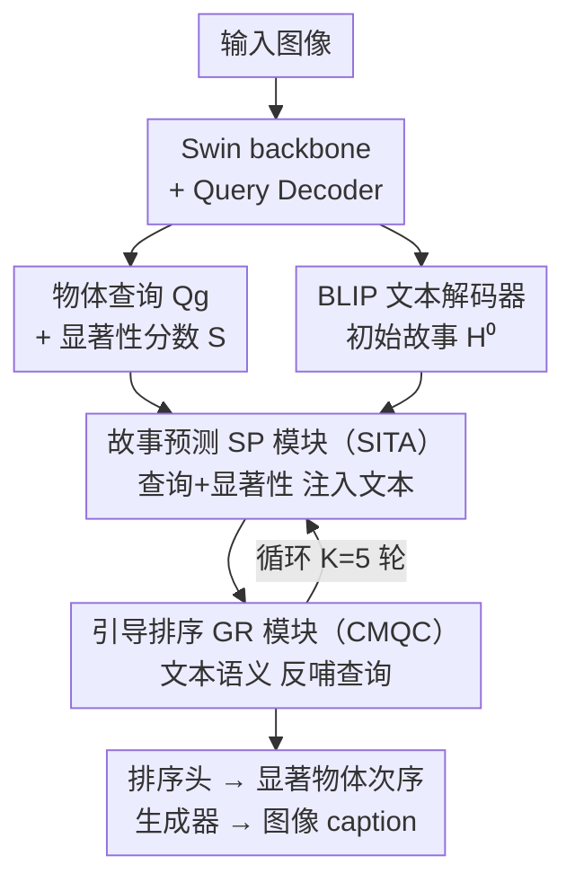

# Salient Object Ranking via Cyclical Perception-Viewing Interaction Modeling

**会议**: ICLR 2026  
**OpenReview**: [https://openreview.net/forum?id=RDOlvzwSyF](https://openreview.net/forum?id=RDOlvzwSyF)  
**代码**: 有（论文中标注 "Codes are available here"，具体仓库地址以原文为准）  
**领域**: 显著性实例分割 / 显著物体排序  
**关键词**: 显著物体排序、自顶向下认知、图像描述生成、循环交互、物体查询

## 一句话总结
针对显著物体排序（SOR）长期只依赖自底向上图像特征的问题，本文提出用"循环感知-观看交互"显式建模自顶向下的认知过程：让一个图像描述生成模块（SP）和一个显著性排序模块（GR）互相喂结果、迭代 K 轮，在 ASSR 与 IRSR 两个基准上把 SA-SOR 刷到 0.787 / 0.624，超过此前最优 QAGNet。

## 研究背景与动机
**领域现状**：显著物体排序（Salient Object Ranking, SOR）要预测人在自由观看一张图时，注意力会按什么顺序在多个显著物体之间转移——既要检测出显著实例，又要给它们排一个"观看次序"。从 RSDNet、ASRNet 到近两年的 SeqRank、QAGNet、DSGNN、PoseSOR，主流做法是从图像里挖各种线索：物体坐标、物体间图关系、空间/物体注意力、中央凹-周边视觉、场景图、物体形状纹理、甚至人体姿态。

**现有痛点**：这些线索全都是**自底向上**的（bottom-up）——即纯粹从图像像素/语义特征出发。问题是，在语义复杂的场景里，低层视觉线索并不可靠：论文 Fig.1 给的例子里，PoseSOR 会因为两个人的姿态朝向电视，就错误地把注意力先给了电视；只看形状、姿态这类"图像内禀"线索的方法，常常复现不出人真实的注意力转移。

**核心矛盾**：认知科学研究指出，人自由观看图像时，大脑会本能地做**场景感知**以最大化对画面的理解，注视点集中在那些"对理解整个场景最关键"的物体上。也就是说，人的注意力转移是被**不断演化的场景级理解（故事）**驱动的——这是一条**自顶向下**（top-down）的认知通路，而现有 SOR 方法几乎完全忽略了它。感知与观看其实是**循环互动**的：先看关键物体形成对"故事"的预测，这个预测又引导下一步看哪、看到的内容再回头修正故事，直到注意力落到最后一个显著物体、故事稳定下来。

**本文目标**：把这条"感知 ↔ 观看"的循环认知通路显式建模进 SOR，让模型既能在排序时利用对场景的语义理解，又能在理解场景时利用当前的排序结果。

**核心 idea**：把"场景理解"具体化为**图像描述生成（image captioning）**任务，用一个故事预测模块（SP）和一个引导排序模块（GR）双分支互相条件化、循环迭代——SP 根据当前排序结果生成/补全图像描述，GR 根据当前描述细化显著物体的观看顺序，二者协同自我修正。

## 方法详解

### 整体框架
模型是一个**双分支 + 循环迭代**的多任务框架，联合做"显著性排序"和"图像描述生成"两件事，让二者互相喂结果。输入一张图，输出该图中显著实例的掩码、排序，以及一段描述场景的 caption。

具体流程：图像先过 Swin Transformer backbone 抽特征金字塔 $\text{feats}_i \in \mathbb{R}^{C_i \times H_i \times W_i}$；一组可学习的物体查询 $Q_0 \in \mathbb{R}^{N \times D}$ 经 $L$ 层 Transformer Query Decoder 逐层吸收多尺度物体特征，聚合成全局查询 $Q_g$，再过 ranking head 得到显著性分数 $S = \text{Linear}(Q_g)$。与此同时，backbone 视觉特征投影成图像 embedding $E_{img}$ 作为跨模态上下文，一个预训练的 BLIP 文本解码器从 `[BOS]` 自回归生成初始文本特征 $H^{(0)}$。

关键在于二者之间建立的**循环交互**：在第 $k$ 轮里，SP 模块用 Saliency-Infused Textual Augmentation（SITA）把查询和显著性分数注入文本特征 $H^{(k)} = \text{SITA}(Q_g^{(k-1)}, S^{(k-1)}, H^{(k-1)})$；GR 模块再用 Cross-Modal Query Contextualization（CMQC）把增强后的文本特征反哺给全局查询 $Q_g^{(k)} = \text{CMQC}(Q_g^{(k-1)}, H^{(k)})$。如此循环 $K$ 轮（默认 $K=5$），最终 $Q_g^{(K)}$ 出排序、$H^{(K)}$ 解码出 caption。SP 实现的是"观看→感知"通路，GR 实现的是"感知→观看"通路，二者首尾相接构成完整的感知-观看循环。

### 关键设计

**1. 循环感知-观看交互：把自顶向下认知建成一个闭环**

这是全文的骨架，直接针对"现有方法只有自底向上、缺失自顶向下"的痛点。作者不再把排序当成一次性前向预测，而是让"场景理解"和"注意力排序"在 $K$ 轮里交替更新、互为条件。形式上是两条互相嵌套的更新式：$H^{(k)} = \text{SITA}(Q_g^{(k-1)}, S^{(k-1)}, H^{(k-1)})$ 和 $Q_g^{(k)} = \text{CMQC}(Q_g^{(k-1)}, H^{(k)})$。第一式让"当前看到了哪些显著物体"去塑造"对场景故事的理解"，第二式让"更新后的故事"去引导"接下来该看哪、怎么排序"。

之所以有效，是因为它复现了认知科学里的"主动感知 / 预测编码"机制：观察者先聚焦关键物体、形成对故事的预测，预测再引导注意力移动，移动看到的新内容又回头修正故事，直到收敛。论文用一个例子说明——场景里有"video games"这条感知线索时，模型会先把焦点给电视、再给玩游戏的人；而只看姿态的 PoseSOR 会被姿态误导。消融里把交互关掉（Table 3 设置 I，"First"即用交互前的查询出分），SA-SOR 从 0.767 暴跌到 0.531，直接验证了这个闭环是核心收益来源。

**2. 故事预测模块 SP 与 SITA：让"看到的显著物体"去增强"场景描述"**

SP 模块实现"观看→感知"通路，把场景理解显式建成图像描述生成，并让显著性信息去调制文本特征。核心是 SITA（Saliency-Infused Textual Augmentation）。它先把全局查询按显著性分数加权、再沿物体维度平均，得到一个紧凑的显著性视觉上下文向量 $V_{sal} = \frac{1}{N}\sum_{i=1}^{N}(Q_g[i] \odot S[i])$（$\odot$ 为逐元素乘）。该向量投影对齐到文本维度 $D_t$、广播到文本序列长度，得到 $V_{sal}^{align}$。

接着用一个**门控**机制把显著性信息可控地注入文本：门 $G = \sigma(\text{GELU}(V_{sal}^{align}W_1 + b_1)W_2 + b_2)$ 动态缩放对原文本特征做 MLP 后的输出，并保留残差连接 $H^{(k)} = \text{MLP}(H^{(k-1)}) \odot G + H^{(k-1)}$。残差保住基础语言模式，门控只让显著性"按需"渗入——作者把这解释为模仿神经增益调制（neural gain modulation），即注意力对特征做自适应缩放。这样生成的 caption 才能 ground 在视觉上真正显著的区域，而不是泛泛描述。Table 4 显示随迭代步数增加，caption 的 CIDEr 从 0.362 升到 0.462、SPICE 从 0.114 升到 0.161。

**3. 引导排序模块 GR 与 CMQC：让"场景故事"去引导"观看顺序"**

GR 模块实现反方向的"感知→观看"通路，用语言特征去细化物体查询，从而决定排序。核心是 CMQC（Cross-Modal Query Contextualization）。它先把高维文本特征 $H \in \mathbb{R}^{L_s \times D_t}$ 经带 LayerNorm 的可学习线性变换映射到与查询同维的潜空间（既做跨模态对齐又用归一化约束保住语言结构），再用**多头交叉注意力**让物体查询和文本特征做 scaled dot-product 交互，以残差方式逐轮更新：$Q_g^{(k+1)} = Q_g^{(k)} + \text{MultiHeadAttn}(Q_g^{(k)}, H^{(k)})$。

这一步的作用是让查询去"对上"相关的语言线索——例如把和衣着相关的查询对齐到 "striped shirt" 这类 token，从而把场景语义融进排序依据、同时压制无关的语言噪声。残差结构保住了空间先验，迭代过程被类比为认知系统里的预测编码（predictive coding）：残差更新在最小化"查询当前值"与"文本引导下期望值"之间的预测误差。最终 $Q_g^{(K)}$ 过 ranking head 出显著性分数完成排序。

### 损失函数 / 训练策略
端到端训练，总损失 $L = L_{task} + L_{rank} + L_{lm}$。其中 $L_{task} = L_{mask} + L_{cls}$ 沿用 Mask2Former 配置——$L_{mask}$ 用二元交叉熵 + Dice 损失预测实例掩码，$L_{cls}$ 用交叉熵判断实例是否显著；$L_{rank}$ 是显著性排序损失（沿用 IRSR）；$L_{lm}$ 是生成 caption 与真值 caption 之间的交叉熵。实现上用在 MS-COCO 预训练的 Swin Transformer 作 backbone、预训练 BLIP 文本解码器生成 $H^{(0)}$，每张图从其 5 条 COCO caption 中随机取一条作真值；$N=200$、$K=5$、$D=256$，输入 resize 到 $1024\times1024$，AdamW、4 张 RTX 3090 训练 24,000 迭代；推理时置信度 > 0.7 的物体被视作显著实例参与排序。

## 实验关键数据

### 主实验
在 ASSR 与 IRSR 两个 SOR 基准上与 SOD / SID / 实例分割 / SOR 各类方法对比（所有方法均重训以公平比较）。指标：SA-SOR↑（带检测惩罚的排序分，最严格）、SOR↑（Spearman 排序相关，不惩罚漏检/误检）、MAE↓（掩码像素误差）。

| 数据集 | 指标 | 本文 | 之前SOTA(QAGNet) | 提升 |
|--------|------|------|----------|------|
| ASSR | SA-SOR ↑ | **0.787** | 0.771 | +1.95% |
| ASSR | SOR ↑ | **0.869** | 0.857 | 更优 |
| ASSR | MAE ↓ | **5.28** | 5.78 | -8.65% |
| IRSR | SA-SOR ↑ | **0.624** | 0.616 | 更优 |
| IRSR | SOR ↑ | **0.822** | 0.818 | 更优 |
| IRSR | MAE ↓ | **6.89** | 6.71 | 略逊 |

本文在最严格的 SA-SOR 上两个基准都取得最优，SOR 与 MAE 也整体领先（IRSR 的 MAE 略逊于 QAGNet 的 6.71）。

### 消融实验
模块逐步加入（ASSR），S(k) 表示每步物体查询的显著性分数：

| 配置 | 组件 | SA-SOR↑ | SOR↑ | MAE↓ | 说明 |
|------|------|---------|------|------|------|
| I | baseline（查询直接出分） | 0.697 | 0.841 | 7.71 | 无任何交互 |
| II | + caption 监督 | 0.722 | 0.847 | 6.83 | 加描述生成任务 |
| III | + CMQC | 0.729 | 0.849 | 6.62 | 文本反哺查询 |
| IV | + SITA(显著性重加权) | 0.734 | 0.847 | 6.21 | 单加 $S^{(k)}$ |
| V | + SITA(门控) | 0.748 | 0.854 | 6.27 | 单加 Gate |
| VI | 完整 SITA | **0.752** | **0.861** | **5.99** | 重加权+门控合体 |

迭代步数消融（Table 3）：交互前出分（设置 I）SA-SOR 仅 0.531，开启交互后跳到 0.747；步数 3→4→5 时 SA-SOR 0.747→0.754→0.767，$K=5$ 最优，$K=6$ 反降到 0.764，MAE 趋于饱和。

### 关键发现
- **循环交互是最大收益来源**：把交互关掉（用交互前查询出分）SA-SOR 从 0.767 掉到 0.531，证明"感知-观看闭环"本身而非单纯多任务才是核心。
- **SITA 的重加权与门控互补**：单独加各能涨一点（IV/V），合体（VI）SA-SOR 才到 0.752，MAE 降到 5.99，说明两条注入路径不冗余。
- **迭代步数有甜点**：$K=5$ 是排序与 caption（CIDEr 0.462）的共同最优点，再加步数边际收益转负，提示循环会收敛。
- **语义越密表现越好**：定义语义密度 $\rho = \text{round}(\text{caption 词数} / \text{显著物体数})$，在 600 张 ASSR 测试图上 $\rho$ 与 SA-SOR 的 Pearson 相关达 0.714（p=0.00416），印证方法在语义丰富场景更占优——正好对应"自顶向下理解"的设计初衷。

## 亮点与洞察
- **把"看图理解"显式接进排序闭环**：最"啊哈"的点是把抽象的"场景理解"落地成 image captioning，再让 caption 与排序互为条件迭代——这给了 SOR 一个可训练、可解释的自顶向下信号，而不是又堆一种图像内禀线索。
- **双向注入用了两套不同机制**：观看→感知用"显著性加权+门控残差"（SITA），感知→观看用"跨模态交叉注意力残差"（CMQC），两个方向各自匹配模态特性，而不是简单对称拼接。
- **认知科学动机落到了具体公式**：门控对应神经增益调制、残差更新对应预测编码——这种"动机 ↔ 机制"的对应可迁移到其他需要自顶向下引导的视觉任务（如注视预测、视觉问答中的注意力建模）。
- **语义密度分析提供了适用边界的量化刻画**：用一个简单比值就把"什么场景该用我"讲清楚了，是很务实的可复用分析 trick。

## 局限与展望
- **依赖 caption 真值与预训练描述器**：训练需 MS-COCO 的 caption 监督、且用预训练 BLIP 初始化文本特征，在没有高质量描述标注的领域（如医学、遥感）迁移成本未知。
- **简单/低语义场景收益有限**：$\rho$ 小的图上 SA-SOR 明显偏低（如 $\rho=7$ 组仅 0.629），说明对只有少量物体、缺乏"故事"的场景，自顶向下信号反而帮不上忙，甚至可能引入噪声。
- **迭代带来推理开销**：$K=5$ 轮循环交互 + 自回归 caption 生成，相比单次前向的方法在效率上有代价（论文附了 FPS 分析，具体数值以原文 Table 7 为准）。
- **IRSR 的 MAE 略逊**：在 IRSR 上 MAE 6.89 高于 QAGNet 的 6.71，提示其掩码精度在物体更多（最多 8 个）的场景未必占优。

## 相关工作与启发
- **vs PoseSOR / DSGNN / QAGNet（自底向上 SOR）**：它们分别用人体姿态、形状纹理图边、超图/嵌套 GNN 建模物体-上下文关系，全是从图像本身挖线索；本文转而引入自顶向下的"场景故事"作引导，在语义复杂场景里不被低层线索误导（如不会因姿态把焦点错给电视）。
- **vs Liu et al. 2025（用 LVLM 描述里的隐式顺序）**：同样想借语言，但那是把 LVLM 描述的隐含顺序当外部监督；本文是把 caption 生成做成内生、可迭代细化的分支，与排序双向耦合而非单向取用。
- **vs Mask2Former / QueryInst（实例分割 backbone）**：本文 $L_{task}$ 直接沿用 Mask2Former 的掩码/分类损失作显著实例检测底座，再在其上叠加排序与描述生成的循环交互，相当于把通用实例分割框架"认知化"。

## 评分
- 新颖性: ⭐⭐⭐⭐⭐ 首次把自顶向下的"感知-观看循环"显式建成 caption↔排序双向闭环，视角新且有认知科学支撑。
- 实验充分度: ⭐⭐⭐⭐ 两基准 + 逐组件消融 + 步数/caption/语义密度/效率分析较完整，但 IRSR 上 MAE 未全面领先。
- 写作质量: ⭐⭐⭐⭐ 动机-机制-公式对应清晰，认知科学类比贯穿；部分模块细节需查附录。
- 价值: ⭐⭐⭐⭐ 为 SOR 提供了可训练的自顶向下信号范式，语义密度分析也给出明确适用边界。

<!-- RELATED:START -->

## 相关论文

- [\[ICLR 2026\] S3OD: Towards Generalizable Salient Object Detection with Synthetic Data](s3od_towards_generalizable_salient_object_detection_with_synthetic_data.md)
- [\[ICLR 2026\] Revisiting \[CLS\] and Patch Token Interaction in Vision Transformers](revisiting_cls_and_patch_token_interaction_in_vision_transformers.md)
- [\[CVPR 2026\] Uncertainty-Aware Modality Fusion for Unaligned RGB-T Salient Object Detection](../../CVPR2026/segmentation/uncertainty-aware_modality_fusion_for_unaligned_rgb-t_salient_object_detection.md)
- [\[CVPR 2026\] Generalizable Co-Salient Object Detection via Mixed Content-Style Modulation](../../CVPR2026/segmentation/generalizable_co-salient_object_detection_via_mixed_content-style_modulation.md)
- [\[ICLR 2026\] ByteFlow: Language Modeling through Adaptive Byte Compression without a Tokenizer](byteflow_language_modeling_through_adaptive_byte_compression_without_a_tokenizer.md)

<!-- RELATED:END -->
