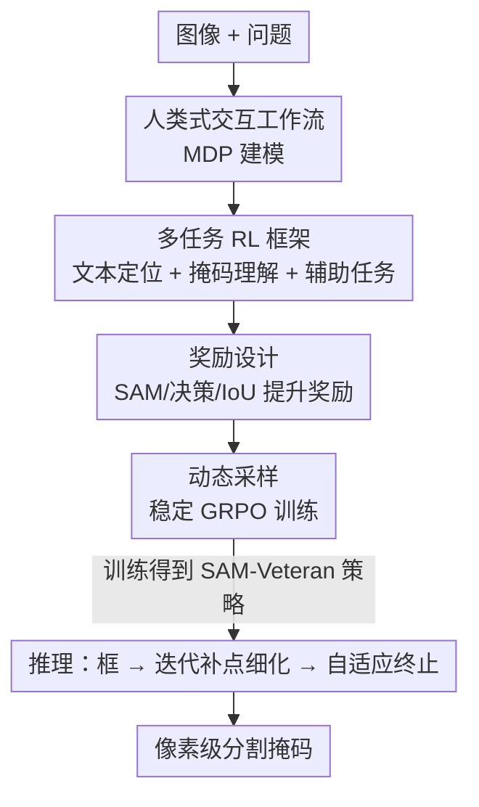

# SAM-Veteran: An MLLM-based Human-like SAM Agent for Reasoning Segmentation

**会议**: ICLR 2026  
**OpenReview**: [https://openreview.net/forum?id=oN55r8iJJW](https://openreview.net/forum?id=oN55r8iJJW)  
**代码**: 无  
**领域**: 多模态VLM / 推理分割 / 强化学习  
**关键词**: 推理分割, SAM, MLLM, GRPO, 交互式分割

## 一句话总结
SAM-Veteran 把 MLLM 训练成一个"老练的 SAM 用户"，通过"生成初始框 → 看 SAM 掩码后补点迭代细化 → 自适应判断何时停"这一套模仿人类的交互式分割流程，并用基于 GRPO 的多任务强化学习把这套行为学进 MLLM，在推理分割的域内和域外基准上都刷到新 SOTA。

## 研究背景与动机
**领域现状**：推理分割（reasoning segmentation）要根据"穿红衣服的人手里拿的东西"这种需要逻辑推理的文本 query 输出像素级掩码。当前主流是把 MLLM（强在推理和图文对齐）与 SAM（强在像素级理解）拼起来，分两条技术路线：SFT 路线让 MLLM 吐特殊 token 去驱动一个可学习的分割头实现端到端；RL 路线让 MLLM 用奖励信号学着生成框/点，再喂给冻结的 SAM 出最终掩码。

**现有痛点**：SFT 路线会灾难性遗忘通用推理能力、且对域外数据泛化差；RL 路线要么训练时把 MLLM 和 SAM 解耦（导致喂给 SAM 的输入次优），要么压根没用上 SAM 最有价值的能力——像人一样**交互式地迭代细化掩码**。唯一模仿人类 SAM 用户行为的 SegAgent，依赖另一个 MLLM 提供初始框、缺乏自适应终止能力，而且靠手工标注的点轨迹做监督，约束了模型探索更优的细化策略。

**核心矛盾**：人用 SAM 时是一个完整闭环——先框一下、看掩码哪里不对、点几个正/负点修一修、觉得够好了就收手。现有方法只截取了这个闭环的片段（要么只生成框，要么只补点且不会停），没有任何模型把"框生成 + 迭代细化 + 自适应终止"统一在一个框架里。

**本文目标**：让 MLLM 完整复现人类使用 SAM 的全流程，并且不靠手工点轨迹监督、而是让模型在 SAM 的真实反馈里自己探索出好的细化策略。

**切入角度**：把这个过程建模成马尔可夫决策过程（MDP），用强化学习而非模仿学习来训练——这样模型能直接以"SAM 出的掩码 IoU"作为奖励信号，学到对 SAM 友好的框和点，而不是死记人类轨迹。

**核心 idea**：用一个 GRPO 多任务 RL 框架，把"文本定位（生成框）"和"掩码理解（判断好坏 + 补点 / 终止）"两种能力训进 MLLM，让它变成一个会迭代、会喊停的"SAM 老兵"。

## 方法详解

### 整体框架
SAM-Veteran 的推理流程是一个人类式的交互闭环：给定图像 $I$ 和问题 $Q$，MLLM 先用定位提示 $Q_B$ 生成目标的边界框 $b\in\mathbb{R}^4$，框喂给 SAM 得到初始掩码 $M$；接着把"图像 + 当前掩码（以绿色半透明覆盖在图上）"反馈回 MLLM，用细化提示 $Q_P$ 让它输出细化点——正点 $p^+$ 补回漏掉的前景（false negative）、负点 $p^-$ 抹掉多出来的背景（false positive）；点和旧掩码再进 SAM 得到更新掩码 $M'$。这个细化循环一直转，直到 MLLM 判断掩码够好了、对两个点都输出 `null`（自适应终止），或者达到最大细化步数（强制终止）。

整个过程被形式化为 MDP $(S,A,T,R)$：状态 $s=(M,I,Q)$ 是当前分割结果三元组；动作初始为框 $a=b$、之后为点对 $a\in\{(p^+,p^-),(p^+,\text{null}),(\text{null},p^-),(\text{null},\text{null})\}$；转移函数 $T$ 就是 SAM（给定图像、当前掩码、动作生成新掩码）；奖励 $R$ 综合考量动作前后掩码质量。目标是学到策略 $\pi_\theta(a|s)$ 最大化期望奖励 $\mathbb{E}_{a\sim\pi_\theta}[R(s',s,a)]$。

训练侧不是直接监督这套流程，而是拆成三个 GRPO 任务分别打磨能力，外加一个动态采样策略稳住 RL。

### 关键设计

**1. 人类式交互工作流：把"框—细化—终止"统一成一个 MDP**

针对"现有方法只截取了人类用 SAM 闭环的片段"这个痛点，本文把完整流程——生成初始框、基于 SAM 掩码迭代补点、自适应终止——一次性建模进一个 MDP 并用 RL 求解。关键在于把 SAM 直接当作环境的转移函数 $s'=T(s,a)$：MLLM 每输出一个动作（框或点），SAM 就把它转成新掩码，下一步状态 $s'=(M',I,Q)$ 又回到 MLLM 手里。这样 MLLM 看到的不再是静态图像，而是"自己上一步操作后 SAM 实际产出的掩码"，因此能学到"这块漏了补个正点、那块多了补个负点"的真实交互逻辑。相比 SegAgent 靠手工点轨迹做模仿学习，这里没有固定的"标准动作序列"约束，模型可以在 SAM 反馈里自由探索更优的细化路径，也天然支持"觉得够好就输出 `(null,null)`"的自适应终止——这是此前 RL 方法（如 SAM-R1 只生成框、不迭代）完全没有的能力。

**2. 多任务 RL 框架：用三个 GRPO 任务把定位与掩码理解拆开训**

要完成上述工作流，MLLM 需要两种核心能力：文本定位（生成框）和掩码理解（判断好坏 + 补点）。本文用基于 GRPO 的三任务框架分别强化：

- **任务一·文本定位**：给图像和问题，MLLM 生成推理过程和框坐标 $b$，奖励鼓励框既要框得准（box IoU / L1），又要"对 SAM 友好"——即框喂进 SAM 后出的掩码 IoU 要高。
- **任务二·掩码理解**：给"图像 + SAM 出的绿色掩码 + 问题"，MLLM 判断掩码是否满意；若不满意就生成正/负点去细化，若满意就输出 `(null,null)` 终止。
- **任务三·辅助掩码理解**：作者发现只训前两个任务时，MLLM 会无限细化、连完美掩码都停不下来——根因是它对"图上覆盖的掩码"理解力不足（预训练缺这类数据）。于是把 GT 掩码人为破坏（随机多边形加入做 false positive、抠除做 false negative），让 MLLM 指出错误区域的中心点（正点指向漏检区、负点指向误检区）。这个任务专门补"看懂掩码错在哪"的能力，正是它让模型学会了自适应终止。

三个任务共享同一个 MLLM，对每个任务采多个 rollout、各算任务专属奖励再做 GRPO 优化。消融显示三任务缺一不可：只有定位 → 终止行为随意；加掩码理解 → 准确率涨但永不终止；再加辅助任务 → 才实现自适应终止且 IoU 最高。

**3. 案例—动作奖励设计：让模型既会修又会停**

针对"模型不知道何时该补点、何时该收手"，本文设计了一套按"案例 × 动作"组合的奖励。先把训练掩码按质量分两类：用 GT 框喂 SAM 得到掩码，IoU 高的标为 **Good Enough**、低的标为 **Need Refinement**（为减少 GT 边缘标注噪声的干扰，用了一种排除近边缘像素的修正 IoU，IoU=1 算 Good Enough、IoU<0.9 算 Need Refinement）。奖励主要由两部分组成：

- **决策奖励 $R^{DCS}$**：Need Refinement 时输出细化点、或 Good Enough 时输出 `(null,null)` 得 1 分，否则 0 分——直接教模型在对的时机做对的决策。
- **IoU 提升奖励 $R^\Delta$**：当掩码需要细化时，按这一步带来的 IoU 增量 $\Delta=\text{IoU}(M',M^{GT})-\text{IoU}(M,M^{GT})$ 给分，$\Delta>0.5$ 给最高 3 分、$\Delta\le 0$（细化反而变差）给 0 分。

两者按案例—动作对组合（如 Good Enough 下正确终止得 $R^{DCS}+3$，Need Refinement 下补对点得 $R^{DCS}+R^\Delta$），并把两种案例的最高奖励都固定为 4 以保持一致。消融表明：去掉 SAM 奖励、决策奖励或 IoU 提升奖励都会一致掉点；把连续的 $R^\Delta$ 换成"只要 $\Delta>0$ 就给 3 分"的硬版本 $R^\Delta_h$ 效果也更差，说明按提升幅度分级打分确实更有效。

**4. 动态采样：保证 rollout 奖励多样，稳住 GRPO**

GRPO 的优势函数依赖一组 rollout 间的奖励差异，若一批样本奖励全 0 或全 1 会梯度消失。本文借鉴 DAPO 的动态采样并适配到三个任务：定位任务里**过采样**候选框再用 NMS 去重，让图中多个物体/位置都被采到、增加奖励多样性；掩码理解和辅助任务里，动作有 $(null,null)$、$(p^+,null)$、$(null,p^-)$、$(p^+,p^-)$ 四类，就持续过采样直到四类动作都出现。这样每批 rollout 都有奖励高低不一的多样动作，优势函数更有效、训练更稳。消融显示去掉动态采样会在多数基准上明显掉点。

### 损失函数 / 训练策略
基座 MLLM 为 Qwen2.5-VL-7B-Instruct，分割模块为 SAM2-Large。用 GRPO 训练，batch size 16、每样本 8 个 rollout，AdamW（lr $10^{-6}$、weight decay 0.01、KL 系数 0.005）。为稳住训练，用 REINFORCE++ 的全局 batch 归一化替代 GRPO 的局部标准差。在 verl 框架、8 张 96GB GPU 上训一个 episode 约 30 小时。仅用 RefCOCOg 训练，评测时细化步数上限设为 3，所有图像 resize 到 840×840。

## 实验关键数据

### 主实验
仅用 RefCOCOg 训练，在域内（RefCOCO/+/g）和域外（ReasonSeg）上评测，与 SFT 和 RL 方法对比（均 7B 版本，IoU %）：

| 数据集 | 指标 | SAM-Veteran | 之前最佳 | 说明 |
|--------|------|------|----------|------|
| ReasonSeg val（域外） | gIoU | **68.2** | 64.0 (SAM-R1) | 域外大幅领先 |
| ReasonSeg val（域外） | cIoU | **67.3** | 64.5 (POPEN) | |
| ReasonSeg test（域外） | gIoU | **62.6** | 60.2 (SAM-R1) | |
| RefCOCO testA（域内） | cIoU | **80.8** | 80.3 (Seg-Zero) | 域内持平或略超 |
| RefCOCO+ testA（域内） | cIoU | **76.6** | 76.2 (Seg-Zero) | |
| RefCOCOg test（域内） | cIoU | 73.4 | 74.6 (SegAgent/POPEN) | 略低但泛化更强 |

域外是亮点：SAM-Veteran 在 ReasonSeg 上稳定甩开所有基线。SegAgent 虽在 RefCOCOg test 上更高，但靠 SFT 点轨迹导致域外崩盘（ReasonSeg val gIoU 仅 33.0）；POPEN 在 RefCOCOg 最好但依赖预训练好的 PixelLM 初始化和复杂的多阶段流程。

### 消融实验
三任务消融（Avg. 为五个基准均值，IoU %）：

| TG | MC | A | Avg. | 终止行为 |
|----|----|---|------|---------|
| Qwen+SAM2 基线 | | | 64.4 | 随意 |
| ✓ | | | 70.3 | 随意 |
| ✓ | ✓ | | 72.1 | 永不终止 |
| ✓ | ✓ | ✓ | **72.2** | 自适应 |

奖励设计消融（Avg.）：去掉 $R^{SAM}$ → 71.3；去掉决策奖励 $R^{DCS}$ → 70.6；去掉 IoU 提升奖励 $R^\Delta$ → 70.4；$R^\Delta$ 换硬版本也变差。

### 关键发现
- **辅助任务是自适应终止的关键**：只有定位 + 掩码理解时模型会无限细化（永不终止），加上"指出破坏掩码错误中心"的辅助任务后才学会该停就停——这是从 64.4→72.2 之外最重要的行为收益。
- **迭代细化在域外收益最大**：随细化步数增加，SAM-Veteran 的 IoU 持续上升、终止比例也上升（如 ReasonSeg val 终止比例 63.5%→80.5%）；而原始 Qwen 在迭代中 IoU 反而下降，说明它缺乏支撑有效细化的掩码理解力。
- **IoU 提升奖励要分级**：按提升幅度给 0/1/2/3 分比"只要变好就给满分"更有效，鼓励模型追求大幅提升而非小修小补。
- **动态采样与 CoT 互补**：去掉任一都掉点，去掉 CoT 在 ReasonSeg 上尤其明显。

## 亮点与洞察
- **把 SAM 当 RL 环境的转移函数**，让 MLLM 在 SAM 的真实掩码反馈里学交互，而非死记人类点轨迹——这是它域外泛化远胜 SegAgent 的根本原因，思路可迁移到任何"工具调用 + 迭代修正"的 agent 任务。
- **用"破坏掩码找错误中心"的辅助任务治好了无限细化病**：一个看似与最终任务无关的代理任务，精准补上了 MLLM "看懂掩码错在哪"的预训练短板，从而解锁自适应终止，是很巧的诊断—对症设计。
- **案例 × 动作的奖励表**把"何时修、何时停"显式编码进奖励，比单一 IoU 奖励更能塑造正确的决策行为。

## 局限与展望
- 训练只用了 RefCOCOg 单一数据集，虽域外泛化好，但更复杂的推理 query（多目标、组合推理）下表现未充分验证。
- 细化步数上限设为 3 是效率—效果折中，更多步是否持续收益、长流程下终止策略是否稳定未深入探讨。
- SAM 作为冻结的转移函数，其本身的分割上限会卡住整个系统；若 SAM 在某类目标上系统性出错，补点也难纠偏。
- 训练成本不低（8×96GB GPU、30 小时），且依赖修正 IoU、数据类别平衡等若干工程细节，复现门槛较高。

## 相关工作与启发
- **vs SegAgent**：同样模仿人类用 SAM，但 SegAgent 靠 SFT 拟合手工点轨迹、依赖外部 MLLM 给初始框、且无自适应终止；本文用 RL 在 SAM 反馈里自探索，统一了框生成 + 迭代细化 + 终止，域外泛化显著更强。
- **vs SAM-R1**：SAM-R1 也把 SAM 掩码当 RL 奖励，但只生成框、不支持迭代细化，因此存在性能差距。
- **vs Seg-Zero**：Seg-Zero 用 RL 激活推理链但训练时不把 SAM 输出纳入奖励闭环；本文将 SAM 分割结果直接接入奖励并支持迭代，全面超越。

## 评分
- 新颖性: ⭐⭐⭐⭐⭐ 首个把框生成 + 迭代细化 + 自适应终止统一进单一 RL 框架的 SAM agent
- 实验充分度: ⭐⭐⭐⭐ 域内外多基准 + 三任务/奖励/动态采样/CoT 多维消融，但训练数据集偏单一
- 写作质量: ⭐⭐⭐⭐ MDP 建模与奖励表清晰，工作流叙述直观
- 价值: ⭐⭐⭐⭐⭐ 域外 SOTA + "工具反馈驱动迭代"的范式对 agent 类分割有普适借鉴

<!-- RELATED:START -->

## 相关论文

- [\[NeurIPS 2025\] SAM-R1: Leveraging SAM for Reward Feedback in Multimodal Segmentation via Reinforcement Learning](../../NeurIPS2025/segmentation/sam-r1_leveraging_sam_for_reward_feedback_in_multimodal_segmentation_via_reinfor.md)
- [\[ICLR 2026\] SAM 3: Segment Anything with Concepts](sam_3_segment_anything_with_concepts.md)
- [\[ICLR 2026\] Urban Socio-Semantic Segmentation with Vision-Language Reasoning](urban_socio-semantic_segmentation_with_vision-language_reasoning.md)
- [\[ICLR 2026\] Detective SAM: Adaptive AI-Image Forgery Localization](detective_sam_adaptive_ai-image_forgery_localization.md)
- [\[AAAI 2026\] SAQ-SAM: Semantically-Aligned Quantization for Segment Anything Model](../../AAAI2026/segmentation/saq-sam_semantically-aligned_quantization_for_segment_anything_model.md)

<!-- RELATED:END -->
