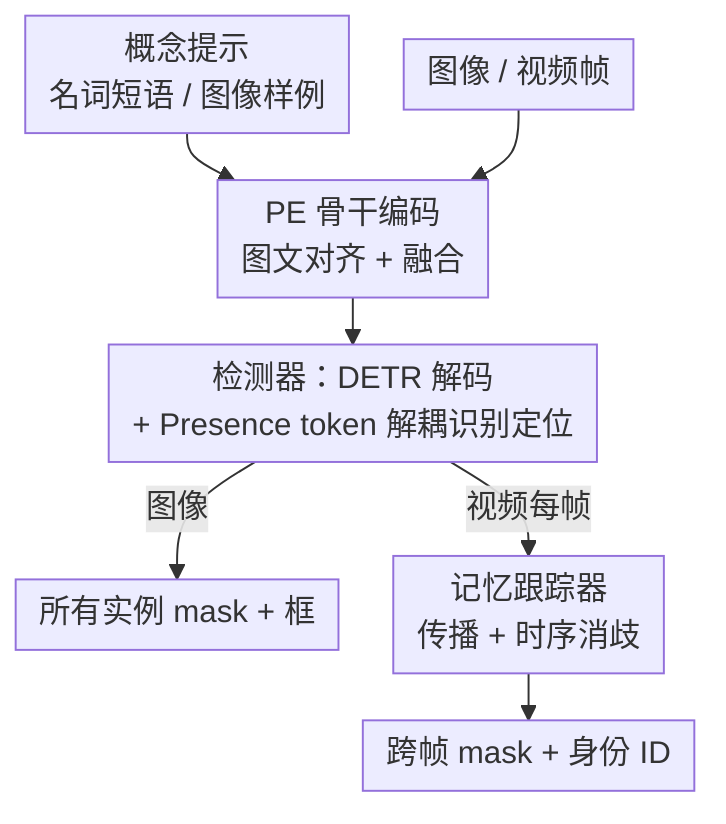

# SAM 3: Segment Anything with Concepts

**会议**: ICLR 2026  
**OpenReview**: [https://openreview.net/forum?id=r35clVtGzw](https://openreview.net/forum?id=r35clVtGzw)  
**论文**: [Meta AI SAM 3](https://ai.meta.com/sam3)  
**代码**: https://github.com/facebookresearch (开源 SAM 3 权重、推理代码与 SA-Co benchmark)  
**领域**: 3D视觉 / 视频理解 / 分割  
**关键词**: 可提示概念分割, 开放词汇检测, presence token, 数据引擎, 视频跟踪

## 一句话总结
SAM 3 把"找出并分割图像/视频里某个概念的所有实例"（Promptable Concept Segmentation, PCS）做成一个统一模型——用名词短语或图像样例当提示，靠一个共享骨干 + 检测器 + 记忆跟踪器输出所有匹配实例的 mask 与跨帧身份，再配一套人机协同数据引擎产出 4M 概念标签的训练集，最终在图像/视频 PCS 上把现有系统的精度翻倍。

## 研究背景与动机

**领域现状**：SAM 系列（SAM 1/2）开创了"可提示视觉分割"（Promptable Visual Segmentation, PVS）——你给一个点、框或 mask，模型分割出**单个**对象，并能在视频里跟踪它。这套范式在交互式分割上是突破性的。

**现有痛点**：PVS 有个根本局限——它一次只处理一个对象实例。但真实需求往往是"把视频里**所有**的猫都分割出来"、"标注图里**每一个**黄色校车"。这种"找出某个概念的全部实例"的能力，PVS 做不到；而现有的开放词汇检测器（OWLv2、GroundingDINO、LLMDet 等）虽然能按文本检测，但精度低、分割质量差，在真正多样、长尾的概念上崩得厉害（论文里这些 baseline 在 SA-Co 上的 cgF1 普遍只有 10~30）。

**核心矛盾**：要做好"概念分割"，模型必须同时解决两件性质相反的事——**识别**（这个概念在不在画面里？需要全局上下文）和**定位**（具体每个实例在哪？本质是局部的）。把这两件事压到同一组 query 上去学，会互相打架；而开放词汇又要求模型见过海量、带难负样本的概念标签，而这种数据根本不存在。

**本文目标**：(1) 把 PCS 形式化为一个可提示、可交互、图像视频统一的任务；(2) 设计一个架构，让识别与定位、检测与跟踪各司其职不互相干扰；(3) 造出足够大、足够难、足够干净的训练数据。

**切入角度**：作者观察到——识别和定位的冲突可以通过"解耦"消除：让一个专门的全局 token 只回答"概念在不在"，让每个 proposal query 只回答"我是不是一个匹配实例"，两者相乘得最终分数。同理，检测器（身份无关）和跟踪器（专注区分身份）解耦、但共享骨干，避免任务冲突。数据问题则用"AI 标注员 + AI 验证员"把人力集中到最难的失败样本上。

**核心 idea**：用"presence token 解耦识别与定位 + 检测器/跟踪器解耦共享骨干 + 人机协同数据引擎"三件套，把可提示概念分割从"分割单个对象"推进到"分割一个概念的所有实例并跨帧保持身份"。

## 方法详解

### 整体框架

SAM 3 是 SAM 2 的泛化：既支持原来的 PVS（点/框/mask 提示单对象），又支持新的 PCS（名词短语 / 图像样例提示一个概念的全部实例）。给定一段图像或短视频（≤30s）和一个概念提示，模型要检测、分割并跨帧跟踪所有匹配该概念的实例，每个实例还要有唯一身份 ID。

整条推理管线是一个**双编码器-解码器 transformer**：所有视觉与语言输入先过一个对齐好的 Perception Encoder（PE）骨干；**检测器**（DETR 范式，带 presence token）负责单帧的"找出所有实例"；**记忆跟踪器**（继承 SAM 2 架构）负责把检测结果在视频里传播并维持身份。检测器和跟踪器**共享同一个 PE 骨干**但解耦——检测器是身份无关的"逐帧找物"，跟踪器专注"跨帧分身份"，两者目标正交，解耦后互不拖累。文本短语对整段视频是全局的，图像样例可以逐帧作为正/负框迭代加入来精修目标。

> 训练数据这一侧（人机协同数据引擎）不在上面这张推理图里，但它是 SAM 3 性能跃迁的另一半，单独作为关键设计 4 讲。

### 关键设计

**1. 检测器与跟踪器解耦、共享 PE 骨干**

PCS 同时要"逐帧把概念的所有实例找全"和"在视频里把每个实例的身份维持住"。这两件事目标其实是冲突的：检测器应该是**身份无关**的（它只管这一帧有哪些匹配物），跟踪器的核心目标却是**区分身份**（把不同实例在时间上分开）。如果用一个网络同时背这两个目标，会互相干扰。SAM 3 的做法是把二者拆成两个模块，但让它们共享同一个对齐好的 PE 骨干：检测器基于 DETR 范式，文本/几何/图像样例先编码成 prompt tokens，融合编码器让图像 embedding 去 cross-attend 这些 prompt tokens，再过一个 DETR 解码器，让一组可学习的 object query 去 cross-attend 条件化后的图像特征，每层预测"是否匹配概念"的二分类 logit 和框的增量。mask 头改自 MaskFormer，另有一个语义分割头逐像素判断是否属于该概念。视频侧，跟踪器在每帧把上一帧的 masklet $M_{t-1}$ 传播到 $\hat{M}_t$，检测器给出当前帧新检测 $O_t = \text{detect}(I_t, P)$，再用匹配函数把两者关联：$M_t = \text{match\_and\_update}(\hat{M}_t, O_t)$。解耦后训练上各自优化、推理上各管一段，避免了任务冲突。

**2. Presence token：把"识别"从"定位"里拆出来**

让每个 proposal query 既判断"画面里有没有这个概念"（what，需要全局上下文）又判断"这个实例在哪"（where，本质局部），是矛盾的——逼局部的定位 query 去理解全局语境会适得其反，尤其在用难负样本短语训练时。SAM 3 引入一个可学习的**全局 presence token**，专门负责预测概念是否出现：$p(\text{NP present in input})$。这样每个 proposal query $q_i$ 只需要解一个纯定位问题——在"概念确实存在"的条件下，我是不是一个匹配：$p(q_i \text{ is a match} \mid \text{NP present})$。最终每个 query 的分数是两者相乘：

$$\text{score}(q_i) = p(\text{NP present}) \cdot p(q_i \text{ is a match} \mid \text{NP present})$$

这个解耦让检测精度显著提升（消融里 presence head 是关键涨点项之一），因为它把"全局是否存在"的判断从每个局部 query 身上卸了下来，交给一个专门承担全局语境的 token。

**3. 图像样例提示与交互式精修**

纯文本短语有时不够：概念很罕见、或模型初始漏检/误检时，用户需要更直接的方式纠正。SAM 3 支持**图像样例**——一个"框 + 正/负标签"的配对，可单独用也可补充文本。和 PVS 里"一个视觉提示只出一个实例"不同，这里给一个正框在某只狗上，模型会检测出图里**所有**的狗。每个样例由 exemplar encoder 单独编码（位置 embedding + 标签 embedding + ROI-pool 的视觉特征，拼接后过一个小 transformer），再接到文本提示后面组成 prompt tokens。交互上，用户看着当前检测的错误逐步加样例：漏掉的真值当正样例、误检当负样例。实验显示这种交互式 PCS 涨得比"理想 PVS 逐个修正"还快——3 次点击后比纯文本提示高 +21.6 cgF1、比 PVS 精修高 +2.0，因为样例能让模型**泛化**（检测/抑制相似对象），而 PVS 只能修单个实例。对已有的某个 mask(let)，还能用 SAM 2 风格的正负点继续精修，并在视频里传播。

**4. 记忆跟踪器与时序消歧**

视频里把检测和跟踪拼起来会在拥挤场景出歧义。跟踪器继承 SAM 2 的 prompt encoder + mask decoder + memory encoder + memory bank：第一帧检测到的每个对象初始化一个 masklet，之后每帧基于记忆库里过去帧/条件帧的外观特征预测新位置；memory encoder 是个 transformer，对当前帧视觉特征做 self-attention、再 cross-attend 记忆库里的空间记忆。推理时只保留"对象确信存在"的帧进记忆库；为处理歧义，每个对象每帧预测 3 个候选 mask 取最自信的。关键的两条**时序消歧**策略：(i) **masklet 检测分数**——统计一个 masklet 在时间窗内被检测匹配上的一致性（过去多少帧匹配上），低于阈值就抑制掉，专治幽灵轨迹；(ii) **周期性用检测重提示**——遇到遮挡或干扰物时跟踪器自己的预测 $\hat{M}_t$ 会漂，用高置信检测 mask $O_t$ 定期替换它，保证记忆库里始终有可靠近期参考。检测与跟踪结果用简单的 IoU 匹配关联，未匹配上的新检测则 spawn 新 masklet。

**5. 人机 + AI 协同数据引擎（训练侧）**

PCS 的性能跃迁离不开海量、多样、带难负样本的概念标注，而这种数据不存在。SAM 3 造了一个"SAM 3 + 人类标注员 + AI 标注员"反馈闭环的数据引擎，主动挖当前模型失败的 media-phrase 对来产出训练数据。三大创新：(i) **媒体筛选**比过去单一网络来源更多样；(ii) **标签筛选**——用本体（22.4M 节点、基于 Wikidata 的 SA-Co ontology）+ 多模态 LLM 当"AI 标注员"生成名词短语和**对抗性难负样本**；(iii) **标签验证**——把 Llama 3.2 微调成"AI 验证员"做 Mask Verification（mask 质量）和 Exhaustivity Verification（是否标全了所有实例），达到接近人类的准确率，**吞吐量翻倍**，让人力只集中在最难的纠错样本上。四个阶段渐进：Phase 1 纯人验证收 4.3M 图-短语对；Phase 2 引入 AI 验证员 + 难负样本，加 122M 对；Phase 3 扩到 15 个域、长尾细粒度概念，加 19.5M 对；Phase 4 扩展到视频。最终 SA-Co/HQ 标了 5.2M 图、4M 唯一短语、52M mask，外加合成集 38M 短语 / 1.4B mask，是目前最大的高质量开放词汇分割数据集。

### 损失函数 / 训练策略
训练分四阶段渐进加数据和能力：(1) PE 骨干预训练；(2) 检测器预训练；(3) 检测器微调；(4) 冻结骨干训练跟踪器（同 SAM 2）。检测器训练采用 DAC-DETR 的双重监督和 Align loss，框回归用逐层 delta + box-region-positional bias，但 attention 仍用 vanilla 版本。

## 实验关键数据

### 主实验

图像 PCS（文本提示）——SAM 3 在闭词汇和开放词汇上都刷新 SOTA，对最强 baseline 至少翻倍：

| 任务 / 数据集 | 指标 | SAM 3 | 之前最好 | 说明 |
|--------|------|------|----------|------|
| LVIS 实例分割 | mask AP | 48.8 | 38.5 (DINO-X) | zero-shot，大幅领先 |
| LVIS 实例分割 | AP | 48.5 | 38.5 | — |
| SA-Co/Gold（开放词汇） | cgF1 | 54.1 | 24.6 (OWLv2⋆) | 翻倍+，达人类 74% |
| COCO 框检测 | AP | 53.6 | — | 闭词汇新 SOTA |
| ADE-847 语义分割 | mIoU | 13.8 | 9.2 (APE-D) | 超强专家 baseline |
| PC-59 语义分割 | mIoU | 60.8 | 58.5 (APE-D) | — |

图像样例提示（Tab. 3，AP+）——SAM 3 大幅超过 T-Rex2：COCO +18.3、LVIS +10.3、ODinW +20.5；文本+图像（T+I）组合最强（COCO 78.1 / LVIS 78.4）。

视频 PCS（文本提示，Tab. 5）——在 NP 数量大的 benchmark 上优势尤其明显：

| Benchmark | 指标 | SAM 3 | 最强 baseline | 说明 |
|--------|------|------|----------|------|
| SA-Co/VEval (SA-V) | pHOTA | 58.0 | 55.7 (Det+T-by-D) | 达人类 pHOTA 80%+ |
| SA-Co/VEval (YT-Temporal) | cgF1 | 50.8 | 47.6 | — |
| BURST | test HOTA | 44.5 | 33.3 (LLMDet+Tracker) | — |
| OVIS | val mAP | 60.5 | 55.1 | — |

PVS（视觉提示）——SAM 3 在 VOS 上普遍超过 SAM 2，最难的 MOSEv2 上领先前作 6.5 分；计数任务 CountBench 准确率 93.8% / MAE 0.12，优于多个 72B 级 MLLM。

### 消融实验

| 配置 | 效果 | 说明 |
|------|---------|------|
| Full model | 最优 | 完整模型 |
| w/o presence head | 检测精度下降 | 识别与定位耦合回去，掉点 |
| w/o 难负样本 | 开放词汇精度下降 | 难负样本对开放词汇识别关键 |
| 更弱 backbone | 下降 | PE 骨干选择影响显著 |
| w/o AI 验证员 | 吞吐减半 | AI 验证员让数据引擎吞吐翻倍 |

### 关键发现
- presence head、难负样本、backbone 选择三者都被验证是关键涨点项，其中 presence head 解耦识别/定位是检测精度提升的核心。
- 交互式 PCS 比理想 PVS 修正涨得更快（3 击后 +2.0 cgF1），因为图像样例能泛化到相似对象、而 PVS 只能逐个修；但 4 击后趋于平台，因为样例修不了"mask 质量本身差"的错误。
- 论文给出了 PCS 任务在高质量集与合成集上的 scaling law，数据规模和概念多样性是性能主驱动。
- 推理高效：H200 上单图 100+ 物体仅 30ms；视频延迟随物体数线性增长，约 5 个并发对象时接近实时。

## 亮点与洞察
- **presence token 的解耦思想最"啊哈"**：把"概念在不在"（全局）从"实例在哪"（局部）里拎出来交给一个专门 token，最终分数两者相乘——一个极简但切中开放词汇检测痛点的设计，可迁移到任何"识别+定位耦合"的检测框架。
- **检测器/跟踪器解耦共享骨干**：用"目标正交所以拆开、但表征共享所以省算力"的思路，优雅地把图像能力和视频能力统一进一个模型，而非简单堆两个网络。
- **AI 当标注员/验证员**：把微调后的 MLLM 用作接近人类精度的验证员，让数据引擎吞吐翻倍、人力聚焦最难样本——这套"模型在环主动挖失败样本"的数据飞轮范式，对任何需要大规模高质量标注的任务都有借鉴价值。
- **与 MLLM 组合处理复杂语言**：SAM 3 只管原子名词短语，但能直接接 MLLM 处理需要推理的长 referring expression，把"原子概念分割器"当成 MLLM 的视觉工具。

## 局限与展望
- **概念限定为简单名词短语**：不支持长 referring expression 或需要推理的查询（要靠外接 MLLM），且所有提示必须类别定义一致（"fish"不能用尾巴的样例去精修，得改文本）。
- **概念本身有内在歧义**：多义（"mouse"设备 vs 动物）、主观描述（"cozy""large"）、边界模糊（"mirror"含不含框）等无法完全消除，作者靠三标注员 oracle 评估和歧义模块缓解。
- **视频延迟随物体数增长**：约 5 个并发对象才接近实时，密集多目标场景下吞吐受限。
- RF-100VL 这类高度专门化域仍超出当前 scope，需微调适配。

## 相关工作与启发
- **vs SAM 1 / SAM 2（PVS）**: 它们一个提示只分割一个对象；SAM 3 把任务推广到"一个概念的所有实例 + 跨帧身份"，并在 PVS 任务上反过来也超过 SAM 2（MOSEv2 +6.5）。
- **vs OWLv2 / GroundingDINO / LLMDet（开放词汇检测器）**: 它们能按文本检测但分割质量与开放词汇精度差，SA-Co/Gold 上 cgF1 普遍 <30；SAM 3 靠 presence head + 难负样本 + 数据引擎把 cgF1 翻倍到 54.1。
- **vs T-Rex2（视觉样例检测）**: SAM 3 的图像样例编码 + 交互机制在 COCO/LVIS/ODinW 上 AP+ 大幅领先（+10~20），且统一进同一模型而非专用方法。
- **vs GLEE（开放词汇视频分割）**: GLEE 在 SA-Co/VEval 上几乎崩溃（cgF1≈0），SAM 3 的解耦检测器+记忆跟踪器在 NP 数量大的视频 benchmark 上优势尤其突出。

## 评分
- 新颖性: ⭐⭐⭐⭐⭐ PCS 任务形式化 + presence token 解耦 + 数据引擎，是范式级而非增量改进。
- 实验充分度: ⭐⭐⭐⭐⭐ 图像/视频/few-shot/计数/复杂语言全覆盖，多 benchmark 翻倍 + scaling law + 细致消融。
- 写作质量: ⭐⭐⭐⭐⭐ 任务定义、架构、数据引擎层层递进，图表清晰。
- 价值: ⭐⭐⭐⭐⭐ 开源模型 + SA-Co benchmark，对多模态、机器人、标注、AR 等下游基础能力影响深远。

<!-- RELATED:START -->

## 相关论文

- [\[AAAI 2026\] SAQ-SAM: Semantically-Aligned Quantization for Segment Anything Model](../../AAAI2026/segmentation/saq-sam_semantically-aligned_quantization_for_segment_anything_model.md)
- [\[ICLR 2026\] Matting Anything 2: Towards Video Matting for Anything](matting_anything_2_towards_video_matting_for_anything.md)
- [\[ICLR 2026\] SAM-Veteran: An MLLM-based Human-like SAM Agent for Reasoning Segmentation](sam-veteran_an_mllm-based_human-like_sam_agent_for_reasoning_segmentation.md)
- [\[AAAI 2026\] SAM-DAQ: Segment Anything Model with Depth-guided Adaptive Queries for RGB-D Video Salient Object Detection](../../AAAI2026/segmentation/sam-daq_segment_anything_model_with_depth-guided_adaptive_queries_for_rgb-d_vide.md)
- [\[AAAI 2026\] Segment Anything Across Shots: A Method and Benchmark](../../AAAI2026/segmentation/segment_anything_across_shots_a_method_and_benchmark.md)

<!-- RELATED:END -->
