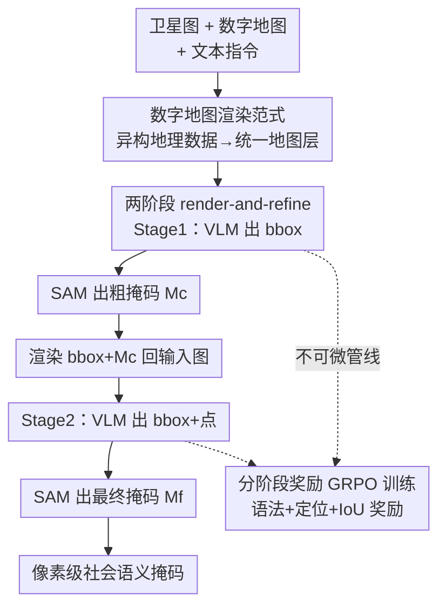

# Urban Socio-Semantic Segmentation with Vision-Language Reasoning

**会议**: ICLR 2026  
**OpenReview**: [https://openreview.net/forum?id=sVN9K0BLQj](https://openreview.net/forum?id=sVN9K0BLQj)  
**代码**: https://github.com/AMAP-ML/SocioReasoner  
**领域**: 语义分割 / 多模态VLM / 遥感 / 强化学习  
**关键词**: 社会语义分割, 遥感影像, 视觉-语言推理, SAM, GRPO

## 一句话总结
本文定义了"城市社会语义分割"这一新任务（从卫星影像中分割学校、公园等由社会属性而非视觉外观定义的实体），构建了 SocioSeg 数据集（把异构地理空间数据统一渲染成一张数字地图层）并提出 SocioReasoner 框架——用 VLM 模仿人类标注员的"先定位、再渲染反馈、后精修"两阶段推理流程，再用 GRPO 强化学习端到端优化这条不可微的提示生成管线，在三级层次任务上全面超越 SOTA 并展现出强零样本泛化。

## 研究背景与动机

**领域现状**：城市地表的语义实体大致分两类。一类是**物理语义实体**（建筑、水体、道路），它们有明确的视觉特征，凭高分辨率卫星影像就能被现有分割模型精准切出。另一类是**社会语义实体**（学校、公园、住宅区），它们的边界和身份由社会语义而非视觉外观决定，单看卫星影像很难判定。

**现有痛点**：以往做社会语义分割的方法靠引入辅助的多模态地理数据（如 POI 兴趣点、路网），用独立编码器分别提特征再融合，做全监督训练。这条路有三个瓶颈：(i) 原始地理数据常因商业或安全限制难以获取；(ii) 即便拿到，异构格式和空间粒度不匹配也需要繁琐的预处理与对齐；(iii) 只在预定义类别上训练，无法泛化到开放的社会类别。

**核心矛盾**：社会语义本质上"多样且复杂"，恰恰需要复杂的推理过程——而这正是 VLM 擅长的；但现有把 VLM 用到卫星影像的工作几乎都还在推理物理属性，没人碰社会语义。同时，现有 VLM 推理分割多是"单阶段"：VLM 出一个 bbox 喂给冻结的 SAM 直接出最终掩码，对输出质量缺乏控制，结果粗糙。

**本文目标**：(1) 定义并提供社会语义分割的基准；(2) 设计一个无需原始受限数据、能自适应推理的框架。

**切入角度**：人类标注员标社会实体时不是一步到位，而是先大致定位、看一眼结果、再点几个点修正边界——这个串行交互过程天然适合用多阶段推理 + 视觉反馈来模拟。

**核心 idea**：把异构地理数据统一**渲染成一张数字地图层**（与卫星影像天然对齐、且公开可得），从而把多模态难题转成"视觉推理"难题；再让 VLM 走一遍"定位→渲染→精修"两阶段流程，用 GRPO 强化学习直接优化不可微的 IoU 奖励。

## 方法详解

### 整体框架

SocioReasoner 接收三样输入：卫星图 $I_s$、数字地图 $I_m$、含社会语义概念的文本指令 $t$，输出目标实体的像素级掩码。整条管线模仿人类标注员的串行工作流，分两个阶段，中间靠"渲染反馈"把第一阶段结果可视化地喂回 VLM：

- **第一阶段（定位）**：VLM $F$ 读入 $(I_s, I_m, t_b)$，吐出一组 2D 边界框 $B$ 定位候选区域；把 $B$ 作为提示喂给冻结的 SAM $S$，得到初步**粗掩码** $M_c$。
- **渲染反馈**：渲染函数 $D$ 把边界框 $B$ 和粗掩码 $M_c$ 叠加回卫星图和地图，得到一对带标注的渲染图 $(I_{s,r}, I_{m,r})$。
- **第二阶段（精修）**：VLM 在渲染图和新指令 $t_p$ 条件下，同时吐出边界框 $B$ 和一组**点提示** $P$；再把 box+point 全部喂回 SAM，得到高保真**最终掩码** $M_f$。

整条管线是**不可微**的（中间有 SAM 调用、JSON 解析、渲染），无法用梯度直接训练，因此用 GRPO 强化学习优化 VLM 生成提示的策略，同一个 VLM 策略权重在两个阶段间共享。

### 关键设计

**1. 数字地图渲染范式：把"拿不到的原始多模态数据"换成一张公开可得且天然对齐的地图层**

社会语义实体的难点在于卫星影像里看不出"这是学校还是医院"，必须靠地理空间信息（POI、路网）补充；但原始 POI/路网数据要么受商业安全限制拿不到，要么格式异构、空间粒度对不齐。本文的解法是 SocioSeg 数据集的核心创新：不直接喂原始地理数据，而是把它们统一**渲染进一张数字地图图层**——直接从高德公开 API 取卫星图和数字地图（含路网、POI 的基础渲染，有中英文版本）。这一步同时解决三件事：(i) 公开地图层替代了受限的原始数据，绕开获取难题；(ii) 地图层与卫星影像本就同源配准，免去复杂对齐；(iii) 融成单一视觉模态后，把"多模态特征融合"问题彻底转成了"看图推理"问题，让 VLM 的视觉理解能力可以直接发挥。数据集按三级层次组织：Socio-name（如"某大学"，5000+ 个名称）→ Socio-class（如"高校"，90+ 类）→ Socio-function（如"教育用地"，10+ 功能），抽象度和推理难度逐级递增，共 1.3 万+ 样本，按 6:1:3 划分训练/验证/测试。

**2. 两阶段 render-and-refine 推理：用"渲染反馈"让模型看到自己第一步的结果再修正**

现有 VLM 推理分割是单阶段——VLM 一次性出 bbox 喂给冻结 SAM，模型既看不到中间掩码也无法自我纠错，且要在一次长结构化输出里同时规划框和点，失败率高。SocioReasoner 把这个过程拆成"定位→精修"两步并插入视觉反馈：第一阶段只让 VLM 专注定位、出 bbox 得到粗掩码 $M_c=S(I_s, \text{prompt}=B)$；关键的一步是用渲染函数 $D$ 把 $B$ 和 $M_c$ 叠回输入图 $I_{s,r}=D(I_s,B,M_c)$、$I_{m,r}=D(I_m,B,M_c)$，让 VLM"亲眼看到"上一步切得对不对；第二阶段在渲染图上 VLM 再出 $\{B,P\}=F(I_{s,r},I_{m,r},t_p)$，用额外的点提示把边界修准，最终 $M_f=S(I_s,\text{prompt}=\{B,P\})$。这套机制把分割难题分解成定位与精修两步，既提升精度又让推理链条显式、可解释，整个流程严格对应人类标注员"先框后点"的工作方式。消融显示去掉精修阶段（w/o refinement）cIoU 从 47.9 掉到 46.4，退化成单阶段（w/o reflection）进一步掉到 44.0。

**3. 分阶段奖励的 GRPO 端到端强化学习：直接优化不可微的 IoU 而非靠监督模仿**

整条管线含 SAM 调用、JSON 解析、渲染，不可微，无法用 SFT 之外的梯度方法端到端训。本文用 GRPO（Group Relative Policy Optimization）在两个阶段各自优化：对输入 $x$，策略 $\pi_\theta$ 采样 $G$ 个补全 $\{y^{(g)}\}$，环境解析出提示、跑 SAM、返回标量奖励，用组内均值作基线算优势 $A^{(g)}=R^{(g)}-\frac{1}{G}\sum_g R^{(g)}$，再用带 KL 正则的 PPO 式裁剪目标更新。两阶段奖励各自定制：第一阶段 $R_1$ = 二值语法奖励（保证 JSON 合法）+ 框定位精度 + 匹配目标数量；第二阶段 $R_2$ = 二值语法奖励 + 最终掩码的像素级 IoU + 点数长度奖励（其中超参 $\mu$ 直接控制点的数量）。一个 RL 步内先用 Stage-1 rollout 更新 $L_1$，再用其输出构造 Stage-2 输入更新 $L_2$，让优化顺序与"定位→精修"工作流对齐。直接优化不可微的 IoU 是 RL 相比 SFT 的关键优势：它学到的是更泛化的几何推理策略，而非死记训练分布，因此在跨地图风格、跨地理区域的 OOD 场景下鲁棒性显著更强。

### 损失函数 / 训练策略

第一阶段目标为带 KL 正则的裁剪式 PPO 代理损失：

$$L_1(\theta) = -\frac{1}{G}\sum_{g=1}^{G}\sum_{t}\min\!\Big(r_{1,t}^{(g)} A_1^{(g)},\ \text{clip}(r_{1,t}^{(g)}, 1-\epsilon, 1+\epsilon)A_1^{(g)}\Big) + \beta\,\text{KL}\big(\pi_\theta \,\|\, \pi_{\text{ref}}\big)$$

其中 $r_{1,t}^{(g)}$ 是 token 级重要性比，$\epsilon$ 控制 PPO 裁剪，$\beta$ 控制对冻结参考策略 $\pi_{\text{ref}}$ 的 KL 约束。第二阶段 $L_2$ 沿用同样的 GRPO 采样、基线/优势计算与裁剪目标，只是奖励换成 $R_2$。训练时每个 RL 步顺序执行两阶段更新。

## 实验关键数据

### 主实验

在 SocioSeg 测试集上分三级任务对比 SOTA（cIoU / gIoU / F1）。SocioReasoner 在全部三级任务、全部指标上一致领先。下表节选"All dataset"汇总列：

| 方法 | 类型 | cIoU | gIoU | F1 |
|------|------|------|------|-----|
| UNet | 标准分割 | 11.7 | 10.7 | 10.0 |
| Segformer | 标准分割 | 22.1 | 20.5 | 18.7 |
| SegEarth-OV | 遥感开放词表 | 3.7 | 3.7 | 0.0 |
| RSRefSeg | 遥感指代分割 | 29.0 | 28.3 | 32.8 |
| SegEarth-R1 | 遥感推理分割 | 38.3 | 44.1 | 48.4 |
| RemoteReasoner | 遥感推理分割 | 43.2 | 47.7 | 53.3 |
| Seg-R1 | 自然图推理分割 | 41.0 | 45.0 | 45.2 |
| VisionReasoner | 自然图推理分割 | 44.0 | 48.5 | 54.3 |
| **SocioReasoner (本文)** | — | **47.9** | **52.8** | **59.7** |

标准分割模型（UNet/Segformer）无法处理多模态输入，任务退化成二分类，因社会类别缺乏视觉特征而表现垫底；冻结 CLIP 编码器的 SegEarth-OV 几乎失效（F1=0）；本文相比最强基线 VisionReasoner 在 F1 上提升约 5.4 个点。

### 消融实验

| 配置 | cIoU | gIoU | F1 | 说明 |
|------|------|------|-----|------|
| w/o reflection | 44.0 | 48.5 | 54.3 | 单阶段一次性出框+点（等价 VisionReasoner） |
| w/o refinement | 46.4 | 50.8 | 57.5 | 两阶段训练但只用 Stage-1 输出 |
| **Ours（完整）** | **47.9** | **52.8** | **59.7** | 渲染反馈 + 两阶段 |
| 1 点精修 | 47.6 | 51.2 | 58.0 | 单点常覆盖不全目标 |
| **2 点精修** | **47.9** | **52.8** | **59.7** | 最终选择 |
| 3 点精修 | 48.9 | 52.3 | 58.8 | 难学稳定分布，相比 2 点边际收益小 |

OOD 泛化（RL vs SFT）：

| 方法 | ID F1 | OOD 地图风格 F1 | OOD 新区域 F1 |
|------|-------|----------------|---------------|
| Ours (SFT) | 57.8 | 46.9 | 31.5 |
| **Ours (RL)** | **59.7** | **57.7** | **42.9** |

OOD 新区域来自东京、纽约、圣保罗、伦敦、内罗毕五座全球城市（3200 样本、80 类、含 24 个训练未见类）。

### 关键发现
- **精修阶段贡献最大**：去掉 reflection（退化成单阶段）F1 掉 5.4 点，是所有消融里掉点最多的；说明"让模型看到自己中间结果再修"这一步是核心。训练曲线显示 Stage-1 gIoU 早期更高（模型先学定位），随训练推进 Stage-2 反超（模型学会用点修掩码）。
- **点数有甜区**：2 点是定位覆盖与稳定性的平衡点，单点覆盖不全、3 点 VLM 难学稳定分布，由奖励超参 $\mu$ 控制。
- **RL 远比 SFT 抗 OOD**：跨地图风格 F1 从 46.9→57.7、跨新区域从 31.5→42.9；直接优化不可微 IoU 让模型学到可迁移的几何推理策略，VisionReasoner 上也观察到 RL>SFT 的同样趋势。
- **失败模式是误差传播**：若 Stage-1 定位严重偏离 GT，Stage-2 的点提示会放大而非纠正偏差（Business Office、Residential 两类功能上表现欠佳）。

## 亮点与洞察
- **"渲染统一表示"是最巧的一招**：把拿不到/对不齐的异构地理数据渲染成一张公开数字地图，一举把"多模态特征融合"降维成"看图推理"，既绕开数据获取与对齐难题，又让 VLM 的视觉能力直接可用——这个范式可迁移到任何"辅助模态难获取但能可视化渲染"的任务。
- **用"渲染反馈"做自我纠错**：把中间掩码画回输入图再喂回模型，是让 VLM 获得视觉闭环反馈的轻量办法，不改模型结构、不加新模块，纯靠 prompt 工程 + RL 就实现了"看一眼修一下"。
- **不可微管线 + GRPO 直接优化 IoU**：当 pipeline 含 SAM、解析、渲染这些不可微环节时，RL 是把"最终指标"当奖励端到端拉通的自然选择，避开了 SFT 模仿单步标签的局限。

## 局限与展望
- **推理慢**：多步人类式推理流程使推理时间显著长于单阶段方法（作者在附录承认）。
- **误差传播**：Stage-1 定位大偏时 Stage-2 会恶化而非纠正，缺乏"放弃/重定位"机制。
- **依赖地图层质量**：数字地图渲染范式的上限受地图 API 覆盖度与渲染信息量约束，地图本身缺失 POI 的区域可能退化。
- **点数固定为 2**：靠超参 $\mu$ 硬控点数，未做按目标尺度/形状自适应的点数策略，复杂大目标可能 2 点不够。
- **改进思路**：引入置信度判断让 Stage-2 在定位失败时触发重定位；让精修点数随目标几何自适应。

## 相关工作与启发
- **vs VisionReasoner / Seg-R1 / SAM-R1（自然图推理分割）**：它们都是单阶段、冻结 SAM、VLM 一次出提示。本文多了"渲染反馈 + 两阶段精修"，提供反思与修正能力；SAM-R1 因不限制点数会吐大量点反而掉点，本文用奖励约束点数为 2。
- **vs SegEarth-R1 / RemoteReasoner（遥感推理分割）**：它们聚焦物理属性、且 RSRefSeg/SegEarth-R1 只支持单张卫星图。本文专攻社会语义、用双图（卫星+地图）输入，并以两阶段定位-精修取得更精确分割。
- **vs SegEarth-OV（遥感开放词表）**：它冻结 CLIP 编码器，识别能力被限制在 CLIP 预训练类别内，对 SocioSeg 的新社会类别几乎失效（F1≈0）；本文靠 VLM 推理而非固定词表，可处理开放的社会语义。
- **vs 传统土地利用分类 / 城市功能区**：那类工作面向固定闭集类别、用独立编码器融合原始多模态数据；本文是开放词表/指代/推理式分割，每个实体名几乎是独立类（5000+ 名称），与分类任务本质不同。

## 评分
- 新颖性: ⭐⭐⭐⭐⭐ 首次定义城市社会语义分割任务，"渲染统一地图层"范式 + VLM 两阶段推理分割组合新颖
- 实验充分度: ⭐⭐⭐⭐ 三级任务 + 10 个基线 + 多组消融 + 跨风格跨区域 OOD，较完整；推理时延分析放附录略简
- 写作质量: ⭐⭐⭐⭐⭐ 动机、范式、流程公式化清晰，图文对照好读
- 价值: ⭐⭐⭐⭐⭐ 给地理空间分析开了"VLM 推理 + 渲染范式"的实用方向，数据集与代码 Apache 2.0 开源

<!-- RELATED:START -->

## 相关论文

- [\[ICLR 2026\] SAM-Veteran: An MLLM-based Human-like SAM Agent for Reasoning Segmentation](sam-veteran_an_mllm-based_human-like_sam_agent_for_reasoning_segmentation.md)
- [\[ECCV 2024\] VISA: Reasoning Video Object Segmentation via Large Language Models](../../ECCV2024/segmentation/visa_reasoning_video_object_segmentation_via_large_language_models.md)
- [\[CVPR 2026\] PixDLM: A Dual-Path Multimodal Language Model for UAV Reasoning Segmentation](../../CVPR2026/segmentation/pixdlm_uav_reasoning_segmentation.md)
- [\[ICLR 2026\] QPrompt-R1: Real-Time Reasoning for Domain-Generalized Semantic Segmentation via Group-Relative Query Alignment](qprompt-r1_real-time_reasoning_for_domain-generalized_semantic_segmentation_via_.md)
- [\[AAAI 2026\] InfoCLIP: Bridging Vision-Language Pretraining and Open-Vocabulary Semantic Segmentation via Information-Theoretic Alignment Transfer](../../AAAI2026/segmentation/infoclip_bridging_vision-language_pretraining_and_open-vocab.md)

<!-- RELATED:END -->
