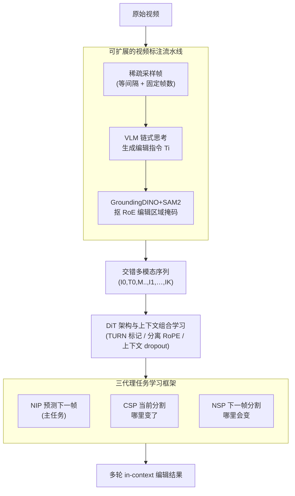

# VINCIE: Unlocking In-context Image Editing from Video

**会议**: ICLR 2026  
**arXiv**: [2506.10941](https://arxiv.org/abs/2506.10941)  
**代码**: [vincie2025.github.io](https://vincie2025.github.io/)  
**领域**: 图像分割  
**关键词**: in-context编辑, 视频学习, 多轮编辑, DiT, 分割预测

## 一句话总结

提出VINCIE框架，首次证明in-context图像编辑模型可以完全从原生视频数据中学习，通过将视频标注为交错多模态序列并设计三个代理任务（NIP/CSP/NSP），在多轮编辑基准上达到SOTA，5轮编辑成功率从基线<2%提升至25%。

## 研究背景与动机

**领域现状**：In-context图像编辑允许用户通过多轮交互迭代修改图像。现有方法依赖特定任务流水线和专家模型（分割、修复等）构建成对训练数据。

**现有痛点**：(1) 构建多轮编辑的配对数据极其困难，现有方法仅能挖掘单轮编辑对；(2) 依赖任务特定流水线限制了数据的通用性和可扩展性；(3) 多轮编辑中的一致性和误差累积问题严重。

**核心矛盾**：高质量多轮编辑训练数据的稀缺与模型对长程上下文依赖的学习需求之间的矛盾。

**本文目标** 是否可以仅从视频数据中学习出有意义的in-context图像编辑模型，无需任何独立图像对。

**切入角度**：视频天然包含丰富的视觉动态变化（物体出入、姿态变化、相机运动），这些隐式地提供了编辑操作的学习信号。

**核心 idea**：从原生视频数据中构建交错多模态序列（帧+转换描述+分割掩码），用三个代理任务训练DiT模型学习上下文感知的图像编辑。

## 方法详解

### 整体框架

VINCIE 要解决的问题是：多轮 in-context 图像编辑缺少高质量的"成对编辑"训练数据，而构造这类数据极其费力。它的破局点是把这个数据问题转嫁给天然海量的视频——一段视频里物体进出、姿态变化、镜头移动本身就是一连串"编辑"。整条流程是这样转的：先由**视频标注流水线**把一段原始视频改写成一条交错的多模态序列（帧 + 编辑指令 + 分割掩码），再让一个 **DiT 模型**在这条序列上做"看着历史、生成下一帧"的生成训练，训练时用**三个代理任务**联合优化。具体序列形如 $S=(I_0, T_0, M_{00}, M_{01}, I_1, \ldots, I_K)$，其中 $T_i$ 是相邻帧之间的编辑指令、$M$ 是标出"会被编辑到的区域"（Region of Editing, RoE）的掩码，最终模型输出一串可迭代修改的编辑结果。

### 关键设计

**1. 可扩展的视频标注流水线：把视频自动变成训练数据**

多轮编辑数据稀缺的根源在于"成对编辑图"很难大规模获取，这一步绕开这个瓶颈，直接从天然存在的视频里挖编辑信号。采样上用混合策略：等间隔采样捕获物体级的细粒度变化，固定帧数采样则覆盖相机运动、场景切换这类大尺度变化，两者互补保证序列既有"小改"也有"大改"。标注时让 VLM 走一遍链式思考——先逐方面描述两帧差异，再把差异总结成一条可执行的编辑指令 $T_i$，避免直接生成指令时遗漏细节。最后用 GroundingDINO+SAM2 对编辑区域抠出 RoE 掩码，给模型一个显式的空间定位信号，告诉它"改动应该发生在哪儿"。这一整套都是自动化的，因此能在约 10M 个 session 上规模化运行，把视频的海量规模直接转化成训练数据规模。

**2. DiT 架构与上下文组合学习：让模型学会灵活利用历史信息**

编辑的本质是"看着前面所有轮次，生成当前这一帧"，所以建模目标写成自回归形式

$$\log p(S) = \sum_{i=1}^{M} \log p(I_i \mid I_0, T_0, \ldots, T_{i-1}, I_{i-1})$$

每一帧都以之前的全部图像和指令为条件。序列里用可学习的 `<TURN>` 标记分隔不同轮次，位置编码上文本走 1D RoPE、图像走 3D RoPE，以匹配各自的维度结构、避免位置冲突；注意力提供全注意力和块级因果注意力两种变体，后者保证生成第 $i$ 帧时不偷看未来。关键的一招是对上下文施加随机 dropout——当前帧、当前 RoE 掩码、下一帧 RoE 掩码分别以 20%、70%、70% 的概率被丢弃（每轮独立施加），这样模型不会死记某一种固定输入组合，而是学会在缺帧、缺掩码等各种残缺上下文下都能编辑，推理时面对真实多变的输入也更鲁棒。整个模型由视频基础模型的预训练权重初始化，省去从零学视觉先验的成本。

**3. 三代理任务学习框架：用"哪里变了/哪里会变"反哺编辑质量**

仅靠"预测下一帧"（Next Image Prediction, NIP）这一个主任务，模型对编辑区域的定位往往不够准，于是额外加了两个分割任务一起训练。当前分割预测（Current Segmentation Prediction, CSP）让模型显式说出"当前帧哪里是要被改的区域"，强化它的接地（grounding）能力，对局部增删改尤其有用；下一帧分割预测（Next Segmentation Prediction, NSP）让模型预测"改完之后版图会变成什么样"，辅助它处理姿态变化、物体移动这类布局随编辑动态调整的情况。三个任务共享同一个生成框架、都用 flow matching 的 MSE 扩散损失，CSP 从"哪里变了"、NSP 从"哪里会变"两个方向把空间信息注入 NIP，最终让编辑既改对地方又改得干净——消融里加了分割任务后 MSE-Bench Turn-1 成功率从 0.847 升到 0.887。

### 损失函数 / 训练策略

三个任务统一用 flow matching 的 MSE 扩散损失联合优化。RoE 掩码以 80% 概率纳入训练，配合上文提到的上下文 dropout 增强泛化。推理时 50 步采样、CFG scale=10。规模上，3B 模型在 256×H100 上训练 15k 步约 30 小时，7B 模型 40k 步约 150 小时，训练数据约 10M 个 session 实例。

## 实验关键数据

### 主实验

| 数据集 | 指标 | 本文(7B+SFT) | SOTA/对比 | 说明 |
|--------|------|------|------|------|
| MagicBrush Turn-1 | DINO | 0.891 | 0.886(Nano Banana) | 超越所有学术方法 |
| MagicBrush Turn-3 | DINO | 0.775 | 0.773(Nano Banana) | 多轮优势更明显 |
| MSE-Bench Turn-1 | 成功率 | 0.950 | 0.937(Step1X-Edit) | 仅次于Bagel |
| MSE-Bench Turn-5 | 成功率 | 0.487 | 0.413(Bagel) | 大幅优于开源方法 |
| MSE-Bench Turn-5 | 成功率 | 0.210→0.487 | 3B→7B+SFT | 规模缩放效果显著 |

### 消融实验

| 配置 | 指标 | 说明 |
|------|------|------|
| w/o Seg. vs w/ Seg. | MSE Turn-1: 0.847→0.887 | 分割预测任务提升编辑能力 |
| CS→I | MagicBrush DINO Turn-1: 0.797 | 当前分割提升一致性 |
| CS→NS→I | MagicBrush DINO Turn-3: 0.679 | 链式编辑策略最优 |
| pairwise vs sequence | MSE Turn-5: 0.010→0.220 | 序列数据远优于成对数据 |
| 数据规模0.25M→10M | MSE Turn-5: 5%→22% | 近似对数线性扩展 |

### 关键发现

- 仅用视频训练即可匹敌使用成对编辑数据的SOTA方法，且先用视频预训练再SFT效果最佳
- In-context编辑能有效缓解多轮编辑中的伪影累积问题
- 模型展现出未显式训练的涌现能力：多概念组合、故事生成、链式编辑

## 亮点与洞察

- 首次证明从纯视频数据学习in-context图像编辑的可行性，开辟了新的数据来源思路。视频的海量规模让方法具有天然的可扩展性优势。
- 三个代理任务的设计精巧：CSP理解"变化区域"，NSP预测"未来变化"，二者协同增强NIP的编辑质量。这种分解思路值得借鉴。

## 局限与展望

- 视频训练引入主体位置偏移（position shift），虽可通过分割预测缓解但未彻底解决
- 与商业模型（GPT-4o 62.7%、Nano Banana 64.3%）在MSE-Bench Turn-5上仍有较大差距
- 缺乏用户满意度/偏好评估，仅依赖GPT-4o自动评测

## 相关工作与启发

- **vs InstructPix2Pix**: IP2P依赖GPT-3+SD生成成对数据，仅支持单轮编辑；VINCIE利用视频天然支持多轮
- **vs OmniGen/OmniGen2**: OmniGen使用成对编辑数据，多轮时成功率急剧下降（MSE Turn-5仅8.3%）；VINCIE的上下文建模更鲁棒
- **vs UES/RealGeneral**: 这些方法仅利用视频中两帧，忽略长程上下文；VINCIE使用完整多帧序列

## 评分

- 新颖性: ⭐⭐⭐⭐⭐ 首次从视频数据学习in-context编辑，范式创新且有涌现能力
- 实验充分度: ⭐⭐⭐⭐ 提出MSE-Bench新基准，消融全面，扩展性分析充分
- 写作质量: ⭐⭐⭐⭐ 动机清晰，方法描述系统，实验展示精美
- 价值: ⭐⭐⭐⭐⭐ 开辟视频→编辑的新范式，数据可扩展性解决了领域核心瓶颈

<!-- RELATED:START -->

## 相关论文

- [\[ICCV 2025\] VEGGIE: Instructional Editing and Reasoning Video Concepts with Grounded Generation](../../ICCV2025/segmentation/veggie_instructional_editing_and_reasoning_video_concepts_with_grounded_generati.md)
- [\[ICCV 2025\] CAVIS: Context-Aware Video Instance Segmentation](../../ICCV2025/segmentation/cavis_context-aware_video_instance_segmentation.md)
- [\[ICLR 2026\] Matting Anything 2: Towards Video Matting for Anything](matting_anything_2_towards_video_matting_for_anything.md)
- [\[CVPR 2026\] RobotSeg: A Model and Dataset for Segmenting Robots in Image and Video](../../CVPR2026/segmentation/robotseg_a_model_and_dataset_for_segmenting_robots_in_image_and_video.md)
- [\[CVPR 2025\] The Power of Context: How Multimodality Improves Image Super-Resolution](../../CVPR2025/segmentation/the_power_of_context_how_multimodality_improves_image_super-resolution.md)

<!-- RELATED:END -->
