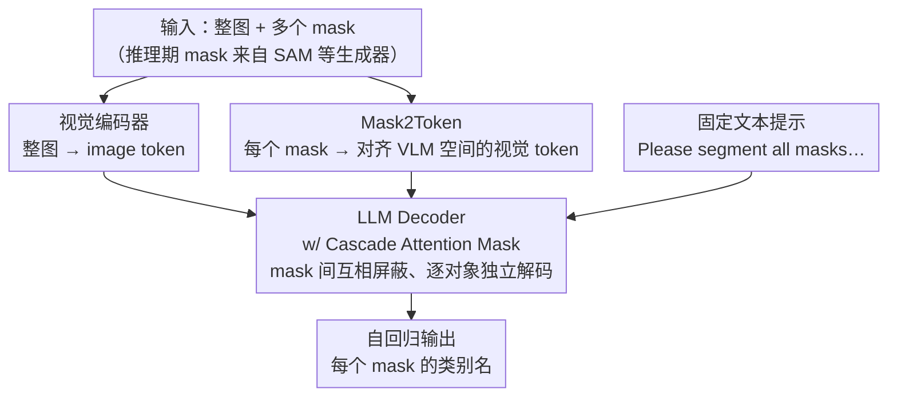

# WOW-Seg: A Word-Free Open World Segmentation Model

**会议**: ICLR 2026  
**论文**: [OpenReview](https://openreview.net/)（ICLR 2026 录用论文，arXiv 号待补，⚠️ 以原文为准）  
**代码**: https://github.com/AAwcAA/WOW-Seg-Meta  
**领域**: 开放世界分割 / 多模态VLM  
**关键词**: 开放世界分割, 视觉提示, 视觉大语言模型, 注意力掩码, 区域识别

## 一句话总结
WOW-Seg 把"给分割区域起类别名"这件事从固定类别头的分类问题，改写成 VLLM 的"看图说话"自回归生成问题：用 Mask2Token 把任意 mask 编码成落在 VLM 特征空间里的视觉提示、用 Cascade Attention Mask 让一张图里的多个 mask 在并行训练/推理时互不干扰，仅用 1B 参数就在 LVIS / PACO 上刷新 SOTA。

## 研究背景与动机
**领域现状**：图像分割长期沿着"提精度、提效率"演进，主流分三类——闭集分割（固定类别头逐像素分类）、开放词表分割（把像素区域和文本类别 embedding 做匹配）、基于视觉语言模型的分割（用文本指令驱动，如 LISA）。

**现有痛点**：前两类的输出能力被预定义类别死死框住，遇到真实世界里"无穷开放"的物体类别就抓瞎；第三类虽然借了 VLLM 的认知能力，但结果高度依赖用户给的文本提示，没有合适的文本就分不出来。即便是 SAM / SAM2 这类强分割基础模型，也只能 class-agnostic 地切出区域、给不出区域的语义。

**核心矛盾**：分割能力和语义理解能力之间存在断层——SAM 类模型很会"切"但不会"认"，VLLM 类模型会"认"但要喂文本。而前人把 mask 接进 VLLM 的做法（如 VP-MLLM、DAM、PAM）还有两个隐疾：① 用专门的 mask 编码器产生的 token 落在 VLLM 预训练特征分布之外，需要大量训练去对齐；② 训练/推理一次只能处理单个 mask，多实例场景下速度受限，或者像 VP-MLLM 那样支持多 mask 却忽略了 mask 之间的相互干扰。

**本文目标**：做一个**完全不需要文本输入**（word-free）的开放世界分割模型，输入任意形式的视觉提示（mask），输出每个 mask 对应的类别名；同时把多 mask 并行训练做对、做快；再补一个类别足够丰富的测试基准来真正考验开放世界理解力。

**切入角度**：作者把"区域类别识别"重新定义为一个**视觉驱动的文本生成**问题——既然 VLLM 天生会 next-token prediction，那就让它顺着视觉 token 自回归地把每个 mask 的名字"说"出来，从根上绕开固定类别头的限制。

**核心 idea**：用"落在 VLM 特征空间内的 mask 视觉 token + 级联注意力掩码"，让一个 VLLM 一次前向就能独立、互不串味地识别一图中的所有 mask。

## 方法详解

### 整体框架
WOW-Seg 建立在 encoder-decoder 框架上、以一个 VLLM（InternVL3-1B）为底座。给定一张图和一组 mask，模型自回归地为每个 mask 生成类别名。整条流水线由四个模块构成：**视觉编码器**先把整图编码成 image token 提供上下文；**Mask2Token** 把每个输入 mask 映射成落在 VLM embedding 空间里的 mask token；这些 mask token 连同 image token 和一段固定文本提示（"Please segment all masks…"）一起送进 LLM decoder；decoder 里嵌入了 **Cascade Attention Mask**，保证每个 mask 的预测彼此独立、互不泄漏信息；最后靠标准 next-token prediction 把所有类别名一次性"说"出来。训练时用 ground-truth mask 作输入，推理时 mask 来源很灵活——可换 SAM 等任意 **Mask Generator**。

### 关键设计

**1. Mask2Token：把 mask 编码成"原生"落在 VLM 特征空间里的视觉提示**

前人用专门模块把二值 mask 编码成 token，虽然信息进去了，但这些 token 不在 VLLM 预训练 embedding 空间内，存在分布鸿沟（distributional gap），要靠大量重训练才能对齐。Mask2Token 的巧思是**不另起炉灶造编码器**，而是复用整图用的同一个共享权重视觉编码器：对每个 mask，先按"包含 mask 及其周边上下文"裁出一块 mask region image（默认上下文尺度 context scale = 2，即裁剪框边长是 mask 最大边长的 2 倍），resize 到编码器标准输入 $448 \times 448$，过共享视觉编码器得到 $16 \times 16$ 的 image token 网格；同时把二值 mask 下采样到 $16 \times 16$，用它当"选择器"从特征网格里挑出 mask 覆盖的那些 token、剪掉无关背景 token。因为用的是**同一个共享权重编码器**，产出的 mask token 天然和全局 image 特征处在同一 embedding 空间，省掉了对齐所需的大量训练。Mask2Token 还能**并行处理多个 mask**，让多个不同物体的特征同时喂进 LLM。

**2. Cascade Attention Mask：让多 mask 并行训练时"对象之间互不串味"**

用单 mask（SM）训练每条样本，效率远低于多 mask（MM）——MM 一次前向就能处理一图里所有实例，也更贴合开放世界"一图多物"的本质。但 MM 引入一个致命问题：**实例间干扰（inter-instance interference）**，模型可能错误地把不同物体的特征关联起来。原因在 LLM 自带的因果注意力掩码：预测第 $i$ 个物体时，模型会参考第 $0$ 到第 $i-1$ 个物体的 mask 提示和已输出结果，即

$$P(O_1,\dots,O_K \mid \text{Image}; T; M) = \prod_{i=1}^{K} P\big(O_i \mid \text{Image}; T; M; O_0,\dots,O_{i-1}\big)$$

而我们希望第 $i$ 个名字**只由它自己的第 $i$ 个 mask 决定**。Cascade Attention Mask 就重排注意力结构：image token 和文本提示 token 对所有 token 全局可见，但不同实例的 mask token **彼此互相屏蔽**——生成"traffic sign"时只能注意自己的 mask token 和自己已生成的前缀（如"traffic"），绝不能看"fire truck"的 mask token，反之亦然。它遵循三条原则：mask 之间独立、对象之间独立、每对 (mask, object) 解耦；预测第 $i$ 个对象时可见信息仅限 image token、文本 token 和第 $i$ 个 mask token。于是各对象预测变成条件独立：

$$P(O_1,\dots,O_K \mid \text{Image}; T; M) = \prod_{i=1}^{K} P(O_i \mid \text{Image}; T; M),\quad P(O_i \mid \text{Image}; T; M) = P(O_i \mid \text{Image}; T; m_i)$$

这样既享受了 MM 的并行高效，又避免了相关 mask 之间的语义串扰。作者还设计了变体（只满足"mask 独立"或只满足"对象独立"其中之一），消融显示"同时解耦 mask 区域特征 + 输出对象名"效果最好。

**3. RR-7K：用三阶段标注流水线造出 7,662 类的开放世界区域识别基准**

现有评测多在常见类别上做，类别量只有几十到一千，无法真正考验开放世界理解力。RR-7K 的图像和 mask 标注取自 SA-1B，难点是**给每个 mask 配上正确类别**，作者用三阶段流水线解决：① **Mask patch 类别推断**——先剔除 SA-1B 里占图比例过低的无意义小 mask（既省推理成本又提质量），再用 Qwen2.5VL-72B、Grounded SAM 等工具给每个 mask 推断类别；② **幻觉过滤**——得到的 mask-类别对呈长尾分布且含大量 LLM 幻觉错标，对**头部类别**用 InternVL-78B 重新质询"红色轮廓/掩码圈出的区域是不是 {类名}？答 yes/no"，筛掉错误数据（尾部类因 LLM 认知差不做此步）；③ **人工筛查**——对所有尾部类和过滤后的头部类做人工核查，因为每个 mask 已有候选类名，只需删掉不一致样本，人力成本低。最终 RR-7K 含 8 万+ 图像、20 万+ 实例、7,662 类，是迄今类别最丰富的区域识别数据集。

### 损失函数 / 训练策略
底座为预训练 InternVL3-1B，在 8 张 NVIDIA H100 上训练；AdamW 优化器，学习率 $1\times 10^{-5}$，batch size 32。最终上报模型在 LVIS、PACO、COCO Stuff 上训练 2 个 epoch。单条样本的 mask 数默认上限 30，以保证多卡训练时各 GPU 负载均衡。训练目标就是标准的自回归 next-token prediction（生成各 mask 的类别名）。

## 实验关键数据

### 主实验：开放世界区域识别（LVIS / PACO / RR-7K）

| 模型 | 参数量 | LVIS Sem.Sim. | LVIS Sem.IoU | PACO Sem.IoU | RR-7K Sem.IoU |
|------|--------|---------------|--------------|--------------|---------------|
| Osprey | 7B | 65.2 | 38.2 | 52.7 | 32.5 |
| VP-SPHINX | 13B | 87.1 | 62.9 | 51.3 | 17.5 |
| DAM | 8B | 89.0 | 77.7 | 73.2 | - |
| PAM | 3B | 88.6 | 78.3 | 74.9 | 13.4 |
| **WOW-Seg** | **1B** | **89.7** | **82.4** | **79.2** | **44.8** |

仅 1B 参数即全面领先：LVIS 上参数比上代 SOTA DAM 少约 9×，Semantic Similarity 反超 0.7；Semantic IoU 比 PAM 高 4.1（参数少 3×）。RR-7K 上所有前人方法都掉得很惨（PAM-3B 仅 13.4），WOW-Seg 达 44.8，反过来印证 RR-7K 比 LVIS/PACO 更难、更能检验开放世界能力。

### 开放词表全景/语义分割（Cityscapes / ADE20K）

| 方法 | 参数 | Cityscapes PQ | Cityscapes mIoU | ADE20K-150 mIoU |
|------|------|---------------|-----------------|-----------------|
| Osprey | 7B | 50.64 | 49.78 | 29.63 |
| **WOW-Seg** | **1B** | **65.76** | **66.40** | **37.77** |

无需任何文本输入（推理时用 Sentence-BERT 把区域 embedding 和词表各类别 embedding 比相似度取最高），就在 Cityscapes 上比 Osprey-7B 高 +15.12 PQ / +16.62 mIoU。

### 消融实验

| 训练 | Region 解耦 | Output 解耦 | LVIS Sem.IoU | PACO Sem.IoU | 说明 |
|------|:----------:|:----------:|--------------|--------------|------|
| SM | - | - | 74.70 | 66.04 | 单 mask 训练，最弱 |
| MM | - | - | 80.10 | 75.49 | 多 mask 但无级联掩码 |
| MM | ✓ | - | 82.18 (+2.08) | 78.38 (+2.89) | 只解耦 mask 区域 |
| MM | - | ✓ | 81.94 (+1.84) | 77.42 (+1.93) | 只解耦输出名 |
| MM | ✓ | ✓ | **82.35 (+2.25)** | **79.22 (+3.73)** | 完整 Cascade Attention Mask |

Mask2Token 变体对比（LVIS Sem.IoU）：Fore2Token（背景填白）72.54、Blur2Token（背景高斯模糊）71.28、**Mask2Token 74.70**——证明"按下采样 mask 从共享特征网格选 token"显著优于"改背景再整图编码"。region scale 消融显示 1.5 与 2 性能接近，但 scale=2 的单 mask token 数约为 1.5 的 1.8×，作者权衡后选 scale=2 上报。

### 关键发现
- **MM > SM 是大头**：相同训练步数下多 mask 训练比单 mask 高 ~5.4 IoU（LVIS 74.70→80.10），因为同样步数能学到更多数据。
- **同时解耦 mask 区域 + 输出名最优**：单独解耦其一都不如两者全开，说明"实例互不串味"要在输入侧和输出侧同时保证。
- **RR-7K 是真·难题**：前人方法在 RR-7K 上普遍崩盘（如 PAM 仅 12–13 IoU），说明类别从一千级跳到 7 千级时，模型的开放世界泛化差距才暴露出来。

## 亮点与洞察
- **复用共享视觉编码器消除分布鸿沟**：Mask2Token 不造新编码器，而是用整图同款共享权重编码器 + 下采样 mask 选 token，让 mask token 天生落在 VLM 空间内——一个"省去对齐训练"的优雅取巧，可迁移到任何"把区域提示喂进 VLLM"的任务。
- **用注意力掩码把"多实例并行"和"互不干扰"同时拿下**：Cascade Attention Mask 不改模型结构、不加参数，只重排 attention 可见性，就把因果掩码的串扰问题解掉，等价地把联合分布因子化成条件独立的乘积——这是最让人"啊哈"的地方。
- **word-free 范式**：把分类彻底改写成生成，推理期可灵活对接任意 mask 生成器，也能在需要时用 Sentence-BERT 退化成开放词表分类，兼容性强。

## 局限与展望
- **依赖外部 mask 生成器**：模型只负责"认"不负责"切"，推理质量受上游 SAM 等 mask 质量牵制；作者训练用 GT mask，真实部署的端到端误差未充分讨论。
- **单样本 mask 上限 30**：为多卡负载均衡设的硬上限，超密集场景（一图远超 30 个实例）下如何分批与是否掉点未展开。
- **RR-7K 标注链路含 LLM 自动推断**：尽管有幻觉过滤 + 人工筛查，尾部类未做幻觉过滤、且类别名来自大模型推断，长尾标注的精度天花板值得关注（⚠️ 标注质量细节以原文附录为准）。
- **改进思路**：把 mask 生成与识别端到端联训、或让 Cascade Attention Mask 支持跨样本动态实例数，可能进一步提速并提质。

## 相关工作与启发
- **vs SAM / SAM2**: 它们 class-agnostic 地切区域但给不出语义；WOW-Seg 专门补上"认"的能力，二者可级联（SAM 出 mask → WOW-Seg 出类别）。
- **vs LISA / 文本驱动 VLM 分割**: LISA 要靠用户文本指令；WOW-Seg 完全 word-free，靠视觉提示自回归生成类别名。
- **vs VP-MLLM**: 同样支持多 mask，但 VP-MLLM 忽略 mask 间相关性、直接多 mask 训练会互相干扰掉点；WOW-Seg 用 Cascade Attention Mask 显式解耦，既并行又不串味。
- **vs DAM / PAM**: 它们训练/推理一次只处理单 mask、且参数量 1.5B–8B；WOW-Seg 多 mask 并行且仅 1B 参数，IoU 反超。

## 评分
- 新颖性: ⭐⭐⭐⭐⭐ "把区域识别改写为生成 + 注意力掩码解耦多实例"是干净且原创的组合
- 实验充分度: ⭐⭐⭐⭐⭐ 三任务多基准 + 完整消融 + 自建 7K 类基准
- 写作质量: ⭐⭐⭐⭐ 方法叙述清晰，公式因子化推导到位，部分附录细节需回查
- 价值: ⭐⭐⭐⭐⭐ 1B 超 7–8B 的 SOTA，word-free 范式与 RR-7K 基准都很实用

<!-- RELATED:START -->

## 相关论文

- [\[CVPR 2026\] PCA-Seg: Revisiting Cost Aggregation for Open-Vocabulary Semantic and Part Segmentation](../../CVPR2026/segmentation/pca-seg_revisiting_cost_aggregation_for_openvocabulary_semantic_and_part_segmentat.md)
- [\[CVPR 2025\] V-CLR: View-Consistent Learning for Open-World Instance Segmentation](../../CVPR2025/segmentation/v-clr_view-consistent_learning_for_open-world_instance_segmentation.md)
- [\[CVPR 2026\] The Power of Prior: Training-Free Open-Vocabulary Semantic Segmentation with LLaVA](../../CVPR2026/segmentation/the_power_of_prior_training-free_open-vocabulary_semantic_segmentation_with_llav.md)
- [\[ICCV 2025\] Open-World Skill Discovery from Unsegmented Demonstration Videos](../../ICCV2025/segmentation/open-world_skill_discovery_from_unsegmented_demonstration_videos.md)
- [\[CVPR 2026\] Direct Segmentation without Logits Optimization for Training-Free Open-Vocabulary Semantic Segmentation](../../CVPR2026/segmentation/direct_segmentation_without_logits_optimization_for_training-free_open-vocabular.md)

<!-- RELATED:END -->
