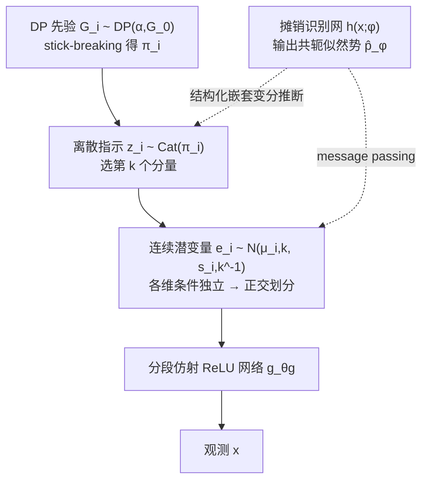

# A Bayesian Nonparametric Framework for Learning Disentangled Representations

**会议**: ICLR 2026  
**OpenReview**: [https://openreview.net/forum?id=GVOLiaENgU](https://openreview.net/forum?id=GVOLiaENgU)  
**代码**: 待确认  
**领域**: 表示学习 / 解耦表示 / 贝叶斯非参  
**关键词**: 解耦表示, 可识别性, 狄利克雷过程, 层次混合先验, 结构化变分推断, 摊销推断  

## 一句话总结
本文用一个**贝叶斯非参的层次混合先验**取代 VAE 里常见的各向同性高斯先验，在保留可证明可识别性的同时让每个生成因子的混合分量数随数据自适应增长，从而无需任何额外正则项就学到模块化、紧致的解耦表示。

## 研究背景与动机
- **领域现状**：无监督解耦表示学习要求从纯观测数据中唯一恢复真实的潜在结构，这本质上是个**可识别性（identifiability）**问题。理论上，简单各向同性高斯先验 + 非线性生成函数会导致无穷多个观测分布等价但因子纠缠的解，因此必须注入归纳偏置（inductive bias）。
- **现有痛点**：①主流方法（β-VAE、β-TCVAE 等）靠**启发式归纳偏置 + 强正则**强行解耦，缺乏可识别性的理论保证；②正则强度与潜在容量存在**内在权衡**——正则越强解耦越好，但表示容量被压缩，难以表达完整的变化模式；③以 QLAE/Tripod 为代表的量化类方法用**固定大小的码本**限定每个因子的离散模式数，因子真实模式数超过码本容量时只能被截断或拆散，损害可解释性。
- **核心矛盾**：**可识别性所需的结构约束**与**忠实表达全部变化模式所需的无限容量**难以兼得——加约束会限容量，放容量会破坏约束。
- **本文目标**：构建一个既**可证明可识别**、又**容量自适应无上界**、还**天然偏向解耦**的统一生成模型，去掉对辅助正则和精细调参的依赖。
- **核心 idea**：**[非参层次混合先验]** 基于 Kivva et al. (2022) 的混合先验可识别性定理，把每个因子的先验换成独立的**狄利克雷过程（DP）混合**——层次混合结构提供可识别性所需的离散索引约束，非参公式让每个因子的分量数随其内在复杂度无限增长，两者通过因子化的正交划分互不干扰。

## 方法详解

### 整体框架
模型（命名为 **Bayes-QLAE**）是一个层次潜变量生成模型：观测 $x$ 由连续潜变量 $e\in\mathbb{R}^d$ 经分段仿射 ReLU 网络 $g_{\theta_g}$ 生成；每一维 $e_i$ 由一个离散指示变量 $z_i$ 在该因子的混合分量中选择，而每个因子的混合分量数由独立的 DP 先验非参地决定。为在无限混合下做可行推断，作者设计了一套**结构化嵌套变分族**配合**摊销识别网络**，把全局变量（stick-breaking 比例 $\beta$、分量参数 $\theta$）与局部变量 $(e_i,z_i)$ 的层次依赖保留下来，再用贪心的分量扩张过程按需增容。

### 关键设计

**1. 因子化的层次混合先验，把可识别性"焊死"进结构：** 作者继承 Kivva et al. (2022) 的结论——当潜变量边缘服从高斯混合（GMM）且生成函数分段仿射并满足弱单射时，模型可识别到仿射变换；引入索引混合分量的离散变量并施加最大性条件（P3）后，可进一步识别到置换、缩放、平移，乃至潜维度与离散变量基数。在此之上，作者把多元离散变量**因子化**为统计独立的分量 $Z=Z_1\times\cdots\times Z_d$，每个 $z_i$ 索引一个因子的离散变化模式。这一因子化先验强制连续潜空间被划分为 $d$ 个**互不重叠的因子专属子空间**（$e_i\perp e_j\mid z$），使观测成为各因子混合分量的**组合式合成**，从而把"解耦"这一目标直接编码进生成结构而非靠事后正则。

**2. 狄利克雷过程让每个因子容量自适应增长：** 为破解固定码本基数的表达瓶颈，作者对每一维 $e_i$ 放一个独立的 DP 混合先验 $G_i\sim\mathrm{DP}(\alpha,G_0)$，用 stick-breaking 表示构造无限混合权重 $\pi_{i,k}=\beta_{i,k}\prod_{j<k}(1-\beta_{i,j})$，其中 $\beta_{i,k}\sim\mathrm{Beta}(1,\alpha)$。分量参数取高斯-Gamma 共轭先验 $G_0=\mathrm{NG}(m_0,\kappa_0,\nu_0,w_0)$ 以获得闭式后验更新；并对浓度 $\alpha$ 加 Gamma 先验来满足最大性条件，偏向**用最少的活跃分量**解释数据，从而在等价类中挑出唯一代表。由于 DP 对每一维独立施加，每个因子能在不破坏其余因子正交划分的前提下自由扩张自己的变化空间，对离散分布具备通用逼近能力。

**3. 结构化嵌套变分族 + 贪心增容，让无限混合可推断：** 传统 DPMM 变分推断靠**截断**（固定 $T$）+ **平均场**两个简化，但平均场切断了层次依赖、且不同截断级 $T$ 的变分族**互不嵌套**（$T$ 级不是 $T{+}1$ 级的子集），盲目增大 $T$ 既不一定改善逼近又会破坏稀疏归纳偏置。作者改用 Hoffman & Blei (2015) 的**结构化**变分族保留 $\beta_i$–$z_i$–$\theta_i$–$e_i$ 的条件依赖，并采用 Kurihara et al. (2006) 的**嵌套**变分族——只让前 $T$ 个分量有自由参数，其余分量参数**绑定到先验**：

$$q_{\nu_\beta}(\beta_i)=\prod_{k=1}^{T}q_{\nu_{\beta_{i,k}}}(\beta_{i,k})\prod_{k=T}^{\infty}p(\beta_{i,k}\mid\alpha)$$

这样既支持无限分量、又只需优化 $T$ 套参数。配合一个可解析计算的"分配给所有先验绑定分量"的总概率 $q(z_i>T\mid\beta_i)=(1-\sum_{k=1}^T\pi_{i,k})\cdot\exp\{\mathbb{E}_{p(\theta\mid\lambda)}\log\hat p_\phi(x_i\mid\theta)\}$ 作为停止判据，模型从 $T{=}1$ 起**贪心地**仅在能显著提升 ELBO 时才新增分量，无意义的分量则在训练中自动塌回先验。

**4. 共轭势摊销推断，兼顾灵活解码器与闭式更新：** 神经网络解码器 $p_{\theta_g}$ 非共轭，会让潜变量推断昂贵。作者沿用 Johnson et al. (2016) 的思路，让识别网络 $h(x;\phi)$ **不直接输出变分分布**，而是输出局部**共轭似然势** $\hat p_\phi(e_i\mid x)=\exp\{\langle h_i(x;\phi),t_e(e_i)\rangle\}$，作为难解似然项的数据相关代理，通过消息传递与结构化先验组合。识别网络的因子化结构镜像了因子化先验，使每维 $(e_i,z_i)$ 可独立推断，ELBO 分解为各维局部贡献 $L_i$ 之和；在共轭性下，局部最优 $q(e_i\mid z_i,\theta_i)$ 取指数族闭式解，其自然参数 $\eta_e=\sum_k \mathbb{1}[z_i{=}k]\,\eta_\theta(\theta_{i,k})+h_i(x_i;\phi)$ 显式融合了结构化先验与识别网络信号。

## 实验关键数据

### 主实验表格（3DShapes，InfoMEC + DCI，越高越好，5 次随机种子）

| 模型 | InfoM | InfoC | InfoE | D | C | I |
|------|-------|-------|-------|---|---|---|
| β-VAE | 0.62 | 0.44 | 0.93 | 0.58 | 0.42 | 0.97 |
| β-TCVAE | 0.65 | 0.56 | 0.91 | 0.56 | 0.46 | 0.95 |
| BioAE | 0.58 | 0.42 | 0.90 | 0.48 | 0.39 | 0.91 |
| QLAE | 0.84 | 0.49 | 0.97 | 0.79 | 0.56 | 0.97 |
| Tripod | 0.91 | 0.58 | 0.96 | 0.80 | 0.63 | 0.97 |
| **Bayes-QLAE** | **0.91** | **0.61** | 0.95 | **0.84** | **0.65** | 0.97 |

### MPI3D 数据集（因子变化呈幂律分布）

| 模型 | InfoM | InfoC | InfoE | D | C | I |
|------|-------|-------|-------|---|---|---|
| β-VAE | 0.41 | 0.40 | 0.68 | 0.24 | 0.19 | 0.80 |
| β-TCVAE | 0.48 | 0.46 | 0.62 | 0.27 | 0.24 | 0.79 |
| BioAE | 0.44 | 0.38 | 0.61 | 0.26 | 0.14 | 0.77 |
| QLAE | 0.52 | 0.43 | 0.68 | 0.38 | 0.34 | 0.81 |
| Tripod | 0.59 | 0.54 | 0.74 | 0.47 | 0.45 | 0.84 |
| **Bayes-QLAE** | **0.60** | **0.56** | 0.71 | **0.48** | **0.47** | 0.81 |

### 关键发现
- **紧致性（InfoC / C）提升最显著**：相比 QLAE，Bayes-QLAE 在 3DShapes 上 InfoC 0.49→0.61、C 0.56→0.65，印证非参先验能自适应因子复杂度而不牺牲模块化。
- **与 Tripod 持平甚至更优，但更省**：Tripod 靠 Normalized Hessian Penalty 取得高分，需对生成网络多次前向，且对量化级超参敏感；Bayes-QLAE 仅凭结构化归纳偏置、**自动从数据学量化级**，无需额外正则项与调参即达到相当性能。
- **分布形态影响增益**：3DShapes（近似均匀、少量变化）上提升更明显，MPI3D（幂律分布）上增益收窄；作者推测把 DP 换成能建模幂律的 **Pitman–Yor 过程**可进一步提升。

## 亮点与洞察
- **把"解耦"从损失项搬进先验结构**：用因子化层次混合先验直接承载可识别性约束，使统一的 ELBO 目标自带解耦偏置，摆脱了"正则强度 vs 容量"的老式权衡。
- **非参 = 容量自适应**：DP 的无限支撑让每个因子按需增长分量数，既不像固定码本那样截断高变化因子，又通过 Gamma-on-$\alpha$ 的最大性偏置保持稀疏，自动在可识别等价类中选唯一代表。
- **嵌套变分族的工程价值**：只优化前 $T$ 套参数却支持无限分量，配合可解析的"溢出概率"停止判据，把贪心增容做成了实用算法，无用分量自动塌回先验。
- **共轭势摊销**：在不改生成模型的前提下，让灵活神经解码器与共轭闭式局部更新共存，兼顾表达力与推断效率。

## 局限与展望
- **基准规模有限**：仅在 3DShapes、MPI3D 两个合成/半真实数据集上验证，未涉及自然图像或更高维、更复杂的真实场景，泛化性待考。
- **幂律因子上的短板**：DP 对幂律分布的聚类结构刻画不足，MPI3D 上增益明显收窄，作者自承需换 Pitman–Yor 等更灵活过程。
- **推断复杂度与超参**：虽免去正则调参，但引入了浓度 $\alpha$、基分布 $G_0$ 超参、贪心增容阈值与截断级 $T$ 等新的设计选择，Monte Carlo 梯度估计与步长选择的稳定性仍依赖经验设置。
- **可识别性的前提假设**：理论保证建立在分段仿射 + 弱单射等条件上，真实解码器是否严格满足、因子真实统计独立是否成立，在实践中难以完全验证。

## 相关工作与启发
- **可识别性理论**：直接建立在 Kivva et al. (2022) 的混合先验可识别性定理之上，把其层次离散结构具体化为因子化 DP 混合；与非线性 ICA（Hyvärinen、Khemakhem 等）一脉相承，但走"结构归纳偏置"而非"辅助变量/弱监督"路线。
- **量化类解耦**：QLAE / Tripod / FactorQLAE 用向量量化造网格状潜空间，本文指出其固定码本基数的瓶颈并用非参先验破解，可视为 QLAE 的贝叶斯非参化升级（故名 Bayes-QLAE）。
- **结构化/摊销变分推断**：融合 Hoffman & Blei (2015) 的结构化变分、Kurihara et al. (2006) 的嵌套变分族、Johnson et al. (2016) 的共轭势摊销（SVAE 思路），是把经典贝叶斯非参推断与深度生成模型缝合的一个范例。
- **启发**：对需要可解释、可控生成或因果/公平性分离的下游任务，"把结构约束写进先验、用非参换取容量"是一条值得借鉴的设计范式；把 DP 推广到 Pitman–Yor、层次 DP 或依赖型过程，可能进一步覆盖幂律或层次化的因子分布。

## 评分
- **新颖性**: ⭐⭐⭐⭐ 把可识别性定理、狄利克雷过程非参先验与结构化嵌套变分推断系统缝合进解耦学习，思路连贯且有理论支撑，是 QLAE 的实质性贝叶斯非参升级而非增量改动。
- **实验充分度**: ⭐⭐⭐ 在两个标准基准上对比 5 个强基线并给出消融，结论清晰；但数据集偏合成、规模有限，缺自然图像与更大规模验证。
- **写作质量**: ⭐⭐⭐⭐ 动机—理论—方法—推断的逻辑链条严谨，公式与假设交代到位；非参推断部分门槛较高，对非贝叶斯背景读者不够友好。
- **价值**: ⭐⭐⭐⭐ 给"无需辅助正则、自适应容量、可证明可识别"的解耦学习提供了一个有理论保证的统一框架，对可解释表示与可控生成方向有实际借鉴意义。

<!-- RELATED:START -->

## 相关论文

- [\[ICLR 2026\] Mechanistic Independence: A Principle for Identifiable Disentangled Representations](mechanistic_independence_a_principle_for_identifiable_disentangled_representatio.md)
- [\[ICLR 2026\] Disentangled representation learning through unsupervised symmetry group discovery](disentangled_representation_learning_through_unsupervised_symmetry_group_discove.md)
- [\[ICLR 2026\] Midway Network: Learning Representations for Recognition and Motion from Latent Dynamics](midway_network_learning_representations_for_recognition_and_motion_from_latent_d.md)
- [\[ICLR 2026\] GUIDE: Gated Uncertainty-Informed Disentangled Experts for Long-tailed Recognition](guide_gated_uncertainty-informed_disentangled_experts_for_long-tailed_recognitio.md)
- [\[ICLR 2026\] OrthoRF: Exploring Orthogonality in Object-Centric Representations](orthorf_exploring_orthogonality_in_object-centric_representations.md)

<!-- RELATED:END -->
