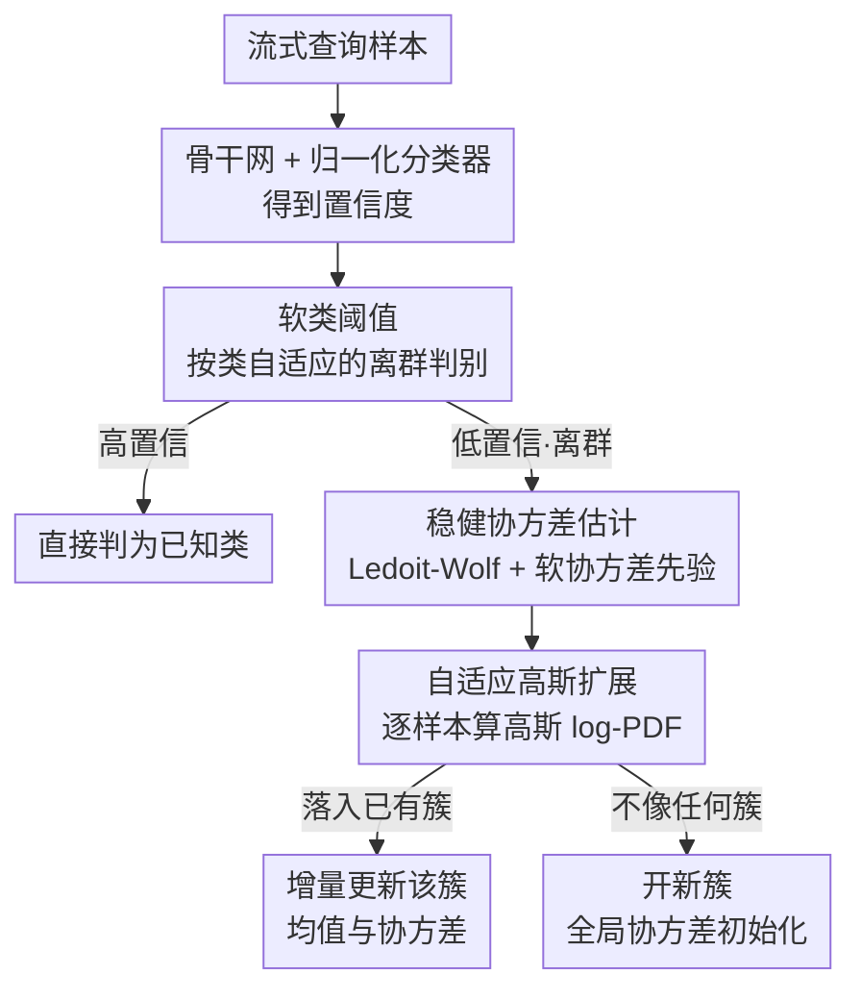

# Adaptive Gaussian Expansion for On-the-fly Category Discovery

**会议**: ICLR2026  
**OpenReview**: [https://openreview.net/forum?id=Y59JeAbM3j](https://openreview.net/forum?id=Y59JeAbM3j)  
**代码**: https://github.com/Ashengl/AGE  
**领域**: 自监督 / 表示学习  
**关键词**: 即时类别发现, 开放集识别, 高斯密度估计, 在线增量聚类, 协方差收缩

## 一句话总结
本文先证明了"即时类别发现"（OCD）任务存在一个被现有哈希方法忽视的性能下界，进而把 OCD 拆成"开放集识别 + 实时新类发现"两个子任务，用软阈值先把已知类直接判出，再用基于多元高斯密度的自适应高斯扩展（AGE）在线增量地聚出新类，在多个数据集上把整体准确率平均拉高约 10%。

## 研究背景与动机
**领域现状**：类别发现（Category Discovery）想让模型在标注数据之外自动发现新类，已有 NCD（新类发现）和 GCD（广义类别发现）两条线。但它们都依赖直推式（transductive）学习——测试集要整批拿到、甚至假设训练/测试类别有重叠，离"开放世界里来一个样本判一个"的理想场景还很远。于是更难的 On-the-fly Category Discovery（OCD）被提出：训练时只给部分带标签的支持集，测试时样本以**流式**到达、必须实时判类，且可能是训练时没见过的新类。

**现有痛点**：当前 OCD 方法（如 SMILE、PHE）几乎都走"哈希编码"路线——把特征拆成符号位（sign）和幅值（magnitude），用符号位当类别身份的代理。这条路有两个硬伤：一是哈希函数极其敏感，模型"认为的类别边界"常常和人的语义理解对不上，可能靠无关特征去切分新类；二是哈希编码对下游极不友好——哪怕是训练数据充足的成熟旧类，模型也得靠哈希去"猜"它最像哪个旧簇，而不是直接、准确地把它认成已知类。

**核心矛盾**：作者通过一个反直觉的实验把问题挑明了。OCD 用的是 Strict-Hungarian 匹配评测——它会在所有"预测簇↔真实类"的指派里取最优。在这个评测下，给定一个普通的闭集分类器、哪怕**完全不发现任何新类**，匈牙利匹配也能匹出一个相当高的分数（表 1 的 Close-set I）；若再假设新类存在并让匹配最大化，仅靠闭集分类器就能逼平 SOTA（Close-set II）。这说明：哈希类方法并没有真正"用好"标注数据里的信息，它们的成绩有相当一部分是评测下界本身贡献的。

**本文目标 / 切入角度**：既然存在这个下界、且哈希连旧类都认不准，那 OCD 的关键其实是"先把已知类干净利落地认出来，再专心去发现真正的新类"。作者据此把 OCD 重新拆成两个子问题：**开放集识别**（把已知类直接判出、剩下的当离群点）+ **实时新类发现**（只对离群点做在线聚类）。

**核心 idea**：借鉴 Dirichlet 过程高斯混合模型（DPGMM）里的中餐馆过程（CRP），提出 Adaptive Gaussian Expansion（AGE）——用每个类的多元高斯概率密度函数（PDF）建模其分布，流式地用马氏距离把新样本要么并入已有簇、要么开一个新簇，无需预先指定类别数。

## 方法详解

### 整体框架
AGE 的输入是流式到达的查询样本，输出是每个样本的类别判定（已知类的具体编号 / 某个被在线发现的新类）。整条流水线分两段：**先做开放集判别**——样本经骨干网编码后过归一化分类器得到置信度，用一个按类自适应的软阈值判断它是"高置信已知类"还是"低置信离群点"；高置信的直接给出已知类标签，低置信的才进入 AGE。**再做新类发现**——AGE 用 Ledoit-Wolf 收缩 + 软协方差先估出稳健的类协方差，对每个离群特征算它在所有已知/已发现簇下的高斯 log-PDF，若最大后验落在某个已有簇内就增量更新该簇的均值与协方差，否则把它当作一个新簇的种子、用全局协方差初始化。这套"贪心、基于后验"的指派规则让模型在流式推理中自适应地长出新簇。

### 关键设计

**1. OCD 性能下界与任务重构：先认旧类再发现新类**

这是全文的立论起点。作者指出 Strict-Hungarian 评测会取"预测↔真值"的最优匹配，这意味着一个只会闭集分类、压根不发现新类的模型也能匹出可观的分数（表 1 的 Close-set I/II 甚至逼平 SOTA），因此他们把这个分数**正式定义为 OCD 的性能下界**。这个观察直接否定了"哈希编码是好方案"的前提——哈希连旧类都认不准，自然不是稳健的实时新类检测器。基于此，作者把 OCD 重构为两个解耦的子任务：开放集识别（直接、显式地认出已知类）+ 实时新类识别（只对剩下的离群样本做发现）。这一步把"用哈希一锅烩"换成"已知/未知分而治之"，是后面所有设计的地基。

**2. 软类阈值：按类自适应地把已知类从离群点里切出来**

如果对所有类用一个全局置信度阈值，低置信的小类会被整体淹没；但若每类各算各的阈值，验证集一小就会噪声爆炸。作者折中提出软阈值：对验证集 $D_V$ 里每个样本定义置信度 $\gamma_i=\max(\mathrm{Softmax}(p_i))$，对类 $k$ 算其置信度的均值 $\mu_k$ 与标准差 $\sigma_k$（标准差额外乘了 0.8 做收紧），最终阈值把"类内"和"全局"两项按比例融合：

$$\tau_c = \beta\,(\mu_c-\sigma_c) + (1-\beta)\,\frac{1}{|Y_S|}\sum_{k\in Y_S}(\mu_k-\sigma_k).$$

其中 $\beta$ 是类内阈值与全局阈值的融合比（实验取 0.5）。推理时把 $\tau_c$ 用到查询集每个样本上：置信度高于阈值就判为已知类，否则抽出其 $\ell_2$ 归一化特征送进 AGE。相比依赖 OSCR/H-score 还要手动调阈值的传统 OOD 方法，这套阈值是从类内统计量直接算出来的，缓解了类不平衡和类间协方差带来的扭曲，让已知类判别和离群检测同时变稳。

**3. 稳健协方差估计：Ledoit-Wolf 收缩 + 软协方差先验，撑住小样本下的高斯密度**

AGE 的核心是给每个类拟一个多元高斯并算 PDF，但流式推理早期每类样本极少，经验协方差矩阵会非常不稳、甚至奇异，直接拖垮 PDF 计算。作者叠了三重稳健化：① **Ledoit-Wolf 收缩**——把经验协方差 $S$ 朝一个稳定目标 $F=\frac{1}{d}\mathrm{tr}(S)I$ 收缩，$\hat\Sigma_{LW}=(1-\lambda^\*)S+\lambda^\* F$，收缩系数 $\lambda^\*$ 由无偏估计自动定，高维少样本下更稳；② **软协方差先验**——把类协方差和全局协方差 $\Sigma_{all}$ 按样本量加权融合：$\Sigma_k=(1-\alpha_k)\Sigma^k_{LW}+\alpha_k\Sigma_{all}+\varepsilon I$，其中 $\alpha_k=\frac{s}{N_k+s}$ 是软先验权重——样本越少越偏向全局先验、越多越信自己，避免小类协方差被带偏；③ **数值稳定项 $\varepsilon I$**——压住矩阵奇异，但 $\varepsilon$ 太大会让协方差退化成单位阵、模型沦为欧氏距离（消融里 $\varepsilon=10^{-2}$ 时几乎退化成 SLC）。此外还用一个固定大小的滑动窗口（FIFO）存样本，防止显存随样本数线性膨胀。

**4. 自适应高斯扩展：基于后验 PDF 的贪心在线增量聚类**

有了稳健的类高斯，AGE 就能流式地"扩张"类别集合。对每个被判为离群的特征 $f_{od}$，先用全局协方差 $\Sigma_{all}$ 给它初始化，再算它在所有已知/已发现类高斯下的密度——高维下 PDF 值会极小导致下溢，所以用 log 形式：

$$\log p_k = -\tfrac{1}{2}\big(d\log(2\pi)+\log|\Sigma_k|+(f_{od}-\mu_k)^\top\Sigma_k^{-1}(f_{od}-\mu_k)\big).$$

若最大后验落进某个已有簇，就按 Dirichlet 过程的浓度参数增量更新该簇的均值与协方差；若它对谁都不够像，就把它当成新类种子、用全局背景协方差初始化一个新簇。这套贪心、逐样本做局部最优决策的规则，呼应了中餐馆过程"要么坐已有桌、要么开新桌"的直觉，无需预设类别数。作者还给了理论支撑：Lemma 1 证明白化后，语义相关的未见类 C 在几何上离训练类 A 比离无关类 B 更近；Proposition 1 进一步说明用训练类 A 的高斯当"非 B"的背景模型时，C 的样本更可能被正确判成"非 B"——这为"用已知类分布当未知类的背景先验"提供了依据。最后用 PCA 把特征降到 42 维再算 PDF，避免高维下协方差估计失稳（维度超 128 时 PDF 计算会数值崩溃）。

### 损失函数 / 训练策略
训练只用支持集 $D_S$，且和哈希方法不同——不做符号/幅值解耦，直接在特征空间做判别。损失是有监督对比损失 $L_{sup}$（拉近同类投影 $z_i=H(E(x_i))$、推开异类）与标准交叉熵 $L_{cls}$ 之和：$L=L_{cls}+L_{sup}$。骨干为 DINO 自监督预训练的 ViT-B/16，batch 128、学习率 0.005、训练 100 epoch；从训练集留 20% 作验证集来估软阈值，PCA 降到 42 维，滑窗大小 20，软先验 $s=2$，融合比 $\beta=0.5$。

## 实验关键数据

### 主实验
在 5 个标准数据集上对比 SOTA（指标为 Strict-Hungarian ACC，All/Old/New）：

| 数据集 | 指标 | AGE(本文) | PHE | DiffGRE | 说明 |
|--------|------|-----------|-----|---------|------|
| CIFAR-100 | All | 60.8 | 55.9 | - | 粗粒度 |
| ImageNet-100 | All | 48.2 | 34.1 | - | 粗粒度，提升最猛 |
| ImageNet-100 | New | 28.6 | 10.8 | - | 新类准确率近 3 倍 |
| CUB-200 | All | 46.3 | 36.4 | 42.5 | 细粒度 |
| Scars | All | 34.8 | 31.3 | 27.7 | 细粒度 |
| Herbarium19 | All | 30.9 | 22.5 | - | 细粒度长尾 |

在 CIFAR-100/ImageNet-100 两个粗粒度集上整体准确率较 PHE 平均高 9.5%；在 CUB-200/Scars/Herbarium19/Pets 等细粒度集上较 PHE 平均高 8.8%；六个数据集上**新类**准确率平均提升 16.7%，说明增益主要来自更强的新类发现能力。在更难的 iNaturalist（Fungi/Arachnida/Animalia/Mollusca）上较 PHE 平均再高 5.3%（Fungi 上 +8.6%）。

### 消融实验
组件消融（表 4，OSR=开放集识别 / PDF=高斯密度 / LW=Ledoit-Wolf / SC=软协方差）：

| 配置 | CUB-200 All | ImageNet-100 All | 说明 |
|------|-------------|------------------|------|
| Full (OSR+PDF+LW+SC) | 46.3 | 48.2 | 完整模型 |
| w/o SC（软协方差） | 27.0 | 35.8 | 掉最狠，早期协方差不稳 |
| w/o LW（Ledoit-Wolf） | 45.0 | 47.8 | 略掉，新类发现变弱 |
| w/o OSR（开放集识别） | 38.8 | 20.9 | ImageNet 上崩到 20.9 |

数值稳定项 $\varepsilon$（表 6）：$10^{-5}$ 最优；$\varepsilon=10^{-2}$ 时协方差过度对角化、退化成 SLC，CUB-200 从 46.3 掉到 30.9。降维方法（表 5）PCA 总体最稳，RP 在粗粒度 ImageNet 上反而更好（保全局结构），但在细粒度 CUB-200 上会破坏局部细节。

### 关键发现
- **软协方差（SC）贡献最大**：去掉后 CUB-200 从 46.3 掉到 27.0、ImageNet-100 从 48.2 掉到 35.8——流式早期每类样本太少，协方差不稳会直接拖垮 PDF，软先验把它朝全局协方差拉稳是关键。
- **OSR 去不得**：去掉开放集识别后已知类被整体当背景，ImageNet-100 直接崩到 20.9（Old 仅 0.1），印证"把已知类当背景先验来辅助发现新类"这条主线成立。
- **维度与粒度耦合**：维度升高时 ImageNet-100 稳步变好，CUB-200 却先升后降——细粒度数据高维下噪声/过拟合更严重；维度超 128 时 PDF 计算数值崩溃，故全程靠 PCA 降到 42 维。
- **超参 $s=2$ 最优**，控制软协方差先验的相对重要性。

## 亮点与洞察
- **用"性能下界"反向证伪主流路线**：通过 Strict-Hungarian 评测下闭集分类器就能逼平 SOTA 这一反直觉事实，干净利落地说明哈希方法的成绩有水分，立论犀利、有说服力——这是比单纯刷点更有价值的贡献。
- **把生成式概率建模请回 OCD**：相比只看 logit（仅反映样本离已知类的相对远近）的判别式做法，多元高斯 PDF 显式估计每类均值与协方差，能算样本的生成似然，对类内分布刻画更准、不确定性估计更好。
- **三重协方差稳健化是落地关键**：Ledoit-Wolf 收缩 + 软先验 + $\varepsilon$ 正则的组合，解决了"小样本流式场景下高斯密度估计天然不稳"这个最硬的工程障碍，可迁移到任何需要在线估协方差/做密度判别的场景（如在线异常检测）。
- **CRP/DPGMM 思想的工程化**："要么坐已有桌、要么开新桌"被实现成基于 log-PDF 的贪心增量聚类，自然支持无预设类别数的流式扩张。

## 局限与展望
- **依赖一个干净的开放集判别前提**：作者自己点明"理想情况下应能把所有已知类和离群点完全分开"是后续发现有效性的关键假设——若 OSR 这一步漏判，错误会直接传导给 AGE。
- **细粒度 + 高维仍是软肋**：PDF 在维度超 128 时数值崩溃，只能靠 PCA 压到 42 维，这对需要高维细粒度判别的任务是天花板；细粒度数据在高维下还会过拟合。
- **贪心 + 滑窗带来的近似**：逐样本局部最优决策不回溯，早期的错误指派无法纠正；FIFO 滑窗丢弃早期样本虽省显存，但也丢掉了长期分布信息。
- **理论假设偏强**：Lemma 1/Proposition 1 建立在"各类共享协方差 + 白化"等假设上，实际特征未必满足，理论只是给"已知类当背景先验"提供直觉支撑。

## 相关工作与启发
- **vs SMILE / PHE（哈希类 OCD）**: 它们把特征拆符号位当哈希码做类别代理，本文直接在特征空间做判别、不做解耦投影头；本文论证了哈希连旧类都认不准、是 OCD 下界附近的弱方法，AGE 用高斯 PDF 显式建模分布，新类准确率平均高 16.7%。
- **vs DiffGRE**: 它借助多模态和生成式大模型发现新类，AGE 只用 DINO ViT + 统计建模就逼近甚至持平其性能，更轻量、更可部署。
- **vs SLC（增量聚类）**: SLC 纯靠距离阈值决定并簇/开簇，AGE 在 $\varepsilon$ 过大时会退化成 SLC；区别在 AGE 用稳健协方差下的高斯 PDF 而非裸距离，捕捉了类内分布结构。
- **vs 传统 OSR/OOD**: MSP、Energy 等需依赖 OSCR/H-score 手调阈值，本文软类阈值从类内统计量自动算出，并把 OSR 当作 OCD 的第一阶段显式集成。

## 评分
- 新颖性: ⭐⭐⭐⭐⭐ 用性能下界证伪主流哈希路线 + 把 OCD 重构为 OSR+新类发现，立论与方法都新
- 实验充分度: ⭐⭐⭐⭐⭐ 覆盖粗/细粒度 + iNaturalist 大规模，组件/降维/$\varepsilon$/维度/超参消融齐全
- 写作质量: ⭐⭐⭐⭐ 逻辑清晰、理论与工程兼顾，公式较密但讲清了动机
- 价值: ⭐⭐⭐⭐⭐ 整体准确率平均 +10%、新类 +16.7%，且更易部署到下游，实用价值高

<!-- RELATED:START -->

## 相关论文

- [\[CVPR 2026\] Assignment-Driven Hash Learning in a Hyper-Semantic Space for On-the-Fly Category Discovery](../../CVPR2026/self_supervised/assignment-driven_hash_learning_in_a_hyper-semantic_space_for_on-the-fly_categor.md)
- [\[ICCV 2025\] Generate, Refine, and Encode: Leveraging Synthesized Novel Samples for On-the-Fly Fine-Grained Category Discovery](../../ICCV2025/self_supervised/generate_refine_and_encode_leveraging_synthesized_novel_samples_for_on-the-fly_f.md)
- [\[ECCV 2024\] PromptCCD: Learning Gaussian Mixture Prompt Pool for Continual Category Discovery](../../ECCV2024/self_supervised/promptccd_learning_gaussian_mixture_prompt_pool_for_continual_category_discovery.md)
- [\[CVPR 2026\] Decouple Your Discovery and Memory in Continual Generalized Category Discovery](../../CVPR2026/self_supervised/decouple_your_discovery_and_memory_in_continual_generalized_category_discovery.md)
- [\[ICLR 2026\] PRISM: Progressive Robust Learning for Open-World Continual Category Discovery](prism_progressive_robust_learning_for_open-world_continual_category_discovery.md)

<!-- RELATED:END -->
