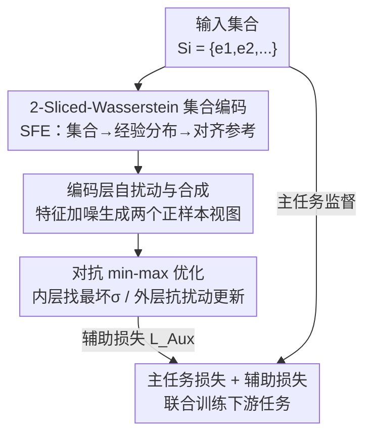

# Adversarial Encoding Perturbation and Synthesis for Set Representation Auxiliary Learning

**会议**: ICLR 2026  
**OpenReview**: [https://openreview.net/forum?id=13r06yROEZ](https://openreview.net/forum?id=13r06yROEZ)  
**代码**: 待确认  
**领域**: 自监督 / 表示学习（集合表示学习）  
**关键词**: 集合表示, 最优传输, Sliced-Wasserstein, 对抗扰动, 自监督辅助学习

## 一句话总结
SRAL 把每个集合看成一个经验分布，用 2-Sliced-Wasserstein 距离编码出能感知"集合间差异"的表示，再在**特征/编码层而非输入层**注入对抗扰动、用 min-max 优化逼模型抵抗最坏扰动，作为一个可插到各种下游任务的自监督辅助目标；理论上证明该目标在期望意义下等价于优化集合间的 Sliced-Wasserstein 距离，在集合相似度排序、捆绑推荐、点云分类、主题集扩展四类任务上稳定超过现有集合编码器。

## 研究背景与动机
**领域现状**：集合（set）是无序、变长的基础数据结构——社交群组、商品捆绑、点云、文档关键词集都是集合。集合表示学习的目标是把任意集合 $S_i$ 映射成定长向量 $v_i$，供检索/分类等下游使用。主流深度方法（DeepSet、Set Transformer/SAtt、RepSet、以及基于最优传输的 PoT/OTKE/PSWE/FSW）都在精心保证**集合内（intra-set）性质**：排列不变性、基数无关性，即"打乱元素顺序、增删几个元素"表示不能乱跳。

**现有痛点**：这些方法几乎只盯着集合内属性，对**集合间（inter-set）相关性**——两个集合到底有多像、差在哪——缺乏显式建模。可很多任务的本质恰恰是集合对集合的细粒度比较：集合相似度检索要找 query 集合的最近邻；捆绑推荐里"露营套装"和"野炊套装"因为有重叠商品而吸引相似人群。只把每个集合各自编码好，集合间的相对关系并不会自动浮现。

**核心矛盾**：集合内不变性约束的是"单个集合内部怎么聚合"，而集合间相关性约束的是"不同集合在嵌入空间里怎么排布"，后者无法从前者免费继承，于是表示能力出现缺口。

**本文目标**：设计一个**与下游任务无关、可即插即用**的辅助学习目标，让编码器在完成主任务的同时，额外学到能反映集合间分布差异的判别性表示。

**切入角度**：把集合视作高维经验分布，那么"集合间差异"天然可以用分布距离来量化——最优传输（OT）下的 Wasserstein 距离正合适；而要让表示真正"判别"，不能只靠随机扰动，得逼它扛住**最坏情况**的扰动。

**核心 idea**：用 2-Sliced-Wasserstein 距离把集合编码成分布感知的表示（SFE 模块），再在**编码特征层注入对抗扰动**、用 min-max 优化训练表示对最坏扰动鲁棒；并从理论上证明这个对抗自监督目标在期望上就是在优化集合间的 Sliced-Wasserstein 距离。

## 方法详解

### 整体框架
SRAL（Set Representation Auxiliary Learning）不是一个独立模型，而是一个**辅助学习框架**：总损失把场景特定的主任务损失 $L_{\text{Main}}$ 和辅助损失 $L_{\text{Aux}}$ 加权相加，再带个 L2 正则：

$$L = L_{\text{Main}} + \lambda_1 L_{\text{Aux}} + \lambda_2 \|\Xi\|_2^2$$

其中 $\Xi$ 是所有可训练参数。整条流水线是这样转的：输入集合先经 **SFE 编码器**——把集合当经验分布、用 Sliced-Wasserstein 把它和一个可学习参考分布对齐、编出分布感知的集合嵌入 $v_i$；然后对集合特征做**自扰动**得到两个正样本视图、用 InfoNCE 拉近同集合视图/推远异集合（理论上等价于对齐分布距离）；再把它升级成**对抗 min-max**：先沿梯度找一个共享的最坏扰动增量 $\sigma$（内层最大化），再让模型抵抗它更新参数（外层最小化）。最坏扰动下的辅助损失和主任务损失一起反传，逼编码器学出高判别表示。

### 关键设计

**1. 2-Sliced-Wasserstein 集合特征编码器（SFE）：把"集合像不像"变成可微的分布距离**

针对"现有编码器抓不住集合间相关性"这一痛点，SFE 把每个集合 $S_i$ 看成由元素特征 $V_i = [z_{i,k}]_{k=1}^{|S_i|}$ 定义的经验分布 $P_i$，并引入一个**可学习参考分布** $O$（由 $H$ 个可训练嵌入 $V_O=[z_h]_{h=1}^H$ 刻画，相当于嵌入空间里一个可学习的"原点"），用集合到参考的分布距离来编码集合。直接算高维 Wasserstein 不可行，于是用 2-Sliced-Wasserstein：把高维分布沿随机单位向量 $w\in\mathbb{S}^{d-1}$ 投影 $\theta(x)=w^\top x$ 切成一维，一维下最优传输有闭式解 $g^+(x^\theta\mid V_i^\theta)=F^{-1}_{P_i^\theta}\!\big(F_{O^\theta}(x^\theta)\big)$。

直观上这是一个**秩匹配**过程：$F_{O^\theta}(x^\theta)$ 算出 $x^\theta$ 在参考切片里的秩百分位，$F^{-1}_{P_i^\theta}$ 再到集合切片里找同秩百分位的值，即
$$g^+(x^\theta\mid V_i^\theta)=\arg\min_{x'\in V_i^\theta}\Big\{\tau(x'\mid V_i^\theta)\ge \tfrac{|S_i|}{H}\cdot \tau(x^\theta\mid V_O^\theta)\Big\}$$
其中 $\tau(\cdot)$ 是排序秩，可用 argsort/sort 预处理。为绕开理论上需要无穷次投影，用 $R$ 次蒙特卡洛随机投影近似，把所有投影、所有参考点的传输结果沿最内维拼接成集合嵌入 $\mathrm{SFE}(V_i,V_O\mid\Theta)=\mathrm{Concat}_{r,h}\big[g^+(w_r^\top z_h\mid V_i^{\theta_r})\big]$。当集合基数 $|S_i|\neq H$ 时用线性插值补齐（消融里 "w/o LI" 用两层 MLP 替代会明显掉点，说明线性插值的维度补全更可靠）。这样编出的 $v_i$ 天然带着集合间分布差异信息，而不只是元素特征的池化平均。

**2. 编码层自扰动与合成：在特征级而非输入级造正样本**

针对"集合数据增强难做、输入级增删元素太粗糙"的痛点，SRAL 把扰动从输入数据搬到**特征/编码层**。对集合特征 $V_i=[z_{i,k}]$，给每个元素嵌入加一个范数受 $\pi$ 约束的小随机噪声 $z'_{i,k}=z_{i,k}+\epsilon'_{i,k},\ \|\epsilon\|_2\le\pi$，喂进 SFE 得到扰动嵌入 $v'_i=\mathrm{SFE}(V'_i,V_O\mid\Theta)$；造两个这样的视图 $v'_i, v''_i$ 当正样本对，用 InfoNCE 拉近同集合、推远异集合：
$$L_{wd}=\sum_{S_i}-\log\frac{\exp(-\|v'_i-v''_i\|_2/\psi)}{\sum_{S_j}\exp(-\|v'_i-v''_j\|_2/\psi)}$$

关键在于作者用 **Remark 1** 回答了"在扰动嵌入上做对比，会不会破坏 SFE 的 Sliced-Wasserstein 本性"：他们证明扰动嵌入的欧氏距离在**期望意义下与底层扰动分布间的 2-Sliced-Wasserstein 距离正相关**，即
$$\mathbb{E}\!\left[\frac{\exp(-\|v'_i-v''_i\|_2/\psi)}{\sum_{S_j}\exp(-\|v'_i-v''_j\|_2/\psi)}\right]=\frac{\exp(-\|SD_2(P'_i,P''_i)\|_2/\psi)}{\sum_{S_j}\exp(-\|SD_2(P'_i,P''_j)\|_2/\psi)}$$
所以在嵌入空间最小化 $L_{wd}$ 等于隐式地对齐集合间的分布距离——对比学习和分布度量在这里被打通，自监督不再是"瞎拉远拉近"，而是有 OT 几何含义的。比起输入级增删元素（DRA/EP）或子集采样（SS），特征级扰动给出更细粒度、更有效的增强（实验里也比直接对最终嵌入加噪 DIJ 更好）。

**3. 对抗 min-max 优化与一阶近似：逼表示扛住"最坏"扰动**

针对"只抗随机噪声还不够判别"的痛点，SRAL 不满足于随机扰动，而是**主动找最坏情况扰动**。它在前面两个视图的特征上再加一个**共享对抗增量** $\sigma$，目标是让 $\sigma$ 最大化对比损失、而模型参数最小化这个最坏损失，构成
$$\min_{\Xi}\max_{\|\sigma\|_2\le\pi}L_{wd}(\{v_i^\sigma\}),\quad v_i^\sigma=\mathrm{SFE}(V'_i+\sigma,V_O\mid\Theta)$$
精确求解不可行，于是对 $L_{wd}$ 在 $\sigma=0$ 处做一阶泰勒展开，最大化线性近似在范数约束下有闭式解——扰动方向就是梯度方向。由此分解成两步交替：**内层最大化**固定参数、算梯度 $g_\sigma=\nabla_\epsilon L_{wd}|_{\epsilon=0}$，沿梯度上升一步 $\hat\sigma=\eta\cdot g_\sigma$ 再投影回 $\ell_2$ 球 $\sigma=\hat\sigma\cdot\min(1,\pi/\|\hat\sigma\|_2)$；**外层最小化**把 $\sigma$ 施加进 SFE 算对抗损失，连同主任务损失一起对参数做梯度下降 $\Xi\leftarrow\Xi-\beta\nabla_\Xi(L_{\text{Main}}+\lambda_1 L_{adv}+\lambda_2\|\Xi\|_2^2)$。

作者用 **Remark 2** 给出几何解释：这个 min-max 目标近似等价于对 SFE 局部 **Lipschitz 连续性**的隐式正则，从而稳定表示。和传统"在输入数据上做对抗/增强"的路线相比，SRAL 对抗的是**编码过程本身**——这正是它的差异点，消融里去掉对抗优化（"w/o AEPO"，只留 InfoNCE 不做 min-max）在 Task 4 上 AUC 暴跌 24.70%，说明"找最坏扰动"这一步而非单纯对比才是判别力的关键来源。

### 损失函数 / 训练策略
总目标 $L=L_{\text{Main}}+\lambda_1 L_{\text{Aux}}+\lambda_2\|\Xi\|_2^2$，其中 $L_{\text{Aux}}=\max_{\|\sigma\|_2\le\pi}L_{wd}(\Xi,\sigma)$ 由上述内/外层交替优化求解。框架对 SSL 损失本身不挑——把 InfoNCE 换成 Set Triplet、Soft-Nearest-Neighbors、Barlow Twins 都能取得有竞争力的效果。最终超参选 $H=32,\ R=128$，在性能与算力间折中；数据按 8:2 划分训练/测试，训练集再 8:2 划出验证集，所有结果取 5 次独立运行均值。

## 实验关键数据

### 主实验
四类下游任务，覆盖"集合间关系敏感"（任务 1/2）与"集合内信息处理"（任务 3/4）。

| 任务 | 数据集 | 指标 | SRAL | 次优基线 | 提升 |
|------|--------|------|------|----------|------|
| Task 1 集合相似度排序 | Friendster | R@20 | 91.57 | 83.58 (FSW) | +9.56%* |
| Task 1 集合相似度排序 | LIVEJ | R@20 | 87.56 | 85.36 (FSPool) | +2.58%* |
| Task 2 捆绑推荐 | Youshu | R@20 | 26.92 | 26.41 (CrossCBR) | +1.93%* |
| Task 2 捆绑推荐 | NetEase | R@20 | 7.37 | 7.21 (CrossCBR) | +2.22%* |
| Task 3 点云分类 | ModelNet40 (ISAB) | ACC | 87.31 | 86.93 (FSW) | +0.44%* |
| Task 4 主题集扩展 | LDA-3k | AUC | 87.93 | 79.67 (FSW) | +10.37%* |

（*为 Wilcoxon 符号秩检验 95% 置信下显著）。集合间关系敏感的检索类任务（Task 1、Task 4）提升幅度最大，6%~10%；推荐任务 Task 2 把 SRAL 插进 CrossCBR 作为 SRAL+，提升较小但全指标显著。

### 消融实验
（Friendster/Youshu/LDA-3k，括号内为相对完整模型的跌幅）

| 配置 | Task1 R@20 | Task4 AUC | 说明 |
|------|-----------|-----------|------|
| Full SRAL | 91.57 | 87.93 | 完整模型 |
| w/o SFE | 67.02 (-26.81%) | 73.39 (-16.54%) | SFE 换均值池化，崩得最狠 |
| w/o LI | 75.45 (-17.60%) | 72.44 (-17.62%) | 线性插值换两层 MLP |
| w/o AEPO | 77.13 (-15.77%) | 66.21 (-24.70%) | 留 InfoNCE 去掉 min-max 对抗 |
| w/o AL | 87.38 (-4.58%) | 83.53 (-5.00%) | 去掉整个辅助学习 |

### 关键发现
- **SFE 是地基**：去掉 SFE 改均值池化，即便还留着对抗辅助学习，Task 1 也掉 26.81%——分布感知编码是表示能力的根。
- **对抗那一步比对比本身更关键**：w/o AEPO（保留对比、只去掉找最坏扰动）在 Task 4 上 AUC 掉 24.70%，比直接去掉整个辅助学习（w/o AL，-5.00%）还狠，说明"min-max 找最坏扰动"才是判别力来源。
- **$R$ 比 $H$ 敏感得多**：固定 $H=32$，把蒙特卡洛投影数 $R$ 从 4 增到 32，Recall@20 从 41.23% 飙到 91.57%（更准的 CDF 近似）；$R>32$ 后边际收益递减，故选 $R=128$。改变 $H$ 影响小。
- **收敛更快更深**：尽管带对抗复杂度更高，SRAL 比去掉对抗的版本收敛更快、验证性能更早达到最优且更稳，缓解了算力开销的顾虑。
- **捆绑推荐里辅助信号是"补充"**：Task 2 的 w/o AL 甚至略微反超，作者归因于 CrossCBR 骨干本身已极强地建模了用户-捆绑协同信号，SRAL+ 提供的是互补的捆绑内部结构信号。

## 亮点与洞察
- **把"对比学习"和"最优传输"在理论上焊死**：Remark 1 证明扰动嵌入的欧氏对比损失在期望上等价于优化集合间 Sliced-Wasserstein 距离——这让自监督正负样本不再是经验性拉远拉近，而有明确的分布几何含义，是很漂亮的"为什么有效"。
- **对抗扰动搬到编码层而非输入层**：集合数据天然难增强（增删元素太粗、改变语义），SRAL 在特征/编码过程注入扰动，既细粒度又避开了输入级增强的尴尬；这个"扰动中间编码而非输入/最终嵌入"的思路可迁移到其他难增强的结构化数据（图、序列集合）。
- **即插即用的辅助目标**：SRAL 不绑定特定下游模型（能插进 CrossCBR 当 SRAL+），且对 SSL 损失函数不敏感（InfoNCE/Triplet/Barlow Twins 都行），工程上很好用。
- **可学习参考分布 $O$ 当"嵌入原点"**：用一组可训练嵌入做共享参考、所有集合都对齐到它，把"集合间比较"巧妙转成"各自到参考的距离"，避免两两算 OT 的开销。

## 局限与展望
- **算力偏高**：SFE 基于 Sliced-Wasserstein，每 epoch 训练时间比 KL/JS 这类简单度量高（作者自承认是"可接受的折中"，并用收敛更快来对冲）。
- **推荐场景增益有限**：在 Task 2 上 SRAL+ 提升小、甚至 w/o AL 反超，说明当骨干已强力建模协同信号时，集合语义这条辅助信号边际价值下降；作者指出更优做法是把捆绑语义和协同模式**联合优化**，而非简单叠加辅助损失。
- **一阶近似的紧致性**：对抗扰动用单步梯度上升 + 一阶泰勒近似求解 min-max，没讨论多步 PGD 是否能进一步提升或近似误差有多大。
- **理论建立在期望意义上**：Remark 1/2 是期望/近似等价，实际有限投影数 $R$、有限样本下的偏差未量化（$R$ 极度敏感的实验侧面印证了近似质量的重要性）。

## 相关工作与启发
- **vs DeepSet / Set Transformer(SAtt) / RepSet**：它们做集合内不变聚合，SRAL 在此之外显式建模集合间分布相关性，区别在于把集合看成分布并用 OT 距离编码，且加了对抗自监督辅助。
- **vs OT 系集合编码（PoT / OTKE / PSWE / FSW）**：同样用最优传输/Sliced-Wasserstein 思想，但 SRAL 的差异是**对抗扰动编码过程 + min-max 优化**这一辅助学习机制，而不只是换个距离度量；实验里 SRAL 稳定超过 PSWE/FSW。
- **vs 传统对抗训练 / 数据增强**：常规做法在输入数据上加对抗扰动或增删元素，SRAL 把对抗搬到特征/编码层，并用 Lipschitz 正则视角（Remark 2）解释其稳定性。
- **vs 推荐专用模型 CrossCBR**：SRAL 不替代它，而是插进去当捆绑嵌入增强模块（SRAL+），提供互补的捆绑内部结构语义。

## 评分
- 新颖性: ⭐⭐⭐⭐ 把对抗扰动搬到编码层、并用理论把对比损失和 Sliced-Wasserstein 距离打通，角度新颖
- 实验充分度: ⭐⭐⭐⭐ 四类任务八数据集 + 完整消融 + R/H 敏感性 + 收敛分析，覆盖到位
- 写作质量: ⭐⭐⭐⭐ 动机清晰、两个 Remark 给足"为什么有效"，但部分推导压到附录
- 价值: ⭐⭐⭐⭐ 即插即用、跨任务通用的集合表示辅助框架，对结构化数据增强有借鉴意义

<!-- RELATED:START -->

## 相关论文

- [\[CVPR 2026\] PAF: Perturbation-Aware Filtering for Open-Set Semi-Supervised Learning](../../CVPR2026/self_supervised/paf_perturbation-aware_filtering_for_open-set_semi-supervised_learning.md)
- [\[ICLR 2026\] Boosting Open Set Recognition Performance through Modulated Representation Learning](boosting_open_set_recognition_performance_through_modulated_representation_learn.md)
- [\[ICLR 2026\] FedOpenMatch: Towards Semi-Supervised Federated Learning in Open-Set Environments](fedopenmatch_towards_semi-supervised_federated_learning_in_open-set_environments.md)
- [\[ICLR 2026\] Spatially Informed Autoencoders for Interpretable Visual Representation Learning](spatially_informed_autoencoders_for_interpretable_visual_representation_learning.md)
- [\[ICLR 2026\] Unsupervised Representation Learning - An Invariant Risk Minimization Perspective](unsupervised_representation_learning_-_an_invariant_risk_minimization_perspectiv.md)

<!-- RELATED:END -->
