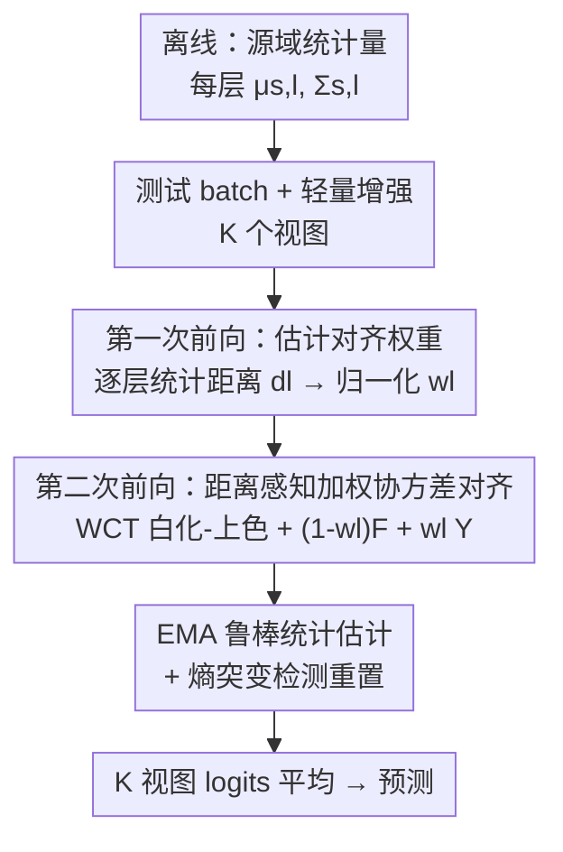

# Architecture-Agnostic Test-Time Adaptation via Backprop-Free Embedding Alignment

**会议**: ICLR2026  
**OpenReview**: [https://openreview.net/forum?id=7kLNGaAHaw](https://openreview.net/forum?id=7kLNGaAHaw)  
**代码**: https://github.com/TheMaXiao/PEA_TTA  
**领域**: 测试时适应 / 域偏移 / 高效推理  
**关键词**: 测试时适应, 无反向传播, 协方差对齐, 域偏移, 边缘设备

## 一句话总结
PEA 把"域偏移"拆解成嵌入空间里的平移（均值漂移）、缩放（方差漂移）、旋转（协方差漂移）三种几何畸变，然后用一套**无反向传播、与架构无关**的逐层协方差对齐流程，仅靠每个 batch 两次前向就把偏移的中间特征拉回源域分布，在 ImageNet-C / CIFAR-C 上达到 SOTA 精度的同时，内存只占 ~900MB、能直接跑在 Jetson Orin Nano 边缘设备上。

## 研究背景与动机
**领域现状**：测试时适应（Test-Time Adaptation, TTA）让部署好的模型在推理阶段用无标注的测试 batch 在线微调，以抵消训练分布和真实分布之间的域偏移。主流做法分两类：熵最小化（如 TENT、EATA、SAR，鼓励模型对无标注数据给出更自信的预测）和伪标签自监督（如 mean-teacher、CMF）。

**现有痛点**：这两类方法都依赖反向传播——要做反向 pass、要存多层中间激活的梯度，内存和算力开销巨大。论文给出的数字很直观：SPA、CMF 这类方法在 ImageNet-C 上要吃掉超过 10GB 显存，TENT/EATA 也要 6GB 以上，根本塞不进只有 3.5GB 可用内存的边缘设备。后来出现的"省一点"的方法各有硬伤：MECTA 靠剪枝减梯度、EcoTTA 换轻量 meta-network、L-TTA 只更新浅层 stem，但都还在用反向传播；彻底去掉反向传播的 FOA 用无导数 prompt 搜索，但要跑 27 次前向才能拿到有竞争力的精度，延迟高达 3.33s/batch。

**核心矛盾**：现有高效 TTA 方法陷入两难——要么还在反向传播（高内存高算力），要么延迟爆炸；更糟的是它们大多被绑死在特定架构上：FOA 靠 prompt tuning 只能用于 ViT，EcoTTA/MECTA 依赖 BatchNorm 只能用于 ResNet 式 CNN。没有一个统一、高效、跨架构的方案。

**切入角度**：作者不把域偏移当黑箱，而是回到嵌入空间问根本问题——"域偏移的本质是什么？"。他们用 CIFAR10 训练的 ViT 在 CIFAR10-C（Fog 损坏）上做 t-SNE 可视化，发现中间层嵌入相对源域始终发生三种结构性畸变：(i) **平移**——目标域嵌入的全局质心被整体挪位（均值漂移）；(ii) **缩放**——特征云整体胀缩、类间间距改变（方差漂移），且不同层胀缩程度不一，全局归一化救不了；(iii) **旋转**——通道间协方差变化，让特征云像被旋转/剪切一样，重排了类簇的相对朝向（协方差漂移）。前两种是传统 TTA 常处理的，第三种"旋转"是本文最关键的观察。

**核心 idea**：既然偏移 = 平移 + 缩放 + 旋转的几何畸变，那就**逐层做一次几何反变换（协方差对齐）把目标特征拉回源域分布**，而不是去改模型参数——这样天然不需要反向传播、也和具体架构无关。

## 方法详解

### 整体框架
PEA（Progressive Embedding Alignment，渐进式嵌入对齐）的核心思路是：不动模型一根参数，只在前向过程中、逐个 block 地把偏移的中间特征几何对齐回源域。它分两阶段：**离线阶段**用训练集预先算好每个 block 的源域统计量（均值 $\mu_{s,l}$、协方差 $\Sigma_{s,l}$），ViT-Base 只需存约 30MB，且部署后不再需要访问源数据；**在线阶段**对每个进来的 batch 跑两次前向——第一次前向估计每层偏移多大、决定对齐强度，第二次前向真正用 Whitening-Coloring Transform（白化-上色变换）做加权对齐。

落地时有两个现实障碍：(1) 中间特征是逐层自动传播的，浅层的小偏差会层层累积、在深层放大成大畸变，所以对齐既要做又不能"用力过猛"导致过校正；(2) TTA 在设备上 batch 往往很小（≤64），单 batch 估出来的统计量很不可靠。PEA 对应给了三个组件：距离感知的加权协方差对齐（解决过校正）、EMA + 突变检测（解决小 batch 统计不稳）、轻量数据增强（进一步丰富分布并集成预测）。

### 关键设计

**1. 距离感知加权协方差对齐：只在该对齐的层、按该有的强度对齐**

这一设计直接针对"浅层小偏差层层累积"和"对齐用力过猛会过校正"两个痛点。机制分两次前向。第一次前向把测试 batch 过一遍网络，对每个 block $l$ 取出中间特征 $F_l \in \mathbb{R}^{B\times N\times D}$，算出 batch 均值 $\mu_{b,l}$ 和方差 $\sigma^2_{b,l}$，再用一个统计距离量化该层偏移多大：

$$d_l = \|\mu_{s,l} - \mu_{b,l}\|_2 + \|\sigma^2_{s,l} - \sigma^2_{b,l}\|_2$$

它同时捕捉中心漂移（平移）和尺度失配（缩放）。然后把所有层的 $d_l$ 做 min-max 归一化得到对齐权重 $w_l \in [0,1]$：偏移小的层权重接近 0（直接跳过对齐），偏移大的层才被重点纠正。第二次前向才真正做对齐：用 WCT 把目标特征先白化（用目标域均值和协方差平方根的逆抹掉域特有的变化），再用源域协方差和均值"上色"回去，恢复源域几何：

$$Y_l = (F_l - \mu_{t,l})\,\Sigma_{t,l}^{-1/2}\,\Sigma_{s,l}^{1/2} + \mu_{s,l}$$

关键的"加权"在于不直接拿 $Y_l$ 替换原特征，而是按 $w_l$ 在原特征和对齐特征之间插值：

$$F'_l = (1-w_l)F_l + w_l Y_l$$

这就保证"只在必要时才动"——对齐良好的层保持稳定，失配的层才被纠正。为高效稳定地算协方差矩阵平方根 $\Sigma^{1/2}$ 及其逆 $\Sigma^{-1/2}$，作者对对称半正定矩阵用特征分解 $\Sigma = V\Lambda V^\top$，于是 $\Sigma^{1/2}=V\Lambda^{1/2}V^\top$、$\Sigma^{-1/2}=V\Lambda^{-1/2}V^\top$，避开一般矩阵运算的高开销；因为每层特征维度适中（128–1024），这一步开销很小。整个过程纯前向、无梯度、与架构无关，CNN 和 ViT 通用。

**2. EMA 鲁棒统计估计 + 熵突变检测：小 batch 也能估准目标分布**

对齐效果死死依赖目标域统计量 $(\mu_{t,l}, \Sigma_{t,l})$ 估得准不准，但边缘设备 batch 常常只有几十甚至几个样本，单 batch 估的统计量噪声很大。PEA 维护一个指数移动平均（EMA）来累积历史 batch 的统计，让估计随时间更稳：

$$\mu^{(i)}_{t,l} = (1-m)\mu^{(i-1)}_{t,l} + m\,\mu_{b,l}, \quad \Sigma^{(i)}_{t,l} = (1-m)\Sigma^{(i-1)}_{t,l} + m\,\Sigma_{b,l}$$

但 EMA 有个副作用：碰到突然的快速域切换时反应迟钝，会被旧统计量"锚住"。作者加了基于预测熵的突变检测来救场——置信度骤降（熵骤升）通常意味着遇到了全新域。系统跟踪 batch 平均预测熵的 EMA（记为 $E_{ema}$），和当前 batch 瞬时熵 $H_t$ 比较，一旦 $H_t > E_{ema} + \theta_{ent}$ 就判定为突变，立即把 EMA 统计量重置为当前 batch 的统计量。这样既在渐变时保持稳定、又在突变时保持敏捷。EMA 更新只是逐层做简单平均，每个 block 只存两个小张量，开销和内存都可忽略。消融显示这一步是涨点主力：CIFAR100-C 从加权后的 68.3% 一跃到 75.7%，ImageNet-C 从 52.9% 跳到 64.5%。

**3. 轻量数据增强做数据富集：用多视图稳住统计、再集成预测**

为进一步在小 batch 下把目标分布估准，PEA 对每张输入图生成 $K$ 个增强视图（水平翻转、随机裁剪、轻微旋转这类便宜且保持语义的几何变换），并把它织进两次前向：第一次前向用 $K$ 视图的富集 batch 算式 (1) 的对齐距离，让每层权重估得更稳；第二次前向对 $K$ 视图都做 WCT 对齐，拿到 $K$ 组对齐后的预测后做均匀平均集成：

$$\text{pred}_{final} = \frac{1}{K}\sum_{k=1}^{K}\text{logits}_k$$

多视图既稳住了目标统计的估计，又通过集成多个互补视角提升最终预测。代价仅限于重复的前向加轻量几何变换，不引入任何额外参数或反向 pass，因此在内存受限的边缘设备上依然实用。这是个可选增益项（PEA vs PEA+Aug），消融里它在 EMA 基础上再把 CIFAR100-C 推到 77.0%、ImageNet-C 推到 66.5%。

### 损失函数 / 训练策略
PEA **没有任何训练损失、没有任何参数更新**——这正是它"与众不同"的地方。论文专门点明：现有 TTA 多半通过反向传播更新归一化层的仿射参数来"让模型去拟合偏移域"，但测试时没有真标签，反复迭代会导致嵌入漂移、性能次优甚至灾难性遗忘。PEA 反其道而行——不改模型、只把偏移嵌入对齐回源域，原始模型参数始终保持不变，从根上杜绝了灾难性遗忘。唯一的"训练"是离线阶段对源训练数据跑一次前向、统计 $\mu_{s,l}, \Sigma_{s,l}$，连这步也只用 10% 训练数据就够。

## 实验关键数据

实验在 CIFAR10-C、CIFAR100-C、ImageNet-C 三套损坏基准上做（各 15 种损坏类型、severity=5、batch size=64），且采用更难的 **lifelong continual TTA**（损坏域顺序流式到来、模型不重置）。骨干同时覆盖 ResNet-50（CNN）和 ViT-Base/Tiny（Transformer），验证架构无关性。

### 主实验
ImageNet-C 上 PEA 在精度、内存、延迟三者上取得最佳平衡：

| 骨干 | 方法 | 平均精度(%) | 内存(MB) | 延迟(s/batch) | 是否反向传播 |
|------|------|------|------|------|------|
| ViT-Base | No Adapt | 55.5 | 858 | 0.18 | — |
| ViT-Base | EATA | 60.7 | 6108 | 0.31 | ✓ |
| ViT-Base | FOA (F=27) | 66.1 | 870 | 3.33 | ✗ |
| ViT-Base | SPA | 64.6 | 10902 | 0.50 | ✓ |
| ViT-Base | **PEA** | 64.5 | **887** | **0.31** | ✗ |
| ViT-Base | **PEA + Aug** | **66.5** | 1867 | 0.59 | ✗ |
| ResNet-50 | CMF | 43.7 | 10413 | 0.38 | ✓ |
| ResNet-50 | **PEA** | 42.7 | **983** | 0.36 | ✗ |
| ResNet-50 | **PEA + Aug** | **44.8** | 2397 | 0.56 | ✗ |

读法：PEA+Aug 在 ViT 上达到 66.5%，既超过 FOA(F=27) 的 66.1%，延迟还低近 6 倍（0.59s vs 3.33s）；相比吃 10GB+ 显存的 SPA/CMF，PEA 内存只要 ~900MB 量级。CIFAR10-C / CIFAR100-C 上同样领先：ViT 上 PEA+Aug 达 77.0% / 84.7%，ResNet 上 83.4% / 54.6%，全面压过 CMF、SPA、MECTA、EcoTTA、L-TTA。

边缘设备（Jetson Orin Nano，仅 3.5GB 可用）上的实测最能说明问题：所有依赖反向传播的方法（Tent/EATA/MECTA/SAR/EcoTTA）以及 CMF/SPA 全部因内存不足无法运行（✗），FOA 虽能跑但 ViT 上延迟高达 98.9s/batch；只有 PEA 在两种骨干上都跑通，ViT 延迟 4.1s、内存 1011MB，ResNet 3.0s、976MB。

### 消融实验
ViT-Base，逐组件累加：

| 配置 | CIFAR100-C(%) | ImageNet-C(%) | 说明 |
|------|------|------|------|
| No Adapt | 61.6 | 55.5 | 不适应 |
| Cov Align Only | 67.0 | 25.2 | 只做协方差对齐：CIFAR 涨，ImageNet 崩 |
| + Weighting | 68.3 | 52.9 | 加距离加权救回过校正 |
| + Weighting, EMA | 75.7 | 64.5 | 加 EMA 大幅涨点 |
| + Weighting, EMA, Aug | 77.0 | 66.5 | 完整模型 |

### 关键发现
- **加权机制是"防崩"的关键**：只做协方差对齐时，难度更高的 ImageNet-C 因为单 batch 目标分布估不准、又对所有层无差别对齐，反而从 55.5% 崩到 25.2%；加上距离感知加权后立刻回到 52.9%——说明"只对偏移大的层动手"是必需的。
- **EMA 是涨点主力**：ImageNet-C 从 52.9% 跳到 64.5%、CIFAR100-C 从 68.3% 到 75.7%，证明稳定的历史统计估计在小 batch 场景下价值极大。
- **小 batch 鲁棒**：batch size 从 64 降到 4，ViT 在 CIFAR100-C 上只掉 7.0%（77.0→70.0），ImageNet-C 上只掉 3.2%（66.5→63.3）。
- **混合域更显优势**：把 15 种损坏混进一个 batch（每损坏均摊 ~4.3 样本）时，ViT 上 PEA 达 72.0%，而 Tent/EATA 几乎零增益（61.2%）；ResNet 上 PEA 47.4%，远超次优 MECTA 的 40.2%，Tent/EATA 甚至把精度拖到 17% 量级。

## 亮点与洞察
- **把"域偏移"几何化为平移/缩放/旋转三件事**，是全文最漂亮的洞察：它把一个被当黑箱处理的问题，翻译成嵌入空间里可以用白化-上色变换直接"做逆操作"的几何畸变，从而绕开了"必须靠梯度去拟合"的思维定式。
- **"不改模型、只对齐特征"这一立场反转**，顺手解决了 TTA 的老大难——灾难性遗忘：参数从头到尾不动，自然无从遗忘，这比那些靠正则/回放去缓解遗忘的方法干净得多。
- **逐层距离加权 + min-max 归一化**是个可迁移的小 trick：当你有一堆"要不要在这里施加某操作"的层级决策、又怕一刀切过校正时，用"偏移大小→归一化权重→软插值"这套范式很通用。
- **熵突变检测重置 EMA**把"稳定 vs 敏捷"的矛盾用一个阈值优雅化解，思路可直接搬到任何用 EMA 跟踪非平稳统计的在线系统。

## 局限与展望
- **作者承认**：PEA 需要在部署前从训练数据提取源域统计量，某些实际场景拿不到源数据。不过缓解很轻——只用 10% 训练数据算统计就够维持强性能。
- **自己发现**：协方差对齐的有效性高度依赖"偏移确实主要表现为平移/缩放/旋转"这一假设；若域偏移引入了高度非线性的、无法用二阶统计描述的畸变（如语义级别的变化），WCT 这套线性几何变换可能力不从心。
- **两次前向**虽然比 FOA 的 27 次省太多，但相比 No Adapt 的单次前向仍是 2× 起步，叠加 $K$ 视图增强后前向次数进一步翻倍（PEA+Aug 延迟和内存都明显上升）——在极端实时场景里这仍是要权衡的成本。
- **统计量存储随模型深度/宽度增长**：每层都要存协方差矩阵，维度大的骨干（如 ViT-Huge）存储和特征分解开销会上升，论文只验证到 Base 量级。

## 相关工作与启发
- **vs FOA**：FOA 同样无反向传播，但它只对最后一层 CLS token 做简单均值平移、主要靠测试时 prompt 优化、需要大量前向（27 次）且只能用于 ViT；PEA 是统计驱动、跨架构，逐 block 做协方差对齐做细粒度逐层重排，两次前向搞定，CNN/ViT 通用。
- **vs Tent / EATA / SAR（熵最小化）**：它们靠反向传播更新归一化层、内存 6GB+，且在混合域/小 batch 下容易退化甚至崩盘；PEA 不更新参数、内存 ~900MB，混合域反而更稳。
- **vs EcoTTA / MECTA / L-TTA（高效 CNN-TTA）**：这些靠剪枝/轻量 meta-net/只更新浅层来省反向传播开销，但都还在用梯度且绑死 BatchNorm 式 CNN；PEA 彻底无梯度、架构无关。
- **vs CMF / SPA（SOTA 伪标签/增强）**：精度强但显存 10GB+，无法上边缘设备，且在小数据集上增强收益有限；PEA 在边缘可跑且跨数据规模泛化更好。

## 评分
- 新颖性: ⭐⭐⭐⭐⭐ 把域偏移几何化为平移/缩放/旋转、再用 WCT 逆变换做无梯度对齐，视角新且自洽
- 实验充分度: ⭐⭐⭐⭐⭐ 三数据集 × 双架构 × 多 batch size × 混合域 × 真边缘设备实测，覆盖全面
- 写作质量: ⭐⭐⭐⭐ 动机—分析—方法逻辑链清晰，公式与消融对得上；部分统计量存储/深层扩展性讨论略浅
- 价值: ⭐⭐⭐⭐⭐ 第一个统一跨架构、无反向传播、可上 3.5GB 边缘设备的 TTA，落地价值高

<!-- RELATED:START -->

## 相关论文

- [\[ICLR 2026\] Bayesian Test-Time Adaptation via Dirichlet feature projection and GMM-Driven Inference for Motor Imagery EEG Decoding](bayesian_test-time_adaptation_via_dirichlet_feature_projection_and_gmm-driven_in.md)
- [\[ICLR 2026\] NEO — No-Optimization Test-Time Adaptation through Latent Re-Centering](neo_no-optimization_test-time_adaptation_through_latent_re-centering.md)
- [\[CVPR 2026\] Energy Waveify and Redistribution for Test-Time Adaptation: A Control System Perspective](../../CVPR2026/self_supervised/energy_waveify_and_redistribution_for_test-time_adaptation_a_control_system_pers.md)
- [\[ICLR 2026\] Test-Time Efficient Pretrained Model Portfolios for Time Series Forecasting](test-time_efficient_pretrained_model_portfolios_for_time_series_forecasting.md)
- [\[ICLR 2026\] ZeroSiam: An Efficient Asymmetry for Test-Time Entropy Optimization without Collapse](zerosiam_an_efficient_asymmetry_for_test-time_entropy_optimization_without_colla.md)

<!-- RELATED:END -->
