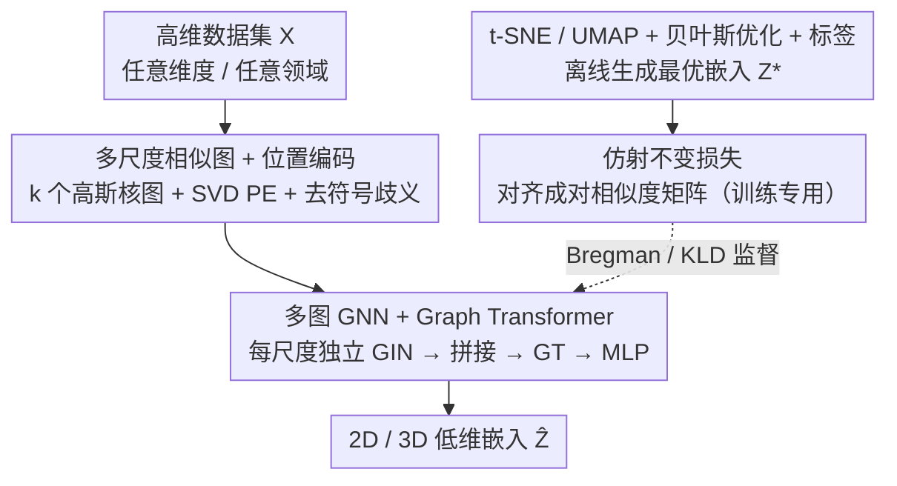

# AutoDV: An End-to-End Deep Learning Model for High-Dimensional Data Visualization

**会议**: ICLR 2026  
**OpenReview**: [https://openreview.net/forum?id=vaflHrZhlY](https://openreview.net/forum?id=vaflHrZhlY)  
**代码**: https://github.com/DryDew/AutoDV (有)  
**领域**: 自监督 / 表示学习（降维与高维数据可视化）  
**关键词**: 高维数据可视化, 降维, 图Transformer, 端到端, 仿射不变损失

## 一句话总结
AutoDV 把"对每个数据集都要调参 + 迭代优化"的传统可视化（t-SNE / UMAP）改造成一个一次训练、即插即用的端到端模型：先把任意维度的数据集转成多尺度相似图，再用多图 GNN + 图 Transformer 直接吐出 2D/3D 嵌入，配合仿射不变损失训练；在没见过的 CIFAR-10 上达到 t-SNE 89.37%、UMAP 91.05% 的相对精度，在基因和 UCI 表格数据上甚至超过 t-SNE/UMAP 本身。

## 研究背景与动机
**领域现状**：高维数据可视化（HDV）是降维（DR）的一个特例，把 $d$ 维数据投到 2D/3D 让人能直观看出簇结构，广泛用于基因组学、遥感、金融等。主流方法是 t-SNE、UMAP、PaCMAP 这类非线性方法，靠显式优化低维嵌入来同时保住局部邻域和全局结构。

**现有痛点**：这些方法有三个绕不开的麻烦。其一，**对超参极度敏感**——t-SNE 的 perplexity、UMAP 的 n\_neighbors 选错就会把可视化搞成毫无意义的球形或错误的簇，而无监督任务又没有标签可以拿来调参（论文 Figure 1 实测：固定/默认超参远非最优）。其二，**每来一个新数据集都要从头迭代优化（re-training）**，数据集一多计算开销爆炸。其三，已有的参数化模型（参数化 UMAP、inductive t-SNE）虽然想用一个 $f_\theta$ 一次前向出结果来省掉重训，但**跨域、跨维度泛化失败**，还会过拟合到训练集，无法复用历史低维表示。

**核心矛盾**：现有参数化模型被"固定输入维度的神经网络"这一假设卡死——它没法吃不同特征数 $d_i \neq d_j$、不同样本数 $N_i \neq N_j$ 的数据集（挑战 C1）；同时降维存在**一对多**问题，对 $Z^*$ 做平移、旋转、缩放后视觉上等价（$Z^*$ 和 $Z^*Q$，$Q$ 正交，都对），直接对齐输出会让训练难收敛（挑战 C2）。

**本文目标**：训练一个端到端模型 $f_\phi$，从一批"历史数据集 + 它们的最优低维嵌入" $\{(X_i, Z_i^*)\}$ 里学规律，使得对任意新数据集 $X_{new}$ 都能直接前向出和最优嵌入足够接近的结果——推理阶段不调参、不重训、不限维度不限领域。

**切入角度**：作者把降维看成一个**元学习**问题——既然历史上对大量带标签数据集已经用 t-SNE/UMAP（贝叶斯优化搜过最优超参）跑出了高质量低维表示，何不让模型把"怎么从数据结构映射到好嵌入"这件事学下来。关键在于找到一种**跨维度统一的输入表示**，于是想到图：任何数据集都能转成样本两两相似度的图，图的节点数随数据集变、但 GNN 天生能处理变节点数。

**核心 idea**：用"多尺度相似图 + 图神经网络"统一任意维度输入，用"仿射不变损失"消掉一对多的退化，把 HDV 变成一次训练、零调参的端到端前向推理。

## 方法详解

### 整体框架
AutoDV 要解决的是"训练一个 $f_\phi$，新数据集来了直接前向出 2D/3D 嵌入"。整条流水线是：**任意维度数据集 → 多尺度相似图 + 位置编码 → 多图 GNN + 图 Transformer → MLP 头 → 低维嵌入**。其中"任意维度数据 → 图"这一步是泛化能力的根，因为图把"$d$ 维特征"抹掉了、只留下样本间相似度结构，于是同一个网络能吃任意领域、任意特征数的数据集。训练阶段额外接一条"教师"支路：用 t-SNE/UMAP + 贝叶斯优化 + 标签先离线搜出每个历史数据集的最优嵌入 $Z_i^*$ 当监督信号，再用仿射不变损失把模型输出 $\hat Z_i$ 的几何结构对齐到 $Z_i^*$；这条支路推理时完全不需要。

### 关键设计

**1. 多尺度相似图 + 位置编码：把任意维度数据塞进同一个网络**

这一步直击挑战 C1——神经网络吃不了变维度的输入。AutoDV 不直接喂特征，而是把数据集 $X_i$ 转成**样本两两相似度图**：用高斯核算邻接矩阵，并用 $k$ 个不同带宽 $\gamma^{(j)}$ 生成 $k$ 个不同尺度的图，以同时保住不同粒度的结构：

$$S_i^{(j)}[u,v] = \exp\!\left(-\frac{\|X_i[u]-X_i[v]\|_2^2}{2\,\gamma^{(j)}}\right),\quad j=1,\dots,k$$

这样 $\mathbb{R}^{N_i\times d_i}$ 的数据集就变成了若干个 $\mathbb{R}^{N_i\times N_i}$ 的加权邻接矩阵——**维度 $d_i$ 被彻底消掉**，只剩样本数 $N_i$，而 GNN 靠消息传递和节点权重共享天然能处理变 $N_i$。但这些图没有节点特征，而 GNN 聚合需要特征，于是作者从邻接矩阵里抽**图位置编码**（PE）$P_i = h(S_i^{(j)})$ 当节点特征，实现里用 SVD 位置编码。这里还有个细节坑：谱方法（SVD/特征分解）有**符号歧义**（$v$ 和 $-v$ 都是特征向量），会让结构相似的图产生迥异的 PE。作者用一个轻量的"数符号"策略修正——某列 $P$ 里负值占多数就整列翻号，否则不动；虽不能彻底解决，但便宜好用、实测有效。

**2. 多图 GNN + 图 Transformer 主干：从多尺度图里端到端读出低维坐标**

有了多尺度图，还得把它们的结构融成低维坐标。AutoDV 用 GIN + Graph Transformer 当骨干：**每个尺度的图配一个独立的 GIN** 单独抽特征，得到 $k$ 组节点嵌入，沿特征维拼接后送进一个图 Transformer 去建模节点间的全局关系，最后用 MLP 头输出 2D/3D 坐标：

$$f_\phi\big((P_i^{(j)},S_i^{(j)})_{j=1}^k\big) = \mathrm{MLP}\Big(\mathrm{GT}\big(\mathrm{GIN}_1(P_i^{(1)},S_i^{(1)}) \oplus \cdots \oplus \mathrm{GIN}_k(P_i^{(k)},S_i^{(k)})\big)\Big)$$

"每尺度独立 GIN"保证不同带宽下的局部结构被分别编码不互相污染，图 Transformer 的自注意力再补上 GIN 难以捕捉的长程/全局关系——这正好对应 t-SNE/UMAP 既要局部邻域又要全局布局的需求，只不过这里是一次前向算出，而非迭代优化。由于映射只依赖统一维度的节点特征 $\mathbb{R}^{k\times N_i\times d_e}\to\mathbb{R}^{N_i\times d'}$，整个网络对输入数据集的原始维度完全无感。

**3. 仿射不变损失：消掉平移/旋转/缩放带来的一对多退化**

这一步对应挑战 C2。如果直接让输出 $\hat Z_i$ 去对齐教师嵌入 $Z_i^*$，由于 $Z_i^*$ 在平移、旋转、缩放下视觉等价（一对多），模型会被互相矛盾的目标拉扯、难收敛。作者的做法是**不对齐坐标本身，而对齐几何结构**：把 $\hat Z_i$、$Z_i^*$ 各自转成成对相似度矩阵 $\hat\Delta_i$、$\Delta_i^*$，再用 Bregman 散度对齐：

$$\mathcal{L} = \frac{1}{L}\sum_{i=1}^{L}\sum_{u=1}^{N_i}\sum_{v=1}^{N_i} K_\psi\big(\hat\Delta_i[u,v],\,\Delta_i^*[u,v]\big)$$

其中 $K_\psi(x,y)=\psi(x)-\psi(y)-\langle\nabla\psi(y),x-y\rangle$。成对距离矩阵对平移、旋转天然不变，再对 $Z_i^*$ 做 z-score 归一化就把缩放不变性也补上——于是损失整体仿射不变，一对多问题被消除。$\sigma$、$\psi$ 的具体形式随教师算法变：教师是 t-SNE 时用 KLD 损失（式 7，且不访问原始高维数据，从而避开 perplexity 选择）；教师是 UMAP 时设计同时含局部和全局一致性项、并用随训练步衰减的系数 $\lambda(t)=1-t/T$ 让模型逐渐更看重局部结构（式 8）。论文证明式 7、式 8 都是式 6 的特例。

### 损失函数 / 训练策略
训练数据这样备：从大数据集随机采子图（子集最大 3000 个点），对每个子集用**贝叶斯优化 + 该子集的真实标签**搜 t-SNE 的最优 perplexity / UMAP 的最优 n\_neighbors（以 NMI 为目标 $M$），得到最优嵌入 $Z_i^*$ 当监督；NMI 低于 10% 的子集丢掉以保证训练数据质量。图像数据先用 CLIP 抽 512 维特征。推理时为应对二次复杂度 $O(N_i^2 w_{max})$，作者提了一个**基于锚点的批处理扩展**：把大数据集切成多个子集，构造一个同簇小锚点集 $A$，每个子集都和 $A$ 一起输入，用固定锚点把不同批的输出校准拼回去，从而扩展到 2 万点级别。论文还给了 Lipschitz 鲁棒性定理（Theorem 1）：输出对输入扰动的偏移有上界，说明输入相似则可视化相似，间接支撑泛化能力。

## 实验关键数据

### 主实验
评测指标为 NMI（与真标签）、轮廓系数 SC，以及**相对精度** $M(\hat Z;y)/M(Z^*;y)$（可大于 1，因为学生可能超过教师）。$t\text{-}SNE^*$ / $UMAP^*$ 是贝叶斯优化搜出的最优嵌入，作为"教师上限"。

| 数据集 | 指标 | AutoDV-tSNE | AutoDV-UMAP | 最强参数化基线 |
|--------|------|------|------|----------|
| CIFAR-10（图像，未见） | Test NMI Prec. | 89.37±7.8 | **91.05±5.3** | p-UMAP 18.54 |
| Mouse Retina（基因，未见） | Test NMI Prec. | 102.7±36.7 | **111.9±60.2** | p-UMAP 93.38 |
| UCI 表格（未见） | Test NMI Prec. | 121.3±40.3 | **129.0±93.2** | p-UMAP 57.08 |

关键点：跨域/跨维度场景下，**几乎所有基线都垮了**——p-UMAP、i-tSNE、i-UMAP、PCA、AE 在未见数据集上 NMI 极低（i-tSNE/i-UMAP 因一对多问题甚至在训练集上都欠拟合）。AutoDV 在 CIFAR-10 上拿到 t-SNE 89.37% / UMAP 91.05% 的相对精度，相比已有参数化模型有 **86.65% 的精度增益**；在基因和表格数据上 NMI 相对精度超过 100%，即**比 t-SNE/UMAP 本身还好**，说明它从高维结构里抓到了更有用的信息。

### 跨域迁移与运行时
跨域实验（Figure 4 热图）显示 AutoDV 迁移性强，尤其从图像/表格域迁到基因域时甚至超过域内最优嵌入；迁入图像域略有下降（基因/表格数据结构更复杂、噪声更大）。运行时（可视化一个 $\mathbb{R}^{3000\times512}$ 新数据集，单 CPU 核）：

| 方法 | AutoDV | AutoDV（预算 PE） | t-SNE | UMAP |
|------|--------|------|------|------|
| 时间 (s) | 101.71±10.1 | 92.67±6.2 | 763.30±7.01 | 103.32±9.63 |

AutoDV 比 t-SNE 快约 7.5 倍；UMAP 单次虽快，但它要靠多次重训来选超参，实际总开销不可接受。

### 关键发现
- **图表示是泛化的关键**：把数据转成相似图后维度被抹掉，同一模型才能跨域跨维度工作；这是 AutoDV 相比 p-UMAP/i-tSNE 暴涨 80+ 个点相对精度的根因。
- **深度基线常"高 SC 低 NMI"**：AE/p-UMAP 等在本设定下 SC 很高但 NMI 很低，说明输出塌进一个稠密区域（优化困难导致的退化），看着紧凑实则没分开簇。
- **类别数多时会掉点**：真实类别数大的数据集 NMI 相对最优会下降，作者归因于当前训练集规模偏小。

## 亮点与洞察
- **"把降维变成元学习"这一框定本身最巧**：历史上无数数据集已用 t-SNE/UMAP 调好参跑出过好嵌入，AutoDV 把这些"沉没的最优解"当监督信号复用，一次训练换来推理零调参——这是对 HDV 范式的重新组织。
- **多尺度相似图 = 跨维度统一接口**：用图把 $d$ 维消成 $N\times N$，是让单一网络吃任意维度数据的关键 trick，可迁移到任何"输入维度不固定"的表示学习任务。
- **对齐结构而非对齐坐标**：用成对相似度矩阵 + z-score 把仿射等价性内建进损失，是处理"目标在某变换群下等价"这类一对多回归问题的通用思路（位姿、点云配准等都能借鉴）。
- **谱 PE 的符号歧义用"数符号翻号"低成本搞定**：是个朴素但实用的工程经验。

## 局限与展望
- **依赖历史数据集及其最优嵌入**（作者承认）：是所有归纳式模型的通病；要先用 t-SNE/UMAP + 贝叶斯优化 + 标签离线造一大批 $Z^*$，前期成本不低。
- **类别数大时性能下降**：作者归因训练集偏小，但也可能是图 Transformer 容量或多尺度图分辨率的瓶颈，需更大规模验证。
- **二次复杂度 $O(N_i^2)$**：单数据集上仍随样本数平方增长，大规模靠锚点批处理近似，作者自己也说该策略"未必最优"，2 万点已是展示上限。
- **教师天花板**：相对精度以 t-SNE/UMAP 的最优嵌入为基准，本质是在"模仿+微超"现有方法，并未跳出 t-SNE/UMAP 的结构假设去定义"更好的可视化"。

## 相关工作与启发
- **vs 参数化 UMAP / inductive t-SNE**：它们也想用一个网络省掉重训，但被固定输入维度卡死、且没处理一对多退化，跨域跨维直接崩（相对精度个位数到十几）。AutoDV 用图统一维度 + 仿射不变损失，把相对精度拉到 89%~129%。
- **vs t-SNE / UMAP**：传统方法每个新数据集都要迭代优化 + 调 perplexity/n\_neighbors，AutoDV 推理一次前向、零调参，且复杂度从 $O(N^2BT)$ 降到 $O(N^2 w_{max})$，省掉迭代轮数 $T$。
- **vs 自回归 Autoencoder（含 Geometric AE / GGAE）**：AE 系靠自重构建端到端 HDV，但同样难跨维度/跨域泛化；AutoDV 改用图结构 + 教师嵌入监督，泛化更稳。

## 评分
- 新颖性: ⭐⭐⭐⭐⭐ 把 HDV 重构成"图表示 + 元学习 + 仿射不变损失"的端到端范式，明确攻克跨维度和一对多两大老问题。
- 实验充分度: ⭐⭐⭐⭐ 覆盖图像/基因/表格三类数据 + 跨域迁移 + 运行时 + 鲁棒性定理，但大规模与类别数多的场景仍偏弱。
- 写作质量: ⭐⭐⭐⭐ 任务定义、两大挑战、对应设计一一对照，逻辑清晰；公式较密。
- 价值: ⭐⭐⭐⭐ 给"一次训练、即插即用的降维可视化"提供了可行路线，对生信/表格分析等高频可视化场景实用。

<!-- RELATED:START -->

## 相关论文

- [\[ICLR 2026\] Exploiting Low-Dimensional Manifold of Features for Few-Shot Whole Slide Image Classification](exploiting_low-dimensional_manifold_of_features_for_few-shot_whole_slide_image_c.md)
- [\[ICLR 2026\] Equivariant Splitting: Self-supervised learning from incomplete data](equivariant_splitting_self-supervised_learning_from_incomplete_data.md)
- [\[ICLR 2026\] Mini-cluster Guided Long-tailed Deep Clustering](mini-cluster_guided_long-tailed_deep_clustering.md)
- [\[CVPR 2026\] Nonparametric Deep Fine-grained Clustering with Low-Rank Guided Vision-Language Model](../../CVPR2026/self_supervised/nonparametric_deep_fine-grained_clustering_with_low-rank_guided_vision-language_.md)
- [\[NeurIPS 2025\] TabSTAR: A Tabular Foundation Model for Tabular Data with Text Fields](../../NeurIPS2025/self_supervised/tabstar_a_tabular_foundation_model_for_tabular_data_with_text_fields.md)

<!-- RELATED:END -->
