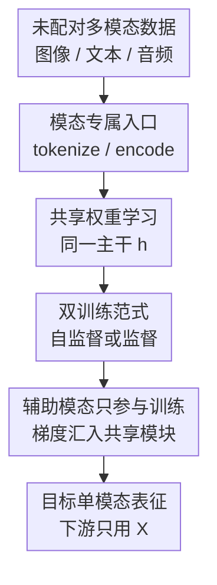

# Better Together: Leveraging Unpaired Multimodal Data for Stronger Unimodal Models

**会议**: ICLR2026  
**OpenReview**: [https://openreview.net/forum?id=5OIgg5YkC3](https://openreview.net/forum?id=5OIgg5YkC3)  
**论文**: [Project Page](https://unpaired-multimodal.github.io/)  
**代码**: 未公开  
**领域**: 自监督 / 表示学习  
**关键词**: 未配对多模态学习, 单模态增强, 权重共享, 自监督表征, 跨模态迁移  

## 一句话总结

这篇论文提出 Unpaired Multimodal Learner（UML）：不需要图文、音图等样本级配对，只要辅助模态与目标模态共享语义结构，就通过跨模态权重共享把未配对文本、图像或音频的训练信号汇入同一表征，从而提升最终只使用单一目标模态的分类与鲁棒性。

## 研究背景与动机

**领域现状**：多模态表征学习通常默认“配对”是核心资源。
CLIP、ImageBind、FLAVA、MultiMAE 等路线之所以强，是因为图像、文本、音频或视频之间存在同一实体的对应关系。
有了 $(x, y)$ 这样的样本级配对，模型可以直接把同一对象的不同投影拉到同一个空间里，再把这种跨模态对齐迁移到检索、分类和生成任务。

**现有痛点**：配对数据昂贵，而且很容易被领域限制住。
互联网上有大量图片、文本、音频、医疗记录、传感器数据和元数据，但它们往往只是各自成库，并没有逐样本对应关系。
如果目标是训练更好的图像分类器，传统思路会继续收图像；如果目标是训练更好的音频分类器，也会继续收音频。
这会忽略一个现实：另一个模态虽然没有和当前样本对齐，却可能覆盖了目标模态看不清的语义方向。

**核心矛盾**：目标模态的数据只是一种“现实投影”，它既有共享语义，也有模态专属噪声和盲区。
图像能看到外观却看不到完整语言描述，音频能捕捉事件声音却缺少视觉上下文，文本能明确类别属性却缺少空间细节。
如果所有模态都来自同一个底层世界 $Z^*$，那么问题不再是“能否找到每张图对应哪句话”，而是“能否利用另一个模态的边际分布来减少对共享现实因子的估计不确定性”。

**本文目标**：作者要回答一个比传统多模态对齐更窄也更有挑战的问题。
第一，在没有任何样本级配对的情况下，辅助模态 $Y$ 是否能让目标模态 $X$ 的表征更好。
第二，如果能，理论上它为什么能带来信息增益，而不是只增加训练噪声。
第三，实践中是否存在一个足够简单的训练范式，不依赖伪匹配、最优传输或预对齐 embedding。

**切入角度**：论文从“共享现实因子”出发，把不同模态看成同一潜变量的不同线性投影。
在这个视角下，未配对样本并不提供“某张图对应某句话”的实例级信息，却仍然能提供关于共享参数 $	heta_c$ 的统计曲率。
只要辅助模态覆盖了目标模态的盲区，它就能让共享因子的 Fisher information 增加，从而减少估计方差。

**核心 idea**：用跨模态共享权重代替显式配对对齐，让不同模态的训练梯度作用在同一共享模块上，从而把未配对辅助模态的语义信息转化为目标单模态表征的增益。

## 方法详解

### 整体框架

UML 的核心很克制：每个模态先用自己的 tokenizer、patch embedding 或预训练 encoder 变成序列/向量表示，然后送入同一个共享网络 $h$，最后再接模态专属解码器或共享分类头。
训练时，图像 batch、文本 batch、音频 batch 可以完全随机、彼此不配对；推理时，辅助模态路径会被丢掉，只保留目标模态的表征 $r_X=h(f_X(x))$ 做线性探测或下游分类。
所以这不是一个“多模态输入模型”，而是一个“用未配对多模态数据把单模态模型练得更好”的训练范式。

从理论到算法，论文的逻辑链是：先证明未配对辅助模态能增加共享因子的 Fisher information，再用共享参数实现这种“信息相加”。
线性理论里，$X$ 和 $Y$ 都依赖共同参数 $	heta_c$，只是各自还有 $	heta_x$、$	heta_y$ 这样的模态专属部分。
实践里的共享主干 $h$ 就扮演共享参数块，图像、文本、音频各自的损失都对它产生梯度，因此它会累积来自不同模态的曲率贡献。

### 关键设计

**1. 未配对多模态学习：把问题从样本对齐改写为共享因子估计**

传统多模态学习把关键资源定义为 $(x_i, y_i)$，也就是“这张图对应这句话”。
本文故意把这个条件拿掉，只保留两个边际数据集 $D_X=\{x_i\}_{i=1}^{N_X}$ 和 $D_Y=\{y_j\}_{j=1}^{N_Y}$。
这一步很重要，因为它把任务从实例级对齐变成了分布级共享结构学习：模型不需要知道哪句话描述哪张图，只需要两个模态都在某些方向上反映同一个世界 $Z^*$。

作者用线性生成模型说明这个设定为什么可能成立。
目标模态和辅助模态分别写成 $X_i=A_{c,i}\theta_c+A_{x,i}\theta_x+\epsilon_{X,i}$ 与 $Y_j=B_{c,j}\theta_c+B_{y,j}\theta_y+\epsilon_{Y,j}$。
这里 $	heta_c$ 是两种模态共同观察到的现实因子，$	heta_x$ 和 $	heta_y$ 是各自独有信息。
即使 $X_i$ 与 $Y_j$ 没有对应关系，只要 $Y$ 对 $	heta_c$ 的某些方向有非零观测，它就能补上 $X$ 对这些方向的弱观测或盲区。

**2. Fisher information 视角：辅助模态提供的是共享方向上的方差收缩**

论文的理论贡献不是证明 UML 一定优化得更好，而是证明“未配对辅助数据有信息价值”。
在条件独立的线性高斯设定下，两个模态对共享参数的 Fisher information 会相加：$(I_X+I_Y)_{\theta_c,\theta_c} \succ (I_X)_{\theta_c,\theta_c}$，前提是辅助模态在共享子空间中提供非退化信息。
这意味着估计 $	heta_c$ 的不确定椭球会收缩，目标模态表征能更准确地接近底层现实。

更细的结论是方向性的。
如果存在某个方向 $v$，使得 $B_{c,j}v \neq 0$，那么 $Y$ 会让这个方向上的 Fisher information 严格增加。
当 $v$ 原本不在 $X$ 的可观测范围里时，$X$ 单独估计该方向的方差近似是无穷大，而加入未配对 $Y$ 后会变成有限。
这也解释了论文里那个反直觉结论：在某些预算固定的情形下，一个 $Y$ 样本可能比继续收一个 $X$ 样本更值钱，因为它覆盖的是 $X$ 的盲点，而不是重复 $X$ 已经看见的方向。

**3. 共享权重学习：不用伪配对，也不用显式分布匹配**

UML 的实践实现几乎只靠权重共享。
给定 $x\sim P_X$ 和 $y\sim P_Y$，模型先得到 $z_X=f_X(x)$、$z_Y=f_Y(y)$，再经过同一个共享模块 $h$ 得到 $r_X=h(z_X)$、$r_Y=h(z_Y)$。
由于 $h$ 被两个模态共同更新，辅助模态的梯度会改变目标模态经过的同一组参数，从而把跨模态共有结构注入 $r_X$。

这个设计和许多“未配对多模态”方法的差别在于，它不去猜 $x$ 应该匹配哪个 $y$，也不假设两个 encoder 已经处在同一个对齐空间。
在自监督场景中，图像 patch embedding 与文本 token embedding 会进入共享 Transformer，再由各自 decoder 做下一 token/patch embedding 预测。
在监督场景中，图像和文本各自带有类别标签，模型用共享分类头对两个模态分别分类；标签是模态内监督，不要求跨模态样本一一对应。

**4. 训练后回到单模态：辅助模态是训练资源，不是推理负担**

UML 的最终目标始终是增强目标单模态模型。
训练阶段可以交替喂入图像、文本、音频等 batch，让共享模块学到更宽的语义边界；推理阶段则丢弃辅助模态，只用目标模态的 encoder 与共享后的表示。
这让它和视觉问答、图文检索或多模态融合模型不同：后者常常要求推理时也有多模态输入，而 UML 的收益体现在单模态下游任务上。

论文还把这个思想扩展到三模态。
如果目标是音频分类，可以用图像和文本作为两个未配对辅助模态；如果目标是图像分类，也可以加入音频和文本。
理论上，多于两个模态时 Fisher information 继续按模态求和；实践中，ImageNet-ESC 的实验也显示加入第二个辅助模态通常继续带来收益。

### 一个完整示例

可以用一个细粒度图像分类任务来理解 UML。
假设目标任务是区分 Oxford Pets 中的 Russian Blue 和 Abyssinian，训练集里每类只有 1 到 2 张图像。
图像本身可能因为姿态、光照和背景让线性分类头学到模糊边界；但另一个文本库里有未配对描述，比如“Russian Blue usually has a blue-gray coat and green eyes”和“Abyssinian looks like a small brown spotted cat with large ears”。
这些句子不对应任何训练图片，却和类别语义相关。

在监督 UML 中，图像经过 DINOv2 得到视觉 embedding，文本经过 OpenLLaMA 或 CLIP text encoder 得到文本 embedding。
共享分类头同时看到少量图像样本和未配对文本描述，并用各自标签计算交叉熵。
训练结束后，测试图片仍然只走图像 encoder 和分类头；但分类头的权重已经被文本描述拉向更清晰的类别原型，决策边界不再只依赖几张低样本图像提供的脆弱视觉差异。

### 损失函数 / 训练策略

自监督版本使用模态专属重建目标。
图像或文本先被投影到共享维度，经过共享 Transformer，再由各自 decoder 预测下一 patch/token embedding。
目标可以写成 $L_{UML-SSL}=\mathbb{E}_{x\sim P_X}\ell(g_X(h(f_X(x))),x)+\mathbb{E}_{y\sim P_Y}\ell(g_Y(h(f_Y(y))),y)$。
连续 embedding 用 MSE，离散 token 可用交叉熵。

监督版本使用共享分类头。
若图像样本有标签 $c_X$，文本样本有标签 $c_Y$，则损失为 $L_{UML-Sup}=\mathbb{E}_{(x,c_X)}\ell_{CE}(c(h(f_X(x))),c_X)+\mathbb{E}_{(y,c_Y)}\ell_{CE}(c(h(f_Y(y))),c_Y)$。
主实验中，文本 encoder 通常冻结，视觉 encoder 在 linear probe 设置中冻结、在 full finetuning 中可训练。
作者还搜索了学习率、weight decay、batch size、cosine schedule、warmup、模态特定 logit scaling 等超参，并在 MultiBench 自监督实验中搜索了先用 $X$ 单独训练若干 epoch 再联合训练的 curriculum step。

## 实验关键数据

### 主实验

论文覆盖了三类主实验。
第一类是自监督 UML，在 MultiBench 和标准视觉-文本 benchmark 上看目标模态 linear probe 准确率。
第二类是监督 UML，用未配对文本增强图像分类，覆盖 full finetuning 与 few-shot linear probing。
第三类是音频-图像-文本三模态扩展和跨模态权重迁移，验证这个思想并不只适用于图文分类。

| 设置 | 数据集 / 任务 | Unimodal | UML / Ours | 主要结论 |
|------|---------------|----------|------------|----------|
| 自监督 | MUSTARD | 59.66 | 63.28 | 文本中的讽刺语义能补足目标表示，提升最明显 |
| 自监督 | MIMIC | 55.16 | 57.10 | 医疗表格/时序等多源特征下也有增益 |
| 自监督 | MOSEI | 70.62 | 71.98 | 情感任务中跨模态共享结构带来稳定改善 |
| 自监督 | MOSI | 56.17 | 58.16 | 小规模情感数据上辅助模态仍有效 |
| 自监督 | Oxford Pets | 85.04 | 86.32 | 标准视觉分类中未配对文本提升图像表征 |
| 自监督 | UCF101 | 79.86 | 80.98 | 动作识别相关视觉任务也有小幅增益 |
| 自监督 | DTD | 78.13 | 78.49 | 纹理任务增益较小但方向一致 |

| 设置 | 平均指标 / 代表任务 | Unimodal | UML / Ours | 提升 |
|------|----------------------|----------|------------|------|
| Full finetuning, DINOv2 ViT-S/14 + OpenLLaMA | 9 个图像分类平均 | 81.54 | 83.99 | +2.45 |
| Few-shot 1-shot linear probe | 9 个图像分类平均 | 45.52 | 51.36 | +5.84 |
| Few-shot 2-shot linear probe | 9 个图像分类平均 | 56.33 | 60.85 | +4.52 |
| Few-shot 4-shot linear probe | 9 个图像分类平均 | 65.84 | 68.53 | +2.69 |
| Full finetuning, Stanford Cars | 细粒度图像分类 | 79.45 | 86.39 | +6.94 |
| Few-shot 1-shot, Oxford Pets | 细粒度图像分类 | 63.51 | 73.59 | +10.08 |
| Few-shot 1-shot, Caltech101 | 低样本分类 | 76.66 | 84.52 | +7.86 |

### 消融实验

| 消融 / 分析 | 对比设置 | 关键数字 | 说明 |
|-------------|----------|----------|------|
| 语义相关性 | SUN397 图像 + Stanford Cars 文本 | 1-shot 35.27 vs unimodal 34.15；16-shot 67.25 vs 67.35 | 无关文本基本不带来稳定收益，说明提升不是简单正则化 |
| 语义相关性 | SUN397 图像 + SUN397 相关文本 | 1-shot 41.79；16-shot 69.19 | 相关文本在所有 shot 下都明显优于图像单模态 |
| 三模态音频分类 | ESC-27, 1-shot | Audio-only 25.65；Audio+Image+Text 44.68 | 图像和文本作为未配对辅助模态时，音频分类相对提升 74.2% |
| 三模态图像分类 | ESC-19, 1-shot | Image-only 60.28；Image+Audio+Text 90.55 | 两个辅助模态叠加时提升最强 |
| 模态 batch 比例 | SUN397, text:image ratio $r\in\{0.25,0.5,1,2,4\}$ | UML(init) 2-shot 约 52.81-53.15 | 性能对交替频率不敏感，关键在辅助语义是否存在 |
| 冻结文本 encoder | Stanford Cars / SUN397 | Frozen: 84.87 / 66.72；Unfrozen: 84.23 / 65.80 | 冻结文本 encoder 更稳定，也更能隔离辅助语义的作用 |
| 模态换算率 | Oxford Pets | CLIP: 1 image ≈ 228 words；DINOv2+OpenLLaMA: 1 image ≈ 1034 words | 对齐 encoder 让文本利用效率更高，未对齐 encoder 需要更多文本 |

### 关键发现

- 最大收益出现在低样本和细粒度分类场景，因为此时目标模态样本不足以稳定刻画类别边界，文本描述等辅助模态能补充类别属性。
- 未配对数据必须在分布层面语义相关；当 SUN397 图像配 Stanford Cars 文本时，UML 基本不优于图像单模态。
- 三模态实验说明辅助模态的贡献可以叠加，Audio+Image+Text 与 Image+Audio+Text 都优于单模态或多数双模态设置。
- 论文的权重分析显示，未配对文本会扩大 functional margin，提高 silhouette score，降低 DB-index，并让分类头权重与对应类别文本 embedding 出现更清晰的对角对齐。
- 从 BERT 初始化 ViT Transformer 层的 transfer learning 实验显示，即便不是联合训练，来自语言模型的权重也能作为视觉模型的有用初始化，支持“不同模态共享底层结构”的观点。

## 亮点与洞察

- 最有价值的点是把“未配对多模态数据能否帮助单模态模型”从经验问题拉回到信息论问题。
  Fisher information 的分析解释了为什么辅助模态不是魔法：它只有在覆盖共享语义方向时才有用，且收益本质上是共享因子估计方差下降。
- UML 的方法非常简单，甚至有点“反工程直觉”。
  它不构造伪 caption、不做最优传输、不学习显式匹配矩阵，只是让不同模态共享一段网络；这让实验结论更聚焦于“未配对数据本身是否有用”。
- 低样本细粒度分类中的提升很有启发。
  对很多视觉任务来说，文本描述不是为了做 VQA 或检索，而是可以直接塑造分类头的类别原型；这为小样本医学影像、科学观测、遥感和机器人感知提供了实用思路。
- “一张图值多少词”的换算率虽然粗糙，但提供了一个可讨论的数据价值尺度。
  它提醒我们，不同模态的样本数量不能简单相加；对齐程度、文本细粒度和语义覆盖都会影响每个辅助样本的边际价值。
- 负结果也很重要。
  无关辅助模态不提升性能，说明 UML 不是一个无条件的多模态正则器；它依赖的是共享现实结构，而不是“多喂一种数据一定更好”。

## 局限与展望

- 理论部分基于线性高斯和 Fisher information，可解释“存在信息增益”的条件，但没有解决深度网络中的优化稳定性、梯度干扰和模态竞争问题。
- 实验主要评估分类任务，尤其是图像分类和音频分类；它还没有充分证明未配对图像或音频是否能反过来稳定提升文本生成、文本分类或推理任务。
- 论文没有系统构造大规模 missing-modality benchmark，只是在若干 controlled settings 中触及这个问题。
  未来可以把多个单模态数据仓库显式组合起来，研究类别重叠、语义偏移和模态缺失比例如何影响 UML。
- UML 对辅助模态的语义相关性有要求。
  当前论文只验证了“相关”和“独立无关”两类情况，还没有严谨定义负相关、对抗相关或细粒度 domain mismatch。
- 推理时虽然没有辅助模态成本，但训练时需要维护多个 encoder、batch loader 和模态专属头。
  在超大规模训练中，如何控制显存、batch schedule、模态采样比例和数据质量仍然是工程问题。
- 对真实应用而言，辅助文本描述可能来自 LLM 生成模板。
  这些描述如果带有偏见、幻觉或类别泄漏，可能把错误先验写入分类边界，需要更细的质量控制。

## 相关工作与启发

- **vs CLIP / LiT / ImageBind**: 这些方法依赖图文或多模态配对、弱配对或预对齐空间来学习统一 embedding；UML 研究的是没有样本对应关系时，另一个模态的边际数据是否还能增强目标单模态。
- **vs MultiMAE / 4M / Omnivore**: 这些工作通常训练统一模型处理多任务多模态，目标是泛化到多种输入和输出；UML 的目标更窄，强调辅助模态只用于训练，最终评估的是目标单模态表征。
- **vs Lin et al. 的 multimodality helps unimodality**: 相关工作也利用文本帮助视觉 few-shot，但通常在 CLIP 这类已对齐 embedding 上操作；本文进一步展示 DINOv2 + OpenLLaMA 这种未预对齐 encoder 也能从权重共享中受益。
- **vs 未配对跨域匹配 / optimal transport 方法**: 这些方法常常推断粗粒度或细粒度对应关系；UML 不推断对应，只通过共享参数吸收跨模态统计结构，机制更简单但也更依赖共享语义假设。
- **vs 模态冲突与 modality collapse 研究**: 那类工作解释为什么配对多模态训练会被强模态主导或产生负迁移；本文承认这些优化问题仍可能存在，但重点给出未配对模态在信息层面有帮助的存在性证据。
- **启发**: 对缺少配对数据的领域，可以优先寻找“语义相关但无需配对”的辅助资源，例如医学报告文本、实验元数据、机器人操作日志、传感器声音或类别说明，再用共享头或共享 trunk 训练一个推理时仍然单模态的模型。

## 评分

- 新颖性: ⭐⭐⭐⭐☆ 把未配对辅助模态用于增强单模态表征并给出 Fisher information 解释，问题设定清晰且有启发，但权重共享本身不是复杂新架构。
- 实验充分度: ⭐⭐⭐⭐☆ 覆盖自监督、监督、few-shot、full finetuning、三模态和若干消融，证据链较完整；不过主要仍集中在分类。
- 写作质量: ⭐⭐⭐⭐☆ 主线从理论到 UML 再到实验比较顺，但部分附录实验很多、主文对具体训练细节压缩较多，需要来回查表。
- 价值: ⭐⭐⭐⭐⭐ 对拥有大量非配对多源数据的场景很实用，尤其适合低样本细粒度分类、医学/科学数据和机器人等配对成本高的领域。

<!-- RELATED:START -->

## 相关论文

- [\[ICLR 2026\] Disentanglement of Variations with Multimodal Generative Modeling](disentanglement_of_variations_with_multimodal_generative_modeling.md)
- [\[NeurIPS 2025\] Hybrid Autoencoders for Tabular Data: Leveraging Model-Based Augmentation in Low-Label Settings](../../NeurIPS2025/self_supervised/hybrid_autoencoders_for_tabular_data_leveraging_model-based_augmentation_in_low-.md)
- [\[ACL 2026\] LLMSurgeon: Diagnosing Data Mixture of Large Language Models](../../ACL2026/self_supervised/llmsurgeon_diagnosing_data_mixture_of_large_language_models.md)
- [\[CVPR 2026\] Is Parameter Isolation Better for Prompt-Based Continual Learning?](../../CVPR2026/self_supervised/is_parameter_isolation_better_for_prompt-based_continual_learning.md)
- [\[ICML 2025\] Towards Benchmarking Foundation Models for Tabular Data With Text](../../ICML2025/self_supervised/towards_benchmarking_foundation_models_for_tabular_data_with_text.md)

<!-- RELATED:END -->
