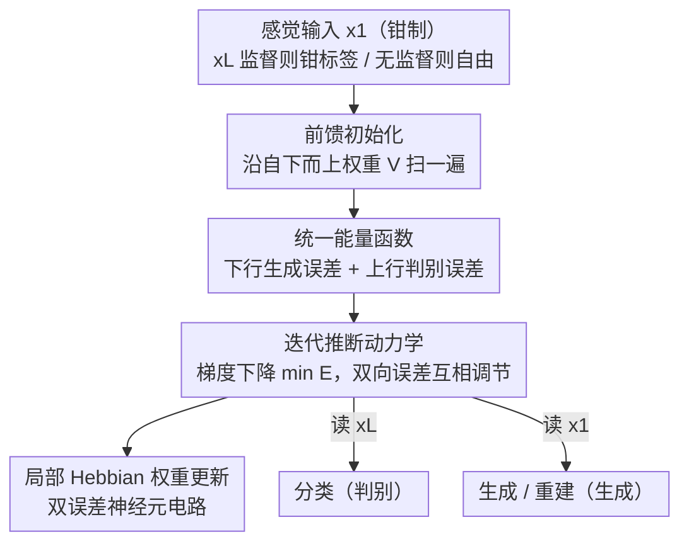

# Bidirectional Predictive Coding

**会议**: ICLR2026  
**OpenReview**: [https://openreview.net/forum?id=HbRihpurRr](https://openreview.net/forum?id=HbRihpurRr)  
**代码**: 待确认  
**领域**: 自监督 / 表示学习（类脑计算）  
**关键词**: 预测编码, 生成-判别统一, 能量函数, 局部 Hebbian 学习, 类脑视觉推断

## 一句话总结
本文提出双向预测编码（bPC），用一个能量函数同时容纳「自上而下生成」和「自下而上判别」两种推断，让同一套生物可实现的局部电路既能像 discPC 那样准确分类、又能像 genPC 那样生成与重建，并在跨模态联想、遮挡补全等类脑任务上超过现有的单向 / 混合 PC 模型。

## 研究背景与动机
**领域现状**：预测编码（Predictive Coding, PC）是解释大脑视觉学习与推断的主流计算模型，因为它只依赖局部计算和 Hebbian 可塑性，符合生物约束。它有两种成熟形式：生成式 PC（genPC）用神经活动自上而下预测感觉输入，擅长联想记忆与图像生成；判别式 PC（discPC）用感觉输入自下而上预测高层活动，分类性能可逼近反向传播。

**现有痛点**：实验神经科学证据表明，大脑同时用到生成与判别两种推断——判别通路负责快速提取特征，生成通路负责把噪声输入与先验做贝叶斯整合。但现有 PC 模型只能锁定单一推断方向：genPC 分类很差，discPC 因为推断动力学解不唯一而无法做无监督学习与生成。已有的混合方案 hybridPC 只是额外加一条前馈网络给神经活动做初始化，初始化之后这条通路不再参与动力学，结果监督性能仍明显落后 discPC。

**核心矛盾**：生成与判别在 PC 里被建模成方向相反的两条预测流，二者的能量函数互不相容；想同时拿到两种能力，过去要么各训一个模型（神经元翻倍、不生物），要么牺牲其中一个任务。

**本文目标**：找到一个单一 PC 模型，在保持生物可实现电路的前提下，同时支持生成与判别推断，并且两种任务都不掉性能。

**切入角度**：作者注意到 genPC 和 discPC 的能量都是「邻层之间预测误差的平方和」，只是预测方向相反。既然形式同构，就可以把两条预测流写进同一个能量函数，让神经元同时发出上行和下行预测。

**核心 idea**：用一个统一能量函数同时编码自上而下（生成）与自下而上（判别）的预测误差，让同一组潜层神经元被两种预测「互相约束」，从而在共享电路里长出一个既不过度自信、又不塌缩到类均值的能量地形。

## 方法详解

### 整体框架
bPC 是一个 $L$ 层的分层高斯模型，每层神经活动记为 $x_l$，其中 $x_1$ 是感觉输入、$x_L$ 可钳制为标签（监督）或自由演化（无监督）。与只朝一个方向预测的 genPC / discPC 不同，bPC 的每个神经元同时做下行预测（用上层预测本层，参数为自上而下权重 $W$）和上行预测（用下层预测本层，参数为自下而上权重 $V$）。整套流程是：先沿自下而上权重做一次前馈扫掠，把各层活动快速初始化；再让神经活动按梯度下降迭代，最小化统一能量；最后用一步 Hebbian 更新权重。推断完成后，从 $x_L$ 读出标签即分类、从 $x_1$ 读出即生成 / 重建。

这套机制有清晰的串行结构（初始化 → 推断动力学 → 权重更新），且生成与判别两条预测流在同一能量里耦合，适合用框架图鸟瞰：

### 关键设计

**1. 统一能量函数：把上行判别与下行生成捏进同一个目标**

genPC 的能量 $E_{gen}=\sum_{l=1}^{L-1}\frac{1}{2}\lVert x_l-W_{l+1}f(x_{l+1})\rVert_2^2$ 只惩罚下行预测误差，discPC 的能量 $E_{disc}=\sum_{l=2}^{L}\frac{1}{2}\lVert x_l-V_{l-1}f(x_{l-1})\rVert_2^2$ 只惩罚上行预测误差。bPC 直接把两者按权相加成单一能量：

$$E(x,W,V)=\sum_{l=1}^{L-1}\frac{\alpha_{gen}}{2}\lVert x_l-W_{l+1}f(x_{l+1})\rVert_2^2+\sum_{l=2}^{L}\frac{\alpha_{disc}}{2}\lVert x_l-V_{l-1}f(x_{l-1})\rVert_2^2.$$

其中 $W$ 是自上而下权重、$V$ 是自下而上权重，$\alpha_{gen}$、$\alpha_{disc}$ 是标量权重常数，用来抵消上行 / 下行预测误差的量级差异（可看作 Friston 意义上的可学习精度参数，本文为简单起见固定调好）。由于下行预测误差量级更大，实验中必须把 $\alpha_{disc}$ 设得高于 $\alpha_{gen}$。这一加法让同一层神经元同时受到来自上层和下层的预测约束，是后续所有能力的根。

**2. 前馈初始化 + 双向预测误差驱动的推断动力学**

每次学习先用自下而上权重做一次前馈扫掠初始化各层活动（如 $x_2=V_1 f(x_1)$、$x_3=V_2 f(V_1 f(x_1))$），这相当于大脑初次遇到刺激时的「快速摊还推断」，也解释了皮层的快速初始响应。之后神经活动按下式做梯度下降逼近能量最小：

$$\frac{dx_l}{dt}\propto-\nabla_{x}E=-\epsilon_l^{gen}-\epsilon_l^{disc}+f'(x_l)\odot\left(W_l^\top\epsilon_{l-1}^{gen}+V_l^\top\epsilon_{l+1}^{disc}\right)+N(0,\sigma^2 I),$$

其中 $\epsilon_l^{gen}=\alpha_{gen}(x_l-W_{l+1}f(x_{l+1}))$、$\epsilon_l^{disc}=\alpha_{disc}(x_l-V_{l-1}f(x_{l-1}))$ 分别是该层的下行与上行预测误差。默认噪声 $\sigma^2=0$ 给确定性动力学、收敛到最大后验估计；设 $\sigma^2=1$ 则变成从后验采样的随机动力学，用于学习输入分布、做生成采样。关键在于：每个潜层同时被上行误差和下行误差拉扯，两股力量互相调节，而不是像 hybridPC 那样前馈通路只管初始化、初始化完就退场——bPC 的自下而上权重 $V$ 在整个迭代推断中持续把感觉信息送进潜层，这也是它在推断步数受限时优于 genPC、在复杂输入（CIFAR）上优于 hybridPC 的原因。

**3. 局部 Hebbian 神经实现：双误差神经元电路**

权重更新只用一步梯度下降：$\Delta W_l\propto\epsilon_{l-1}^{gen}f(x_l)^\top$、$\Delta V_l\propto\epsilon_{l+1}^{disc}f(x_l)^\top$，是前突触活动与后突触误差的外积，完全是 Hebbian 形式。整个网络由值神经元（编码 $x_l$）、误差神经元（编码预测误差）和突触权重构成，所有计算只依赖相邻值神经元与误差神经元的局部活动，没有任何非局部信号。与单向 PC 的唯一区别是：bPC 的每个值神经元配两个误差神经元，分别承载上行与下行预测误差。值得注意的是，bPC 用同样数量的误差神经元、却只需单向模型一半的值神经元就同时拿到两种能力，因此更省能——误差信号还可由神经元树突处理，无需单独的神经元群。

**4. 共享潜层塑造的能量地形：为什么两个任务都能赢**

这是全文的解释性核心。作者用 XOR 玩具问题直接可视化能量地形：理想地形应只在合法的「输入-标签」对处有尖锐局部极小。结果 discPC 长出大片低能量平原，对不合理甚至分布外（OOD）输入都过度自信；genPC 则把每个类塌缩成单一均值，丢掉真实结构；把两个单独模型拼在一起会同时继承两种缺陷。而 bPC 学到的是以合法输入为中心的尖锐、类特异极小。机制上，下行生成预测把极小锚定到具体数据点（拒绝 OOD），上行判别预测把极小磨尖（保住判别精度），两条预测互相正则化，于是既不偏向训练均值、也不过度自信。在 MNIST 上按能量采样，bPC 生成的数字 Inception Score 6.05 vs 拼接模型 3.62、FID 44.4 vs 140.5，定量印证了这一点。

### 损失函数 / 训练策略
训练即最小化上面的统一能量 $E$：先前馈初始化，再迭代更新神经活动（推断），最后一步 Hebbian 更新权重。bPC 天然支持三种设置——监督（钳制 $x_1$ 与 $x_L$）、无监督（只钳制 $x_1$，其余自由，从而学压缩表示）、混合（$x_L$ 部分神经元钳标签、其余自由，联合推断标签与表示）。无监督 / 混合时在表示层 $x_L$ 加活动衰减项以稳定学习、正则化表示。

## 实验关键数据

### 主实验
模型在 MNIST / Fashion-MNIST / CIFAR-10/100 上与 discPC、genPC、hybridPC 及它们的反向传播版本对比，架构完全相同。

| 任务设置 | 指标 | bPC 表现 | 对比 |
|--------|------|------|------|
| 监督：分类+生成 | 分类准确率 | 与 discPC / discBP 相当 | genBP、hybridPC 较差 |
| 监督：分类+生成 | 生成 RMSE | 与 genPC / hybridPC / genBP 相当 | discPC 误差大得多 |
| 无监督表示（8 步推断） | 重建 RMSE / 线性解码 / FID | 一致优于 genPC，匹配 hybridPC，CIFAR 上重建显著超 hybridPC | genPC 在推断步数受限时明显掉 |
| 监督+无监督联合 | 分类准确率 | 与 BP 相当，CIFAR-10 上比 hybridPC 高 45%+ | hybridPC 联合设置下分类崩 |

### 消融 / 分析实验

| 配置 / 场景 | 关键发现 | 说明 |
|------|---------|------|
| XOR 能量地形 | bPC 学到尖锐类特异极小 | discPC 平原过自信、genPC 塌成类均值、拼接模型两病皆有 |
| MNIST 能量采样 | IS 6.05 vs 3.62，FID 44.4 vs 140.5 | bPC 对比 discPC+genPC 拼接模型 |
| 双模态架构 | 跨模态分类与重建均显著超 bimodal genPC | bPC 天生双模态，无需改结构 |
| 遮挡鲁棒性 | 80% 像素缺失仍保持高分类准确率 | genPC 较低、discPC/discBP 超 50% 遮挡即崩 |

### 关键发现
- **共享潜层是性能来源**：去掉双向耦合（退化为单向或拼接）就会回到「平原过自信 / 塌缩类均值」的老问题，bPC 的优势完全来自两条预测流互相正则化。
- **上行通路不只是初始化**：bPC 比 hybridPC 强，正是因为自下而上权重在整个迭代推断中持续供给感觉信息，而非像 hybridPC 那样只用于一次性初始化；输入越复杂（CIFAR）差距越明显。
- **遮挡补全靠生成先验**：遮挡像素留空并初始化为零，bPC 用自上而下先验主动重建缺失输入再与观测整合，因此 80% 缺失仍稳；纯判别模型无法补全，50% 遮挡即崩。
- **已知瑕疵**：CIFAR-10 重建因判别通路里的 max-pooling 引入网格状伪影；去掉 max-pooling 可消伪影但分类掉点，作者留作未来工作。

## 亮点与洞察
- **形式同构带来的统一**：发现 genPC 与 discPC 能量只是预测方向相反、可直接相加，这一观察简单却打通了长期分裂的两条路线，是「啊哈」所在。
- **能量地形的可视化解释**：用 XOR 把「为什么 discPC 不能生成、genPC 不能判别」画成能量平原 vs 类均值塌缩，再说明 bPC 如何取两者之长，解释力强且直观。
- **省神经元的双能力**：同样误差神经元、一半值神经元就拿到两种能力，且全程局部 Hebbian，生物可实现性与能效兼得。
- **可迁移思路**：在其他需要兼顾判别与生成的能量模型 / EBM 里，"用反向预测流锚定极小、用前向预测流磨尖极小"这一互相正则化的设计值得借鉴。

## 局限与展望
- **数据集规模有限**：实验止步 MNIST / Fashion-MNIST / CIFAR，未验证更大自然图像或更深网络下双向耦合是否仍稳定。
- **max-pooling 伪影**：判别通路的 max-pooling 会污染生成重建，存在分类精度与无伪影生成之间的结构性取舍，尚未解决。
- **权重常数靠手调**：$\alpha_{gen}$、$\alpha_{disc}$ 被当作固定超参手工调好，理论上它们是可学习精度参数，自动学习这两个量是自然的下一步。
- **生物对照仍是定性**：文章论证 bPC「更像」大脑视觉推断，但与具体神经记录的定量对照仍有限。

## 相关工作与启发
- **vs discPC（判别式 PC）**: 判别式只做上行预测，分类准但生成是大片过自信平原、无法无监督学习；bPC 补上下行生成流锚定极小，保住分类的同时拿到生成。
- **vs genPC（生成式 PC）**: 生成式只做下行预测，能生成 / 重建但分类差、把类塌成均值；bPC 补上上行判别流磨尖极小，保住生成的同时拿到判别。
- **vs hybridPC（混合 PC）**: hybridPC 只在初始化阶段用一次前馈网络、之后退场，监督性能落后 discPC；bPC 的上行权重全程参与迭代推断，联合学习时 CIFAR-10 分类高出 45%+。
- **vs 权重共享双向 PC（Qiu et al. 2023）**: 该模型让相邻层上行 / 下行共享同一组权重，但大脑不太可能在分处理层间共享突触；bPC 用独立的 $W$、$V$，更符合生物约束。
- **vs Helmholtz machine / wake-sleep、VAE、U-Net、PredNet**: 这些 ML 里的生成-判别融合方案性能强但依赖非局部学习信号，不是生物可实现的双向学习解释；bPC 全程局部 Hebbian。

## 评分
- 新颖性: ⭐⭐⭐⭐⭐ 用统一能量把长期分裂的生成 / 判别 PC 真正合一，并给出能量地形层面的机制解释
- 实验充分度: ⭐⭐⭐⭐ 覆盖分类 / 生成 / 无监督 / 联合 / 双模态 / 遮挡多场景且有 XOR 可视化，但数据集规模偏小
- 写作质量: ⭐⭐⭐⭐⭐ 动机—方法—解释—验证一条线讲透，能量地形的可视化尤其清晰
- 价值: ⭐⭐⭐⭐ 对类脑计算与能量模型社区有清晰贡献，ML 端落地仍受规模与伪影限制

<!-- RELATED:START -->

## 相关论文

- [\[ICLR 2026\] Contrastive Predictive Coding Done Right for Mutual Information Estimation](contrastive_predictive_coding_done_right_for_mutual_information_estimation.md)
- [\[ICLR 2026\] Self-Predictive Representations for Combinatorial Generalization in Behavioral Cloning](self-predictive_representations_for_combinatorial_generalization_in_behavioral_c.md)
- [\[ICLR 2026\] Two-Way is Better Than One: Bidirectional Alignment with Cycle Consistency for Exemplar-Free Class-Incremental Learning](two-way_is_better_than_one_bidirectional_alignment_with_cycle_consistency_for_ex.md)
- [\[ICLR 2026\] Temporal Slowness in Central Vision Drives Semantic Object Learning](temporal_slowness_in_central_vision_drives_semantic_object_learning.md)
- [\[ICLR 2026\] CSRv2: Unlocking Ultra-Sparse Embeddings](csrv2_unlocking_ultra-sparse_embeddings.md)

<!-- RELATED:END -->
