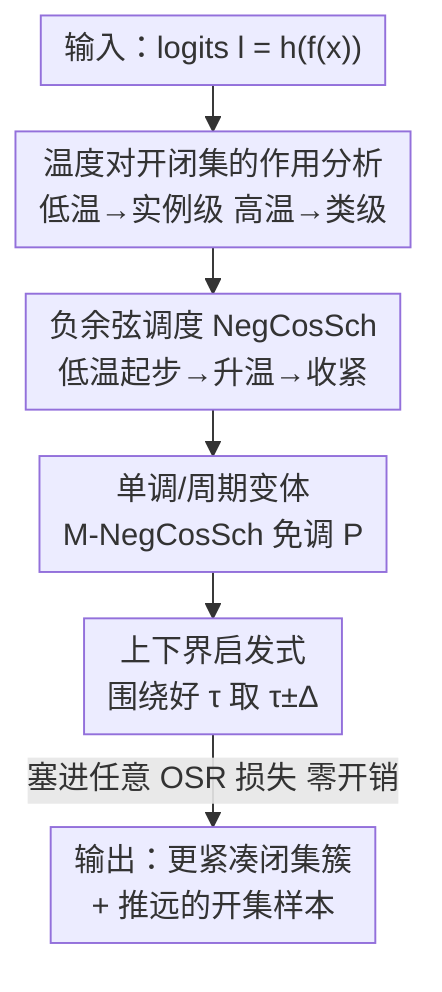

# Boosting Open Set Recognition Performance through Modulated Representation Learning

**会议**: ICLR2026  
**OpenReview**: [https://openreview.net/forum?id=vpBKry7kL5](https://openreview.net/forum?id=vpBKry7kL5)  
**代码**: https://github.com/amit31416/NegCosSch/  
**领域**: 自监督 / 表示学习 / 开集识别  
**关键词**: 开集识别, 温度调度, 表示学习, 对比损失, 负余弦调度

## 一句话总结
这篇论文指出几乎所有开集识别（OSR）方法都给 logits 用一个**固定温度** $\tau$，导致模型只能停在「实例级特征」和「类级特征」频谱的某一点；作者提出在训练过程中**调度温度**（核心是新颖的负余弦调度 NegCosSch），让模型先用低温画出粗决策边界、再升温把同类样本收紧，从而在不增加任何计算开销的前提下，把开集和闭集性能一起提升，尤其在更难的语义偏移基准（SSB）上收益最大。

## 研究背景与动机
**领域现状**：开集识别要求模型在测试时既能准确分类已知类（闭集），又能把训练时从未见过的新语义类（开集）标记出来。早期方法大致分三派：把未知类建模成长尾分布、用生成模型/mix-up 合成「伪未知样本」、或额外训一个带重建目标的副模型（VAE 等）。Vaze 等人（2022）则换了个思路——一个训练得足够好的闭集分类器本身就能拿到不错的 OSR 性能（未知样本的 max-logit 更低），由此把后续研究引向「学更好的表示」。

**现有痛点**：合成样本派泛化差；生成/副模型/mix-up 派算力和显存开销大，在 Vaze 等人提出的大规模语义偏移基准（SSB，定义在 CUB、Aircraft、Stanford Cars 这些细粒度数据集上，且按语义相似度分 Easy/Hard 难度）上根本跑不动，所以大多数近期工作干脆不报 SSB 结果。还有一派靠加正则把决策边界压得更紧、指望未知表示落进腾出来的空区——但这并没触及问题本质：更难的未知样本和已知类**语义本就接近**，硬挤空区救不了它们。

**核心矛盾**：CE 和对比损失都靠一个温度系数 $\tau$ 调节 softmax 输出的「锐度」。已有研究表明，**低温鼓励实例级（instance-specific）特征**、**高温鼓励类级（class-specific）特征**。但训练全程把 $\tau$ 钉死在一个值，就让模型只能待在这条学习频谱的某一端：太类级，新类很容易被认成某个已知类；太实例级，模型又不敢把任何样本判给已知类。固定温度天然两头不讨好。

**本文目标**：在不引入任何额外计算/显存开销的前提下，让模型在训练中**同时获得**良好的类级表示与类内的实例级判别力，从而把开集和闭集性能一起拉高，并且能在更难的 SSB 上真正起效。

**切入角度**：既然温度是控制这条频谱的开关，那就不要把它钉死——在训练过程中**动态调度温度**，让模型沿频谱来回走，先学粗结构、再学细结构。Kukleva 等人（2023）曾在闭集长尾自监督场景用过余弦温度调度，但温度调度对**新类**、对不同损失的影响一直没人系统研究。

**核心 idea**：用一组温度调度替换固定温度，核心是**负余弦调度 NegCosSch**——训练**从低温起步**（先画粗边界、把开集样本推远），再**逐渐升温**（把同类样本收紧、平滑边界），整套机制可无缝塞进任何现有 OSR 损失，零额外开销。

## 方法详解

### 整体框架
方法本身极轻：不改网络结构、不加样本、不训副模型，只把损失函数里那个**常数温度 $\tau$ 换成一个随训练 epoch 变化的函数 $T(e)$**。模型仍由编码器 $f(\cdot)$（把输入 $x$ 映成表示 $z=f(x)$）和头部 $h(\cdot)$（CE 下是分类层、对比下是投影层）组成，输出 logits $l=h(z)$ 喂给损失。唯一改动是：原来 softmax 里的 $l/\tau$ 变成 $l/T(e)$。作者先分析「为什么温度能控制开/闭集表示」，再据此设计调度曲线 $T(e)$，最后给出温度上下界 $(\tau^+,\tau^-)$ 的选取启发式，让你几乎不用额外调参。

### 关键设计

**1. 温度对开/闭集表示的作用分析：把「为什么调度有用」讲透**

这是整套方法的地基。以 SupCon 损失为例，作者推导负样本 logit $l_j$ 的梯度：

$$\frac{\partial L_{\text{SupCon}}}{\partial l_j} = \frac{1}{\tau}\big[\text{softmax}_{a\in I\setminus\{i\}}(\text{sim}(l_i,l_a)/\tau)\big]_j \times \frac{\partial \text{sim}(l_i,l_j)}{\partial l_j}$$

**低温**（$\tau$ 小）会放大缩放后相似度的差异，于是**最近的负样本拿到最大梯度**，模型激进地把它们推开，学到适合实例级判别的特征、表示铺满整个空间；但同类正样本也因为「只有少数邻居被重视」而不会抱紧，决策边界更锐，开集样本因「轻微不相似就被重罚」而被推得离已知簇很远。**高温**（$\tau$ 大）则把排斥力摊给更多负邻居，模型转而学类级特征、同类簇更紧凑、边界更平滑——但代价是开集样本更容易贴近已知簇。CE 损失同理：$\tau<1$ 让输出分布更锐、$\tau>1$ 更平滑。这一分析直接说明：**没有哪个固定温度能两头通吃**，必须在训练中走动。

**2. 负余弦调度 NegCosSch：先低温画粗边界、再升温收紧**

作者用一个广义余弦调度统一描述各种曲线：

$$T_{\text{GCosSch}}(e;\tau^+,\tau^-,P,k) = \begin{cases} \tau^- + \frac{1}{2}(\tau^+-\tau^-)\big(1+\cos(\frac{2\pi e}{P}-k\pi)\big), & e\le E-\frac{kP}{2}\\ \tau^+, & \text{otherwise} \end{cases}$$

其中 $P$ 是周期，$k\in[0,1]$ 控制余弦波相位延迟。$k=0$ 退化为 Kukleva 等人的常规余弦调度 CosSch（从高温 $\tau^+$ 走到低温 $\tau^-$）；作者发现**反过来更好**——令 $k=1$，温度**从低 $\tau^-$ 起步、升向高 $\tau^+$**，曲线形如倒置余弦波，故名负余弦调度 NegCosSch。直觉对应设计 1 的分析：低温起步时模型只重视少数邻居，先学出**粗的表示骨架**、把开集样本甩远；随温度升高，模型逐渐拉更多邻居、把同类样本收进自己簇里，在**保住早期画好的核心分离**的同时让簇更紧、边界更平滑，而开集样本因特征未知不会被同样收紧，分离得以保留。后半个周期（高温降回低温）再为实例级特征做一次精修、并为下一周期重启做平滑过渡；最后几个 epoch 维持高温让模型稳定收敛（如图中 500–600 epoch）。这一调度可套到 CE、SupCon、ARPL 任意损失上，只是给损失加了个随 epoch 变的温度，零额外算力。

**3. 单调变体与免调参：M-NegCosSch 把超参也省掉**

NegCosSch 引入了周期 $P$ 这个新超参，作者进一步发现**只取 NegCosSch 的前半个上升周期**（令 $P=2E$）就足够好，称为单调负余弦调度 M-NegCosSch：

$$T_{\text{M-NegCosSch}}(e;\tau^+,\tau^-) = \tau^- + 0.5(\tau^+-\tau^-)\big(1-\cos(e\pi/E)\big),\quad \forall e$$

它免去了对 $P$ 的调参，实验中在多数情形下还比周期版更好——说明收益主因来自「单调升温」这件事本身。即便退一步用线性或指数升温，也都优于固定温度基线。对周期版，$P$ 只要落在能充分探索的合理区间即可（$P=200$ 在各基准上一致表现好），具体取值对性能影响不大。

**4. 上下界 $(\tau^+,\tau^-)$ 的启发式：围绕一个好温度对称取范围，几乎不用再调**

调度需要上下温度界，但逐数据集调 $\tau^+,\tau^-$ 很烦。作者给出结构化启发式：先用常规调参找到一个好的固定温度 $\tau$，然后**把它放在区间中心**——SupCon 下取 $\tau^+=\tau+\Delta,\ \tau^-=\tau-\Delta$（或 $\tau^+=\tau+\Delta,\ \tau^-=\tau$），增量 $\Delta\approx0.1\sim0.2$；CE 下因为温度缩放的是 logits 而非相似度，取 $\tau^+=2\tau,\ \tau^-=\tau/2$。$\Delta$ 不能太大：过低的 $\tau^-$ 会破坏早期语义结构的形成，过高的 $\tau^+$ 会抹掉必要的实例级判别力。例如 TinyImageNet 调出固定基线最优 $\tau=0.2$，据此 NegCosSch 直接用 $(\tau^+,\tau^-)=(0.4,0.1)$ 或 $(0.3,0.2)$ 即可，无需对两个界单独搜参。在更难的 SSB 上甚至只调出 $\tau=0.2$、套用 $(0.3,0.1)$ 就能拿到强提升。

### 损失函数 / 训练策略
不新增任何损失项，调度直接作用于现有损失的温度。CE 推理时模型原样使用；SupCon 推理时去掉投影层、另训一个线性分类器评估，OSR 打分统一用 **max-logit** 规则。TinyImageNet 用类 VGG32 模型，SSB 用 places365 预训练的 ResNet50；每个实验跑 5 个随机种子取平均。

## 实验关键数据

### 主实验
基准：TinyImageNet + 三个 SSB（CUB / FGVC-Aircraft / Stanford Cars），SSB 开集分 Easy/Hard。指标：闭集准确率 Accuracy(%)、开集检测 AUROC(%)、综合 OSCR(%)（CCR 与 FPR 的权衡曲线下面积）。下表为 CE 损失上不同调度的对比（SSB 列为 Easy/Hard），可见作者提出的调度全面压过固定基线与 CosSch：

| 调度 (CE 损失) | CUB Acc | CUB AUROC | CUB OSCR | Aircraft Acc | Aircraft AUROC | Aircraft OSCR |
|---|---|---|---|---|---|---|
| Constant（基线） | 84.43 | 83.55 / 74.98 | 70.49 / 63.34 | 90.88 | 90.35 / 81.48 | 82.05 / 74.25 |
| P-CosSch | 84.63 | 84.5 / 74.24 | 71.51 / 62.93 | 90.8 | 90.04 / 81.81 | 81.76 / 74.51 |
| Linear increase (ours) | 86.22 | 86.54 / 78.01 | 74.58 / 67.32 | 90.97 | 91.11 / 83.25 | 82.87 / 76 |
| P-NegCosSch (ours) | **86.3** | **86.85 / 77.6** | **74.89 / 67.01** | **91.33** | **91.41 / 83.15** | **83.43 / 76.14** |
| M-NegCosSch (ours) | 86.12 | 86.79 / 78.08 | 74.7 / 67.3 | 91.15 | 91.15 / 83.23 | 82.99 / 76 |

在 SCars / TinyImageNet 上同样成立（如 SCars 上 M-NegCosSch OSCR 达 92.57/83.95，固定基线为 91.04/82.19）。

### 消融实验
作者跨 CE / SupCon / ARPL / BackMix 多种损失，对比「加 vs 不加 NegCosSch」：

| 配置 | 关键结论 | 说明 |
|---|---|---|
| 任意 OSR 损失 + NegCosSch | 几乎全面提升 | 18/20 情形闭集+开集双涨，仅 2 例外 |
| P-NegCosSch vs M-NegCosSch | 多数 M 更好 | 主要收益来自「单调升温」本身 |
| 线性/指数升温 | 仍优于固定基线 | 连最简单的升温也有效 |
| 随机调度 / 线性降温 | 不稳定甚至掉点 | 证明是「升温」而非「乱动温度」起效 |

最大提升幅度：准确率 +1.87%、开集 AUROC Easy/Hard 各 +3.3%/+3.1%、OSCR +4.4%/+3.96%，且**零额外算力**。

### 关键发现
- **方向比波形更重要**：把余弦调度反过来（低→高）才是关键，常规 CosSch（高→低）反而平庸，随机/降温调度甚至掉点——证明收益来自「先粗后细」的升温过程，而非单纯让温度变化。
- **单调升温拿走大头收益**：M-NegCosSch 在多数情形超过周期版，说明核心机制是单调升温；周期性只在部分数据（CUB/Aircraft 的 CE/BackMix）上靠重启再精修出额外收益。
- **越难越香**：训练类数越多、任务对基线越难时，本方法相对提升越大，正好补上多数 OSR 方法不敢碰 SSB 的空白。
- **与 label smoothing 正交**：多数情况下能与 LS 叠加再涨；个别 LS 因 max-logit 抑制而掉点的场景（SCars-Hard、Aircraft CE），NegCosSch 仍胜过对应基线。

## 亮点与洞察
- **把超参从「负担」变成「调度变量」**：温度本是要小心调的固定超参，作者反手把它的**时间轨迹**当成新的设计自由度，这种「让旧超参动起来」的思路可迁移到任何带温度/缩放因子的损失（蒸馏温度、InfoNCE 温度等）。
- **零开销是真正的卖点**：相比 mix-up / 生成 / 副模型动辄翻倍的算力，本方法只改一行温度计算，因此**唯一一类能跑上大规模 SSB**的 OSR 改进，实用性极强。
- **理论分析与曲线设计闭环**：从 SupCon 负样本梯度 $\propto 1/\tau$ 的推导，直接推出「低温推远开集、高温收紧闭集」，再据此设计「低起步→升温」的曲线，动机具体且自洽，不是拍脑袋调曲线。
- **免调参启发式很贴心**：$(\tau^+,\tau^-)$ 围绕已知好温度 $\tau$ 对称取 $\pm\Delta$ 的规则，让工程上几乎「白嫖」，落地成本极低。

## 局限与展望
- **依赖一个已知的好基线温度 $\tau$**：上下界启发式建立在「先调出一个好的固定 $\tau$」之上，若基线温度本身没调好，调度的中心点也会偏。
- **$\Delta$ 有安全区间**：$\Delta$ 太大会因过低 $\tau^-$ 破坏早期语义结构、或过高 $\tau^+$ 抹掉实例判别力，区间靠经验（0.1~0.2），缺乏更原则化的自适应选取。
- **少数反例未解释透**：Aircraft(SupCon+LS+P-NegCosSch) 与 TinyImageNet(CE+LS+M-NegCosSch) 两例没有提升，作者归因于 LS 的 max-logit 抑制，但与调度的交互机制仍可深挖。
- **可改进方向**：把温度调度做成**数据/损失自适应**（按当前簇紧凑度在线决定升温速率），或与 OSCR 直接耦合优化，可能进一步免去对 $\tau$ 与 $\Delta$ 的依赖。

## 相关工作与启发
- **vs Vaze et al. (2022)**: 他们论证「好的闭集分类器即好的 OSR」并提出 SSB 基准，但仍用固定温度；本文承接其「学更好表示」的方向，把固定温度换成调度，在其自家 SSB 上拿到额外提升。
- **vs CosSch (Kukleva et al. 2023)**: 他们在闭集长尾自监督场景用余弦温度调度（高→低）；本文把场景搬到**开集**、并实证**反方向（低→高）的 NegCosSch 更优**，且系统研究了温度对新类的影响。
- **vs mix-up / 生成 / 副模型派 (ARPL, BackMix 等)**: 这些方法靠加样本或加正则压开空区，开销大且难上 SSB；本文零开销、可直接叠加在它们之上进一步提升，属于正交增益。

## 评分
- 新颖性: ⭐⭐⭐⭐ 「把固定温度变成调度、并发现反方向余弦更优」角度新颖且分析扎实，但属在已有温度调度上的方向性改进。
- 实验充分度: ⭐⭐⭐⭐⭐ 跨 4 类损失、4 个基准、5 个种子，且在多数方法不报的 SSB 上系统验证。
- 写作质量: ⭐⭐⭐⭐ 从梯度分析到曲线设计逻辑闭环，公式与直觉对得上；个别反例解释偏简。
- 价值: ⭐⭐⭐⭐⭐ 零开销、即插即用、可与现有方法叠加，落地成本极低，实用价值高。

<!-- RELATED:START -->

## 相关论文

- [\[ICLR 2026\] FedOpenMatch: Towards Semi-Supervised Federated Learning in Open-Set Environments](fedopenmatch_towards_semi-supervised_federated_learning_in_open-set_environments.md)
- [\[ICLR 2026\] Disentangled representation learning through unsupervised symmetry group discovery](disentangled_representation_learning_through_unsupervised_symmetry_group_discove.md)
- [\[ICLR 2026\] Adversarial Encoding Perturbation and Synthesis for Set Representation Auxiliary Learning](adversarial_encoding_perturbation_and_synthesis_for_set_representation_auxiliary.md)
- [\[CVPR 2026\] PAF: Perturbation-Aware Filtering for Open-Set Semi-Supervised Learning](../../CVPR2026/self_supervised/paf_perturbation-aware_filtering_for_open-set_semi-supervised_learning.md)
- [\[AAAI 2026\] Let the Void Be Void: Robust Open-Set Semi-Supervised Learning via Selective Non-Alignment](../../AAAI2026/self_supervised/let_the_void_be_void_robust_open-set_semi-supervised_learning_via_selective_non-.md)

<!-- RELATED:END -->
