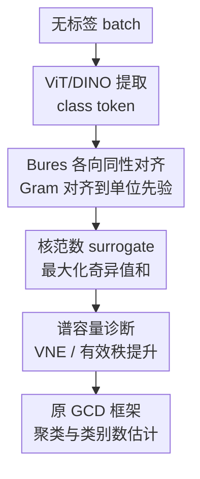

# Bures-Isotropy Alignment: Manifold Learning of Generalized Category Discovery

**会议**: ICLR 2026  
**OpenReview**: [https://openreview.net/forum?id=nfVKTJ1MJ3](https://openreview.net/forum?id=nfVKTJ1MJ3)  
**代码**: https://github.com/lytang63/BIA  
**领域**: 自监督表示学习 / 广义类别发现 / 表征流形学习  
**关键词**: 广义类别发现, Bures距离, 各向同性, 维度坍缩, 类别数估计  

## 一句话总结
BIA 将广义类别发现中的类别 token 表征看成一个需要修复的流形几何问题，用 Bures 距离把 mini-batch 的 class-token Gram 矩阵对齐到各向同性先验，并通过等价的核范数最大化实现轻量正则，从而在不改 GCD 框架的情况下提升聚类精度和类别数估计稳定性。

## 研究背景与动机
**领域现状**：广义类别发现（Generalized Category Discovery, GCD）希望模型在只有一部分类别有标签的情况下，对混有已知类和新类的无标签样本进行聚类。主流方法通常沿着对比学习、原型分类、均值漂移或伪标签自蒸馏的路线推进：已知类样本被拉近，无标签样本通过相似性、原型或邻域关系逐步形成簇，最后再用聚类匹配评估 old/new/all accuracy。

**现有痛点**：这套范式默认“聚得越紧越好”，但论文指出，在开放世界场景里，盲目压缩特征会把 class token 的表征流形挤到少数主方向上。已知类看似更紧凑了，新类内部的细粒度差异却也被压没了；在谱上表现为特征 Gram 或自相关矩阵的特征值高度不均匀、有效秩降低、能量集中到几个维度。这样会诱发两个 GCD 常见错误：不同新类被错误合并，以及类别数估计偏离真实值。

**核心矛盾**：GCD 同时需要“可分”和“完整”。可分要求同类靠近、异类远离；完整则要求每个类别，尤其是未知新类，仍保留足够多的语义方向供聚类区分。传统 compact clustering 主要优化前者，却没有显式约束表示空间的几何质量，导致模型在伪标签噪声和类别不平衡下越来越依赖低维 shortcut。

**本文目标**：作者想补上的不是一个新的聚类器，而是一个能嵌入现有 GCD 框架的几何正则项。它要在 mini-batch 级别识别 class-token 表征是否过度塌缩，把谱能量从过强的主方向重新分散到更多维度，并让这种修复同时服务于聚类精度和类别数估计。

**切入角度**：论文从 Bures 距离切入。Bures 距离来自量子信息几何，常用于比较正定矩阵或密度矩阵；在这里，作者把一批 class token 的 Gram 矩阵视作表征几何的“状态”，再把各向同性矩阵作为目标先验。这个角度的好处是，它天然关注谱结构，而不是只在坐标维度上做去相关。

**核心 idea**：用 Bures 距离把 class-token Gram 矩阵推向各向同性，并在 trace 近似固定时把它化成核范数最大化，让 GCD 的表征既不塌缩到少数维度，也不需要改模型结构。

## 方法详解

### 整体框架
BIA 的输入是一批无标签图像经过 ViT/DINO 编码后的 class token，输出不是新的类别预测头，而是一个附加到原有 GCD loss 上的几何正则。它先堆叠 batch 内每个样本的 class token，构造 sample Gram 矩阵，再用 Bures 距离衡量该 Gram 与单位矩阵的差距；实际训练时，作者利用 trace 约束把这个目标转成最大化 class-token 矩阵的核范数，只需一次 SVD 就能作为 plug-and-play loss 加到 SimGCD、CMS、SPTNet、SelEx 等框架里。

这张图里，ViT/DINO 和原 GCD 框架是脚手架，真正的贡献节点是 Bures 各向同性对齐、核范数 surrogate、谱容量诊断三部分。BIA 不替代 contrastive learning 或 prototype learning，而是在这些目标已经形成语义聚合趋势后，防止聚合过程把 class-token 空间压成低秩形状。

### 关键设计
**1. Bures 各向同性对齐：把 GCD 的失败模式改写成谱几何问题**

论文首先把每个样本的 class token 记为一行，堆成 $Z \in \mathbb{R}^{B \times d}$，并构造 batch Gram 矩阵 $\Sigma_B = ZZ^\top \in \mathbb{R}^{B \times B}$。在行归一化或 LayerNorm 后，$\Sigma_B$ 的对角线大致稳定，$(\Sigma_B)_{ij}$ 可理解为两个样本 class token 的余弦相似性；它的特征值分布就描述了 batch 内表征能量到底是分散在多条语义方向上，还是集中在少数主成分上。

BIA 用单位矩阵 $I$ 作为各向同性目标，并最小化平方 Bures 距离：

$$
d_B^2(\Sigma_B, I) = \operatorname{tr}(\Sigma_B) + B - 2\operatorname{tr}(\Sigma_B^{1/2}).
$$

这个目标的含义很直接：如果 $\Sigma_B$ 近似单位矩阵，那么样本之间不会都挤在少数相似方向上，batch 内 token 子空间更接近满秩和均匀谱。和简单地继续压低类内距离不同，BIA 不要求所有相似样本无限靠近，而是要求整个 token manifold 保留足够的几何容量。因此它更像“修复被压扁的表征空间”，而不是再加一层 compact clustering。

**2. 核范数 surrogate：把 Bures 目标化成几行可插拔训练代码**

直接优化矩阵平方根形式的 Bures 距离会显得复杂，但作者给出一个关键等价：在行范数或 trace 近似固定时，$\operatorname{tr}(\Sigma_B)$ 基本是常数，最小化 $d_B^2(\Sigma_B,I)$ 等价于最大化 $\operatorname{tr}(\Sigma_B^{1/2})$。由于 $\Sigma_B = ZZ^\top$ 的非零特征值等于 $Z$ 的奇异值平方，便有：

$$
\operatorname{tr}(\Sigma_B^{1/2}) = \sum_j \sqrt{\mu_j} = \sum_j s_j(Z) = \|Z\|_*.
$$

于是 BIA 可以写成 $L_{\text{BIA}} = d_B^2(\Sigma_B,I)$，也可以用更实用的 $L_{\text{nuc}} = -\|Z\|_*$。总目标就是 $L = L_{\text{GCD}} + \lambda L_{\text{BIA}}$，如果用核范数版本，代码层面只需要取无标签 batch 的 class token、过 projection head、SVD 后把奇异值和从 loss 里减掉。这个设计很关键，因为 GCD 方法之间的差异很大：有的靠对比学习，有的靠原型分类，有的靠均值漂移。如果 BIA 要改 classifier、聚类后处理或伪标签策略，就很难证明它是通用几何修复；而核范数正则只作用在表示矩阵上，所以可以直接挂到多种 baseline。

核范数最大化也比“把协方差硬拉成单位矩阵”的 Frobenius whitening 更柔和。它偏好更均匀的奇异值，但不要求每个方向精确等于某个固定值；在 GCD 的混合 known/novel batch 中，这一点很重要，因为一部分各向异性可能确实来自语义结构。BIA 的目标是抬起塌缩的小特征值、缓和过强主方向，而不是把所有语义结构都洗平。

**3. 谱容量诊断：用 von Neumann 熵解释为什么类别发现更稳**

为了说明 BIA 不只是数学上好看，论文引入全数据 class-token 自相关矩阵 $A = \text{CLS}^\top\text{CLS}/N$，并用 von Neumann entropy（VNE）和有效秩来衡量表征容量。若 $A$ 的特征值越均匀，VNE 越高，说明信息没有集中到少数维度；如果最大几个特征值吸收了绝大多数能量，VNE 和有效秩都会偏低，这就是维度坍缩的谱表现。

这个诊断和 GCD 的任务目标是对齐的。未知类别通常没有标签监督，模型只能依靠无标签样本之间的细粒度差异来形成簇；一旦 token 空间低秩化，这些差异会先被压掉，后续再好的聚类算法也只能在贫乏的几何上做决定。BIA 通过 mini-batch 级别的核范数目标提升局部谱均匀性，最终在全局 $A$ 上表现为 VNE 和有效秩提高，从而让新类更不容易被混成一个大簇，也让类别数估计不再被低维 shortcut 牵着走。

作者还把 BIA 和 VICReg、CorInfoMax、Iso-Frob、Iso-Ent 这类 isotropy regularizer 做了区分。VICReg 更偏坐标级 variance/covariance 约束，CorInfoMax 关注互信息，Iso-Frob 太像刚性 whitening，Iso-Ent 对接近零的小特征值过于敏感；BIA 则直接作用于 GCD 决策所依赖的 batch class-token Gram，且通过平方根谱函数温和地重塑特征值分布。这解释了为什么它在伪标签噪声、类别不均衡和细粒度新类混合时更稳定。

### 损失函数 / 训练策略
BIA 的训练策略很简洁：保留原 GCD baseline 的网络、优化器、数据增强、伪标签和聚类流程，只在无标签 batch 的 class token 上加一个权重为 $\lambda$ 的几何正则。论文使用预训练 DINO ViT-B/16 作为图像编码器，并遵循各 baseline 的原始设置进行对比。

核心训练式为：

$$
L = L_{\text{GCD}} + \lambda L_{\text{BIA}},
$$

其中 $L_{\text{GCD}}$ 可以来自 SimGCD 的原型分类与自蒸馏、CMS 的对比均值漂移，或其他 GCD 框架。若采用核范数 surrogate，则对无标签 class-token embedding $Z$ 做 SVD，得到奇异值 $s_j$，将 $-\sum_j s_j$ 加入 loss。论文附录给出的 PyTorch 风格实现基本就是：取 class token、投影、SVD、从 loss 中减去 $\lambda$ 乘奇异值和。

超参数上，BIA 只有一个主要系数 $\lambda$。作者的敏感性实验显示，它在较宽范围内都能提升 clustering accuracy；相比之下，VICReg 这类方法在 GCD 中需要分别调 variance/covariance 权重，且不同数据集最优点不一致。计算开销也很小：SVD 相对 ViT backbone forward-backward 的开销在 batch size 64 到 256 下约为 0.37% 到 1.47%，整轮训练时间增量通常低于 1%。

## 实验关键数据

### 主实验
论文在粗粒度和细粒度 GCD 数据集上评估 BIA，包括 CIFAR100、ImageNet100、CUB、Stanford Cars、FGVC Aircraft 和 Herbarium19。评价分两种设置：一种假设聚类时给定真实类别数 $K$，另一种不提供真实 $K$，需要模型估计类别数。下面挑选最能说明问题的结果。

| 设置 | Baseline | 数据集 | All | Old | New | BIA 后变化 |
|------|----------|--------|-----|-----|-----|------------|
| 给定真实 $K$ | SelEx | CUB | 78.7 → 80.6 | 81.3 → 81.0 | 77.5 → 80.4 | New +2.9，All +1.9 |
| 给定真实 $K$ | SimGCD | ImageNet100 | 83.3 → 86.7 | 92.1 → 93.1 | 78.9 → 83.6 | New +4.7，All +3.4 |
| 给定真实 $K$ | CMS | CUB | 67.1 → 71.1 | 74.9 → 74.1 | 63.2 → 66.9 | All +4.0，New +3.7 |
| 给定真实 $K$ | SPTNet | Stanford Cars | 56.2 → 58.8 | 70.3 → 75.4 | 46.6 → 50.8 | 三项均明显提升 |
| 未给定真实 $K$ | CMS | CUB | 66.2 → 68.7 | 69.7 → 74.1 | 64.4 → 66.0 | Old +4.4，All +2.5 |
| 未给定真实 $K$ | CMS | CIFAR100 | 77.8 → 79.5 | 84.0 → 84.7 | 65.3 → 69.1 | New +3.8 |

整体趋势是：BIA 对新类 accuracy 的帮助通常比旧类更明显，这和它恢复 intra-class completeness、避免未知类过度合并的动机一致。在给定真实 $K$ 的细粒度数据集上，BIA 对 SimGCD、CMS、SPTNet、SelEx 均有增益；在不知道真实 $K$ 的设置下，它也能提升 CMS 在多数数据集上的 All/New 表现。

### 消融实验
| 消融 / 分析 | 关键指标 | 说明 |
|-------------|----------|------|
| $\lambda$ 与特征维度 $D$ 敏感性 | CUB / Cars / Aircraft clustering accuracy | BIA 对 $\lambda$ 不敏感；单纯降低维度 $D$ 来避免坍缩并不理想，因为会直接损失有用语义维度 |
| 类别数估计 | ImageNet100: CMS 估计 $K=98$、BIA 后 $K=100$ | BIA 改善类别数估计，在 ImageNet100 上达到正确估计；CUB、Cars 的误差也有下降 |
| 与 SSL isotropy 正则对比 | SimGCD + BIA 在 CUB All 为 62.1，高于大多数 VICReg/CorInfoMax 配置 | VICReg/CorInfoMax 能带来部分提升，但更依赖超参数，且不是专门面向 GCD 的 batch class-token Gram |
| 与 Iso-Frob / Iso-Ent 对比 | CUB batch size 128: BIA All 62.1，Iso-Frob 61.5，Iso-Ent 61.8 | BIA 在不同 batch size 下更稳定，小 batch 时优势更明显 |
| 计算开销 | SVD 相对 backbone 约 0.37%--1.47%；整 epoch 时间增量 <1% | BIA 的主要代价来自 batch 矩阵 SVD，但实际训练开销很低 |

### 关键发现
- BIA 的收益主要来自谱结构修复，而不是更强的分类头或后处理。它在多个 baseline 上都有效，说明它补的是 GCD 表征空间的共性短板。
- 新类 accuracy 的提升更显著，尤其在 CUB、ImageNet100、Stanford Cars 这类需要细粒度区分或类别数估计的数据集上，符合“恢复未知类内部语义容量”的解释。
- CIFAR100 和 Herbarium19 的收益相对有限。论文认为原因不是 BIA 失效，而是底层 embedding 质量本身受限：CIFAR100 图像分辨率低，插值进 ViT 后高频细节不足；Herbarium19 类别多且与预训练分布差异大，原始表征已经很难给出可分几何。
- BIA 比更刚性的 whitening 或 entropy 正则更稳。它不是强制每个方向都等权，而是通过核范数鼓励更高有效秩，在保留语义各向异性的同时缓解坍缩。

## 亮点与洞察
- **把 GCD 的“聚不准”解释为几何容量不足**：很多 GCD 工作关注伪标签、原型和聚类策略，BIA 则提醒我们，若 class-token 空间已经低秩塌缩，后续决策只是在贫乏表示上补救。这种视角对分析 open-world learning 很有启发。
- **Bures 距离到核范数的转化很干净**：论文没有把量子信息术语停留在类比层面，而是给出 trace 约束下 $d_B^2(\Sigma_B,I)$ 与 $\|Z\|_*$ 的关系。这个转化让方法从一个看似复杂的矩阵几何目标变成几行训练代码。
- **作用位置选得准**：BIA 不在坐标 covariance 上做通用去相关，而是在 batch class-token Gram 上动手。这个 Gram 正是 GCD 聚类、原型更新和类别数估计最关心的样本关系空间，因此正则信号更贴近任务。
- **对其他任务也有迁移价值**：凡是存在“为了判别而过度压缩表示”的任务，都可以借鉴这条思路，例如开放词汇分类、跨域无监督聚类、持续类别发现，甚至一些检索表征训练。关键不是照搬 Bures 名字，而是检查谱能量是否被少数方向垄断。

## 局限与展望
- BIA 依赖底层 embedding 已经有一定语义质量。如果预训练模型对数据域覆盖很差，或者输入分辨率损失了关键细节，单靠谱正则无法凭空创造可分语义。
- 论文主要在视觉 GCD 和 ViT class token 上验证，虽然方法声称 architecture-agnostic，但在文本、音频、多模态 GCD 中，token pooling 和 batch 语义结构可能不同，还需要单独验证。
- BIA 对类别不均衡和伪标签噪声的解释偏谱分析，实验上展示了稳定性，但还可以进一步研究何时 isotropy 会削弱真实的类别层级结构。例如某些数据天然有长尾或层级语义，完全均匀的谱未必总是最优。
- 当前 loss 只使用 mini-batch 级 Gram。小 batch 下谱估计噪声会更大，虽然论文显示 BIA 比 Iso-Frob/Iso-Ent 更稳，但未来可以探索 memory bank 或跨 batch 统计，让几何估计更可靠。
- 类别数估计的提升主要通过 CMS 框架展示，后续可以更系统地分析 BIA 如何影响不同 K-estimation 策略，而不只是看最终误差。

## 相关工作与启发
- **vs SimGCD / CMS**: SimGCD 和 CMS 主要通过原型、自蒸馏、对比学习或均值漂移形成更紧凑的类别簇；BIA 不替代它们，而是在它们的语义聚合过程中维持 class-token 谱容量，因此是互补插件。
- **vs VICReg**: VICReg 用 variance / invariance / covariance 项避免自监督表征坍缩，但它更偏 coordinate-level 统计约束；BIA 直接正则 batch class-token Gram，更贴近 GCD 的样本关系空间。
- **vs CorInfoMax**: CorInfoMax 强调互信息最大化，可以让表示更有信息量，但在伪标签噪声下也可能强化错误相关性；BIA 不追求更多信息本身，而是让已有 GCD 目标学到的语义方向不要塌缩。
- **vs Whitening / Iso-Frob**: Whitening 类方法倾向把协方差硬推向单位矩阵，可能抹掉有用的语义各向异性；BIA 通过核范数最大化更柔和地均衡谱能量。
- **vs Bures metric 相关工作**: 以往 Bures metric 多用于比较分布、量子态或 domain adaptation；本文的不同点是把它作为 GCD 训练目标，并用核范数 surrogate 解决实现问题。

## 评分
- 新颖性: ⭐⭐⭐⭐☆ 从 Bures 几何到 GCD class-token isotropy 的切入有辨识度，尤其是核范数 surrogate 与 GCD 表征坍缩的结合较新。
- 实验充分度: ⭐⭐⭐⭐☆ 覆盖多 baseline、多数据集、给定/不给定 $K$、SSL 正则对比、batch size 和开销分析；但跨模态和更复杂类别数估计策略还可扩展。
- 写作质量: ⭐⭐⭐⭐☆ 主线清楚，公式推导和附录分析比较完整；部分实验表格密集，读者需要自己从大量数字中提炼规律。
- 价值: ⭐⭐⭐⭐☆ 方法轻量、可插拔、解释性强，对 GCD 和开放世界表示学习都有实际参考价值，尤其适合用作现有框架的低成本几何增强项。

<!-- RELATED:START -->

## 相关论文

- [\[AAAI 2026\] GOAL: Geometrically Optimal Alignment for Continual Generalized Category Discovery](../../AAAI2026/self_supervised/goal_geometrically_optimal_alignment_for_continual_generalized_category_discover.md)
- [\[CVPR 2026\] Learning Like Humans: Analogical Concept Learning for Generalized Category Discovery](../../CVPR2026/self_supervised/learning_like_humans_analogical_concept_learning_for_generalized_category_discov.md)
- [\[NeurIPS 2025\] Consistent Supervised-Unsupervised Alignment for Generalized Category Discovery](../../NeurIPS2025/self_supervised/consistent_supervised-unsupervised_alignment_for_generalized_category_discovery.md)
- [\[CVPR 2026\] Seeing Through the Shift: Causality-Inspired Robust Generalized Category Discovery](../../CVPR2026/self_supervised/seeing_through_the_shift_causality-inspired_robust_generalized_category_discover.md)
- [\[CVPR 2026\] TAR: Token-Aware Refinement for Fine-grained Generalized Category Discovery](../../CVPR2026/self_supervised/tar_token-aware_refinement_for_fine-grained_generalized_category_discovery.md)

<!-- RELATED:END -->
