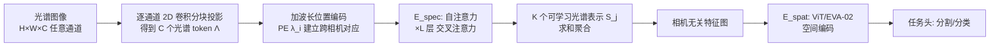

# CARL: Camera-Agnostic Representation Learning for Spectral Image Analysis

**会议**: ICLR 2026  
**OpenReview**: [https://openreview.net/forum?id=TpbhS1yfz0](https://openreview.net/forum?id=TpbhS1yfz0)  
**代码**: [https://github.com/IMSY-DKFZ/CARL](https://github.com/IMSY-DKFZ/CARL)  
**领域**: 自监督表示学习 / 光谱成像 / 跨相机泛化  
**关键词**: 光谱成像, 相机无关表示, 波长位置编码, 自监督预训练, I-JEPA, 跨域泛化  

## 一句话总结
CARL 用「波长位置编码 + 自注意力-交叉注意力光谱编码器」把任意通道数（RGB/多光谱/高光谱）的光谱图像蒸馏成相机无关的特征表示，再配一套特征级光谱+空间自监督策略（CARL-SSL），首次实现跨相机的时空-光谱联合表示学习，在医学、自动驾驶、卫星三个领域都超过相机专属和通道无关基线。

## 研究背景与动机
**领域现状**：光谱成像（RGB、多光谱 MSI、高光谱 HSI）在医学诊断、城市场景感知、遥感中越来越重要，每个通道记录特定波长的反射信息，通道数从几个到上百个不等。数据驱动模型已成主流，但不同厂商的光谱相机在**通道维度和覆盖波长上差异巨大**，形成了一个个「相机专属数据孤岛」。

**现有痛点**：传统 CNN/ViT 假设固定通道数，无法跨相机使用，导致「一个相机训一个模型」，孤岛之间的知识无法迁移，大量数据被浪费。已有的通道无关方法各有缺陷——Spectral Adapter 用 1D 卷积消解通道但忽略波长信息；DOFA/Hyve 等通道自适应投影层依赖空间操作、不显式编码光谱显著性，在光谱异质数据上不鲁棒；融合方法则要求训练和推理时同时拥有所有模态，在传感器多样且未知的医学/工业场景中不现实。

**核心矛盾**：自监督预训练的效果随数据量 scale，理应跨孤岛聚合海量无标注数据；但现有 SSL 策略都不是相机无关的，预训练被锁死在单相机孤岛内，且没有任何 SSL 框架能同时做到「相机无关 + 特征级 + 时空-光谱联合编码」。

**本文目标**：构造一个能把任意通道数光谱图像转成统一相机无关表示的骨干模型，并配套一个能消化跨孤岛大规模无标注数据的自监督框架。

**核心 idea**：**[波长即位置]** 把 Transformer 里编码 token 离散位置的位置编码思想，迁移到「通道的连续波长」上，从而建立跨相机的通道对应关系；再用一组**可学习的光谱表示**通过交叉注意力从可变数量的光谱 token 中蒸馏显著信息，得到固定维度、相机无关的 patch 表示。

## 方法详解

### 整体框架
CARL 把光谱图像处理拆成两段串联：先用**光谱编码器 $E_{\text{spec}}$** 把相机相关的可变通道光谱信息蒸馏成相机无关的 patch 表示，再用一个标准的**空间编码器 $E_{\text{spat}}$**（如 ViT/EVA-02）捕捉 patch 间的几何关系，最后接任务头做分割/分类。光谱表示既可以隐式地由下游任务损失驱动学习，也可以显式地由自监督损失 CARL-SSL 学习。

### 关键设计

**1. 波长位置编码：让模型「认得」每个通道是什么颜色。** 光谱图像 $I\in\mathbb{R}^{H\times W\times C}$ 先被一个共享的 2D 卷积（kernel=stride=patch size $P$）逐通道投影到 $D$ 维特征，每个 patch 变成 $C$ 个光谱 token $\Lambda=(\Lambda_1,\dots,\Lambda_C)$。要跨相机对齐通道，关键在于让模型知道每个通道对应的物理波长 $\lambda_i$。作者用 sinusoidal Fourier Features 编码：$\text{PE}(\lambda_i)=[\cos(2\pi\alpha\lambda_i B),\ \sin(2\pi\alpha\lambda_i B)]^T\in\mathbb{R}^D$，其中 $B\sim\mathcal{N}(0,\sigma^2 I)$，缩放因子 $\alpha$ 和带宽 $\sigma$ 是超参。把 $\text{PE}(\lambda)$ 加到光谱 token 上，模型就能把不同相机里「同一波长」的通道映射到相近的编码——这正是跨相机知识迁移的物理锚点。消融显示去掉 PE 后 mIoU 从 61.5 暴跌到 18.3，$\sigma=3$ 最优。

**2. 自注意力-交叉注意力光谱编码器：把可变通道蒸馏成固定表示。** 通道数 $C$ 因相机而异，但下游需要固定维度的相机无关表示。作者初始化 $K$ 个可学习的 $D$ 维**光谱表示** $(S_j)_{j\le K}$（截断正态分布），先对光谱 token $(\Lambda_i)_{i\le C}$ 做自注意力让它们互相交互，再让 $K$ 个光谱表示通过交叉注意力（$S_j$ 为 query，$\Lambda_i$ 为 key/value）去「吸取」最显著的光谱信息。这个自注意力-交叉注意力模块迭代 $L$ 次，最后用求和这个 readout 函数把 $(S_j)_{j\le K}$ 聚合成单个相机无关 patch 表示。由于 $K$ 与 $C$ 解耦，无论输入 3 通道还是上百通道，输出维度都一致。消融中 $K=8$ 已足够蒸馏所有通道（mIoU 63.9），求和优于拼接/取最大/注意力池化。

**3. CARL-SSL 特征级光谱+空间自监督：跨孤岛挖无标注金矿。** 为了消化跨相机大规模无标注数据，作者设计了端到端的双重自监督，全部在**特征空间**而非像素空间做（光谱像素值对大气/光照极敏感，特征级更稳）。采用学生-教师结构，教师由学生的指数滑动平均（EMA）更新。**光谱自监督**：采样一个光谱掩码 $M\subseteq\{1,\dots,C\}$，学生 $E_{\text{spec}}$ 只看未掩码 token 生成 $(S_j)_{j\le K}$，预测器 $\phi_{\text{spec}}$ 结合被掩码波长的位置编码去预测教师从完整输入生成的被掩码光谱 token $(\tilde\Lambda_i)_{i\in M}$。**空间自监督**：把聚合后的相机无关表示送入 I-JEPA 风格的空间掩码预测，预测器 $\phi_{\text{spat}}$ 预测教师空间编码器的被掩码特征。两者都用 VICReg 损失（含 invariance/variance/covariance 三项，方差和协方差项防止特征坍塌），总目标 $\mathcal{L}=\mathcal{L}_{\text{spat}}+\mathcal{L}_{\text{spec}}$。消融显示单独空间 SSL 仅 22.1 OA，加上光谱 SSL 跃升到 32.6，证明光谱自监督是这套框架的核心增量。

## 实验关键数据

### 主实验表格

跨域真实评测覆盖医学、自动驾驶、卫星三大场景：

| 实验 | 数据/设置 | 关键基线 | CARL | 结论 |
|------|-----------|----------|------|------|
| 自动驾驶（HSICity 分割，mIoU） | RGB+HSI 联合训练 | 相机专属 44.6 / Spectral Adapter 43.4 / DOFA 48.0 | **CARL 48.6, CARL-SSL 50.1** | 超过所有相机专属与通道无关基线 |
| 医学（真实滤镜合成 MSI，IoU） | Synthetic MSI(4S,2F)+Real HSI | Hyve 47.7 / DOFA 49.2 | **60.3** | 滤镜越复杂，基线越崩，CARL 稳定领先 ~10+ |
| 卫星（Sentinel-2 线性探测，11 数据集平均排名） | 800K 图预训练 | DOFA 3.2 / Copernicus-FM 2.6 / SMARTIES 2.6 | **1.6** | 4 个数据集中 3 个最高，平均排名第一 |
| 卫星 OOD 传感器（线性探测） | RGB/LandSat-8/Orbita/Gaofen-5 | SMARTIES 等 | **3/4 最佳**（如 WHU-OHS 21.7 vs 1.5） | 未见传感器上跨域泛化显著领先 |

### 消融实验表格

| 维度 | 配置 | mIoU/OA |
|------|------|---------|
| (a) 波长位置编码 | No PE / σ=1 / **σ=3** / σ=10 | 18.3 / 55.1 / **61.5** / 57.2 |
| (b) 聚合方式 | **求和** / 拼接 / 取最大 / 注意力池化 | **62.7** / 61.8 / 61.8 / 60.0 |
| (c) 光谱表示数 K | 1 / 4 / **8** / 16 | 57.8 / 58.2 / **63.9** / 62.2 |
| (d) 特征维度 D | 384 / **768** | 64.4 / **66.2** |
| (e) SSL 组件 | 仅空间 Lspat / +光谱 Lspec | 22.1 / **32.6** |

### 关键发现
- **波长位置编码是命门**：去掉后性能近乎崩溃（61.5→18.3），证明跨相机迁移确实依赖物理波长锚定，而非简单的通道维度对齐。
- **光谱异质性鲁棒性独此一家**：在医学实验中逐步把训练集 HSI 替换成 MSI，所有基线 mIoU 随异质性增加而显著下降并出现预测噪声，唯独 CARL 在高光谱测试集上保持高 mIoU。
- **真实跨模态知识迁移**：HSICity 训练集缺「pole」类标注，相机专属模型完全分不出杆子；CARL 借 Cityscapes 的 RGB「pole」标注成功迁移到 HSI 预测，去掉「红绿灯/交通标志」类后 IoU 掉幅（−24.5/−26.7）也远小于 Hyve/DOFA（−37.5~−50.4）。
- **未见传感器上仍稳**：在 4 个完全未参与预训练的 OOD 传感器（RGB 3 通道到 Gaofen-5 116 通道）上，CARL 在 WHU-OHS（32 通道 Orbita）上线性探测达 21.7，而 DOFA/Copernicus-FM/SMARTIES 仅 1.5，说明波长锚定带来的迁移能力对极端通道差异依旧有效。
- **超参跨域通用**：$\sigma=3, K=8$ 在医学/自动驾驶/卫星三个领域固定不变仍最优，体现设计的普适性。

## 亮点与洞察
- **把「位置编码」从离散 token 位置推广到「连续物理波长」**，是一个简洁而有力的概念迁移——它给了不同相机一个共同的语义坐标系，让通道数不再是壁垒。
- **光谱与空间编码解耦**：$E_{\text{spec}}$ 负责消解相机异质性、输出标准化特征图，$E_{\text{spat}}$ 可直接复用任意现成 ViT/EVA-02，工程上极易接入已有视觉骨干生态。
- **首个时空-光谱联合的相机无关特征级 SSL**：填补了 Table 1 中「波长感知 + 通道不变 + 时空-光谱编码 + 时空-光谱 SSL 预训练」四特性同时具备的空白，为光谱基础模型铺路。
- 特征级（而非像素级）自监督的选择切中光谱成像痛点：像素值对大气、光照标定高度敏感，特征空间重建更稳健。

## 局限与展望
- **可学习光谱表示数 K=8 固定**：对通道数极多（上百）或光谱结构极复杂的相机，固定容量的蒸馏是否会丢失细粒度光谱判别信息，论文未深入讨论上限。
- **波长信息依赖**：方法假设每个通道的中心波长已知且准确，对于波长标注缺失或漂移的廉价/老旧设备，PE 的物理锚定可能失效。
- **医学验证用合成 MSI**：医学场景的多光谱图像由高光谱经高斯/真实滤镜合成，虽控制了变量，但与真实多光谱相机采集的噪声特性仍有 gap。
- **未来方向明确指向「光谱基础模型」**：作者把 CARL 定位为可扩展骨干，下一步是更大规模跨域预训练，以及对未知波长配置的零样本适配。

## 相关工作与启发
- **通道自适应遥感模型**（DOFA、Copernicus-FM、SMARTIES、Hyve、HyperFree）：用波长条件化的投影层实现通道不变，但停留在空间操作，不显式建模光谱显著性——CARL 用专门的光谱编码器补上这一环。
- **Spectral Adapter (Braham et al. 2024)**：用 1D 卷积/池化消解通道但忽略波长关系，是 CARL 直接对比的「无波长感知」对照。
- **I-JEPA (Assran et al. 2023) / VICReg (Bardes et al. 2021)**：CARL-SSL 的空间自监督与损失函数直接借鉴，把特征级 SSL 的成功经验扩展到光谱维度。
- **启发**：「可变长度输入 → 固定数量可学习 query 蒸馏」（类似 DETR/Perceiver 的 latent bottleneck）是处理异质模态的通用范式，本文把它优雅地用在了通道维度。给任意「维度可变的物理量」配上基于其物理坐标的位置编码，可能是统一多传感器/多模态表示的一条通路。
- **对落地的意义**：医学/工业光谱设备种类繁杂、单设备样本稀少，CARL 让这些「数据孤岛」第一次能被同一个模型联合预训练，是把光谱 AI 从「一相机一模型」推向「一模型多相机」的关键一步。

## 评分
- **新颖性**: ⭐⭐⭐⭐⭐ — 波长位置编码 + 光谱蒸馏 query + 时空-光谱联合特征级 SSL 的组合是该领域首创，填补了四特性同时具备的空白。
- **实验充分度**: ⭐⭐⭐⭐⭐ — 跨医学/自动驾驶/卫星三域、含合成与真实跨相机变化、11 个卫星基准 + OOD 传感器、完整消融，验证非常扎实。
- **写作质量**: ⭐⭐⭐⭐ — 动机清晰、Table 1 对比定位精准、图示到位；公式与符号略密集，方法细节需对照附录。
- **价值**: ⭐⭐⭐⭐⭐ — 直击光谱成像「相机孤岛」这一真实落地瓶颈，代码与权重开源，作为光谱基础模型骨干潜力大。

<!-- RELATED:START -->

## 相关论文

- [\[ICLR 2026\] Beyond Hearing: Learning Task-Agnostic ExG Representations from Earphones via Physiology-Informed Tokenization](beyond_hearing_learning_task-agnostic_exg_representations_from_earphones_via_phy.md)
- [\[CVPR 2026\] Spectral Mixture-of-Experts for Continual Learning](../../CVPR2026/self_supervised/spectral_mixture-of-experts_for_continual_learning.md)
- [\[CVPR 2025\] Spectral State Space Model for Rotation-Invariant Visual Representation Learning](../../CVPR2025/self_supervised/spectral_state_space_model_for_rotation-invariant_visual_representation_learning.md)
- [\[ICML 2026\] A Refined Generalization Analysis for Extreme Multi-class Supervised Contrastive Representation Learning](../../ICML2026/self_supervised/a_refined_generalization_analysis_for_extreme_multi-class_supervised_contrastive.md)
- [\[CVPR 2026\] D2Dewarp: Dual Dimensions Geometric Representation Learning Based Document Image Dewarping](../../CVPR2026/self_supervised/d2dewarp_dual_dimensions_geometric_representation_learning_based_document_image_.md)

<!-- RELATED:END -->
