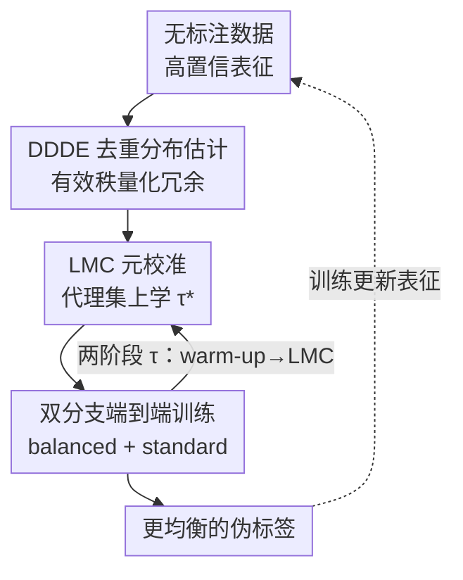

# CoLA: Co-Calibrated Logit Adjustment for Long-Tailed Semi-Supervised Learning

**会议**: ICLR2026  
**OpenReview**: [https://openreview.net/forum?id=pI9n8wAR80](https://openreview.net/forum?id=pI9n8wAR80)  
**代码**: 待确认  
**领域**: 半监督学习 / 长尾识别 / Logit Adjustment  
**关键词**: 长尾半监督, Logit Adjustment, 有效秩, 元学习, 伪标签

## 一句话总结
针对长尾半监督学习里 Logit Adjustment 的两块短板——「按频次计数高估头部类导致过度抑制」和「整体调整强度 $\tau$ 被当成固定超参、与类级调整脱节」——CoLA 用有效秩去重地估计无标注类分布（DDDE），再在一个镜像该分布的代理验证集上元学习出最优 $\tau$（LMC），在 4 个长尾基准上全面刷新 SOTA。

## 研究背景与动机

**领域现状**：长尾半监督学习（LTSSL）的核心难题是「确认偏置的恶性循环」——模型先在偏斜的有标注数据上学偏，再用这个偏斜模型给大量无标注数据打伪标签，偏置被层层放大，头部类越来越自信、尾部类被逐渐边缘化。当前主流解法是 Logit Adjustment（LA）：在预测 logit 上减去一个与类先验相关的偏移项，压头部、抬尾部，从而产出更均衡的伪标签。

**现有痛点**：LA 由两个分量组成——**类级调整**（按各类先验决定相对压制/鼓励的力度）和**整体调整**（一个标量 $\tau$ 统一控制偏移的整体幅度）。由于无标注数据的真实分布未知，准确调整很难。一类方法（CPE、Meta-Expert）干脆用一组预设的锚分布当代理，但现实里真实分布常落在锚之外就失效；另一类更精细的方法（ACR、TCBC）改成动态估计无标注分布，却踩进两个新坑。

**核心矛盾**：第一，动态估计普遍靠「对高置信预测做频次计数」，但头部类塞满了视觉高度相似的冗余样本，单纯计数会**高估头部类的实际占比**，进而把头部 logit 压得过狠（over-suppression），反而掉点。第二，也是更被忽视的，这些方法**把整体强度 $\tau$ 当成固定超参**，无视它和类级调整之间的耦合。作者的实证发现很反直觉：最优 $\tau$ 对估计出的分布和类别数高度敏感，甚至不随不平衡比 $\gamma_l$ 单调变化（CIFAR-10-LT 上 $\gamma_l=100$ 的最优 $\tau$ 反而大于 $\gamma_l=150$），一个写死的 $\tau$ 根本没法自适应。

**本文目标**：把 LA 的类级分量和整体分量**协同设计**——既要去掉频次计数的冗余偏差给出准确的类先验，又要让 $\tau$ 随这个先验自适应地学出来，并给出理论保证。

**切入角度**：头部类的冗余本质是「样本虽多但有效信息重复」，这正对应 Cui et al. 的「有效样本数」概念；而有效样本数可以用类表征矩阵的**有效秩（effective rank）**来量化。一旦有了去重后的准确分布，$\tau$ 就能在一个「长得像无标注分布」的代理验证集上通过元学习直接优化出来。

**核心 idea**：用有效秩做去重分布估计（DDDE）替代频次计数解决过度抑制，再把整体强度 $\tau$ 变成在镜像分布代理集上元学习的可学习参数（LMC），让类级与整体两个调整互相校准。

## 方法详解

### 整体框架
CoLA 建立在 FixMatch + 双分支（balanced branch / standard branch）这套 LTSSL 标准骨架上，要解决的就是「怎么给无标注数据打出更均衡的伪标签」。整体可以拆成两步串联再回灌训练：先用 **DDDE** 把无标注数据的类分布 $\hat{P}_{Y_u}(y)$ 去重地估准，再把这个分布喂给 **LMC**，让它构造一个代理验证集并元学习出最优整体强度 $\tau^\ast$；最后这套校准好的 logit 偏移项被用来生成伪标签，驱动端到端训练，训练得到的新表征又反过来让下一轮分布估计更准，形成正向闭环。balanced branch 上挂 DDDE 负责产出类均衡预测，standard branch 上挂 LMC 负责产出高质量伪标签；$\tau$ 用两阶段管理——warm-up 阶段先按 ACR 配置，等分布估计可靠后再交给 LMC 学习。

### 关键设计

**1. DDDE：用有效秩量化样本冗余，去掉头部类的虚高占比**

这一设计直击「频次计数高估头部类→过度抑制」的痛点。对每个类 $y$，先收集所有伪标签为 $y$、且置信度 $\|\sigma(z(\alpha(x^u)))\|_\infty$ 超过阈值 $\rho$ 的无标注样本表征 $\{z^y_j\}$，堆成特征矩阵 $Z_y \in \mathbb{R}^{d \times m_y}$，对它做 SVD 得到奇异值 $s_1,\dots,s_{m_y}$。把归一化奇异值谱当成概率分布 $p(i) = s_i / \sum_j s_j$（直观上 $p(i)$ 是「一单位特征方差落在第 $i$ 个主成分上的概率」），有效秩定义为该谱的香农熵的指数：

$$\mathrm{erank}(Z_y) = \exp\!\left(-\sum_{i=1}^{m_y} p(i)\log p(i)\right).$$

有效秩衡量的是「能量在各主方向上铺开的程度」：如果一个类的样本高度冗余（都长得像），能量会集中在少数主成分上、熵小、有效秩低；反之样本真正多样则有效秩高。于是把各类有效秩归一化就得到去重后的类分布

$$\hat{P}_{Y_u}(y) = \frac{\mathrm{erank}(Z_y)}{\sum_{k\in\mathcal{Y}}\mathrm{erank}(Z_k)}.$$

它比单纯数样本数更能反映「类的有效信息量」，从而避免把塞满相似样本的头部类压得过狠。

**2. LMC：把整体强度 $\tau$ 变成在镜像分布代理集上元学习的可学习参数**

针对「$\tau$ 被写死、和类级调整脱节」的痛点，LMC 不再手调 $\tau$，而是数据驱动地学。它先从有标注集 $D_l$ 里重采样构造一个代理验证集 $D_v$，使其边缘标签分布对齐估计出的 $\hat{P}_{Y_u}$——对每个样本 $(x^l_i, y_i)$ 赋予选择概率

$$P\big((x^l_i,y_i)\text{ 被选}\big) = \frac{\hat{P}_{Y_u}(y_i)/N_{y_i}}{\max_{y}\big(\hat{P}_{Y_u}(y)/N_y\big)},$$

分母做归一化保证概率不超过 1（一种拒绝采样，防止过采样），逐样本做伯努利试验后得到 $D_v$。然后在 $D_v$ 上最小化交叉熵来解出最优 $\tau$：

$$\tau^\ast = \arg\min_{\tau}\ \frac{1}{V}\sum_{i=1}^{V} L_{\mathrm{CE}}\big(y^v_i,\ \sigma(z(\alpha(x^v_i)) - \tau\cdot p)\big),$$

其中 $p = (\hat{P}_{Y_u}(1),\dots,\hat{P}_{Y_u}(K))$ 是估计出的去重类频向量。值得注意的是这里用的偏移项是**线性的 $-\tau\cdot p$**，而非原始 post-hoc LA 的对数形式 $-\tau\cdot\log\hat{P}_{Y_u}$。线性项（受 Mor & Carmon 2025 启发）避免了对极小估计概率的数值不稳定和过度惩罚，让优化更稳。因为 $D_v$ 是「照着无标注分布捏出来的」，在它上面学到的 $\tau^\ast$ 才真正适配当前数据特性，这也正是类级（DDDE 给的 $p$）和整体（$\tau$）两个调整互相校准的关键。

**3. 双分支端到端训练 + 两阶段 $\tau$ 调度**

DDDE 和 LMC 需要被装进一个能自洽运转的训练管线。CoLA 沿用 LTSSL 常见的双分支结构：**balanced branch** 上施加 DDDE，目标是产出类均衡的预测；**standard branch** 上施加 LMC，负责生成高质量伪标签。$\tau$ 的管理分两阶段——初始 warm-up 阶段模型还没学出可靠表征、有效秩估计噪声大，此时 $\tau$ 先按 ACR 的方式配置；等模型对类分布的估计稳定后，再切换到 LMC 学习最优 $\tau$ 并用于后续训练。这种「先借旧方法热身、再交给自己学」的调度，回避了冷启动阶段分布估计不准把 $\tau$ 带偏的风险。

**4. 泛化界：把 DDDE 的估计精度和 LMC 的可靠性理论上绑在一起**

为了说明两个组件不是各自为政，作者给 $\tau$ 参数化的分类器证了一个泛化界（Proposition 1）。在 Lipschitz/有界损失、$D_v$ 的边缘分布等于 $\hat{P}_{Y_u}$、有/无标注共享类条件分布、重要性权重有界这四条假设下，对任意 $\delta\in(0,1)$ 以至少 $1-\delta$ 概率有

$$R_{P_u}(h_\tau) \le \hat{R}_{D_v}(h_\tau) + |\hat{R}_{D_v,w}(h_\tau) - \hat{R}_{D_v}(h_\tau)| + 2B\cdot L\cdot \mathcal{R}_V(\mathcal{H}_\tau) + U\cdot B\sqrt{\tfrac{\log(1/\delta)}{2V}}.$$

第一项是代理集上的经验风险（正是 LMC 直接最小化的目标）；第二项 $|\hat{R}_{D_v,w}-\hat{R}_{D_v}|$ 度量代理分布和目标分布的差异——分布估得越准这一项越小、界越紧、$\tau^\ast$ 越可靠，这正说明 **DDDE 的精度直接决定 LMC 的成败**，把两个组件理论上连成一体。其中 $B$ 是重要性权重上界（要求 DDDE 不能严重低估任何类的真实占比），$\mathcal{R}_V(\mathcal{H}_\tau)$ 是假设空间的 Rademacher 复杂度。附录里还补了优化目标的凸性分析，保证梯度下降能收敛到唯一全局最优 $\tau^\ast$。

### 损失函数 / 训练策略
骨架沿用 FixMatch：有标注样本用标准交叉熵，无标注样本对强/弱增广 $A(x^u)/\alpha(x^u)$ 做一致性训练，只有弱增广预测置信度超过阈值 $\rho$ 才保留伪标签。CoLA 的改动在伪标签生成处把 logit 减去校准偏移 $\tau^\ast\cdot p$（而非原始 $\tau\cdot\log\hat{P}_{Y_u}$）。整体两阶段：warm-up 用 ACR 配置 $\tau$，之后由 LMC 在代理集 $D_v$ 上元学习 $\tau^\ast$。

## 实验关键数据

### 主实验
在 CIFAR-10/100-LT 上跨 5 种无标注分布（一致 CON / 均匀 UNI / 反转 REV / 中间 MID / 头尾 HT）对比，CoLA 全部取得最高准确率；在更难的 CIFAR-100-LT 上几乎所有设定都领先次优 1 个百分点以上。

| 数据集 | 分布 | CoLA | 次优（方法） | 提升 |
|--------|------|------|--------------|------|
| CIFAR-10-LT | REV | **85.61** | 85.03 (Meta-Expert) | +0.58 |
| CIFAR-10-LT | UNI | **83.66** | 83.12 (Meta-Expert) | +0.54 |
| CIFAR-100-LT | REV | **60.39** | 59.21 (ACR) | +1.18 |
| CIFAR-100-LT | CON | **59.04** | 58.31 (ACR) | +0.73 |
| STL-10-LT $(150,\gamma_l{=}10)$ | 未知 | **73.32** | 71.37 (Meta-Expert) | +1.95 |
| SIN-127 | $64{\times}64$ | **37.49** | 36.28 (ACR) | +1.21 |

STL-10-LT 的无标注分布未知、可能含 OOD 样本，CoLA 在全部设定都超过 LA 类次优方法（如 $N_1{=}150,\gamma_l{=}10$ 超 Meta-Expert 1.95%）；SIN-127 这种大规模数据集也照样领先，说明方法可扩展。

### 消融实验
在 CIFAR-10/100-LT 上拆解 DDDE 与 LMC：`w/o D-τ` 是去掉 DDDE 且 $\tau$ 固定为 1/2/4，`w/o D-L` 是只用 LMC（分布仍用频次计数），`w/ D-L` 是完整模型。

| 配置 | CIFAR-10-LT (1,10) | CIFAR-100-LT (1,100) | 说明 |
|------|------|------|------|
| w/o D-1 | 83.12 | 56.23 | 固定 $\tau{=}1$，无 DDDE |
| w/o D-2 | 83.56 | 55.41 | 固定 $\tau{=}2$，无 DDDE |
| w/o D-4 | 82.64 | 53.32 | 固定 $\tau{=}4$，无 DDDE |
| w/o D-L | 84.66 | 60.16 | 只用 LMC，频次计数 |
| **w/ D-L (Ours)** | **85.04** | **60.42** | 完整模型 |

### 关键发现
- **最优固定 $\tau$ 跨数据集不一致**：CIFAR-10-LT 上 $\tau{=}2$ 通常优于 $\tau{=}1$，CIFAR-100-LT 上趋势相反；而且 `w/o D-τ` 的最好成绩仍低于 `w/o D-L`，证实写死 $\tau$ 会让整体调整与类级调整冲突。
- **DDDE 不可或缺**：`w/o D-L` 全面低于 `w/ D-L`——当类级估计不准时，LMC 学到的 $\tau$ 会被误导，说明两个调整的交互是双向的。
- **分布估得更准**：在 NWGMA、MCA 等替代估计方法的对比中，DDDE 在所有场景都取得最小 L2 距离（估计分布 vs 真实分布），直接解释了伪标签质量为何更高。

## 亮点与洞察
- 把「头部类样本冗余」这个长尾老问题，重新表述成「类表征矩阵的有效秩」，用 SVD 谱熵一行公式量化「有效样本数」，比频次计数优雅且更准——这个去重视角可迁移到任何需要估计类先验的不平衡场景。
- 最有「啊哈」感的是揭示了 LA 里类级和整体两个调整**双向耦合**：不是先估准分布就够，也不是单独学 $\tau$ 就行，必须协同；并用泛化界把「分布估计精度」和「$\tau$ 可靠性」理论上绑成一条链。
- 用线性偏移 $-\tau\cdot p$ 替代对数偏移 $-\tau\cdot\log\hat{P}$ 的小改动，回避了极小概率类的数值不稳定，是个可直接复用的工程 trick。
- 「在镜像目标分布的代理验证集上元学习超参」是个通用范式——任何「超参对未知测试分布敏感」的问题都可以照搬这套构造代理集 + 元学习的思路。

## 局限与展望
- 有效秩需对每个类的表征矩阵做 SVD，类别数大或表征维度高时有额外计算开销（作者把时间复杂度分析放在附录 H）；冷启动阶段表征不可靠时还得借 ACR 热身，说明方法对初始表征质量有依赖。
- 泛化界依赖「有/无标注共享类条件分布」和「重要性权重有界（DDDE 不严重低估任何类）」两条假设，现实里 OOD 严重或极端罕见类时这些假设可能被违反，界的保证会变弱。
- 代理集 $D_v$ 从有标注集重采样而来，当某尾部类有标注样本极少时，重采样能覆盖的分布空间有限，$\tau$ 的元学习可能受样本量 $V$ 限制（界里 $\sqrt{\log(1/\delta)/2V}$ 一项也提示了这点）。
- 实验集中在图像分类基准，能否迁移到检测/分割等结构化预测的长尾半监督场景未验证。

## 相关工作与启发
- **vs ACR**：ACR 用双分支 + 到 3 个预设锚分布的距离决定 post-hoc LA 强度；CoLA 保留双分支但抛弃锚分布，改成有效秩动态去重估计 + 元学习 $\tau$，因此能处理落在锚之外的任意分布。CoLA 还在 warm-up 阶段复用 ACR 配置 $\tau$。
- **vs CPE / Meta-Expert**：它们靠一小撮离散预设锚分布（CPE 三个专家分类器、Meta-Expert 加门控选分类器）；CoLA 指出这类方法在分布偏移任意/不可预测时受限，用连续自适应估计取代离散锚。
- **vs 基于频次计数的动态估计**：传统动态估计单纯数高置信预测，忽略头部类冗余导致过度抑制；DDDE 用有效秩把「样本数」换成「有效样本数」，在 L2 距离上全面更准。
- **vs 原始 post-hoc LA (Menon et al.)**：原始 LA 用固定 $\tau$ + 对数类频偏移；CoLA 把 $\tau$ 变可学习、把对数偏移换成线性偏移，并补上泛化界与凸性分析的理论支撑。

## 评分
- 新颖性: ⭐⭐⭐⭐ 有效秩去重 + 整体强度元学习 + 揭示两调整双向耦合，组合新颖且抓到 LA 的真实痛点。
- 实验充分度: ⭐⭐⭐⭐⭐ 4 个基准 × 6 种分布、对比 18 种方法、消融拆到 DDDE/LMC 各自贡献，并比了多种分布估计的 L2 距离。
- 写作质量: ⭐⭐⭐⭐ 动机层层递进、图 1 把两个痛点讲得很清楚，公式与理论自洽；部分细节（如 warm-up 切换时机）下放附录。
- 价值: ⭐⭐⭐⭐ 在长尾半监督上稳定刷新 SOTA，有效秩去重和代理集元学习两个思路有较强可迁移性。

<!-- RELATED:START -->

## 相关论文

- [\[ICLR 2026\] Learning Dynamics of Logits Debiasing for Long-Tailed Semi-Supervised Learning](learning_dynamics_of_logits_debiasing_for_long-tailed_semi-supervised_learning.md)
- [\[CVPR 2026\] Trust-calibrated Collaborative Learning for Long-Tailed Visual Recognition](../../CVPR2026/self_supervised/trust-calibrated_collaborative_learning_for_long-tailed_visual_recognition.md)
- [\[ICLR 2026\] FedOpenMatch: Towards Semi-Supervised Federated Learning in Open-Set Environments](fedopenmatch_towards_semi-supervised_federated_learning_in_open-set_environments.md)
- [\[ICLR 2026\] GUIDE: Gated Uncertainty-Informed Disentangled Experts for Long-tailed Recognition](guide_gated_uncertainty-informed_disentangled_experts_for_long-tailed_recognitio.md)
- [\[ICLR 2026\] Mini-cluster Guided Long-tailed Deep Clustering](mini-cluster_guided_long-tailed_deep_clustering.md)

<!-- RELATED:END -->
