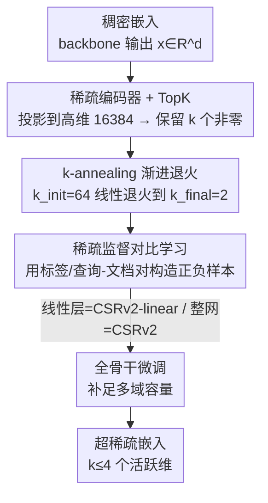

# CSRv2: Unlocking Ultra-Sparse Embeddings

**会议**: ICLR2026  
**OpenReview**: [https://openreview.net/forum?id=CTpQW4yMUL](https://openreview.net/forum?id=CTpQW4yMUL)  
**代码**: https://github.com/Y-Research-SBU/CSRv2  
**领域**: 自监督 / 表示学习  
**关键词**: 稀疏嵌入, 超稀疏, k-annealing, 监督对比学习, 检索效率

## 一句话总结
CSRv2 用「渐进 k 退火 + 稀疏监督对比 + 全骨干微调」三招把对比稀疏表示（CSR）推进到 $k\le 4$ 的超稀疏区间——死神经元从 80% 降到 20%，$k=2$ 时精度涨 14%，让"只激活 2 个维度"的嵌入达到 CSR 在 $k=8$、MRL 在 32 维时的水平，相对稠密嵌入拿到最高 300× 的算力/内存效率。

## 研究背景与动机
**领域现状**：大模型时代，嵌入质量直接决定下游检索/分类/推荐的上限，但主流仍是几千维（2k–8k）的稠密嵌入，存储、显存和推理延迟都很贵。为了压缩，业界有两条路线：MRL（Matryoshka Representation Learning）训练一套可在多个截断长度下工作的嵌入，用时直接取前 $m$ 维；CSR（Contrastive Sparse Representation）则反着来，把稠密嵌入映射到高维但只有 $k$ 个非零元的稀疏向量，检索时只需 $O(k)$ 的算力和内存。

**现有痛点**：CSR 在中等稀疏（$k=8,16,32$）时能逼近全维精度，但一旦进入 **超稀疏区间**（$k=2$ 或 $4$）就崩。这个区间本来最诱人——原理上能带来 100× 以上的检索效率，可现有方法在这里掉 20–40% 精度，根本没法用。

**核心矛盾**：作者拆出超稀疏失败的三个根因。其一，**大规模死神经元**：$k=2$ 时 85%+ 的隐藏神经元永久不激活，因为每个稀疏码只有被选中的 $k$ 维收到梯度，其余维一旦沉默就再也拿不到梯度信号，形成自我强化的死循环，表达力被锁死。其二，**预训练目标与下游错配**：CSR 靠纯自监督信号（如图像裁剪正样本），在只剩两三个活跃维时，噪声特征容易被激活、有用特征反而丢失。其三，**容量不足**：CSR 只在冻结骨干上训一个线性层，多数据集/多域联合训练时表达容量明显不够。

**本文目标**：超稀疏嵌入到底是天生受限，还是只是训练方法没到位？

**切入角度**：作者认为这三个问题都是「可修的」，而且修法应当像 CSR 一样简单通用，不引入新的训练目标。

**核心 idea**：用课程式的 k 退火稳住稀疏学习、用自然监督替换噪声自监督、用全骨干微调补足容量——三招合起来，第一次给出把现代嵌入压到只剩 2–4 个活跃维而精度只小幅下降的可靠配方。

## 方法详解

### 整体框架
CSRv2 不改变 CSR 的推理结构：骨干网络输出稠密嵌入 $x\in\mathbb{R}^d$，先过一个稀疏编码器把它投影到高维（如 16384 维），再用 TopK 算子只保留最大的 $k$ 个值、其余清零，得到 $k$-稀疏嵌入 $z$，检索时直接在稀疏向量上算相似度。CSRv2 的全部改动都落在**训练**上：在 CSR 原有的多 TopK 重构损失 + 辅助损失基础上，叠加三件事——把目标稀疏度 $k$ 从大到小**渐进退火**、把自监督对比换成**稀疏监督对比**、并允许**微调整个骨干**而不只是顶部线性层。

整套训练目标最终收敛成一行：

$$\mathcal{L}_{\text{CSRv2}} = \mathcal{L}(k_t) + \tfrac{1}{8}\mathcal{L}(4k_t) + \beta\,\mathcal{L}_{\text{aux}} + \gamma\,\mathcal{L}_{\text{SpSCL}}(k_t),$$

其中 $k_t$ 是第 $t$ 步退火后的稀疏度，$\mathcal{L}(k_t)+\tfrac18\mathcal{L}(4k_t)$ 是沿用 TopK SAE 的多稀疏重构损失（保证测试时能泛化到不同 $k$），$\mathcal{L}_{\text{aux}}$ 是抑制死神经元的辅助损失，$\mathcal{L}_{\text{SpSCL}}$ 是新的稀疏监督对比损失。论文区分两个变体：只微调顶部线性层的叫 **CSRv2-linear**，微调整个骨干的叫 **CSRv2**。

### 关键设计

**1. k-annealing 渐进退火：别一上来就逼到 2 维，先大后小养活神经元**

直接以 $k_{\text{final}}=2$ 训练会触发死神经元雪崩——只有被选中的 2 维有梯度，其余维永远训不到。CSR 自带的辅助损失和多 TopK 策略在中等稀疏（$k=32,64$）有效，但在超稀疏下基本失灵。CSRv2 借鉴模拟退火思路：训练前期用足够大的初始稀疏度 $k_{\text{init}}$（默认 64）热身，让模型先在宽松约束下学到一个有意义的隐空间、激活足够多样的神经元；随后用线性时间表把 $k$ 逐步退火到目标值：

$$k_t = (1-p_t)\,k_{\text{init}} + p_t\,k_{\text{final}},\qquad p_t = t/T,$$

实践中在前 70% 的训练里做退火，之后固定在 $k_{\text{final}}$。大 $k_{\text{init}}$ 鼓励探索和多样激活，渐进收紧则让表示逐步锐化、在超稀疏区稳定收敛。效果上，最终死神经元比例远低于直接用 $k_{\text{final}}$ 训练，各稀疏档的精度也一致提升。作者特意区分了和 LlamaScope 退火的不同：后者只在前 10% 训练里把 $k$ 从全维降到 50 是为了加速收敛、且只用于 SAE；CSRv2 是在大部分训练里退火、专门针对超稀疏的死神经元问题、并用于高效嵌入，动机和适用范围都不一样。

**2. 稀疏监督对比学习：把仅有的两三个活跃维让给下游真正需要的特征**

超稀疏下模型必须把有限的活跃维优先分给信息量大的特征、压住噪声，而 CSR 的自监督正样本（如裁剪）在下游任务需要训练时被忽略的属性时迁移很差。CSRv2 改用很多检索任务里天然就有的监督信号来构造更准的正负对——ImageNet 里同类两张图互为正样本，文本检索里查询-文档对天然是正样本——把 CSR 的自监督对比损失换成作用在 $k$-稀疏嵌入上的稀疏监督对比损失：

$$\mathcal{L}_{\text{SpSCL}}(k) = -\frac{1}{|B|}\sum_{i=1}^{|B|}\log\frac{\sum_{p\in P(i)} e^{z_i^\top z_p}}{\sum_{p\in P(i)} e^{z_i^\top z_p} + \sum_{n\in N(i)} e^{z_i^\top z_n}},$$

其中 $P(i)$、$N(i)$ 是由自然监督导出的正/负样本集：分类与聚类任务里同标签为正，检索与重排里查询与其文档为正，语义相似度里相似分 >3 的句对为正，句对分类里标签为 1 的强相关句对为正。t-SNE 可视化显示，加监督后稀疏特征在类间明显更可分，超稀疏设置下精度有清晰提升——本质是把"用哪两维"这件事和下游目标对齐了，而不再浪费在噪声特征上。

**3. 全骨干微调：解开"只训一个线性层"对多域容量的束缚**

CSR 的卖点之一是只训顶部线性层就能超过需要全微调的 MRL，但这层浅适配在多域联合训练时容量不足——图 4 显示 CSR-linear 在多域数据上各任务类型都明显掉点。CSRv2 沿用 MRL 的做法，把 TopK 算子作用在骨干输出上并微调整个网络，有效抹平了 linear 设置下的性能落差，恢复到接近"按域单独训练 CSR"的水平。代价是训练成本更高，但换来跨域泛化的显著提升：在相同训练条件下，全微调的 CSRv2 把性能-效率前沿往前推，绝对精度最高超过 MRL 25%。需要强调的是，这三招叠加后训练目标仍只有那一行式 (8)，没有引入任何额外损失项，保持了 CSR "简单通用"的本色。

### 损失函数 / 训练策略
最终目标即式 (8)：多稀疏重构 $\mathcal{L}(k_t)+\tfrac18\mathcal{L}(4k_t)$ + 辅助损失 $\beta\mathcal{L}_{\text{aux}}$ + 稀疏监督对比 $\gamma\mathcal{L}_{\text{SpSCL}}(k_t)$，其中 $k_t$ 按式 (6) 退火。推理时骨干输出先经编码器投影到高维（如 16384），保留 TopK 值、其余清零，且不做归一化。

## 实验关键数据

### 主实验
在 e5-Mistral-7B 骨干、相同数据与配置下，于 MTEB 六类任务上对比（检索时间相对 CSRv2@$k=2$ 归一，1M 库）。下表节选超稀疏档：

| 活跃维 $k$ | 方法 | 平均分 ↑ | 检索时间 |
|------|------|------|------|
| 4096（全维） | e5-Mistral-7B | 69.99 | 306.46× |
| 4 | MRL | 40.83 | 6.29× |
| 4 | CSR | 52.94 | 1.62× |
| 4 | CSRv2-linear | 58.62 | 1.65× |
| 4 | **CSRv2** | **61.01** | 1.63× |
| 2 | MRL | 33.81 | 6.20× |
| 2 | CSR | 44.33 | 1.01× |
| 2 | CSRv2-linear | 53.35 | 1.01× |
| 2 | **CSRv2** | **58.38** | 1.00× |

$k=2$ 时 CSRv2 平均 58.38，比 CSR（44.33）高 14 个百分点、比 MRL（33.81）高 24 个百分点，且检索时间是各方法里最低的；$k=4$ 时也比 CSR 高约 8 个点。摘要进一步报告：CSRv2 相对 CSR 在 $k=4$ 时文本/视觉各提升 7%/4%，$k=2$ 时拉大到 14%/6%；相对稠密嵌入最高带来 300× 算力/内存效率、相对 MRL 有 7× 加速。

| 数据集/模型 | 设置 | 结论 |
|--------|------|------|
| Qwen3-Embedding-4B (MTEB) | 原生支持 MRL | CSRv2-linear/CSRv2 在多个活跃维上取得第一/第二，全维（2560）下 CSRv2 平均也不输骨干 |
| ImageNet-1k (1-NN acc) | 视觉表示 | k-annealing 在各稀疏档一致提升精度，超稀疏区相对 CSR 提升更明显 |

### 消融实验

| 配置 | 关键现象 | 说明 |
|------|---------|------|
| CSR（直接 $k_{\text{final}}$ 训练） | $k=4$ 死神经元 ~70%，$k=2$ ~90% | 超稀疏崩塌的根因 |
| + k-annealing | $k=2$ 死神经元从 ~80% 降到 ~20% | 退火养活神经元，各档精度一致提升 |
| + 稀疏监督对比 | 超稀疏档精度明显提升，t-SNE 类间更可分 | 自然监督把活跃维让给有用特征 |
| + 全骨干微调（→ CSRv2） | 抹平多域 linear 的掉点 | 容量补足，最高超 MRL 25% |

### 关键发现
- **退火是超稀疏的命门**：直接逼到 $k=2$ 会触发死神经元雪崩（90%），而"先大后小"的课程式退火把它压到 20%，这是 CSRv2 最大单点收益。
- **监督信号在维度越少时越关键**：活跃维只剩两三个时，"把哪两维让给谁"必须由下游对齐的监督来决定，纯自监督会被噪声特征占用。
- **效率与精度同时拿**：$k=2$ 的 CSRv2 既是平均分最高，又是检索时间最低（1.00×），说明超稀疏并非"省得越多越差"，而是此前训练方法没到位。

## 亮点与洞察
- **把"死神经元"当成可训练性问题而非容量问题来治**：用模拟退火式的课程把梯度先铺到更多神经元上，再逐步收紧——这个"先探索后锐化"的思路可迁移到任何 TopK/稀疏激活的训练（SAE、MoE 路由、稀疏注意力）。
- **稀疏监督对比是"维度预算分配"的视角**：在极端稀疏下，对比学习的真正作用是决定有限活跃维的语义归属，监督信号让分配对齐下游，这比单纯堆数据更本质。
- **配方简单、零新增损失项**：三招叠加后目标函数仍是 CSR 那一行的小改，工程上几乎零迁移成本，还放出了 CSRv2 版的 Qwen3 / e5-Mistral-7B，落地友好。
- **重新界定了超稀疏嵌入的可行边界**：把"$k\le4$ 不可用"改写成"训练方法问题"，为边缘设备、机器人、实时搜索这类对内存/算力极敏感的场景打开了设计空间。

## 局限与展望
- **全骨干微调的成本**：CSRv2 的最强变体要微调整个骨干，训练开销和显存远高于 CSR 只训线性层；资源受限时只能退回 CSRv2-linear，跨域容量会打折。
- **依赖自然监督**：稀疏监督对比的收益建立在有标签/天然正负对（同类、查询-文档）之上，纯无监督或标签噪声大的场景下这一招能保留多少增益，文中未充分讨论。
- **退火超参的普适性**：$k_{\text{init}}=64$、退火占 70% 训练等设置是经验值，换骨干/换模态时是否需要重调、对最终死神经元率有多敏感，仍待更系统的分析。
- **极限稀疏的天花板**：即便修到 20% 死神经元，$k=2$ 相对全维仍有差距（58.38 vs 69.99），$k=1$ 这种更极端的区间能否同法攻克尚未验证。

## 相关工作与启发
- **vs MRL**：MRL 靠截断前 $m$ 维做自适应长度、需全微调，但维度降到百位以下表达力骤崩（$k=2$ 平均仅 33.81）；CSRv2 走高维稀疏路线，同样活跃维下精度大幅领先，且检索更快。
- **vs CSR（v1）**：CSR 在中等稀疏逼近全维，但超稀疏死神经元 80–90% 导致崩塌；CSRv2 在不增训练目标的前提下，用退火+监督+微调三招把它救活，是 CSR 的"超稀疏可用化"补丁。
- **vs LlamaScope 的 k-annealing**：二者都退火，但 LlamaScope 只在前 10% 训练里从全维退到中等稀疏、为加速收敛且仅用于 SAE；CSRv2 在大部分训练里退火、专攻超稀疏死神经元、用于高效嵌入，目标完全不同。
- **vs 普通监督对比（SupCon）**：CSRv2 把监督对比损失搬到 $k$-稀疏嵌入上（$\mathcal{L}_{\text{SpSCL}}$），关心的是有限活跃维的语义分配，而非稠密表示的整体可分性。

## 评分
- 新颖性: ⭐⭐⭐⭐ 不是全新框架，但把"超稀疏不可用"诊断成三个可修的训练问题并逐一对症，视角清晰、贡献扎实
- 实验充分度: ⭐⭐⭐⭐⭐ 覆盖文本（MTEB 六类、Qwen3 / e5-Mistral-7B / SPLADEv3 / GraphRAG）与视觉（ImageNet-1k），含死神经元、t-SNE、多域消融
- 写作质量: ⭐⭐⭐⭐ 问题拆解—对症下药—统一目标的结构很顺，公式与图表自洽
- 价值: ⭐⭐⭐⭐⭐ 把极端稀疏嵌入做到"可用"，对大规模检索与边缘部署有直接落地意义，且开源了增强版主流嵌入模型

<!-- RELATED:START -->

## 相关论文

- [\[ICLR 2026\] Temporal Slowness in Central Vision Drives Semantic Object Learning](temporal_slowness_in_central_vision_drives_semantic_object_learning.md)
- [\[ICLR 2026\] Disentangled representation learning through unsupervised symmetry group discovery](disentangled_representation_learning_through_unsupervised_symmetry_group_discove.md)
- [\[ICLR 2026\] Bayesian Test-Time Adaptation via Dirichlet feature projection and GMM-Driven Inference for Motor Imagery EEG Decoding](bayesian_test-time_adaptation_via_dirichlet_feature_projection_and_gmm-driven_in.md)
- [\[ICLR 2026\] Boosting Open Set Recognition Performance through Modulated Representation Learning](boosting_open_set_recognition_performance_through_modulated_representation_learn.md)
- [\[ICLR 2026\] PonderLM: Pretraining Language Models to Ponder in Continuous Space](ponderlm_pretraining_language_models_to_ponder_in_continuous_space.md)

<!-- RELATED:END -->
