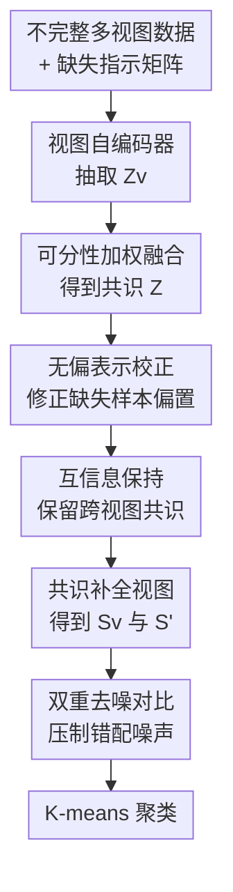

# Debiased and Denoised Representation Learning for Incomplete Multi-view Clustering

**会议**: ICLR2026  
**OpenReview**: [https://openreview.net/forum?id=Bp3I456do5](https://openreview.net/forum?id=Bp3I456do5)  
**代码**: 待确认  
**领域**: 自监督 / 表示学习  
**关键词**: 不完整多视图聚类、去偏表示、去噪对比学习、共识表示、视图补全  

## 一句话总结
这篇论文提出 DDR-IMVC，用完整视图样本学到的无偏共识表示去校正缺失视图样本的偏置表示，再用截断 InfoNCE 形式的鲁棒对比学习压住补全噪声，在多个不完整多视图聚类数据集上取得更稳定的聚类结果。

## 研究背景与动机
**领域现状**：多视图聚类希望把同一对象的不同特征来源合在一起，例如一张图像可以同时有颜色、纹理、轮廓等视图。完整多视图聚类默认每个样本所有视图都齐全，模型可以直接对齐跨视图语义并学习共识表示；但真实采集或存储过程中，某些样本常常缺一部分视图，因此不完整多视图聚类（IMVC）要在视图缺失的条件下仍然恢复稳定的簇结构。

**现有痛点**：一类方法直接补原始数据，比如用 GAN、原型匹配或图传播生成缺失视图。这条路线直观，但代价高，而且原始视图的恢复本身很难，一旦补错就把噪声带进聚类。另一类方法改在特征空间补表示，复杂度低很多，也更贴近聚类目标；问题是它们往往只关心“有没有补上”，没有处理完整样本和缺失样本融合后的分布差异。

**核心矛盾**：缺失视图不是简单少了一块输入，而是会改变共识表示的来源分布。完整样本的共识表示由所有视图共同决定，缺失样本的共识表示只能从可见视图估计出来，两者天然存在 distribution shift。若直接把这两类表示放到同一个对比学习或聚类空间里，模型可能把缺失带来的偏置当成语义差异，进一步造成跨视图错配和聚类结构噪声。

**本文目标**：作者把问题拆成两步：先让缺失样本的共识表示向完整样本的“无偏”表示空间靠拢，减少由缺失视图导致的分布偏移；再在完成视图表示补全后，避免补全噪声被普通对比学习放大，尤其要降低聚类坍塌和噪声过拟合的风险。

**切入角度**：论文的关键观察是，完整样本虽然不一定与某个缺失样本同类，但它们提供了更可靠的跨视图共识分布。与其盲目生成缺失视图，不如让缺失样本根据自身可见信息去“检索”与自己语义相近的完整样本表示，用这些无偏表示作为校正方向。同时，对比学习不应无条件强调 hard samples，因为在 IMVC 里 hard sample 可能只是由补全错误或视图错配制造出的噪声。

**核心 idea**：用完整样本的无偏共识表示通过注意力机制修正缺失样本的偏置表示，再用截断幂级数形式的鲁棒对比损失替代过于激进的 InfoNCE，从“去偏”和“去噪”两侧共同学习可聚类的共识表示。

## 方法详解

### 整体框架
DDR-IMVC 的输入是不完整多视图数据和对应的视图缺失指示矩阵，输出是用于 K-means 的聚类友好表示。它先用每个视图独立的自编码器抽取视图特定表示，再按视图可分性自适应融合成共识表示；随后把完整样本的共识表示视作无偏表示，把缺失样本的共识表示视作偏置表示，用多头注意力从无偏表示中抽取校正信息，最后通过互信息约束和双重对比学习得到去偏、去噪后的表示。

这个流程里，视图自编码器和最后的 K-means 更像脚手架；真正的贡献集中在三个位置：基于可分性的共识融合、用无偏表示校正偏置表示、以及把普通对比学习改造成更耐噪声的双重对比约束。论文把最终训练目标写成重构损失、最大互信息损失和双重对比损失的组合，推理阶段则直接对最终表示 $S'$ 做 K-means。

### 关键设计
**1. 可分性加权融合：不是平均拼视图，而是让更有簇结构的可见视图说话更多**

多视图缺失时，简单平均所有可见视图会把“视图是否存在”和“视图是否有用”混在一起。DDR-IMVC 先为每个视图训练独立自编码器，把第 $v$ 个视图编码为 $Z^v=E^v_\theta(X^v)$，同时用解码器重构原输入，保证单视图表示不完全脱离原始结构。随后它不直接平均 $Z^v$，而是用完整样本在各视图上的表示方差来估计该视图的聚类可分性：簇分得越开的视图，在相关维度上通常有更大的离散程度。

具体地，第 $i$ 个样本在第 $v$ 个视图上的权重写作 $W_{iv}=\operatorname{Var}(Z_C^v) / \sum_{v'=1}^V M_{iv'}\operatorname{Var}(Z_C^{v'})$，其中 $M_{iv'}$ 表示该样本的第 $v'$ 个视图是否可见。这样一来，缺失视图不会进入分母，可见但区分度低的视图也不会被过度信任。共识表示为 $z_i=\sum_{v=1}^V W_{iv}z_i^v$。这个设计的意义在于，后续所有去偏和去噪操作都发生在共识空间里；如果一开始的共识空间被低质量视图拖偏，后面的注意力校正也会缺少可靠锚点。

**2. 无偏表示校正：用完整样本的共识分布修正缺失样本的分布偏移**

论文把融合后的共识表示 $Z$ 分成两部分：所有视图都存在的样本形成无偏表示 $Z_u$，至少缺失一个视图的样本形成偏置表示 $Z_b$。这里的“无偏”不是统计意义上的绝对无偏，而是相对于缺失样本而言，完整样本拥有更完整的跨视图语义来源，因此更适合作为校正缺失样本的参考分布。

校正过程用多头注意力完成。第 $l$ 个注意力头先计算缺失样本表示与完整样本表示之间的 affinity：$A^{(l)}=\operatorname{Softmax}(Z_bW_Q^{(l)}(Z_uW_K^{(l)})^\top / \sqrt{d/L})$。然后用这个注意力权重从完整样本表示中聚合校正项 $B^{(l)}=A^{(l)}(Z_uW_R^{(l)})$，所有头拼接后得到 $B=[B^{(1)},\ldots,B^{(L)}]$。最终的 shift-corrected consensus representation 写成 $S=[Z_u; Z_b]+[0;B]$：完整样本保持原表示，缺失样本额外加上从完整样本中检索来的校正向量。

这比直接拿最近邻补特征更柔和。注意力不是硬选一个完整样本，而是在完整样本池里学习一个语义加权组合；校正项也不替换掉缺失样本本身，而是作为残差注入 $Z_b$。因此模型既保留了缺失样本可见视图中的个体信息，又把它拉回完整样本形成的共识分布附近。

**3. 互信息保持与共识补全：让校正后的表示既对齐完整视图，又能反哺缺失视图表示**

只做注意力校正还不够，因为校正后的 $S$ 需要真的保留多视图共享语义，而不是学成一个只会平滑缺失样本的中间变量。DDR-IMVC 在完整样本上最大化校正后共识表示 $S_C$ 与各视图表示 $Z_C^v$ 的互信息，并加入熵正则，损失写为 $L_{MMI}=-\sum_{v=1}^V(I(S_C;Z_C^v)+\alpha(H(S_C)+H(Z_C^v)))$。负号表示训练时最小化该项，相当于鼓励 $S_C$ 与每个视图共享尽量多的聚类相关信息。

之后，模型用共识表示去补全各视图的缺失表示：$S^v=Z^v+(1-\tilde{M}^v)\odot S$。如果某个样本在第 $v$ 个视图可见，就保留原本的 $Z^v$；如果不可见，就用校正后的共识表示 $S$ 填入。再用同样基于方差的权重把补全后的各视图表示融合为最终表示 $S'$。这一步把“用完整样本校正缺失样本”的结果重新注入到各视图层面，避免模型只在一个抽象共识空间里对齐，而无法形成可用于跨视图对比和最终聚类的完整表示。

**4. 截断鲁棒对比：限制噪声 hard sample 对训练的支配**

DDR-IMVC 的对比学习分两部分。第一部分是常规跨视图对比：同一样本在不同视图的表示构成正样本，不同样本构成负样本，从而缓解多视图异质性。第二部分才是论文更有特色的去噪设计：在共识表示 $S$ 和补全后的视图表示 $S^v$ 之间做鲁棒对比，防止补全噪声被 InfoNCE 过度放大。

作者从 InfoNCE 的幂级数展开出发。令 $f(s_i,s_j)=\exp(\operatorname{sim}(s_i,s_j)/\tau)/\sum_n\exp(\operatorname{sim}(s_i,s_n)/\tau)$，普通 InfoNCE 的 $-\log f(s_i,s_i^v)$ 可以展开成 $\sum_{c=1}^{\infty}(1-f(s_i,s_i^v))^c/c$。其中第一项近似对应 MAE 式的均匀惩罚，更抗噪；无限多高阶项则会给 hard sample 更大权重，但在 IMVC 里 hard sample 可能恰恰是错配或补全噪声。DDR-IMVC 因此截断到前 $C$ 项：$L_r=\frac{1}{N}\sum_{v=1}^V\sum_{i=1}^N\sum_{c=1}^C(1-f(s_i,s_i^v))^c/c$。当 $C=1$ 时它接近 MAE，$C\to\infty$ 时退化为 InfoNCE；取中间值可以在判别性和抗噪声之间做连续调节。

### 一个完整示例
假设一个三视图图像数据集里，某个样本只剩下颜色视图和纹理视图，轮廓视图缺失。传统特征补全方法可能先尝试生成轮廓视图，或者直接用颜色、纹理的平均表示代替完整多视图表示；如果颜色视图恰好对某些类别区分度不高，这个样本就容易被拉到错误簇附近。

DDR-IMVC 会先分别编码三个视图，并根据完整样本中各视图的方差估计“谁更能分簇”。如果纹理视图在完整样本上能把类别分得更开，它在该样本的共识表示里会得到更高权重；缺失的轮廓视图不会参与加权。接着，这个样本的偏置共识表示 $z_b$ 会作为 query，去完整样本的无偏表示池 $Z_u$ 中寻找相似语义的参考样本。注意力可能发现若干完整样本在颜色和纹理组合上都接近它，于是聚合这些完整样本的共识表示，形成校正向量 $B$，把原来的 $z_b$ 修正为 $s_b=z_b+B$。

训练时，如果补全后的轮廓表示与共识表示不一致，跨视图对比会推动它们靠近；但如果这种不一致来自错误补全，鲁棒对比损失不会像普通 InfoNCE 那样无限放大该 hard case，而是通过截断项限制梯度。最终，模型得到的 $S'$ 更像“保留可见视图证据 + 借完整样本分布校正 + 不被噪声样本牵着走”的聚类表示。

### 损失函数 / 训练策略
总目标由三部分组成：$L_{all}=L_{REC}+\lambda_1L_{MMI}+\lambda_2L_{DCL}$。其中 $L_{REC}=\sum_v\lVert X^v-\hat{X}^v\rVert_2^2$ 负责训练每个视图的自编码器；$L_{MMI}$ 让完整样本上的校正共识表示与各视图表示保持共享信息；$L_{DCL}=L_c+L_r$ 同时包含跨视图对比和鲁棒共识对比。

实现细节上，论文使用 Adam 优化，编码器维度为 $D_v$-1024-1024-1024-128，解码器与编码器对称；多头注意力头数 $L=4$，熵正则系数 $\alpha=10$，鲁棒对比截断系数 $C=9$。训练完成后，不再额外学习聚类头，而是直接在最终融合表示 $S'$ 上运行 K-means 得到 $K$ 个簇。

## 实验关键数据

### 主实验
论文在 HandWritten、Scene-15、ALOI-100、LandUse-21 四个数据集上评估，指标包括 ACC、NMI、ARI，缺失率覆盖 0.1、0.3、0.5、0.7。下面摘取每个数据集在代表性缺失率下的结果，重点看 DDR-IMVC 相比强基线是否在复杂场景和高缺失场景中保持优势。

| 数据集 | 缺失率 | 指标 | 本文 DDR-IMVC | 之前最好/强基线 | 提升或差距 |
|--------|--------|------|---------------|-----------------|------------|
| Scene-15 | 0.3 | ACC / NMI / ARI | 45.53 / 45.99 / 28.05 | APADC 41.80 / DCP 43.10 / ProImp 25.28 | ACC +3.73，NMI +2.89，ARI +2.77 |
| LandUse-21 | 0.3 | ACC / NMI / ARI | 28.02 / 33.49 / 14.27 | DCP 27.08 / Completer 32.64 / DCP 13.80 | ACC +0.94，NMI +0.85，ARI +0.47 |
| ALOI-100 | 0.5 | ACC / NMI / ARI | 69.87 / 82.34 / 58.09 | ICMVC 67.68 / 78.92 / 53.92 | ACC +2.19，NMI +3.42，ARI +4.17 |
| HandWritten | 0.3 | ACC / NMI / ARI | 96.15 / 91.49 / 91.21 | GHICMC 96.11 / 91.32 / 90.83 | 小幅领先：+0.04 / +0.17 / +0.38 |

在 Scene-15 上，作者报告 DDR-IMVC 相比第二名平均提升约 ACC 3.56%、NMI 1.92%、ARI 2.86%，说明去偏和去噪对复杂场景数据较有帮助。ALOI-100 是大规模对象图像数据集，GHICMC 因内存消耗在该数据集上 OOM，而 DDR-IMVC 仍能完整运行，并在 0.1 到 0.7 缺失率下都领先 ICMVC、DIMVC 等方法。

不过，HandWritten 在高缺失率下出现一个反例：缺失率 0.5 时 DDR-IMVC 的 ACC / NMI / ARI 为 94.34 / 88.38 / 87.87，低于 GHICMC 的 94.88 / 89.16 / 89.10；缺失率 0.7 时 DDR-IMVC 为 90.86 / 82.65 / 81.92，也低于 GHICMC 的 92.73 / 85.85 / 84.71。作者认为 HandWritten 类间结构相对简单，高缺失率下级联图传播恢复数据更占优势；这也说明 DDR-IMVC 的优势更明显地体现在复杂、多视图互补性更强或大规模场景中。

### 消融实验
论文在 LandUse-21 和 Scene-15、缺失率 0.3 下做消融。表中 $L_{REC}$ 是重构，自适应校正和互信息部分主要体现在 $L_{MMI}$，双重去噪对比对应 $L_{DCL}$（原文表头写作 FDCL，结合方法公式应理解为 dual contrastive learning 相关项）。

| 配置 | LandUse-21 ACC / NMI / ARI | Scene-15 ACC / NMI / ARI | 说明 |
|------|----------------------------|---------------------------|------|
| $L_{REC}+L_{MMI}$ | 17.54 / 22.97 / 6.08 | 36.06 / 43.69 / 21.88 | 有共识信息约束，但缺少去噪对比，判别性不足 |
| $L_{REC}+L_{DCL}$ | 24.16 / 26.09 / 11.06 | 41.96 / 40.00 / 25.94 | 有对比约束，但缺少互信息/校正后的共识保持 |
| 仅 $L_{REC}$ | 16.78 / 17.96 / 5.63 | 21.53 / 21.61 / 11.48 | 只学自编码器，无法解决缺失视图导致的偏置和错配 |
| 完整模型 | 28.02 / 33.49 / 14.27 | 45.53 / 45.99 / 28.05 | 去偏校正、互信息保持和去噪对比同时生效 |

从消融看，单靠自编码器几乎不能完成 IMVC；加入双重对比后 Scene-15 的 ARI 从 11.48 提升到 25.94，说明跨视图一致性和共识对比是主要收益来源之一。完整模型相对 $L_{REC}+L_{DCL}$ 又进一步把 LandUse-21 的 ACC 从 24.16 提到 28.02，说明无偏表示校正和互信息保持不是装饰项，而是能改善缺失样本的共识分布。

### 关键发现
- DDR-IMVC 在复杂数据集上更稳。Scene-15 和 ALOI-100 的结果显示，随着缺失率升高，许多方法的性能明显下滑，而 DDR-IMVC 的下降更缓，说明从完整样本中学习校正方向比直接依赖缺失样本自身更可靠。
- 鲁棒对比损失的价值在于“少信一点 hard sample”。论文对 $L_r$ 及其梯度的分析表明，$C=1$ 时类似 MAE，所有样本权重接近；$C\to\infty$ 时变回 InfoNCE，噪声 hard sample 会获得很大梯度。截断系数 $C$ 给了模型一个中间形态，让它既能区分正负样本，又不被错配噪声主导。
- 参数敏感性显示 $\lambda_1$ 和 $\lambda_2$ 太大或太小都不理想，作者建议范围在 1 到 10。收敛曲线显示四个数据集在 0.3 缺失率下损失和聚类指标都能趋于稳定。
- t-SNE 可视化在 HandWritten 0.5 缺失率下展示了更清晰的嵌入结构，直观支持“校正缺失样本分布偏移有助于恢复共同簇结构”这一解释。

## 亮点与洞察
- 把 IMVC 的核心问题从“缺什么就补什么”转成“缺失导致分布偏移，先校正表示”。这个视角很实用，因为很多任务中生成缺失模态都比学习一个可用的共识空间更难，特征空间校正往往是更轻量的选择。
- 完整样本和缺失样本的角色划分很清楚。完整样本不只是训练数据的一部分，而是用来提供无偏共识分布的 anchor；缺失样本则通过注意力从这个 anchor 池里获得校正方向。这比把所有样本一视同仁地做对齐更符合 IMVC 的数据结构。
- 截断 InfoNCE 的思路可以迁移到其他有伪标签、补全或跨模态错配噪声的任务。只要 hard sample 中混有噪声，普通 InfoNCE 的强惩罚都可能有副作用；用 $C$ 控制从 MAE 到 InfoNCE 的连续过渡，是一个简单但可解释的鲁棒化手段。
- 方法没有额外设计复杂聚类头，而是把训练重点放在表示质量上，最后用 K-means。对无监督聚类论文来说，这种设置让结果更容易归因：性能提升主要来自表示学习，而不是后处理聚类模块。

## 局限与展望
- 方法依赖完整样本作为无偏参考池。如果某个数据集完整样本极少，或者完整样本本身分布与缺失样本存在选择偏差，那么 $Z_u$ 未必能代表理想共识分布，注意力校正可能会把缺失样本拉向错误区域。
- 论文主要在经典特征型多视图数据集上验证，包括 HandWritten、Scene-15、ALOI-100、LandUse-21。对于现代大规模多模态数据，例如图文、音视频或医学多模态，视图语义差异更大，缺失机制也更复杂，DDR-IMVC 的可扩展性还需要进一步实验。
- 鲁棒对比中的截断系数 $C$ 固定为 9，虽然论文给出了梯度解释和参数分析，但不同数据集的噪声水平可能不同。未来可以考虑让 $C$ 随训练阶段或样本置信度自适应变化，早期更保守，后期逐步增强判别性。
- 当前方法仍需要 K-means 作为最后一步，并默认聚类数 $K$ 已知。真实无监督场景中，类别数未知或簇规模极不均衡时，表示质量之外还需要更稳健的簇数估计和聚类后处理。
- 消融表把互信息校正和注意力校正的贡献没有完全拆开。若能分别去掉注意力校正、互信息约束、方差加权融合，会更清楚地说明每个子模块的独立作用。

## 相关工作与启发
- **vs Completer / DCP**: Completer 和 DCP 代表信息论或对比预测路线，重点在跨视图一致性和缺失视图预测。DDR-IMVC 同样使用对比和互信息思想，但额外显式建模完整样本与缺失样本之间的分布偏移，因此更强调“先去偏，再对比”。
- **vs DSIMVC / GHICMC**: 图传播类方法通过邻域结构恢复缺失视图或传递语义信息，在简单数据和高缺失率下可能很强，例如 GHICMC 在 HandWritten 高缺失率上领先。DDR-IMVC 的不同点是避免构建高成本级联图，转而在共识表示空间中用注意力校正，因而在 ALOI-100 这类大规模数据上更容易运行。
- **vs ProImp / prototype-based IMVC**: 原型方法通过学习类别或语义原型来补全缺失信息，优点是结构明确，但原型错配会影响补全。DDR-IMVC 不显式学习固定原型，而是从完整样本的无偏表示池中动态聚合校正信息，适合样本结构更细或簇内变化较大的场景。
- **对自监督表示学习的启发**: 这篇论文提醒我们，在缺失模态或不完整视图场景中，对比学习的正负样本构造不能只看样本身份，还要考虑表示是否被缺失机制污染。把“样本是否完整”作为训练信号的一部分，可能比统一套一个 InfoNCE 更稳。

## 评分
- 新颖性: ⭐⭐⭐⭐☆ 把完整样本作为无偏校正源、并用截断 InfoNCE 做去噪，对 IMVC 场景比较贴切，但核心模块仍基于常见的自编码器、注意力和对比学习组合。
- 实验充分度: ⭐⭐⭐⭐☆ 四个数据集、四档缺失率、九个基线和消融分析较完整；不足是模块拆解还可以更细，现代多模态大数据验证较少。
- 写作质量: ⭐⭐⭐⭐☆ 方法公式和训练流程清楚，鲁棒对比损失的推导有解释力；部分实验表述里表头命名和组件对应略显粗糙，需要读者结合公式理解。
- 价值: ⭐⭐⭐⭐☆ 对不完整多视图聚类和含缺失模态的自监督表示学习都有参考价值，尤其是“用完整样本去偏 + 截断对比抗噪”的组合思路可迁移性较强。

<!-- RELATED:START -->

## 相关论文

- [\[ICLR 2026\] Unified and Efficient Multi-view Clustering from Probabilistic Perspective](unified_and_efficient_multi-view_clustering_from_probabilistic_perspective.md)
- [\[ICLR 2026\] Relationship Alignment for View-aware Multi-view Clustering](relationship_alignment_for_view-aware_multi-view_clustering.md)
- [\[ICLR 2026\] Uncover Underlying Correspondence for Robust Multi-view Clustering](uncover_underlying_correspondence_for_robust_multi-view_clustering.md)
- [\[ICLR 2026\] Incomplete Multi-View Multi-Label Classification via Shared Codebook and Fused-Teacher Self-Distillation](incomplete_multi-view_multi-label_classification_via_shared_codebook_and_fused-t.md)
- [\[ICLR 2026\] Equivariant Splitting: Self-supervised learning from incomplete data](equivariant_splitting_self-supervised_learning_from_incomplete_data.md)

<!-- RELATED:END -->
