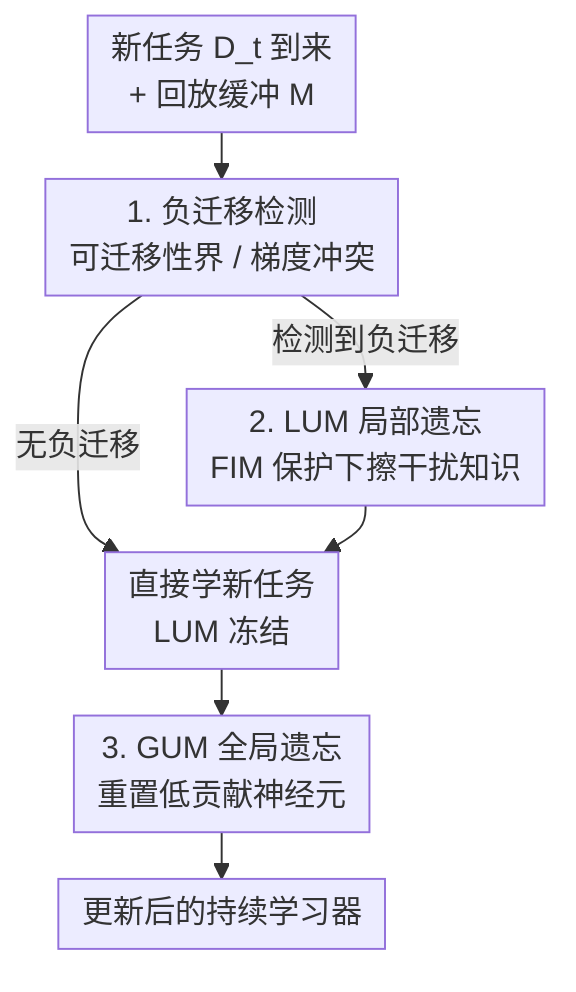

# Detect, Decide, Unlearn: A Transfer-Aware Framework for Continual Learning

**会议**: ICLR 2026  
**OpenReview**: [https://openreview.net/forum?id=Lej4WvdpFE](https://openreview.net/forum?id=Lej4WvdpFE)  
**代码**: 无  
**领域**: 持续学习 / 自监督表示学习  
**关键词**: 持续学习, 负迁移, 机器遗忘, 梯度冲突, 可迁移性界

## 一句话总结
针对持续学习里"记住过时知识反而拖累新任务"的负迁移问题，本文提出 DEDUCE 框架，先用可迁移性界或梯度冲突分析**检测**负迁移、再**决定**是否触发遗忘，最后用 batch 级的局部遗忘（LUM）+ 网络级的全局遗忘（GUM）**选择性地擦掉干扰性旧知识**，作为即插即用增强能挂在 9 种 CL 基线上、平均涨点最高 4.55%。

## 研究背景与动机
**领域现状**：持续学习（Continual Learning, CL）要让模型从数据流中不断学新任务，主流研究几乎都围着"灾难性遗忘"（catastrophic forgetting, CF）打转——基于记忆回放、基于架构、基于正则化三类方法，核心思路都是**尽量保留**旧知识。

**现有痛点**：这些方法默认"旧知识越多越好"，却忽略了一个反向的麻烦——**记住过时、无关的旧知识会主动干扰新任务的学习**。作者用辅助驾驶系统举例：如果死死记着过去的光照条件，反而会妨碍学习新的交通模式。在 CL 里这表现为**负迁移**（negative transfer）：新旧任务冲突时，前向迁移（学新任务）和后向迁移（保旧任务）一起退化，两头都学不好。

**核心矛盾**：一边是"保留知识防遗忘"，一边是"过时知识造成任务干扰"——单纯保留和单纯遗忘都不对，关键在于**遗忘什么**。已有的机器遗忘（Machine Unlearning, MU）工作证明擦掉特定数据/领域知识能提升泛化，但它们几乎都不回答"**何时**该遗忘"，盲目遗忘又会把有用信息一起丢掉，限制正迁移。

**切入角度**：作者从神经科学找灵感——人脑在新旧经验冲突时会**主动遗忘无关信息**来减少干扰、支持知识迁移。于是把 CL 重新放进迁移学习范式：旧任务=源域、新任务=目标域，用迁移学习的理论工具去判断"这次迁移是不是负的"。

**核心 idea**：把"选择性遗忘"嵌进持续学习的训练循环——**先检测负迁移、再决定是否遗忘、最后只擦掉那些会冲突的干扰性旧知识**，从而同时改善前向和后向迁移，而不是一味保留。

## 方法详解

### 整体框架
DEDUCE（**DE**tect, **D**ecide, **U**nlearn in **C**ontinual l**E**arning）的输入是一串任务数据流 $D=\{D_1,\dots,D_T\}$ 加一个回放缓冲 $M$，输出是一个能在每个新任务到来时**自适应决定要不要遗忘**的持续学习器。整条流水线就是把名字里的三步走一遍：每当新任务 $t$ 到来，先**检测**它和旧任务之间是否存在负迁移（两条互补策略二选一）；若检测为"有负迁移"，就**激活局部遗忘模块 LUM**，在学这个 batch 之前先把干扰性旧知识擦掉，再正常学新任务、随机回放旧样本；若检测为"无负迁移"，LUM 保持冻结，直接学。与此同时，**全局遗忘模块 GUM** 在整个训练过程中持续运行，周期性重置贡献低的神经元、腾出网络容量。

把它拆成"检测→决策→局部遗忘 + 全局遗忘"四个环节，正好对应下面四个关键设计。

### 关键设计

**1. 可迁移性界：用域适应理论判断"这次迁移值不值"**

针对"不知道何时该遗忘"这个痛点，作者把 CL 套进迁移学习框架——旧任务当源域 $X_S$、新任务当目标域 $X_T$——借 Ben-David 的域适应误差界来**估计目标域误差的上界**，再拿这个上界和真实目标测试误差比：如果实际误差超过了上界，就说明从旧任务到新任务的迁移是"负"的，该触发遗忘。理论上目标误差被界为 $E_T(h)\le E_S(h)+\tfrac{1}{2}d_{H\Delta H}(X_S,X_T)+\lambda$，但其中理想联合假设误差 $\lambda$ 不可直接算，于是用三个可估量近似：源域误差 $\hat{E}_S(h)$（在旧任务上评估）、源目标分布散度 $\hat{d}_{H\Delta H}$、以及源模型到目标的可迁移性 $\hat\lambda$。

散度部分训练一个域分类器 $h_d$ 去区分样本来自源还是目标，用它的测试误差 $\hat\epsilon(h_d)$ 近似 $\hat{d}_{H\Delta H}(X_S,X_T)=2|1-2\hat\epsilon(h_d)|$——分类器越分得开、分布偏移越大、负迁移风险越高。可迁移性 $\hat\lambda$ 则用 **LEEP 分数**（Log Expected Empirical Prediction）当代理：

$$E(f_{\theta_S},X_T)=\frac{1}{n}\sum_{i=1}^{n}\log\sum_{y_s\in Y_S}P(y_i|y_s)P(y_s|x_i)$$

LEEP 衡量源模型预测的标签分布和目标域有多吻合，值恒为负、绝对值越小越可迁移，近似 $\hat\lambda\approx c|E(f_{\theta_S},X_T)|$。三项合起来得到可操作的迁移性界代理 $E_T(h)\le\hat{E}_S(h)+|1-2\hat\epsilon(h_d)|+c|E(f_{\theta_S},X_T)|$。它把 LEEP 从离线迁移分析挪到 CL 的任务级兼容性估计，是个相对粗粒度但全局的判断。

**2. 梯度冲突分析：online 场景下的实时负迁移信号**

可迁移性界要算目标误差，得对任务数据完整跑一遍（一个 epoch），这在严格 online CL（每个样本只过一次、决策要即时）里行不通。于是作者补了一条**互补**策略：直接比当前 mini-batch 的梯度和旧任务梯度方向是否冲突。直觉是——当新任务的类别和旧类别不相交时，新任务梯度往往和旧任务梯度对着干，硬更新就会造成双向负迁移。基于缓冲 $M$ 上的旧任务损失 $L(f_\theta,M)=\frac{1}{|M|}\sum_{(x,y)\in M}L(f_\theta(x),y)$，定义**负可迁移性**：对某个容忍度 $\epsilon\in[-1,0]$，若

$$\langle\nabla L(f_\theta,M),\nabla L(f_\theta,D_t)\rangle\le\epsilon\|\nabla L(f_\theta,M)\|_2\|\nabla L(f_\theta,D_t)\|_2$$

则判定新任务与旧任务负冲突。当 $\epsilon=0$ 时，只要新旧梯度相关为负（夹角钝、方向相反）就触发遗忘。和 GEM 那种"硬约束严格保留旧任务"不同，这里把梯度冲突**复用为检测信号**去触发遗忘，把重心从"刻板保留"挪到"自适应调节稳定性与可塑性"。两条策略可按任务设定择一使用：界更粗粒度（任务级），梯度更细粒度（batch 级、响应更及时）。

**3. LUM 局部遗忘：FIM 保护下只擦干扰性旧知识**

一旦检测到负迁移，LUM 在学这个 batch **之前**先做遗忘。从理论看，遗忘过程是最小化当前模型参数后验 $\rho_t(\theta)$ 与目标"已遗忘"后验 $\rho_u(\theta)=e^{-\omega}$（$\omega=-L_{CL}$）之间的 KL 散度，展开后等价于优化一个**抬高当前 mini-batch 损失**的能量泛函，把模型往"已遗忘"的参数分布推。据此遗忘损失定义为 $L_{\text{unlearn}}=-L_{CE}(f_{\theta_t}(x_t),y_t)+\alpha D_\Phi(\theta_t,\theta_t^k)$，第一项取负号刻意增大 CE 损失实现遗忘，第二项 $D_\Phi(\theta_t,\theta_t^k)=\|\theta_t-\theta_t^k\|_2^2$ 是正则项（$\theta_t^k$ 是当前任务学完前 $k$ 个 batch 后的参数），防止把当前任务早期已学的知识也一起忘掉。

关键在于**怎么只忘干扰知识、不忘有用知识**。作者用 **Fisher 信息矩阵（FIM）** 区分：FIM 值高的参数对旧任务高度敏感、是有用知识要保护；FIM 值低的才是可擦的干扰知识。对 $\theta_t$ 求梯度得到遗忘更新

$$\theta_t'=\theta_t+\delta F^{-1}\big[\alpha\nabla_{\theta_t}D_\Phi(\theta_t,\theta_t^k)-\nabla_{\theta_t}L_{CE}(f_{\theta_t}(x_t),y_t)\big]$$

其中 $F$ 是 FIM 的对角近似、$\delta$ 是遗忘率。$F^{-1}$ 让更新精准落在低重要性、会造成负迁移的旧知识上，而高 FIM 参数被保护。遗忘完再在这个 batch 上正常学：$L_{\text{learn}}=L_{CE}(f_{\theta_t'}(x_t),y_t)+\beta(\theta_t'-\theta_{t-1})^T F(\theta_t'-\theta_{t-1})$，正则项鼓励用对旧任务不重要的参数去承载新知识。

**4. GUM 全局遗忘：重置低贡献神经元、持续恢复可塑性**

LUM 管 batch 级的干扰，GUM 管网络级的容量。模型顺序学多任务后可塑性自然下降，再加上任务干扰和有限容量，越往后越难学。GUM 持续监控神经元活跃度，把"近期跨任务基本不活跃"的神经元找出来重置、腾出容量。但只看激活低会误杀那些稀疏激活却对特定任务关键的神经元，所以作者引入**重要性分数**双重把关：活跃分数衡量神经元当前对输出的实际影响、重要性分数衡量其历史显著性，只有**既低激活又不重要**的才重置。第 $l$ 层第 $i$ 个神经元在时刻 $\tau$ 的贡献用衰减率 $\eta$ 的滑动平均维护：

$$C_{l,i}^\tau=\Big[(1-\eta)|h_{l,i}^\tau|\sum_{k=1}^{n_{l+1}}|w_{l,i,k}^\tau|+\eta C_{l,i}^{\tau-1}\Big]\sigma(\tilde{F}_{l,i}^\tau)$$

其中门控因子 $\sigma(\tilde{F}_{l,i}^\tau)$ 是归一化重要性分数的 sigmoid，确保重要神经元少受影响。重置时把神经元出边权重清零使其失活；为防"刚重置就因贡献为零被反复重置"，引入**成熟度阈值 $m$**——神经元至少存活 $m$ 步才算成熟、才可能再被重置；每步在每层重置一小部分成熟且贡献低的神经元，这个比例 $\phi$ 即全局遗忘率。

### 损失函数 / 训练策略
LUM 阶段先用 $L_{\text{unlearn}}$ 做 FIM 加权的遗忘更新得到 $\theta_t'$，再用 $L_{\text{learn}}$（CE + FIM 正则）在同 batch 上学新知识；GUM 贯穿全程做神经元监控与重置。三个关键超参：局部遗忘率 $\delta$、全局遗忘率 $\phi$、触发遗忘的容忍度 $\epsilon$。

## 实验关键数据

### 主实验
DEDUCE 作为即插即用增强，挂在 9 种 CL 基线上（oEWC / A-GEM / ER / DER++ / HAL / PCR / OnPro / MOSE / STAR），在 CIFAR-100 / CIFAR-10 / Tiny-ImageNet / CORE-50 四个数据集、CIL 与 TIL 两种设定下评测，回放缓冲固定 500。OUR(B) 用可迁移性界检测、OUR(G) 用梯度冲突检测。

| 基线 + DEDUCE | 数据集 | 设定 | 基线 ACC | +DEDUCE | 提升 |
|--------|------|------|------|------|------|
| HAL w/OUR(G) | CIFAR-100 | CIL | 11.6 | 24.8 | +13.2 |
| HAL w/OUR(G) | CIFAR-100 | TIL | 45.1 | 72.8 | +27.7 |
| DER++ w/OUR(G) | CIFAR-100 | CIL | 36.8 | 39.8 | +3.0 |
| DER++ w/OUR(G) | Tiny-ImageNet | CIL | 15.6 | 22.1 | +6.5 |
| DER++ w/OUR(G) | Tiny-ImageNet | TIL | 51.1 | 55.6 | +4.5 |
| STAR(DER) w/OUR(G) | CORE-50 | CIL | 36.8 | 42.2 | +5.4 |

弱基线（HAL、oEWC）涨幅最猛（CIL 上 HAL 提升超 13%），强基线 DER++ 也能再涨 3~6.5%。OUR(G)（梯度、batch 级）普遍优于 OUR(B)（界、任务级），因为细粒度检测能即时响应冲突。

### 消融实验
以 DER++ 为底，逐个拆掉组件（Table 2）：

| 配置 | CIFAR-100 CIL | Tiny-ImageNet CIL | 说明 |
|------|------|------|------|
| DER++ | 36.8 | 15.6 | 裸基线 |
| w/ LUM | 39.4 | 16.6 | 只加局部遗忘 |
| w/ GUM | 37.7 | 16.3 | 只加全局遗忘 |
| wo/ $L_{\text{reg}}$ | 39.6 | 19.6 | 去掉 FIM 正则 |
| w/ OUR(G)（完整） | 39.8 | 22.1 | 完整 DEDUCE |

### 关键发现
- **LUM 在 CIL 下贡献最大**：CIL 任务边界不清、负迁移风险更高，局部遗忘擦干扰知识收益最明显；GUM 则在各数据集上稳定涨点，主要补可塑性。
- **容忍度 $\epsilon=0$ 最优**：$\epsilon$ 越小（LUM 触发越严）反而掉点，$\epsilon=0$ 时 ACC 和 BWT 都最好——说明"及时但不过度"的遗忘才对，过度遗忘会伤性能。
- **$\delta$、$\phi$ 都是先升后降**：适度遗忘能去干扰又保有用知识，过度则伤性能，印证"遗忘要选择性"。
- **后向迁移 BWT 也提升**：DEDUCE 让 DER++ 的 BWT 在 CIFAR-100 / Tiny-ImageNet / CORE-50 上分别 +6.4 / +9.2 / +2.8，说明遗忘干扰知识不仅没加重 CF，反而缓解了负后向迁移。
- **小缓冲下增益更突出**：缓冲降到 100 时 DEDUCE 仍大幅缓解回放不足造成的退化，缓冲 1000 时也能再涨，具互补价值。

## 亮点与洞察
- **把"遗忘"从负担翻成工具**：CL 领域一贯把遗忘当敌人，本文反其道——证明**选择性遗忘干扰知识反而同时改善前向和后向迁移**，这个视角转换是最大的"啊哈"点。
- **检测与遗忘解耦、各自可换**：负迁移检测（界 / 梯度）和遗忘机制（LUM / GUM）是两条独立轴，按 online/offline、任务/batch 粒度灵活搭配，所以能当通用增强挂在 9 种异构基线上。
- **FIM 双向复用**：同一个 Fisher 信息矩阵，在 LUM 里既用来**保护**高重要性参数不被遗忘、又用来**引导**遗忘更新落到低重要性参数，一物两用很巧。
- **可迁移的 trick**：用域分类器误差近似分布散度、用 LEEP 近似可迁移性，这套"把迁移学习理论界变成可在线估计的代理"的做法，可以迁移到任何需要判断"新旧任务是否兼容"的增量学习/领域自适应场景。

## 局限与展望
- **作者展望**：未来想做能**主动促进有益迁移、同时压制干扰**的机制，比目前"只在检测到负迁移时被动遗忘"更进一步。
- **超参敏感**：$\delta$、$\phi$、$\epsilon$ 都呈先升后降，需要按数据集调，文中靠附录的敏感性分析定，缺自适应设定机制。
- **理论代理的可靠性存疑**：可迁移性界依赖域分类器误差和 LEEP 近似，$\hat\lambda\approx c|E|$ 里的缩放因子 $c$ 怎么定、近似误差多大，正文没充分交代（⚠️ 细节以原文附录为准）。
- **额外开销**：LUM 每个 batch 多一步遗忘更新 + FIM 估计，GUM 持续监控神经元，相对裸回放基线有计算/显存代价，文中未量化训练开销。
- **评测局限**：实验集中在图像分类 CL（ResNet-18 / ViT-Base），未验证 NLP、强化学习等其他 CL 场景。

## 相关工作与启发
- **vs 传统 CL（记忆/架构/正则三类，如 EWC、DER++、ER）**：它们一律"尽量保留旧知识防 CF"，本文指出过度保留会造成负迁移，主张**选择性遗忘**；DEDUCE 不替代而是挂在它们上面增强。
- **vs GEM / A-GEM**：GEM 用梯度约束**硬性保留**旧任务，本文把梯度冲突**复用为检测信号**去触发遗忘，从"刻板保留"转向"自适应调节稳定性—可塑性"。
- **vs 机器遗忘（MU，如 Bourtoule、Basak & Yin）**：传统 MU 为隐私/泛化擦数据，但不回答"何时该遗忘"，盲目遗忘会丢有用信息；DEDUCE 补上"检测→决策"这一环，让遗忘**按需触发**。
- **vs 可塑性恢复方法（如 Continual Backprop / Dohare）**：它们靠重置神经元保可塑性，本文 GUM 在低激活之外加了**重要性分数**双重把关，避免误杀稀疏却关键的神经元。

## 评分
- 新颖性: ⭐⭐⭐⭐⭐ 把"选择性遗忘"嵌进 CL 循环、用迁移学习理论检测负迁移，视角新颖且自洽。
- 实验充分度: ⭐⭐⭐⭐ 9 基线×4 数据集×2 设定 + 缓冲/超参/BWT 全面消融，但限于图像分类。
- 写作质量: ⭐⭐⭐⭐ 三步框架清晰、理论推导完整，部分代理近似（$c$、$\hat\lambda$）交代略简。
- 价值: ⭐⭐⭐⭐ 即插即用、稳定涨点最高 4.55%，为 CL 提供了"保留—遗忘"动态平衡的新工具。

<!-- RELATED:START -->

## 相关论文

- [\[ICLR 2026\] A Bayesian Nonparametric Framework for Learning Disentangled Representations](a_bayesian_nonparametric_framework_for_learning_disentangled_representations.md)
- [\[ICLR 2026\] Fly-CL: A Fly-Inspired Framework for Enhancing Efficient Decorrelation and Reduced Training Time in Pre-trained Model-based Continual Representation Learning](fly-cl_a_fly-inspired_framework_for_enhancing_efficient_decorrelation_and_reduce.md)
- [\[ICLR 2026\] Plug-and-Play Compositionality for Boosting Continual Learning with Foundation Models](plug-and-play_compositionality_for_boosting_continual_learning_with_foundation_m.md)
- [\[ICLR 2026\] SplitLoRA: Balancing Stability and Plasticity in Continual Learning Through Gradient Space Splitting](splitlora_balancing_stability_and_plasticity_in_continual_learning_through_gradi.md)
- [\[CVPR 2026\] Learning by Analogy: A Causal Framework for Compositional Generalization](../../CVPR2026/self_supervised/learning_by_analogy_a_causal_framework_for_compositional_generalization.md)

<!-- RELATED:END -->
