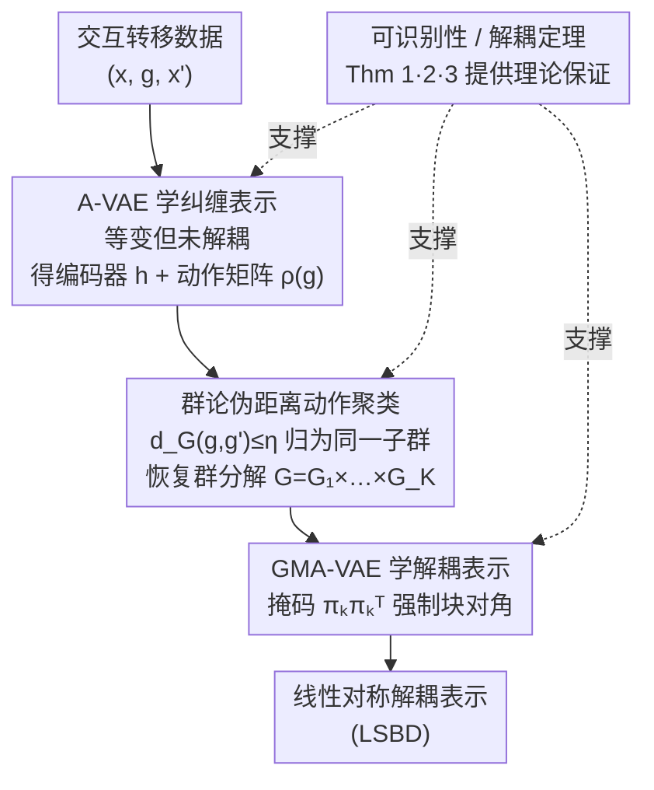

# Disentangled representation learning through unsupervised symmetry group discovery

**会议**: ICLR2026  
**OpenReview**: [https://openreview.net/forum?id=I6xjMoLY3j](https://openreview.net/forum?id=I6xjMoLY3j)  
**代码**: 待确认  
**领域**: 自监督 / 表示学习  
**关键词**: 解耦表示, 对称群, LSBD, 群分解发现, 具身智能体

## 一句话总结
让一个具身智能体通过与环境的无监督交互，自动发现自己动作空间背后的对称群分解结构，再据此学到「线性对称解耦表示」（LSBD），从而摆脱以往方法必须人为预知群结构的限制，在三类不同群结构的环境上都超过现有 LSBD 方法。

## 研究背景与动机

**领域现状**：解耦表示（disentangled representation）希望把观测背后的「真实变化因子」（位置、颜色、视角……）分别编码到表示的不同维度上，这对可解释性、公平性、迁移、以及直接在隐空间里操控都很有价值。Higgins 等人 2018 年提出的「基于对称性」（symmetry-based）路线给了解耦一个数学定义：环境变换构成一个对称群 $G$，若它能分解成子群的直积 $G = G_1 \times \cdots \times G_K$，那么每个子群只驱动表示中对应的一块变化，这就是 LSBD（Linear Symmetry-Based Disentanglement）。Caselles-Dupré 等人进一步证明，只看静态观测是学不到 LSBD 的，必须利用「转移三元组」$(x, g, x')$——也就是「在观测 $x$ 上施加动作 $g$ 得到 $x'$」，这天然契合强化学习里智能体主动交互的设定。

**现有痛点**：沿这条路线的代表方法——Forward-VAE、SOBDRL、LSBD-VAE、HAE——无一例外都需要**预先知道群的结构**。有的要你直接给出群分解 $G = G_1 \times \cdots \times G_K$ 和它的表示 $\rho$（LSBD-VAE），有的把动作矩阵硬约束成 $SO(2)$ 旋转（SOBDRL），有的假设是李群并要求能拿到某个未知映射 $\varphi(g)$（HAE）。换句话说，这些方法把「环境到底有几个变化因子、每个因子是什么群」当成已知先验喂进去。

**核心矛盾**：可一个真正自主的智能体，**事先并不知道**自己的动作背后对应着哪些独立的变化轴。Locatello 等人 2019 年的不可能性结果说明：纯无监督解耦必须引入额外先验或归纳偏置。问题在于——这个先验能不能不是「人手工给的群结构」，而是「智能体自己从交互数据里发现的群结构」？

**本文目标**：拆成两个子问题——(1) 能否仅凭转移数据 $\mathcal{D} = \{(x, g, x')\}$ **证明并恢复**真实的群分解？(2) 在不假设任何子群具体性质的前提下，能否据此学到 LSBD 表示？

**切入角度**：作者注意到，群论本身提供了判断「两个动作是否属于同一子群」的代数线索（交换性、逆元、幂次关系）。如果先学一个满足等变性的（但仍纠缠的）表示，就能在这个表示上用群论度量把动作聚成子群，群分解也就浮现出来了。

**核心 idea**：用「先学纠缠等变表示 → 在表示上按群论伪距离聚类动作恢复群分解 → 再据分解学解耦表示」这条三步流水线，把「群结构」从人工先验变成可被发现的对象，并配上可识别性定理作保证。

## 方法详解

### 整体框架
方法输入是智能体与环境交互采集的转移三元组数据集 $\mathcal{D} = \{(x, g, x')\}$，其中 $g$ 是所采取动作的索引（动作集 $\mathcal{G} \subseteq G$ 只是整个群的一个子集，甚至不必含恒等元、不必可逆）；输出是一个线性对称解耦表示——编码器 $h: X \to Z$ 加上块对角化的动作表示 $\rho$。整条流水线分三步走：第一步学一个只满足「存在群作用 + 等变性 + 编码器单射」的**纠缠**表示（A-VAE），同时得到编码器 $h$ 和每个动作的矩阵 $\rho_\psi(g)$；第二步在学好的 $h, \rho_\psi$ 上，用一个基于群论的伪距离 $d_G$ 把动作两两比较，距离低于阈值 $\eta$ 的归为同一子群，从而恢复群分解 $G = G_1 \times \cdots \times G_K$；第三步把这个分解作为已知结构，用掩码强制动作矩阵呈块对角，学出真正解耦的 LSBD 表示（GMA-VAE）。三步背后各有一条可识别性/解耦的定理撑着，保证「在理想条件下流水线恢复的就是真实群分解、学到的就是 LSBD 表示」。

### 关键设计

**1. A-VAE：用「动作条件先验」学出等变但纠缠的表示**

第一步要解决的痛点是：没有任何群结构先验时，怎么先得到一个「动作能在隐空间里被一致地表示」的表示？作者提出 Action-based VAE（A-VAE）。它在标准 VAE 上做了关键改动：把对 $z'$ 的先验**同时**条件在过去观测 $x$ 和动作 $g$ 上，即先验取 $p_{\psi,\phi}(z' \mid x, g) = \mathcal{N}\big(\rho_\psi(g)\,\mu_\phi(x),\, I\big)$。这里每个动作矩阵 $\rho_\psi(g)$ 不施加任何结构约束，直接由 $d^2$ 个可学标量自由参数化（共 $|\mathcal{G}| \cdot d^2$ 个参数），$d$ 是隐空间维度（实验里取 13）。推出的 ELBO（式 4）含两项：动作项 $\tfrac{1}{2}\lVert \rho_\psi(g)\mu_\phi(x) - \mu_\phi(x') \rVert^2$ 要求「在隐空间里施加动作矩阵后能落到下一观测的编码上」，这正是把**等变性** $g \cdot_Z f(w) = f(g \cdot_W w)$ 写成损失；另一项是重建项。仿照 β-VAE 用系数 $\lambda_{\text{ACT}}$ 平衡两项：$\mathcal{L} = \mathcal{L}_{\text{REC}} + \lambda_{\text{ACT}}\mathcal{L}_{\text{ACT}}$。这一步只保证 LSBD 定义里的「群作用存在 + 等变 + 编码器单射」三条，**不保证解耦**——所以叫纠缠表示，但它给后两步提供了可比较动作的 $h$ 和 $\rho_\psi$。

**2. 基于群论伪距离的动作聚类：让群分解自己「聚」出来**

第二步的痛点是：手里只有一堆自由的动作矩阵 $\rho_\psi(g)$，怎么判断哪些动作属于同一个子群、从而恢复 $G = G_1 \times \cdots \times G_K$？作者的洞察是——同子群的动作之间存在代数关系（互为逆、互为幂次），这可以转成一个可计算的距离。先定义半范数 $\lVert A \rVert_h = \mathbb{E}_x[\lVert A h(x) \rVert]$，再定义伪距离（式 6，记 $A_g := \rho_\psi(g)$）：

$$d_G(g, g') = \min_{u \in \mathcal{G},\, m \in [1,M]} \min\Big\{\lVert A_g A_u^m A_{g'}\rVert_h;\ \lVert A_g A_{g'}A_u^m\rVert_h;\ \lVert A_{g'}A_u^m A_g\rVert_h;\ \lVert A_{g'}A_g A_u^m\rVert_h\Big\}$$

它在检验「$g$ 和 $g'$ 能否通过乘上某个动作的幂次 $A_u^m$ 互相抵消」——这正对应 Assumption 3 给出的「同子群」判据。Theorem 2 证明：在假设满足、数据含全部转移、$W$ 有限、A-VAE 损失收敛时，两动作同属一个子群当且仅当 $d_G(g, g') \le \eta$（阈值 $\eta$ 由 $h, \rho_\psi$ 算出）。于是聚类算法把 $d_G$ 低于 $\eta$ 的动作归并成子群，群分解就被无监督地恢复出来。整套用的是同一组超参，不需要每个环境调。

**3. GMA-VAE：用可微掩码把解耦「焊死」进动作矩阵**

第三步要把已恢复的群分解变成真正解耦的 LSBD 表示。痛点在于：即便知道了分解，现有 LSBD 方法仍要人为指定每个子群占哪几维、动作矩阵长什么样。作者改成让模型**自己学维度分配**。核心是给每个子群 $k$ 配一个二值指示向量 $\pi_k \in \{0,1\}^d$（$\sum_k \pi_{k,i} = 1$，每维只归一个子群），用外积掩码 $\pi_k \pi_k^\top$ 把自由动作矩阵 $A_g$ 改造成「除一个对角块外都是单位阵」的结构（式 7）：$\tilde{A}_g = \pi_{k(g)}\pi_{k(g)}^\top \odot A_g + (1 - \pi_{k(g)}\pi_{k(g)}^\top)\odot I$。这样属于子群 $G_k$ 的动作就只改 $z$ 里属于第 $k$ 块的那些维度，天然块对角、天然解耦。为了能梯度训练，$\pi_k$ 用 $d$ 个 softmax 做连续松弛使 $\pi_{k,i}\in[0,1]$。最后加一个解耦损失 $\mathcal{L}_{\text{DIS}} = \sum_i |H(\pi_{:,i}) - C|$ 逼着各维的归属趋于二值化——这里有个关键工程细节：直接最小化熵 $H(\pi)$ 会让它在其它损失还没下降前就塌成零、导致随机分配；所以改成把目标熵 $C$ 从最大值**逐步退火到零**，让维度归属在训练中平稳收敛。这个完整方法叫 Group-Masked Action-based VAE（GMA-VAE）。Theorem 3 保证：满足 Assumptions 1、2、数据全、$G$ 有限时，最小化 GMA-VAE 损失的编码器就是关于 $\langle W, b, \prod_k \langle G_k\rangle\rangle$ 的 LSBD 表示。

**4. 可识别性与三条最小假设：把「能恢复真实群分解」证明出来**

前三步是流水线，这一条是贯穿全程的理论地基（图中以虚线支撑三个节点）。作者把以往「人给群结构」这一强先验，替换成三条更轻的假设，并逐一给出定理：Assumption 1（环境完全可观测，即观测函数 $b$ 单射）——Theorem 1 说明这其实是**所有** SBD 方法存在解的必要条件，并非本文特有，因为不影响交互的世界状态分量可被等价类约掉；Assumption 2（动作集关于 $\prod_k G_k$ 解耦，即每个动作只属于唯一子群）；Assumption 3（同子群的两动作能通过某动作的幂次 $u^m$（$m \le M$）相互转化）。作者还专门用 Figure 4 的「$2\times3$ 网格 vs $6\times1$ 网格」反例说明：光有 Assumption 2 不足以唯一确定分解（两者同构、不可区分），必须再加 Assumption 3 才能在覆盖常见情形（含逆元、$G_k = G_k^-$ 等）的同时让恢复过程可计算。这组定理把「智能体能从交互里识别出真实群分解」从经验现象变成了有条件保证的结论。

### 损失函数 / 训练策略
A-VAE 用 ELBO（式 4）训练：重建项 + 动作项，系数 $\lambda_{\text{ACT}}$ 平衡。三个条件分布都用神经网络实现，重建项用重参数化技巧，$\sigma_\theta, \sigma_\phi$ 实际固定为常数。GMA-VAE 在 A-VAE 损失基础上加解耦项 $\mathcal{L}_{\text{DIS}} = \sum_i |H(\pi_{:,i}) - C|$，目标熵 $C$ 从最大退火至 0。聚类阈值 $\eta$ 由学好的 $h, \rho_\psi$ 计算得到，全实验共享同一组超参。

## 实验关键数据

### 主实验
环境：Flatland（颜色循环移位 FLC / 颜色置换 FLP）、COIL（2、3 个物体 COIL2/COIL3）、3DShapes、MPI3D（机械臂连续旋转，李群）。指标：Independence (Inde)、β-VAE、MIG、DCI、Modularity (Mod)、SAP，均∈[0,1] 越大越好。基线分三类：监督（LSBD-VAE，给定 $\rho$）、自监督（SOBDRL、LSBD-VAE*——把 $\rho$ 改成学的变体）、无监督（β-VAE、Factor-VAE、DIP-VAE I/II，只用观测）。

| 任务 | 指标 | GMA-VAE（本文） | 监督 LSBD-VAE | 自监督 SOBDRL |
|--------|------|------|----------|------|
| 群分解恢复（FLC/FLP/COIL2/COIL3） | 正确恢复率 | **100%** 的运行 | — | — |
| FLC/FLP/COIL/3DShapes 解耦（Inde/Mod/DCI/β-VAE） | 中位数 | 近乎满分，**≈ 监督方法** | 上界参考 | 明显更弱（尤其置换群） |
| MIG / SAP | 中位数 | 偏低（LSBD 框架的固有现象，非本文缺陷） | 同样偏低 | 同样偏低 |

关键说明：MIG、SAP 要求每个因子只占一维，而线性解耦通常需要每因子≥2 维（详见原文 Appendix E），所以所有 LSBD 方法在这两项都偏低，属框架特性而非方法失败；COIL2 是例外（置换群 $S_2$ 可只用一维编码）。

### 消融与扩展实验

| 配置 / 设定 | 关键结果 | 说明 |
|------|---------|------|
| 动作聚类，全转移 + 简单动作集 | 100% 正确恢复 | 标准设定 |
| 动作聚类，复杂动作集 + 受限转移覆盖 | 只要每状态可用动作数 $n_a \ge 2$ 就稳定恢复 | 鲁棒性测试，超参不变 |
| 长程预测（COIL2/3） | 解耦方法（GMA-VAE/SOBDRL-dis/LSBD-VAE）长程误差显著低于纠缠方法 | 纠缠的 A-VAE 隐表示最终发散到 NaN，曲线早停 |
| 泛化 iid（每状态采 $|\mathcal{G}|/2$ 动作） | 所有解耦方法都泛化良好 | 见 Table 1 |
| 泛化 ood（训练只许最右物体旋转） | GMA-VAE 见过/未见误差差 < 5%（加粗），纠缠方法 ood 大幅退化 | A-VAE 未见误差从 6.7e-5 飙到 0.05 |
| 李群 MPI3D（$SO(2)\times SO(2)$，已知分解） | GMA-VAE ≈ SOBDRL，且优于 HAE | Theorem 3' 把保证推广到连续群 |
| Noisy MPI3D（动作加 $2\pi/15$ 高斯噪声） | GMA-VAE 至少不劣于其它方法 | 对动作噪声更鲁棒 |

### 关键发现
- **解耦是长程预测和 ood 泛化的关键**：纠缠的自监督方法（A-VAE、SOBDRL-entangled）短程预测尚可，但序列一长就发散（A-VAE 甚至跑到 NaN）；解耦后长程误差显著下降。原因是解耦让 $A_g A_{g'} \approx A_{gg'}$ 近似成立，多步预测不比单步难。
- **置换群是分水岭**：SOBDRL 把动作硬塞成 $SO(2)$ 旋转，对 COIL3 的置换对称性完全无能为力；本文方法不假设子群性质，能处理置换群。
- **第二步对动作覆盖不敏感**：哪怕每状态只采到 2 个可用动作，群分解依旧能正确恢复，说明伪距离判据很稳。

## 亮点与洞察
- **把「群结构」从先验变成可发现对象**：以往 LSBD 方法的最大束缚是「必须人为告诉模型有几个因子、各是什么群」，本文用「先学纠缠表示 → 群论伪距离聚类」两步，让智能体自己把这个结构挖出来，是这条路线少见的「真·无监督」推进。
- **掩码 + 熵退火这一对组合很实用**：用可微外积掩码 $\pi_k\pi_k^\top$ 把解耦结构焊进动作矩阵，再用「目标熵从大退火到 0」绕开「熵直接塌零导致随机分配」的训练陷阱——这个退火 trick 可迁移到任何「想让 soft assignment 平稳收敛到 one-hot」的场景。
- **理论与算法一一对应**：三步流水线各配一条定理（Thm 1 必要性、Thm 2 聚类判据、Thm 3/3' 解耦保证），不是「先有方法再补证明」，而是从可识别性定理直接导出算法，论证链条干净。
- **Figure 4 的反例很有教育意义**：$2\times3$ 与 $6\times1$ 网格同构、智能体无法区分，清楚说明「解耦动作集」这一条假设还不够，必须再加一条幂次可转化的假设——把「为什么需要 Assumption 3」讲得很直观。

## 局限与展望
- **假设偏强**：完全可观测（$b$ 单射）、数据含全部转移、$W$ 有限是定理成立的前提；真实高维、部分可观测、转移稀疏的环境下保证会打折扣（实验里 ood/受限覆盖已显露 A-VAE 退化）。
- **第二步天生离散**：群论伪距离聚类依赖有限聚类过程，无法直接用于连续李群——李群实验（5.6）必须**假设群分解已知**才能跑 GMA-VAE（Theorem 3'），即「自动发现群结构」这一核心卖点在连续群上暂不可用。
- **动作集需满足 Assumption 2/3**：要求每个动作只属唯一子群、且同子群动作能幂次互转；遇到天然耦合（一个动作同时改多个因子）的动作空间就不适用。
- **实验规模偏 toy**：Flatland、COIL、3DShapes、MPI3D 都是受控的合成/半合成数据集，因子数和群结构都不大；向真实机器人感知这类高维场景扩展还需验证。
- **改进方向**：把第二步的群发现推广到连续群（如在李代数上做聚类）、放松完全可观测假设、以及探索动作集不满足解耦假设时的近似处理。

## 相关工作与启发
- **vs LSBD-VAE（Tonnaer 2022，监督）**：它把群分解 $G=G_1\times\cdots\times G_K$ 和表示 $\rho$ 当作已知先验喂进去；本文把这两者都改成从交互数据里**学/发现**，性能却追平了这个监督上界。
- **vs SOBDRL（Quessard 2020，自监督）**：它把动作矩阵硬约束为 $SO(d)$、并用正则压缩每个变换涉及的维数；本文不假设任何子群性质，因此能处理 SOBDRL 搞不定的置换对称性（COIL3）。
- **vs Forward-VAE（Caselles-Dupré 2019）**：它需预知子群分解并把 $\rho(g)$ 约束成预定结构；本文恢复出分解后，Forward-VAE 反而可作为第三步的一个可选下游算法。
- **vs HAE（Keurti 2023）**：HAE 专为李群设计、需访问未知映射 $\varphi(g)$；本文在李群 MPI3D 上（已知分解时）超过 HAE，且对动作噪声更鲁棒。
- **vs 因果表示学习 / 对象中心表示学习**：作者在第 6 节讨论这两条相关但不同的路线——因果路线把隐变量锚到因果生成过程、依赖干预/因果图等不同假设，与对称性路线虽都「有数学根基、利用干预/动作」但假设差异大，故未纳入直接比较。

## 评分
- 新颖性: ⭐⭐⭐⭐⭐ 首次让具身智能体无监督发现对称群分解，把 LSBD 的核心先验从人工给定变成可识别可恢复
- 实验充分度: ⭐⭐⭐⭐ 覆盖离散/置换/连续群与 iid/ood/长程/噪声多维度，但数据集偏 toy、规模有限
- 写作质量: ⭐⭐⭐⭐ 理论与算法一一对应、反例讲解清晰，但定理与假设密集，需要一定群论背景
- 价值: ⭐⭐⭐⭐ 为「真·无监督对称解耦」提供了可落地的三步框架与理论保证，对表示学习与具身交互社区有参考价值

<!-- RELATED:START -->

## 相关论文

- [\[ICLR 2026\] Boosting Open Set Recognition Performance through Modulated Representation Learning](boosting_open_set_recognition_performance_through_modulated_representation_learn.md)
- [\[ICLR 2026\] Unsupervised Representation Learning - An Invariant Risk Minimization Perspective](unsupervised_representation_learning_-_an_invariant_risk_minimization_perspectiv.md)
- [\[ICLR 2026\] A Bayesian Nonparametric Framework for Learning Disentangled Representations](a_bayesian_nonparametric_framework_for_learning_disentangled_representations.md)
- [\[ICLR 2026\] Mechanistic Independence: A Principle for Identifiable Disentangled Representations](mechanistic_independence_a_principle_for_identifiable_disentangled_representatio.md)
- [\[CVPR 2026\] Seeing Through the Shift: Causality-Inspired Robust Generalized Category Discovery](../../CVPR2026/self_supervised/seeing_through_the_shift_causality-inspired_robust_generalized_category_discover.md)

<!-- RELATED:END -->
