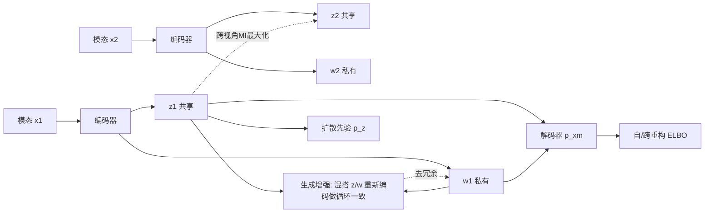

# Disentanglement of Variations with Multimodal Generative Modeling

**会议**: ICLR 2026  
**OpenReview**: [https://openreview.net/forum?id=DcHGEcqdFf](https://openreview.net/forum?id=DcHGEcqdFf)  
**代码**: 待确认  
**领域**: 自监督 / 多模态表示学习  
**关键词**: 多模态 VAE, 共享-私有解耦, 互信息正则, 生成式数据增强, 扩散先验  

## 一句话总结
IDMVAE 在多模态 VAE 框架上叠加两类互信息正则——跨视角 MI 最大化抽取共享变量、循环一致式生成增强去除冗余，再用扩散模型替换高斯先验，在似然模型不够强的困难数据集上实现共享/私有信息的干净分离。

## 研究背景与动机
**领域现状**：多模态数据（图文、音视频、多组学）天然包含跨模态共享信息与模态特有（私有）信息。近年的多模态生成模型（DMVAE、MMVAE+ 等）普遍用两个独立隐变量 $z$（共享）与 $w_m$（私有）来分别建模，希望学到完整又非冗余的表示。

**现有痛点**：要让 $z$ 与 $w_m$ 真正解耦并不容易。MMVAE+ 靠引入辅助先验变量、阻断"捷径"来防止共享信息泄漏到私有编码，但本质是启发式手段，且对 $z$、$w$ 维度比例敏感。当似然模型不够强（数据少、目标语义只占少量像素）时，这些方法会失效——共享信息漏进私有编码、反之亦然，导致跨模态相干性差、模型容量浪费、生成质量低。

**核心矛盾**：纯似然最大化无法保证抽取出充分的共享变量。作者通过信息论分解指出，最大化 $I(z_m,w_n;x_n)$（即 MMVAE+ 做的事）并不能保证 $I(z_m;x_n)$ 最大，二者之间存在间隙 $I(w_n;x_n|z_m)$，所以**仅靠似然/重构得不到解耦**。

**本文目标**：在不依赖领域特定数据增强、不依赖强似然模型的前提下，用严格的互信息正则显式逼出"共享=完整、私有=无冗余"的解耦表示。

**核心 idea**：`MI 正则 + 生成式增强 + 扩散先验`——用对比式互信息抽共享、用模型自身生成的样本做循环一致去冗余、用扩散模型提升隐空间先验的表达力，三者互补。

## 方法详解

### 整体框架
给定 $M$ 个模态 $X=\{x_1,\dots,x_M\}$，IDMVAE 假设每个 $x_m$ 由共享 $z$ 与私有 $w_m$ 联合生成，先验独立 $p(z,\{w_m\})=p(z)\prod_m p(w_m)$，后验分解为 $q(z,w_m|x_m)=q(z|x_m)\cdot q(w_m|x_m)$。在 MMVAE+ 的 ELBO 似然基座之上，加两条互信息正则项（跨视角 MI、生成增强）并把高斯先验换成扩散先验，端到端联合训练编码器、解码器与扩散网络。总目标为 $\min\ \mathcal{L}_{\text{IDMVAE}}=\mathcal{L}_{\text{MMVAE+}}+\lambda_1\mathcal{L}_{\text{CrossMI}}+\lambda_2\mathcal{L}_{\text{GenAug}}$。

### 关键设计

**1. 跨视角互信息最大化抽取共享变量：绕开似然间隙直接拉高 $I(z_m;z_n)$。** 作者证明 $I(z_m;z_n)$ 是 $I(z_m;x_n)$ 的下界（因为 $z_n$ 的变异只来自 $x_n$，故 $I(z_m;z_n|x_n)=0$），于是直接最大化两个模态共享码之间的互信息，就能逼共享变量真正捕捉跨模态公共因子，而不必依赖那个有间隙的似然上界。实现上用 InfoNCE 对比估计：$I(z_m;z_n)\approx\mathbb{E}\log\frac{\phi(z_m,z_n)}{\phi(z_m,z_n)+\sum_{j=1}^k\phi(z_m,\bar z_n^j)}$，亲和函数取余弦相似度 $\phi(z_m,z_n)=\exp(z_m^\top z_n/(\|z_m\|\|z_n\|))$，负样本从 minibatch 中未对齐的样本采。$M$ 个模态时取所有模态对的平均：$\mathcal{L}_{\text{CrossMI}}=-\frac{2}{M(M-1)}\sum_{m<n}\text{Contrast}(z_m,z_n)$。实验显示这一项对抽取共享变量最关键——当目标语义（如小数字）只占少量像素时，纯似然会忽略它。

**2. 生成式增强做循环一致去冗余：让模型用自己生成的样本拆掉私有码里的共享残留。** 即便共享码干净、自重构鼓励 $(z_m,w_m)$ 联合刻画 $x_m$，私有 $w_m$ 仍可能偷藏共享信息，需要额外正则去冗余。难点是私有变量没有天然的"多视角"可用循环一致约束。作者据此**合成视角**：取样本 $x_m$ 的共享码 $z_m$ 与另一样本 $x'_m$ 的私有码 $w'_m$，用解码器生成 $x^+_m\sim p(x_m|z_m,w'_m)$，再把它编码回隐空间，要求 $q(w_m|x^+_m)$ 与 $q(w_m|x'_m)$ 一致、$q(z|x^+_m)$ 与 $q(z|x_m)$ 一致。理论上这等价于最小化 $H(w_m|x'_m)$ 以求最小充分私有变量；高斯后验下退化为均值匹配的 $\ell_2$ 损失，但实践中改用对比损失更有效：$\mathcal{L}_{\text{GenAug},w_m}=-\text{Contrast}(w''_m,w'_m)$，其中 $w''_m\sim q(w_m|x^+_m)$。对称地定义 $\mathcal{L}_{\text{GenAug},z_m}$，合并为 $\mathcal{L}_{\text{GenAug}}=\frac{1}{2M}\sum_m(\mathcal{L}_{\text{GenAug},z_m}+\mathcal{L}_{\text{GenAug},w_m})$。与 Bai et al. (2021) 需要强领域知识的增强（打乱帧序、整体调色）不同，**这里的增强完全由模型自身产生、零领域知识**。

**3. 扩散先验提升隐空间表达力：把简单高斯先验换成可建模聚类结构的去噪过程。** 表示学习希望隐空间体现数据结构（如含类别信息时不同类应远离、呈多峰而非单峰），而高斯先验过于平滑。作者把 $\mathcal{L}_{\text{MMVAE+}}$ 里的 KL 拆为 $D_{\text{KL}}(q(z|x)\|p(z))=\mathbb{E}_{q}[\log q(z|x)]+\mathbb{E}_{q}[-\log p(z)]$，第二项用扩散模型建模——把 $z\sim q(z|x)$ 当作"数据"逐步加噪到纯噪声，再用去噪网络反演。由于隐变量维度低，反向过程只需简单前馈网络，且用 DDPM 参数化 $q(z|x)$ 的均值。与 Palumbo et al. (2024) 先学表示再在输入空间学扩散的两步法不同，本文**联合训练**，扩散损失梯度回传到编码器，三个组件互补。

## 实验关键数据

### 主实验表格

**PolyMNIST-Quadrant 隐变量线性分类（5 模态平均，数字=共享标签、象限=私有标签）：**

| 模型 | z→Digit ↑ | z→Quad ↓ | w→Quad ↑ | w→Digit ↓ |
|------|-----------|----------|----------|-----------|
| MMVAE | 0.492 | 0.798 | — | — |
| MoPoE-VAE | 0.536 | 0.751 | — | — |
| DMVAE | 0.157 | 0.254 | 0.710 | 0.179 |
| MMVAE+ | 0.382 | 0.355 | 0.999 | 0.341 |
| **IDMVAE (ours)** | **0.983** | 0.271 | 0.999 | 0.162 |
| + Diffusion prior | 0.982 | 0.267 | 0.999 | **0.143** |

共享码预测数字从 MMVAE+ 的 0.382 跃升到 0.983，且私有码几乎不含数字信息（w→Digit 降到 0.14-0.16），分离效果显著。

**CUB-HQ 生成相干性（FID/CLIPScore，参考：真值图文 CLIP=0.762）：**

| 模型 | T2I FID↓ | T2I CLIP↑ | I2T CLIP↑ | I2I FID↓ | I2I CLIP↑ |
|------|----------|-----------|-----------|----------|-----------|
| DMVAE | 104.2 | 0.665 | 0.683 | 70.5 | 0.707 |
| MMVAE+ | 70.2 | 0.691 | 0.693 | 62.5 | 0.712 |
| IDMVAE (ours) | 64.4 | 0.718 | 0.736 | 58.1 | 0.721 |
| + Diffusion prior | **60.5** | **0.721** | **0.737** | 59.7 | 0.716 |

**TCGA 多组学预测准确率（2 模态 5 split 平均）：**

| 模型 | z ↑ | z+w ↑ |
|------|-----|-------|
| MMVAE+ | 0.692±0.010 | 0.690±0.011 |
| DisentangledSSL | 0.691±0.011 | 0.690±0.011 |
| IDMVAE + Diffusion | **0.714±0.009** | **0.731±0.019** |

### 消融实验表格

**PolyMNIST-Quadrant 上逐项移除（生成相干性，部分列）：**

| 配置 | 自生成 Digit↑ | 跨生成 Digit↑ | 无条件 Digit↑ |
|------|---------------|---------------|---------------|
| IDMVAE (full) | 0.898 | 0.881 | 0.070 |
| – $\mathcal{L}_{\text{CrossMI}}$ ($\lambda_1{=}0$) | 0.101 | 0.100 | 0.000 |
| – $\mathcal{L}_{\text{GenAug}}$ ($\lambda_2{=}0$) | 0.670 | 0.671 | 0.008 |
| + Diffusion prior | 0.942 | 0.887 | **0.664** |

### 关键发现
- **CrossMI 是抽共享的命门**：去掉后 z→Digit 暴跌到 0.11（PolyMNIST）、共享生成相干性归零，因为小数字目标在像素层面被纯似然忽略。
- **GenAug 负责去冗余**：去掉后交叉分类准确率上升（私有码偷藏了共享信息），加上后冗余被显著清除。
- **扩散先验对无条件生成贡献最大**：无条件相干性从 0.07 飙到 0.664，因为它解决了先验-后验分布匹配难题；对其他指标只是小幅增益。
- 三个组件互补，缺一不可，且在 CUB-HQ 的弱似然场景下生成增强即便产物模糊仍有效（DiT 去噪器可后补细节）。

## 亮点与洞察
- **把"似然不够"这件事说清楚了**：用 $I(z_m,w_n;x_n)=I(z_m;x_n)+I(w_n;x_n|z_m)$ 的分解，干净地论证了为什么纯重构无法保证共享变量充分，理论动机扎实。
- **生成式增强是巧思**：私有变量没有天然多视角，作者用解码器"造"一个视角来做循环一致，把数据增强的依赖从"领域知识"转移到"模型自身生成能力"，可迁移性强。
- **扩散先验的引入方式干净**：通过 KL 拆解把扩散损失自然嵌入 ELBO，且联合训练让梯度回传编码器，区别于两步法。

## 局限与展望
- **DisentangledSSL 等强基线只能两视角**，IDMVAE 虽支持多模态，但跨视角 MI 是模态对平均，模态数增多时计算与负样本设计的复杂度上升。
- **CUB-HQ 生成依赖外挂 DiT 去噪器**补细节，IDMVAE 自身产物在小数据下偏模糊，端到端高保真生成仍未解决。
- 两个权重 $\lambda_1,\lambda_2$ 需在验证集调，且 MMVAE+ 基座对 $z/w$ 维度比例敏感的问题是否被完全缓解，文中讨论有限。
- 解耦停留在"变量级"（共享 vs 私有），并未挑战更难的"逐维度"解耦（Locatello et al. 2019 指出无监督下理论困难）。

## 相关工作与启发
- **多模态 VAE 谱系**：MMVAE（MoE）→ MoPoE-VAE → DMVAE → MMVAE+（辅助先验防捷径），本文是 MMVAE+ 的超集（$\lambda_1{=}\lambda_2{=}0$ 时退化为 MMVAE+）。
- **无似然解耦**：DisentangledSSL（Wang et al. 2025）沿 Federici et al. (2020) 的充分性思路两步抽共享/私有，但不做生成建模；本文主张"有了强生成模型，似然建模反而带来可控生成的额外收益"。
- **多模态隐扩散**：SBM-VAE 等先各自训 VAE 再用扩散耦合隐空间，缺点是分开训的 VAE 丢失跨模态相关、且不做共享/私有解耦；本文联合训练 + 解耦带来更强可控生成（可混搭不同数据点或先验样本的 z、w）。
- **启发**：用模型自身生成样本构造"合成视角"来替代领域特定增强，这套思路对其他缺乏天然多视角的解耦/表示学习场景（如单模态因子解耦）有借鉴价值。

## 评分
- **新颖性**: ⭐⭐⭐⭐ 跨视角 MI + 生成式循环一致增强 + 联合扩散先验的组合在多模态解耦上是新的，且每个组件都有信息论动机支撑，非简单堆叠。
- **实验充分度**: ⭐⭐⭐⭐ 覆盖 PolyMNIST-Quadrant（图）、CUB-HQ（图文）、TCGA（多组学）三类异构数据，含完整逐项消融与多基线对比；高保真生成依赖外挂 DiT 略减分。
- **写作质量**: ⭐⭐⭐⭐ 信息论推导清晰、动机层层递进，方法与实验对应紧密。
- **价值**: ⭐⭐⭐⭐ 在弱似然困难数据集上实现干净解耦，对多模态表示学习与可控生成都有实用价值，"自生成增强"思路可迁移。

<!-- RELATED:START -->

## 相关论文

- [\[CVPR 2026\] OpenVision 2: A Family of Generative Pretrained Visual Encoders for Multimodal Learning](../../CVPR2026/self_supervised/openvision_2_a_family_of_generative_pretrained_visual_encoders_for_multimodal_le.md)
- [\[CVPR 2026\] Residual Connections Harm Generative Representation Learning](../../CVPR2026/self_supervised/residual_connections_harm_generative_representation_learning.md)
- [\[ICML 2026\] Riemannian Metric Matching for Scalable Geometric Modeling of Distributions](../../ICML2026/self_supervised/riemannian_metric_matching_for_scalable_geometric_modeling_of_distributions.md)
- [\[CVPR 2026\] Suppressing Non-Semantic Noise in Masked Image Modeling Representations](../../CVPR2026/self_supervised/suppressing_non-semantic_noise_in_masked_image_modeling_representations.md)
- [\[CVPR 2026\] Beyond Binary Contrast: Modeling Continuous Skeleton Action Spaces with Transitional Anchors](../../CVPR2026/self_supervised/beyond_binary_contrast_modeling_continuous_skeleton_action_spaces_with_transitio.md)

<!-- RELATED:END -->
