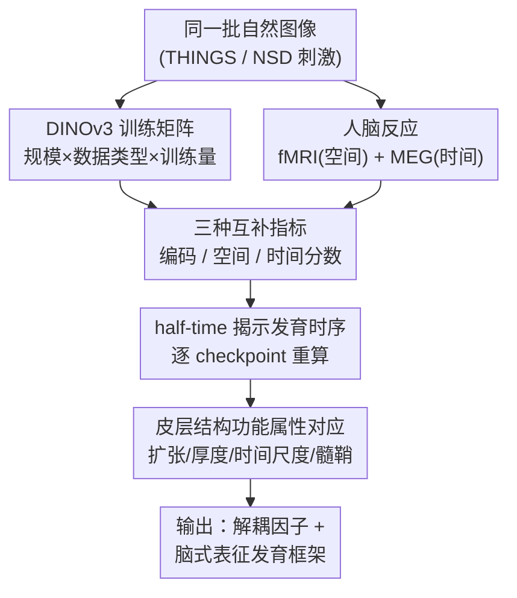

# Disentangling the Factors of Convergence between Brains and DINOv3

**会议**: ICLR 2026  
**OpenReview**: [https://openreview.net/forum?id=i99ccgfad8](https://openreview.net/forum?id=i99ccgfad8)  
**代码**: 无（基于开源 DINOv3、THINGS-MEG、Natural Scenes Dataset）  
**领域**: 自监督表示 / 神经科学对齐 / 视觉Transformer  
**关键词**: 脑-模型对齐, DINOv3, 自监督, fMRI/MEG, 表征发育时序

## 一句话总结
作者从零训练一系列系统性变量受控的 DINOv3 自监督视觉模型，用「编码分数 / 空间分数 / 时间分数」三个互补指标把模型表征对齐到人脑 fMRI 与 MEG，定量解耦出「模型规模、训练量、图像类型」三个因子如何独立又交互地驱动模型变得「像大脑」，并发现这种相似性的涌现遵循一条与人类皮层发育高度吻合的时序。

## 研究背景与动机
**领域现状**：过去十年大量研究反复观察到一个惊人现象——在自然图像上训练的深度视觉网络，其内部激活可以通过一个线性映射预测人脑对同一批图像的反应（fMRI、MEG、电生理都验证过）。这被视为「神经网络可能存在某种普适表征原则」的证据。

**现有痛点**：虽然「模型像大脑」被反复观测到，但**到底是什么导致了这种相似**一直说不清。根本原因是以往研究几乎都拿**现成的预训练网络**做比较，而这些网络同时在训练目标、架构、数据规模三个维度上都不一样。三个变量纠缠在一起，没法判断到底是哪个因子、以什么方式把模型推向了「脑式表征」。

**核心矛盾**：要回答「哪个因子导致对齐」，就必须让其他因子保持不变、只动一个变量；但现成模型做不到受控对比，自监督之前的模型又依赖标签、没法在非人类中心的图像（卫星图、细胞图）上公平地换数据。

**本文目标**：把「模型规模、训练量、图像类型」三个因子拆开，分别量化它们对脑-模型相似性的独立贡献与交互效应；并刻画相似性在训练过程中**如何逐步涌现**。

**切入角度**：选用 DINOv3 这一**自监督**视觉 Transformer 作为统一底座——它不需要标签，因而可以在人类中心、卫星、细胞三类自然图像上以完全相同的配置从零训练，唯一变的就是数据类型；同时它有 Small→Giant 的规模阶梯和完整的训练 checkpoint 轨迹，天然支持把三个因子逐一拨动。

**核心 idea**：用「同架构、同流程、只变单一因子」的训练矩阵 + 三种互补的脑相似度指标，把脑-模型趋同现象**解耦**成可归因的因子，并把训练过程当成一条「发育轨迹」来读，发现它复刻了人类视觉皮层从感觉区到前额叶的成熟顺序。

## 方法详解

### 整体框架
整篇工作本质是一套**受控的「神经科学 × 自监督视觉」对照实验**：左边是一组系统性变化的 DINOv3 模型，右边是同一批图像诱发的人脑活动（fMRI 给高空间分辨率、MEG 给高时间分辨率），中间用三把「尺子」量两者的相似度，最后把相似度随训练的演化拆给三个因子、并对照皮层的结构功能属性。

流程是：先构建一个**只变单一因子的 DINOv3 训练矩阵**（8 个变体，分别拨动规模 / 数据类型，并保留训练轨迹拨动训练量）；对每个模型和每张图像取出各层激活，与人脑反应做岭回归线性映射，得到三个互补指标——**编码分数**（整体表征像不像）、**空间分数**（层级是否对应皮层的空间层级）、**时间分数**（层级是否对应 MEG 的时间动态）；再把这些指标在每个训练 checkpoint 上重算，用 **half-time（达到最终值一半的训练步）** 刻画每个脑区/时间窗的「涌现速度」；最后把这条发育时序与皮层的**扩张度、厚度、内在时间尺度、髓鞘化**四张图谱做相关，看相似性的涌现顺序是否被皮层的生物属性所索引。

### 关键设计

**1. 单因子受控的 DINOv3 训练矩阵：把纠缠的变量拨开**

以往「模型像大脑」说不清因果，正是因为现成网络的架构、目标、数据同时在变。作者用 DINOv3 作统一底座，从零训练 8 个变体，让每次只有一个因子变化：规模维度固定数据与流程，训练 Small(21M)、Base(86M)、Large(300M)、Giant(1.1B) 乃至 7B；数据维度固定 Large 架构与 10M 图像量，只换图像类型（人类中心 / 卫星 SAT-493M / 细胞 ExtendedCHAMMI）；训练量维度则直接利用同一次训练的多个 checkpoint。这样「规模、数据类型、训练量」三者可以被分别归因，而不再是一锅粥。之所以非自监督不可——只有 DINOv3 这类不依赖标签的自监督模型，才能在卫星图、细胞图这种没有语义标签的自然图像上以**完全相同的配置**公平对比，把「换数据」做成真正的受控变量。

**2. 三把互补的尺子：编码、空间、时间分数**

只看「整体像不像」会丢掉层级结构信息，所以作者设计了三个层层递进的指标，全部建立在同一套岭回归编码分析上。编码分数衡量整体表征相似度：用线性映射 $W\in\mathbb{R}^{d\times m}$ 从 $d$ 维模型激活 $X$ 预测 $m$ 维脑活动 $Y$，目标为 $\arg\min_W \|Y-XW\|_2^2 + \lambda\|W\|_2^2$（RidgeCV，5 折交叉验证），再在测试集上取 Pearson 相关 $R=\mathrm{corr}(WX_{\text{test}}, y_{\text{test}})$。空间分数检验**层级的空间对应**：对每个脑区找出最佳预测它的模型层 $k^*$，把脑区的层级位置近似为它到初级视觉区 V1 的欧氏距离 $m^*$，再算 $m^*$ 与 $k^*$ 的相关——若低层对应感觉区、高层对应前额叶，则相关为正。时间分数则用 MEG 检验**层级的时间对应**：定义 $T^{\text{layer}}_{\max}$ 为某层归一化编码分数 $\tilde R_k\ge 95\%$ 的时间窗均值（即该层最强预测脑活动的时刻），再算层序 $k$ 与 $T^{\text{layer}}_{\max}$ 的相关——若浅层对早期响应、深层对晚期响应，则相关为正。作者特意用编码（encoding）而非解码，因为解码分数在不同架构、不同表征空间之间无法公平比较，而编码给出的是「从模型特征到神经反应」的可解释映射，跨架构可比。

**3. half-time 把训练读成一条发育时序**

要回答「相似性是怎么涌现的」，光看终点不够，得看过程。作者在每个训练 checkpoint 上重算三个分数，并对每个脑区/时间窗估计 **half-time**——达到其最终分数一半时所处的训练步。结果揭示出清晰的**时间顺序**：时间分数最先成熟（half-time 约训练量的 0.7%），编码分数次之（约 2%，对应约 8 亿张图像），空间分数最晚（约 4%）。更关键的是不同脑区的 half-time 不同：低层视觉区（V1、V2）很早就被模型对齐，而高层前额叶区（IFSp、IFSa）要在大得多的训练量后才对齐——脑区 half-time 与其到 V1 的距离相关高达 $R=0.91$，与 MEG 时间峰值相关 $R=0.84$。也就是说，模型在训练早期先学会感觉皮层那套「快而低级」的表征，只有喂入海量数据后才逐渐对上前额叶那套「慢而高级」的表征。

**4. 与皮层结构功能属性对应：相似性涌现被生物属性索引**

如果上述发育时序只是巧合，那它不该与大脑的生物属性挂钩。作者把每个脑区的 half-time 与四张皮层图谱（Neuromaps 提供）做相关：**皮层扩张度**（婴儿到成人的表面积增长，$R=0.88$）、**皮层厚度**（$R=0.77$）、**内在时间尺度**（$R=0.71$）均与 half-time 正相关，而**髓鞘浓度**（加速神经传导）与 half-time 强负相关（$R=-0.85$）。换言之，模型最后才对齐的脑区，恰恰是那些发育扩张最大、皮层最厚、动态最慢、髓鞘最少的联合皮层——正是人类大脑前二十年里最晚成熟的区域。这把「AI 模型训练中的表征涌现顺序」和「人脑皮层的真实发育顺序」对上了号，使得训练轨迹本身成为一个可计算的皮层个体发育模型。

## 实验关键数据

### 主实验
在 7T fMRI（Natural Scenes Dataset）和 MEG（THINGS-MEG）上验证 DINOv3 与脑的相似性，并检验三个指标。

| 指标 | 结果 | 说明 |
|------|------|------|
| 编码分数（fMRI 平均） | $R=0.45\pm0.039$（最佳体素峰值） | 主要集中在视觉通路，MT 区 $R=0.34$、VMV2 区 $R=0.28$ |
| 编码扩展性 | 显著 $>$ chance | 前额叶 BA44/45、IFSa/IFSp 等通常被排除的高级区也能被线性预测 |
| MEG 起效时间 | 约 70 ms 后显著上升 | 持续显著至刺激后 3 s（$p<10^{-3}$） |
| 空间分数 | $R=0.38, p<10^{-6}$ | 浅层最佳预测 V1 等低级区、深层预测前额叶等高级区 |
| 时间分数 | $R=0.96, p<10^{-12}$ | 浅层对应早期 MEG 响应、深层对应晚期响应 |
| 泛化性 | 7 个额外模型（CNN/有监督ViT/自监督ViT/图文对比）三指标一致 | 表明结论不限于 DINOv3 |

### 因子解耦实验
固定其他变量、只拨动单一因子，看三个分数如何变化。

| 因子 | 关键发现 | 数据 |
|------|----------|------|
| 模型规模 | 越大编码分数越高、收敛越快 | $R_{\text{Giant}}=0.107 > R_{\text{Large}}=0.105 > R_{\text{Base}}=0.101 > R_{\text{Small}}=0.096$（$p<10^{-3}$） |
| 模型规模（分区） | 增益主要在高级皮层 | BA45、IFS 提升明显大于 V1、V2 |
| 图像类型 | 人类中心图像对齐最好 | 卫星图、细胞图三指标均显著更低（$p<10^{-3}$），但训练对三类都提升（早期视觉区可被任意自然图像 bootstrap） |
| 训练量（half-time） | 三指标涌现时序不同 | 时间 0.7% → 编码 2% → 空间 4% |

### 关键发现
- **三个因子独立且交互**：规模、训练量、数据类型各自都影响脑相似性，且最大模型 + 最人类中心数据组合对齐最高，体现交互效应。
- **发育时序复刻人脑**：模型先对齐感觉皮层、后对齐前额叶；脑区 half-time 与到 V1 距离相关 $R=0.91$，与四张皮层属性图谱（扩张/厚度/时间尺度/髓鞘）强相关。
- **几个意外**：三个分数**不同时**涌现，时间分数甚至早于编码分数升起，说明编码分数无法单独解释时间分数；训练初期空间/时间分数为**负**（随机 DINOv3 的深层反而最像快而低级的脑响应）；所有 half-time 都落在训练量的 1%–4%（约 16 亿张图）内，即低级脑表征极易学、高级脑表征需海量数据。

## 亮点与洞察
- **把「相关观测」升级成「受控因果分解」**：以往是「观察到像」，本文用单因子训练矩阵第一次把「规模/训练/数据」对脑相似性的贡献分别量化，方法论本身就是贡献。
- **三指标设计很巧**：编码（整体）+ 空间（fMRI 层级）+ 时间（MEG 动态）三把尺子互补，分别吃掉了空间和时间两种高分辨率脑数据，避免单一指标只看「整体像不像」的盲区；坚持用编码而非解码以保证跨架构可比，是个干净的方法学选择。
- **把训练轨迹读成发育轨迹**：half-time 这个简单量把「训练进度」翻译成「皮层成熟顺序」，让 AI 训练过程意外地成了一个研究人脑视觉个体发育的计算框架——这是最「啊哈」的地方。
- **可迁移思路**：「同底座、只变单因子 + 轨迹级 half-time 分析」这套范式可以搬到任何「表征趋同」研究（如不同模型间的 Platonic 趋同、语言模型与脑对齐），把模糊的「越大越像」量化成可归因的发育曲线。

## 局限与展望
- **仅一族模型**：核心结论基于 DINOv3 这一**层级化设计**的自监督模型，其他架构/训练目标是否也呈现相同的空间、时间、编码分数仍是开放问题（虽然 7 个额外模型在终点指标上一致，但发育轨迹未在它们上验证）。
- **脑数据分辨率有限**：fMRI/MEG 只能给群体级、粗粒度的活动，可能漏掉细粒度神经机制。
- **只看成人脑**：对齐如何**跨发育**出现，需要婴儿/儿童/纵向队列数据才能回答，本文只能做「模型发育 vs 成人皮层属性」的间接类比。
- **人类中心优势归因未定**：人类中心图像对齐更好，可能源于低级图像统计（颜色/纹理分布），也可能是高级语义，甚至只是更接近 DINOv3 原训练分布——需用受控的非人类中心刺激做被试实验才能区分。
- **被动观看**：两个数据集的被试多为被动看图，任务如何调制前额叶对齐尚未探究。

## 相关工作与启发
- **vs Huh et al. (Platonic Representation)**: 他们论证不同模型之间的表征趋同；本文进一步把这种趋同延伸到**人脑神经表征**，并解耦出驱动因子，而不止于模型间比较。
- **vs 早期脑-模型对齐工作（Schrimpf/Eickenberg/Yamins）**: 他们用现成预训练网络观察到视觉通路的线性对齐；本文新增三点——对齐延伸到**前额叶等多模态高级区**、首次**独立操纵**三个因子看交互、用 half-time 揭示对齐的**发育时序**。
- **vs 认知科学的先天 vs 经验之争**: 本文用「架构提供潜能、数据决定是否学成脑式表征」给出经验框架——架构是必要条件，但生态有效的数据才是关键，为 nativism/empiricism 提供了可计算的切口。

## 评分
- 新颖性: ⭐⭐⭐⭐⭐ 首次把脑-模型趋同解耦成受控因子，并发现训练轨迹复刻皮层发育时序
- 实验充分度: ⭐⭐⭐⭐⭐ 8 个受控变体 + 7 个泛化模型，fMRI/MEG 双模态、空间时间双指标、四张皮层图谱交叉验证
- 写作质量: ⭐⭐⭐⭐ 逻辑清晰、图表丰富，但跨神经科学术语较密，对纯 ML 读者门槛偏高
- 价值: ⭐⭐⭐⭐⭐ 为「用 AI 模型研究人脑视觉发育」提供了可操作的计算框架，跨学科意义大

<!-- RELATED:START -->

## 相关论文

- [\[ICLR 2026\] On the Alignment Between Supervised and Self-Supervised Contrastive Learning](on_the_alignment_between_supervised_and_self-supervised_contrastive_learning.md)
- [\[NeurIPS 2025\] Disentangling Hyperedges through the Lens of Category Theory](../../NeurIPS2025/self_supervised/disentangling_hyperedges_through_the_lens_of_category_theory.md)
- [\[CVPR 2026\] Teaching DINOv3 About Partial 3D Geometry: A Self-Supervised Geometry-Aware Approach](../../CVPR2026/self_supervised/teaching_dinov3_about_partial_3d_geometry_a_self-supervised_geometry-aware_appro.md)
- [\[ICLR 2026\] Rethinking Unsupervised Cross-Modal Flow Estimation: Learning from Decoupled Optimization and Consistency Constraint](rethinking_unsupervised_cross-modal_flow_estimation_learning_from_decoupled_opti.md)
- [\[ICLR 2026\] SNAP-UQ: Self-supervised Next-Activation Prediction for Single-Pass Uncertainty](snap-uq_self-supervised_next-activation_prediction_for_single-pass_uncertainty_i.md)

<!-- RELATED:END -->
