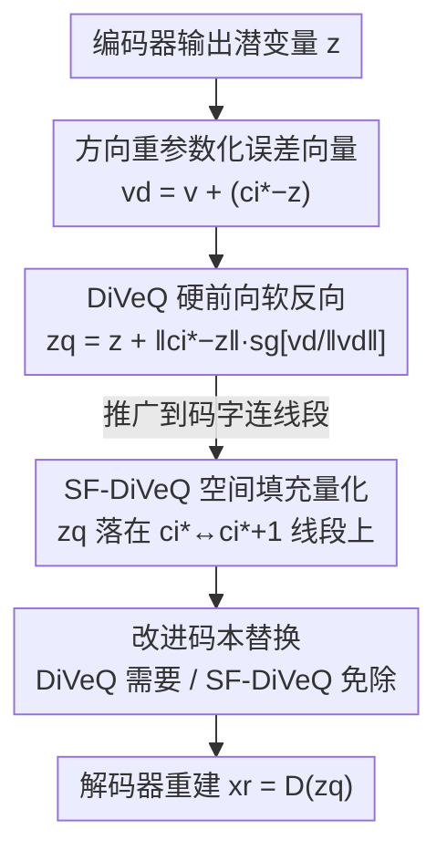

# DiVeQ: Differentiable Vector Quantization Using the Reparameterization Trick

**会议**: ICLR 2026  
**OpenReview**: [https://openreview.net/forum?id=KRVnpTbx7R](https://openreview.net/forum?id=KRVnpTbx7R)  
**代码**: https://github.com/AaltoML/DiVeQ （另有 PyPI 包 `diveq`）  
**领域**: 表示学习 / 向量量化 / 自监督  
**关键词**: 向量量化, 重参数化技巧, 离散表示, 码本坍缩, VQ-VAE

## 一句话总结
DiVeQ 把"把潜变量映射到最近码字"这个不可导操作，重写成"给潜变量加一个方向对准最近码字、长度等于量化误差的误差向量"，从而前向保持硬量化、反向让梯度顺畅流过；其空间填充变体 SF-DiVeQ 进一步把量化目标从离散码字推广到码字间的连线段，在图像压缩、图像生成和语音编码三类任务上都比 STE / EMA / Rotation Trick / Gumbel-Softmax / NSVQ 重建更准、且无需任何辅助损失或温度退火。

## 研究背景与动机
**领域现状**：向量量化（VQ）是把连续潜表示离散成有限码本的经典手段，自 VQ-VAE 把它搬进深度网络后，已成为图像、视频、语音生成与压缩模型（VQGAN、DAC 等）的核心模块——网络中间插一层 VQ，把编码器输出 $z$ 映射到码本 $C=\{c_1,\dots,c_K\}$ 里最近的码字 $c_{i^*}=\arg\min_{c_j}\|z-c_j\|_2$，得到紧凑的离散 token。

**现有痛点**：$\arg\min$ 是不可导的，$\partial \hat z/\partial z$ 根本不存在，所以反向传播时梯度无法穿过 VQ 层，编码器收不到任何来自重建损失的梯度——这就是所谓的"梯度坍缩（gradient collapse）"。围绕它衍生出一堆补丁，但每个都有硬伤：STE（直通估计）直接假装 $\partial \hat z/\partial z=1$ 把梯度原样拷过去，但前向后向不一致导致梯度有偏，还要额外的码本损失和承诺损失、调 $\alpha,\beta$；EMA 用滑动平均更新码本，码本不是端到端训练的；Rotation Trick 用旋转+缩放把 $z$ 转到码字方向，小码本下表现很差；Gumbel-Softmax（ST-GS）靠温度 $\tau$ 退火做软量化，训练用软、测试用硬，存在训练-测试不匹配；NSVQ 用加噪模拟量化误差，但噪声方向是各向同性随机的，在高维下有约 67%→1 的概率"过冲"真实量化误差，且训练与测试映射不同，同样有训练-测试 gap。

**核心矛盾**：所有方法都在"前向要硬（保留精确的最近邻赋值）"和"反向要软（让梯度能流）"之间打架——要么牺牲梯度保真度（STE 的有偏梯度、NSVQ 的随机方向），要么牺牲前向的精确性（软量化、训练-测试不匹配），还普遍受码本坍缩和"码本-潜在表示错位（misalignment）"困扰。

**本文目标**：构造一个可导的代理 $z_q(z,C)$，同时满足三点：方差趋零时退化为硬最近邻赋值；对编码器和码本都给出稳定、几何上忠实的梯度；不引入辅助损失、不调温度、不造成训练-测试不匹配。

**切入角度**：作者从 VAE 的重参数化技巧（reparameterization trick）借灵感——既然量化等价于"给 $z$ 加一个量化误差向量 $\xi_Q$"（$z_q=z+\xi_Q$），那只要把这个误差向量构造成"方向精确对准最近码字、长度恰好等于 $\|z-c_{i^*}\|_2$"，前向结果就精确落在 $c_{i^*}$ 上，而误差向量本身是 $z$ 和 $c_{i^*}$ 的可导函数。

**核心 idea**：用一个"方向被拉向最近码字"的重参数化误差向量代替随机噪声，让前向严格硬量化、反向梯度顺畅且几何一致；再把这个思路从"点"推广到"线段"得到 SF-DiVeQ，顺带解决码本坍缩和错位。

## 方法详解

### 整体框架
DiVeQ 不改动 VQ-VAE / VQGAN / DAC 的主干结构，只替换其中那一层不可导的 VQ：编码器把输入 $x$ 编成连续潜变量 $z=E(x)$，DiVeQ 层把 $z$ 量化成 $z_q$，解码器从 $z_q$ 重建 $x_r=D(z_q)$。关键在于量化层的写法——前向阶段 $z_q$ 在数值上精确等于最近码字 $c_{i^*}$（保持硬量化），但它被写成 $z$ 与 $c_{i^*}$ 的可导表达式，于是反向阶段梯度能同时流回编码器和码本，整个网络端到端训练，不需要任何辅助损失、温度调度或停止梯度技巧之外的额外项。

论文给出两层递进的设计：DiVeQ 把量化建模成"加一个方向重参数化的误差向量"，把 $z_q$ 钉在离散码字上；SF-DiVeQ 把量化目标从"码字这个点"放宽到"相邻两码字之间的连线段"，让 $z_q$ 落在码字连成的连续曲线上，从而既减小量化误差又天然用满整个码本。两者都配一个改进的码本替换算法兜底坍缩（SF-DiVeQ 不需要它）。

### 关键设计

**1. 方向重参数化误差向量：把随机噪声"拧"到对准最近码字**

这一步针对的是 NSVQ 的过冲痛点。NSVQ 用 $z_q=z+\|z-\hat z\|_2\cdot v/\|v\|_2$，其中 $v\sim\mathcal N(0,I)$ 是各向同性噪声，于是 $z_q$ 等概率落在以量化误差为半径的超球面上任意方向——在二维里它有约 $240^\circ/360^\circ\approx0.67$ 的概率比真实最近邻误差还大，维度一高这个过冲概率趋近 1，码本也因为方向太随机而难以收敛到最优位置。DiVeQ 的修法是借重参数化技巧给噪声加一个偏置方向 $\vec d=c_{i^*}-z$：定义 $v_d=v+\vec d$（$v\sim\mathcal N(0,\sigma^2 I)$），让噪声的均值就指向最近码字。直觉上 $\sigma^2$ 越小，$v_d$ 越被"拧"向 $\vec d$ 这个方向，量化越精确；$\sigma^2\to\infty$ 时退化回 NSVQ 的超球面随机，$\sigma^2\to 0$ 时 $v_d\approx\vec d$，方向严格对准码字。

**2. 硬前向、软反向的可导量化公式：前向精确落在码字、反向几何一致**

把上面的方向向量代进量化表达式，DiVeQ 定义

$$z_q = z + \|c_{i^*}-z\|_2 \cdot \mathrm{sg}\!\left[\frac{v_d}{\|v_d\|_2}\right],\qquad c_{i^*}=\arg\min_{c_j}\|z-c_j\|_2.$$

这里用停止梯度 $\mathrm{sg}[\cdot]$ 把"单位方向"在前向当成常数：当 $\sigma^2$ 足够小（论文取 $\sigma^2\le10^{-2}$），$v_d/\|v_d\|_2\approx (c_{i^*}-z)/\|c_{i^*}-z\|_2$，于是 $z_q\approx z+(c_{i^*}-z)=c_{i^*}$，前向就是精确的硬量化；而误差向量的长度 $\|c_{i^*}-z\|_2$ 和被 sg 包住的方向都对 $z$、$c_{i^*}$ 可导，反向梯度为

$$\frac{\partial z_q}{\partial z}=1+a\cdot\frac{z-c_{i^*}}{\|c_{i^*}-z\|_2},\qquad \frac{\partial z_q}{\partial c_{i^*}}=a\cdot\frac{c_{i^*}-z}{\|c_{i^*}-z\|_2},\quad a=\mathrm{sg}\!\left[\frac{c_{i^*}-z}{\|c_{i^*}-z\|_2}\right].$$

和 STE 把梯度强行设成 1 不同，DiVeQ 的梯度是从一个与最近邻操作几何一致的代理里真算出来的，因此无偏、训练-测试不再错配；和 NSVQ 不同，它前向不再过冲、方向确定，码本更容易收敛。$\sigma^2$ 在 $\le10^{-2}$ 区间内对性能几乎无影响，所以作者不把它当需要逐数据集调的真超参（论文统一用 $10^{-3}$ 做压缩/语音、$10^{-2}$ 做生成）。

**3. SF-DiVeQ 空间填充量化：把"点量化"放宽成"线段量化"，顺手治坍缩和错位**

DiVeQ 仍把输入钉在离散码字上，于是仍可能有码字从不被选中、收不到梯度而坍缩，需要码本替换这种启发式兜底。SF-DiVeQ 借空间填充向量量化（SFVQ）的思路，把量化目标改成相邻码字 $c_{i^*}$ 与 $c_{i^*+1}$ 之间的连线段上的随机一点：

$$z_q=z+\|c_{i^*}-z\|_2\cdot\mathrm{sg}\!\left[\frac{(1-\lambda_{i^*})v_{d_{i^*}}}{\|v_{d_{i^*}}\|_2}\right]+\|c_{i^*+1}-z\|_2\cdot\mathrm{sg}\!\left[\frac{\lambda_{i^*}v_{d_{i^*+1}}}{\|v_{d_{i^*+1}}\|_2}\right],$$

其中 $\lambda_{i^*}\sim U(0,1)$ 是插值系数，$v_{d_{i^*}}=v+(c_{i^*}-z)$、$v_{d_{i^*+1}}=v+(c_{i^*+1}-z)$。因为训练时 $z$ 被量化到码字连线上，这些连线会被"拉进"数据分布内部（它们必须是合法的量化点），从而码本表示 $C_z$ 和潜在表示 $P_z$ 不再错位（见论文 t-SNE 图，错位距离从 NSVQ 的 $2.6\times10^{-4}$、STE 的 $0.012$ 降到 $3.9\times10^{-5}$）；又因为量化点在连续曲线上而非仅在离散码字上，自由度大得多，量化误差更小、码本利用率天然拉满，彻底不需要码本替换。

**4. 改进的码本替换算法：给会坍缩的方法兜底**

对 STE / EMA / RT / ST-GS / NSVQ / DiVeQ 这些仍可能坍缩的方法，作者给了一个比以往更快更稳的码本替换算法：定期把训练中从未被选中的"死"码字，用活跃码字的扰动副本替换掉。为公平比较，论文对除 SF-DiVeQ 外的所有方法都统一启用这套替换；消融显示即便关掉替换，DiVeQ 仍稳定优于其它方法，说明性能不是替换"喂"出来的。这一项是工程兜底而非核心创新，SF-DiVeQ 因为自带满利用率而完全免除它。

### 损失函数 / 训练策略
DiVeQ / SF-DiVeQ 不引入任何 VQ 专属的辅助损失（无码本损失、无承诺损失、无 KL 项、无温度退火），只用各主干模型原本的目标：VQ-VAE 压缩用 MSE 重建损失 + 权重为 1 的 LPIPS 感知损失；VQGAN 和 DAC 沿用各自原版损失。SF-DiVeQ 用一种定制初始化——先不带 VQ 训两个 epoch，再用最近 20–50 个 batch 潜变量的均值初始化码本（论文也验证随机初始化下结果几乎一样）。

## 实验关键数据

### 主实验
三类任务：VQ-VAE 图像压缩、VQGAN 图像生成、DAC 语音编码；数据集涵盖 CELEBA-HQ / FFHQ / AFHQ / LSUN Bedroom & Church（图像，256×256）和 VCTK（语音）。下表为 VQ-VAE 压缩在 AFHQ 上 11-bit 码本的 LPIPS↓（越低越好，节选自重建质量对比）：

| 数据集（11-bit） | 指标 | STE | EMA | RT | NSVQ | DiVeQ | SF-DiVeQ |
|--------|------|------|------|------|------|------|------|
| CELEBA-HQ | LPIPS↓ | 0.373 | 0.362 | 0.388 | 0.473 | 0.355 | **0.349** |
| AFHQ | LPIPS↓ | 0.259 | 0.246 | 0.278 | 0.484 | 0.240 | **0.238** |
| FFHQ | LPIPS↓ | 0.232 | 0.224 | 0.276 | 0.389 | 0.221 | **0.216** |

VQGAN 生成在 CELEBA-HQ 上的 FID↓（HP2: lr=$2.5\times10^{-4}$, batch=32，红色为错位崩坏案例）：

| 方法 \ bits | 8 | 9 | 10 | 12 |
|------|------|------|------|------|
| STE | 334（崩） | 7.54 | 7.34 | 9.45 |
| ST-GS | 309（崩） | 41.1 | 197 | 155 |
| NSVQ | 78.4 | 70.1 | 62.1 | 49.6 |
| DiVeQ | 8.44 | 8.01 | 7.59 | 9.54 |
| SF-DiVeQ | 8.46 | **6.66** | 7.02 | **7.40** |

可见大学习率 + 大 batch（HP2）下 STE、ST-GS 在小码本（8-bit）直接崩到 FID>300（错位），而 DiVeQ 最坏也只是 8.44，SF-DiVeQ 完全不出现错位崩坏。

### 消融实验

| 配置 | 关键现象 | 说明 |
|------|---------|------|
| $\sigma^2$ 敏感性 | $\sigma^2\le10^{-2}$ 时性能仅边际变化 | 方差不算需调的真超参 |
| 关掉码本替换 | DiVeQ 仍稳定领先 | 性能非替换喂出来 |
| SF-DiVeQ 随机初始化 | 与定制初始化几乎持平 | 初始化不敏感 |
| 码本-潜在错位（t-SNE 距离↓） | STE 0.012 / NSVQ 2.6e-4 → DiVeQ 5e-5 / SF-DiVeQ **3.9e-5** | SF-DiVeQ 错位最小 |

### 关键发现
- **小码本和大学习率是试金石**：DiVeQ / SF-DiVeQ 在 8–9 bit 这种"难"码本上对其它方法拉开最大差距，而 STE / ST-GS 在 HP2 下会因错位整体崩坏。
- **错位（misalignment）是 rate-distortion 理论失效的元凶**：作者发现"码本增大反而指标不升"的反常案例，t-SNE 证实根因是码本表示 $C_z$ 与潜在表示 $P_z$ 错位；SF-DiVeQ 通过把量化曲线拉进数据分布内部，从机制上消除了这种错位。
- **RT 对小码本特别不友好**：Rotation Trick 在压缩和生成两类任务的小码本上都明显落后。
- **NSVQ 整体最差**：随机方向导致的过冲和训练-测试不匹配，使其 FID/LPIPS 大幅落后，印证了"把噪声方向拧准"的必要性。

## 亮点与洞察
- **用重参数化技巧的"另一半"做量化**：VAE 用重参数化让采样可导，DiVeQ 反过来用它让"硬选最近码字"可导——同一个数学工具换一个用途，思路很漂亮且可迁移到任何含 $\arg\min$ 的离散瓶颈。
- **前向硬、反向软的优雅实现**：靠 $\mathrm{sg}[\cdot]$ 把单位方向冻成常数，使 $z_q$ 数值上精确等于码字、却是 $z,c_{i^*}$ 的可导函数，避免了 STE 的梯度有偏和 NSVQ 的训练-测试不匹配。
- **"点→线段"的放宽一箭三雕**：SF-DiVeQ 把量化目标从离散点改成连续线段，同时拿到更小量化误差、满码本利用率、无需码本替换，且消除错位——一个几何上很自然的推广解决了多个老大难。
- **真·drop-in**：DiVeQ / SF-DiVeQ 只需替换标准 VQ 层、改极少代码，无辅助损失无温度退火，且对 Residual VQ 等变体同样适用，工程落地成本极低。

## 局限与展望
- SF-DiVeQ 需要"相邻码字"的概念（码字间连线段），码本的拓扑顺序如何定义/学习对结果有影响，论文用 SFVQ 的 dithering 构造，但更高维下连线段拓扑是否最优仍待探究。
- 实验集中在图像（256×256）和语音 codec，未覆盖视频、超大码本（如 LLM tokenizer 级别）等场景，扩展性待验证。
- DiVeQ 仍需码本替换兜底坍缩；虽然作者给了改进版替换，但它本质仍是启发式，只有 SF-DiVeQ 才真正免除。
- $\sigma^2$ 虽被论证为"小即可、不敏感"，但其下界（过小是否带来数值问题）和与码本规模的交互未深入分析。

## 相关工作与启发
- **vs STE / EMA**：它们靠 $\partial\hat z/\partial z=1$ 把梯度原样拷过去、码本非端到端训练且需辅助损失；DiVeQ 给出几何一致的真梯度、端到端、无辅助损失，小码本下优势随码本增大而扩大。
- **vs Rotation Trick**：RT 用旋转+缩放把 $z$ 转到码字方向、仍需辅助损失，且小码本表现差；DiVeQ 用加误差向量的方式同样保硬量化但更稳、无需调旋转相关项。
- **vs Gumbel-Softmax / ST-GS**：ST-GS 靠温度退火做软量化、训练用软测试用硬有 gap；DiVeQ 前向即硬、无温度、无训练-测试不匹配。
- **vs NSVQ**：同样"加误差向量"，但 NSVQ 方向各向同性随机、高维过冲且训练-测试映射不同；DiVeQ 把方向重参数化拧向最近码字，从根上修掉过冲和不匹配——可以看作 NSVQ 的"方向校正版"。
- **vs FSQ / LFQ / BSQ 等固定几何码本**：这些方法把码本约束成预定义几何结构、不与模型联合训练；DiVeQ / SF-DiVeQ 仍联合训练可学习码本，灵活性更高。

## 评分
- 新颖性: ⭐⭐⭐⭐⭐ 用重参数化技巧把不可导 VQ 变成"硬前向软反向"，并以"点→线段"推广同时解决坍缩与错位，思路清晰且通用。
- 实验充分度: ⭐⭐⭐⭐⭐ 覆盖图像压缩/生成/语音三类任务、五个数据集、多码本规模与超参设置，含错位 t-SNE、替换/初始化/方差消融。
- 写作质量: ⭐⭐⭐⭐⭐ Table 1 把七类方法的七个性质并排对比，公式推导与几何直觉（Fig.2/3）讲得很透。
- 价值: ⭐⭐⭐⭐⭐ 即插即用、无辅助损失、对 RVQ 等变体通用，对所有依赖离散表示的生成/压缩模型都有直接落地价值。

<!-- RELATED:START -->

## 相关论文

- [\[AAAI 2026\] Expandable and Differentiable Dual Memories with Orthogonal Regularization for Exemplar-free Continual Learning](../../AAAI2026/self_supervised/expandable_and_differentiable_dual_memories_with_orthogonal_regularization_for_e.md)
- [\[ICLR 2026\] Incomplete Multi-View Multi-Label Classification via Shared Codebook and Fused-Teacher Self-Distillation](incomplete_multi-view_multi-label_classification_via_shared_codebook_and_fused-t.md)
- [\[ICLR 2026\] One-Shot Exemplars for Class Grounding in Self-Supervised Learning](one-shot_exemplars_for_class_grounding_in_self-supervised_learning.md)
- [\[ICLR 2026\] Why Prototypes Collapse: Diagnosing and Preventing Partial Collapse in Prototypical Self-Supervised Learning](why_prototypes_collapse_diagnosing_and_preventing_partial_collapse_in_prototypic.md)
- [\[ICLR 2026\] PredNext: Explicit Cross-View Temporal Prediction for Unsupervised Learning in Spiking Neural Networks](prednext_explicit_cross-view_temporal_prediction_for_unsupervised_learning_in_sp.md)

<!-- RELATED:END -->
