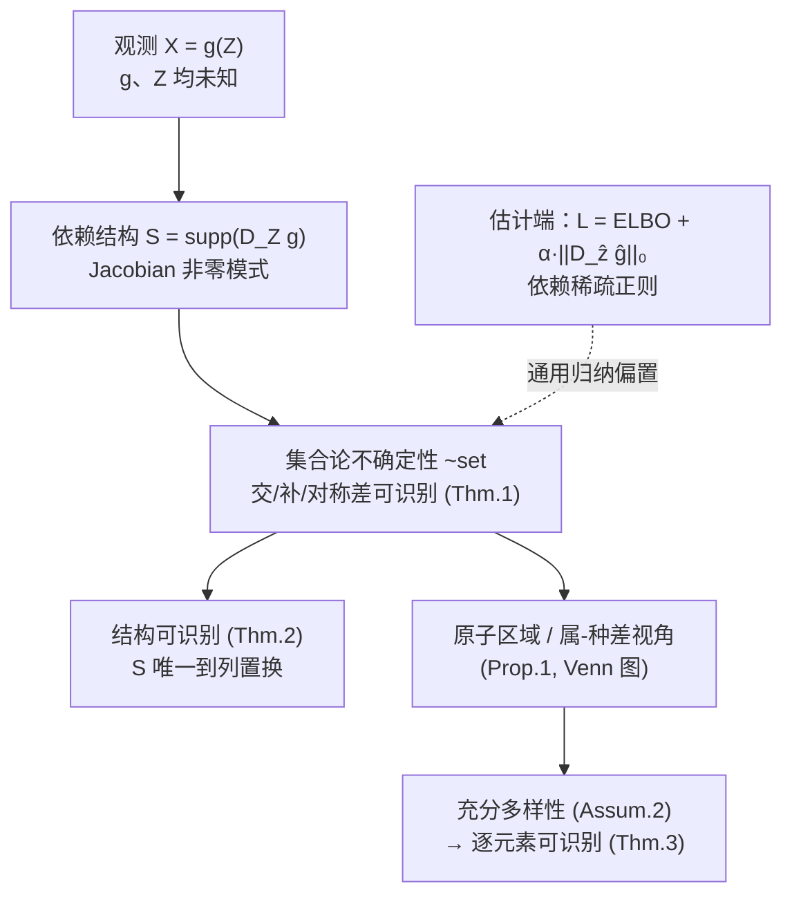

# Diverse Dictionary Learning

**会议**: ICLR 2026  
**OpenReview**: [https://openreview.net/forum?id=lP4RsdfF6y](https://openreview.net/forum?id=lP4RsdfF6y)  
**代码**: 待确认  
**领域**: 表示学习 / 可识别性理论  
**关键词**: 可识别性, 非线性ICA, 字典学习, 解耦表示, 集合论, 依赖稀疏, 稀疏自编码器  

## 一句话总结
当观测 $X=g(Z)$ 的生成过程 $g$ 与隐变量 $Z$ 都未知、又不愿引入线性/辅助监督等强假设时，本文证明隐变量"集合"的交、补、对称差以及隐-观依赖结构在最小假设下仍可被识别，并指出实现这一切只需在估计时对 Jacobian 加一个 L1 稀疏正则（"依赖稀疏"）这一通用归纳偏置。

## 研究背景与动机
**领域现状**：字典学习最一般的形式是 $X=f(Z)$，统一了 ICA、因子分析、因果表示学习等一大类隐变量模型，其核心诉求是"可识别性"——能否从观测数据唯一恢复真实生成过程。但在非参数设定下这是病态的，于是绝大多数工作都退回到**线性字典学习**（观测=隐变量的稀疏线性组合，如 Olshausen & Field、K-SVD），或者引入辅助变量做弱监督、约束混合函数形式、依赖干预/反事实数据来换取保证。

**现有痛点**：这些强假设在现实中几乎无法验证，而且大部分理论保证在假设被轻微违反时就整体崩溃。一个切身的例子是机制可解释性里广泛使用的**稀疏自编码器（SAE）**——它本质上是稀疏线性字典学习，因而难以表达大模型表示中固有的非线性结构，近来还被质疑存在 feature absorption、线性约束、高维等问题。

**核心矛盾**：理论上"加假设换保证"，但假设不可验证；实践上人们其实不在乎理想条件下的完全可识别，而是关心"哪些归纳偏置真能促进恢复、且在真值未知时仍稳健"。两者之间存在一道鸿沟。

**本文目标**：把可识别性变成"可操作"的——在完全可识别不可达的一般设定下，追问两个问题：(1) 隐过程的哪些方面仍能带保证地恢复？(2) 应该引入什么归纳偏置来引导恢复？

**核心 idea**：**[局部代替全局]** 不再追求恢复全部隐变量，而是采用"局部 + 集合论"的视角——证明任意一组观测所关联的隐变量支撑集，其**交集、补集、对称差**以及隐-观**依赖结构**都可在适当不确定性下识别；这些集合论结果可用集合代数自由组合，拼出"属+种差"式的结构化世界观；当结构足够多样时甚至蕴含全部隐变量的逐元素可识别。**[一个偏置打通]** 所有这些好处在估计端只需要一个简单的依赖稀疏正则即可获得。

## 方法详解

### 整体框架
本文不是提一个新模型，而是给出一套"可识别性理论 + 一个即插即用的正则"。它先把隐-观关系形式化为 Jacobian 支撑构成的**依赖结构** $S$，再定义一种基于集合论运算的**广义不确定性**来刻画"在最小假设下到底能恢复什么"，并证明只要在估计时加 Jacobian 稀疏约束，模型就被钉死到这种集合论可识别性；最后给出一个"充分多样性"结构条件，把集合级的识别升级为逐元素的完全识别。

### 关键设计

**1. 依赖结构：把隐-观关系定义为 Jacobian 的支撑**  
要谈"恢复什么"，先得有一个不依赖参数形式的关系刻画。本文把生成函数 $g$ 的 Jacobian 非零模式定义为依赖结构 $S := \mathrm{supp}(D_Z g; \mathcal{Z}) = \{(i,j)\mid \exists z,\ \partial g_i(z)/\partial z_j \neq 0\}$。它捕捉的是"哪个隐变量在功能上影响哪个观测"，是**功能依赖而非统计依赖**——因此不要求 $Z$ 各分量统计独立，跳出了 ICA 常见的独立混合假设。这个 Jacobian 视角是后续一切的基石：识别目标、正则手段、充分性条件都围绕它展开。

**2. 集合论不确定性：在最小假设下"可恢复"的精确语言**  
本文先用观测等价 $\theta\sim_{obs}\hat\theta$（两模型给出相同 $p(x)$）定义估计能看到的极限，再引入**集合论不确定性** $\theta\sim_{set}\hat\theta$ 来刻画"在这之上还能保证什么"。对任意两组观测 $X_K,X_V$ 及其隐索引集 $I_K,I_V$，存在置换 $\pi$ 使得：交集 $I_K\cap I_V$ 中的隐变量不能是对称差 $I_K\Delta I_V$ 的函数（反之亦然），且两个独占部分 $I_K\setminus I_V$ 与 $I_V\setminus I_K$ 互不纠缠。直观说，就是"共享因子(属)与独有因子(种差)被强制解耦"。由于交/补/对称差构成集合代数的基础，它们可被自由组合，从而推出 object-centric（每个对象有独立表示）、individual-centric（域特有因子隔离）、shared-centric（跨域共享因子）等现实中真正有用的解耦模式，并能逐一识别 Venn 图中的每个**原子区域**。

**3. 一个稀疏正则换来全部保证（Thm.1–2）**  
主定理表明：在"充分非线性"假设（Assum.1，存在若干样本使各点 Jacobian 向量线性无关、张成支撑空间）与"$Z$ 密度处处为正"两个标准条件下，只要估计时满足 $\|D_{\hat Z}\hat g\|_0 \le \|D_Z g\|_0$，就有 $\theta\sim_{obs}\hat\theta \Rightarrow \theta\sim_{set}\hat\theta$，同时依赖结构本身也可识别到列置换（Thm.2）。关键点在于：这个稀疏**不是对数据生成过程的假设**（真值可以一点都不稀疏），而是估计端的一个归纳偏置，对应连接主义版的奥卡姆剃刀——总是剃掉多余的关系。它只要模型可拿到映射对隐变量的梯度（admits a Jacobian）就能加，几乎可塞进任何可微模型。

**4. 充分多样性：从集合升级到逐元素识别（Thm.3）**  
既然广义可识别性能恢复 Venn 图的每个原子区域，那么只要图"足够丰富"——每个隐变量都独占一个原子区域——就直接得到逐元素可识别。本文把这一直觉形式化为**充分多样性**（Assum.2）：对每个 $Z_i$ 存在一组观测 $A$，使其支撑的并集覆盖全空间且某种"独占/独缺/交集"条件成立。它把 Zheng et al.(2022) 的结构稀疏条件作为三个子条件之一纳入（故严格更弱、更一般），并强调**"多样 ≠ 稀疏"**：即使结构近乎全连接，只要连接模式之间存在差异（哪怕只差一条边）就仍然成立，而 anchor feature 之类稀疏假设会排除稠密结构。

## 实验关键数据

### 主实验表格（视觉解耦，FactorVAE↑ / DCI↑，三种生成范式各加"依赖稀疏"）

| 模型族 | 方法 | Shapes3D DCI | Cars3D DCI | MPI3D DCI |
|---|---|---|---|---|
| VAE | FactorVAE | 0.484 | 0.135 | 0.345 |
| VAE | + Latent Sparsity | 0.477 | 0.113 | 0.325 |
| VAE | **+ Dependency Sparsity** | **0.575** | **0.144** | **0.384** |
| Diffusion | EncDiff | 0.901 | 0.250 | 0.676 |
| Diffusion | + Latent Sparsity | 0.891 | 0.241 | **0.684** |
| Diffusion | **+ Dependency Sparsity** | **0.947** | **0.256** | 0.667 |
| GAN | DisCo | 0.710 | 0.319 | 0.306 |
| GAN | **+ Dependency Sparsity** | **0.712** | **0.320** | **0.324** |

依赖稀疏（对 Jacobian 加 L1）在多数数据集/骨干上稳定优于原方法，也优于"潜变量稀疏"（对 $Z$ 加 L1），其中 EncDiff+依赖稀疏在 Shapes3D 上 FactorVAE 分达到 1.0000。

### 消融实验表格（合成数据验证理论）

| 实验 | 设置 | 指标 | 结论 |
|---|---|---|---|
| 广义可识别性 | 维度 3/4/5，分两组 $X_K,X_V$ | $R^2$（越低越解耦） | Int / SymDiff / Comp 各方向 $R^2$ 显著低于 Ref，Defn.5 全部条件被满足 |
| 逐元素可识别 | 满足 vs 违反充分多样性 | MCC | 仅满足结构条件的数据集达到高 MCC，违反则不行 |

### 关键发现
- **依赖稀疏 > 潜变量稀疏**：这点对机制可解释性尤为重要——SAE 走的恰恰是潜变量稀疏路线，本文结果为"潜变量稀疏在 SAE 中的局限"（feature absorption、线性约束、高维）提供了理论与经验旁证。
- 骨干用 VAE，目标为 $\mathcal{L}=\text{ELBO}+\alpha\|D_{\hat z}\hat g\|_0$，全程 $\alpha=\beta=0.05$、10000 样本、MLP+LeakyReLU 的非线性生成，超参未逐数据集调，体现正则的"通用、即插即用"。

## 亮点与洞察
- **换了个提问方式**：从"如何加假设把全部隐变量识别出来"转向"在最小假设下究竟还剩什么能识别"，把不可达的完全可识别性变成可操作的局部保证，这是该领域少见的"补集视角"。
- **集合代数当积木**：交/补/对称差可组合出原子区域、属-种差定义、object/individual/shared-centric 解耦，一套语言统一了诸多看似分散的解耦概念。
- **理论与实践罕见地对齐**：所有保证最终落到"对 Jacobian 加 L1"这一已被业界广泛使用却长期缺乏理论的正则，等于给一个流行经验技巧补上了可识别性根基。
- **统一既有条件**：充分多样性把 Zheng et al.(2022) 的结构稀疏作为特例纳入，并明确区分"多样性"与"稀疏性"，澄清了一个常见混淆。

## 局限与展望
- 仍需"充分非线性""$Z$ 密度处处为正""$g$ 为 $C^2$ 微分同胚"等基础正则性条件，病态情形被排除；噪声过程只在加性/可去卷积设定下自然扩展。
- 充分多样性是否为逐元素可识别的**必要**条件仍是猜想，未完全证明。
- 实验规模偏理论验证（合成 + 标准解耦基准 Shapes3D/Cars3D/MPI3D），尚未在真正的大规模基础模型/真实 SAE 场景上验证依赖稀疏的收益。
- 作者点名的未来方向：把广义可识别性引入基础模型——在海量数据与算力下，渐近保证正变得越来越现实，identifiability 启发的归纳偏置或许是被忽视的突破口。

## 相关工作与启发
- **非线性 ICA / 因果表示学习**：相比依赖辅助变量、干预、反事实或限定混合函数形式的主流路线，本文刻意只用最小假设，问"还能恢复什么"。
- **块可识别性（von Kügelgen et al. 2021 等）**：本文的原子区域识别概念上相近，但不需要多视图/多域弱监督；与 Yao et al.(2024b) 的"识别代数"方向相反——后者先用多视图恢复组再求交，本文直接从基础假设识别交与补。
- **结构稀疏可识别（Zheng et al. 2022）**：被纳入为充分多样性的第三子条件，故本文严格更一般。
- **对机制可解释性的启发**：依赖稀疏优于潜变量稀疏的实证，为重新审视 SAE 的设计（从"潜变量稀疏"转向"依赖/Jacobian 稀疏"）提供了一个有理论支撑的方向。

## 评分
- **新颖性**: ⭐⭐⭐⭐⭐ —— "局部+集合论"的补集视角在可识别性领域少见，把交/补/对称差作为可识别对象并用集合代数组合，框架原创且统一了多个既有概念。
- **实验充分度**: ⭐⭐⭐⭐ —— 合成数据精准验证了 Thm.1/Thm.3，三种生成范式上验证了依赖稀疏正则的通用增益；但规模偏中小、未触及大模型/真实 SAE 场景。
- **写作质量**: ⭐⭐⭐⭐ —— 问题动机清晰、定义层层递进、用 Venn 图与属-种差的直觉贯穿，理论密度高但可读；公式与符号偏多对非该方向读者门槛不低。
- **价值**: ⭐⭐⭐⭐⭐ —— 给一个被广泛使用却缺理论的"Jacobian 稀疏"补上可识别性根基，且对 SAE/机制可解释性给出可操作的改进方向，理论与实践价值兼具。

<!-- RELATED:START -->

## 相关论文

- [\[CVPR 2026\] DiverseDiT: Towards Diverse Representation Learning in Diffusion Transformers](../../CVPR2026/self_supervised/diversedit_towards_diverse_representation_learning_in_diffusion_transformers.md)
- [\[CVPR 2025\] UniSTD: Towards Unified Spatio-Temporal Learning Across Diverse Disciplines](../../CVPR2025/self_supervised/unistd_towards_unified_spatio-temporal_learning_across_diverse_disciplines.md)
- [\[ICLR 2026\] A Bayesian Nonparametric Framework for Learning Disentangled Representations](a_bayesian_nonparametric_framework_for_learning_disentangled_representations.md)
- [\[ICLR 2026\] Mechanistic Independence: A Principle for Identifiable Disentangled Representations](mechanistic_independence_a_principle_for_identifiable_disentangled_representatio.md)
- [\[ICLR 2026\] Understanding the Learning Phases in Self-Supervised Learning via Critical Periods](understanding_the_learning_phases_in_self-supervised_learning_via_critical_perio.md)

<!-- RELATED:END -->
