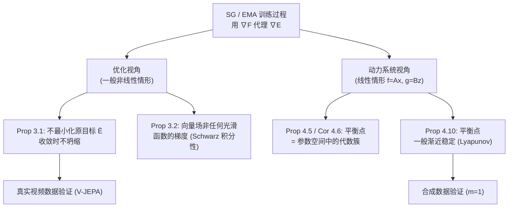

# Dual Perspectives on Non-Contrastive Self-Supervised Learning

**会议**: ICLR 2026  
**OpenReview**: [https://openreview.net/forum?id=f5MC1G6XhB](https://openreview.net/forum?id=f5MC1G6XhB)  
**代码**: 未公开  
**领域**: 自监督学习 / 表示学习理论  
**关键词**: 非对比自监督, stop-gradient, EMA, 表示坍缩, 动力系统, 优化理论  

## 一句话总结
本文从优化与动力系统两个视角严格证明：非对比自监督中常用的 stop-gradient（SG）与 EMA 训练过程并不最小化任何良定义的目标函数，但它们在收敛时确实避免坍缩，且在线性情形下其非平凡平衡点是渐近稳定的。

## 研究背景与动机

**领域现状**：非对比自监督学习（BYOL、SimSiam、DINO、V-JEPA 等）已成为表示学习的主流，往往超越对比方法，并且无需挖掘负样本。它们的核心是 teacher/student 不对称结构：student 用「编码器+预测器」算出源视图，去预测由 teacher（编码器的冻结副本 SG，或延迟副本 EMA）算出的目标视图。

**现有痛点**：SG 与 EMA 是防止「表示坍缩」（学到常数嵌入）的关键技巧，经验上极其有效，但它们与「最小化某个明确目标函数」之间**没有显而易见的联系**。BYOL 作者甚至在原文中猜想「不存在任何损失 $\mathcal{L}_{\theta,\xi}$ 使 BYOL 的动力学是对其的联合梯度下降」。

**核心矛盾**：实践上工作得很好的方法，在理论上却像一个「黑箱」——我们不知道它在优化什么、是否收敛、收敛点是否稳定。此前 Tian et al. (2021) 等给出过线性情形的分析，但都依赖一些难以在实践中验证的额外假设（如两视图在条件分布上同分布、某些 PSD 矩阵特征值有下界）。

**本文目标**：回答三个问题——(a) SG/EMA 是否在解某个优化问题？是哪个？(b) 它们是否收敛、收敛时是否保证避免坍缩？(c) 作为动力系统，它们的平衡点是否稳定（不会漂移回平凡解）？

**核心 idea**：**用「优化视角」回答 (a)(b)，用「动力系统视角」回答 (c)**——优化视角证明 SG/EMA 不是任何光滑函数的梯度流但能避免坍缩；动力系统视角在线性情形把平衡点刻画为参数空间中的代数簇，并证明其渐近稳定。两个视角互补地拆解了同一个谜题。

## 方法详解

### 整体框架
本文不提出新算法，而是给 SG/EMA 这两个既有训练过程做严格的理论"体检"。统一的设定是 Siamese 网络：编码器 $f_\theta$、预测器 $g_\psi$，损失为 $\bar{E}(\theta,\psi)=\mathbb{E}_{x,y}\,l[g_\psi\circ f_\theta(x),\,f_\theta(y)]+\Omega(\theta,\psi)$。为了刻画 SG/EMA，引入带额外 teacher 参数 $\xi$ 的目标 $\bar{F}(\theta,\psi,\xi)$，其中 SG 取 $\xi=\theta$（真 Siamese），EMA 用滑动平均 $\xi_t=\alpha\xi_{t-1}+(1-\alpha)\theta_t$ 维护延迟的 teacher。分析沿两条主线展开：先在一般（非线性）情形用积分性定理判定它们是否是梯度场，再在线性情形把它们看作（离散/连续）动力系统刻画平衡点与稳定性。

### 关键设计

**1. 优化视角证伪：SG/EMA 不优化任何良定义函数。** 论文先用 Proposition 3.1 指出，SG 与 EMA 一般既不最小化原目标 $\bar{E}$，收敛时也不会落到坍缩对应的零全局极小。更强的结论由 Proposition 3.2 给出：取损失为半平方欧氏距离、正则为 $\Omega=\lambda(\|\theta\|^2+\|\psi\|^2)/2$ 时，更新所依赖的向量场 $\mathbb{E}[\nabla_\theta F]$ 与 $\mathbb{E}[\nabla_\psi F]$（见下式）一般**不是任何光滑标量函数的梯度场**，从而严格证明了 BYOL 作者的猜想。

$$\nabla_\theta F = J_\theta u^\top[u-v]+\lambda\theta,\qquad \nabla_\psi F = J_\psi u^\top[u-v]+\lambda\psi,$$

其中 $u=g_\psi\circ f_\theta(x)$、$v=f_\xi(y)$。证明的钥匙是 Schwarz 积分性定理：一个向量场要成为某光滑函数的梯度，其二阶交叉偏导必须互为转置；论文显式计算这些交叉导数，证明其差在"通用（generic）"意义下不为零——即可通过对数据分布做任意小扰动使其非零，于是排除了梯度场的可能。这一步把"经验有效但理论模糊"的不安，落实成了一个干净的不可能性定理。

**2. 动力系统视角刻画平衡点为代数簇。** 切换到线性情形 $f_\theta(x)=Ax,\ g_\psi(z)=Bz,\ f_\xi(y)=Cy$（$n>m$），SG/EMA 变成由 $R(A,B,C)\triangleq BA[xx^\top]-C[yx^\top]$ 驱动的离散动力系统（Lemma 4.1）。在不依赖 Tian et al. 那些额外假设的前提下，论文重新导出 $B^\top B=AA^\top$ 等结构性引理，并在 Proposition 4.5 给出 SG 平衡点的精确刻画：设 $S=A^\top A$，则

$$([xx^\top]S+\lambda I)(S[xx^\top]+\lambda I)=[xy^\top]S[yx^\top],\quad B=A[yx^\top]A^\top W^{-1},\ W=A[xx^\top]A^\top+\lambda I.$$

这是关于对称正定矩阵 $S$ 的 $m(m{+}1)/2$ 个二次方程组，一般至多 $2^{m(m+1)/2}$ 个解。Corollary 4.6 据此把平衡点集分解为 $K$ 个子代数簇 $\mathcal{A}_k=\{A:A^\top A=S_k\}$，每个簇形如 $\{U\sqrt{S_k}: U^\top U=I\}$——几何上是参数空间里一族明确的代数流形，而非孤立点。Proposition 4.7 进一步用 Brouwer 不动点与隐函数定理证明这类满秩平衡点在通用数据下确实存在。

**3. 渐近稳定性：避免坍缩的"动力学保证"。** 仅刻画平衡点还不够——还要回答它们会不会"漂移"回平凡解。Proposition 4.10 给出核心保证：SG 与 EMA 的平衡点在通用情形下都是**渐近稳定**的，即从邻近初值出发的轨迹会收敛到该点并停留，且这一结论对 $\alpha=1$ 也成立。证明诉诸经典结果（Arnol'd 1992 / Theorem 4.9）：若把动力学在平衡点附近线性化为 $v(x)=Jx+O(\|x\|^2)$，只要雅可比 $J$ 的所有特征值实部为负即渐近稳定；论文在线性 SG/EMA 上验证了这一充分条件。这与"原始目标的梯度流必然导致 $A\to 0$ 坍缩"（Lemma 4.3）形成鲜明对照——正是 SG/EMA 偏离真梯度的"错误"，让它们绕开了坍缩、停在稳定的非平凡平衡点上。

**4. 标量输入下的完整可视化（$m=1$）。** 为了把抽象结论变成可看的图像，论文取标量输入 $m=1$，此时 $A$ 退化为向量 $a$。Proposition 4.11 给出存在非零平衡点的充要条件 $\Delta=\tau^2-4\rho\lambda\ge 0$（$\rho=[xx^\top],\tau=[yx^\top]$），且平衡点落在两个以原点为心、半径 $r_{1,2}=(|\tau|\mp\sqrt{\Delta})/2\rho$ 的超球面 $S_1,S_2$ 上：外圈 $S_2$ 渐近稳定，内圈 $S_1$ 是鞍点。这个设定既"典型"（两球面就是一般情形里代数簇的具体化），又"极端非通用"（鞍点只在 $m=1$ 出现，$m>1$ 时绝不发生），从而既能画出轨迹又点明了一维情形的特殊性。

## 实验关键数据

实验目的不是刷性能，而是用真实/合成数据**佐证理论**：SG/EMA 是否真不最小化 $\bar{E}$、是否真不收敛、下游精度如何变化。

### 主实验（真实视频数据）

复用 V-JEPA 代码，ViT-S/ViT-B 编码器 + ViT-T 预测器，在 Kinetics710 ∪ SSv2 上训练 1000 epoch（30 万次迭代），下游做注意力池化分类。

| 现象（图 2） | SG | EMA |
|---|---|---|
| $\bar{E}(\theta_t,\psi_t)$ 是否被最小化 | 否，最小值出现在训练早期 | 否（$\bar{F},\bar{E}$ 类似） |
| 参数增量 $\|\theta_t-\theta_{t-1}\|,\|\psi_t-\psi_{t-1}\|\to 0$ | 否，不收敛 | 否，$\xi$ 增量亦不趋零 |
| 下游 top-1 精度趋势 | 先升后降（后期下降） | 先升后达到平台 |
| 同设定下分类效果 | 较低 | 较好 |

### 合成数据实验（$m=1$，1 万次随机试验）

| 算法 | 收敛到外圈 $S_2$（稳定） | 收敛到原点（平凡） | 收敛到鞍点 $S_1$ |
|---|---|---|---|
| EMA | 92.8% | 7.2% | 0%（从未观测到） |
| SG | 82.0% | 18.0% | 0%（从未观测到） |

参数取 $\rho\in[0,3],\tau\in[-1,1],\lambda\in[0.01,0.1]$ 均匀采样；两算法在所有试验中均收敛，但 $\bar{E}/\bar{F}$ 沿轨迹有时下降、有时并不下降，再次印证"不优化良定义目标"。

### 关键发现
- **理论与实验一致**：真实 V-JEPA 训练中 $\bar{E}$ 早早触底、参数不收敛，但分类精度仍上升，说明"它确实学到了东西，只是学的不是 $\bar{E}$"。
- **稳定但可能平凡**：合成实验里算法总会收敛，且压倒性地落到稳定的非平凡外圈，从不停在鞍点；少数情形落到原点（线性情形特有的平凡平衡点）。

## 亮点与洞察
- **把工程直觉变成定理**：首次（在去掉 Tian et al. 假设的前提下）严格证明 SG/EMA 既非任何光滑函数的梯度流、又能避免坍缩，并实证了 BYOL 作者多年的猜想。
- **"双视角"分工干净**：优化视角负责"证伪"（不是在优化），动力系统视角负责"建设"（平衡点是什么、稳不稳），两者拼出完整图景。
- **代数几何语言入场**：用代数簇刻画平衡点、用 Brouwer/隐函数定理证存在性，给 SSL 理论提供了新的数学工具箱。
- **去假设的价值**：原 Tian et al. 的结论依赖难验证的条件，本文用方程结构（Petersen-Pedersen 矩阵恒等式）重证，结论更稳健。

## 局限与展望
- **核心问题悬而未决**：既然 SG/EMA 不优化任何目标，那它们"到底在学什么"仍无答案——论文结尾坦承"much work remains to be done"。
- **稳定性是局部的**：Proposition 4.10 只保证从邻近初值出发会收敛，并不保证非平凡平衡点存在、也不保证全局收敛；EMA/SG 的全局收敛性尚未证明。
- **线性假设很强**：第 4 节的精确刻画全建立在线性编码器/预测器上，真实深度非线性网络的平衡点结构仍开放。
- **实验为佐证而非 SOTA**：为简化牺牲了精度（低于 V-JEPA 原报告），只用于验证理论现象，不能据此比较下游任务表现。

## 相关工作与启发
- **不对称防坍缩理论**：直接承接 Tian et al. (2021)、Wang et al. (2021)、Littwin et al. (2024) 对线性 BYOL/SimSiam 的动力学分析，主要贡献是去掉额外假设并补全平衡点的代数几何刻画。
- **特征去相关路线**：与 VICReg、Barlow Twins、SimCLR 等通过显式去相关防坍缩的方法形成对照；Liu et al. (2022) 指出不对称方法隐式地也在做特征去相关，本文从动力系统侧补充了为何不对称"够用"。
- **启发**：(1) 把"是否梯度场"用 Schwarz 积分性来判定，是分析其他启发式训练过程（如各种 teacher-student/动量更新）的通用利器；(2) 用代数簇 + 局部线性化分析平衡点稳定性的范式，可迁移到 GAN、对比学习等其他"非标准优化"场景。

## 评分
- **新颖性**: ⭐⭐⭐⭐ 证明了 BYOL 长期悬而未决的猜想，并用代数几何/动力系统语言去假设地重建了线性情形理论，理论原创性高。
- **实验充分度**: ⭐⭐⭐ 真实 + 合成双重佐证、覆盖三个核心问题，但实验定位是"验证理论"而非性能评测，规模有限。
- **写作质量**: ⭐⭐⭐⭐ 问题陈述清晰、双视角结构利落，命题与图示呼应紧密；理论密度高，对读者数学背景要求较高。
- **价值**: ⭐⭐⭐⭐ 为广泛使用的 SG/EMA 提供了坚实的理论理解，澄清了"避免坍缩 ≠ 优化目标"，对 SSL 理论社区有长期参考价值。

<!-- RELATED:START -->

## 相关论文

- [\[ICLR 2026\] On the Alignment Between Supervised and Self-Supervised Contrastive Learning](on_the_alignment_between_supervised_and_self-supervised_contrastive_learning.md)
- [\[ICLR 2026\] Understanding the Robustness of Distributed Self-Supervised Learning Frameworks Against Non-IID Data](understanding_the_robustness_of_distributed_self-supervised_learning_frameworks_.md)
- [\[ICML 2025\] Collapse-Proof Non-Contrastive Self-Supervised Learning](../../ICML2025/self_supervised/collapse-proof_non-contrastive_self-supervised_learning.md)
- [\[ICLR 2026\] Understanding the Learning Phases in Self-Supervised Learning via Critical Periods](understanding_the_learning_phases_in_self-supervised_learning_via_critical_perio.md)
- [\[ICLR 2026\] Soft Equivariance Regularization for Invariant Self-Supervised Learning](soft_equivariance_regularization_for_invariant_self-supervised_learning.md)

<!-- RELATED:END -->
