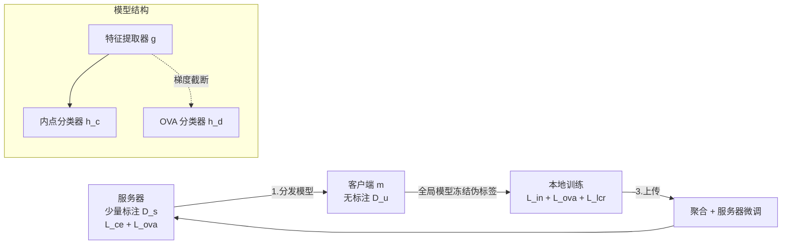

# FedOpenMatch: Towards Semi-Supervised Federated Learning in Open-Set Environments

**会议**: ICLR 2026  
**OpenReview**: [https://openreview.net/forum?id=5UrPAW3uI1](https://openreview.net/forum?id=5UrPAW3uI1)  
**代码**: 待确认  
**领域**: 半监督学习 / 联邦学习 / 开集识别  
**关键词**: open-set, semi-supervised federated learning, OVA classifier, logit adjustment, pseudo-labeling  

## 一句话总结
本文首次提出"开集半监督联邦学习"（OSSFL）问题——客户端无标注数据里混有标签空间之外的未知类样本，并给出首个框架 FedOpenMatch，用一个被"梯度截断 + logit 调整"加固的 one-vs-all 离群检测器配合 logit 一致性正则，在联邦异构数据下把开集准确率最高提升 14.33%。

## 研究背景与动机
**领域现状**：半监督联邦学习（SSFL）让服务器持有少量标注、众多客户端贡献无标注数据，靠伪标签把分布式无标注数据用起来。本文聚焦更现实的 label-at-server 设定（标注只在服务器，客户端纯无标注），因为它不要求客户端有标注能力。

**现有痛点**：所有 SSFL 方法都默认无标注数据和标注数据共享同一标签空间。但客户端各自独立私下采集数据，无标注集里几乎必然混入未见类样本（outliers）。标准 SSFL 没有离群检测能力，会给离群样本打上错误伪标签——这既污染训练，又会在推理时把未知类误判成已知类，在自动驾驶等关键场景里酿成事故。

**核心矛盾**：中心化的开集半监督学习（OSSL）已经能处理"无标注集含未知类"，但直接搬到联邦场景会严重退化。原因有三：① 标注与无标注数据被严格物理隔离，客户端拿不到可靠监督；② 客户端本地训练极易被噪声伪标签带偏；③ 客户端间数据异构（label/feature shift）进一步放大上述问题。

**本文目标**：正式定义 OSSFL 问题（= OSSL in FL），并设计能在联邦异构条件下稳定检测离群、同时充分利用无标注内点的框架。

**核心 idea**：**用 OVA 离群检测器生成高质量内点伪标签，但针对"联邦 + 开集"特有的失败模式逐一加固**——梯度截断解决双分支特征干扰、logit 调整对抗内点被当离群丢弃的失衡、logit 一致性正则榨取剩余无标注样本，并用全局模型一次性冻结伪标签防止本地训练自我恶化。

## 方法详解

### 整体框架
FedOpenMatch 是一个多任务框架：共享特征提取器 $g$ 之上挂两个头——$K$ 维内点分类器 $h_c$ 和由 $K$ 个二分类器组成的 OVA 分类器 $h_d$（每个判别"是否属于第 $k$ 类"，输出 $2K$ 维 logit，$q^k_0/q^k_1$ 分别给出对第 $k$ 类是离群/内点的打分）。每个通信轮分四步交替更新：服务器先用标注数据训练 → 把模型分发给随机选中的客户端 → 客户端在无标注数据上本地训练 → 上传聚合得到新全局模型。关键稳定性技巧是：每轮开始用**全局模型**给本地无标注样本生成伪标签并在整轮内冻结，避免本地少监督导致的伪标签漂移。

### 关键设计

**1. 梯度截断（Gradient Stop）：让 OVA 借用而不破坏内点特征空间**。OVA 分类器和内点分类器共享特征提取器但优化目标相反——内点分类器把同类拉近、异类推远，OVA 则要把每个目标类与其余所有类分开，两者在共享特征空间里不可避免地互相干扰（实测两分支的特征梯度相似度很低）。以往 OSSL 方法靠加投影层把特征映射到任务专属空间，但更新方向的分歧依旧存在。本文直接**切断 OVA 分支回流到特征提取器的梯度**：直觉是内点分类器已经把特征塑造得类内紧凑、类间可分，OVA 完全可以在这个现成的良好空间上做内外点区分，无需再去改动特征。消融显示开集准确率因此最高提升 10.68%，且训练更稳定。

**2. Logit 调整（Logit Adjustment）：救回被多数离群淹没的真内点**。OVA 训练有天然失衡——对第 $k$ 类而言，其余 $K-1$ 类全部充当离群负样本，$K$ 越大失衡越严重，二分类器被推向"一律预测离群"，导致大量真内点被错误拒绝、无标注数据利用率极低。本文借鉴 Menon 等人的思路对 OVA logit 做先验校正：$q^k = q^k + \omega \log \pi$，其中 $\pi = \{\frac{K-1}{K}, \frac{1}{K}\}$ 是离群/内点的类先验，$\omega$ 是可调缩放因子。这相当于放大内点预测的贡献、抵消离群更新的主导，让更多内点能被识别并参与训练，从而把利用率提上来。

**3. 弱-强 logit 一致性正则（LCR）：在 logit 层而非概率层对齐决策边界**。即便有了 logit 调整，仍有大批低置信内点和离群样本没被利用。前人 OpenMatch 提出软开集一致性正则 SOCR，对同一样本的弱/强增广视图在 **softmax 概率**上做 MSE 对齐。本文发现去掉 softmax、**直接在原始 logit 上做一致性**效果显著更好：$L^{lcr}_m = \lambda \frac{1}{N_m}\sum_i \big[\mathrm{mse}(q_i, \hat q_i) + \mathrm{mse}(p_i, \hat p_i)\big]$。作者推测 logit 级正则提供更强、更直接的训练信号——它约束的是原始打分进而约束决策边界，而 softmax 后的概率一致只对齐分布、不保证决策边界一致。消融表明 LCR 单独就带来约 5 个点的开集准确率提升。

整体损失上，服务器最小化 $L_s = \frac{1}{N_s}\sum_i \ell_{ce}(p_i,y_i)+\ell_{ova}(q_i,y_i)$（OVA 采用硬负子分类器采样）；客户端最小化 $L_m = L^{in}_m + L^{ova}_m + L^{lcr}_m$，其中 $L^{in}_m$ 只对"内点置信度 $\geq\tau_{in}$ 且 OVA 判为内点"的样本算交叉熵，$L^{ova}_m$ 对正/负阈值满足的 OVA 伪标签算二元交叉熵。

## 实验关键数据

### 主实验（CIFAR-100，开集准确率 Balanced Accuracy，节选）

| 方法 | 80/20@10 | 80/20@25 | 50/50@10 | 50/50@25 |
|------|----------|----------|----------|----------|
| OpenMatch (NeurIPS'21→Fed) | 2.11 | 1.74 | 1.97 | 1.99 |
| SSB (ICCV'23→Fed) | 4.06 | 6.40 | 16.95 | 28.62 |
| IOMatch (ICCV'23→Fed) | 28.66 | 37.72 | 42.86 | 49.45 |
| BDMatch (ICML'24→Fed) | 23.19 | 29.38 | 39.15 | 31.14 |
| **FedOpenMatch** | **38.97** | **50.40** | **46.29** | **59.01** |

（Dir(0.3) 设定）FedOpenMatch 全面领先；在 CIFAR100@80@25@Dir(0.1) 上闭集/开集准确率分别最高提升 7.11% / 14.33%。CIFAR-10、SVHN 上同样领先，尤其在高异构 Dir(0.1) 下优势明显。

### 消融实验（CIFAR100@80@25@Dir(0.1)）

| 配置 | Base | +GS | +GS+LA | +GS+LA+LCR |
|------|------|-----|--------|------------|
| 开集准确率 | 34.81 | 39.51 | 43.65 | **48.36** |
| 闭集准确率 | 45.86 | 46.14 | 45.81 | **50.38** |

三个组件逐级叠加、各自都带来稳定增益，LCR 贡献最大（+4.71 开集）。

### 关键发现
- 直接把 OSSL 算法搬进联邦会严重不稳：OpenMatch/SSB 常跌破"仅用标注"的下界。OpenMatch 因 OVA 失衡把多数样本判为离群、利用率持续低迷；SSB 虽利用率高但伪标签准确率低。
- FedOpenMatch 靠"全局模型冻结伪标签 + 三组件"让数据利用率稳步上升的同时保持较高伪标签准确率。
- 在同时含 feature shift 与 label shift 的 CIFAR100-C、以及未知类占比极高（20 已知 / 80 未知）的极端场景下仍稳居最优，鲁棒性强。

## 亮点与洞察
- **问题定义本身是贡献**：首次正式提出 OSSFL，并用 Tab.1 从"分布式 / 标签稀缺 / 开集训练 / 开集测试"四维度厘清它与 SSFL、OSSL、FOSR 的边界，还顺手把多个 OSSL 方法适配成联邦 baseline，建起评测基线。
- **诊断驱动设计**：每个组件都对应一个被可视化验证的失败模式（梯度相似度低→GS、利用率低→LA、剩余样本未用→LCR），不是堆 trick。
- **简单且可迁移**：logit 级一致性、logit 调整这类改动几乎零额外成本，对其他开集/失衡场景有借鉴价值。

## 局限与展望
- 实验集中在 CIFAR-10/100、SVHN 等标准图像基准，缺医疗、自动驾驶等真实联邦数据验证，而这些恰是动机里强调的高风险场景。
- logit 调整依赖"标注集类别均衡"假设来设定先验 $\pi$，真实长尾联邦下该假设可能失效。
- 伪标签每轮用全局模型一次性冻结提升了稳定性，但也可能让本地训练错过轮内的快速收敛信息，固定 vs 动态更新的权衡未深入探讨。
- 通信/计算开销、隐私安全性（OVA 头是否泄露分布信息）未作分析。

## 相关工作与启发
- **半监督学习**：FixMatch 系（FlexMatch/FreeMatch/SoftMatch）奠定一致性正则 + 伪标签范式，但都假设同标签空间。
- **开集 SSL**：从 detect-and-filter 到 OVA 检测器（OpenMatch/SSB/BDMatch），IOMatch 把开集重构成 $(K+1)$ 分类。本文继承 OVA 路线但针对联邦重新加固。
- **半监督联邦学习**：分 label-at-client 与 label-at-server，本文属后者；SemiFL 用全局模型生成伪标签的思路被本文继承并强化为"冻结伪标签"。
- **启发**：把"中心化方法→分布式"绝不是简单平移，必须先诊断分布式独有的失败模式（监督隔离、伪标签自恶化、异构失衡）再对症下药；以及"在 logit 层而非概率层做正则"是个值得在更多一致性方法上复用的小而有效的观察。

## 评分
- **新颖性**: ⭐⭐⭐⭐ 首次正式提出并系统求解 OSSFL，问题定义 + 框架 + 基线一并补齐，OVA 路线虽继承自 OSSL 但联邦加固是真实新贡献。
- **实验充分度**: ⭐⭐⭐⭐ 三数据集 × 多异构 × 多标注预算 × 复杂 corruption / 极端未知占比，消融完整；扣分在缺真实联邦域数据。
- **写作质量**: ⭐⭐⭐⭐ 动机—诊断—设计逻辑清晰，每个组件都有可视化证据支撑，公式与符号规范。
- **价值**: ⭐⭐⭐⭐ 填补 SSFL 在开集场景的空白，对自动驾驶/医疗等存在未知类的联邦应用有直接意义，组件可迁移性强。

<!-- RELATED:START -->

## 相关论文

- [\[CVPR 2026\] PAF: Perturbation-Aware Filtering for Open-Set Semi-Supervised Learning](../../CVPR2026/self_supervised/paf_perturbation-aware_filtering_for_open-set_semi-supervised_learning.md)
- [\[ICLR 2026\] CoLA: Co-Calibrated Logit Adjustment for Long-Tailed Semi-Supervised Learning](cola_co-calibrated_logit_adjustment_for_long-tailed_semi-supervised_learning.md)
- [\[AAAI 2026\] Let the Void Be Void: Robust Open-Set Semi-Supervised Learning via Selective Non-Alignment](../../AAAI2026/self_supervised/let_the_void_be_void_robust_open-set_semi-supervised_learning_via_selective_non-.md)
- [\[CVPR 2026\] SECOS: Semantic Capture for Rigorous Classification in Open-World Semi-Supervised Learning](../../CVPR2026/self_supervised/secos_semantic_capture_for_rigorous_classification_in_open-world_semi-supervised.md)
- [\[ICLR 2026\] Boosting Open Set Recognition Performance through Modulated Representation Learning](boosting_open_set_recognition_performance_through_modulated_representation_learn.md)

<!-- RELATED:END -->
