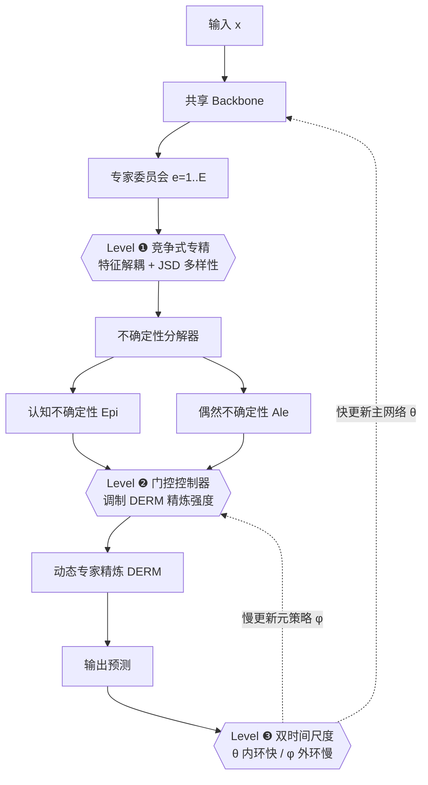

# GUIDE: Gated Uncertainty-Informed Disentangled Experts for Long-tailed Recognition

**会议**: ICLR 2026  
**OpenReview**: [https://openreview.net/forum?id=jY21fwcrjr](https://openreview.net/forum?id=jY21fwcrjr)  
**代码**: 待确认  
**领域**: 长尾识别 / 多专家表示学习  
**关键词**: 长尾识别, 多专家模型, 不确定性分解, 元学习, 表示解耦  

## 一句话总结
GUIDE 把多专家长尾识别中盘根错节的"表示—决策—优化"三层纠缠问题逐层拆开：用竞争式专精迫使专家学到互异特征、用认知/偶然不确定性分解来诊断难样本并定向精炼、用双时间尺度更新隔离主任务与元策略的优化，从而在五个长尾基准上刷新 SOTA。

## 研究背景与动机
**领域现状**：多专家架构（RIDE、SADE、BalPoE 等）是当前长尾识别（Long-Tailed Recognition, LTR）的主流范式——让一个"专家委员会"分别覆盖头部到尾部的不同类别区间，比单模型更稳健。但作者观察到这条路线已逼近性能天花板，提点越来越难。

**现有痛点**：作者把瓶颈归结为一条**纠缠依赖链**，三个层级层层传导：
- **表示—决策纠缠**：现有方法只在决策层（如不同的 logit 调整）间接制造多样性，却没有把表示学习从头部类梯度的支配中解耦。头部类的强梯度把所有专家拉向同一个"头部中心"的特征空间，造成**同质化坍缩（homogeneity collapse）**，专精名存实亡。
- **因—症纠缠**：专家一旦功能趋同，就无法对难样本给出多元诊断。现有自适应方法只能依赖"高训练损失"这种模糊信号去加码学习，把"症状"当成了"病因"——它分不清难样本是因为**模型无知（认知不确定性 epistemic）**还是**数据本身歧义（偶然不确定性 aleatoric）**，导致学习资源长期错配。
- **学习—元学习纠缠**：元策略（慢、需谨慎更新）和主识别任务（快、高方差）的优化天然冲突。主任务的高方差梯度会淹没元策略的微小更新，使系统无法收敛到稳定的自组织策略。

**核心矛盾**：这三层纠缠不是孤立的，而是**有先后依赖**的——表示坍缩直接削弱诊断能力，诊断失灵又加剧优化动荡。任何单点修补都会被上游的纠缠抵消。

**本文目标**：提出一个能"按依赖顺序"系统性拆解这三层纠缠的统一框架，把多专家范式被压抑的潜力释放出来。

**核心 idea**：**分层解耦（Hierarchical Disentanglement）**——先在表示层用竞争式专精打好"专家真多样"的地基，再在策略层用不确定性分解做精准诊断与干预，最后在优化层用双时间尺度更新保护元策略收敛，三层环环相扣、缺一不可。

## 方法详解

### 整体框架
GUIDE（Gated Uncertainty-Informed Disentangled Experts）把学习过程拆成三个有依赖关系的层级，按顺序施加干预：Level ❶ 强制特征与决策分离、消除同质化坍缩；Level ❷ 在 ❶ 提供的"高保真专家分歧"上做认知/偶然不确定性分解，驱动门控控制器调制动态专家精炼模块（DERM）；Level ❸ 把参数切成"快变量 θ（主网络）"与"慢变量 φ（元策略）"，用差异学习率隔离两套优化回路。三层互为前提：没有 ❶ 的多样性，❷ 的诊断信号就是噪声；没有 ❷ 的稳定策略，❸ 的元学习就无从收敛。

### 关键设计

**1. 竞争式专精：把多样性变成显式优化目标，而非副产品。** Level ❶ 的核心洞察是"真多样性必须被主动逼出来"。作者由定理 1（多样性驱动的界收紧）出发——集成的负对数似然被各专家平均 NLL 上界约束，而这个性能差距正比于专家间的预测多样性，可用 Jensen-Shannon 散度（JSD）来度量和优化。据此在标准 logit 调整交叉熵主损失 $L_{main}$ 之上叠加两个互补的竞争正则：一是**表示解耦**，最小化不同专家特征向量的余弦相似度 $L_{decouple}=\frac{2}{E(E-1)}\sum_{i<j}\frac{f_i(x)^\top f_j(x)}{\|f_i(x)\|\|f_j(x)\|+\varepsilon}$；二是**预测多样性**，显式最大化各专家温度缩放分布的 JSD。三者合成 $L^{(1)}_{total}=L_{main}+\lambda_{dec}L_{decouple}-\lambda_{div}\,\mathrm{JSD}(\{p_{e,T}\})$。协作与竞争被同时编排，专家被推进互异的功能生态位，专家分歧从此从"噪声"变成 Level ❷ 可用的高保真诊断信号。

**2. 不确定性诊断 + 动态专家精炼（DERM）：先查病因，再定向下药。** 有了真多样的专家，Level ❷ 才能可靠地分解预测不确定性：偶然不确定性取各专家熵的均值 $Ale_T(x)=\frac{1}{E}\sum_e H(p_{e,T}(\cdot|x))$，认知不确定性取平均分布的熵减去偶然项 $Epi_T(x)=H(\bar p_T(\cdot|x))-Ale_T(x)$。DERM 由共享基础通路 $F_{found}$ 和专家专属精炼通路 $F_{refine,e}$ 组成，以自适应残差混合方式融合：$f_e(x;c)=F_{found}(x)+g_{e,c}\cdot(F_{refine,e}(F_{found}(x))-F_{found}(x))$。精炼强度门 $g_{e,c}$ 由类级不确定性的指数滑动平均决定：$\tilde g_{e,c}=\alpha_e\bar{Epi}_{T,c}-\beta_e\bar{Ale}_{T,c}+\gamma_e$，再经 sigmoid 缩放到 $[g_{min},g_{max}]$。定理 2（策略单调性）保证精炼强度对认知不确定性单调递增、对偶然不确定性单调递减——也就是"模型越无知越加码学习，数据越歧义越保持稳健"，从而把混乱的误差驱动反应换成有原则的容量分配。

**3. 双时间尺度更新：给元策略开一条受保护的优化通道。** Level ❸ 把可学习参数按功能切成两组：**快变量 θ**（backbone 与 DERM 通路 $F_{found},F_{refine,e}$）每步以学习率 $\eta_\theta$ 更新内环 $\theta_{k+1}=\theta_k-\eta_\theta\nabla_\theta L_{GUIDE}$；**慢变量 φ**（门控参数 $\{\alpha_e,\beta_e,\gamma_e\}$，即元策略）每个 epoch 才以更小学习率 $\eta_\phi$ 在验证集上更新外环 $\phi_{t+1}=\phi_t-\eta_\phi\nabla_\phi\mathbb{E}_{V}[L_{main}]$。命题 1 指出只要 $\eta_\phi\ll\eta_\theta$，该过程就满足双时间尺度随机逼近（TTSA）条件，从而隔离主任务的高方差梯度对元策略的干扰，让策略安全收敛。三层按顺序求解后，整个框架被引导向一个稳健的自组织平衡。

## 实验关键数据

### 主实验（Top-1 准确率 %，标准训练 schedule）

| 方法 | CIFAR-100-LT IR=10 | IR=50 | IR=100 | ImageNet-LT | iNat 2018 | Places-LT |
|---|---|---|---|---|---|---|
| RIDE (3 experts) | 61.8 | 51.7 | 48.0 | 56.3 | 71.8 | 40.3 |
| SADE | 63.6 | 53.8 | 48.8 | 58.8 | 72.7 | 40.9 |
| BalPoE | 64.8 | 56.3 | 52.0 | 59.3 | 75.0 | 40.8 |
| PRL | 65.6 | 57.3 | 52.8 | 60.8 | 75.1 | 41.6 |
| LOS (2025) | **69.7** | 58.8 | 54.9 | 54.4 | 70.8 | - |
| **GUIDE** | 69.2 | **60.3** | **56.4** | **62.5** | **76.1** | 42.2 |

更长训练 schedule 下 GUIDE 进一步提到 CIFAR-100-LT IR=100 的 57.7、ImageNet-LT 63.4、iNat 77.8、Places-LT 43.1，几乎全面 SOTA。

### Few-shot 细分（CIFAR-100-LT IR=100，ResNet-32）

| 方法 | Many | Medium | Few | Overall |
|---|---|---|---|---|
| BalPoE | 65.3 | 51.1 | 28.0 | 52.0 |
| PRL | 68.7 | 55.3 | 31.2 | 52.8 |
| **GUIDE** | **71.3** | **59.1** | **36.0** | **56.4** |

增益主要来自中样本与尾部样本区间（Few 段 +4.8% 以上），正中长尾识别的核心难点。

### 消融实验

| ❶ | ❷ | ❸ | Overall |
|---|---|---|---|
| - | - | - | 45.8（Entangled Baseline）|
| ✓ | | | 50.4 (+4.6) |
| | ✓ | | 51.3 (+5.5) |
| | | ✓ | 49.9 |
| ✓ | ✓ | | 52.8 |
| **✓** | **✓** | **✓** | **56.4** |

机制级分析：Level ❶ 两个多样性损失单独各约 +1.7~1.9%，合用跃升到 50.4（协同效应明显）；Level ❷ 门控策略对比中，"GUIDE 策略（分解不确定性）"56.4 显著优于"总不确定性 agnostic"54.9、"逆频率静态"53.6 与"不自适应"52.1。

### 关键发现
- **三层缺一不可且有协同**：单独看 Level ❷ 增益最大，但三层叠加（56.4）远超任意两两组合，验证了"分层依赖"假设。
- **OOD 鲁棒性**：在反转训练频率的 Backward-LT 分布上，GUIDE 在最难场景大幅领先所有先前方法，说明分层解耦学到的尾部理解更本质、不依赖训练先验。
- **推理可调**：默认两步推理比单次前向在 CIFAR-100-LT 上 few-shot +2.1%、ImageNet-LT +2.4%，代价是延迟约翻倍，可按场景权衡。

## 亮点与洞察
- **问题诊断的"依赖链"视角很漂亮**：把长尾多专家的诸多已知痛点（专家同质化、难样本误判、元学习不稳）统一归因为一条有先后顺序的纠缠链，并据此设计"按序拆解"的解法，逻辑闭环且有解释力。
- **认知/偶然不确定性首次用于结构化自适应策略**：以往不确定性多用于辅助任务，这里第一次把分解后的两类不确定性直接驱动专家精炼的门控，"模型无知就加码、数据歧义就保守"的单调性还有定理背书。
- **每个机制都配了理论动机**：定理 1（JSD 收紧集成界）、定理 2（门控单调性）、命题 1（TTSA 条件），虽非全新定理，但把成熟理论"组合"到长尾问题上自洽。

## 局限与展望
- **复杂度与超参偏多**：三层各带正则权重（$\lambda_{dec},\lambda_{div}$）、门控范围（$g_{min},g_{max}$）、双学习率（$\eta_\theta,\eta_\phi$）等，调参成本与可复现性是隐忧，作者主要靠经验消融验证而非理论给定。
- **推理开销**：默认两步推理延迟约翻倍，对实时部署不友好，single-pass 又掉点。
- **仅验证图像分类长尾基准**：是否能迁移到长尾检测/分割、或非视觉模态（文本、表格）尚未验证。
- **理论是"动机"而非"保证"**：定理 1 给的是不等式上界、命题 1 给的是条件满足，并未证明全局收敛或最优，分层解耦的"必要顺序"主要由实验支撑。

## 相关工作与启发
- **多专家长尾**（RIDE / SADE / BalPoE / MDCS）：都在决策层间接造多样性，GUIDE 直接在特征+决策双层施加竞争式专精，并指出它们留下的"表示—决策纠缠"是后续失败之源；MDCS 用一致性自蒸馏促多样性，与本文互补但只覆盖单层。
- **不确定性引导自适应**（Kendall & Gal 等贝叶斯深度学习）：GUIDE 首次把认知/偶然分解用于差异化的结构性自适应策略，而非辅助预测。
- **LTR 元学习**（Meta-Weight-Net / L2RW 等）：普遍受"快主任务 vs 慢元策略"干扰之苦，GUIDE 借 TTSA（Borkar 1997）的差异学习率隔离两回路，给"如何稳定训练带元策略的长尾模型"提供了一个干净的工程范式。
- **启发**：这种"先诊断纠缠依赖链、再按依赖顺序逐层拆解"的方法论，可能迁移到其他存在多目标耦合的训练问题（如多任务、持续学习中的稳定性—可塑性权衡）。

## 评分
- **新颖性**: ⭐⭐⭐⭐ —— "分层解耦依赖链"的问题刻画 + 认知/偶然不确定性驱动结构化门控的组合是新的，虽然各组件多来自已有理论的再组合。
- **实验充分度**: ⭐⭐⭐⭐ —— 五个长尾基准 + 标准/长训练双 schedule + Many/Medium/Few 细分 + Backward-LT OOD + 逐层与机制级消融 + 推理权衡分析，覆盖相当全面。
- **写作质量**: ⭐⭐⭐⭐ —— 三层叙事清晰、动机—机制—定理一一对应，但术语密度高、超参众多，初读略重。
- **价值**: ⭐⭐⭐⭐ —— 在饱和的多专家长尾路线上重新提点并刷新 SOTA，且 OOD 鲁棒性与"按依赖拆解"的方法论对后续工作有借鉴意义。

<!-- RELATED:START -->

## 相关论文

- [\[CVPR 2026\] Trust-calibrated Collaborative Learning for Long-Tailed Visual Recognition](../../CVPR2026/self_supervised/trust-calibrated_collaborative_learning_for_long-tailed_visual_recognition.md)
- [\[AAAI 2026\] BCE3S: Binary Cross-Entropy Based Tripartite Synergistic Learning for Long-tailed Recognition](../../AAAI2026/self_supervised/bce3s_binary_cross-entropy_based_tripartite_synergistic_learning_for_long-tailed.md)
- [\[NeurIPS 2025\] Long-Tailed Recognition via Information-Preservable Two-Stage Learning](../../NeurIPS2025/self_supervised/long-tailed_recognition_via_information-preservable_two-stage_learning.md)
- [\[ICLR 2026\] Mini-cluster Guided Long-tailed Deep Clustering](mini-cluster_guided_long-tailed_deep_clustering.md)
- [\[ICLR 2026\] Learning Dynamics of Logits Debiasing for Long-Tailed Semi-Supervised Learning](learning_dynamics_of_logits_debiasing_for_long-tailed_semi-supervised_learning.md)

<!-- RELATED:END -->
