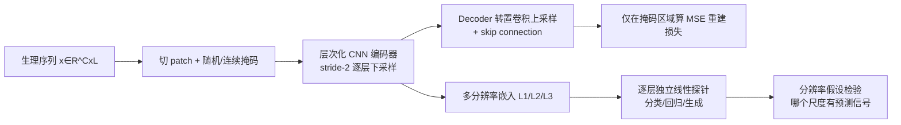

# HiMAE: Hierarchical Masked Autoencoders Discover Resolution-Specific Structure in Wearable Time Series

**会议**: ICLR 2026  
**OpenReview**: [https://openreview.net/forum?id=iPAy5VpGQa](https://openreview.net/forum?id=iPAy5VpGQa)  
**代码**: 待确认  
**领域**: 自监督表示学习 / 可穿戴生理时序  
**关键词**: 掩码自编码, 层次化卷积, U-Net, 多分辨率表示, PPG, 边缘推理  

## 一句话总结
HiMAE 把掩码自编码塞进一个 U-Net 式层次化 1D CNN，让中间各层天然对应不同时间分辨率的嵌入，从而把"分辨率"从一个超参变成可探针的诊断工具，同时模型小到能在智能手表 CPU 上做亚毫秒推理。

## 研究背景与动机
- **领域现状**：可穿戴传感器（PPG/ECG/加速度计）产生海量无标注生理时序，自监督学习（尤其掩码自编码，如 Google 的 LSM 系列）已成为该领域表示学习的主流范式。
- **现有痛点**：主流做法默认上 Transformer，隐含假设"容量和全局注意力胜过归纳偏置"。但生理信号虽然序列长，本质上是少数生物机制驱动的低维高度结构化信号——全局注意力可能不仅过拟合，反而**抹平了不同时间尺度上的结构**；而且 Transformer 参数动辄上亿，根本下不了表。
- **核心矛盾**：到底该用单一"通用分辨率"建模，还是不同临床/行为任务依赖**不同尺度**的特征？现有 flat 掩码方法把所有尺度坍缩成一个潜空间，无法回答这个问题，可解释性也几乎为零。
- **本文目标**：验证"分辨率假设"（resolution hypothesis）——时间粒度是生理表示学习的一个**根本性维度**，而非噪声超参；同时给出一个轻到能跑在边缘设备上的自监督框架。
- **核心 idea**：**把掩码自编码与层次化卷积编解码器耦合**，让每一层 hierarchy 对应一种时间粒度，再用独立线性探针逐层测量预测信号集中在哪个尺度——**把表示学习从"预训练机制"升级成"发现工具"**。

## 方法详解

### 整体框架
HiMAE 给定输入序列 $x \in \mathbb{R}^{C\times L}$，切成 $N=L/P$ 个非重叠 patch，按掩码比 $r$ 随机或连续地遮挡，喂进一个 U-Net 式 1D CNN 编解码器重建被遮区域；编码器每层 stride-2 卷积把时间分辨率减半、感受野翻倍，于是**浅层保留局部细节、深层捕获长程依赖**，中间各层的激活就自然成了一组多分辨率嵌入。预训练后冻结编码器，对每一层嵌入分别训练一个线性探针，看哪个分辨率对下游任务最有信号。

### 关键设计

**1. 层次化掩码自编码主干：用卷积金字塔把"尺度"显式化。** 编码器 $f_\theta$ 由残差卷积块堆成，每块两层 kernel=5 的卷积 + BatchNorm + GELU，stride-2 完成下采样；解码器 $g_\phi$ 镜像之，用转置卷积上采样并通过 skip connection 把编码器对应层的精细特征拼回来，最后一层用 tanh 把输出限制在 $[-1,1]$ 匹配归一化输入。训练只在被遮区域算损失 $L_{\text{MSE}}(\theta,\phi)=\frac{\|(\hat{x}-x)\odot m'\|_2^2}{\sum_t m'_t}$，估计的是 $p(x_M|x_O)$，避免模型直接 copy 可见输入。之所以坚持用卷积 U-Net 而非 Transformer，是因为生理信号有强局部依赖（PPG 波形、ECG 峰）和天然的嵌套时间尺度（心跳在毫秒、节律在秒级），有限感受野 + skip 的层次化 CNN 正好把这种归纳偏置写进架构，比 Transformer 用受限注意力去模拟要小好几个数量级。

**2. 感受野扩张近似全局上下文：O(L) 复杂度逼近注意力。** 与 Transformer 用 $O(L^2)$ 自注意力拿全局依赖不同，HiMAE 靠层次化空间收缩在 $O(L)$ 复杂度下逼近同样效果。第 $d$ 层的有效感受野按 $R_d = R_{d-1} + (k-1)\cdot\prod_{i=1}^{d-1}s_i$ 指数增长（$k$ 为 kernel size、$s$ 为 stride），到瓶颈层时感受野已覆盖序列 $L$ 的大部分——深层聚合粗粒度长程上下文，skip 把高分辨率局部特征注回解码器。这套"局部到全局"的归纳偏置以远低于 ViT 的 FLOPs 拿到了有竞争力的表示能力，这也是它能在手表级 CPU 上亚毫秒推理的根本原因（HiMAE-Small 仅 307k 参数、Base 1.2M，对比 LSM-Base 110M）。

**3. 分辨率探针：把分辨率从超参变成可解释的诊断维度。** 这是论文的灵魂设计。HiMAE 不把嵌入坍缩成单一 token，而是沿时间维暴露**整条多分辨率嵌入序列**，对每个尺度训练一个独立线性分类器（Alain & Bengio 的探针思路）。这样就能系统检验"预测信号到底集中在 fine / intermediate / coarse 哪个分辨率"，且这个答案随临床任务而变。于是分类基准不只是迁移学习的 benchmark，更是对分辨率假设的**受控实验**——揭示出连人类专家都难以辨认的、信号中的分辨率特异结构。patch 长度 $P=5$、kernel size 5 是消融选出的局部保真与感受野扩张的最佳平衡。

## 实验关键数据

**预训练规模**：约 80,000 小时 Samsung 绿光 PPG，覆盖 47,644 名参与者、7 种可穿戴设备、7 项 free-living 研究；100Hz 采样、10s 窗口（L=1000）、patch=5、掩码比 r=0.8；4 张 T4 GPU 训 12 小时收敛。

### 主实验表格

生成基准（MSE，越低越好，节选 80% 缺失率）：

| 方法 | 随机插补 | 时间内插 | 时间外推 |
|---|---|---|---|
| Linear Int. | 0.153 | 0.403 | 0.526 |
| MAE-1D (ViT) | 0.041 | 0.299 | 0.356 |
| CNN | 0.040 | 0.278 | 0.343 |
| **HiMAE** | **0.026** | **0.201** | **0.211** |

在最难的时间外推上，HiMAE 的 R² 在 30%/50%/80% 缺失下分别为 0.138/0.102/0.062，是少数能保持正 R² 的方法（其余基线全部为负）。

线性探针分类 AUROC（%，对比 SSL 基线，节选）：

| 模型 | 参数(M) | Hyptn(lab) | PVC | Platelets | Light |
|---|---|---|---|---|---|
| MSN | 2.5 | 55.2 | 56.4 | 45.9 | 57.8 |
| MAE (ViT) | 110.6 | 43.2 | 72.2 | 56.1 | 63.8 |
| **HiMAE** | **1.2** | **65.1**∗∗ | **80.2**∗ | **68.5**∗∗ | **66.8** |

对比 SOTA 可穿戴/时序基础模型（PaPaGei-SRA、Swin-Transformer 110M 等）HiMAE 用 1.2M 参数在多数任务上仍取得最优或次优。

### 消融实验表格

| 移除组件 | 效果 |
|---|---|
| 去掉 skip connection | 生成误差上升，scaling 变差 |
| 去掉层次化设计 | 重建误差上升 |
| 二者皆去（退化版） | 仍与更大的 Transformer 相当 |

### 关键发现
- **scaling 上参数维度最反直觉**：HiMAE 在小参数量就达到很低损失，Transformer 要放大几个数量级才追上——印证低容量区归纳偏置的重要性。
- 不同任务的预测信号确实集中在**不同分辨率层**，分辨率假设得到验证。
- 即便退化掉层次/skip，HiMAE 仍能打平百倍参数的 Transformer。

## 亮点与洞察
- **把"分辨率"做成可探针的诊断工具**是真正的概念创新：别人当超参，它当成可解释性的探针，能发现专家看不出的尺度结构。
- 用 U-Net 感受野扩张以 $O(L)$ 逼近全局注意力，给"小模型也能强"提供了清晰的理论支撑。
- 307k–1.2M 参数 + 手表 CPU 亚毫秒推理，真正打通了边缘可穿戴的落地路径，工程价值极高。
- 80,000 小时、47,644 人的工业级 PPG 语料，结论的可信度远超学术小数据集。

## 局限与展望
- 主战场聚焦 PPG，ECG 等其它模态只在附录验证（因 ECG 非被动采集、数据量级不够），跨模态泛化未充分展开。
- 卷积感受野由 stride/padding/kernel 等设计决定，"哪个尺度显著"虽不被强制但仍受这些超参约束，分辨率发现并非完全数据驱动。
- 全部下游为线性探针 + 二分类/重建，缺少端到端微调和更复杂任务（多分类、回归、序列预测）的系统评估。
- 分辨率假设的临床可解释性还停留在"信号集中在某层"，距离给医生可读的生理学解释仍有距离。

## 相关工作与启发
- **掩码自编码谱系**：从视觉 MAE、语言 BERT 到可穿戴的 LSM 系列，HiMAE 的差异在于用层次化架构显式整合多尺度，而非 flat 单尺度。
- **对比学习路线**（SimCLR、Apple ECG/PPG FM、PaPaGei、SleepFM）：依赖正负样本和增广启发式，对增广敏感且可解释性差；HiMAE 走掩码路线规避了增广难题。
- **多尺度时序建模**（N-HiTS、Pyraformer、Scaleformer、Pathformer）：多用固定层次或任务特定 refinement；HiMAE 让尺度通过自监督重建"涌现"成可独立探针的嵌入层次。
- 启发：在结构化、低维但长序列的领域，**对的归纳偏置 > 盲目堆 Transformer 容量**，且架构本身可以成为科学发现的工具。

## 评分
- **新颖性**: ⭐⭐⭐⭐ — "把分辨率变成探针"的视角新颖，方法本身（MAE+U-Net）组件不算首创，但组合与诠释角度很有想法。
- **实验充分度**: ⭐⭐⭐⭐ — 工业级语料 + 12 个分类 + 3 类生成基准 + 多轴 scaling + 消融，相当扎实；微调与跨模态略缺。
- **写作质量**: ⭐⭐⭐⭐ — 论证清晰、动机递进自然，图表组织良好，分辨率假设贯穿全文。
- **价值**: ⭐⭐⭐⭐ — 边缘可穿戴落地价值突出（亚毫秒推理 + 小模型），对"何时该用卷积归纳偏置"提供了有说服力的证据。

<!-- RELATED:START -->

## 相关论文

- [\[ICLR 2026\] Test-Time Efficient Pretrained Model Portfolios for Time Series Forecasting](test-time_efficient_pretrained_model_portfolios_for_time_series_forecasting.md)
- [\[ICLR 2026\] Spatial Structure and Selective Text Jointly Facilitate Image Clustering](spatial_structure_and_selective_text_jointly_facilitate_image_clustering.md)
- [\[ICLR 2026\] Spatially Informed Autoencoders for Interpretable Visual Representation Learning](spatially_informed_autoencoders_for_interpretable_visual_representation_learning.md)
- [\[ECCV 2024\] Efficient Image Pre-Training with Siamese Cropped Masked Autoencoders](../../ECCV2024/self_supervised/efficient_image_pre-training_with_siamese_cropped_masked_autoencoders.md)
- [\[ICCV 2025\] From Linearity to Non-Linearity: How Masked Autoencoders Capture Spatial Correlations](../../ICCV2025/self_supervised/from_linearity_to_non-linearity_how_masked_autoencoders_capture_spatial_correlat.md)

<!-- RELATED:END -->
