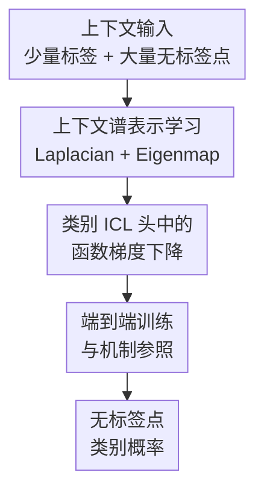

# In Context Semi-Supervised Learning

**会议**: ICLR2026  
**OpenReview**: [https://openreview.net/forum?id=lqrpmqrTnH](https://openreview.net/forum?id=lqrpmqrTnH)  
**代码**: https://github.com/Jason-fan20/ICL_Semi  
**领域**: 半监督学习 / 上下文学习 / 表示学习  
**关键词**: 半监督学习, in-context learning, Transformer, Laplacian Eigenmaps, 谱表示学习  

## 一句话总结
本文提出 in-context semi-supervised learning（IC-SSL）问题，并构造一个两阶段 Transformer：先从同一个上下文里的大量无标签样本中学习几何谱表示，再用少量标签在前向传播里执行类别 ICL，从而在低标签场景下明显提升分类准确率和跨几何泛化能力。

## 研究背景与动机
**领域现状**：Transformer 的 in-context learning（ICL）理论近几年主要围绕“给定若干带标签示例，模型在前向传播里等价地执行某种学习算法”展开。在线性回归、RKHS 非线性函数、类别输出等设置里，已有工作证明或解释了注意力层如何模拟梯度下降，用上下文中的输入-输出对来推断隐含函数。

**现有痛点**：这些分析大多默认上下文样本都是显式标注的，或者把每个无标签 query 当作独立待预测对象。真实半监督场景却常常相反：标签很少，无标签点很多，而且无标签点之间本身含有聚类、流形、局部邻域等结构。如果 ICL 只看少数标签，而不利用这些无标签点共同形成的几何结构，就会浪费半监督学习里最关键的信息。

**核心矛盾**：半监督学习的经典假设是“相近的点、同一流形上的点应该共享标签结构”，但标准 ICL 的上下文通常被组织成若干独立 demonstration。于是问题变成：Transformer 能否不经过离线预处理，直接在一次前向传播中从无标签上下文构造表示，再把少量标签沿这个表示空间传播出去？

**本文目标**：作者把这个问题形式化为 IC-SSL：给定 $n$ 个输入点，其中前 $m$ 个有标签、其余 $n-m$ 个在测试时无标签，模型需要同时利用全部输入 $x^{(1)},\ldots,x^{(n)}$ 和少量标签 $y^{(1)},\ldots,y^{(m)}$，预测其余样本的类别。这里的关键不是微调 Transformer 参数，而是在上下文内部完成一次半监督学习。

**切入角度**：论文从谱几何和图半监督学习切入。传统方法会先用所有样本构造邻接图和图 Laplacian，再计算 Laplacian Eigenmaps 作为流形表示，最后用少量标签做分类。作者观察到，RBF attention 可以自然表达局部相似度，linear attention 又适合模拟幂迭代，因此 Transformer 的层结构有机会把这套谱表示学习流程搬到前向传播里。

**核心 idea**：用 Transformer 在上下文内先计算几何感知的 Laplacian Eigenmap 表示 $\phi(X)$，再在该表示上用注意力实现类别交叉熵的函数梯度下降，让无标签上下文从“待预测对象”变成“参与构造表示的训练信号”。

## 方法详解

### 整体框架
本文的方法可以理解为一个端到端训练、但带有明确算法解释的两阶段 Transformer。第一阶段 `TFrep` 只看全部输入点，不看标签，目标是在上下文中恢复样本之间的流形结构；第二阶段 `TFsup` 把少量标签接到这些表示上，用类别 ICL 头对所有未标注点输出预测概率。两个阶段在实现上合成一个 Transformer，并用 IC-SSL 交叉熵端到端训练。

更具体地说，输入上下文是 $C=\{(x^{(1)},y^{(1)}),\ldots,(x^{(m)},y^{(m)})\}\cup\{x^{(m+1)},\ldots,x^{(n)}\}$。第一阶段根据所有 $x$ 产生上下文相关表示 $\phi^{(i)}$，所以 $\phi^{(i)}$ 不只是 $x^{(i)}$ 的单点编码，而是依赖整批样本 $X$ 的表示。第二阶段在 $\phi$ 空间中根据少量标签更新一个隐式分类函数 $f$，再通过 softmax 形式得到 $P(y^{(i)}\mid X)$。

这个框架的关键是，论文没有把 Laplacian Eigenmap 当作外部特征工程。作者先给出可构造性论证：某些 attention/MLP 配置可以近似实现图 Laplacian 构造、特征向量提取和类别梯度下降；实际训练时，则让这些模块端到端优化，允许模型偏离严格算法以获得更好的经验性能。

### 关键设计
**1. 上下文谱表示学习：让无标签点先共同决定表示空间**

标准 ICL 的 query 往往只在“被预测”时进入模型，难以影响表示本身。本文的第一步是把所有输入点都用于构图：对任意两个点定义 RBF 相似度 $A_{ij}=\exp(-\|x^{(i)}-x^{(j)}\|_2^2/(2h))$，再由度矩阵 $D$ 得到归一化 Laplacian $\hat L=I-AD^{-1}$。这个过程把半监督学习里的局部平滑假设显式写进上下文表示：即使某个点没有标签，它也会通过邻接关系改变整张图的谱结构。

作者进一步说明，RBF attention 可以直接产生类似 $AD^{-1}$ 的相似度归一化矩阵，因此一个简单的 Transformer 子模块 `TFL` 就能在前向传播中形成 Laplacian。之后的 `TFϕ` 使用 linear attention 来模拟 block power iteration，近似求出 $\hat L$ 的底部若干特征向量，形成 Laplacian Eigenmap。于是每个样本得到 $\phi^{(i)}$，而这个表示天然携带“它在当前上下文流形里处于哪里”的信息。

**2. 类别 ICL 头中的函数梯度下降：把少量标签沿谱表示传播**

有了 $\phi^{(i)}$ 后，问题变成如何用少量标签预测无标签样本。论文沿用函数梯度下降视角，假设分类函数 $f(\phi)$ 位于 RKHS 中，并用类别嵌入 $w_c$ 和 softmax 建模标签概率：$P(y^{(i)}\mid X)\propto \exp(w_{y^{(i)}}^\top f(\phi^{(i)}))$。对带标签样本的交叉熵做梯度下降，可以得到对所有样本的函数更新：

$$
f^{(i)}_{\ell+1}=f^{(i)}_{\ell}+\alpha\sum_{j=1}^{m}\left[w_{y^{(j)}}-E(w\mid f^{(j)}_{\ell})\right]\kappa(\phi^{(i)},\phi^{(j)}).
$$

这个式子的含义很直观：只有前 $m$ 个带标签样本提供监督残差 $w_y-E(w\mid f)$，但这个残差会通过核相似度 $\kappa(\phi^{(i)},\phi^{(j)})$ 传到每个无标签点。注意力层正好适合实现这种“按相似度加权汇总”的更新，而后续 MLP 负责更新 $E(w\mid f)$ 这类非线性 softmax 期望。相比直接在原始坐标上做 ICL，这一步的优势在于标签传播发生在谱表示空间里，传播路径更贴近数据流形而不是欧氏坐标偶然距离。

**3. 端到端训练与机制参照：把可解释构造变成可优化模型**

论文的构造不是把 Transformer 硬编码成固定的 Laplacian solver。作者把 `TFL`、`TFϕ`、`TFsup` 合到一个模型里，用无标签部分在训练时可见的真标签计算 IC-SSL loss，并联合优化所有参数。这样做保留了谱方法的归纳偏置，又给模型留下空间去学习比手写 Laplacian 更适合任务的数据相关表示。

这个设计还有一个重要作用：它提供了理解普通 Transformer 的参照系。实验里作者把结构化模型、标准 Transformer baseline、离线 Eigenmap 表示放在一起比较，不只看准确率，也看 separation score、mutual kNN、Cycle、LCS 等表示对齐指标。结果显示，普通 Transformer 在训练数据足够多时会逐渐学到与谱表示相似的邻域结构，而结构化模型在低数据 regime 下更早获得这种结构。

### 一个完整示例
假设一个上下文任务里有 $n=100$ 个点，其中只有 $m=3$ 个点带二分类标签，其余 97 个点在测试时无标签。传统 ICL 头如果直接看原始坐标，就只能用这 3 个标签在原空间里做一次很弱的局部泛化；如果原始坐标经过旋转、缩放或来自复杂流形，这种泛化很容易失效。

在本文框架下，模型先忽略标签，把 100 个点全部放进 `TFrep`。RBF attention 根据点间距离形成局部邻接关系，`TFϕ` 再把这张图压成 4 维左右的低频谱坐标。此时两个在欧氏坐标里看起来不近、但沿流形 geodesic 相邻的点，可能在 $\phi$ 空间里更接近；而两个空间上偶然接近但属于不同流形分支的点，则可能被谱结构拉开。

接着，3 个标签进入 `TFsup`。如果某个无标签点 $x^{(i)}$ 在 $\phi$ 空间里接近一个正类标注点，且远离负类标注点，那么它从更新式里获得的正类残差权重大；如果它位于两个类的边界附近，来自不同标签点的更新会相互竞争。多层 ICL 更新后，模型为每个无标签点输出类别概率。这相当于把“先识别上下文几何，再沿几何传播标签”的经典半监督流程压缩到 Transformer 的一次前向传播中。

### 损失函数 / 训练策略
训练时，虽然输入格式把后 $n-m$ 个样本当作无标签点，训练数据里仍然知道它们的真实标签。作者因此只在这些 query/unlabeled 位置上计算交叉熵：

$$
L(\theta;C)=\frac{1}{n-m}\sum_{i=m+1}^{n}\log\frac{\exp(w_{y^{(i)}}^\top f(\phi(x^{(i)})))}{\sum_{c=1}^{C}\exp(w_c^\top f(\phi(x^{(i)})))}.
$$

论文正文里的符号把这个目标写成 log 概率形式；实际优化可理解为最小化对应的负对数似然。参数 $\theta$ 包含表示模块、监督 ICL 模块和类别嵌入 $w_c$，而 $\phi$ 与 $f$ 不是每个任务单独存储的可训练参数，而是在 Transformer 前向传播中由上下文动态生成。

实验默认每个任务有 $n=100$ 个样本，并改变带标签比例。ICL 分类实验通常使用一层 ICL Transformer 和 RBF kernel，附录也比较了两层 ICL、linear kernel、非迭代 Lap+PE、linear Laplacian 等变体。整体结论是：非线性局部核、迭代式 Laplacian/PE refinement、以及谱表示模块都对低标签表现很关键。

## 实验关键数据

### 主实验
论文的实验覆盖四类场景：ImageNet100 的真实图像特征、五种低维合成流形、五因子 product manifold，以及 Stable Diffusion latent interpolation 生成的高维图像流形。比较对象包括本文的 `ORIG+E2E-ICL`、离线谱特征加 ICL 的 `EIG+ICL`、谱特征 logistic regression、原始坐标 RBF logistic regression、原始坐标 ICL，以及一个约 1.4M 参数的标准 Transformer baseline。

| 场景 | 设置 | 本文 ORIG+E2E-ICL | 主要对比 | 结论 |
|------|------|-------------------|----------|------|
| ImageNet100 | VGG-29 特征，3% 标签，5000 个 episodic tasks | 高于标准 Transformer，且 separation 更早升高 | 标准 Transformer、Orig+ICL、EIG+ICL | 低数据时结构化谱归纳偏置更省样本 |
| Cylinder ID | 训练/测试都在 cylinder，标签比例变化 | 约在 25% 标签后达到 $\sim90\%$ | 最强基线 EIG+ICL 低约 5-7 个百分点 | 在简单流形上也能稳定领先 |
| Product manifold | 5 个基础流形的笛卡尔积 | 全标签比例范围领先约 8-10 个百分点 | EIG+ICL | 复杂高维几何下优势更明显 |
| Image manifold OOD | 只在合成流形训练，测试扩散图像流形 | 15% 标签约 $77\%$，3% 标签仍高于 $62\%$ | 多个基线低 10-20 个百分点 | 学到的几何算法具有跨模态迁移性 |

在 ImageNet100 上，作者还报告了表示对齐指标。3% 标签、dataset size = 5000 时，本文模型和离线 EIG 的邻域结构更接近，标准 Transformer 随训练数据增加才逐渐靠近这种谱结构。

| 表示对 | mNN ↑ | Cycle ↑ | LCS ↑ | 解读 |
|--------|-------|---------|-------|------|
| 本文模型 - 标准 Transformer | 0.302 | 0.289 | 0.193 | 二者学到的邻域结构已有明显重合 |
| EIG - 本文模型 | 0.304 | 0.295 | 0.195 | 本文表示最接近谱参考 |
| EIG - 标准 Transformer | 0.269 | 0.262 | 0.177 | 标准 Transformer 也会靠近谱结构，但程度稍弱 |

### 消融实验
附录 F.8 对 Laplacian predictor 和 positional/eigenvector extractor 做了直接消融。任务是 5 因子 product manifold，数值为不同 context size 下的准确率均值和标准差。

| Context size | Lap+PE 1 Layer | Our Model | Lap Linear | 说明 |
|--------------|----------------|-----------|------------|------|
| 3 | 0.534 ± 0.008 | 0.663 ± 0.031 | 0.479 ± 0.009 | 极低标签时，完整迭代谱模块收益最大 |
| 10 | 0.567 ± 0.015 | 0.720 ± 0.016 | 0.465 ± 0.010 | 单层非迭代 PE 明显不够 |
| 20 | 0.584 ± 0.013 | 0.735 ± 0.011 | 0.508 ± 0.009 | RBF Laplacian 比线性映射更适合局部几何 |
| 40 | 0.608 ± 0.009 | 0.744 ± 0.007 | 0.536 ± 0.005 | 标签变多后仍有稳定差距 |
| 80 | 0.619 ± 0.007 | 0.744 ± 0.007 | 0.555 ± 0.009 | 性能瓶颈不只是标签数量，而是表示构造 |

图像流形迁移实验也体现出 context size 的影响。以 RBF kernel 为例，训练流形组合包含 cone、sphere、torus、Swiss Roll 时，E2E ICL 的 OOD 图像准确率从 context size 3 的 0.596 提升到 context size 21 的 0.745，再到 context size 39 的 0.786；对应 EIG+ICL OOD 约为 0.555、0.657、0.689。这说明端到端模型不仅利用更多标签，也更会利用更多上下文点形成的几何结构。

### 关键发现
- 表示学习是本文方法的主要增益来源。`ORIG+ICL` 直接在原始坐标上做 ICL 明显弱于 `ORIG+E2E-ICL`，而消融里去掉 RBF Laplacian 或只做单层 Lap+PE 都会大幅降点。
- 标准 Transformer baseline 在 ImageNet100 上出现 phase transition：训练任务少于约 1000 时表现较差，约 1200 附近 accuracy 和 separation 同时跃升。作者把这解释为表示结构发生改变，模型开始学到更可分的上下文几何。
- OOD 结果不只是“记住某个流形”。在 cylinder、sphere、torus 等较简单流形上，训练于其他流形的模型有时能达到甚至超过 ID 表现；在 Swiss Roll、Cone 等几何更特殊的情形，OOD 会更难，说明核带宽和曲率结构仍会影响泛化。
- Stable Diffusion 图像流形实验很有说服力：模型只见过合成几何，却能迁移到高维图像插值序列，说明它学到的是某种通用的邻域/谱计算倾向，而不是特定坐标系下的分类捷径。

## 亮点与洞察
- 最有价值的点是把“无标签上下文”的作用讲清了。它不是简单增加 prompt 长度，也不是给无标签样本伪标签，而是让无标签点参与构造每个样本的上下文相关表示 $\phi(X)$。
- 两阶段构造把半监督学习、谱几何和 ICL 理论接到了一起。RBF attention 对应局部相似图，linear attention 对应幂迭代，self-attention ICL 头对应函数梯度下降；这比只说“Transformer 会利用上下文”更有机制感。
- 论文对“结构化模型 vs 普通 Transformer”的比较很有启发。结构化模型不仅是一个性能方法，也像一个可解释参照物，用来观察普通 Transformer 是否最终学到类似 Laplacian Eigenmap 的表示。
- 从应用迁移角度看，这个思路可以用于少标签 episode 分类、检索增强分类、图/点云/图像集合标注等场景。只要任务里同一上下文内的无标签样本有共享几何结构，就有机会用类似 IC-SSL 的方式把它们从 passive queries 变成 active context。

## 局限与展望
- 实验规模仍偏 episode-style。每个上下文通常是 $n=100$ 个样本，ImageNet100 也使用 VGG-29 特征而不是端到端原图大模型设置，因此还不能直接说明方法能扩展到大规模真实半监督训练。
- 方法对流形假设比较依赖。若无标签点的局部邻域结构与标签无关，或者存在强类别混叠，Laplacian/Eigenmap 归纳偏置可能会把错误的邻域关系放大。
- 构造分析使用了 RBF attention、linear attention、特定维度填充、幂迭代式模块等理想化组件。实际标准 Transformer 是否会自然稳定地学到同样算法，还需要更系统的机制验证。
- OOD 泛化并非对所有几何都同样强。附录显示 Swiss Roll 和 Cone 这类曲率/密度更特殊的流形会出现较大 OOD gap，后续可以研究自适应 bandwidth、多尺度 Laplacian 或更鲁棒的谱归一化。
- 未来可以把 IC-SSL 和伪标签、多视图一致性、contrastive/self-training 方法结合。本文证明“先学上下文几何再传播标签”有价值，而实际系统可能需要同时利用语义先验和生成式模型特征。

## 相关工作与启发
- **vs 传统图半监督学习 / Laplacian Eigenmaps**: 传统方法通常离线构图、求特征向量，再把结果喂给分类器。本文把这套流程放进 Transformer 前向传播，使表示随每个上下文动态变化，并可端到端训练。
- **vs supervised ICL 理论**: von Oswald、Cheng、Wang 等工作解释了 Transformer 如何在带标签 demonstrations 上模拟梯度下降。本文扩展到半监督场景，关键变化是 query/unlabeled points 不再只是被预测，而是先参与表示学习。
- **vs many-shot / unsupervised ICL**: Agarwal 等工作关注扩大 prompt 和无标签输入的经验收益，Chen 等工作通过伪标签选择 demonstrations。本文不依赖先给无标签点造标签，而是直接从无标签 token 中抽取几何结构。
- **vs 标准 Transformer baseline**: 标准 baseline 参数量更大，但低数据时需要经历表示 phase transition 才变强。本文结构化模型参数量小得多，却因为内置谱归纳偏置，在低标签低任务数 regime 更快进入有效表示空间。

## 评分
- 新颖性: ⭐⭐⭐⭐⭐ 把半监督学习明确放进 ICL 理论框架，并给出谱表示 + 类别 ICL 的可构造机制，问题定义和解释角度都很新。
- 实验充分度: ⭐⭐⭐⭐ 覆盖合成流形、product manifold、扩散图像流形和 ImageNet100 特征，消融也到位；但真实大规模任务和端到端视觉输入还不够。
- 写作质量: ⭐⭐⭐⭐ 主线清楚，构造和实验互相支撑；附录较长且符号/模块细节较密，读者需要一定谱方法和 ICL 理论背景。
- 价值: ⭐⭐⭐⭐⭐ 对理解 Transformer 如何利用无标签上下文很有启发，也给低标签 episode 分类和半监督表示学习提供了可复用的建模思路。

<!-- RELATED:START -->

## 相关论文

- [\[ICLR 2026\] FedOpenMatch: Towards Semi-Supervised Federated Learning in Open-Set Environments](fedopenmatch_towards_semi-supervised_federated_learning_in_open-set_environments.md)
- [\[ICLR 2026\] CoLA: Co-Calibrated Logit Adjustment for Long-Tailed Semi-Supervised Learning](cola_co-calibrated_logit_adjustment_for_long-tailed_semi-supervised_learning.md)
- [\[AAAI 2026\] Explanation-Preserving Augmentation for Semi-Supervised Graph Representation Learning](../../AAAI2026/self_supervised/explanation-preserving_augmentation_for_semi-supervised_graph_representation_lea.md)
- [\[ICLR 2026\] Learning Dynamics of Logits Debiasing for Long-Tailed Semi-Supervised Learning](learning_dynamics_of_logits_debiasing_for_long-tailed_semi-supervised_learning.md)
- [\[ICLR 2026\] SCAD: Super-Class-Aware Debiasing for Long-Tailed Semi-Supervised Learning](scad_super-class-aware_debiasing_for_long-tailed_semi-supervised_learning.md)

<!-- RELATED:END -->
