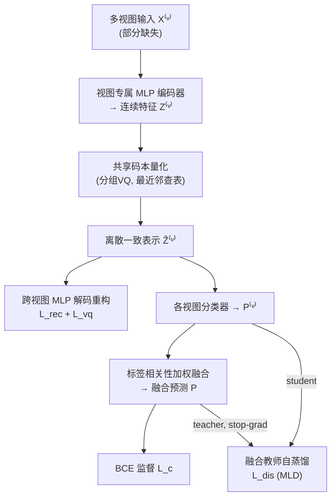

# Incomplete Multi-View Multi-Label Classification via Shared Codebook and Fused-Teacher Self-Distillation

**会议**: ICLR 2026  
**OpenReview**: [https://openreview.net/forum?id=LAuep7N7rF](https://openreview.net/forum?id=LAuep7N7rF)  
**代码**: [https://github.com/xuy11/SCSD](https://github.com/xuy11/SCSD)  
**领域**: 多视图多标签学习 / 表示学习  
**关键词**: 不完整多视图、多标签分类、向量量化、共享码本、自蒸馏、标签相关性  

## 一句话总结
针对"视图和标签同时缺失"的双缺失场景，SCSD 用一个跨视图共享的离散码本把不同视图量化对齐成一致表示，再用基于标签相关性的加权融合和"融合预测当教师"的自蒸馏，实现稳健的多视图多标签分类。

## 研究背景与动机
**领域现状**：多视图多标签学习（同一样本由多个模态/特征描述，且带多个标签）已被广泛研究，主流做法是用对比学习（DICNet）或信息瓶颈（SIP）学习视图间一致表示，再用平均/可学习权重/质量判别器做决策融合。

**现有痛点**：现实中"视图完整 + 标签全标注"几乎不可能——传感器故障、遮挡、隐私限制导致视图缺失；细粒度标注昂贵导致标签缺失。当**视图缺失**和**标签缺失同时发生**（dual-missing），只针对单一缺失设计的方法往往失效。

**核心矛盾**：现有一致表示学习依赖**基于 loss 的软约束**（对比损失、最小化非共享信息的正则），缺乏显式结构约束——视图缺失时容易欠表示或过正则，难以学到稳定且判别性强的共享语义；而多数融合策略忽视标签相关性蕴含的结构信息，且可学习权重/质量判别器会引入额外训练开销。

**本文目标**：在双缺失条件下，用更"结构化"的机制学习一致表示，并设计无需额外网络的融合与训练范式，提升泛化能力。

**核心idea**：（1）**离散化对齐** —— 用跨视图共享码本把连续特征量化进有限码本嵌入空间，不同视图自然对齐、冗余降低；（2）**结构感知融合** —— 用各视图预测能否保持标签相关性结构来打分赋权；（3）**融合教师自蒸馏** —— 把融合预测作为教师反哺各单视图分支。

## 方法详解

### 整体框架
SCSD（Shared Codebook + Self-Distillation）分上下两段：上段是**多视图一致离散表示学习**，把各视图编码→共享码本量化→跨视图重构；下段是**多视图预测融合 + 自蒸馏**，各视图分类后按标签相关性加权融合，再用融合预测当教师蒸馏回各视图。缺失视图/标签用零填充，并由指示矩阵 $W$（视图）、$G$（标签）在各损失中做掩码。

### 关键设计

**1. 共享码本 + 跨视图重构：用离散瓶颈做结构化对齐。** 不同视图原始维度 $d_v$ 各异，先用视图专属 MLP 编码器映射到统一维度 $Z^{(v)}=E^{(v)}(X^{(v)})$。关键一步是**向量量化**：定义一个所有视图共享的可学习码本 $V=\{e_i\}_{i=1}^{k}$，对每个样本特征分成 $g$ 段，每段用 $\ell_2$ 归一化后的最近邻查表 $t^*=\arg\min_j \|\ell_2(z_t)-\ell_2(e_j)\|_2^2$ 替换成码本嵌入，再拼回离散表示 $\hat{Z}^{(v)}$。由于所有视图共用同一个有限码本，不同视图自然落到同一离散空间里对齐，冗余被压缩。为进一步强化一致性，作者用**跨视图重构**——用视图 $j$ 的解码器去重构视图 $v$ 的表示 $\hat{X}^{(j,v)}=D^{(j)}(\hat{Z}^{(v)})$，重构损失 $\mathcal{L}_{rec}$ 只在两视图都存在时（$W_{i,j}W_{i,v}=1$）计算。量化的不可导问题用直通梯度估计 $z_t=\text{sg}[z_t-\hat{z}_t]+\hat{z}_t$ 解决，码本学习目标 $\mathcal{L}_{vq}$ 含 codebook 项和 commitment 项两边对齐。这一离散瓶颈替代了对比/信息瓶颈的软约束，提供了显式结构约束。

**2. 标签相关性导向的加权融合：让"懂标签结构"的视图说话。** 不引入任何额外网络或可学习权重，而是用**标签相关性矩阵**来评估各视图预测质量。先从训练集真值标签用条件概率算出全局相关矩阵 $S_{i,j}=\frac{Y_{:,i}^\top Y_{:,j}}{Y_{:,i}^\top Y_{:,i}+\varepsilon}$（标签 $i$ 出现时标签 $j$ 出现的概率）；再用每个视图当前 batch 的预测 $\hat{P}^{(v)}$ 同样算出 $S^{(v)}$。对称化、行归一化后，用 Frobenius 范数衡量视图能否保持全局相关结构，质量分 $q^{(v)}=-\|\hat{S}^{(v)}-\hat{S}\|_F$，再经温度 softmax 得到权重 $w_i^{(v)}=\frac{\exp(q^{(v)}/\tau)\cdot W_{i,v}}{\sum_u \exp(q^{(u)}/\tau)\cdot W_{i,u}}$，融合预测 $P_{i,:}=\sum_v w_i^{(v)}P_{i,:}^{(v)}$。$S^{(v)}$ 每个 batch 随预测更新，权重随训练阶段自适应变化，与全局标签依赖一致的视图被优先采信，噪声视图被抑制。融合预测用掩码 BCE（$G$ 掩盖缺失标签）监督。

**3. 融合教师自蒸馏 + 多标签 logit 蒸馏（MLD）：把全局知识反哺单视图。** 把聚合了所有视图信息的融合预测 $P$ 当**教师**（stop-gradient），各单视图预测 $P^{(v)}$ 当**学生**。蒸馏损失 $\mathcal{L}_{dis}=\frac{1}{\sum W}\sum_i\sum_v\big[\lambda D_{KL}(\text{sg}[P_{i,:}]\,\|\,P_{i,:}^{(v)})+(1-\lambda)\mathcal{L}_{bce}(P_{i,:}^{(v)},Y_{i,:})\big]W_{i,v}$，由模仿系数 $\lambda$ 平衡"学教师"与"学真值"。注意传统蒸馏假设类概率和为 1，在多标签下不成立——作者改用**多标签 logit 蒸馏（MLD）**，按 one-versus-all 把任务拆成多个二分类、逐标签对齐师生概率差，使蒸馏在多标签场景下有效。这样单视图分支既吸收融合预测里的全局知识，又保留自身视图特性，提升一致性与泛化。

总损失 $\mathcal{L}=\mathcal{L}_c+\mathcal{L}_{dis}+\alpha\mathcal{L}_{rec}+\mathcal{L}_{vq}$，整体复杂度由编解码主导、随样本数 $n$ 线性增长。

## 实验关键数据

### 主实验（50% 缺视图 + 50% 缺标签 + 70% 训练，AP 指标）

| 数据集 | DICNet | SIP | RANK | DRLS(次优) | **SCSD** |
|--------|--------|-----|------|-----------|----------|
| Corel5k | 0.378 | 0.416 | 0.425 | 0.433 | **0.447** |
| Pascal07 | 0.502 | 0.550 | 0.554 | 0.567 | **0.578** |
| Espgame | 0.299 | 0.310 | 0.314 | 0.326 | **0.345** |
| Iaprtc12 | 0.327 | 0.331 | 0.347 | 0.356 | **0.385** |
| Mirflickr | 0.586 | 0.615 | 0.606 | 0.630 | **0.634** |

SCSD 在全部 5 个数据集、平均排名（Ave.R）均为 **1.0**。在标签空间更复杂的 Espgame / Iaprtc12 上较次优 DRLS 提升 **5.83% / 8.15%**；相较 DICNet（对比学习）和 SIP（信息瓶颈）的 5 数据集平均 AP 提升 **14.94% / 8.65%**。在"视图完整 + 标签完整"设置下（图 2 雷达图）SCSD 仍在多数指标取得最优，说明共享码本机制的表示能力并不局限于缺失场景。

### 消融实验（Corel5k / Pascal07，AP）

| 变体 | Corel5k | Pascal07 |
|------|---------|----------|
| **SCSD（完整）** | **0.447** | **0.578** |
| w/o $\mathcal{L}_{dis}$（去自蒸馏） | 0.376 | 0.560 |
| w/o $\mathcal{L}_{dis}$ KL（只去 KL 模仿项） | 0.411 | 0.572 |
| w/o $\mathcal{L}_{rec}$（去跨视图重构损失） | 0.439 | 0.560 |
| w/o VQ（不量化，用连续特征） | 0.430 | 0.565 |
| w/o cross-view rec（改单视图重构） | 0.442 | 0.553 |
| w/o S fusion（改掩码平均融合） | 0.445 | 0.570 |

### 关键发现
- **自蒸馏 + 共享码本贡献最大**：去掉 $\mathcal{L}_{dis}$ 在 Corel5k 上 AP 暴跌 0.447→0.376；去掉 VQ 也明显下降，证实离散码本对一致表示学习的支撑作用。
- **标签数多时融合更有效**：去 S fusion 在 Pascal07（20 个标签）上掉得更明显，因为标签多→相关矩阵 $S$ 更可靠→更能识别各视图预测质量。
- **超参不敏感**：温度 $\tau$ 在较宽区间内对结果影响很小；$\alpha$、$\lambda$ 在合理范围内稳定。码本配置 $k=2048$、嵌入维度 $d_c=4$、k-means 初始化。

## 亮点与洞察
- **用离散瓶颈替代软对齐约束**：把"学一致表示"从对比/信息瓶颈的 loss 约束，换成共享码本的**显式结构约束**——有限码本天然强制不同视图落到同一离散空间，这是处理视图缺失时更鲁棒的思路。
- **融合权重"零额外参数"**：用标签相关性结构的 Frobenius 差作为视图质量代理，不需要质量判别器或可学习权重网络，且 batch 级自适应更新。
- **直面多标签蒸馏的本质难题**：明确指出传统 KL 蒸馏"概率和为 1"假设在多标签下失效，引入 MLD 的 one-vs-all 逐标签对齐，是把自蒸馏正确落地到多标签的关键。

## 局限与展望
- **码本带来额外开销**：存储/更新码本嵌入占内存，量化时计算特征与码本的距离矩阵增加计算量。
- **高缺失率下对齐变弱**：量化模块假设不同视图能在共享潜空间对齐，当视图缺失率非常高时，可用于对齐的跨视图信息骤减，共享码本的泛化能力会被削弱。
- **可探索方向**：自适应码本大小、面向极端缺失的对齐补偿机制，以及把离散码本一致表示推广到更多视图缺失模式。

## 相关工作与启发
- **一致表示学习**：DICNet（对比学习构造跨视图正对）、SIP（信息瓶颈最大化共享信息）——SCSD 用离散码本提供了第三条"结构化"路线。
- **多视图融合**：AIMNet（平均融合）、LMVCAT（可学习权重）、RANK（视图质量子网络）——SCSD 用标签相关性做无参数质量评估。
- **向量量化 / 自蒸馏**：借鉴 VQ-VAE 的直通估计与分组量化、自蒸馏框架与 MLD 多标签蒸馏，迁移到双缺失多视图多标签设定。
- **启发**：当软对齐在数据缺失时不稳，引入"有限离散瓶颈"作为显式结构约束是值得迁移的范式；监督信号里的结构信息（标签相关性）可直接当作免费的质量度量。

## 评分
- **新颖性**: ⭐⭐⭐⭐ 把共享码本离散瓶颈、标签相关性无参数融合、多标签融合教师自蒸馏三者组合到双缺失场景，思路新颖且各模块动机清晰，虽各组件源自已有技术。
- **实验充分度**: ⭐⭐⭐⭐ 5 个标准数据集、8 个对口 baseline、6 个指标，含完整/缺失两种设置、消融与超参分析，证据扎实；但缺失率仅测 50% 这一档，未系统扫描不同缺失程度。
- **写作质量**: ⭐⭐⭐⭐ 动机—方法—实验逻辑顺畅，公式与框架图清晰，三个设计的取舍说明到位。
- **价值**: ⭐⭐⭐⭐ 双缺失是现实高频但研究少的设定，方法稳定且开源，对多视图多标签学习社区有实用参考价值。

<!-- RELATED:START -->

## 相关论文

- [\[ICLR 2026\] Relationship Alignment for View-aware Multi-view Clustering](relationship_alignment_for_view-aware_multi-view_clustering.md)
- [\[CVPR 2026\] GaussianMatch: Semi-Supervised Regression with Pseudo-Label Filtering via Multi-View Gaussian Consistency](../../CVPR2026/self_supervised/gaussianmatch_semi-supervised_regression_with_pseudo-label_filtering_via_multi-v.md)
- [\[ICLR 2026\] Equivariant Splitting: Self-supervised learning from incomplete data](equivariant_splitting_self-supervised_learning_from_incomplete_data.md)
- [\[ICLR 2026\] Adaptive Test-Time Training for Predicting Need for Invasive Mechanical Ventilation in Multi-Center Cohorts](adaptive_test-time_training_for_predicting_need_for_invasive_mechanical_ventilat.md)
- [\[ICLR 2026\] PromptHub: Enhancing Multi-Prompt Visual In-Context Learning with Locality-Aware Fusion, Concentration and Alignment](prompthub_enhancing_multi-prompt_visual_in-context_learning_with_locality-aware_.md)

<!-- RELATED:END -->
