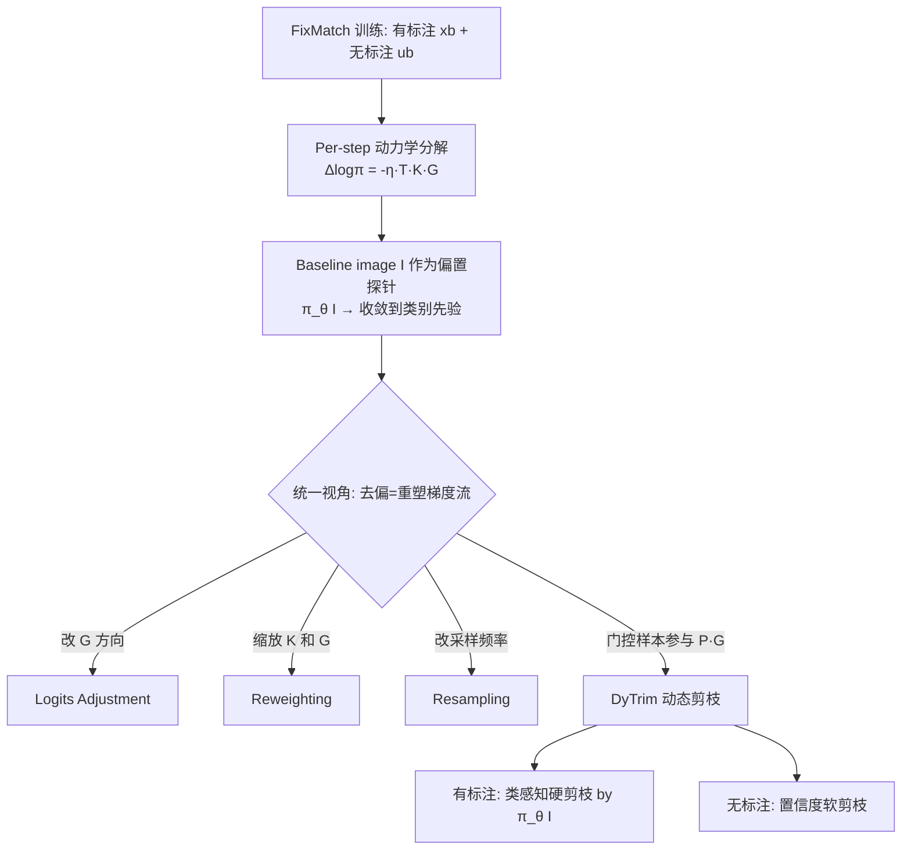

# Learning Dynamics of Logits Debiasing for Long-Tailed Semi-Supervised Learning

**会议**: ICLR 2026  
**OpenReview**: [https://openreview.net/forum?id=e15SYMcsTs](https://openreview.net/forum?id=e15SYMcsTs)  
**代码**: [https://jiajun0425.github.io/DyTrim](https://jiajun0425.github.io/DyTrim)  
**领域**: 半监督学习 / 长尾识别 / 表示学习  
**关键词**: 长尾半监督, 学习动力学, logits 去偏, 动态剪枝, baseline image, eNTK  

## 一句话总结
本文用"学习动力学"的视角统一解释了长尾半监督学习（LTSSL）中各类去偏方法的本质——都是在重塑梯度流，并据此提出免训练开销的动态剪枝框架 DyTrim，通过对有标注/无标注数据分别做类感知硬剪枝和置信度软剪枝，把梯度预算重新分配给真正纠偏的样本。

## 研究背景与动机

**领域现状**：半监督学习（FixMatch、ReMixMatch 等）默认有标注和无标注数据来自类别均衡分布，但真实世界数据普遍呈长尾分布。长尾半监督学习（LTSSL）方法层出不穷——分布对齐、数据重平衡、logits adjustment、基础模型方法（LADaS）等，其中用一张"任务无关基准图（baseline image）"的 logits 来度量分类器偏置（CDMAD）的做法很受关注。

**现有痛点**：这些方法虽然有效，但**"为什么它们能去偏"的底层机制始终不清楚**。大家知道改 logits、改权重、改采样能缓解偏置，却说不清这些操作在训练动力学层面究竟做了什么、彼此之间是什么关系。机制不明，就无法从第一性原理出发设计更强的方法。

**核心矛盾**：在半监督场景下，有标注数据的类别不均衡偏置会**通过分类器传染给伪标签**，再经无标注数据的一致性损失不断累积放大，形成"偏置→错误伪标签→更强偏置"的负反馈环——单步看似微小的伪标签误差会跨迭代累积成灾难性偏置，而不是被平均掉。

**本文目标**：从学习动力学（learning dynamics）角度刻画 LTSSL 中类别偏置如何产生、现有方法如何缓解，并在此统一框架下导出一个有理论保证的新去偏方法。

**核心 idea**：**（1）统一视角**——把 logits adjustment / reweighting / resampling 都解释为对 per-step 梯度动力学的不同重塑方式；**（2）偏置探针**——证明一张纯色 baseline image 的 logits 会收敛到类别先验，可作为模型累积偏置的可观测指标；**（3）数据层干预**——提出 DyTrim，在样本选择层面（而非损失/采样层面）做动态剪枝，更直接地把梯度预算挪给纠偏样本。

## 方法详解

### 整体框架

本文先建立一套 per-step 学习动力学的分解工具（Proposition 1-4），把"一次梯度更新如何改变模型在某观测点的置信度"拆成三个因子的乘积；再用这套工具统一分析 LA/reweighting/resampling 三类去偏方法到底改了哪个因子；最后提出 DyTrim——一个由 baseline image 引导、对有标注和无标注数据分别剪枝的"即插即用"框架。

### 关键设计

**1. Per-step 学习动力学分解：把"一次更新"拆成三个因子** 借鉴 Ren & Sutherland (2025)，本文把单步梯度更新对观测点 $x_o$ 预测的影响写成 $\Delta\log\pi_\theta^t(y|x_o) = -\eta\, T^t(x_o)\,K^t(x_o,x_b)\,G^t(x_b,y_b) + O(\eta^2)$。这里 $T^t(x_o)=I-\mathbf{1}\pi_{\theta^t}^\top(x_o)$ 只依赖当前预测（输出敏感度），$K^t(x_o,x_b)$ 是经验神经正切核（eNTK）刻画样本间相似度，$G^t=\nabla_z L$ 是损失梯度提供"能量与方向"。关键在于把 FixMatch 的更新天然拆成监督部分（由 $(x_b,y_b)$ 驱动）和一致性部分（由 $(u_b,\hat q_b)$ 驱动）两项叠加（Proposition 2），从而能分别追踪有标注与无标注更新对预测的影响。在 MNIST 上的可视化（Figure 1）证实：伪标签正确时一致性项强化监督信号，伪标签错误时则反向拉低正确概率，且在长尾设定下类别不均衡会**掩盖**伪标签真伪的影响，把分类器持续推向多数类。

**2. Baseline image 作为累积偏置的可观测探针** 单步动力学只能看个体样本的影响，看不到全局偏置。本文巧妙地把观测点 $x_o$ 换成一张任务无关的纯色 baseline image $I=k\cdot\mathbf{1}_d$。通过分析两层 MLP + 归一化层（BatchNorm/LayerNorm 把 bias 吸收进仿射参数），证明了**不变性**（Proposition 3）：纯色图的 logits 与像素值 $k$ 无关，直接坍缩为 $h(I)=b,\ \pi_\theta(I)=\text{Softmax}(b)$。更进一步（Theorem 1），在交叉熵的总体风险最小点上，baseline 预测恰好等于"归一化零特征状态下的条件类别分布"，即 $\hat p^\star(I)=\text{Softmax}(b^\star)=P(y\,|\,\text{归一化特征}=0)$，**精确捕获了长尾训练分布诱导的类别先验**。在 CIFAR10-LT 上 baseline logits 与经验类别先验高度吻合，去掉 bias 项后吻合即消失，验证了这个探针的有效性。因此跟踪 $\pi_\theta^t(I)$ 在训练中的演化，就能直接、可解释地度量类别偏置如何累积。

**3. 统一视角：三类去偏方法都在重塑同一个梯度流** 用 Proposition 4 的 baseline-image 动力学分解作为统一标尺，本文逐一改写三类方法：**Logits Adjustment** 等价于把梯度项改成 $\tilde G_{LA}=\pi_\theta(\alpha(u_b)|A(u_b))-\pi$（用类别先验 $\pi=\pi_\theta(I)$ 修正梯度方向，补偿不均衡）；**Reweighting** 用类权重 $w_c$ 同时缩放相似核与梯度 $\tilde K_{rw}=w_c K,\ \tilde G_{rw}=w_c G$（按类别频率调节样本相互作用强度）；**Resampling** 则直接改变各类进入训练的频率。三者的共性是**只改梯度信号或采样测度，却保持样本集不变**，于是冗余的头部样本仍在主导动力学——这正是 DyTrim 选择在数据选择层动手的动机。

**4. DyTrim：baseline 引导的双路动态剪枝** DyTrim 定义步依赖的剪枝概率 $P_t(x)$ 门控样本参与，其单步分解为 $\tilde G_{dytr}(x,y)=P_t(x)G^t(x,y)$，等价于把低效样本的核-梯度交互 $K^t(I,x)G^t(x,y)$ 直接置零，使核的有效贡献变为 $E_{x\sim p}[P_t(x)K^t(I,x)]$，选择性放大有信息的交互、抑制驱动长尾漂移的交互。针对有标注/无标注数据的分布失配，DyTrim 用两套互补机制：**有标注数据**采用类感知硬剪枝，用黑图 $I$ 的 logits 校准各类剪枝比例 $r_c=\pi_\theta(I)_c$，按监督损失 $L_{sup}$ 给每类剪掉 $r_c\times N_c$ 个得分最低样本——多数类（先验大）剪得多，从源头削弱头部主导；**无标注数据**因 $\gamma_u$ 未知，采用标签无关的软剪枝，对满足 $H_t^u(u_b)<\bar H_t^m$ 且去偏置信度 $p^*(u_b)\geq\tau$ 的样本以随机率 $r$ 剪枝，引入随机性和梯度缩放来对抗伪标签的不确定性与偏置。整套方法即插即用，可叠加到 FixMatch/FlexMatch/FreeMatch 上，且不增加额外计算开销。

## 实验关键数据

数据集：CIFAR10-LT、CIFAR100-LT、STL10-LT、ImageNet-127；评测指标 bACC（平衡准确率）/ GM（几何平均）。

### 主实验表格（CIFAR-10-LT，$\gamma=\gamma_l=\gamma_u$ 已知）

| 方法 | γ=50 bACC | γ=100 bACC | γ=150 bACC |
|------|-----------|------------|------------|
| FixMatch | 79.2 | 71.5 | 68.4 |
| CoSSL | 86.8 | 83.2 | 80.3 |
| CDMAD（前 SOTA） | 87.3 | 83.6 | 80.8 |
| **DyTrim** | **88.0** | **84.8** | **82.0** |

相比 CDMAD，DyTrim 平均提升 bACC 1.2% / GM 1.4%，无额外计算开销。叠加到 FlexMatch/FreeMatch 时平均提升 2–3%。CIFAR-100-LT（类多、不均衡更强）上同样全面领先。ImageNet-LT 上 FixMatch 20.0 → +CDMAD 35.4 → **+DyTrim 37.2**。

### 消融实验表格（CIFAR-10-LT，Table 14）

| 有标注剪枝 | 无标注剪枝 | Rescaling | γ=50 | γ=100 | γ=150 |
|:---:|:---:|:---:|:---:|:---:|:---:|
| | | | 87.3 | 83.6 | 80.8 |
| ✓ | | | 87.5 | 84.4 | 81.3 |
| ✓ | ✓ | | 87.7 | 84.0 | 81.4 |
| ✓ | ✓ | ✓ | **88.0** | **84.8** | 81.4+ |

三个组件互补：去掉 rescaling 掉 0.8–2.1 点，单去某一路剪枝也下降，全去退化最严重。

### 关键发现
- **不均衡未知/不一致设定（$\gamma_l\neq\gamma_u$）下依然稳健**：CIFAR-10-LT 与 STL-10-LT 上 DyTrim 仍领先 CDMAD 约 2%，说明双路剪枝设计对真实世界的分布失配有效。
- **ViT backbone 同样有效**：$\gamma_l=\gamma_u=100$ 时比 CDMAD 高 0.6%、比 FixMatch 高近 4%。
- **定性验证去偏**：DyTrim 训练出的分类器在 baseline image 上的预测比 CDMAD 更均衡，尾类准确率显著提升，直接印证"剪枝降低分类器偏置"的理论主张。

## 亮点与洞察
- **从"知其然"到"知其所以然"**：first 用统一的 per-step 动力学分解，把 LA/reweighting/resampling 三类看似无关的去偏方法归约为"对同一梯度流的不同重塑"，这是机制层面的洞察而非又一个 trick。
- **Baseline image 的理论化**：CDMAD 把纯色图当偏置探针是经验做法，本文用不变性定理 + 风险最小点分析证明了它收敛到类别先验，把一个"工程技巧"升级为有理论支撑的可观测量。
- **数据选择层的去偏视角**：指出现有方法都"保留样本集不变"的盲点，把去偏战场从损失/采样挪到样本参与门控，且有理论保证降低类别偏置、提升泛化。
- **零额外开销 + 即插即用**：剪枝反而减少参与训练的样本，叠加到任意 SSL 基线都能涨点。

## 局限与展望
- **依赖任务无关的 baseline image 作为偏置指标**：这是方法的核心假设，论文自承这是关键局限——若归一化层结构改变或 bias 项被其他设计吸收，探针的有效性可能受影响。
- **不变性分析基于两层 MLP + 标准归一化层**的简化设定，深层网络下的严格性更多依赖经验验证而非闭式证明。
- **无标注软剪枝引入随机率 $r$ 和阈值等超参**，对超参的敏感性和跨数据集的可迁移性仍需更广验证。
- 展望：把动力学分析框架推广到分布对齐、基础模型驱动的 LTSSL 方法，以及非图像模态的长尾半监督场景。

## 相关工作与启发
- **半监督基线**：FixMatch、FlexMatch、FreeMatch、ReMixMatch——本文以 FixMatch 为主基座并把分解推广到一致性损失项。
- **LTSSL 去偏方法**：DARP、CReST、ABC、CoSSL、CDMAD、Logits Adjustment（Menon 2021）——本文把它们统一进动力学框架，CDMAD 的 baseline image 思路被理论化。
- **学习动力学**：Ren & Sutherland (2025) 的 per-step 分解、eNTK（Jacot 2018）——本文把监督场景的分解扩展到半监督。
- **数据剪枝**：借鉴动态数据子集选择（Qin 2024 等），但首次把它作为长尾去偏的一种梯度预算重分配机制。
- **启发**：用"探针 + 动力学分解"来理解黑盒训练机制的范式，可迁移到其他存在累积偏置的训练场景（如噪声标签、域偏移）；"在数据参与层面而非损失层面干预"也为其他不均衡问题提供了新的设计维度。

## 评分
- **新颖性**: ⭐⭐⭐⭐ 用统一的学习动力学视角解释三类去偏方法 + 把 baseline image 探针理论化，机制洞察扎实；DyTrim 本身是分析的"副产品"，但视角足够新。
- **实验充分度**: ⭐⭐⭐⭐ 覆盖 4 个长尾数据集、已知/未知/不一致三种不均衡设定、CNN/ViT 两类 backbone、即插即用到三种 SSL 基线，消融清晰。
- **写作质量**: ⭐⭐⭐⭐ 理论推导层层递进（Prop 1→4 + Theorem 1），动机-机制-方法逻辑连贯；公式较密集，对动力学背景较弱的读者门槛偏高。
- **价值**: ⭐⭐⭐⭐ 既给 LTSSL 社区提供了统一理解框架，又给出零开销可落地的 SOTA 方法，理论与实用兼具。

<!-- RELATED:START -->

## 相关论文

- [\[ICLR 2026\] CoLA: Co-Calibrated Logit Adjustment for Long-Tailed Semi-Supervised Learning](cola_co-calibrated_logit_adjustment_for_long-tailed_semi-supervised_learning.md)
- [\[ICLR 2026\] Mini-cluster Guided Long-tailed Deep Clustering](mini-cluster_guided_long-tailed_deep_clustering.md)
- [\[ICLR 2026\] FedOpenMatch: Towards Semi-Supervised Federated Learning in Open-Set Environments](fedopenmatch_towards_semi-supervised_federated_learning_in_open-set_environments.md)
- [\[ICLR 2026\] GUIDE: Gated Uncertainty-Informed Disentangled Experts for Long-tailed Recognition](guide_gated_uncertainty-informed_disentangled_experts_for_long-tailed_recognitio.md)
- [\[ICLR 2026\] Midway Network: Learning Representations for Recognition and Motion from Latent Dynamics](midway_network_learning_representations_for_recognition_and_motion_from_latent_d.md)

<!-- RELATED:END -->
