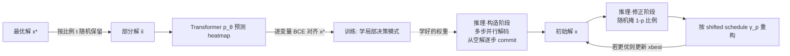

# MaskCO: Masked Generation Drives Effective Representation Learning and Exploiting for Combinatorial Optimization

**会议**: ICLR 2026  
**OpenReview**: [https://openreview.net/forum?id=psUjNnLhl9](https://openreview.net/forum?id=psUjNnLhl9)  
**代码**: [https://github.com/Thinklab-SJTU/MaskCO](https://github.com/Thinklab-SJTU/MaskCO)  
**领域**: self_supervised  
**关键词**: 神经组合优化, 掩码生成, 自监督学习, 表示学习, TSP, CVRP, MIS  

## 一句话总结
MaskCO 把"学习求解组合优化"重新定义为"在最优解上做掩码自监督"——遮住最优解的一部分让模型补全，把一个 (实例, 解) 对裂变成指数级的局部学习信号，再用"掩码-重构"循环在推理时反复擦写改进解，在 TSP/CVRP/MIS 上把最优性 gap 砍掉 99%+ 并提速约 10 倍。

## 研究背景与动机
- **领域现状**：神经组合优化（NCO）长期被两种范式统治——construction（自回归/非自回归一次性构造整条解）和 improvement（神经网络引导局部搜索改进现有解）。近年扩散模型、树搜索把热力图式的软约束求解推到了 TSP、MIS 这类约束相对简单的问题上不错的水平。
- **现有痛点**：这些方法都把一条解当成一个**整体对象（monolithic）**，只在最终输出上施加目标约束。这意味着最优解里那些**反复出现的局部子结构**（路由里高效的子路径、图问题里成簇的节点）所蕴含的细粒度决策模式被白白浪费，导致数据利用率低、可扩展性差。而 CO 里拿到可靠监督信号（最优解）本身就很贵，一条只用一次太奢侈。
- **核心矛盾**：NLP/CV 早年也卡在"重度依赖任务标签"上，直到自监督预训练（GPT 的 next-token、BERT/MAE 的掩码自编码）把整个领域颠覆——能从原始数据里大规模挖掘潜在模式。CO 的解空间是离散的、非序列的、要求高度可扩展，恰恰是掩码生成最擅长的场景，但此前几乎无人把这套范式真正搬进 CO 的训练目标里。
- **本文目标**：为 NCO 找到一个像掩码自编码那样**基础、可扩展、问题无关**的训练范式，让模型学到可迁移的解结构表示，而不是死记单条整体解。
- **核心 idea**：**【掩码即裂变】** 把最优解 $x^\star$ 随机遮住一部分得到部分解 $\hat{x}$，训练模型从上下文补全被遮的变量；一条解能采样出指数级多的部分解，把整体监督拆成海量"局部决策"信号，逼模型内化细粒度结构依赖；推理时再用"掩码-重构"把这套能力变成一个高效的搜索器。

## 方法详解

### 整体框架
MaskCO 是一个极简、问题无关的 encoder-decoder Transformer 框架，训练和推理共用同一套掩码机制。训练阶段把最优解随机掩码、用逐变量 BCE 学补全；推理分两段：先用多步并行解码从空解"长"出一条初始解，再反复"随机掩一块→重构这块"做局部搜索式精修，全程不需要为不同问题改架构。

### 关键设计

**1. 解级自监督训练：把一条解变成一门"课程"。** 给定最优解 $x^\star \in \Omega(G)$，先从分布 $D_t$（默认均匀分布）采一个保留比例 $t\sim D_t$，再均匀保留 $\lceil t\cdot|x^\star|\rceil$ 个变量构成部分解 $\hat{x}$，剩下的被遮。模型输出选择概率 $p_\theta(G,\hat{x})\in[0,1]^{|U(G)|}$，以真实指示向量 $x^\star$ 为目标做逐变量二元交叉熵：$\mathcal{L}=\mathrm{BCE}(p_\theta(G,\hat{x}),x^\star)=-\sum_{u}[x^\star_u\log p_{\theta,u}+(1-x^\star_u)\log(1-p_{\theta,u})]$。每个被遮位置都是一个"这个变量属不属于最优解"的独立判断，而每轮迭代遮的子集都不同，于是模型见到的是无数条不同的推理路径——它学的不是某条具体解，而是一个**对任意部分状态都能给出可靠置信度的估计器**，数据利用率随保留比例的组合数指数级放大。

**2. 多步并行解码：用训练目标自然地"长"出一条解。** 推理构造阶段不靠额外搜索，而是直接复用模型的补全能力。它用一个单调递增、满足 $\gamma(0)=0,\gamma(1)=1$ 的调度函数 $\gamma$（默认线性 $\gamma(t)=t$）控制解的生长速度。对固定基数 $m$ 的问题（如 TSP 恰好 $m$ 条边），从空解 $\hat{x}^{(0)}=0$ 出发，第 $i$ 步用贪心选择函数 $f_G$ 把当前 heatmap 里置信度最高、且加进去仍可扩展的变量补上，使已选元素数严格达到 $\lceil\gamma(i/K)\cdot m\rceil$：$\hat{x}^{(i)}\leftarrow f_G(\hat{x}^{(i-1)},p_\theta(G,\hat{x}^{(i-1)}),\lceil\gamma(i/K)\cdot m\rceil)$。这样每步同时预测所有变量、只 commit 最有把握的那批，$K$ 步后正好得到完整可行解。对基数可变的问题（如 MIS），先用 $m_\theta(\hat{x})=\sum_u p_{\theta,u}$ 估计解的规模再据此调度，末步若不可行则用一次 completion 步补全（复用上一轮分数避免重算）。

**3. 掩码-重构修正：把静态生成升级成带记忆的搜索。** 一次性确定性解码会"一锤定音"——早期不可逆的 commit 可能把解困在次优配置里。修正阶段引入 mask-and-reconstruct：给定当前解 $x$，按保留率 $p$ 随机遮掉一部分得 $\hat{x}$，再用一个**平移过的调度** $\gamma_p(r)=p+(1-p)\cdot\gamma(r)$ 重构那 $1-p$ 比例的缺口——保留的部分当"上下文锚点"，被遮的区域则被概率性地重新探索。$p$ 直接控制探索-利用权衡：$p$ 小则大刀阔斧重优化大块解，$p$ 大则做局部精修。整条推理（Alg.1）= 一次构造 + $\lfloor T/K\rfloor-1$ 轮修正，每轮若目标 $l(x;G)$ 更优就更新 $x_{best}$。已发现的高质量子结构成了后续精修的向导，受控掩码又保住了跳出局部最优的灵活性，于是"训练时学的表示"被直接转化成了"求解时高效的搜索行为"。

**4. 极简且问题无关的 Transformer 骨架。** 采用标准 encoder-decoder Transformer，节点特征线性投影进嵌入空间；边连接用 0-1 邻接矩阵 $A$ 以**加性偏置**直接注入注意力 logits：$Z=Q^\top K+A$（不做缩放）。节点决策问题把节点特征投到一维取 logit，边决策问题用源/目标节点嵌入的点积算两两兼容度。整套设计刻意"最小化问题专属组件"，让同一框架无缝覆盖 TSP（选边）、MIS（选点）、CVRP（带容量硬约束，修正步间插 2-opt 启发式落约束）。

## 实验关键数据

### 主实验表格
TSP 上 MaskCO 全尺寸近乎零 gap，且时间碾压扩散类方法：

| 方法 | TSP-100 GAP / 时间 | TSP-500 GAP / 时间 | TSP-1000 GAP / 时间 |
|------|------|------|------|
| LKH-3 | 0.00% / 33m | 0.00% / 46.3m | 0.00% / 2.57h |
| DIFUSCO (Ts=100) | 0.06% / 30m | 0.87% / 19.1m | 1.31% / 51.9m |
| Fast T2T | 0.01% / 8.3m | 0.21% / 6.9m | 0.42% / 18.3m |
| LEHD (RRC1000) | 0.0019% / 7.87m | 0.175% / 37.5m | 0.726% / 3.35h |
| **MaskCO (T=2560)** | **0.0000% / 1m0s** | **0.0007% / 43s** | **0.0027% / 2m8s** |

CVRP（硬约束路由）与 MIS（变基数图问题）同样刷新 SOTA：

| 问题 | 前 SOTA 代表 | MaskCO | 提升 |
|------|------|------|------|
| CVRP-1000 | LEHD 1.859% (1.83h) | 0.438% (7m33s, T=10240) | gap↓约 76%，大幅提速 |
| MIS RB-[200-300] | Fast T2T 2.89% (4.7m) | 0.10% (23m, T=32k) | 击败最优生成式 SOTA 94% |
| MIS ER-[700-800] | T2T 7.72% (27.8m) | 0.62% (43m, T=32k) | gap↓约 92% |

### 消融实验表格
修正机制（mask-and-reconstruct）是性能核心，TSP-500 上同样算力下加修正质变：

| 配置 | OBJ. | GAP | 时间 |
|------|------|------|------|
| w/o corr. (T=K=1) | 16.689 | 0.8656% | <1s |
| w/o corr. (T=K=320) | 16.554 | 0.0520% | 6s |
| **w/ corr. (T=320, K=1)** | **16.546** | **0.0020%** | 6s |

架构消融：Transformer 骨架显著优于 GCN（TSP-500 同 T=320 下 0.0020% vs 0.0212%，且更快）。

### 关键发现
- **算力可换质量**：MaskCO 的 gap 随 forward passes $T$ 单调下降，提供了一条平滑的"质量-时间"调节曲线，部署时按预算选点即可。
- **表示高度可迁移**：用掩码目标训出的同一个模型，可直接换装自回归/双向 AR/松弛 AR 解码，或 1-epoch 微调成一致性模型，都拿到极低 gap——证明学到的是通用结构表示而非某种解码方式的副产物。
- **强泛化**：100 节点训练的模型在真实世界 TSPLIB 50-200 上 gap 仅 0.033%（较前 SOTA 改进 88.2%），500 节点模型在 TSPLIB 201-1000 上 0.115%（改进 87.6%）。

## 亮点与洞察
- **范式级的视角转换**：第一次把"解级自监督掩码生成"作为 NCO 的基础训练范式，思想直系 BERT/MAE，却切中了 CO"监督信号贵、局部结构被浪费"的痛点。
- **训练与推理同构**：掩码补全既是训练损失，又天然就是推理时的并行解码与局部搜索算子，三者用同一套机制统一，工程上异常干净。
- **数据效率的杠杆**：一条最优解 → 指数级部分解，把昂贵监督的边际价值压榨到极致，这正是它在大尺寸上仍稳的根因。
- **简单即可扩展**：刻意去掉问题专属设计（只靠邻接偏置注入图结构），让同一框架横跨选点/选边/硬约束三类问题。

## 局限与展望
- **修正阶段算力换质量**：极致 gap 依赖较大 $T$（如 MIS 32k forward passes 要 23-43 分钟），在实时性要求高的场景需权衡。
- **仍需最优解监督**：训练目标建立在已有最优/高质量参考解上，对于难以获得参考解的新问题类型，范式的迁移性还待验证。
- **CVRP 靠外挂启发式落约束**：硬约束问题的可行性部分依赖修正步间插入的 2-opt，掩码机制本身对复杂硬约束的原生处理仍有空间。
- **作者展望**：内化的局部结构依赖为未来的**多任务/跨问题扩展**提供了更稳的架构基座，是后续值得推进的方向。

## 相关工作与启发
- **NCO 两大阵营**：construction（自回归 Kool/POMO、非自回归 DIFUSCO/T2T）与 improvement（NeuOpt 等局部搜索），都停留在整体解层面，MaskCO 用局部子结构视角与之区分。
- **掩码生成谱系**：BERT（NLP）→ BEiT/MAE（CV 离散 tokenizer）→ MaskGIT（图像非自回归少步合成），MaskCO 把这条"掩码+非自回归并行解码"主线引入离散、非序列、需高可扩展的 CO 域。
- **启发**：它示范了一个通用配方——只要任务的"解"具有可分解的局部结构，就能把整体监督改写成掩码自监督，从而指数级放大数据效率；这对调度、布局、分子设计等其它离散决策问题同样有借鉴价值。

## 评分
- **新颖性**: ⭐⭐⭐⭐⭐ — 把掩码自监督作为 NCO 的基础训练范式，是真正的视角级创新，且训练/推理用同一机制统一，思想干净有力。
- **实验充分度**: ⭐⭐⭐⭐⭐ — 覆盖 TSP/CVRP/MIS 三类问题多尺寸、TSPLIB 真实泛化、修正/架构消融、替代解码与微调适配，证据链完整。
- **写作质量**: ⭐⭐⭐⭐ — 动机叙述清晰、公式与算法规范，selection function 等形式化定义略增阅读门槛。
- **价值**: ⭐⭐⭐⭐⭐ — gap 降 99%+、提速约 10×、强泛化且表示可迁移，为 NCO 提供了可扩展的新基座，落地与后续研究价值都高。

<!-- RELATED:START -->

## 相关论文

- [\[ICLR 2026\] Self-Predictive Representations for Combinatorial Generalization in Behavioral Cloning](self-predictive_representations_for_combinatorial_generalization_in_behavioral_c.md)
- [\[ICLR 2026\] Temporal Slowness in Central Vision Drives Semantic Object Learning](temporal_slowness_in_central_vision_drives_semantic_object_learning.md)
- [\[CVPR 2026\] Learning from Semantic Dictionaries: Discriminative Codebook Contrastive Learning for Unified Visual Representation and Generation](../../CVPR2026/self_supervised/learning_from_semantic_dictionaries_discriminative_codebook_contrastive_learning.md)
- [\[ICLR 2026\] Exploiting Low-Dimensional Manifold of Features for Few-Shot Whole Slide Image Classification](exploiting_low-dimensional_manifold_of_features_for_few-shot_whole_slide_image_c.md)
- [\[ICLR 2026\] Rethinking Unsupervised Cross-Modal Flow Estimation: Learning from Decoupled Optimization and Consistency Constraint](rethinking_unsupervised_cross-modal_flow_estimation_learning_from_decoupled_opti.md)

<!-- RELATED:END -->
