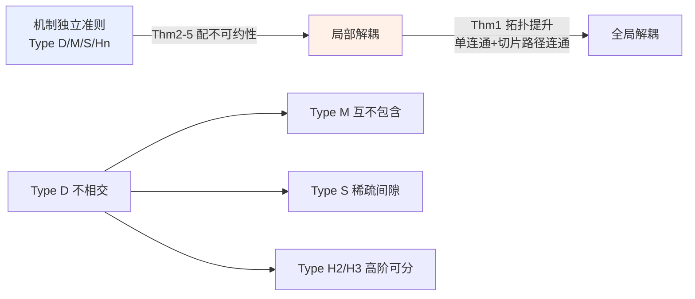

# Mechanistic Independence: A Principle for Identifiable Disentangled Representations

**会议**: ICLR 2026  
**OpenReview**: [https://openreview.net/forum?id=0VVdai71xb](https://openreview.net/forum?id=0VVdai71xb)  
**代码**: 待确认  
**领域**: 表示学习 / 解耦表示 / 可识别性理论  
**关键词**: 解耦表示, 可识别性, 机制独立性, 非线性 ICA, 子空间可识别性  

## 一句话总结
本文提出"机制独立性"（mechanistic independence）作为解耦表示可识别性的统一原则——用隐因子如何通过生成器**作用于观测**（而非如何分布）来定义因子，从而给出一族对隐分布重加权不变、即使在非线性非可逆混合下也成立的子空间可识别性定理。

## 研究背景与动机
**领域现状**：解耦表示希望恢复生成观测数据的潜在变化因子，其可识别性的经典路线是假设隐因子**统计独立**（ICA / ISA）。但 Hyvärinen & Pajunen (1999) 早已证明，对一般非线性混合，仅靠统计独立无法识别，于是大量工作只能再加时间结构、辅助变量、多视图或干预等**分布层面的额外假设**来补救。

**现有痛点**：另一条互补路线是约束**生成机制**本身（稀疏性、加性结构、Jacobian 正交即 IMA 等）。但这些结果彼此孤立、各自为政，缺乏统一框架；更关键的是，绝大多数仍把统计独立和机制约束**耦合在一起**，导致识别结论会随隐分布的改变而失效——一旦隐因子之间出现统计依赖，真实因子可能与任何统计独立子空间错位。

**核心矛盾**：可识别性到底应该锚定在"因子怎么分布"还是"因子怎么作用于观测"上？前者对密度敏感、对依赖脆弱；后者直觉上更接近"因果/机制结构"，但一直没有被抽象成独立的组织原则。

**本文目标**：把机制独立性作为**独立自洽的组织原则**，给出不依赖任何统计假设、对隐密度重加权不变、且适用于非可逆生成器与多维因子的子空间可识别性理论。

**核心 idea**（**机制独立性**）：因子由它们通过生成器 $g$ 对观测流形的作用方式来刻画。本文提出一族从强到弱的机制独立准则（Type D / M / S / Hₙ），证明每个准则配上相应的"不可约性"都能给出可识别性定理，并建立准则间的层级关系与图论刻画。

## 方法详解

### 整体框架
数据生成过程为 $g: S \to X \subseteq \mathbb{R}^{d_x}$，把潜在配置空间 $S \subseteq S_1 \times \cdots \times S_K$（每个 $S_i$ 是正维子空间，隐分布 $P_s$ 在 $S$ 上严格为正）映到观测流形 $X = g(S)$。解耦被定义为：解码器 $\hat g$ 相对 $g$ 解耦，当且仅当 $g = \hat g \circ h$ 且 $h$ 是**可分解映射**（每个目标因子只依赖对应的源因子）。本文先用拓扑论证把"局部解耦"提升到"全局解耦"，再在局部层面给出一族基于生成器 Jacobian 的机制独立准则来认证局部解耦。

### 关键设计
**1. 从局部到全局：拓扑提升定理（Theorem 1）点明"局部解耦即全局解耦"。** 本文的策略是：真正难证的是局部解耦，而全局性质几乎是拓扑的免费午餐。Theorem 1 表明，只要源空间 $S$ 单连通、每个 $(K{-}1)$-切片（固定除 $k$ 个因子外全部得到的子空间）路径连通、$g$ 连续且局部单射、$\hat g$ 是覆盖映射，那么局部解耦就能沿路径传播为全局解耦。直觉是：每个因子可独立变动、局部单射阻止分支，于是局部分解能无歧义地拼接成全局分解。在 $\mathbb{R}^n$ 的凸开集等常见情形下这些拓扑条件自动满足，因此后文专注于建立**局部**可识别性，且结论对非可逆生成器同样成立。

**2. Type D / M：从"坐标不相交"到"互不包含"地放宽重叠。** 最强的 Type D 独立要求不同因子作用于**不相交的观测坐标**——形式上 $D_i g_s(u) \bullet D_j g_s(v) = 0$（$\bullet$ 为 Hadamard 积），即每个因子控制一组互不重叠的像素。用 Jacobian 列向量的支撑 $\Omega_i(s) := \mathrm{supp}(Dg_s(u_i))$ 改写即 $\forall a\in C_i, b\in C_j:\ \Omega_a(s)\cap\Omega_b(s)=\varnothing$。Type M 把它松弛为**互不包含** $\Omega_a(s)\pitchfork\Omega_b(s)$（可相交，但谁也不被谁包含），从而允许部分遮挡、阴影、反射这类像素重叠的情形。Type M 的可识别性（Theorem 3）额外要求一个稀疏性约束 $\lVert J_{\hat g}(z)\rVert_0 \le \lVert J_g(s)\rVert_0$，这直接催生了一个稀疏正则项，并把 Zheng & Zhang (2023) 的一维结果推广到多维因子。

**3. Type S：用"稀疏间隙"刻画对齐基的极限松弛。** Type S 独立把视角转向 Jacobian 作为字典：定义 $\rho^+_B(s)$ 为基与真实分解 $B=\bigoplus_i T_{s_i}S_i$ 对齐时 $Dg_s$ 矩阵的最小 $\ell_0$ 范数，$\rho^-_B(s)$ 为所有**不**尊重 $B$ 的基上的 $\ell_0$ 下确界，要求 $\rho^+_B(s) < \rho^-_B(s)$。含义是：最稀疏的字典恰在基与真实因子分解对齐时取得，任何错位都严格增大支撑。它比 Type D 弱得多——即使支撑大幅重叠也可成立（一维因子下只要共享像素比例不超过一半，错位基哪怕让共享元素完美抵消，非零数仍会增加）。Type S 由此成为捕获"所有潜在抵消"的理论极限情形，但 $\ell_0$ 优化不可解，实践中需借助 compositional contrast 作为代理损失。

**4. Type Hₙ：用高阶交叉导数消失统一加性与非对称交互。** Type Hₙ 独立要求所有跨块的 $n$ 阶交叉导数消失 $D^n_{i,j}g_s=0$。当 $n=2$ 时即所有交叉 Hessian 块为零，等价于加性结构 $g(s)=\sum_i g^{(i)}(s_i)$（Lachapelle et al. 2023）；$n>2$ 则进一步放宽。配合"$n$ 阶可分性"（要求 $D^n_{i,i}g_s$ 的像与其他块及低阶导张成的空间平凡相交），Theorem 5 给出可识别性。本文的关键改进是显式要求源因子**不可约**，从而消除对 $(n{+}1)$ 阶导数（可能不存在）的依赖，并把 Brady et al. (2024) 的非对称交互原则统一为一个特例。

**5. 层级与图论刻画：把"独立且不可约因子"等同于连通分量。** 四类准则构成自然层级（图 1）：Type D 最强，蕴含其余；微分 Type D 得 Type H₂、再微分得 H₃……；不相交是互不包含的特例故蕴含 Type M；在最稀疏的积分裂基下 Type D 也蕴含 Type S。本文进一步给出图论刻画：定义图 $G_D(s,B)$ 的边为 $D g_s(u_i)\bullet Dg_s(u_j)\neq 0$，则 Type D 独立且不可约的因子**恰好对应 $G_D$ 的连通分量**——对齐基达到最多 $K$ 个连通分量，任何错位基严格更少。这把"稀疏间隙"与"连通分量个数间隙"统一起来，并把局部等距、共形映射等已有结果纳入同一图视角。

## 实验关键数据
本文以理论为主，实验仅为验证代理损失的可行性（合成数据，复现 Brady et al. 2023 的设置）。

### 主实验设置

| 项目 | 配置 |
|------|------|
| 生成器 | 可逆 MLP，Jacobian 被构造为具有指定支撑结构 |
| 隐变量 | 标准正态采样 |
| 损失 | $\mathcal{L}=\mathcal{L}_{recon}+\lambda C_{comp}$（重构 + compositional contrast） |
| slot 数 | $L=K\in\{2,3,5\}$ |
| 正则强度 | $\lambda\in\{10^{-2},1\}$，5 个随机种子 |
| 评测指标 | Slot Identifiability Score (SIS) |

其中 compositional contrast 为 $C_{comp}(\hat g,z)=\sum_{n=1}^{d_x}\sum_{i=1}^{K}\sum_{j=i+1}^{K}\big|\frac{\partial \hat g_n}{\partial z_i}\big|\big|\frac{\partial \hat g_n}{\partial z_j}\big|$，用作 Type S 独立的代理损失。

### 关键发现
- **小重叠时代理损失可靠**：当不同 slot 影响的观测维度重叠较小时，$C_{comp}$ 能可靠地作为 Type S 独立的代理，SIS 高、可识别性好。
- **大重叠时退化**：随重叠比例上升，优化越来越容易陷入坏的局部极小，识别质量下降；寻找更鲁棒的代理损失被列为开放问题。
- **0% 重叠是唯一满足 Type D 的点**：只有完全不相交时才落入最强的 Type D，其余区间需要 Type S 这类更弱准则才覆盖。

## 亮点与洞察
- **视角转换的彻底性**：把可识别性从"隐分布"完全迁移到"生成机制"，使结论对隐密度的任意重加权不变——即使因子间/因子内存在统计依赖也照样识别，这是与 ICA/ISA 谱系的本质区别。
- **统一性强**：一个框架同时涵盖并推广了 object-centric 的不相交支撑（Brady 2023）、非对称交互（Brady 2024）、加性解码器（Lachapelle 2023），并部分包含基于稀疏的非线性 ICA（Zheng 2022/2023）中不依赖统计独立的部分；IMA 的 Jacobian 正交也成为该分类里的一个实例。
- **不可约性是被低估的关键**：把"因子不可约"提到与"独立"同等地位，既排除了把因子任意拆分重组的虚假解，又消除了对 $(n{+}1)$ 阶导数的依赖，使理论对非可逆生成器也成立。
- **三种等价视角自洽**：稀疏间隙 ⇔ 连通分量个数间隙 ⇔ 机制独立，给同一现象提供了代数、图论、几何三套语言。

## 局限与展望
- **实践可操作性弱**：Type S 的 $\ell_0$ 稀疏间隙不可直接优化，只能用 compositional contrast 近似，且该代理在重叠较大时失效。
- **图像中的物理失效模式明确但受限**：Type D 一遇阴影/反射/透明/遮挡即失效；Type H₂ 仅在严格加性混合下成立；高阶 Hₙ 理论上更宽松，但高阶导数实际不可计算。
- **实验规模小**：仅合成数据 + 可逆 MLP，未在真实图像/大规模场景验证，理论与实践之间仍有距离。
- **统计与机制的结合是未来方向**：作者指出，对一维因子要达到本文的强识别仍需额外分布假设，图构造或可作为融合机制独立与统计独立、恢复多维因子的工具。

## 相关工作与启发
- **对 ICA/ISA 谱系的回应**：经典路线靠统计独立 + 时间/辅助/多视图/干预补强；本文改为靠生成器性质，因而对广泛隐密度都成立。
- **对机制约束谱系的统一**：post-nonlinear、近线性、局部等距、分段仿射、稀疏、加性、共形/正交、Jacobian 约束（IMA）等被纳入同一分类，机制独立成为它们的"最大公约数"。
- **对稀疏 VAE 的理论解释**：为 Rhodes & Lee (2021) 用 $\ell_1$ 惩罚解码器 Jacobian 打破旋转对称的经验现象提供了理论依据；Moran et al. (2021) 的合成数据集亦可证满足本文定理。
- **启发**：把"可识别性锚定在机制而非分布"这一思路可迁移到因果表示学习、object-centric 学习的子空间识别，尤其是当统计独立假设在真实数据上不成立时。

## 评分
- **新颖性**: ⭐⭐⭐⭐⭐ 把机制独立性抽象为独立的组织原则并提出一族可识别准则 + 层级 + 图论刻画，统一了多条互不相通的工作线，视角原创性高。
- **实验充分度**: ⭐⭐ 纯理论导向，仅合成数据小实验验证代理损失，缺真实场景与大规模验证。
- **写作质量**: ⭐⭐⭐⭐ 概念层次清晰、层级关系与图论刻画自洽，但定义/定理密集、符号繁重，对非可识别性背景读者门槛较高。
- **价值**: ⭐⭐⭐⭐ 对解耦表示可识别性理论是重要的统一与推广，为后续设计不依赖统计独立的识别方法与正则项提供了原则性基础。

<!-- RELATED:START -->

## 相关论文

- [\[ICLR 2026\] A Bayesian Nonparametric Framework for Learning Disentangled Representations](a_bayesian_nonparametric_framework_for_learning_disentangled_representations.md)
- [\[ICLR 2026\] Disentangled representation learning through unsupervised symmetry group discovery](disentangled_representation_learning_through_unsupervised_symmetry_group_discove.md)
- [\[ICLR 2026\] GUIDE: Gated Uncertainty-Informed Disentangled Experts for Long-tailed Recognition](guide_gated_uncertainty-informed_disentangled_experts_for_long-tailed_recognitio.md)
- [\[ICLR 2026\] OrthoRF: Exploring Orthogonality in Object-Centric Representations](orthorf_exploring_orthogonality_in_object-centric_representations.md)
- [\[ICLR 2026\] Self-Predictive Representations for Combinatorial Generalization in Behavioral Cloning](self-predictive_representations_for_combinatorial_generalization_in_behavioral_c.md)

<!-- RELATED:END -->
