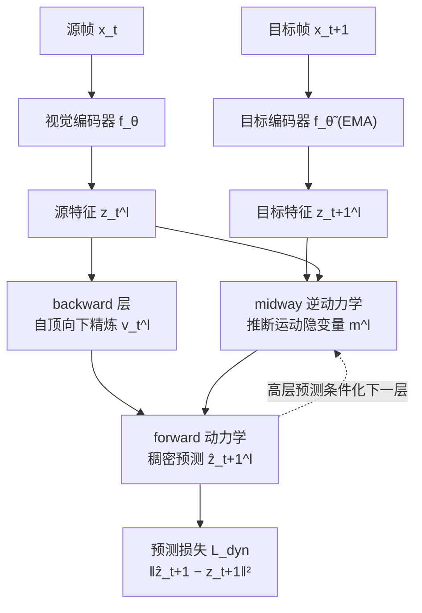

# Midway Network: Learning Representations for Recognition and Motion from Latent Dynamics

**会议**: ICLR 2026  
**OpenReview**: [https://openreview.net/forum?id=ZenwrTwNcj](https://openreview.net/forum?id=ZenwrTwNcj)  
**代码**: 论文中提供（New York University, Chris Hoang & Mengye Ren）  
**领域**: 自监督表示学习 / 视频表示学习  
**关键词**: 自监督学习, 隐空间动力学, 逆/正向动力学, 光流, 语义分割, 自然视频  

## 一句话总结
Midway Network 把决策领域的"隐空间动力学建模"搬到自然视频上，用一条**中途（midway）自顶向下路径**推断帧间运动隐变量，配合**稠密前向预测**和**分层结构**，第一个仅靠自然视频就同时学好"物体识别（语义分割）"和"运动理解（光流）"两套表示。

## 研究背景与动机
- **领域现状**：视觉自监督学习（SSL）已能从无标注数据学出强表示，但绝大多数方法只服务于识别**或**运动其中之一。图像 SSL（DINO/iBOT/MAE）在精心策划的"单主体 iconic 图像"上学语义，缺时间信息学不到运动；学运动的方法（光流/跨视图重建）则语义很差。
- **现有痛点**：少数想在自然视频上做 SSL 的工作，要么**不利用运动变换**（DoRA、Walking Tours），要么**依赖外部有监督光流网络**把运动当现成信号塞进来（FlowE、PooDLe）。唯一兼顾语义+运动的 MC-JEPA 仍然要靠精心策划的 iconic 图像训练。
- **核心矛盾**：识别与运动是感知里互补的一对——识别建立跨视角的物体对应，运动把同一物体在时空中连起来以学其不变属性；但没人能**纯靠自然视频**把两者一起学好。
- **本文目标**：仅用自然视频（无标注、无外部光流网络、无 iconic 图像），联合学出可同时迁移到识别与运动任务的图像级表示。
- **核心 idea**：**「把隐空间动力学建模引入自然视频 SSL」**——借鉴神经科学的预测编码（逆动力学=识别、正向动力学=生成预测）与决策领域的 latent dynamics（DynaMo/Dreamer），用逆动力学推断帧间运动隐变量、用正向动力学做预测，但针对自然视频的"复杂多物体场景"做两点关键改造：**稠密前向预测**（而非全局特征）+ **分层精炼架构**。

## 方法详解

### 整体框架
Midway Network 输入一对源/目标视频帧 $x_t, x_{t+1}$，用师生网络编码成多层级特征 $z_t=f_\theta(x_t)$、$z_{t+1}=f_{\tilde\theta}(x_{t+1})$（目标网络 $\tilde\theta$ 是学生 $\theta$ 的 EMA）。核心是一条贯穿多个特征层级 $l=1..L$ 的循环：**midway 路径**自顶向下推断运动隐变量 $m$，**backward 层**用横向连接精炼源特征 $v_t$，**forward 预测器**在 $v_t$ 和 $m$ 条件下预测目标帧稠密特征 $\hat z_{t+1}$，预测误差 $\mathcal{L}_{\text{dyn}}$ 在每个层级上联合训练全部组件。

### 关键设计

**1. Midway 自顶向下运动隐变量：把"光流逐级精炼"搬进逆动力学。** midway 路径是个 transformer，吃上一层运动隐变量 $m^{l+1}$、源特征 $z_t^l$、目标特征 $z_{t+1}^l$，输出本层运动隐变量并**逐层累加**：$m^l = \text{midway}(m^{l+1}, z_t^l, z_{t+1}^l) + m^{l+1}$，初始隐变量是可学习 token。关键在于：除最高层外，midway 用的是上一层 forward 预测的结果 $\hat z_t^l$ 而非真实 $z_t^l$ 作输入，从而**自顶向下地在高层预测条件下精炼运动**。这一设计直接借自经典光流网络（PWC-Net、UFlow）——它们用中间流估计去 warp 特征、算 cost volume，再在低层精炼流，Midway 把这套"由粗到细"的归纳偏置注入隐空间动力学。

**2. 稠密前向预测目标：让 SSL 适配多物体自然场景。** 决策领域（如 DynaMo）只在全局特征上做前向预测，对单物体仿真够用，但自然视频是复杂多物体场景。Midway 把预测目标改成**稠密特征**：forward 动力学（transformer）吃 backward 特征 $v_t^l$ 和运动隐变量 $m^{l+1}$（沿空间维拼接），预测目标帧稠密特征，损失是归一化后的逐位置 MSE $\mathcal{L}^l_{\text{dyn}} = \lVert \bar{\hat z}^l_{t+1} - \bar z^l_{t+1}\rVert_2^2$，总损失对所有层级求和 $\mathcal{L}_{\text{dyn}}=\sum_{l=1}^{L-1}\mathcal{L}^l_{\text{dyn}}$。配合 backward 层（cross-attention，低层特征作 query 去 attend 高层 backward 特征）形成"分层精炼"，把编码低层细节的负担从高层语义特征卸下，这是同时学好语义和运动的结构基础。

**3. 前向预测门控：打破 transformer 残差的"恒等偏置"。** 标准 transformer block 的残差连接总把输入 token 原样传下去，等于偏向"物体没动"的恒等映射；但模型恰恰要学"这个 token 对应的物体是否移动了、它的特征能否由别处空间位置算出"。于是在 forward 动力学的 transformer 里给残差加**可学习门控** $g$（MLP 输出每 token 的 0~1 向量权重）：$h = g(x)\cdot x + \text{Attention}(x)$。第一个 block 和运动隐变量 $m$ 不加门控（前者保证初始注意力信息充足，后者让运动信息完整传播）。实验证明门控同时提升语义质量和动力学可解释性。此外还叠加一个 PooDLe 式的 **DINO 不变性目标**（小 crop 上做 joint-embedding），作为编码器学语义的正则。

## 实验关键数据

预训练数据：BDD100K（7 万段行车记录视频）与 Walking Tours-Venice（第一人称步行视频）。下游：语义分割（BDD/Cityscapes/WT-Sem/ADE20K，测识别）+ 光流（FlyingThings/MPI-Sintel，测运动）。指标 mIoU/Acc（越高越好）、EPE（端点误差，越低越好）。

### 主实验表格（BDD100K 预训练，224×224，ViT-S）

| 方法 | BDD Linear mIoU | BDD UperNet mIoU | FlyingThings EPE(f) | MPI-Sintel EPE(f) |
|---|---|---|---|---|
| iBOT (ViT-S) | 27.2 | 35.5 | 18.0 | 13.7 |
| DINO (ViT-S) | 36.7 | 49.3 | 13.8 | 10.8 |
| CroCo v2 | 21.2 | 31.9 | 9.4 | 5.8 |
| DoRA | 30.4 | 40.8 | 15.1 | 11.9 |
| DynaMo† | 36.8 | 47.4 | — | — |
| **Midway (ViT-S)** | **39.7** | **50.4** | **6.8** | **4.9** |
| **Midway (ViT-B)** | **48.2** | **55.2** | 6.4 | 4.8 |

要点：**Midway 是唯一在语义分割和光流上都强的模型**。专攻语义的 DINO 光流差，专攻运动的 CroCo v2 语义差；Midway 在 BDD 语义分割超所有 baseline，光流也全面领先，且语义上不像 CroCo v2 那样付出代价。

### 消融实验表格（BDD 语义 linear / MPI-Sintel 光流 finetune）

| 变体 | mIoU↑ | EPE↓ |
|---|---|---|
| Base model | 28.3 | 6.2 |
| + Latent Dynamics | 30.4 | 4.4 |
| Full model（全组件） | 31.5 | 4.1 |
| No backward | 30.4 | 3.7 |
| No multi-level | 30.3 | 5.2 |
| No refinement | 30.8 | 5.1 |

要点：隐空间动力学带来最大单项提升（语义 +2.1、光流 -1.8）；**多层级（multi-level）和自顶向下精炼（refinement）对下游性能至关重要**，去掉后语义和光流都退化。

### 关键发现
- **enc. only 实验**：若不用预训练的 midway/forward 动力学权重（随机初始化），光流性能断崖下跌——说明动力学模型确实学到了对运动估计有用的特征，而不只是编码器在起作用。
- **可扩展性**：从 ViT-S 到 ViT-B 下游持续提升（BDD linear 39.7→48.2）。
- **前向特征扰动分析**（新提出）：通过扰动 forward 特征证明 Midway 的动力学能捕捉帧间**高层语义对应**。

## 亮点与洞察
- **跨领域迁移的漂亮范式**：把决策/世界模型里的 latent dynamics（逆+正向动力学）首次成功迁到"纯自然视频自监督表示学习"，且不需要 ground-truth 动作/奖励（不像 Dreamer/V-JEPA 2/DINO-WM）。
- **用神经科学讲通故事**：Friston 预测编码里"识别=逆动力学、生成=正向动力学"的拆分，正好对应识别与运动两种表示，理论动机自洽。
- **把光流的工程智慧抽象成归纳偏置**：自顶向下逐级精炼、warp-then-refine 被抽象成 midway 路径的结构，而非硬编码光流。
- **门控设计点睛**：识别出 transformer 残差的恒等偏置会阻碍"判断物体是否移动"，用门控解掉，兼得性能与可解释性。

## 局限与展望
- **算力受限的妥协**：WT 只在单段 Venice 视频上预训练（原本有 10 段），ViT 规模止于 ViT-B，未验证更大规模/更长时序的潜力。
- **仅帧对（pair）训练**：只用相邻两帧学动力学，未利用更长时间窗的多帧序列，长时序运动/遮挡建模未覆盖。
- **ViT-B 光流略逊 CroCo v2**：在纯运动任务的极致精度上仍不及专门的跨视图重建方法，属"全能但非单项最强"。
- **下游仍需 finetune/readout**：光流靠 finetune、语义靠 linear/UperNet readout，零样本直接用动力学表示的能力尚未充分展示。

## 相关工作与启发
- **预测编码 / 预测建模**：PredNet、Friston 预测编码理论 → Midway 把"层级化预测未来感官输入"落到自然视频特征空间。
- **动力学建模 / 世界模型**：DynaMo（机器人全局前向预测）、Dreamer、V-JEPA 2、DINO-WM → 都依赖动作/奖励且限于仿真，Midway 去掉这些依赖、转向自然视频与稠密分层。
- **视觉 SSL**：DINO/iBOT/MAE（iconic 语义）、DoRA/PooDLe（多物体自然视频，但 PooDLe 依赖外部光流网络）、CroCo v2（跨视图重建，语义弱）、MC-JEPA（兼顾但靠 iconic 图像）→ Midway 的差异点是"纯自然视频 + 同时学好两者"。
- **启发**：把"某领域成熟的迭代精炼/分层归纳偏置"抽象后注入另一领域的隐空间建模，是一条值得复用的方法论；门控破除残差恒等偏置的技巧也可迁移到其他"判断是否变化"的预测任务。

## 评分
- **新颖性**: ⭐⭐⭐⭐ — 首个仅用自然视频联合学识别+运动表示、把 latent dynamics 引入视频 SSL 的工作，midway 自顶向下路径+稠密预测+门控的组合有明确原创性。
- **实验充分度**: ⭐⭐⭐⭐ — 两个预训练数据集、四个下游基准、识别+运动双任务、丰富 baseline 与逐组件消融，仅受算力限制未上更大规模。
- **写作质量**: ⭐⭐⭐⭐ — 神经科学动机串起方法，图 1/图 2 + Algorithm 1 把架构讲清，叙述连贯。
- **价值**: ⭐⭐⭐⭐ — 为"无标注、无外部光流、无 iconic 图像"的统一感知表示学习提供了可行范式，对视频 SSL 与世界模型社区都有借鉴意义。

<!-- RELATED:START -->

## 相关论文

- [\[ICLR 2026\] Regularized Latent Dynamics Prediction is a Strong Baseline for Behavioral Foundation Models](regularized_latent_dynamics_prediction_is_a_strong_baseline_for_behavioral_found.md)
- [\[ICLR 2026\] Learning Dynamics of Logits Debiasing for Long-Tailed Semi-Supervised Learning](learning_dynamics_of_logits_debiasing_for_long-tailed_semi-supervised_learning.md)
- [\[ICLR 2026\] A Bayesian Nonparametric Framework for Learning Disentangled Representations](a_bayesian_nonparametric_framework_for_learning_disentangled_representations.md)
- [\[ICLR 2026\] Mechanistic Independence: A Principle for Identifiable Disentangled Representations](mechanistic_independence_a_principle_for_identifiable_disentangled_representatio.md)
- [\[ICLR 2026\] OrthoRF: Exploring Orthogonality in Object-Centric Representations](orthorf_exploring_orthogonality_in_object-centric_representations.md)

<!-- RELATED:END -->
