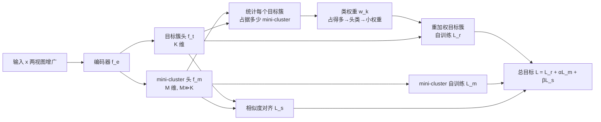

# Mini-cluster Guided Long-tailed Deep Clustering

**会议**: ICLR 2026  
**OpenReview**: [https://openreview.net/forum?id=3JlljaiQwR](https://openreview.net/forum?id=3JlljaiQwR)  
**代码**: [https://github.com/LZX-001/MiniClustering](https://github.com/LZX-001/MiniClustering)  
**领域**: 自监督 / 深度聚类 / 长尾学习  
**关键词**: 深度聚类, 长尾分布, 无监督重加权, mini-cluster, 自标注  

## 一句话总结
本文提出 MiniClustering，用一个"细粒度过度聚类"的额外聚类头估计出每个目标簇被多少个 mini-cluster 占据，以此在**完全无标签**的条件下推断各类的头/尾属性并重加权自训练损失，把监督长尾学习的 re-weighting 思想首次系统地引入深度聚类。

## 研究背景与动机
- **领域现状**：深度聚类（deep clustering）近年进展显著，主流做法要么先用对比学习/自编码器学表征再 K-means，要么挂一个聚类头用伪标签自训练。但几乎所有方法都默认数据**类别均衡**。
- **现有痛点**：真实数据普遍呈**长尾分布**——头部类样本多、尾部类样本少。模型会偏向头部类、压垮尾部类，聚类性能大幅下降。监督长尾学习（re-sampling / re-weighting / logit adjustment）虽成熟，但**全部依赖标签频率**作为先验。
- **核心矛盾**：深度聚类是**彻底无监督**的，拿不到标签频率，无法直接套用任何监督长尾重平衡策略。如何在没有标签的情况下估出"哪些类是头、哪些类是尾、各该加多大权重"是悬而未决的难题。
- **本文目标**：在无监督设定下估计每个类的训练权重，把 re-weighting 自训练损失用到长尾深度聚类上，缓解模型偏置。
- **核心 idea**：**过度聚类暴露长尾结构**——把数据聚成远多于真实类数的 mini-cluster 后，头部类因占据更大嵌入空间会被拆进**更多** mini-cluster，尾部类则被挤进**更少**。于是"某个目标簇关联了几个 mini-cluster"就成了头/尾属性的无监督代理指标，可直接换算成重加权权重。

## 方法详解

### 整体框架
MiniClustering 建立在自标注（self-labeling）聚类头范式上，网络含三个部件：共享编码器 $f_e$（由 BYOL 等无监督表征学习预训练）、输出维度等于真实类数 $K$ 的**目标簇头** $f_t$、以及输出维度 $M \gg K$ 的**mini-cluster 头** $f_m$。两头共用嵌入但粒度不同：$f_m$ 做细粒度过度聚类暴露长尾结构，$f_t$ 产出最终聚类预测。训练由三个损失联合驱动——mini-cluster 自训练、重加权的目标簇自训练、以及把两头预测对齐的相似度损失。

### 关键设计
**1. 过度聚类把长尾结构"显影"出来：mini-cluster 头**　作者先观察到三个现象：在长尾 CIFAR-10 上，头部类占据更大嵌入空间因而被 K-means 切成多个簇，尾部类则被迫与他类共享一个簇（现象 1）；把数据聚成比真实类数更多的簇能整体提升纯度（现象 2，purity 随簇数单调上升）；据此引入的细粒度簇即 mini-cluster，头部类被分到的 mini-cluster 数量始终显著多于尾部类，且这一规律对不同表征方法、不同 $M$、不同阈值 $\delta$ 都稳健（现象 3）。$f_m$ 用基于置信度阈值 $\tau$ 的自标注交叉熵训练，$L_m = -\frac{1}{|S^m_\tau|}\sum_{i\in S^m_\tau}\sum_{j=1}^{M} y^m_{i,j}\log(p^m_{i,j})$，其中 $S^m_\tau=\{i\mid c^m_i>\tau\}$ 只保留高置信样本，从而产出可靠的细粒度伪标签作为后续权重估计的基础。论文还给出 Theorem 1：当 mini-cluster 最小纯度 $\rho > \frac{N_j S_{\max}}{(N_i-\epsilon_i)S_{\min}}$ 时，样本更多的类必然占据更多 mini-cluster，把"过度聚类→头类占更多"从经验现象升格为有条件成立的定理——这也解释了为何必须先做高质量表征预训练（否则 $\rho$ 太低、$\epsilon_i$ 太大会让结论失效）。

**2. 用"占了几个 mini-cluster"无监督估权重并重加权自训练**　这是把监督长尾思想搬进无监督聚类的关键一跃。对目标簇 $k$，统计有多少个 mini-cluster 被它"占据"（即该 mini-cluster 中归到目标簇 $k$ 的样本占比超过阈值 $\delta$），权重定义为 $w_k = \frac{M}{\max\left(\sum_{j=1}^{M}\mathbb{1}\left(\frac{|T_{k,j}|}{|T_j|}>\delta\right),\, 0.5\right)}$，其中 $T_{k,j}$ 是同时被预测到目标簇 $k$ 和 mini-cluster $j$ 的样本集合。分母越大（头部类占的 mini-cluster 多）权重越小，反之尾部类权重越大；下界 0.5 防止除零并让"一个 mini-cluster 都没占到"的极端尾类拿到更大权重。这是软分配——$\delta<0.5$ 时一个 mini-cluster 可被多个目标簇计入。随后把权重注入目标簇头的阈值自标注损失：$L_r = -\frac{1}{|S^t_\tau|}\sum_{i\in S^t_\tau}\sum_{j=1}^{K} w_{\hat{y}^t_i}\, y^t_{i,j}\log(p^t_{i,j})$，从而像监督 re-weighting 那样重平衡不同类的梯度贡献，缓解头部偏置。

**3. 相似度对齐防止两头"各练各的"失同步**　$f_t$ 与 $f_m$ 被不同损失更新，容易训练失同步，导致权重估计基于一套表征、聚类却走另一套，使重加权失效。作者用相似度图对齐：批内预测矩阵 $P^t\,(N\times K)$、$P^m\,(N\times M)$ 的自相似矩阵应当一致——在目标簇里相近的样本在 mini-cluster 里也应相近，故用 Frobenius 范数的 MSE 拉近，$L_s = \frac{1}{N^2}\lVert P^t P^{t\top} - P^m P^{m\top}\rVert_F^2$。总目标为 $L = L_r + \alpha L_m + \beta L_s$。训练用 K-means 中心初始化两头权重、bias 置零以加速收敛，最终用目标簇头的预测作为聚类结果。

## 实验关键数据

### 主实验表格
CIFAR-10 / CIFAR-20 / STL-10，imbalance ratio = 5 与 10，对比 SCAN、SeCu、LFSS、ConMix 等 SOTA，指标 ACC/CAA/NMI/ARI（%）。

| 数据集 (IR) | 方法 | ACC | CAA | NMI | ARI |
|---|---|---|---|---|---|
| CIFAR-10 (5) | ConMix | 61.6 | 65.4 | 59.8 | 45.6 |
| CIFAR-10 (5) | BYOL (Baseline) | 60.4 | 66.4 | 62.0 | 46.5 |
| **CIFAR-10 (5)** | **MiniClustering** | **74.3** | **72.6** | **69.9** | **62.1** |
| CIFAR-10 (10) | LFSS | 56.3 | 59.7 | 57.9 | 43.0 |
| CIFAR-10 (10) | BYOL (Baseline) | 51.9 | 55.2 | 56.3 | 41.7 |
| **CIFAR-10 (10)** | **MiniClustering** | **64.6** | **61.4** | **63.9** | **56.7** |
| **STL-10 (5)** | **MiniClustering** | **54.7** | **52.7** | **54.4** | **42.8** |
| **CIFAR-20 (10)** | **MiniClustering** | **44.3** | **41.5** | **47.2** | **30.4** |

在所有设置、所有指标上均取得最优；相对 BYOL 基线，CIFAR-10 在 IR=5/10 上 ACC 提升 13.9%/12.7%、ARI 提升 15.6%/15.0%。

### 消融实验表格
CIFAR-10，imbalance ratio = 10。

| 配置 | ACC | CAA | NMI | ARI |
|---|---|---|---|---|
| BYOL | 51.9 | 55.2 | 56.3 | 41.7 |
| 仅阈值自标注 | 55.6 | 57.6 | 66.3 | 52.5 |
| 去掉阈值 τ 约束 | 54.1 | 55.1 | 58.5 | 45.6 |
| 仅 $L_r$ | 59.9 | 58.1 | 63.5 | 52.0 |
| w/o $L_r$ | 46.7 | 39.0 | 51.1 | 26.7 |
| w/o $L_m$ | 64.5 | 43.6 | 65.4 | 50.3 |
| w/o $L_s$ | 56.0 | 57.6 | 63.5 | 40.0 |
| **完整 MiniClustering** | **64.6** | **61.4** | **63.9** | **56.7** |

### 关键发现
- **重加权策略是性能主因**：仅用自标注训练单个目标簇头虽超基线，但 ACC/CAA 远逊于完整方法，证明 mini-cluster 引导的重加权确实有效。
- **$L_m$ 专治尾类被吞**：去掉 $L_m$ 后 NMI 反而高但 CAA 暴跌至 43.6，说明纯自标注倾向把尾类样本并进其他簇，$L_m$ 帮助把尾类分离出来。
- **$L_r$ 与 $L_s$ 缺一不可**：无 $L_r$ 则目标簇头权重不更新、性能崩到 ARI 26.7；无 $L_s$ 两头失同步、ARI 掉到 40.0。
- **即插即用**：换 SimCLR / MoCo 作预训练框架，MiniClustering 仍稳定优于各自基线，证明它能作为通用下游模块；还能把监督长尾损失迁移到无监督聚类。

## 亮点与洞察
- **把无监督长尾"显影"问题转化为过度聚类计数问题**：不去直接估标签频率，而是借 mini-cluster 占据数这一可观测代理量，巧妙绕开"无标签"硬约束，思路干净。
- **现象→定理→方法三段闭环**：先观测到头类占更多 mini-cluster，再用 Theorem 1 给出成立条件，最后把条件（需高质量表征）落到预训练设计上，逻辑自洽。
- **范式级贡献**：首次把监督长尾学习的 class-level re-weighting 系统迁移到深度聚类，且能当作现有表征学习管线的通用下游插件，并把多种监督长尾损失"适配"成无监督版本。

## 局限与展望
- **依赖高质量预训练表征**：Theorem 1 明确指出表征质量差（$\rho$ 低、$\epsilon$ 大）时"头类占更多 mini-cluster"会失效，方法对编码器质量敏感。
- **超参较多**：mini-cluster 数 $M$、分配阈值 $\delta$、置信阈值 $\tau$、$\alpha/\beta$ 都需调，论文虽显示对 $M/\delta$ 较稳健，但跨数据集的通用设定仍需经验。
- **类数 $K$ 仍是已知先验**：和多数深度聚类一样假设真实类数已知，真正未知类数的开放场景未覆盖。
- **极端长尾与大规模**：正文主验在 IR≤10 的中小数据集，ImageNet-LT / Tiny-ImageNet 等更大规模与极端不平衡的鲁棒性放在附录，值得正文进一步展开。

## 相关工作与启发
- **深度聚类**：分表征学习派（IDFD、ProPos）与聚类头派（SCAN、SeCu、CC），本文属后者并显式针对长尾。
- **监督长尾学习**：re-sampling、re-weighting（Cui et al. 2019、Ren et al. 2020）、logit adjustment（Menon et al. 2021）——本文借用 re-weighting 的"按频率分配权重"内核，但用 mini-cluster 计数替代标签频率。
- **无监督长尾**：SDCLR 等聚焦长尾下的表征学习，但不保证嵌入对聚类可分；本文直接训练聚类头补上这一缺口。
- **启发**：当某个监督先验（标签频率）不可得时，可以寻找一个由模型自身结构暴露出来的**可观测代理量**（这里是过度聚类的占据计数）来近似它——这一"用更细粒度的自标注暴露隐藏结构"的范式，或可迁移到无监督下的其他类别不平衡/难度估计问题。

## 评分
- **新颖性**: ⭐⭐⭐⭐⭐ 首次把监督长尾 re-weighting 系统引入无监督深度聚类，用 mini-cluster 占据数作无监督权重代理，配套定理支撑，思路新颖且自洽。
- **实验充分度**: ⭐⭐⭐⭐ 5 数据集、两档不平衡率、10 个 SOTA 对比、完整消融 + 跨框架 + 监督损失迁移；扣分在极端长尾与大规模主要放附录。
- **写作质量**: ⭐⭐⭐⭐ 现象→定理→方法的叙事清晰，图表充分；超参与符号略多但交代到位。
- **价值**: ⭐⭐⭐⭐⭐ 即插即用的下游模块、可适配多种监督长尾损失，直击真实长尾数据下深度聚类崩溃的痛点，实用价值高。

<!-- RELATED:START -->

## 相关论文

- [\[CVPR 2026\] Nonparametric Deep Fine-grained Clustering with Low-Rank Guided Vision-Language Model](../../CVPR2026/self_supervised/nonparametric_deep_fine-grained_clustering_with_low-rank_guided_vision-language_.md)
- [\[ICLR 2026\] GUIDE: Gated Uncertainty-Informed Disentangled Experts for Long-tailed Recognition](guide_gated_uncertainty-informed_disentangled_experts_for_long-tailed_recognitio.md)
- [\[ICLR 2026\] Learning Dynamics of Logits Debiasing for Long-Tailed Semi-Supervised Learning](learning_dynamics_of_logits_debiasing_for_long-tailed_semi-supervised_learning.md)
- [\[ICLR 2026\] CoLA: Co-Calibrated Logit Adjustment for Long-Tailed Semi-Supervised Learning](cola_co-calibrated_logit_adjustment_for_long-tailed_semi-supervised_learning.md)
- [\[CVPR 2026\] Reframing Long-Tailed Learning via Loss Landscape Geometry](../../CVPR2026/self_supervised/reframing_long-tailed_learning_via_loss_landscape_geometry.md)

<!-- RELATED:END -->
