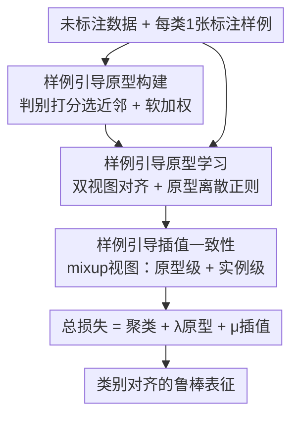

# One-Shot Exemplars for Class Grounding in Self-Supervised Learning

**会议**: ICLR 2026  
**OpenReview**: [https://openreview.net/forum?id=Anv4gdNFaL](https://openreview.net/forum?id=Anv4gdNFaL)  
**代码**: 无  
**领域**: 自监督 / 表示学习  
**关键词**: 自监督学习, 类别接地, 单样例标注, 原型学习, 插值一致性

## 一句话总结
本文提出 OSESSL（One-Shot Exemplar SSL）设定——每个类只给一张标注图，用这极稀疏的监督把自监督学到的特征"接地"到真实类别空间；方法用标注样例 + 判别近邻构建类原型来对齐未标注数据，并用插值一致性平滑决策边界，在 CIFAR-100 / ImageNet-100 上 k-NN 准确率比 SOTA 高约 3% / 6%。

## 研究背景与动机
**领域现状**：聚类式自监督学习（SwAV、DINO、ReSA 等）目前是主流，它们把同一张图的不同增强视图聚到相同的簇/原型上，在分类、检测、分割等下游任务里表现很强。

**现有痛点**：这类方法在预训练时**完全不指定类别空间**——模型只知道"哪些样本该靠近"，却不知道真实类别长什么样。于是涌现出来的簇很难保证和人类定义的真实类别对齐，下游任务一旦有内在的类别结构（绝大多数分类任务都是），学到的表征效果就会打折。

**核心矛盾**：自监督的自生成监督信号与真实语义类别之间存在天然鸿沟，这正呼应了机器学习里的"没有免费午餐"定理——没有任何关于目标类别的信息，就无法保证表征朝正确语义方向收敛。但要补上类别信息，传统半监督/监督做法需要的标注量随样本规模线性增长，代价太大。

**本文目标**：能不能用**极少**的标注（少到与样本规模无关）就把这道鸿沟补上？拆成两个子问题：(1) 如何只用每类一张标注图就暴露真实类别空间；(2) 如何把这点稀疏监督**传播**到海量未标注数据而不过拟合、不坍缩。

**切入角度**：实际场景里类别数增长远慢于样本数，所以"每类一张标注"的总标注复杂度对样本量是 $O(1)$，几乎可忽略。作者由此提出极端的 one-shot 设定，把这一张图当作类的"语义锚点"。

**核心 idea**：用每类一个标注样例（exemplar）构建"接地"的类原型，再通过对齐与插值一致性，把这点稀疏监督扩散到全部未标注数据。

## 方法详解

### 整体框架
方法要解决的是"如何用每类一张标注图，把自监督表征接地到真实类别"。整体 pipeline 是：先用标注样例从未标注数据里挑判别性近邻拼出**类原型**（让原型既扎根真实类别、又足够代表数据分布）；再用这些原型去**对齐**未标注数据两个增强视图的分配分布，把监督从样例传到未标注主体，同时加离散正则防止原型坍缩；最后把样例引导**扩展到插值空间**，对 mixup 出来的中间样本施加一致性约束，平滑决策边界。三块损失加在基础聚类损失上联合训练，输出是类别对齐、判别性更强的表征。

### 关键设计

**1. OSESSL 设定：用每类一个标注样例暴露真实类别空间**

这是论文的问题层贡献。给定未标注集 $D_u=\{x_u^{(1)},\dots,x_u^{(N)}\}$ 和每类仅一张的标注集 $D_l=\{x_l^{(1)},\dots,x_l^{(C)}\}$（$C$ 为类别数），目标是同时利用两者预训练。作者刻意把它和已有范式区分开：半监督学习用标签**直接训练分类边界**、少样本学习关注**分类未见类别**，而 OSESSL 只把单个样例当**语义锚点**去暴露类空间、引导表征学习，标注规模随类别数（而非样本数）增长，复杂度对样本量是 $O(1)$。这个看似极简的设定恰好对症"没有免费午餐"——用最小的代价给自监督补上它缺失的那一点类别先验。

**2. 样例引导的原型构建：让一张图扩成既接地又有代表性的原型**

只用一张标注图直接当原型，代表性太弱、噪声太大。作者维护一个先进先出的记忆库 $\mathcal{M}=\{m^{(1)},\dots,m^{(M)}\}$ 存历史未标注嵌入，对每个类用一个**判别打分**从中挑近邻：

$$s^{(c)}(j) = \alpha\langle z_l^{(c)} \cdot m^{(j)}\rangle - (1-\alpha)\max_{c'\neq c}\langle z_l^{(c')}\cdot m^{(j)}\rangle$$

第一项要求样本与本类样例**相似**，第二项惩罚它与最近的其它类样例的相似度，即既要"像本类"又要"不像别的类"。取 top-$k$ 近邻 $S_c$ 与样例拼成集合 $P^{(c)}=\{z_l^{(c)}\}\cup\{m^{(j)}\mid j\in S_c\}$（$|P^{(c)}|=k+1$）。为压制假阳性，再按各成员与样例的相似度算软权重 $\pi^{(c,j)}=\mathrm{softmax}(\langle z_l^{(c)}\cdot q^{(c,j)}\rangle)$，最终原型 $c^{(c)}=\sum_j \pi^{(c,j)} q^{(c,j)}$。和 SwAV/DINO 那种纯从无监督聚类涌现的原型不同，这里的原型**显式扎根在样例上**，因此天然与真实类别对齐。

**3. 样例引导的原型学习：把稀疏监督通过对齐传播给未标注数据**

有了接地原型，还要让它真正去引导未标注数据的学习。对一对未标注嵌入 $z,z'$，分别用温度 $\tau_s,\tau_t$ 算它们对 $C$ 个原型的分配分布 $p^{(i,c)},p'^{(i,c)}$，再用交叉熵对齐两视图：$L_{align}=-\frac1n\sum_i\sum_c p'^{(i,c)}\log p^{(i,c)}$。作者推导其梯度为 $\nabla_z L_{align}=(\mathbb{E}_p[c]-\mathbb{E}_{p'}[c])/\tau_s$，说明每个未标注嵌入都被**拉向由样例引导的目标分布所规定的原型质心**——这正是稀疏监督被"传播"出去、表征被推向正确语义方向的机制，也是它优于无类别接地的聚类法的关键。但单靠对齐无法阻止**原型坍缩**（不同类原型收敛到相似表示），故再加对比式离散正则 $L_{disp}=\frac{1}{C(C-1)}\sum_{c\neq c'}\langle c^{(c)}\cdot c^{(c')}\rangle/\tau_s$ 让原型互相排斥、保持多样。两者合为 $L_{proto}=L_{align}+L_{disp}$。

**4. 样例引导的插值一致性：在决策边界附近补上平滑约束**

样例稀疏，导致在**决策边界附近**原型的引导力不足，分配不稳、泛化变差。作者把样例引导扩展到插值空间：对一对视图做 mixup $x_m=\beta x+(1-\beta)\tilde{x}'$，$\beta\sim\mathrm{Beta}(\zeta,\zeta)$（$\tilde{x}'$ 是打乱后的 $x'$），然后从两个互补视角约束混合样本。**原型视角** $L_{mix\text{-}proto}$ 要求混合嵌入对原型的分配分布与两视图分配的线性插值 $p_m'^{(i)}=\beta p^{(i)}+(1-\beta)\tilde p'^{(i)}$ 一致，提供全局语义正则；**实例视角** $L_{mix\text{-}ins}$ 用 mini-batch 内的索引伪标签 $y_m=\beta y+(1-\beta)\tilde y$ 约束混合嵌入与实例的相似分布，提供局部判别。二者合为 $L_{mix}=L_{mix\text{-}proto}+L_{mix\text{-}ins}$，把样例语义同时在语义级与实例级上扩散，使不确定区域的决策更平滑。

### 损失函数 / 训练策略
总损失由基础聚类对齐损失、原型学习损失、插值一致性损失三部分组成：

$$L = L_{cluster} + \lambda L_{proto} + \mu L_{mix}$$

其中 $\lambda,\mu$ 为正权重系数。实现上以 ReSA 为聚类式基线，骨干用 ResNet 和 ViT；原型构建时每类选 8 个近邻，温度固定 $\tau_s=0.1$、$\tau_t=0.04$，判别打分权重 $\alpha=0.75$。CIFAR 上三项损失等权，ImageNet 上把 $\mu$ 调到 0.25。

## 实验关键数据

### 主实验
ResNet-18，CIFAR 训 1000 epoch、ImageNet-100 训 400 epoch 下的线性/​k-NN（k=5）准确率：

| 数据集 | 指标 | 本文 | ReSA(之前SOTA) | 提升 |
|--------|------|------|----------|------|
| CIFAR-10 | k-NN | 94.20 | 93.02 | +1.2 |
| CIFAR-100 | linear | 75.47 | 72.21 | +3.3 |
| CIFAR-100 | k-NN | 69.89 | 66.83 | +3.1 |
| ImageNet-100 | linear | 83.88 | 82.24 | +1.6 |
| ImageNet-100 | k-NN | 80.42 | 74.56 | +5.9 |

ImageNet-1K（ResNet-50，线性评估）也全面领先：256 batch、200 epoch 达 74.6%，1024 batch、800 epoch 达 76.4%，超过 ReSA、MoCoV3 等；甚至超过用 1% 标注（12,811 个标签）的半监督方法 PAWS / Suave，而本文仅用 1,000 个标签。用 1% 标注（标 `Ours∗`）还能进一步升到 76.8%。ViT-S/16（ImageNet-1K，300 epoch）线性 74.7 / k-NN 70.9，同样最优，说明对 Transformer 骨干也适配。

### 分析实验
跨任务的迁移与半监督验证（ResNet-50，ImageNet-1K 预训练）：

| 设置 | 指标 | 本文 | ReSA | 说明 |
|------|------|------|------|------|
| 半监督 1% 标注 | top-1 | 61.3 | 56.4 | 微调 1% 子集 |
| 半监督 10% 标注 | top-1 | 72.5 | 70.4 | 微调 10% 子集 |
| 迁移 Food-101 | k-NN(20) | 64.2 | 61.3 | 细粒度，+2.9 |
| 迁移 CUB-200 | k-NN(20) | 60.5 | 59.9 | 细粒度 |
| 迁移 Pets-37 | k-NN(20) | 88.3 | 87.5 | 细粒度 |

> ⚠️ 缓存正文未含逐损失项的消融数值表（在附录中，本地缓存未收录），故此处用半监督/迁移的跨任务结果代替分析表；按论文设计，去掉 $L_{disp}$ 会导致原型坍缩、去掉 $L_{mix}$ 会削弱决策边界平滑性，具体数值以原文附录为准。

### 关键发现
- 增益在 **k-NN** 指标上比线性更明显（ImageNet-100 k-NN +5.9 vs 线性 +1.6），说明类别接地主要改善了**邻域一致性/可分性**，即嵌入空间结构更干净，T-SNE 可视化也佐证了这点。
- 仅用 1,000 个标签就压过用 12,811 个标签的半监督方法，验证了"每类一张样例"这点极稀疏监督的高性价比。
- 在细粒度迁移（Food-101 等类间相似、类内多变的任务）上提升更突出，说明接地后的表征对细微类别差异更敏感。

## 亮点与洞察
- **把"问题设定"本身当贡献**：OSESSL 用 $O(1)$ 标注复杂度撬动自监督的类别接地，这种"花最小代价补最关键先验"的思路很有迁移价值——它把半监督里"标注量随样本线性增长"的桎梏直接拆掉了。
- **判别打分选近邻**很巧妙：$\alpha\langle\text{本类}\rangle-(1-\alpha)\max_{c'}\langle\text{他类}\rangle$ 一行公式同时编码"像本类"和"不像他类"，比纯相似度近邻更能挑出判别性样本来撑起原型。
- **梯度推导讲清了"为什么对齐能传播监督"**：把 $\nabla_z L_{align}$ 化简成"拉向样例引导的原型质心"，让"稀疏监督如何扩散"从直觉变成可验证的机制。
- 插值一致性同时从原型级（全局语义）和实例级（局部判别）两个视角约束 mixup 样本，这种"双视角正则"可复用到其它需要平滑决策边界的表示学习任务。

## 局限与展望
- 作者承认方法依赖"每类至少有一张**干净**样例"的假设；在标注有噪声的场景下效果可能受损，未来计划扩展到噪声样例设定。
- 单样例对"类内高度多模态"的类别（一张图代表不了整类分布）可能代表性不足，靠近邻补救但近邻质量又依赖记忆库与初始特征的好坏，存在冷启动风险。
- 本地缓存未含逐项消融与超参敏感性数值，$\lambda,\mu,\alpha,k$ 的鲁棒性需查附录确认；ImageNet 上 $\mu$ 需手调到 0.25 也暗示插值项权重对数据集较敏感。
- 改进思路：把单样例升级为"原型分布"（如可学习的多模态原型）以覆盖类内多样性，或引入对噪声样例的鲁棒打分。

## 相关工作与启发
- **vs 聚类式 SSL（SwAV / DINO / ReSA）**：它们的原型纯从无监督聚类涌现、不保证对齐真实类别；本文原型显式扎根标注样例，区别在于"有没有类别接地"，因此在有内在类别结构的下游任务上更稳。
- **vs 监督对比 / 半监督（SupCon / PAWS / Suave）**：它们假设有与样本规模成正比的充足标注、且常直接训分类边界；本文只用每类一张样例当语义锚点引导表征，标注代价与样本量解耦，却能在 1% 标注预算下反超它们。
- **vs 少样本学习**：少样本聚焦"分类未见类别"，本文用样例做"接地已知类空间"，目标不同——前者学泛化到新类，后者修正自监督与已知语义的错配。

## 评分
- 新颖性: ⭐⭐⭐⭐⭐ 提出 OSESSL 新设定，用 $O(1)$ 标注做类别接地，角度干净
- 实验充分度: ⭐⭐⭐⭐ 覆盖 CIFAR/ImageNet、CNN/ViT、迁移/半监督，但缓存未见逐项消融数值
- 写作质量: ⭐⭐⭐⭐ 动机—机制—梯度推导链条清晰，图文对应好
- 价值: ⭐⭐⭐⭐⭐ 极低标注代价换显著增益，设定与方法都有迁移潜力

<!-- RELATED:START -->

## 相关论文

- [\[ICLR 2026\] On the Alignment Between Supervised and Self-Supervised Contrastive Learning](on_the_alignment_between_supervised_and_self-supervised_contrastive_learning.md)
- [\[ICLR 2026\] Two-Way is Better Than One: Bidirectional Alignment with Cycle Consistency for Exemplar-Free Class-Incremental Learning](two-way_is_better_than_one_bidirectional_alignment_with_cycle_consistency_for_ex.md)
- [\[ICLR 2026\] Understanding the Learning Phases in Self-Supervised Learning via Critical Periods](understanding_the_learning_phases_in_self-supervised_learning_via_critical_perio.md)
- [\[ICLR 2026\] Equivariant Splitting: Self-supervised learning from incomplete data](equivariant_splitting_self-supervised_learning_from_incomplete_data.md)
- [\[ICLR 2026\] Soft Equivariance Regularization for Invariant Self-Supervised Learning](soft_equivariance_regularization_for_invariant_self-supervised_learning.md)

<!-- RELATED:END -->
